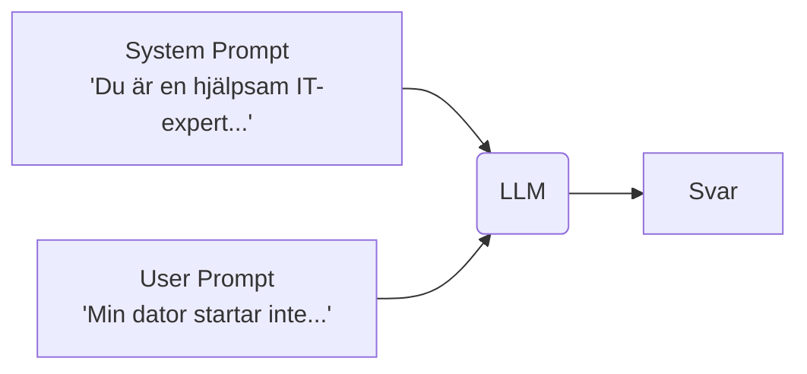
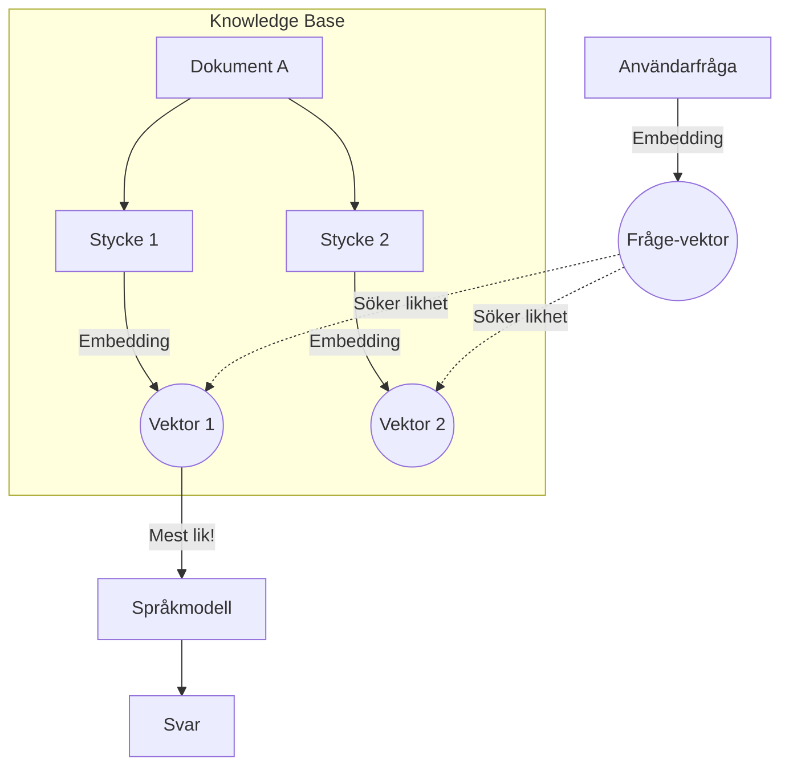

# 0. Begrepp och Teori

Innan vi hoppar in i Copilot Studio ska vi gå igenom några grundläggande begrepp. Att förstå hur "hjärnan" bakom agenten fungerar gör det mycket lättare att bygga bra lösningar.

---

## 🧠 Språkmodeller (LLMs)

En **LLM** (Large Language Model) är ett stort neuralt nätverk tränat på enorma mängder data. Den har statistiskt lärt sig mönster i språket och fått en "inbakad" förståelse för världen.

Det är viktigt att veta att en språkmodell inte läser ord som vi gör. Dess alfabet består av **Tokens**.

* En token är en del av ett ord (vanligt förekommande bokstavskombinationer).

* Som tumregel: 1000 tokens motsvarar ungefär 750 ord.

---

## 📏 Kontextlängd (Korttidsminnet)

Varje modell har en begränsning i hur mycket information den kan hålla i huvudet samtidigt. Detta kallas **Context Window** eller kontextlängd.

* Du kan se det som modellens **korttidsminne**.
* Om du skickar in en bok på 1000 sidor till en modell med litet minne, kommer den att glömma början innan den läst klart slutet.
* Moderna modeller (som GPT-5) har stora kontextfönster (över 400k tokens), men precisionen kan sjunka om man fyller dem till bredden.

---

## 💬 Prompts

En prompt är instruktionen vi skickar till modellen. I Copilot Studio jobbar vi främst med två typer:

1.  **System Prompt:** Detta är "instruktionsboken" för agenten. Här definierar vi vem agenten är, vad den får göra och vilken ton den ska ha.
2.  **User Prompt:** Detta är vad användaren skriver i chatten (frågan).

Dessa slås ihop när modellen ska generera sitt svar:

---

## 📚 RAG (Retrieval Augmented Generation)

En språkmodell kan mycket, men den kan inte *allt*. Den vet ingenting om ditt företags interna dokument, manualer eller hemligheter. För att lösa detta använder vi **RAG**.

RAG handlar om att hämta (Retrieve) rätt information och ge den till modellen.

### Hur fungerar det? (Vektorer och Embeddings)

För att datorn ska kunna söka i text måste vi göra om text till siffror (Vektorer/Embeddings).

1.  Vi tar en PDF (t.ex. en manual).
2.  Vi delar upp den i små stycken (**Chunks**).

    

3.  Varje stycke omvandlas till en **Vektor** (en lista med siffror som representerar *betydelsen*).

    

4.  När användaren ställer en fråga, görs även frågan om till en vektor.
5.  Vi letar upp de stycken som ligger närmast frågan matematiskt och skickar dem till AI:n.

    

#### Visualisering av RAG
*Här ser du hur en vektor (frågan) matchas mot en rymd av kunskap.*

---

## 🤖 Vad är en AI-Agent?

Microsoft pratar ofta om tre nivåer av automatisering. Det är viktigt att förstå skillnaden på ett "Workflow" och en "Agent".

### 1. Conversational Agent (Chatbot++)
Detta är en språkmodell som har fått tillgång till verktyg (Tools). Den pratar med en människa och kan utföra uppgifter på kommando, t.ex. söka på nätet eller kolla kalendern.
* **Exempel:** "Boka ett möte med Anna kl 14."

### 2. Autonomous Agent
Dessa agenter behöver inte en människa som startar dem. De kan triggas av händelser, t.ex. att ett mejl kommer in eller att klockan slår 08:00. De arbetar självständigt i bakgrunden.
* **Exempel:** En agent som övervakar en inkorg dygnet runt.

### 3. Workflow vs. Agent
Detta är den viktigaste skillnaden i design:

* **Workflow (Process):** En förutbestämd väg. Steg 1 leder alltid till Steg 2. Det är stabilt men flexibelt.

    

* **Agent (Dynamisk):** Agenten får ett mål och en låda verktyg. Agenten bestämmer *själv* i vilken ordning den ska använda verktygen för att nå målet.

    

---

Nu när vi har begreppen på plats är det dags att börja bygga! Klicka på nästa kapitel för att sätta upp din miljö.