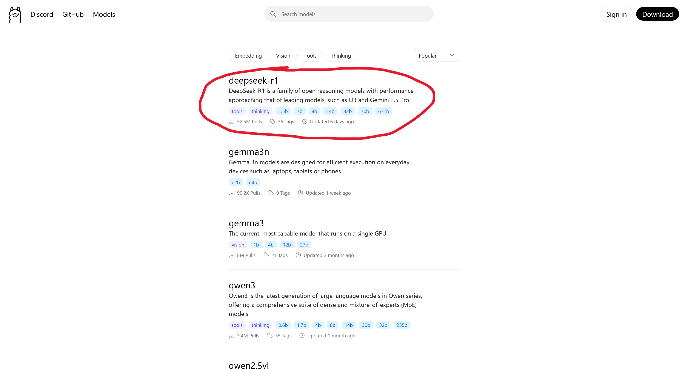
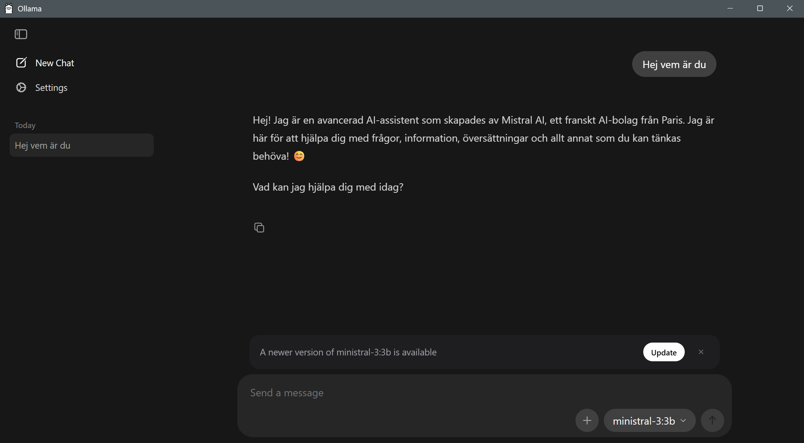
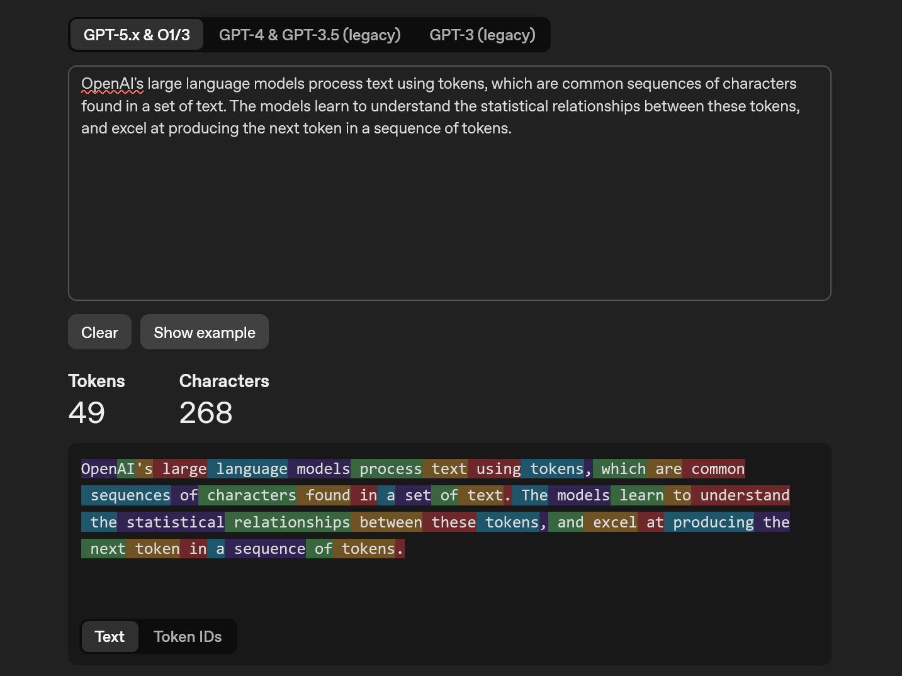
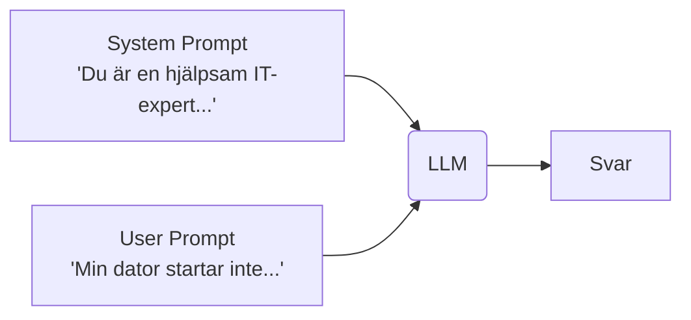
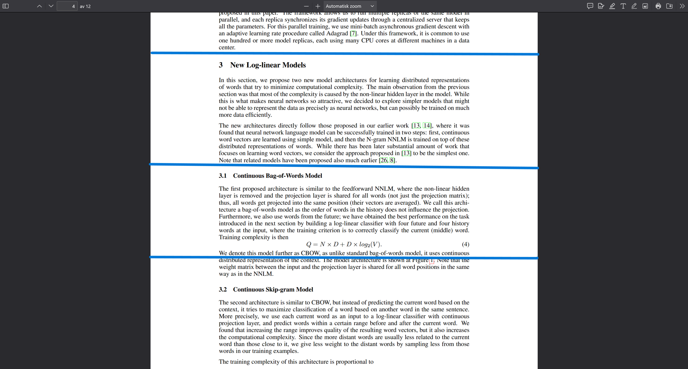
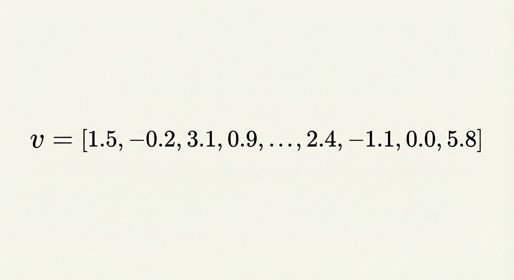
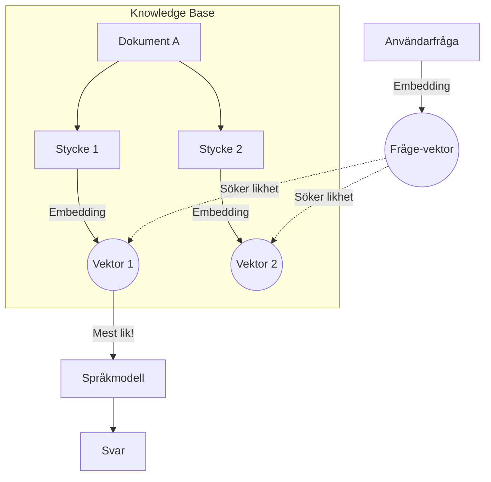
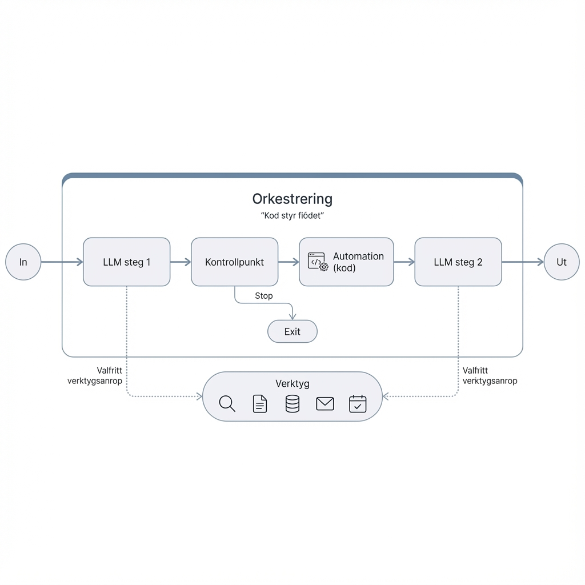
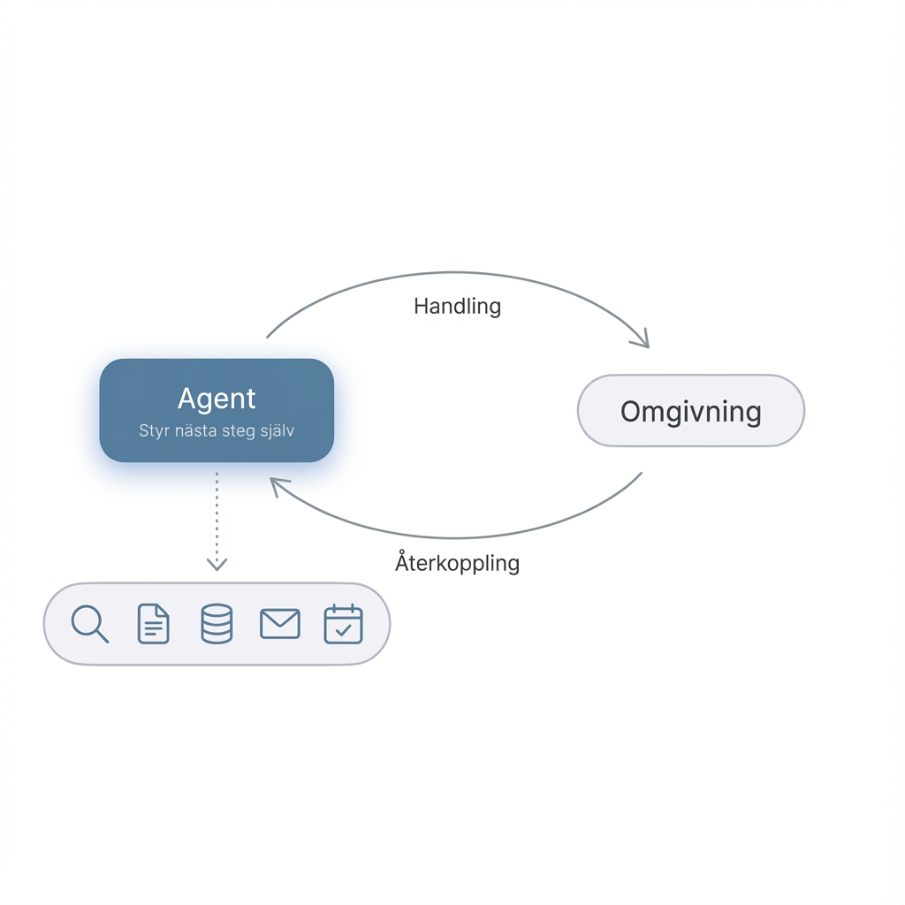

# 0. Begrepp och Teori

Innan vi hoppar in i Copilot Studio ska vi gå igenom några grundläggande begrepp. Att förstå hur "hjärnan" bakom agenten fungerar gör det mycket lättare att bygga bra lösningar.

---

## 🧠 Språkmodeller (LLMs)

En **LLM** (Large Language Model) är ett stort neuralt nätverk som tränas på enorma mängder text och annan data. Under träningen lär sig modellen statistiska mönster i språk: vilka ord som ofta hör ihop, hur meningar byggs upp och vilka samband som brukar finnas mellan olika begrepp.

### Vad är det som faktiskt tränas?

När man tränar en språkmodell justerar man **miljontals eller miljarder parametrar**. Dessa parametrar kallas ofta för modellens **vikter**. Du kan tänka på dem som ett enormt antal små inställningar som tillsammans avgör hur modellen reagerar på olika ord och sammanhang.

Efter träningen är det dessa vikter som i praktiken är själva modellen. Därför kan man pedagogiskt säga att en språkmodell är som en **väldigt stor modellfil** som innehåller allt modellen har lärt sig.

### Vad händer när modellen körs?

När du skriver en fråga börjar modellen inte "tänka" som en människa. I stället gör den väldigt många beräkningar för att förutsäga vilken token som mest sannolikt ska komma härnäst, sedan nästa, och sedan nästa igen tills svaret är klart.

Det är därför **GPU:er** har blivit så viktiga inom AI:

* En **CPU** är bra på generell logik, styrning och sekventiellt arbete.
* En **GPU** är byggd för att göra väldigt många beräkningar parallellt.

Just den typen av massiv parallellism passar språkmodeller mycket bra. För att det ska gå snabbt behöver modellens vikter och arbetsminne finnas nära beräkningen, oftast i grafikkortets minne, alltså **VRAM**.

### Olika storlekar på modeller

När du ser modellnamn som `3B`, `7B`, `14B` eller `27B` betyder `B` **miljarder parametrar**.

Små och medelstora öppna modeller går ofta att köra lokalt på en kraftigare laptop eller stationär dator. Större modeller kräver däremot betydligt mer RAM, mer VRAM eller flera GPU:er.

Här ser du ett exempel på hur samma modellfamilj kan finnas i flera storlekar:

| Modellfamilj | Exempel på storlekar | Typiskt användningsområde |
| --- | --- | --- |
| Gemma 3 | `1B`, `4B`, `12B`, `27B` | Lokal körning i olika nivåer |
| Qwen 3 | `0.6B`, `1.7B`, `4B`, `8B`, `14B`, `30B` | Från små tester till större lokala modeller |
| DeepSeek-R1 | `1.5B`, `7B`, `8B`, `14B`, `32B`, `70B`, `671B` | Från lokala resonemangsmodeller till serverklass |
| Ministral 3B | `3B` | Liten modell som är lättare att köra lokalt |

!!! note "Exempel på lokal körning"
    Här nedan ser du att jag kör modellen `ministral-3:3b` lokalt i Ollama. I det här fallet sker beräkningarna alltså på min egen dator i stället för i ett moln.

### Var "bor" modellen?

Det här är en viktig mental modell att ha med sig:

* En **lokal modell** ligger på din egen dator och körs av din egen hårdvara.
* En **molnmodell** ligger på leverantörens servrar och körs där.

Om du använder ChatGPT sker beräkningarna hos OpenAI. Om du använder **Copilot Studio** sker beräkningarna normalt inte på din dator, utan i Microsofts moln. Microsoft beskriver Copilot-funktionerna som byggda på **Azure OpenAI**, vilket innebär att prompten skickas till Microsofts Azure-miljö, modellen bearbetar frågan där och svaret skickas tillbaka till dig.

Det betyder också att säkerhet och förtroende blir viktigt. När du använder en molnmodell behöver du lita på den leverantör som driver infrastrukturen. I Microsofts fall är poängen att modellen körs i deras Azure-miljö, inte via OpenAI:s publika ChatGPT-tjänst.

Många av de största modellerna som används i molntjänster idag är dessutom **closed source**. Då får vi använda dem, men vi får inte se exakt hur alla vikter ser ut eller ladda ner hela modellen själva.

---

## 🔤 Tokens

Det är viktigt att veta att en språkmodell inte läser ord som vi gör. Dess alfabet består av **tokens**.

* En token är ofta en del av ett ord, ett helt ord eller ett skiljetecken.
* Som tumregel: 1000 tokens motsvarar ungefär 750 ord.

Det betyder att modellen inte räknar i "sidor" eller "dokument", utan i hur många tokens som totalt skickas in och ut.

!!! tip "Prova själv"
    Vill du se hur din text delas upp i tokens? Testa att klistra in en mening i verktyget [OpenAI Tokenizer](https://platform.openai.com/tokenizer).

---

## 📏 Kontextlängd (Korttidsminnet)

Varje modell har en begränsning i hur mycket information den kan hålla i huvudet samtidigt. Detta kallas **Context Window** eller kontextlängd.

Du kan se det som modellens **korttidsminne**, men det är viktigt att förstå att detta är den **totala tokenbudgeten** för hela anropet, inte bara för användarens fråga.

I kontextfönstret ryms ofta allt detta samtidigt:

* systemprompten
* användarens fråga
* tidigare meddelanden i chatten
* information som hämtats via RAG eller verktyg
* modellens eget svar, alltså output tokens

Det betyder att om mycket plats redan används av instruktioner, historik eller hämtad kunskap, finns det mindre utrymme kvar för resten.

* Om du skickar in en bok på 1000 sidor till en modell med litet minne, kommer den att glömma början innan den läst klart slutet.
* Moderna modeller kan ha mycket stora kontextfönster, men det betyder inte att de använder hela fönstret lika bra.
* Om man fyller kontexten med för mycket eller halvrelevant information blir svaren ofta sämre. Detta kallas ibland för **context rot**.

---

## 💬 Prompts

En prompt är instruktionen vi skickar till modellen. I Copilot Studio jobbar vi främst med två typer:

1.  **System Prompt:** Detta är "instruktionsboken" för agenten. Här definierar vi vem agenten är, vad den får göra och vilken ton den ska ha.
2.  **User Prompt:** Detta är vad användaren skriver i chatten (frågan).

Dessa slås ihop när modellen ska generera sitt svar:

```mermaid
graph LR
    A[System Prompt\n'Du är en hjälpsam IT-expert...'] --> C(LLM)
    B[User Prompt\n'Min dator startar inte...'] --> C
    C --> D[Svar]
```

---

## 📚 RAG (Retrieval Augmented Generation)

En språkmodell kan mycket, men den kan inte *allt*. Den vet ingenting om ditt företags interna dokument, manualer eller hemligheter. För att lösa detta använder vi **RAG**.

RAG handlar om att hämta (Retrieve) rätt information och ge den till modellen.

Du kan också se RAG som ett sätt att hantera modellens kontextfönster. I stället för att skicka in hela dokument försöker systemet hitta de delar som verkar mest relevanta och bara skicka in dem.

### Hur fungerar det? (Vektorer och Embeddings)

För att datorn ska kunna söka i text måste vi göra om text till siffror (Vektorer/Embeddings).

1.  Vi tar en PDF (t.ex. en manual).
2.  Vi delar upp den i små stycken (**Chunks**).

    

3.  Varje stycke omvandlas till en **Vektor** (en lista med siffror som representerar *betydelsen*).

    

4.  När användaren ställer en fråga, görs även frågan om till en vektor.
5.  Vi letar upp de stycken som ligger närmast frågan matematiskt och skickar dem till AI:n.

    

#### Visualisering av RAG
*Här ser du hur en vektor (frågan) matchas mot en rymd av kunskap.*

```mermaid
graph TD
    subgraph Knowledge Base
    Doc1[Dokument A] --> Chunk1[Stycke 1]
    Doc1 --> Chunk2[Stycke 2]
    Chunk1 -- Embedding --> V1((Vektor 1))
    Chunk2 -- Embedding --> V2((Vektor 2))
    end
    
    User[Användarfråga] -- Embedding --> Q((Fråge-vektor))
    
    Q -.->|Söker likhet| V1
    Q -.->|Söker likhet| V2
    
    V1 -->|Mest lik!| LLM[Språkmodell]
    LLM --> Svar
```

### Hur märks detta i Copilot Studio?

I praktiken ser man ofta att Copilot Studio inte söker med exakt samma formulering som användaren skrev i chatten. Agenten kan först omformulera frågan till något som är mer sökbart, hämta några relevanta utdrag ur kunskapen och ibland göra ytterligare en sökning om första omgången inte räcker, särskilt med mer resonerande modeller eller tydliga instruktioner i systemprompten.

Det viktiga att förstå är att agenten då **inte ser hela dokumentmängden samtidigt**. Den ser bara de utdrag som retrieval-steget hittade och skickade vidare till modellen.

Det är därför RAG ofta fungerar bra när man vill hitta **specifik information**, men sämre när frågan kräver att modellen ska:

* räkna över många delar av ett dokument
* jämföra många avsnitt samtidigt
* förstå relationer som är utspridda över flera olika chunkar

Om svaret finns spritt över många delar av många dokument finns det en risk att retrieval-steget bara hämtar en del av det, och då kan modellen inte resonera över information som den aldrig fick se.

---

## 🤖 Vad är en AI-Agent?

Microsoft pratar ofta om två nivåer av AI-agenter. Det är viktigt att förstå skillnaden mellan ett "Agent flow" och en "Agent".

### 1. Konversations Agent (Chatbot++)
Detta är en språkmodell som har fått tillgång till verktyg (Tools). Den pratar med en människa och kan utföra uppgifter på kommando, t.ex. söka på nätet eller kolla kalendern.

* **Exempel:** "Boka ett möte med Anna kl 14."

### 2. Autonom Agent
Dessa agenter behöver inte en människa som startar dem. De kan triggas av händelser, t.ex. att ett mejl kommer in eller att klockan slår 08:00. De arbetar självständigt i bakgrunden.

* **Exempel:** En agent som övervakar en inkorg dygnet runt.

### 3. Workflows vs. Agent
Detta är den viktigaste skillnaden i design:

* **Workflows (Process):** En förutbestämd väg. Steg 1 leder alltid till Steg 2. Det är stabilt men mindre flexibelt.

    

* **Agent (Dynamisk):** Agenten får ett mål och en låda verktyg. Agenten bestämmer *själv* i vilken ordning den ska använda verktygen för att nå målet.

    

---

Nu när vi har begreppen på plats är det dags att börja bygga! Klicka på nästa kapitel för att sätta upp din miljö.
