# 0. Begrepp och Teori

Innan vi hoppar in i **Microsoft Copilot Studio** och faktiskt börjar bygga våra agenter ska vi gå igenom några grundläggande begrepp och AI-teknologier.

Det gör vi av tre skäl:

* för att förstå lite bättre vad som faktiskt sker bakom kulisserna i Copilot Studio
* för att få en inblick i vilka komponenter som behövs för att bygga effektiva AI-agenter
* för att få en bättre allmän förståelse för några av de viktigaste AI-teknologierna

Förhoppningen är att det här sedan ska göra det lättare att fatta bättre beslut, och att förstå både **möjligheter** och **begränsningar**, när vi väl börjar bygga i Copilot Studio.

---

## 🧠 Språkmodeller (LLMs)

En **LLM** (Large Language Model) är ett stort neuralt nätverk som tränas på enorma mängder text. Under träningen lär sig modellen statistiska mönster i språk: vilka ord som ofta hör ihop, hur meningar byggs upp och vilka samband som brukar finnas mellan olika begrepp. På så sätt blir språkmodellen ofta själva "hjärnan" i en AI-agent.

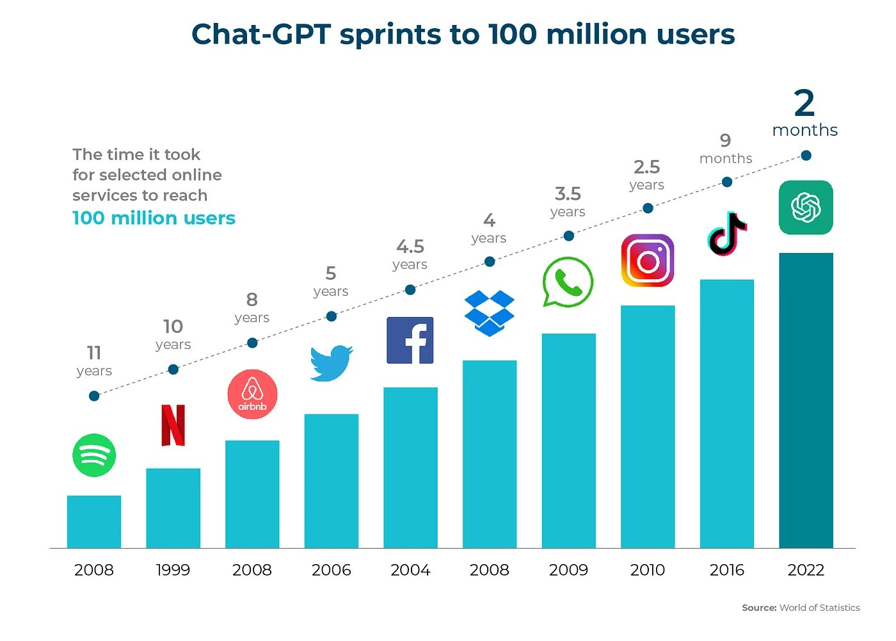

Språkmodeller var också en av de viktigaste orsakerna till att AI slog igenom så brett hos allmänheten. Sedan slutet av `2022` har utvecklingen gått extremt snabbt, och i dag ser vi inte bara bättre språkmodeller utan också kraftfulla bild- och videomodeller. I den här kursen kommer vi dock främst fokusera på språkmodeller, eftersom det är den viktigaste komponenten när vi bygger agenter i Copilot Studio.

*Utvecklingen inom generativ AI har inte bara gällt språkmodeller. Bildmodeller har också blivit betydligt bättre på kort tid.*

### Hur tränas modellen?

För att bygga en språkmodell räcker det inte med mycket data, modellen måste också **tränas**. Träningsdatan består i grunden av text: till exempel böcker, artiklar, webbsidor, diskussionsforum och transkriberat ljud eller video.

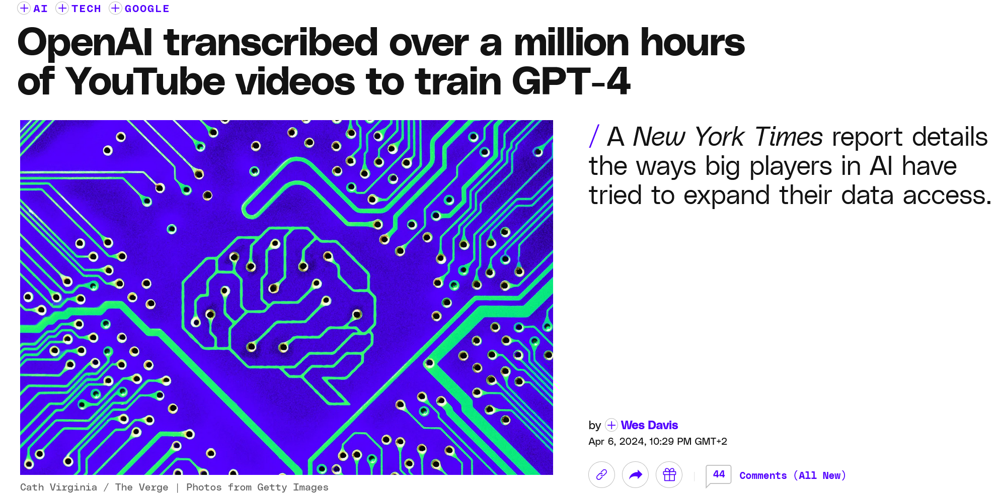

*Exempel på rapporterade uppgifter om hur träningsdata kan samlas in. Detta är inte en officiell eller komplett beskrivning av hur språkmodeller tränas, utan ett journalistiskt exempel. Läs mer i [The Verge](https://www.theverge.com/2024/4/6/24122915/openai-youtube-transcripts-gpt-4-training-data-google).*

Under träningen justerar man **miljontals eller miljarder parametrar**. Dessa parametrar kallas ofta för modellens **vikter**. Du kan tänka på vikterna som små rattar eller reglage i ett enormt system av ekvationer.

Förenklat kan man beskriva träningen så här:

1. Modellen får se text.
2. Den försöker gissa nästa del av texten.
3. Gissningen jämförs med det faktiska svaret.
4. Felet används för att justera vikterna lite grand.
5. Processen upprepas om och om igen på enorma mängder data.

I början är vikterna dåligt inställda, så modellen gissar ofta fel. Då använder man felet för att justera vikterna lite, testar igen och gör om samma sak. Det blir alltså en sorts styrd trial-and-error-loop där vikterna gradvis ställs in bättre och bättre.

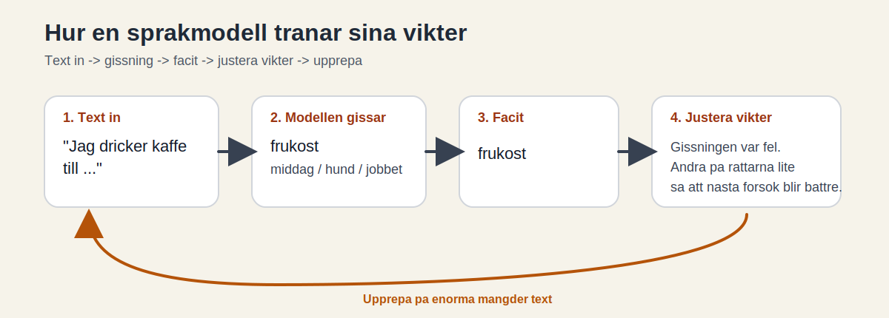

Om man sedan vill få en enkel matematisk intuition för vad en vikt gör kan man förenkla det väldigt mycket och tänka sig en liten del av modellen ungefär så här:

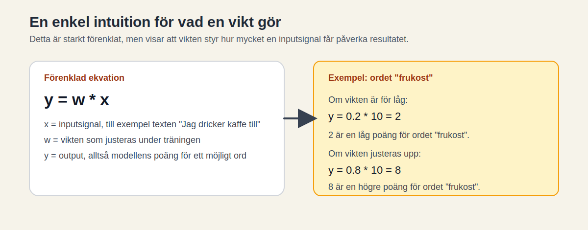

I det här förenklade exemplet är `x` en inputsignal, `w` är vikten och `y` är modellens output. Outputen kan då ses som en poäng: ju högre poäng, desto mer rimligt verkar ett visst ord vara som nästa del av texten. Den riktiga modellen är förstås mycket mer komplex än så här, men intuitionen är densamma: när vikterna ändras, ändras också modellens gissning.

Efter väldigt många sådana varv blir modellen gradvis bättre på att gissa rätt. Och för att kunna göra det måste den samtidigt lära sig mycket om hur språk brukar användas och hur världen ofta beskrivs i text.

### En intuition: självkörande bil

Det här kan liknas vid att träna en självkörande bil genom en hinderbana. I början kör bilarna nästan hej vilt och misslyckas hela tiden. Men efter varje försök gör man små justeringar, till exempel i hur bilen svänger, och då blir körningen steg för steg bättre. Målet är inte bara att klara träningsbanan, utan att ha lärt sig mönster som fungerar även på nya vägar.

*Bilanalogin visualiserad: från många fel i början till en modell som gradvis lär sig köra bättre.*

*När träningen är klar används modellen sedan i nya situationer som den inte sett exakt tidigare.*

Efter träningen är det dessa vikter som i praktiken **är** själva modellen. Därför kan man pedagogiskt säga att en språkmodell är som en väldigt stor modellfil som innehåller allt modellen har lärt sig.

### Vad händer när modellen körs?

När vi sedan använder modellen är det just de här tränade vikterna som sätts i arbete. Träningen handlar alltså om att ställa in vikterna. Körningen handlar om att använda samma vikter för att bygga upp ett svar.

Förenklat går det till så här:

1. Du skickar in en fråga.
2. Frågan går in i modellen.
3. Modellen använder sina tränade vikter för att räkna ut vad som mest sannolikt ska komma härnäst.
4. Den bygger upp svaret steg för steg tills svaret är klart.

Det betyder att vikterna först **lärs in** under träningen, och sedan **används** varje gång modellen svarar. Det är den röda tråden mellan träning och användning.

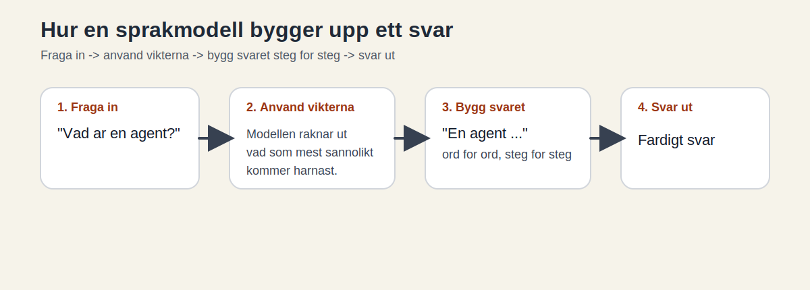

För att göra detta krävs mycket beräkningskraft. Därför körs moderna språkmodeller ofta på kraftiga **GPU:er**, eftersom de är bra på att göra många beräkningar parallellt.

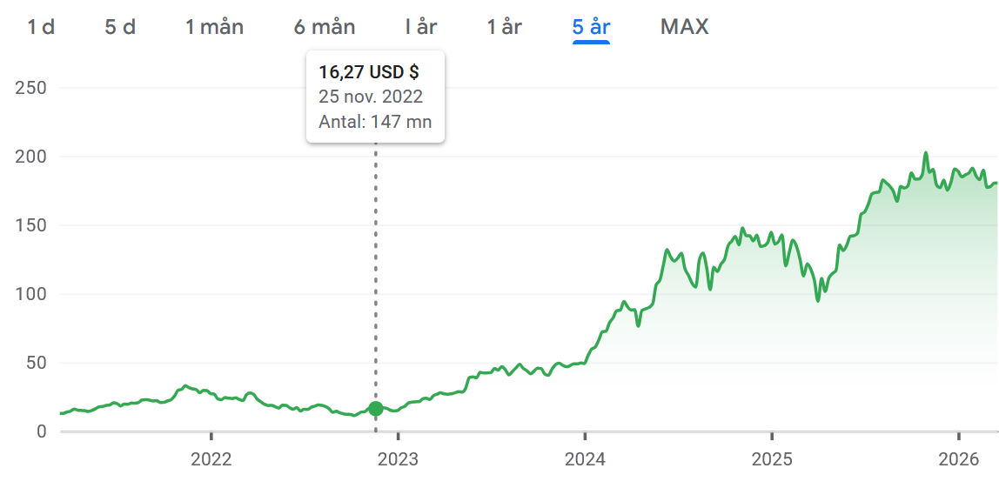

### Olika storlekar på modeller

Det finns många olika typer av språkmodeller. De skiljer sig både i hur bra de är på olika uppgifter och i hur de kan köras i praktiken.

En viktig skillnad här är att vissa modeller är **open source** och andra är **closed source**:

* **Open source-modeller** går ofta att ladda ner och köra själv. Då kan man också i större utsträckning se hur modellen är uppbyggd och jobba med den lokalt.
* **Closed source-modeller** får man oftast använda via en tjänst. Då kan man använda modellen, men man får inte ladda ner hela modellen själv eller se exakt hur alla vikter ser ut.

En annan viktig skillnad är modellens **storlek**. När du ser modellnamn som `3B`, `7B`, `14B` eller `27B` betyder `B` **miljarder parametrar**.

Fler parametrar betyder i praktiken att modellen har fler värden att använda i sina beräkningar varje gång den svarar. Större modeller blir därför ofta mer kapabla, men också tyngre och dyrare att köra.

Här ser du ett exempel på hur samma modellfamilj kan finnas i flera storlekar:

| Modellfamilj | Exempel på storlekar                                         | Typiskt användningsområde                       |
| ------------ | ------------------------------------------------------------- | ------------------------------------------------- |
| Gemma 3      | `1B`, `4B`, `12B`, `27B`                              | Lokal körning i olika nivåer                    |
| Qwen 3       | `0.6B`, `1.7B`, `4B`, `8B`, `14B`, `30B`          | Från små tester till större lokala modeller    |
| DeepSeek-R1  | `1.5B`, `7B`, `8B`, `14B`, `32B`, `70B`, `671B` | Från lokala resonemangsmodeller till serverklass |
| Ministral 3B | `3B`                                                        | Liten modell som är lättare att köra lokalt    |

Om du vill bläddra bland fler öppna modeller kan du också titta i [Ollamas modellkatalog](https://ollama.com/search).

!!! note "Exempel på lokal körning"
    Här nedan ser du att jag kör modellen `ministral-3:3b` lokalt i Ollama. I det här fallet sker beräkningarna alltså på min egen dator i stället för i ett moln.

### Var "bor" modellen?

Det här är en viktig mental modell att ha med sig:

* En **lokal modell** ligger på din egen dator och körs av din egen hårdvara.
* En **molnmodell** ligger på leverantörens servrar och körs där.

Mindre open source-modeller går ofta att köra lokalt på en kraftigare laptop eller stationär dator. Men större modeller kräver så mycket minne och så mycket beräkningskraft att de i praktiken ofta måste köras på kraftiga servrar eller flera GPU:er tillsammans.

Det är också här kostnaden kommer in. Kraftiga GPU:er, särskilt Nvidia-GPU:er som ofta används till AI, är mycket dyra. Därför är det inte realistiskt att köra de största modellerna på en vanlig dator.

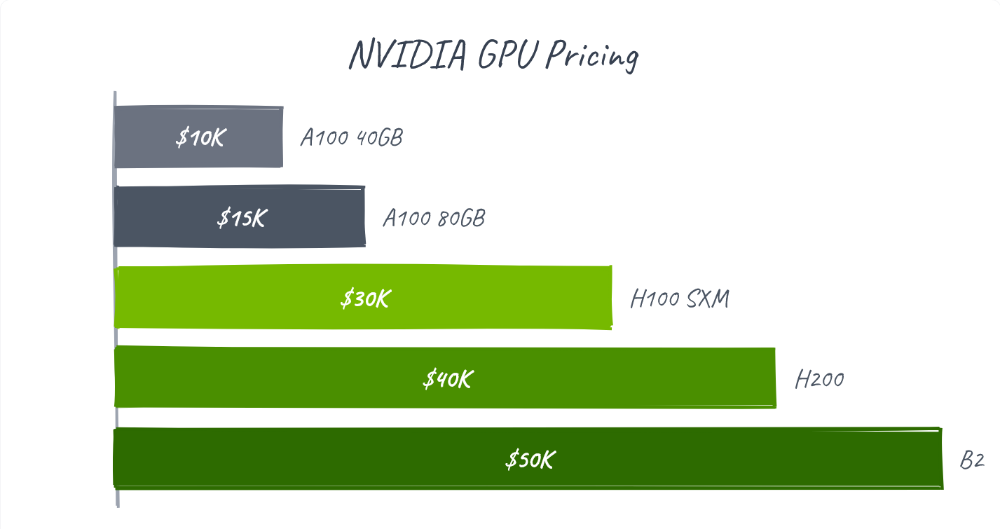

Om du använder ChatGPT sker beräkningarna hos OpenAI. Om du använder **Copilot Studio** sker beräkningarna normalt inte på din dator, utan i Microsofts moln. Microsoft beskriver Copilot-funktionerna som byggda på **Azure OpenAI**, vilket innebär att prompten skickas till Microsofts Azure-miljö, modellen bearbetar frågan där och svaret skickas tillbaka till dig.

Det betyder också att säkerhet och förtroende blir viktigt. När du använder en molnmodell behöver du lita på den leverantör som driver infrastrukturen. I Microsofts fall är poängen att modellen körs i deras Azure-miljö, inte via OpenAI:s publika ChatGPT-tjänst.

Många av de största modellerna som används i molntjänster idag är dessutom **closed source**. Då får vi använda dem via leverantörens tjänst, men vi får inte ladda ner hela modellen själva eller se exakt hur alla vikter ser ut.

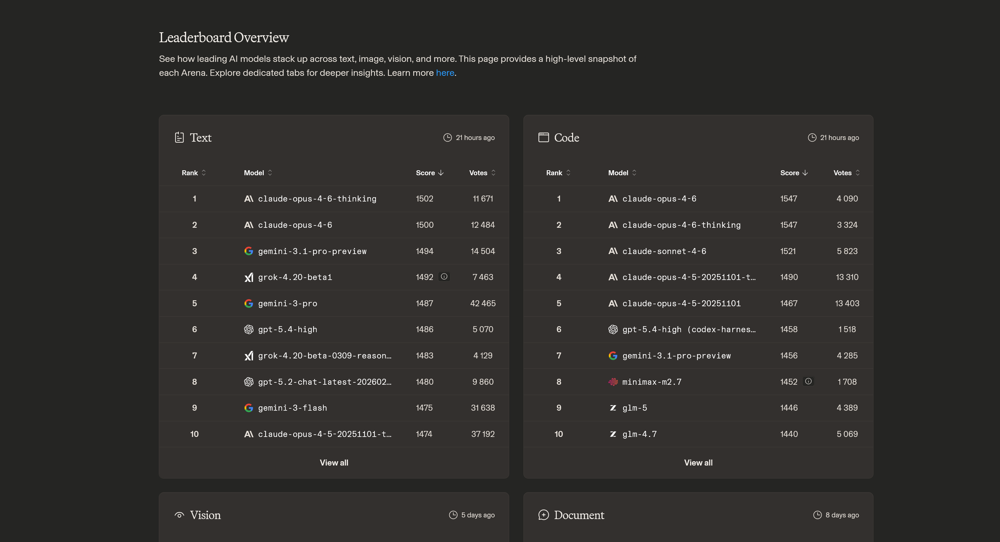

---

## 🔤 Tokens

Det är viktigt att veta att en språkmodell inte läser ord som vi gör. Dess alfabet består av **tokens**.

### Vad är en token?

En token är i praktiken en **ID-representation** av ett vanligt förekommande ord, en del av ett ord eller ett skiljetecken.

* Som tumregel: 1000 tokens motsvarar ungefär 750 ord.

### Vad är en tokenizer?

En **tokenizer** är systemet som delar upp vanlig text i tokens. Det är alltså tokenizern som översätter mellan mänsklig text och de byggstenar modellen lättare kan arbeta med.

Vanliga ord blir ofta en token, medan ovanligare ord ibland delas upp i flera mindre delar. Tokenizern mappar också varje token till ett token-ID.

Men det är vikigt att förstå att det är alltså inte den uppdelade texten i sig som modellen arbetar med internt, utan de **token-ID:n** som dessa textbitar har fått.

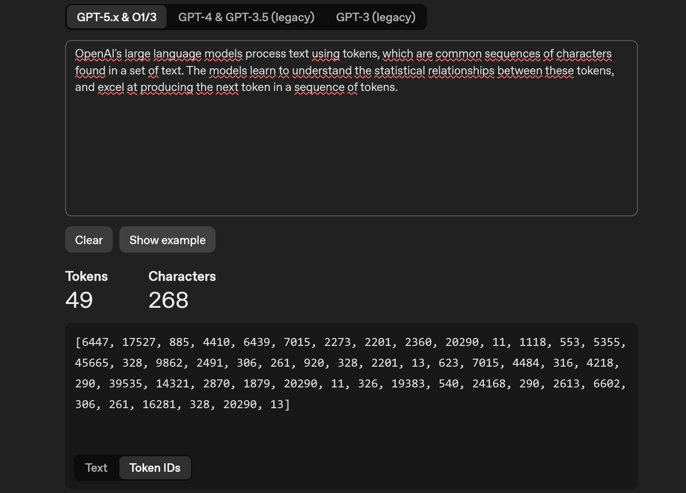

!!! tip "Prova själv"
    Vill du se hur din text delas upp i tokens? Testa att klistra in en mening i verktyget [OpenAI Tokenizer](https://platform.openai.com/tokenizer).

### Varför inte bara nollor och ettor eller rå text?

* **Inte binära tal:** I grunden lagras all information som `0` och `1`, men binära representationer blir långa och opraktiska att arbeta direkt med. Det skulle göra sekvenserna onödigt stora och ineffektiva för modellen.
* **Inte rå text:** Vanlig text är full av olika ordformer, böjningar, stavningar och skiljetecken. Då blir det svårt att få ett effektivt och konsekvent sätt för modellen att arbeta med språket. Tokens blir därför ett bättre mellanlager mellan mänsklig text och modellens matematik.

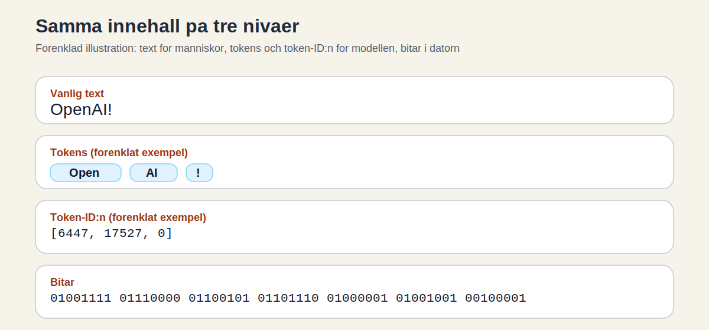

## 💬 Prompts

En prompt är instruktionen vi skickar till modellen. I Copilot Studio jobbar vi främst med två typer:

1. **System Prompt:** Detta är "instruktionsboken" för agenten. Här definierar vi vem agenten är, vad den får göra och vilken ton den ska ha.
2. **User Prompt:** Detta är vad användaren skriver i chatten (frågan).

Dessa slås ihop när modellen ska generera sitt svar:

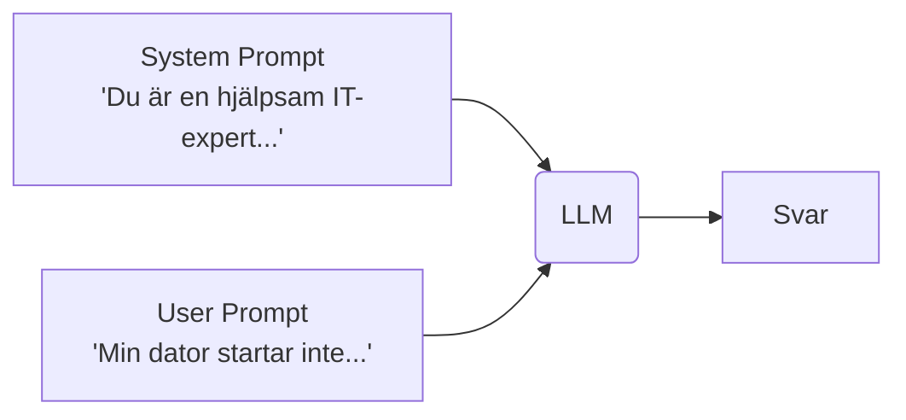
```mermaid
graph LR
    A[System Prompt\n'Du är en hjälpsam IT-expert...'] --> C(LLM)
    B[User Prompt\n'Min dator startar inte...'] --> C
    C --> D[Svar]
```

---

## 📏 Kontextlängd (Korttidsminnet)

Varje modell har en begränsning i hur mycket information den kan hålla i huvudet samtidigt. Detta kallas **kontextlängd**.

Du kan se det som modellens **korttidsminne**, men det viktiga är att förstå att detta är den **totala tokenbudgeten** för hela anropet, inte bara för användarens fråga.

I kontextlängden räknas ofta allt detta in samtidigt:

| Del                                 | Typ           | Exempel                                                                                  |
| ----------------------------------- | ------------- | ---------------------------------------------------------------------------------------- |
| Systemprompt                        | Input tokens  | Instruktioner om hur agenten ska bete sig                                                |
| Användarens fråga                 | Input tokens  | Det användaren skriver i chatten                                                        |
| Tidigare chattmeddelanden           | Input tokens  | Historik från samma konversation                                                        |
| Information från RAG eller verktyg | Input tokens  | Hämtade dokumentstycken eller verktygssvar                                              |
| Modellens svar                      | Output tokens | Det svar modellen genererar tillbaka                                                     |
| Resonemang                          | Output tokens | I vissa resonerande modeller går även en del budget åt till mellanliggande resonemang |

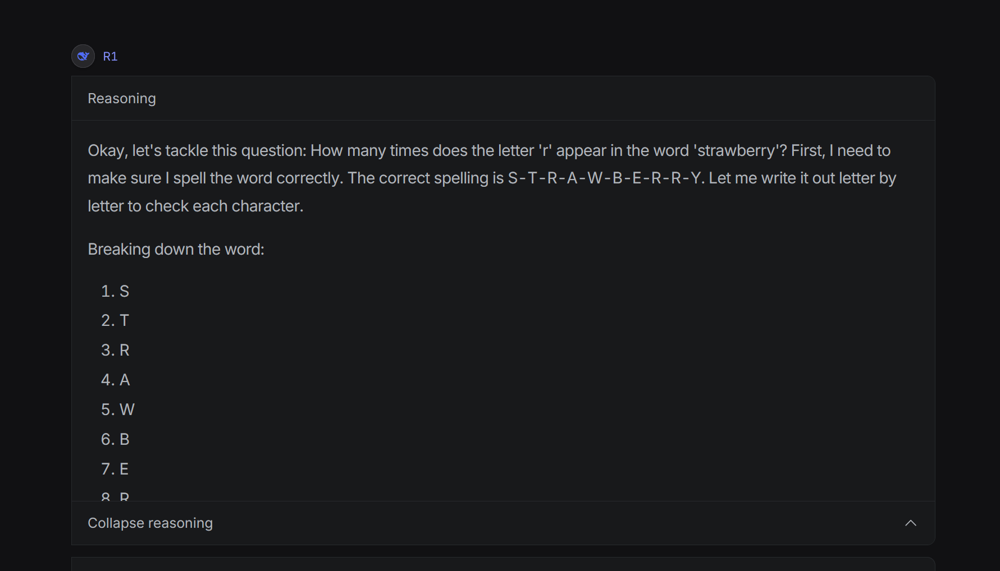

Det betyder att om mycket plats redan används av instruktioner, historik eller hämtad kunskap, finns det mindre utrymme kvar för modellens svar.

### Vad händer när den börjar bli full?

Tidigare kunde man ofta märka detta ganska tydligt genom att modellen helt enkelt klippte av sitt eget svar när den nådde gränsen. I dag hanteras detta ofta av systemet runt modellen i stället. Det kan till exempel innebära att äldre chattmeddelanden sammanfattas, kortas ned eller väljs bort innan nästa anrop skickas.

Ofta görs detta också utifrån en tröskel, alltså att man redan innan kontextlängden är helt fylld börjar städa i historiken. En implementation kan till exempel börja sammanfatta när man närmar sig kanske `80 %` av den totala längden, även om den exakta nivån varierar mellan olika system.

### Modellers kontextlängd i dag

* Moderna modeller kan ha mycket långa kontextlängder. Exempelvis har `GPT-5.1` cirka `400 000` i kontextlängd, medan `GPT-4.1` ligger på `1 047 576`.

Mellan tumme och pekfinger kan man säga att en modell med omkring `1 miljon` i kontextlängd kan hålla ungefär `750 000 ord` samtidigt. Det är alltså ungefär i nivå med hela Bibelns ordmängd, som brukar uppskattas till omkring `740 000 ord`. Men det betyder inte att modellen automatiskt använder all den informationen perfekt.

### Context Rot

Även om moderna modeller kan ha mycket långa kontextlängder betyder det inte att de använder hela kontexten lika bra. Det är här begreppet **context rot** blir viktigt. När kontexten blir väldigt lång, splittrad eller fylld av halvrelevant information får modellen svårare att hitta rätt signal. Då ökar risken att kvaliteten på svaret försämras, även innan den maximala kontextlängden är uppnådd.

En enkel intuition är att modellen hela tiden försöker avgöra vad som mest sannolikt ska komma härnäst utifrån all information den redan fått. Om kontexten då blir lång, splittrad eller full av halvrelevant innehåll blir det svårare att avgöra vad som faktiskt är viktigast. Då ökar risken att nästa steg i svaret blir sämre.

### Kontexthantering

Det är därför kontexthantering blir viktigt. Att bygga bra AI-system handlar inte bara om att ha en modell med lång kontextlängd, utan också om att hantera den på rätt sätt.

* sammanfatta äldre historik när den inte längre behövs i detalj
* skicka bara in det som är relevant för den aktuella frågan
* undvika att fylla kontexten med halvrelevant information
* använda tekniker som RAG för att välja ut rätt underlag i stället för att skicka in allt

---

## 📚 RAG (Retrieval Augmented Generation)

RAG, som står för **Retrieval-Augmented Generation**, uppstod som ett svar på ett väldigt konkret problem: stora språkmodeller är bra på att formulera text, men de bär inte säkert runt på all den fakta du behöver i en verklig verksamhet.

Det RAG gör är i praktiken tre saker:

* **Minskar hallucinationer** genom att grunda svaret i faktiska dokument, alltså faktisk information.
* **Ger modellen tillgång till information som aldrig fanns i träningsdatan**, till exempel interna manualer, avtal, produktblad, supportärenden eller teknisk dokumentation.
* **Hanterar modellens kontextlängd** genom att försöka hitta de delar av dokumenten som verkar mest relevanta, i stället för att skicka in hela dokument.

### Hur fungerar det? (Vektorer och Embeddings)

För att datorn ska kunna söka i text måste vi göra om text till siffror. Det är här **embeddings** och **vektorer** kommer in.

1. Vi tar en PDF, till exempel en **maskinmanual**.
2. Vi delar upp den i små stycken (**chunks**).

   
3. Sedan använder vi en särskild AI-modell som kallas för en **embeddingsmodell**. Dess uppgift är att läsa varje stycke, förstå betydelsen i det och skapa en **vektorrepresentation** av den betydelsen.

   
4. De här vektorerna lagras sedan i en **vektordatabas**. Där kan det ligga vektorer från många olika dokument samtidigt, till exempel flera maskinmanualer, produktblad eller supportguider.
5. När användaren ställer en fråga går även frågan genom embeddingsmodellen, så att även frågan blir en vektorrepresentation av sin betydelse.
6. Sedan letar vi upp **x antal närmaste vektorer** i vektordatabasen, till exempel de tre närmaste. Det betyder i praktiken att vi hittar de dokumentstycken vars betydelse är mest lik frågans betydelse.
7. De här vektorerna har metadata som pekar tillbaka på vilka textstycken de representerar. Vi hämtar därför ut de riktiga styckena och skickar dem tillsammans med frågan till språkmodellen.
8. Först då skriver språkmodellen sitt svar, men nu med hjälp av relevant underlag från dokumenten.

   

#### Visualisering av RAG

*Här ser du hur en vektor (frågan) matchas mot en rymd av kunskap.*

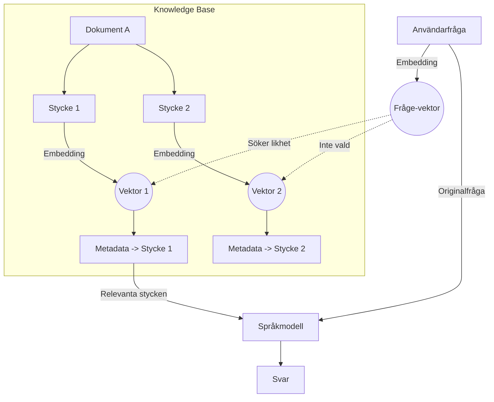
```mermaid
graph TD
    subgraph Knowledge Base
    Doc1[Dokument A] --> Chunk1[Stycke 1]
    Doc1 --> Chunk2[Stycke 2]
    Chunk1 -- Embedding --> V1((Vektor 1))
    Chunk2 -- Embedding --> V2((Vektor 2))
    V1 --> M1[Metadata -> Stycke 1]
    V2 --> M2[Metadata -> Stycke 2]
    end
  
    User[Användarfråga] -- Embedding --> Q((Fråge-vektor))
  
    Q -.->|Söker likhet| V1
    Q -.->|Inte vald| V2
  
    User -->|Originalfråga| LLM[Språkmodell]
    M1 -->|Relevanta stycken| LLM
    LLM --> Svar
```

### Begränsningar med RAG

Det viktiga att förstå är att språkmodellen i ett RAG-upplägg **inte ser hela dokumentmängden samtidigt**. Den ser bara de utdrag som retrieval-steget hittade och skickade vidare till modellen.

Det är därför RAG ofta fungerar bra när man vill hitta **specifik information**, men sämre när frågan kräver att modellen ska:

* räkna över många delar av ett dokument
* jämföra många avsnitt samtidigt
* förstå relationer som är utspridda över flera olika chunkar

Om svaret finns spritt över många delar av många dokument finns det en risk att retrieval-steget bara hämtar en del av det, och då kan modellen inte resonera över information som den aldrig fick se.

---

## 🤖 Vad är en AI-Agent?

AI-agenter är AI-system som gör att språkmodeller kan interagera med omvärlden, till exempel genom att använda verktyg, spara information och utföra uppgifter över flera steg.

### Viktiga komponenter

#### Verktyg

Språkmodeller är väldigt bra på att förstå, analysera och generera text, men de kan i grunden inte göra så mycket mer än det. **Verktyg** är därför ett sätt att låta språkmodellen göra mer än bara textarbete. Det handlar om att koppla modellen till externa tjänster, till exempel e-post, databaser, kalendrar eller andra system.

#### Minne

**Minne** handlar om att information från tidigare steg eller tidigare interaktioner sparas, så att agenten kan använda den senare. Det kan vara allt från tidigare meddelanden i en konversation till resultat från en tidigare körning eller viktiga fakta som agenten behöver komma ihåg.

#### Lärande

När man säger att en agent **lär sig** betyder det ofta inte att språkmodellen i grunden tränas om eller att vikterna ändras. Ofta handlar det i stället om att systemet runt agenten sparar minnen, feedback eller tidigare resultat, så att agenten kan fatta bättre beslut nästa gång.

### 1. Workflow vs. Agent

* **Workflow:** Ett styrt flöde där språkmodeller och verktyg används i vissa steg, men där den övergripande processen fortfarande är förutbestämd.

  
* **Agent:** Ett system där språkmodellen i högre grad själv avgör vilka verktyg som ska användas, i vilken ordning och hur uppgiften ska lösas.

  

### 2. Konversationsagent

Detta är en språkmodell som har fått tillgång till verktyg (tools). Den pratar med en människa och kan utföra uppgifter på kommando, till exempel söka på nätet, kolla kalendern eller hämta information från ett system.

* **Exempel:** "Boka ett möte med Anna kl 14."

### 3. Autonom agent

Dessa agenter behöver inte en människa som startar dem. De kan triggas av händelser, till exempel att ett mejl kommer in eller att klockan slår 08:00. De arbetar då självständigt i bakgrunden.

* **Exempel:** En agent som övervakar en inkorg dygnet runt.

---

Nu när vi har begreppen på plats är det dags att börja bygga! Klicka på nästa kapitel för att sätta upp din miljö.
