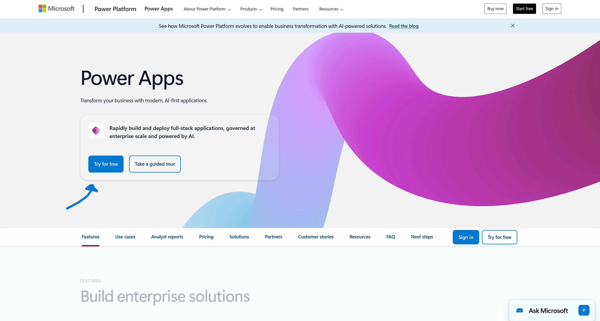
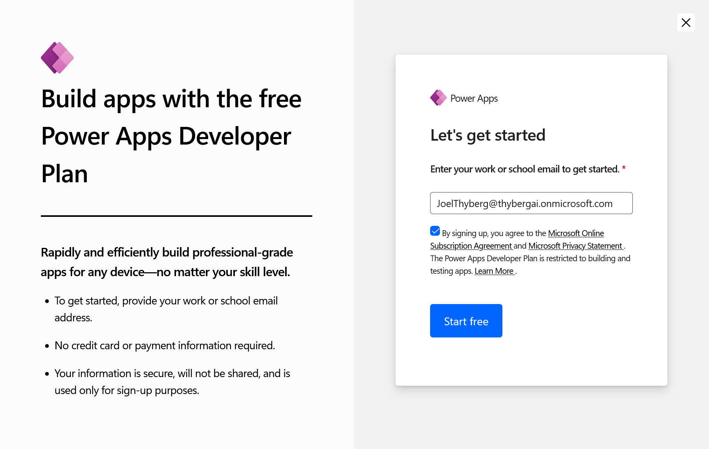

# 0. Förberedelser och Miljö

Innan vi börjar bygga måste vi se till att du har rätt förutsättningar. Vi ska skapa en **Developer Environment**.

!!! info "Varför Developer Plan?"
    När du aktiverar denna plan får du en personlig "sandlåda" där du har fulla admin-rättigheter. Det viktigaste är att denna miljö automatiskt inkluderar databasen **Dataverse**, vilket krävs för att vår agent ska kunna minnas saker och hantera godkännanden.

---

## Steg 1: Aktivera din miljö

1. Öppna en ny flik och gå till [Power Apps Developer Plan](https://powerapps.microsoft.com/en-us/developerplan/).
2. Klicka på den blå knappen **Try for free**.

    

3. Ange din jobbmail, kryssa i rutan för att godkänna avtalen och klicka på **Start free**.

    

När du registrerat dig skickas du vidare till Power Apps startsida.

*Om du skickas direkt vidare utan att behöva fylla i något betyder det att du redan har licensen aktiverad sen tidigare. Det är inga problem, gå bara vidare till Steg 2.*

---

## Steg 2: Kontrollera och välj miljö

Nu ska vi se till att din nya miljö finns tillgänglig och välja den. Detta gör vi direkt inifrån Power Apps.

1. Titta uppe i högra hörnet på sidan. Klicka på väljaren för **Environment** (där ditt namn eller ett miljönamn står).

    

2. En lista fälls ut. Titta under rubriken **Build apps with Dataverse**. Där ska din utvecklingsmiljö ligga. Klicka på den för att välja den.

    

**Viktigt om namngivning:**
I mina screenshots heter miljön "CopilotLab". Din miljö kommer troligen heta **"[Ditt Namn]'s Environment"**.

Om du redan hade en utvecklingsmiljö sedan tidigare kommer systemet *inte* skapa en ny, utan du använder bara den gamla. Det viktiga är att miljön du väljer ligger under rubriken **Build apps with Dataverse** och inte under "Other environments".

---

## Steg 3: Verifiera Dataverse

Nu gör vi ett snabbt test för att se att databasen (Dataverse) är installerad och fungerar.

1. Se till att du står i din nya miljö (enligt Steg 2).
2. Klicka på **+ Create** i menyn längst till vänster.

    

3. Klicka på kortet som heter **AI hub**.

    

4. **Titta på resultatet:**

**✅ Det ser ut så här (Succé):**
Du ser en sida med rutor för "AI models", "Prompts" eller en lista. Inga felmeddelanden.

*Grattis! Din miljö är redo. Du kan gå vidare till nästa kapitel.*

**❌ Det ser ut så här (Fel):**
Du möts av en bild på en burk och texten **"No database found"**.

---

## 🛑 Felsökning

**Jag fick "No database found" i Steg 3?**
Då har du troligen valt fel miljö (t.ex. Default-miljön) eller så har installationen av din Developer-miljö inte blivit klar än.
1. Dubbelkolla i menyn **Environment** (uppe till höger) att du INTE är i "(default)".
2. Om du är i rätt miljö men ändå får felet: Vänta 5-10 minuter och uppdatera sidan (F5). Ibland tar det en stund för databasen att skapas första gången.

**Jag får felmeddelande när jag försöker signa upp i Steg 1?**
Om din IT-avdelning har blockerat detta får du använda din **Default**-miljö.
*OBS: Meddela kursledaren om du måste göra detta.*