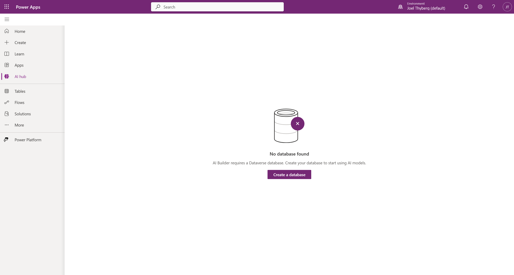

# 0. Förberedelser och Miljö

Innan vi börjar bygga måste vi se till att du har rätt förutsättningar. Vi ska skapa en **Developer Environment**.

!!! info "Varför Developer Plan?"
    När du aktiverar denna plan får du en personlig "sandlåda" där du har fulla admin-rättigheter. Det viktigaste är att denna miljö automatiskt inkluderar databasen **Dataverse**, vilket krävs för att vår agent ska kunna minnas saker och hantera godkännanden.

---

## Steg 1: Aktivera din miljö

1. Öppna en ny flik och gå till [Power Apps Developer Plan](https://powerapps.microsoft.com/en-us/developerplan/).
2. Klicka på den blå knappen **Try for free**.

3. Ange din jobbmail, kryssa i rutan för att godkänna avtalen och klicka på **Start free**.

> *After signing up for the Developer Plan, you'll be redirected to Power Apps. The environment uses your name, for example Adele Vance's environment. If there's already an environment with that name, the developer new environment is named Adele Vance's (1) environment.*

*Om du skickas direkt vidare utan att behöva fylla i något betyder det att du redan har licensen aktiverad. Gå vidare till Steg 2.*

---

## Steg 2: Byt till rätt miljö (Kritiskt!)

Detta är det vanligaste misstaget. Power Apps lägger dig ofta i fel miljö som standard efter registrering.

1. Gå till [Copilot Studio (copilotstudio.microsoft.com)](https://copilotstudio.microsoft.com).
2. Titta uppe i högra hörnet. Klicka på **Miljöväljaren** (där ditt namn eller miljönamn står).

3. En lista fälls ut. Din nya utvecklingsmiljö ligger under rubriken **Build apps with Dataverse**. Välj den.

!!! warning "Välj INTE Default"
    Titta på bilden ovan. Miljön som heter **(default)** ligger under "Other environments". Välj **inte** den. Om du gör det kommer du sakna rättigheter för vissa delar av utbildningen.
    
    *Tips:* I Joels screenshots kan miljön heta "CopilotLab". Din kommer troligen heta "[Ditt Namn]'s Environment". Båda fungerar, så länge de ligger under "Dataverse"-rubriken.

---

## Steg 3: Verifiera Dataverse (Viktigt!)

Vi ska nu göra ett "lackmustest" för att se att databasen (Dataverse) är korrekt installerad.

1. Se till att du står i din nya miljö (enligt Steg 2).
2. Klicka på **+ Create** i menyn längst till vänster.

3. Klicka på kortet som heter **AI hub**.

4. **Titta på resultatet:**

**✅ Det ser ut så här (Succé):**
Du ser en sida med rutor för "AI models", "Prompts" eller en lista. Inga felmeddelanden.

*Grattis! Din miljö är redo. Du kan gå vidare till nästa kapitel.*

**❌ Det ser ut så här (Fel):**
Du möts av en bild på en burk och texten **"No database found"**.

---

## 🛑 Felsökning

**Jag fick "No database found" i Steg 3?**
Då har du troligen valt fel miljö (t.ex. Default-miljön) eller så har installationen av din Developer-miljö inte blivit klar än.
1. Dubbelkolla i miljöväljaren (uppe till höger) att du INTE är i "(default)".
2. Om du är i rätt miljö men ändå får felet: Vänta 5-10 minuter och uppdatera sidan. Ibland tar det en stund för databasen att skapas första gången.

**Jag får felmeddelande när jag försöker signa upp i Steg 1?**
Om din IT-avdelning har blockerat detta får du använda din **Default**-miljö.
*OBS: Meddela kursledaren om du måste göra detta.*