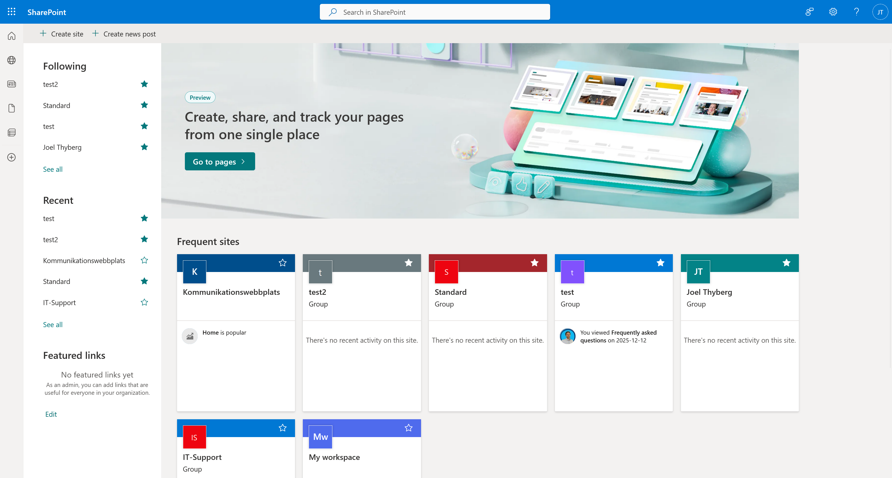
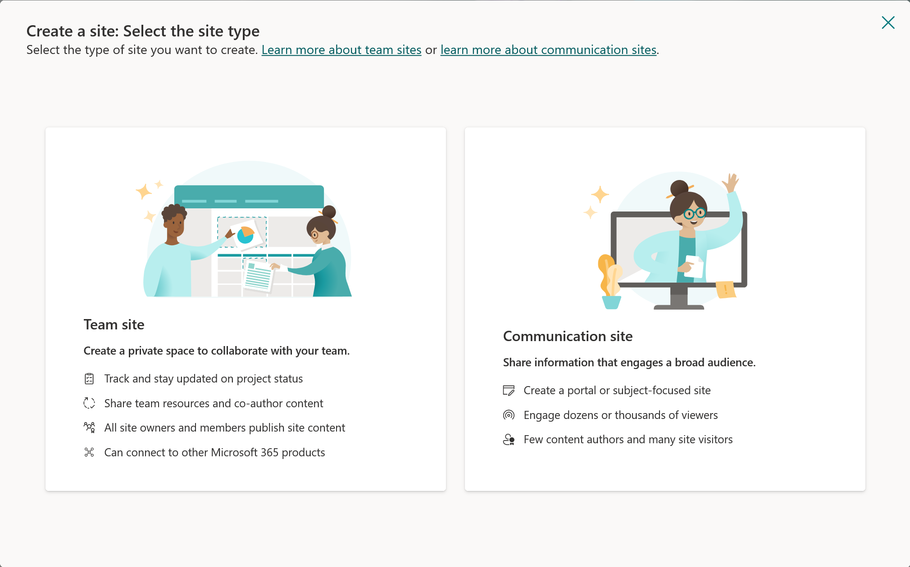
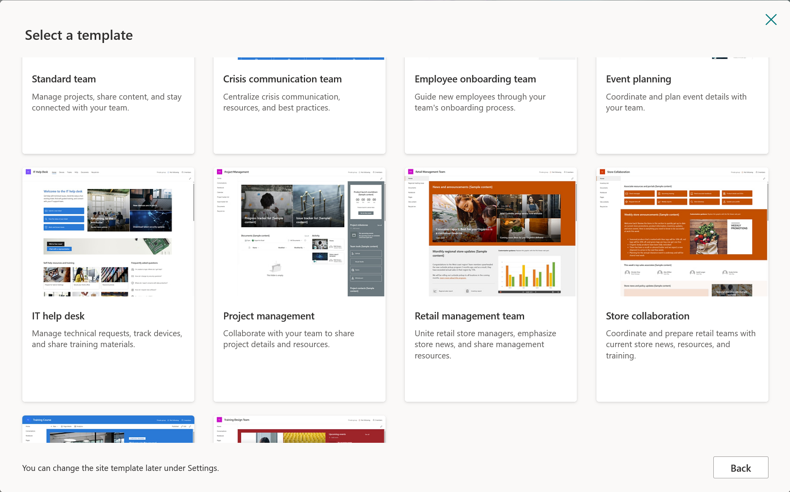
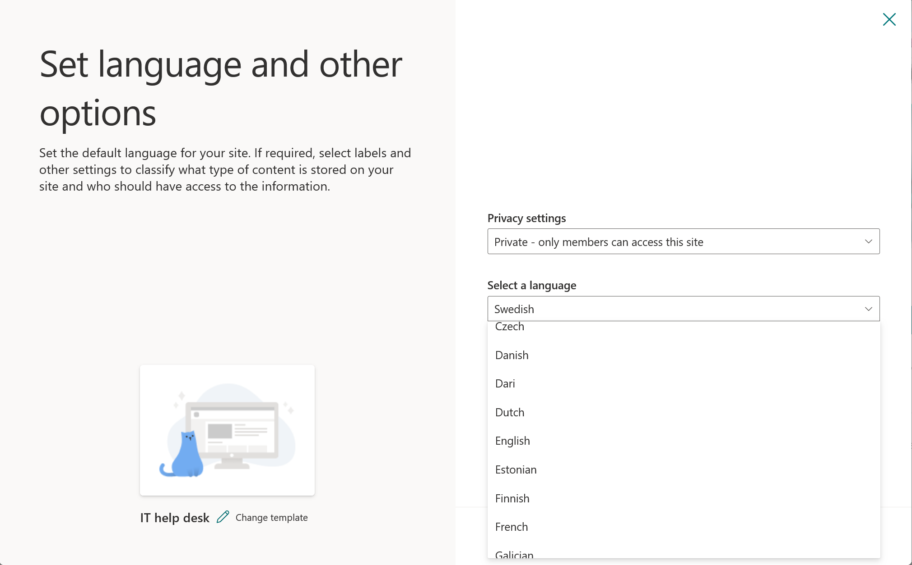
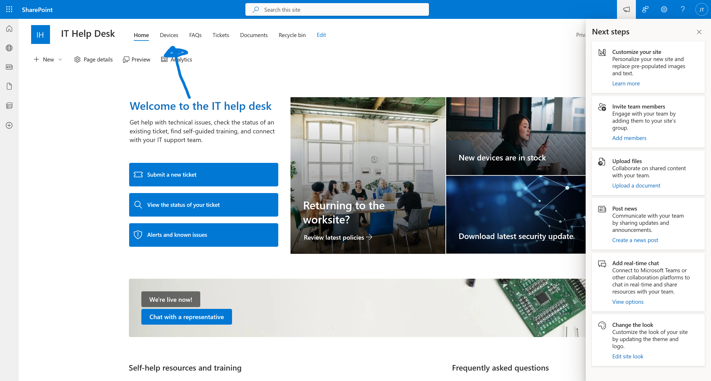
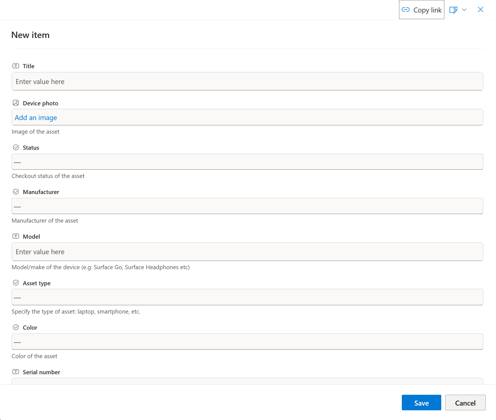

# 1. Förbered SharePoint

Vår IT-support agent behöver data för att kunna svara på frågor. Vi ska nu skapa en SharePoint-sajt som innehåller information om hårdvara (Laptops, skärmar etc.).

För att spara tid använder vi en färdig mall från Microsoft.

---

## Steg 1: Gå till SharePoint

Vi navigerar dit direkt från Power Apps.

1. Klicka på **Våfflan** (App launchern) bestående av 9 prickar högst upp i vänstra hörnet.

2. I menyn som fälls ut, klicka på **SharePoint**.

3. Du hamnar nu på startsidan för SharePoint. Klicka på **+ Create site** (eller *+ Skapa webbplats*).

---

## Steg 2: Välj mallen "IT Help Desk"

Nu ska vi välja rätt mall.

1. Du får två val. Välj **Team site** (Gruppwebbplats).

2. Klicka på fliken **Templates** (Mallar) högst upp.
3. Scrolla ner och klicka på rutan för **IT Help Desk**.

4. Klicka på knappen **Use template**.

*(Om du inte ser mallen, kontakta kursledaren för instruktioner om hur man skapar listan manuellt).*

---

## Steg 3: Konfigurera namn och språk (Kritiskt!)

Detta är det viktigaste steget. Vi måste döpa sajten och tvinga den att använda engelska.

1. **Site name:** Döp den till `IT-Support`.
2. **Site description:** (Valfritt) Skriv en kort beskrivning om du vill.
3. Klicka på knappen **Next**.

4. Nu får du välja språk. Det är **mycket viktigt** att det står **English** här. Om det är förvalt något annat (t.ex. Swedish), klicka på rullgardinsmenyn och ändra till English.

!!! danger "Välj Engelska!"
    Även om du föredrar svenska menyer **MÅSTE** du välja **English** här.
    
    Om du väljer svenska kommer de interna namnen på kolumnerna heta saker som `Enhetstyp` istället för `DeviceType`, vilket gör att din Copilot inte kommer kunna läsa datan i senare övningar.

5. Klicka på **Create site**.

*Vänta några sekunder medan sajten skapas...*

6. När sajten är skapad kommer en ruta där du kan lägga till medlemmar. Vi behöver inte göra det nu. Klicka bara på **Finish**.

*Du skickas nu automatiskt till den nya sajten.*

---

## Steg 4: Anpassa listan "Devices"

Mallen har skapat en lista åt oss som heter **Devices**, men vi behöver lägga till bilder på produkterna.

1. På din nya sajt, klicka på fliken **Devices** i toppmenyn (eller under "Site contents").

2. Scrolla längst till höger i listan tills du ser knappen **+ Add column**. Klicka på den.

3. I menyn som dyker upp, scrolla ner och välj **Hyperlink**.

4. Döp kolumnen till `Image`.
5. Klicka på **Save**.

---

## Steg 5: Lägg in testdata

Nu ska vi fylla listan med 4 produkter.

1. Klicka på knappen **+ Add new item** (eller *New*) uppe till vänster i listan.

2. En ruta öppnas till höger. Här fyller du i informationen för produkten (se tabellerna nedan).

!!! tip "Hur får jag in bilden?"
    Det enklaste sättet:
    1. **Högerklicka** på bilden här i guiden.
    2. Välj **Kopiera bildadress** (Copy image address).
    3. Klistra in länken i fältet **Image** (längst ner i formuläret i SharePoint).
    
    *Alternativt: Kopiera den långa länken som står i rutan under respektive bild.*

### 1. Surface Laptop 13

* **Title:** Surface Laptop 13
* **Status:** Available
* **Manufacturer:** Microsoft
* **Model:** Surface Laptop 13
* **Asset Type:** Laptop
* **Color:** Silver
* **Serial Number:** 1
* **Price:** 1500
* **Order #:** 10001
* **Image:**
`https://tyto-official.github.io/copilot-studio-course/assets/images/products/surface-laptop-13.png`

---

### 2. Surface Laptop 15

* **Title:** Surface Laptop 15
* **Status:** Available
* **Manufacturer:** Microsoft
* **Model:** Surface Laptop 15
* **Asset Type:** Laptop
* **Color:** Black
* **Serial Number:** 2
* **Price:** 2000
* **Order #:** 10002
* **Image:**
`https://tyto-official.github.io/copilot-studio-course/assets/images/products/surface-laptop-15.png`

---

### 3. Surface Studio

* **Title:** Surface Studio
* **Status:** Available
* **Manufacturer:** Microsoft
* **Model:** Surface Studio
* **Asset Type:** Desktop
* **Color:** Silver
* **Serial Number:** 3
* **Price:** 2500
* **Order #:** 10003
* **Image:**
`https://tyto-official.github.io/copilot-studio-course/assets/images/products/surface-studio.png`

---

### 4. Surface Pro

* **Title:** Surface Pro
* **Status:** Available
* **Manufacturer:** Microsoft
* **Model:** Surface Pro
* **Asset Type:** Tablet
* **Color:** Pink
* **Serial Number:** 4
* **Price:** 1000
* **Order #:** 10004
* **Image:**
`https://tyto-official.github.io/copilot-studio-course/assets/images/products/surface-pro-12.png`

!!! success "Klart!"
    Nu har du en databas fylld med hårdvara. I nästa kapitel ska vi börja bygga själva agenten!