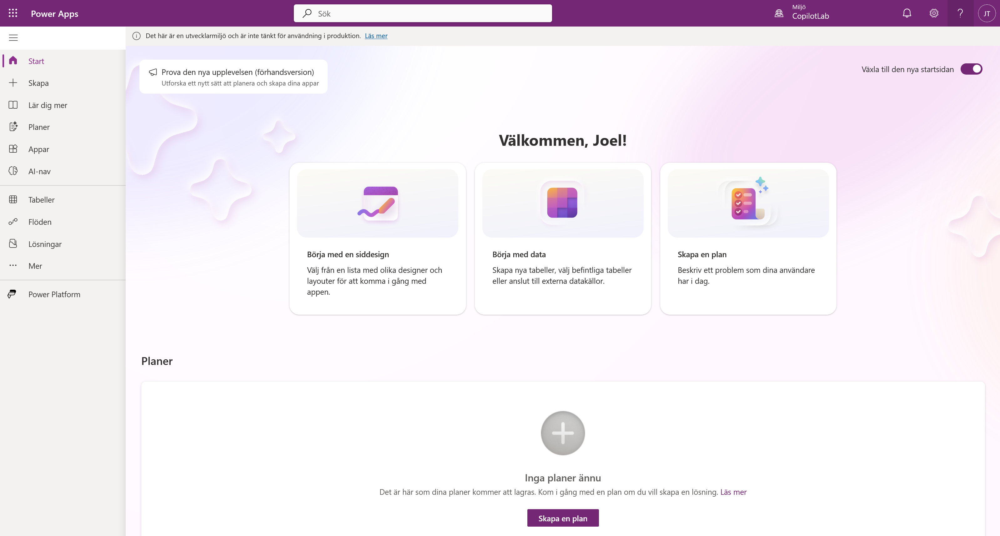
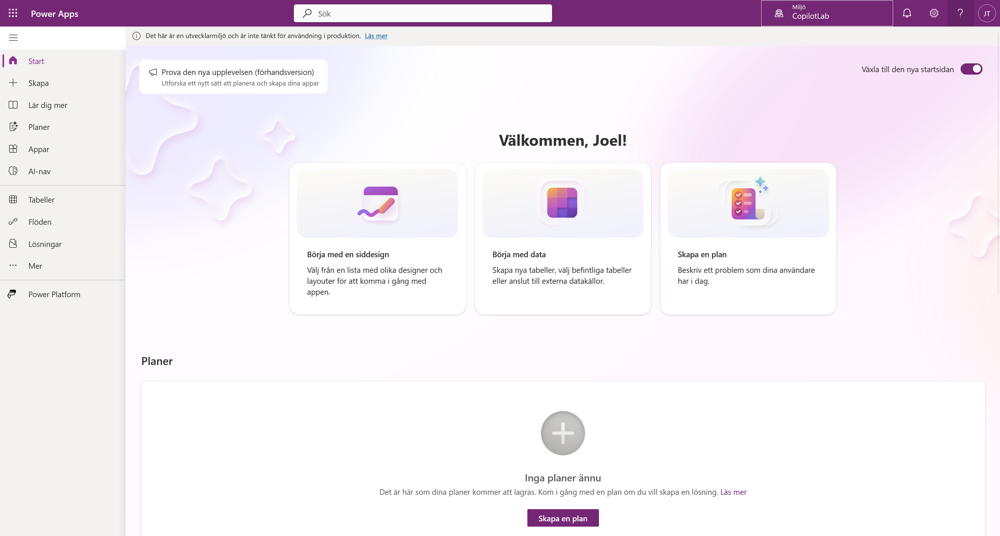
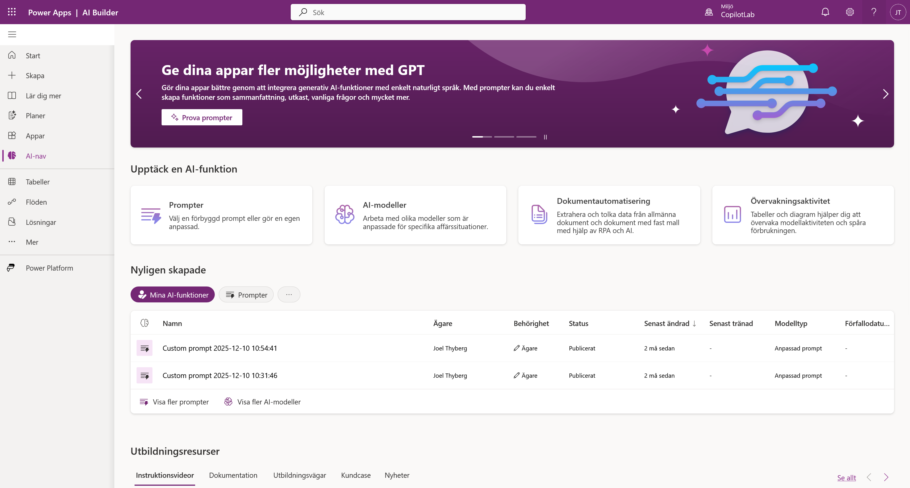
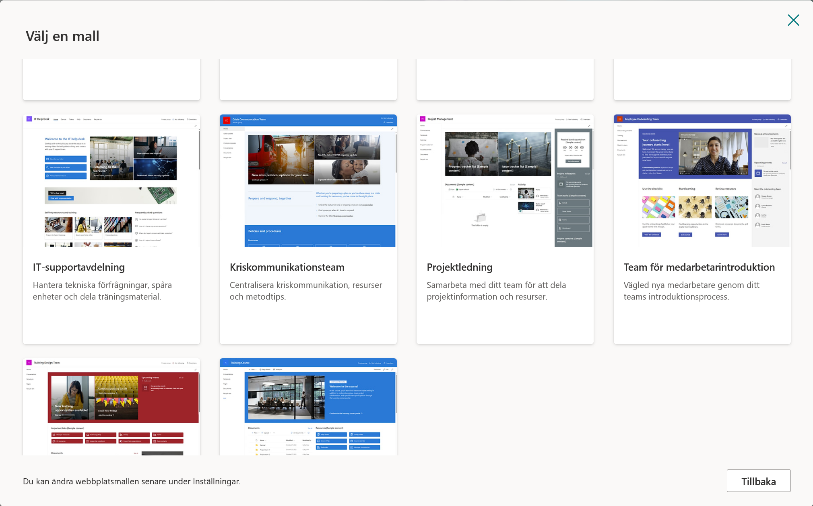

# 0. Förberedelser och Miljö

Innan vi börjar bygga måste vi se till att du har rätt förutsättningar. Vi ska skapa en **Developer Environment**.

!!! info "Varför Developer Plan?"
    När du aktiverar denna plan får du en personlig "sandlåda" där du har fulla admin-rättigheter. Det viktigaste är att denna miljö automatiskt inkluderar databasen **Dataverse**, vilket krävs för att vår agent ska kunna minnas saker och hantera godkännanden.

---

## Steg 1: Aktivera din miljö

1. Öppna en ny flik och gå till [Power Apps Developer Plan](https://www.microsoft.com/sv-se/power-platform/products/power-apps?market=se).
2. Klicka på den blå knappen **Prova kostnadsfritt**.

    

3. Ange din jobbmail, kryssa i rutan för att godkänna avtalen och klicka på **Börja kostnadsfritt**.

    

När du registrerat dig skickas du vidare till Power Apps startsida.

*Om du skickas direkt vidare utan att behöva fylla i något betyder det att du redan har licensen aktiverad sen tidigare. Det är inga problem, gå bara vidare till Steg 2.*

---

## Steg 2: Kontrollera och välj miljö

Nu ska vi se till att din nya miljö finns tillgänglig och välja den. Detta gör vi direkt inifrån Power Apps.

1. Titta uppe i högra hörnet på sidan. Klicka på väljaren för **Miljö** (där ditt namn eller ett miljönamn står).

    

2. En lista fälls ut. Titta under rubriken **App skapad med Dataverse**. Där ska din utvecklingsmiljö ligga. Klicka på den för att välja den.

**Viktigt om namngivning:**
I mina screenshots heter miljön "CopilotLab". Din miljö kommer troligen heta **"[Ditt Namn]s miljö"**.
    
Om du redan hade en utvecklingsmiljö sedan tidigare kommer systemet *inte* skapa en ny, utan du använder bara den gamla. Det viktiga är att miljön du väljer ligger under rubriken **App skapad med Dataverse** och inte under "Andra miljöer".

---

## Steg 3: Verifiera Dataverse

Nu gör vi ett snabbt test för att se att databasen (Dataverse) är installerad och fungerar.

1. Se till att du står i din nya miljö (enligt Steg 2).
2. Klicka på **AI-nav** i menyn längst till vänster.

    

3. **Titta på resultatet:**

**✅ Det ser ut så här (Succé):**
Du ser en sida med rutor för "AI-modeller", "Promptar" eller en lista. Inga felmeddelanden.

*Grattis! Din miljö är redo. Du kan gå vidare till nästa kapitel.*

**❌ Det ser ut så här (Fel):**
Du möts av en bild på en burk och texten **"Ingen databas hittades"**.

---

## 🛑 Felsökning

**Jag fick "Ingen databas hittades" i Steg 3?**
Då har du troligen valt fel miljö (t.ex. Standardmiljön) eller så har installationen av din Developer-miljö inte blivit klar än.
1. Dubbelkolla i menyn **Miljö** (uppe till höger) att du INTE är i "(standard)".
2. Om du är i rätt miljö men ändå får felet: Vänta 5-10 minuter och uppdatera sidan (F5). Ibland tar det en stund för databasen att skapas första gången.

**Jag får felmeddelande när jag försöker signa upp i Steg 1?**
Om din IT-avdelning har blockerat detta får du använda din **Standard**-miljö.
*OBS: Meddela kursledaren om du måste göra detta.*

# 1. Förbered SharePoint

Vår IT support agent behöver data för att kunna svara på frågor. Vi ska nu skapa en SharePoint-sajt som innehåller information om hårdvara (Laptops, skärmar etc.).

För att spara tid använder vi en färdig mall från Microsoft.

---

## Steg 1: Gå till SharePoint

Vi navigerar dit direkt från Power Apps.

1. Klicka på **Våfflan** (Appstartaren) bestående av 9 prickar högst upp i vänstra hörnet.

    

2. I menyn som fälls ut, klicka på **SharePoint**.

    

3. Du hamnar nu på startsidan för SharePoint. Klicka på **+ Skapa webbplats**.

    

---

## Steg 2: Välj mallen "IT Support"

Nu ska vi välja rätt mall.

1. Du får två val. Välj **Gruppwebbplats**.

    

2. Klicka på fliken **Mallar** högst upp.
3. Scrolla ner och klicka på rutan för **IT Support**.

    

4. Klicka på knappen **Använd mall**.

    

*(Om du inte ser mallen, kontakta kursledaren för instruktioner om hur man skapar listan manuellt).*

---

## Steg 3: Konfigurera namn och språk

Nu ska vi döpa sajten och välja språk.

1. **Webbplatsnamn:** Döp den till `IT Support`.
2. **Webbplatsbeskrivning:** (Valfritt) Skriv en kort beskrivning om du vill.
3. Klicka på knappen **Nästa**.

    

4. Nu får du välja språk. Välj **Svenska**.

    

    !!! info "Språkval"
        Eftersom vi kör med svenskt gränssnitt i den här versionen av kursen väljer vi **Svenska** här. Kolumnnamnen i SharePoint-listan kommer då heta saker som `Enhetstyp` istället för `DeviceType`. Instruktionerna i resten av kursen är anpassade för detta.

5. Klicka på **Skapa webbplats**.

    *Vänta några sekunder medan sajten skapas...*

6. När sajten är skapad kommer en ruta där du kan lägga till medlemmar. Vi behöver inte göra det nu. Klicka bara på **Slutför**.

    

    *Du skickas nu automatiskt till den nya sajten.*

---

## Steg 4: Anpassa listan "Devices"

Mallen har skapat en lista åt oss som heter **Devices**, men vi behöver lägga till bilder på produkterna.

1. På din nya sajt, klicka på fliken **Devices** i toppmenyn (eller under "Webbplatsinnehåll").

    

2. Scrolla längst till höger i listan tills du ser knappen **+ Lägg till kolumn**. Klicka på den.

    

3. I menyn som dyker upp, scrolla ner och välj **Hyperlänk**.

    

4. Döp kolumnen till `Image`.
5. Klicka på **Spara**.

    

    !!! info "Varför gör vi detta?"
        För att vår AI-agent ska kunna visa bilder i chatten behöver den en direktlänk (URL) till bilden. Det inbyggda bildfältet i SharePoint är svårt för agenten att läsa, så vi skapar en enkel länkkolumn istället.

---

## Steg 5: Lägg in testdata

Nu ska vi fylla listan med 4 produkter.

1. Klicka på knappen **+ Lägg till nytt objekt** (eller *Nytt*) uppe till vänster i listan.

    

2. En ruta öppnas till höger. Här fyller du i informationen för produkten (se tabellerna nedan).

    

!!! tip "Viktigt om bilder"
    **Lämna fältet 'Device photo' tomt!** Vi ska inte ladda upp några filer.
    
    Gör istället så här:
    1. Scrolla ner i formuläret till fältet **Image** (som vi skapade i förra steget).
    2. Kopiera länken (URL:en) från rutan under respektive produkt här nedanför.
    3. Klistra in den i **Image**-fältet i SharePoint.

### 1. Surface Laptop 13

* **Title:** Surface Laptop 13
* **Status:** Available
* **Manufacturer:** Microsoft
* **Model:** Surface Laptop 13
* **Asset Type:** Laptop
* **Color:** Silver
* **Serial Number:** 1
* **Price:** 1500
* **Order #:** 10001
* **Image:**
`https://tyto-official.github.io/copilot-studio-course/assets/images/products/surface-laptop-13.png`

---

### 2. Surface Laptop 15

* **Title:** Surface Laptop 15
* **Status:** Available
* **Manufacturer:** Microsoft
* **Model:** Surface Laptop 15
* **Asset Type:** Laptop
* **Color:** Black
* **Serial Number:** 2
* **Price:** 2000
* **Order #:** 10002
* **Image:**
`https://tyto-official.github.io/copilot-studio-course/assets/images/products/surface-laptop-15.png`

---

### 3. Surface Studio

* **Title:** Surface Studio
* **Status:** Available
* **Manufacturer:** Microsoft
* **Model:** Surface Studio
* **Asset Type:** Desktop
* **Color:** Silver
* **Serial Number:** 3
* **Price:** 2500
* **Order #:** 10003
* **Image:**
`https://tyto-official.github.io/copilot-studio-course/assets/images/products/surface-studio.png`

---

### 4. Surface Pro

* **Title:** Surface Pro
* **Status:** Available
* **Manufacturer:** Microsoft
* **Model:** Surface Pro
* **Asset Type:** Tablet
* **Color:** Pink
* **Serial Number:** 4
* **Price:** 1000
* **Order #:** 10004
* **Image:**
`https://tyto-official.github.io/copilot-studio-course/assets/images/products/surface-pro-12.png`

!!! success "Klart!"
    Nu har du en databas fylld med hårdvara. I nästa kapitel ska vi börja bygga själva agenten!
