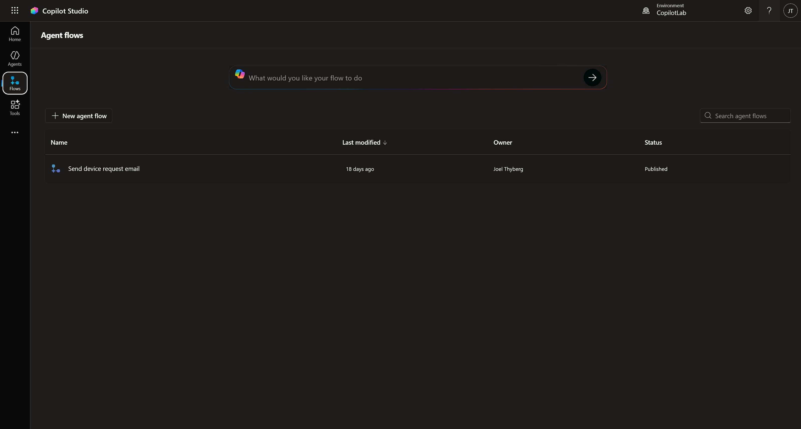
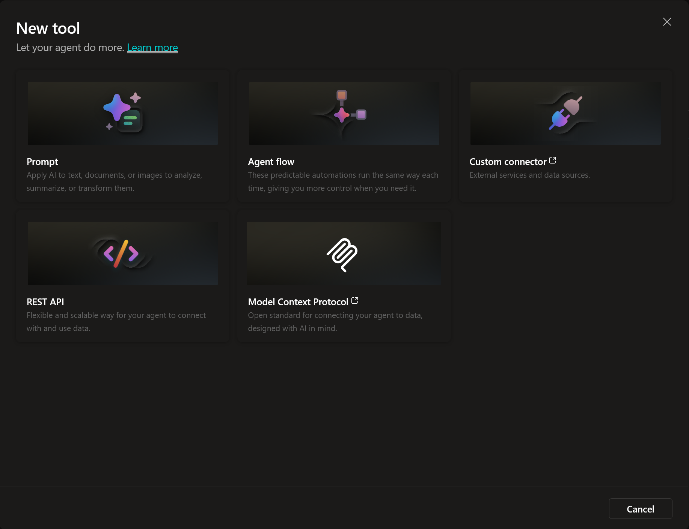

# 2. Hitta rätt i Copilot Studio

Nu när vi har datan på plats ska vi bekanta oss med verktyget vi ska jobba i. Copilot Studio utvecklas snabbt, så det är bra att veta var de olika delarna bor.

---

## Steg 1: Logga in och säkra miljön

Vi börjar med att säkerställa att vi är på rätt ställe.

1. Gå till [copilotstudio.microsoft.com](https://copilotstudio.microsoft.com).
2. Du möts nu av **Startsidan**.

### Kontrollera miljön (Igen!)
Det första du **alltid** ska göra är att titta uppe i högra hörnet.

1. Klicka på miljöväljaren.
2. Se till att du ligger i din **Developer Environment** (den vi skapade i kapitel 0).
3. Om du ligger i "Default" eller fel miljö – byt nu.

---

## Steg 2: Startsidan (Home)

I mitten av skärmen ser du en stor chattruta.
Här kan du använda "Describe to build" – alltså chatta med Copilot för att låta den bygga grunden åt dig.

 

**Toggle-knappen:** Ovanför rutan (se bilderna ovan) kan du växla mellan att be den bygga en **Agent** (en AI-agent) eller ett **Workflow** (ett flöde).

 

Under chattrutan har du tre genvägar för att börja från noll (Start building from scratch):

1. **Create Workflow:** Skapa en automatiserad process.
2. **Create Agent:** Skapa en AI-agent.
3. **Computer-using agent:** En agent som kan styra en dator.

Längre ner på sidan ser du dina senast uppdaterade agenter och länkar till dokumentation.

---

## Steg 3: Navigera i vänstermenyn

Tittar vi till vänster ser vi huvudmenyn. De viktigaste delarna är **Agents**, **Flows** och **Tools**.

### Agents (Agenter)
Klicka på **Agents** i menyn.

* Längst upp kan du återigen få hjälp av Copilot att skapa en ny agent.
* Uppe till höger finns knappen **+ Create blank agent** och möjlighet att **Importera** en agent.
* I listan ser du dina befintliga agenter.
* Längre ner finns färdiga mallar (Templates) från Microsoft som du kan utgå ifrån.

### Flows (Flöden)
Klicka på **Flows**.

Här bor logiken för **Agent flows**. I Copilot Studio betyder flows deterministiska processer bestående av AI-driven automation. Medan flows i **Power Automate** är mer flexibla och kan användas för att automatisera processer utan inblandning av AI.

---

## Steg 4: Tools (Verktyg) – Agentens verktygslåda

Klicka på **Tools**. Detta är kanske den mest spännande delen. Här ser du en lista på alla verktyg dina agenter kan använda.

Klicka på **+ New tool** för att se vad vi kan skapa.

Här ser du de olika typerna av verktyg:

* **Prompt:** Här använder vi AI-modellernas förmåga att analysera och generera, exempelvis för en specifik uppgift. T.ex. "Sammanfatta detta mejl" eller "Klassificera detta ärende".
* **Agent flow:** Här använder vi ett flöde som ett verktyg. Eftersom agent flows är deterministiska är detta perfekt när agenten behöver utföra något strikt.
* **Custom Connector:** Kopplingar till externa tjänster och datakällor (utanför Microsoft 365).
* **Rest API:** Detta är en mycket flexibel lösning som kan användas för att hämta data från olika system.
* **MCP (Model Context Protocol):** Detta är en ny standard. Man kan säga att det är **"USB-C för Generativ AI"**. Det är ett standardiserat sätt för AI-modeller att ansluta till externa källor för att använda och dela data säkert och enkelt.

---

## Steg 5: Fler tjänster

Slutligen, om du klickar på de **tre prickarna (...)** längst ner i menyn (under Tools).

Här ser du genvägar till andra Microsoft-tjänster och appar som ofta används tillsammans med agentbyggande, t.ex. Power Apps eller Power Automate.

---

*Nu hittar vi i gränssnittet. I nästa kapitel ska vi trycka på knappen **Create Agent** och börja bygga på riktigt!*