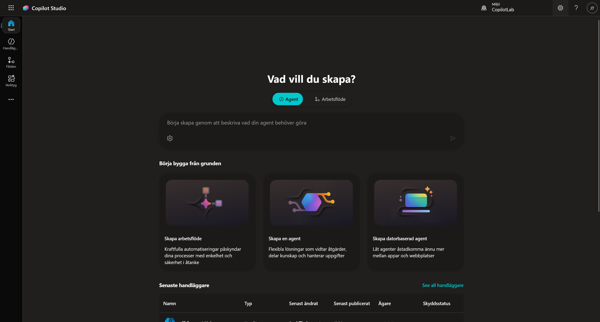
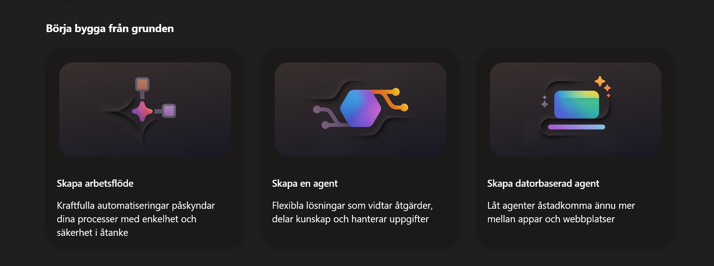
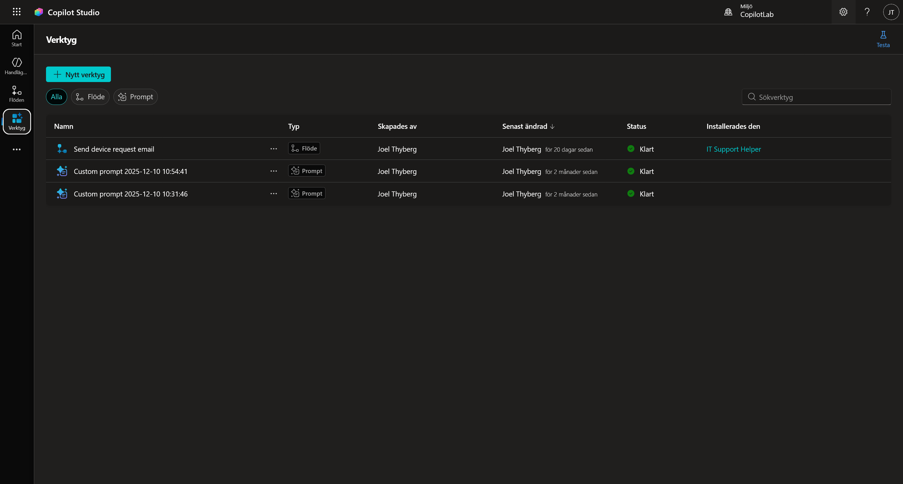

# 2. Hitta rätt i Copilot Studio

Nu när vi har datan på plats ska vi bekanta oss med verktyget vi ska jobba i. Copilot Studio utvecklas snabbt, så det är bra att veta var de olika delarna bor.

---

## Steg 1: Logga in och säkra miljön

Vi börjar med att säkerställa att vi är på rätt ställe.

1. Gå till [copilotstudio.microsoft.com](https://copilotstudio.microsoft.com).
2. Du möts nu av **Startsidan**.

### Kontrollera miljön (Igen!)
Det första du **alltid** ska göra är att titta uppe i högra hörnet.

1. Klicka på miljöväljaren.
2. Se till att du ligger i din **Utvecklarmiljö** (den vi skapade i kapitel 0).
3. Om du ligger i "Standard" eller fel miljö – byt nu.

---

## Steg 2: Startsidan (Start)

I mitten av skärmen ser du en stor chattruta.
Här kan du använda "Beskriv för att bygga" – alltså chatta med Copilot för att låta den bygga grunden åt dig.

 

**Växlingsknappen:** Ovanför rutan (se bilderna ovan) kan du växla mellan att be den bygga en **Agent** (en AI-agent) eller ett **Arbetsflöde** (ett flöde).

 

Under chattrutan har du tre genvägar för att börja från noll (Börja bygga från grunden):

1. **Skapa arbetsflöde:** Skapa en automatiserad process.
2. **Skapa en agent:** Skapa en AI-agent.
3. **Skapa datorbaserad agent:** En agent som kan styra en dator.

Längre ner på sidan ser du dina senast uppdaterade agenter och länkar till dokumentation.

---

## Steg 3: Navigera i vänstermenyn

Tittar vi till vänster ser vi huvudmenyn. De viktigaste delarna är **Agenter (Handläggare)**, **Flöden** och **Verktyg**.

### Agenter
Klicka på **Handläggare** i menyn.

* Längst upp kan du återigen få hjälp av Copilot att skapa en ny agent.
* Uppe till höger finns knappen **+ Skapa tom agent** och möjlighet att **Importera** en agent.
* I listan ser du dina befintliga agenter.
* Längre ner finns färdiga mallar från Microsoft som du kan utgå ifrån.

### Flöden
Klicka på **Flöden**.

Här bor logiken för **Agentflöden**. I Copilot Studio betyder flöden deterministiska processer bestående av AI-driven automation. Medan flöden i **Power Automate** är mer flexibla och kan användas för att automatisera processer utan inblandning av AI.

---

## Steg 4: Verktyg – Agentens verktygslåda

Klicka på **Verktyg**. Detta är kanske den mest spännande delen. Här ser du en lista på alla verktyg dina agenter kan använda.

Klicka på **+ Nytt verktyg** för att se vad vi kan skapa.

Här ser du de olika typerna av verktyg:

* **Prompt:** Här använder vi AI-modellernas förmåga att analysera och generera, exempelvis för en specifik uppgift. T.ex. "Sammanfatta detta mejl" eller "Klassificera detta ärende".
* **Agentflöde:** Här använder vi ett flöde som ett verktyg. Eftersom agentflöden är deterministiska är detta perfekt när agenten behöver utföra något strikt.
* **Anpassad anslutning:** Kopplingar till externa tjänster och datakällor (utanför Microsoft 365).
* **Rest API:** Detta är en mycket flexibel lösning som kan användas för att hämta data från olika system.

---

## Steg 5: Fler tjänster

Slutligen, om du klickar på de **tre prickarna (...)** längst ner i menyn (under Verktyg).

Här ser du genvägar till andra Microsoft-tjänster och appar som ofta används tillsammans med agentbyggande, t.ex. Power Apps eller Power Automate.

---

*Nu hittar vi i gränssnittet. I nästa kapitel ska vi trycka på knappen **Skapa agent** och börja bygga på riktigt!*
