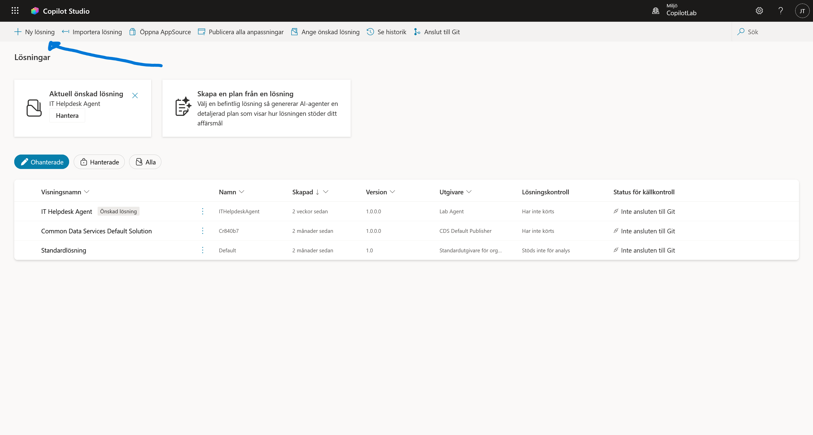
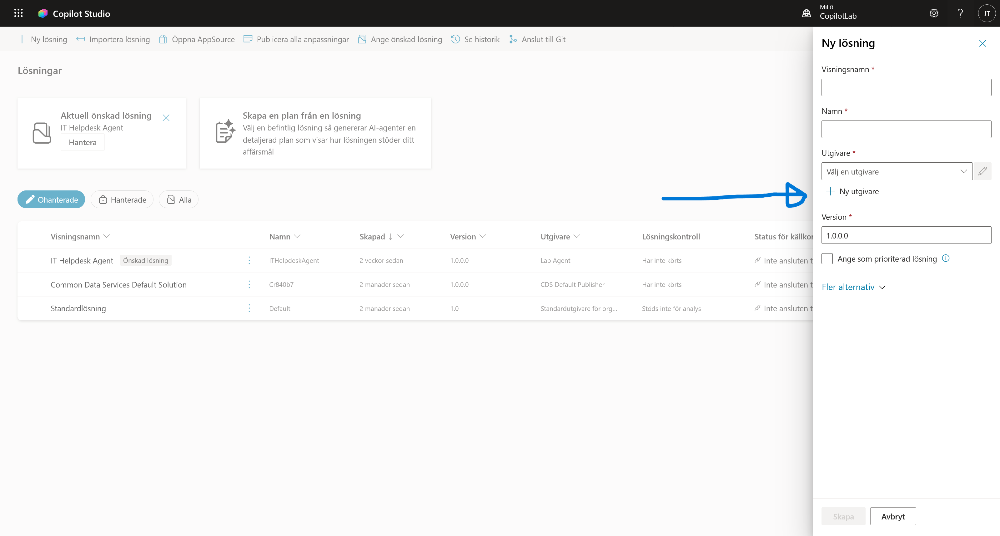
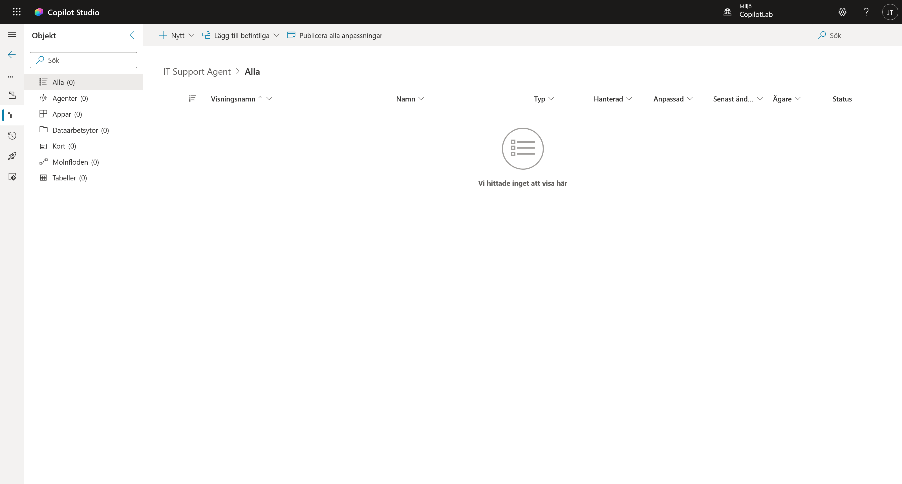

# 3. Skapa en Lösning (Solution)

Innan vi börjar bygga själva agenten ska vi skapa en "Lösning" (Solution). Tänk på detta som en **digital portfölj** eller en mapp där vi samlar allt som hör till vårt projekt.

Om vi inte gör detta hamnar allt i en stor röra som heter "Default Solution", vilket gör det omöjligt att flytta eller hantera agenten senare.

!!! tip "Varför Solution?"
    * **Ordning:** Allt som hör till din agent (chatboten, flöden, anslutningar) samlas på ett ställe.
    * **Flyttbarhet:** Vill du flytta din agent från din Developer-miljö till företagets riktiga miljö? Då **måste** den ligga i en Solution.

---

## Steg 1: Hitta till Solution Explorer

Vi kan hantera detta direkt inifrån Copilot Studio.

1. I vänstermenyn, klicka på de **tre prickarna (...)**.
2. Klicka på **Lösningar** (under rubriken "Utforska").

3. Nu ser du en lista på alla lösningar i miljön. Klicka på **+ Ny lösning**.

---

## Steg 2: Skapa en Publisher (Utgivare)

En "Publisher" är din signatur. Det visar vem som byggt agenten och lägger till ett prefix (t.ex. `alab_`) på alla dina tekniska komponenter för att undvika namnkonflikter med Microsofts system.

1. I rutan som dyker upp, leta efter fältet **Utgivare**.
2. Klicka på **+ Ny utgivare**.

3. Fyll i följande uppgifter under fliken **Egenskaper**:
    * **Visningsnamn:** Använd dina initialer, t.ex. `Agent JT`
    * **Namn:** Samma utan mellanslag, t.ex. `AgentJT` *(Inga mellanslag)*
    * **Prefix:** Dina initialer i gemener, t.ex. `jt` *(Detta kommer stå framför alla dina databasnamn, t.ex. jt_minTabell)*
    * **Valalternativprefix:** Den slumpade siffran som redan står där fungerar bra. Du kan även ändra den till `10000` om du vill ha ett renare nummer.
      *(Detta styr vilka sifferkoder dina valalternativ får i databasen).*

4. Du behöver **inte** fylla i något under fliken *Kontakt*.
5. Klicka på **Spara**.

*(Rutan stängs och du kommer tillbaka till Ny lösning-rutan. Din nya utgivare ska nu vara vald).*

---

## Steg 3: Skapa din Solution

Nu skapar vi själva lådan där vår agent ska bo.

1. **Visningsnamn:** `IT Support Agent`
2. **Namn:** `ITSupportAgent` (fylls i automatiskt)
3. **Utgivare:** Välj den du nyss skapade (`Agent JT`).
4. **Version:** `1.0.0.0` (Låt det vara).

**Viktigt steg:**
5. Kryssa i rutan: **Ange som din föredragna lösning**.
    * *Varför?* Detta gör att allt du bygger framöver automatiskt sparas i denna lösning, även om du skapar saker från startsidan. Det förhindrar att dina filer hamnar i den stökiga "Standardlösningen".

6. **Fler alternativ:** Du kan ignorera denna del (lämna fälten tomma). Vi behöver ingen konfigurationssida för denna labb.
7. Klicka på **Skapa**.

---

## Steg 4: Kontrollera och aktivera

Nu ska vi verifiera att lösningen är skapad och att den är inställd som standard.

1. Klicka på **pilen** (Tillbaka) längst upp till vänster (eller på "Lösningar" i brödsmulorna) för att komma tillbaka till översikten.

2. Titta högst upp på sidan. Du ska nu se en ruta där det står **Aktuell föredragen lösning: IT Helpdesk Agent**.

*Eftersom vi kryssade i rutan "Ange som föredragen" tidigare ser vi nu detta meddelande. Det bekräftar att Copilot Studio vet att alla nya agenter ska läggas i just denna låda.*

!!! success "Klart!"
    Nu har du en professionell grundstruktur på plats. I nästa kapitel ska vi äntligen skapa vår agent!
