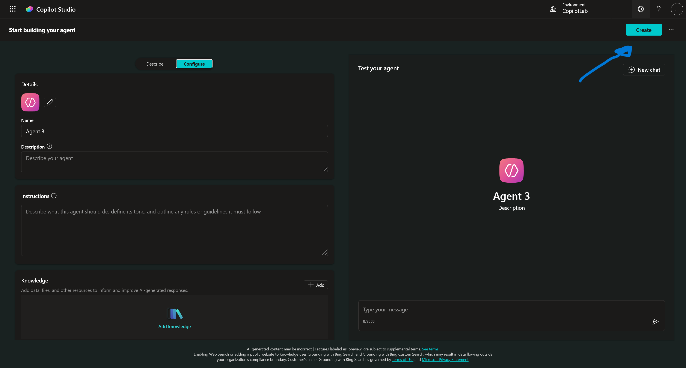

# 4. Skapa Agenten

Nu har vi gjort klart all nödvändig setup. Vi har datan, vi har miljön och vi har vår Solution. Nu är det dags att börja bygga!

Vi ska bygga en **IT Support Helper**. I början kommer den fokusera på hårdvara (det vi lade i SharePoint), men tanken är att den ska växa och kunna hantera alla möjliga IT-frågor framöver.

---

## Vägval: Hur skapar vi agenten?

Eftersom vi i förra kapitlet ställde in din Solution som **Preferred** (Föredragen), spelar det ingen roll varifrån du skapar agenten. Den kommer automatiskt hamna i rätt "låda".

Vi rekommenderar att du använder huvudmenyn (den vanliga vägen), men för kännedom kan man även göra det inifrån sin Solution.

??? info "Alternativ väg: Skapa direkt inifrån din Solution (Klicka för att se)"
    Om du vill vara 100% säker på var agenten hamnar, eller om du inte använder "Preferred solution"-funktionen, gör du så här:

    **1. Gå in i din Solution**
    Navigera till **Solutions** i menyn och klicka på din lösning (`IT Helpdesk Agent`).
    
    

    **2. Klicka på New**
    Väl inne i lösningen ser du allt som ingår i den. Klicka på **+ New** i toppmenyn.
    
    

    **3. Välj Agent**
    I menyn som fälls ut, välj **Agent** -> **Agent**.
    
    
    
    **4. Förhandsvisning och Val**
    Detta tar dig till en vy där du startar skapandet. Här ser du "Describe"-fliken där du kan låta Copilot skapa grunderna åt dig via chatten.
    
    
    
    Alternativt kan du klicka på fliken **Configure** (eller Skip to configure) för att manuellt bestämma namn och inställningar direkt. När du är nöjd klickar du på **Create** för att officiellt skapa agenten.
    
    

---

## Steg 1: Skapa från grunden (Create blank agent)

Vi väljer att gå den vanliga vägen via huvudmenyn. När man skapar en agent finns det huvudsakligen tre vägar att gå:

1.  **Describe to build:** Du chattar med Copilot ("Skapa en agent som...") och låter AI:n bygga grunden åt dig.
2.  **Templates:** Du utgår från en färdig mall för ett specifikt syfte (t.ex. en reseagent).
3.  **Create blank agent:** Du startar med ett helt tomt papper.

Vi kommer att välja alternativ 3: **Create blank agent**.

!!! tip "Varför Create blank agent?"
    Även om det är smidigt att låta AI:n eller en mall göra jobbet, ger det oss mindre kontroll. AI:n gissar ofta vilka verktyg som behövs, vilket kan leda till en rörig konfiguration.
    
    Genom att välja **Create blank agent** får vi en helt tom agent där vi själva bestämmer exakt vad den ska heta, vad den ska göra och vilka verktyg den får använda. Det är det bästa sättet att lära sig verktyget på riktigt.

**Gör så här:**

1. Om du varit inne i Solutions nyss: Klicka på **Copilot Studio**-loggan uppe till vänster.
2. Klicka på **Agents** i vänstermenyn.
3. Klicka på **+ Create blank agent** (uppe i högra hörnet).

    

*Agenten skapas nu direkt och du skickas till översiktsvyn.*

---

## Steg 2: Hitta runt i gränssnittet

Nu landar du i översiktsvyn för din nya agent. Innan vi fyller i något, låt oss gå igenom vad de olika delarna betyder.


Här är de viktigaste komponenterna:

* **Name & Description:** Agentens identitet utåt.
* **Triggers:** Det som får agenten att vakna eller agera på en viss händelse (t.ex. när ett mejl kommer).
* **Instructions:** Detta är "System Prompten". Här beskriver vi agentens personlighet, regler och beteende.
* **Knowledge:** Agentens minne. Här kopplar vi bland annat in dokument, webbsidor och SharePoint-listor.
* **Tools (Actions):** Agentens händer. Här lägger vi till verktyg om den ska kunna *göra* saker (t.ex. skicka ett mejl).
* **Agents:** Här kan vi koppla ihop vår agent med andra agenter, eller skapa så kallade **Child Agents**.
* **Topics:** Detta är "hårda" manus. Om vi vill att en konversation ska följa en exakt mall (t.ex. en returprocess) bygger vi det här.
* **Suggested Prompts:** De förslag på frågor som syns i chattrutan för användaren (Conversation Starters).

Till höger ser du **Test your agent**. Det är din sandlåda där du kan chatta med agenten medan du bygger för att se hur den beter sig.

---

## Steg 3: Grundkonfiguration

Nu ska vi ge agenten dess identitet. Fyll i följande i fälten på skärmen:

1.  **Name:** `IT Support Helper`
2.  **Description:**
    ```text
    En professionell IT-supportagent som hjälper användare med frågor om hårdvara och nätverk.
    ```
3.  **Model:** Låt den stå på `GPT-4.1` (Vilket är Default).

---

## Steg 4: Sätt upp Instruktioner

Nu ska vi ge agenten en enkel "hjärna". Gå till rutan för **Instructions** och klistra in följande:

```text
Du är en hjälpsam och professionell IT-supportassistent för företaget.
Din uppgift är att hjälpa anställda med frågor rörande IT, hårdvara och felsökning.

Riktlinjer för dina svar:
- Var alltid vänlig och pedagogisk.
- Svara på samma språk som användaren ställer frågan på (Svenska eller Engelska).
- Använd endast information från din kunskapsbank.
- Om du inte hittar svaret i din kunskapsbank, ska du tydligt informera användaren om att du saknar den informationen. Hitta aldrig på fakta.
- Använd punktlistor för att göra teknisk information lättläst.
```

---

## Steg 5: Testa Agenten

Vi har nu skapat agentens "hjärna" (instruktionerna), och nu är det dags att testa hur den beter sig.

### Steg 1: Öppna testpanelen
Om du inte redan ser chatten till höger:
1. Klicka på **Test**-knappen högst upp till höger i Copilot Studio.


### Steg 2: Hälsa på agenten
Vi börjar med att kolla att den förstår sin roll.

1. Skriv i chatten:
    > *Hej, vem är du?*

2. **Förväntat resultat:**
    Agenten ska presentera sig som **IT Support Helper** (eller det namn du valde) och erbjuda hjälp. Den ska vara trevlig och professionell.


*Ser det bra ut? Då vet vi att systemprompten ("Du är en hjälpsam assistent...") fungerar.*

### Steg 3: Hallucinationstestet
Nu ska vi ställa en fråga som agenten **inte** har svaret på. Vi har inte laddat upp några öppettider eller dokument än.

En dålig AI skulle gissa ("Vi har öppet 8-17"). En bra agent (med våra instruktioner) ska erkänna att den inte vet.

1. Skriv i chatten:
    > *Vilka tider har IT-supporten öppet?*

2. **Förväntat resultat:**
    Agenten ska svara något i stil med:
    > *"Jag hittar tyvärr ingen information om öppettiderna i mina system."*


### Varför är detta bra?
Om agenten hade svarat *"Vi har öppet 08:00 - 17:00"*, hade den ljugit (hallucinerat). Det är farligt i en företagskontext.
Eftersom vi skrev i instruktionerna: *"Hitta aldrig på fakta"*, så skyddar agenten oss genom att vara ärlig.

!!! success "Bra jobbat!"
    Att agenten svarar "Jag vet inte" är precis vad vi vill! Det betyder att den följer din regel om att **inte hitta på fakta**. I nästa kapitel ska vi ge den svaren genom att koppla in SharePoint.