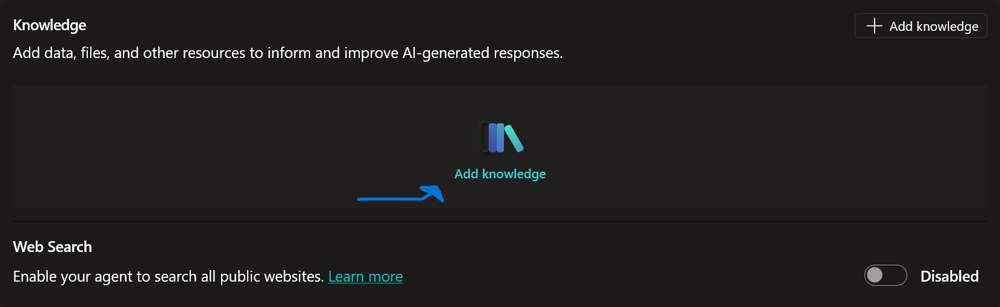
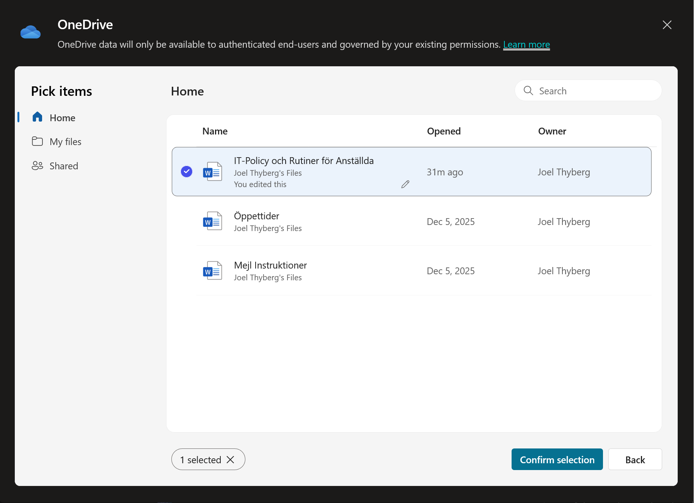
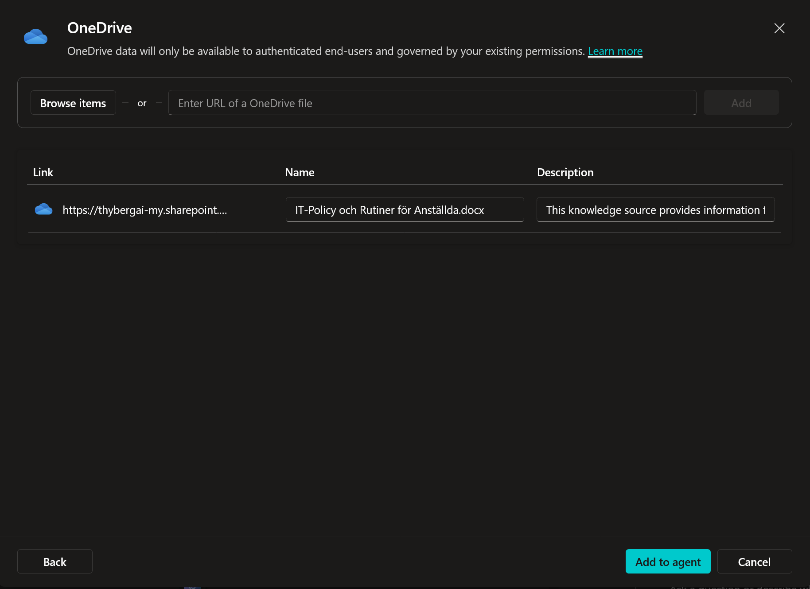
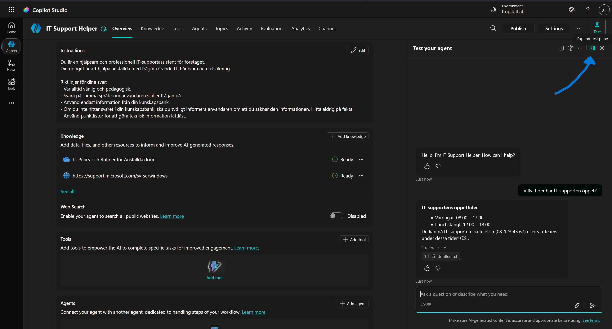
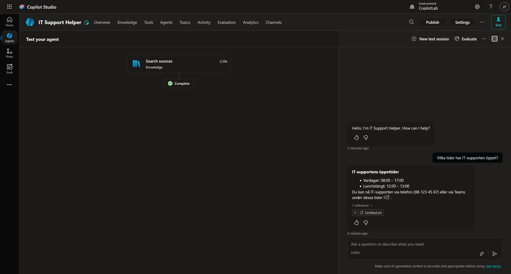
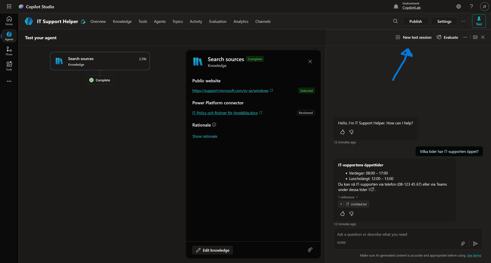

# 5. Ge Agenten Kunskap

Just nu är vår agent trevlig, men den vet ingenting om vårt företag. Den misslyckades ju nyss med att svara på när supporten har öppet.

Nu ska vi ändra på det! Vi ska ge agenten två typer av kunskap:

1.  **Intern kunskap:** Ett dokument med vår IT-policy.
2.  **Extern kunskap:** Microsofts officiella hjälpsidor för Windows.

---

## Steg 1: Skapa Policy-dokumentet

Vi behöver en fil att ladda upp. Vi skapar den snabbt via Word Online.

1.  Klicka på **Appfönstret** (de nio prickarna, "Våfflan") längst upp till vänster i webbläsaren och klicka på **Word**.

    

2.  Välj **Tomt dokument** (Blank document).
3.  Kopiera texten i rutan nedan och klistra in den i ditt Word-dokument:

```text
**IT-Policy och Rutiner för Anställda**
Version: 2025-1.0

**1. Kontakt och Öppettider**
Generell IT-support nås på telefon (08-123 45 67) eller via Teams.
Supportens öppettider är:
- Vardagar: 08:00 – 17:00
- Lunchstängt: 12:00 – 13:00

**2. Uthämtning av ny utrustning**
Beställda datorer och telefoner kan hämtas ut i IT-receptionen (Plan 3).
Öppettider för just uthämtning är begränsade till:
- Måndagar: 09:00 – 11:00
- Torsdagar: 13:00 – 15:00

**3. Installation av programvara**
Det är tillåtet att installera arbetsrelaterade program (t.ex. Spotify, VS Code).
Det är **strängt förbjudet** att installera spelplattformar (t.ex. Steam, Epic Games, Battle.net) på företagets datorer. Upptäcks detta kan datorn komma att fjärraderars omedelbart.

**4. Skadad eller förlorad utrustning**
Om din enhet går sönder eller blir stulen måste du anmäla detta till IT-supporten inom 24 timmar.
- Vid stöld krävs en polisanmälan.
- Vid skada orsakad av oaktsamhet (t.ex. kaffespill) utgår en självrisk på 500 kr som dras på nästa lön.

**5. Hemarbete och Säkerhet**
Du får ta med din arbetsdator hem. För att säkerställa att datorn har de senaste säkerhetsuppdateringarna måste du ansluta till företagets VPN minst en gång i veckan.
```

4. Klicka på namnet (där det står Document eller Dokument) i den översta namnlisten och döp filen till IT-Policy och Rutiner för Anställda.

5. Spara filen så att du hittar den igen.

---

## Steg 2: Ladda upp dokumentet (Intern kunskap)

Nu ska vi lära agenten innehållet i filen.

1. Se till att du är inne i din agent (**IT Support Helper**).
2. Leta upp sektionen **Knowledge** (oftast mitt på sidan eller under fliken Knowledge) och klicka på **Add knowledge**.

    

3. Välj OneDrive i **Upload file** fältet (eller *select to browse*).

    

4. Leta upp filen `IT_Policy och Rutiner för Anställda` som du nyss skapade och välj den genom att klicka på den och sedan klicka på **Confirm selection**.

    

5. Klicka på **Add to agent**.

    

*Nu börjar Copilot Studio bearbeta filen ("Indexing"). Detta kan ta någon minut beroende på filens storlek. Under tiden gör vi nästa steg!*

---

## Steg 3: Lägg till en webbsida (Extern kunskap)

Vi vill inte behöva skriva instruktioner för hur man använder Windows 11 själva. Det har Microsoft redan gjort. Vi pekar agenten dit istället.

1. Klicka på **+ Add knowledge** igen.
2. Välj **Public websites**.

    

3. I rutan för URL, klistra in:
    `https://support.microsoft.com/sv-se/windows` och klicka på **Add**.

    

4. Klicka där efter på **Add to agent**.

    

---

## Steg 4: Testa Kunskapen

Nu har vi gett agenten både interna regler och extern expertis. Dags att se om det fungerar!

*(Kontrollera att statusen på dina källor är "Ready" innan du testar).*

### Test 1: Den interna frågan (Revansch!)
Förra gången visste agenten inte när vi hade öppet.

1. Gå till testchatten och klicka på "Refresh" (pilen) högst upp för att starta om konversationen.
2. Fråga:
    > *Vilka tider har IT-supporten öppet?*

**Förväntat resultat:**
Nu ska agenten svara att supporten har öppet vardagar 08:00 – 17:00.

### Analys: Hur tänkte agenten?
Nu ska vi se hur den använde våra källor.

1.  Längst upp i testpanelen, klicka på ikonen för **Expand test panel** (ser ut som en pil).

    

2.  Nu ser du flödet som agenten gick igenom. Klicka på boxen som heter **Search sources**.

    

3.  En detaljruta öppnas. Här ser du exakt vilka källor agenten har **utvärderat**.
    
    
    
    * Du ser förmodligen både din **Public website** och ditt **Dokument** i listan.
    * Detta betyder att agenten ansåg att båda källorna *kunde* vara relevanta och "läste igenom" dem (Reviewed).
    * Men eftersom svaret bara fanns i dokumentet, var det bara den källan som användes för att formulera svaret (Referenced).

    

### Test 2: Den externa frågan
Nu testar vi den andra källan för att se om den kan söka på webben.

1.  Klicka på **New test session** högst upp i testpanelen för att rensa minnet.

    

2. Fråga:
    > *Hur tar jag en skärmdump i Windows 11?*

**Förväntat resultat:**
Agenten ska ge dig en steg-för-steg guide hämtad från Microsofts hemsida.


!!! success "Succé!"
    Du har nu byggt en **hybrid-agent**! Den kombinerar dina unika företagsregler med allmän kunskap från internet.
    
    *(Vi väntar lite med SharePoint-listan för att säkerställa att alla har rätt behörigheter, men principen är exakt densamma).*

!!! info "Alternativ: Web Search (Hela internet)"
    Du kanske har sett att det finns en inställning som heter Web Search under Knowledge-fliken?

    

    Om du aktiverar denna ("Enabled") kommer agenten att söka på *hela* internet via Bing, inte bara på de specifika sidor du angett.

    **Varför använder vi inte det?**
    I en företagskontext vill vi oftast ha kontroll. Om vi slår på "Hela internet" kan agenten börja hämta svar från Flashback, Reddit eller osäkra källor. Genom att bara lägga till specifika URL:er (som `microsoft.com`) garanterar vi att svaren håller hög kvalitet.