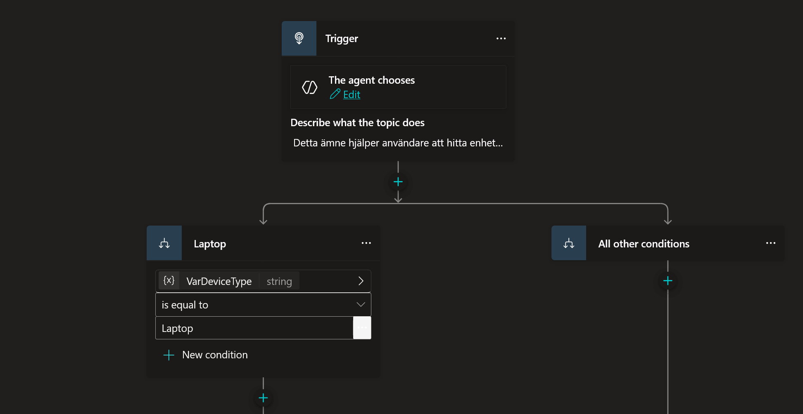
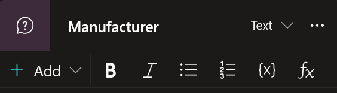
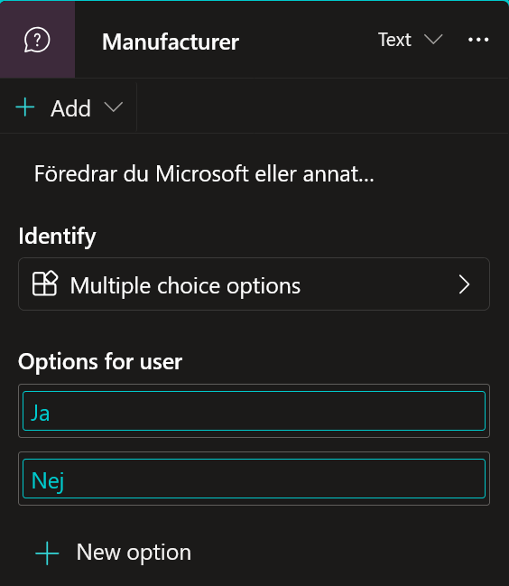

# 6. Skapa en Styrd Dialog (Topic)

Nu när agenten har både tonläge och kunskap, ska vi titta på hur vi kan **styra** ett samtal. Detta är en av de viktigaste delarna för att få agenten att utföra faktiska uppgifter.

Vi ska skapa en "Topic" (ett ämne) som hanterar lagersaldokontroll.

---

## 6.1 Skapa och Beskriv Ämnet

Vi börjar med att skapa ett tomt ämne och berätta för AI:n vad det ska användas till.

1.  Gå till fliken **Topics** i menyn.

    

2.  Klicka på **+ Add a topic** och välj **From blank**.

    

3.  Nu ser du en tom topic. Klicka på namnet "Untitled" högst upp till vänster och döp den till:

    ```text
    Available devices
    ```

    

    *(Vi använder engelska på namnet för att hålla det tekniskt rent).*

4.  Redan nu på arbetsytan (Canvasen) ser du rutan **Trigger**. Under rubriken *Describe what the topic does*, klistra in följande beskrivning:

    ```text
    Detta ämne hjälper användare att hitta enheter som är tillgängliga i vår SharePoint-lista. Användaren kan fråga efter tillgängliga enheter och får då tillbaka en lista som kan inkludera laptops, smartphones, tillbehör med mera.
    ```

    *Beskrivningen är avgörande. Det är den här texten som agentens "hjärna" läser för att förstå NÄR den ska aktivera just den här topicen.*

    

---

## 6.2 Definiera Input (Input Variable)

Nu ska vi göra något smart. Vi vill att agenten ska kunna plocka upp *vad* användaren letar efter (t.ex. "Laptop") redan i första meningen.

1.  Klicka på **Details** (cirkeln med utropstecken `i`) längst upp till höger för att fälla ut detaljpanelen.
    *Notera att Name och Description redan är ifyllda eftersom vi gjorde det i förra steget.*

    

2.  I detaljpanelen, klicka på fliken **Input**.

    

3.  Klicka på knappen **Create a new variable**.

    

### Konfigurera variabeln
Nu får du upp inställningar för din nya variabel. Fyll i följande:

1.  **Name:**
    ```text
    VarDeviceType
    ```
    
    !!! tip "Varför engelska och inga mellanslag?"
        Vi följer "Best Practice" inom Power Platform och programmering. Genom att använda alfanumeriska namn (Bokstäver A-Z och siffror) undviker vi problem med specialtecken (å, ä, ö) när vi senare ska använda variabeln i formler och kod.

2.  **How will the agent fill this input?:** Låt denna stå kvar på **Dynamically fill with best option (default)**.
    *Detta betyder att vi litar på att AI-modellen (LLM) är smart nog att hitta informationen i användarens mening.*

3.  **Variable data type:** Låt stå på **String** (Text).

4.  **Display name:** (Valfritt).
    ```text
    VarDeviceType
    ```

5.  **Identify as:** Klicka på listan och välj: **User's entire response**.
    *Detta ger oss mest flexibilitet att fånga upp precis det användaren frågar efter.*

    

6.  **Description:** (Detta fält är till för AI:n, inte användaren).
    Det handlar om att specificera vad vi är ute efter. Eftersom vi valde att ta med *hela* användarens svar, är det bra att ge AI:n en fingervisning om vilka värden vi letar efter i texten.

    ```text
    Lista av möjliga värden: Laptop, Desktop, Tablet
    ```

    Om allt är ifyllt enligt instruktionerna borde det se ut ungefär så här:

    

---

## 6.3 Definiera Output (Output Variable)

Vi är inte riktigt klara än! Vi ska redan nu bestämma vad den här topicen ska leverera tillbaka till agenten när den är klar. Eftersom vi ska hämta en lista med produkter, måste vi förbereda en variabel för det.

1.  Längst upp i detaljpanelen, klicka på fliken **Output**.

    

2.  Klicka på **Create a new variable**.

    

### Konfigurera output-variabeln

1.  **Name:**
    ```text
    VarAvailableDevices
    ```

2.  **Variable data type:** **OBS! Viktigt steg.**
    Klicka på listan (där det står *String*) och ändra till **Table**.
    
    *Varför? Jo, en "String" är bara text (t.ex. "Dator"). Men vi ska hämta en hel lista med flera produkter, priser och bilder från SharePoint. Då krävs datatypen Tabell.*

3.  **Description:**
    ```text
    Lista över tillgängliga enheter baserat på enhetstyp
    ```

    Kontrollera att det ser ut så här:

    

4.  Nu är vi klara med inställningarna! Stäng detaljpanelen genom att klicka på krysset (**X**) högst upp till höger.

    

---

## 6.4 Bygga Logiken (Conditions & Questions)

Nu har vi en start (Trigger), en Input och en Output. Nu ska vi bygga det som händer däremellan – själva "hjärnan" i topicen.

### 1. Välj Nod-typ
Vi ska börja med att skapa ett vägskäl. Om användaren vill ha en "Laptop" ska vi ställa vissa frågor. Om de vill ha något annat, gör vi något annat.

1.  Håll muspekaren över linjen under din **Trigger**-nod och klicka på **plus-tecknet (+)**.

    

2.  En meny öppnas. Här är en snabb genomgång av verktygslådan:

    

    * **Send a message:** Skickar text eller bilder till användaren.
    * **Ask a question:** Ställer en fråga och sparar svaret (det vi ska använda snart).
    * **Ask with adaptive card:** Visar interaktiva formulär (mer om detta senare).
    * **Add a condition:** Skapar vägval (Om X, gör Y). Som en "If-sats".
    * **Variable management:** För att skapa eller ändra variabler manuellt.
    * **Topic management:** För att hoppa till andra topics eller avsluta samtalet.
    * **Call an action (Add a tool):** Här hittar vi våra "superkrafter" som Power Automate och SharePoint.
    * **Advanced:** Avancerade funktioner som HTTP-anrop och inloggning.

3.  Välj **Add a condition**.

    

### 2. Konfigurera Vägvalet (Condition)
Nu ser du att flödet delar sig i två vägar: *Condition* och *All other conditions*.

1.  Klicka på rutan där det står **Condition** och döp noden till: 

    ```text
    Laptop
    ```

    

2.  Vi ska nu bestämma regeln. Klicka på **Select a variable**.
3.  Välj din input-variabel: `VarDeviceType`.
4.  Låt operation vara satt till **is equal to**.
5.  I rutan *Enter or select a value*, skriv:
    ```Laptop```

    *Nu har du sagt: "Om användaren letar efter en Laptop -> Gå till vänster. Annars -> Gå till höger."*

    

### 3. Ställ frågor (Tratten)
Vi fortsätter på spåret för "Laptop" (den vänstra vägen). Vi vill veta mer om vad de vill ha.

1.  Klicka på **plus-tecknet (+)** under din nya *Laptop*-nod.

    

2.  Välj **Ask a question**.

    

3.  Döp noden till:
    ```Manufacturer```

    

4.  I rutan **Enter a message**, skriv:
    ```Är du specifikt intresserad av en Microsoft-laptop?```

    

5.  Under **Identify**, se till att **Multiple choice options** är valt.

6.  Under **Options for user**:
    * Klicka **+ New option**, skriv `Ja` och tryck Enter.
    * Klicka **+ New option**, skriv `Nej` och tryck Enter.

    

### 4. Döpa om Variabeln
Agenten sparar automatiskt svaret i en variabel som heter `Var1`. Det är ett dåligt namn om vi ska minnas vad det betyder.

1.  Klicka på rutan där det står **Save user response as** (där namnet `Var1` står).
2.  En ruta öppnas till höger. Ändra **Name** till:
    `VarManufacturerChoice`

    

    *Notera "Usage" inställningen: Topic (limited scope) vs Global. Vi låter den vara kvar på Topic eftersom vi inte behöver komma åt det här svaret från andra delar av agenten.*

3.  Stäng variabel-rutan på krysset (X).

### 5. Städa upp flödet
Eftersom vi valde "Multiple choice" har Copilot Studio automatiskt skapat nya vägar åt oss: en för *Ja*, en för *Nej*, och en för *All other conditions* (om användaren svarar något konstigt).


Eftersom vi bara bryr oss om Ja och Nej just nu, kan vi ta bort "skräp-vägen".

1.  Leta upp grenen som heter **All other conditions** (den ligger bredvid Ja och Nej).
2.  Klicka på de **tre prickarna (...)** på den noden och välj **Delete**.

    
