# 6. Skapa en Styrd Dialog (Ämne)

Nu när agenten har både tonläge och kunskap, ska vi titta på hur vi kan **styra** ett samtal. Detta är en av de viktigaste delarna för att få agenten att utföra faktiska uppgifter.

Vi ska skapa ett "Ämne" som hanterar lagersaldokontroll.

---

## 6.1 Skapa och Beskriv Ämnet

Vi börjar med att skapa ett tomt ämne och berätta för AI:n vad det ska användas till.

1.  Gå till fliken **Ämnen** i menyn.

    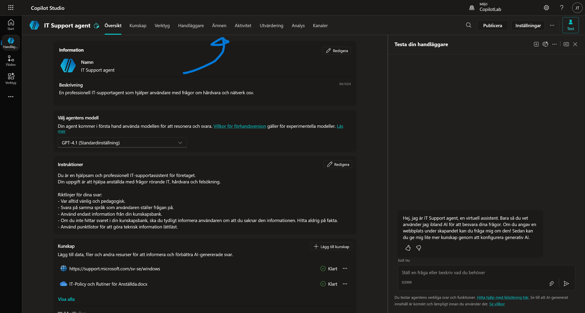

2.  Klicka på **+ Lägg till ett ämne** och välj **Från tom**.

    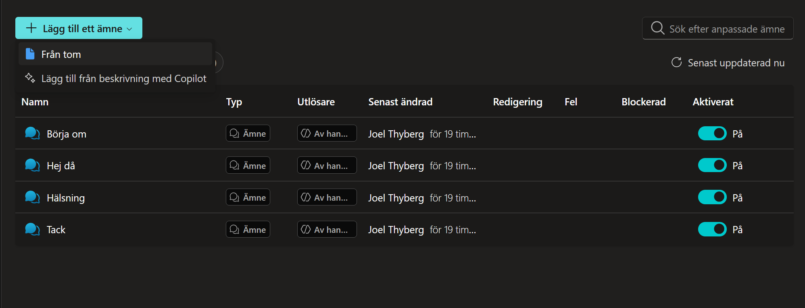

3.  Nu ser du ett tomt ämne. Klicka på namnet "Namnlös" högst upp till vänster och döp den till:

    ```text
    Tillgängliga Enheter
    ```

    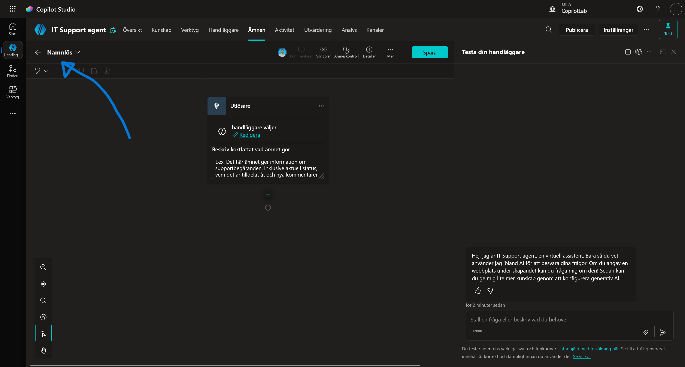

4.  Redan nu på arbetsytan (Canvasen) ser du rutan **Utlösare**. Under rubriken *Beskriv vad ämnet gör*, klistra in följande beskrivning:

    ```text
    Detta ämne hjälper användare att hitta enheter som är tillgängliga i vår SharePoint-lista. Användaren kan fråga efter tillgängliga enheter och får då tillbaka en lista som kan inkludera laptops, smartphones, tillbehör med mera.
    ```

    *Beskrivningen är avgörande. Det är den här texten som agentens "hjärna" läser för att förstå NÄR den ska aktivera just det här ämnet.*

    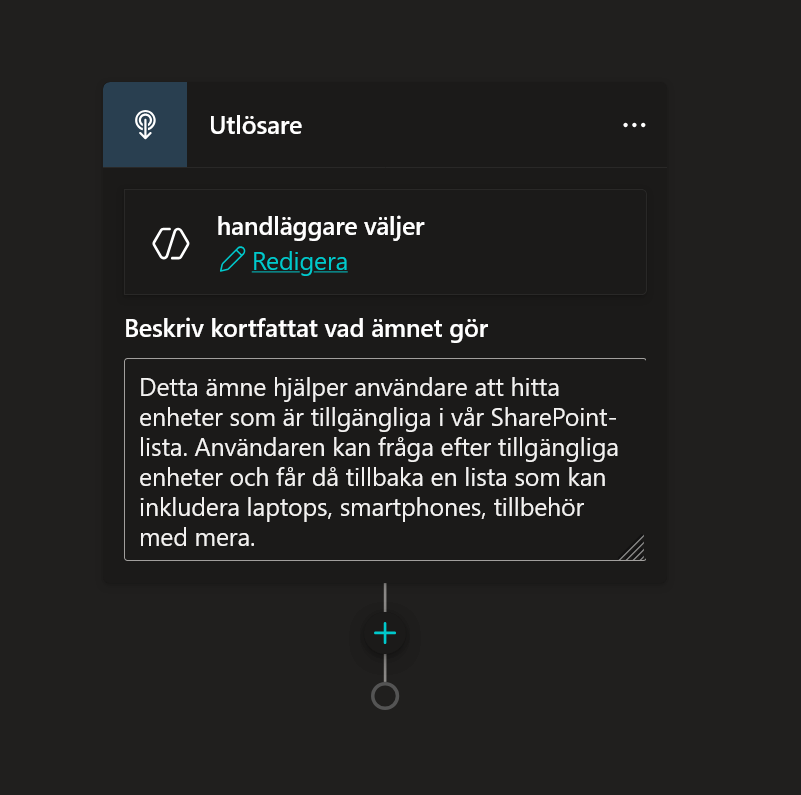

---

## 6.2 Definiera Input (Indatavariabel)

Nu ska vi göra något smart. Vi vill att agenten ska kunna plocka upp *vad* användaren letar efter (t.ex. "Bärbar dator") redan i första meningen.

1.  Klicka på **Detaljer** (cirkeln med utropstecken `i`) längst upp till höger för att fälla ut detaljpanelen.
    *Notera att Namn och Beskrivning redan är ifyllda eftersom vi gjorde det i förra steget.*

    

2.  I detaljpanelen, klicka på fliken **Indata**.

    

3.  Klicka på knappen **Skapa en ny variabel**.

    

### Konfigurera variabeln
Nu får du upp inställningar för din nya variabel. Fyll i följande:

1.  **Name:**
    ```text
    VarDeviceType
    ```
    
    !!! tip "Varför engelska och inga mellanslag?"
        Vi följer "Best Practice" inom Power Platform och programmering. Genom att använda alfanumeriska namn (Bokstäver A-Z och siffror) undviker vi problem med specialtecken (å, ä, ö) när vi senare ska använda variabeln i formler och kod.

2.  **Hur ska agenten fylla i denna indata?:** Låt denna stå kvar på **Fyll i dynamiskt med bästa alternativ (standard)**.
    *Detta betyder att vi litar på att AI-modellen (LLM) är smart nog att hitta informationen i användarens mening.*

3.  **Variabelns datatyp:** Låt stå på **Sträng** (Text).

4.  **Visningsnamn:** (Valfritt).
    ```text
    VarDeviceType
    ```

5.  **Identifiera som:** Klicka på listan och välj: **Användarens hela svar**.
    *Detta ger oss mest flexibilitet att fånga upp precis det användaren frågar efter.*

    

6.  **Beskrivning:** (Detta fält är till för AI:n, inte användaren).
    Det handlar om att specificera vad vi är ute efter. Eftersom vi valde att ta med *hela* användarens svar, är det bra att ge AI:n en fingervisning om vilka värden vi letar efter i texten.

    ```text
    Lista av möjliga värden: Bärbar dator, Desktop, Surfplatta
    ```

    Om allt är ifyllt enligt instruktionerna borde det se ut ungefär så här:

    

---

## 6.3 Definiera Output (Utdatavariabel)

Vi är inte riktigt klara än! Vi ska redan nu bestämma vad det här ämnet ska leverera tillbaka till agenten när det är klart. Eftersom vi ska hämta en lista med produkter, måste vi förbereda en variabel för det.

1.  Längst upp i detaljpanelen, klicka på fliken **Utdata**.

    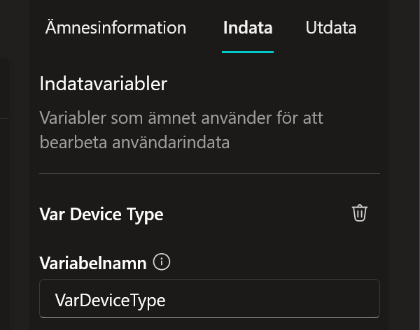

2.  Klicka på **Skapa en ny variabel**.

    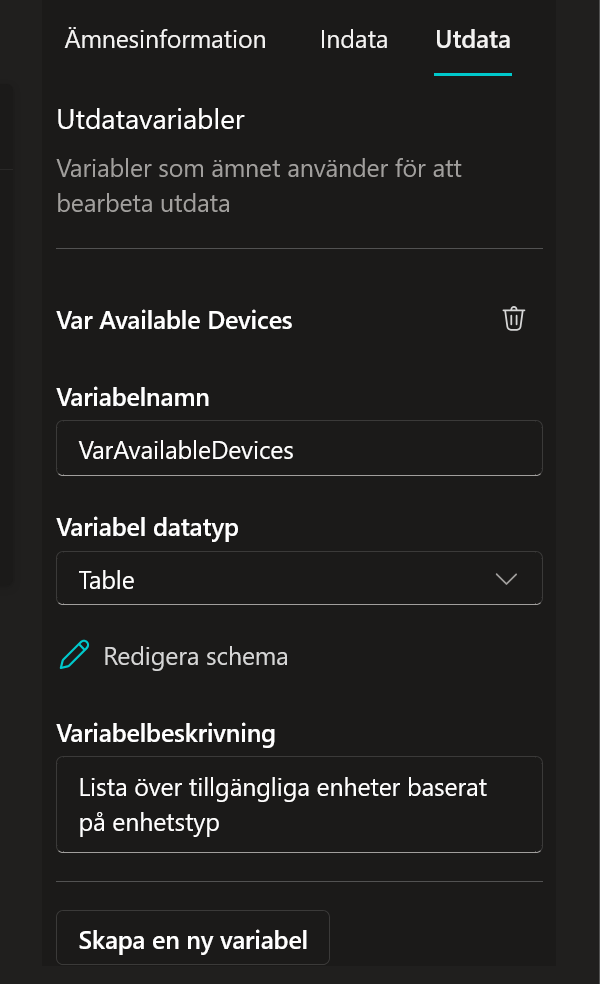

### Konfigurera utdatavariabeln

1.  **Name:**
    ```text
    VarAvailableDevices
    ```

2.  **Variabelns datatyp:** **OBS! Viktigt steg.**
    Klicka på listan (där det står *Sträng*) och ändra till **Tabell**.
    
    *Varför? Jo, en "Sträng" är bara text (t.ex. "Dator"). Men vi ska hämta en hel lista med flera produkter, priser och bilder från SharePoint. Då krävs datatypen Tabell.*

3.  **Beskrivning:**
    ```text
    Lista över tillgängliga enheter baserat på enhetstyp
    ```

    Kontrollera att det ser ut så här:

    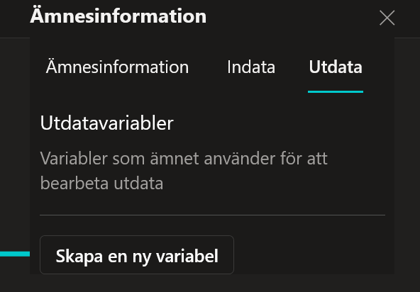

4.  Nu är vi klara med inställningarna! Stäng detaljpanelen genom att klicka på krysset (**X**) högst upp till höger.

    

---

## 6.4 Bygga Logiken (Villkor & Frågor)

Nu har vi en start (Utlösare), en Indata och en Utdata. Nu ska vi bygga det som händer däremellan – själva "hjärnan" i ämnet.

### 1. Välj Nod-typ
Vi ska börja med att skapa ett vägskäl. Om användaren vill ha en "Bärbar dator" ska vi ställa vissa frågor. Om de vill ha något annat, gör vi något annat.

1.  Håll muspekaren över linjen under din **Utlösare**-nod och klicka på **plus-tecknet (+)**.

    

2.  En meny öppnas. Här är en snabb genomgång av verktygslådan:

    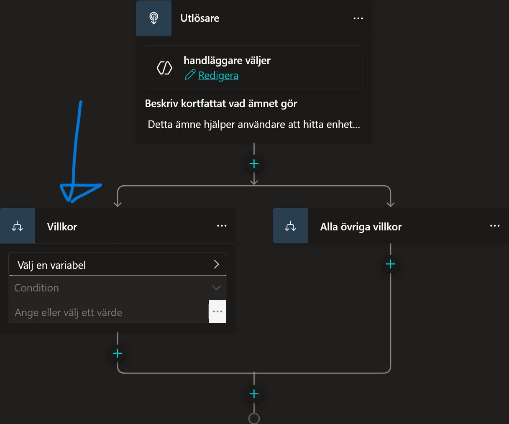

    * **Skicka ett meddelande:** Skickar text eller bilder till användaren.
    * **Ställ en fråga:** Ställer en fråga och sparar svaret (det vi ska använda snart).
    * **Fråga med adaptivt kort:** Visar interaktiva formulär (mer om detta senare).
    * **Lägg till ett villkor:** Skapar vägval (Om X, gör Y). Som en "If-sats".
    * **Variabelhantering:** För att skapa eller ändra variabler manuellt.
    * **Ämneshantering:** För att hoppa till andra ämnen eller avsluta samtalet.
    * **Anropa en åtgärd (Lägg till ett verktyg):** Här hittar vi våra "superkrafter" som Power Automate och SharePoint.
    * **Avancerat:** Avancerade funktioner som HTTP-anrop och inloggning.

3.  Välj **Lägg till ett villkor**.

    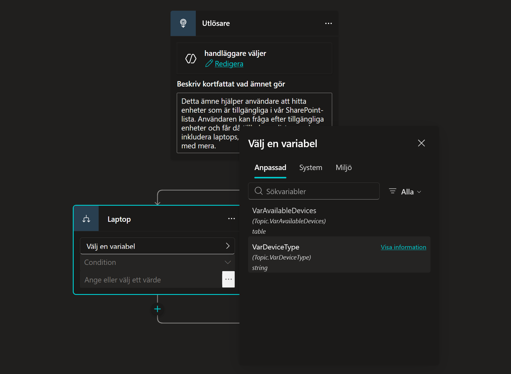

### 2. Konfigurera Vägvalet (Villkor)
Nu ser du att flödet delar sig i två vägar: *Villkor* och *Alla andra villkor*.

1.  Klicka på rutan där det står **Villkor** och döp noden till: 

    ```text
    Bärbar dator
    ```

    

2.  Vi ska nu bestämma regeln. Klicka på **Välj en variabel**.
3.  Välj din indatavariabel: 
    ```text
    VarDeviceType
    ```
4.  Låt operation vara satt till **är lika med**.
5.  I rutan *Ange eller välj ett värde*, skriv:
    ```text
    Bärbar dator
    ```

    *Nu har du sagt: "Om användaren letar efter en Bärbar dator -> Gå till vänster. Annars -> Gå till höger."*

    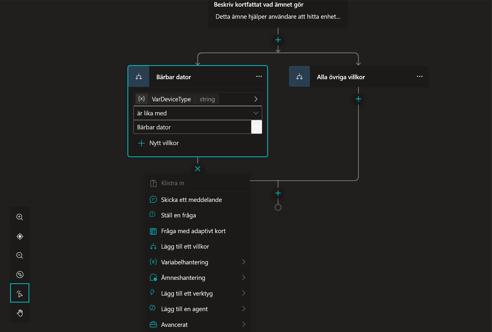

### 3. Ställ frågor (Tratten)
Vi fortsätter på spåret för "Bärbar dator" (den vänstra vägen). Vi vill veta vilken prestanda användaren behöver.

1.  Klicka på **plus-tecknet (+)** under din nya *Bärbar dator*-nod.
2.  Välj **Ställ en fråga**.

    

3.  **Döp om noden:**
    Klicka på namnet *Fråga* högst upp på noden och ändra det till:
    ```text
    Prestandaval
    ```

    

4.  I rutan **Ange ett meddelande**, skriv:
    ```text
    För vilken typ av arbete ska datorn användas?
    ```

    

5.  Under **Identifiera**, se till att **Flervalsalternativ** är valt.
6.  Under **Alternativ för användare**, skapa två alternativ:

    * `Standard (Office/Admin)`

    * `High Performance (Utveckling/Grafik)`

    *(Genom att ge specifika alternativ styr vi användaren rätt).*

    

### 4. Döpa om Variabeln
Agenten sparar automatiskt svaret i en variabel som heter `Var1`. Det är ett dåligt namn om vi ska minnas vad det betyder.

1.  Klicka på rutan där det står **Spara användarsvar som** (där namnet `Var1` står).

    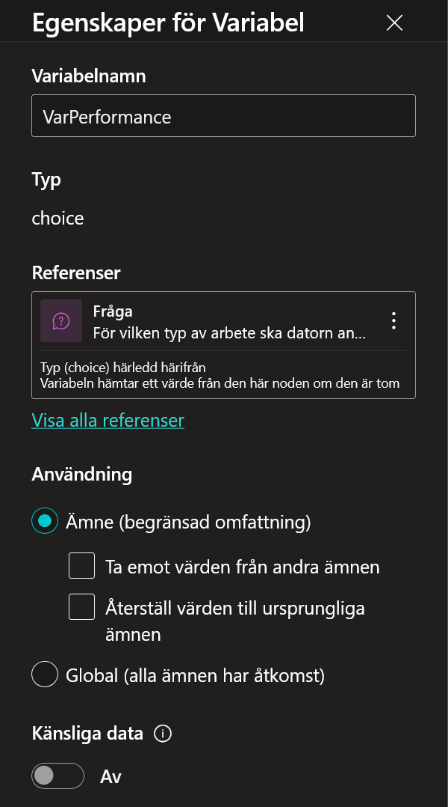

2.  En ruta öppnas till höger. Ändra **Name** till:
    ```text
    VarPerformance
    ```

    

    *Notera "Användning"-inställningen: Ämne (begränsat omfång) vs Globalt. Vi låter den vara kvar på Ämne eftersom vi inte behöver komma åt det här svaret från andra delar av agenten.*

3.  Stäng variabel-rutan på krysset (X).

### 5. Städa upp grenarna (Förenkling)
När du skapade alternativen skapade Copilot Studio automatiskt tre vägar åt dig:


1.  **Villkor** (VarPerformance = Standard)

2.  **Villkor** (VarPerformance = High Performance)

3.  **Alla andra villkor**

Detta är onödigt komplicerat för vår övning. Vi förenklar det genom att ta bort den specifika grenen för "High Performance" och låta "Allt annat" hantera det valet.

1.  Leta upp grenen som specifikt heter **High Performance** (Villkor: VarPerformance = High Performance).
2.  Klicka på de **tre prickarna (...)** på den noden och välj **Ta bort**.
    *Nu har du bara två vägar kvar: Standard och Alla andra villkor.*

    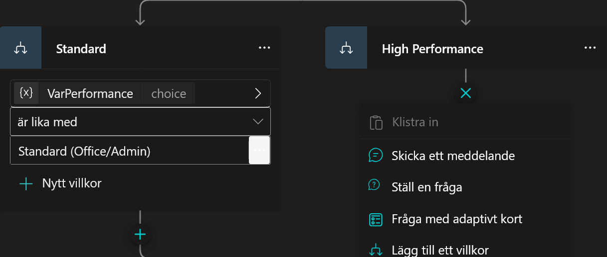

3.  **Döp om vägarna för tydlighet:**
    * Klicka på pennan på den vänstra grenen (*Villkor*). Döp om den till `Standard`.
    * Klicka på pennan på den högra grenen (*Alla andra villkor*). Döp om den till `High Performance` (eller Avancerad).

### 6. Hantera logiken i grenarna
Nu ska vi bestämma vad som händer i respektive gren.

**Gren 1: Standard**
Användaren valde Standard. Här är allt som vanligt och finns i lager.

* **Åtgärd:** Gör ingenting. Låt grenen vara tom.
    *Flödet kommer automatiskt att rinna vidare ner till botten där vi strax ska hämta listan.*

**Gren 2: High Performance (Alla andra)**
Användaren valde High Performance (eller något annat). Låt oss simulera att dessa är tillfälligt slut, men att vi vill vara hjälpsamma och visa vad som finns ändå.

1.  Klicka på **plus-tecknet (+)** i den högra grenen (som du döpte till High Performance).
2.  Välj **Skicka ett meddelande**.

    

3.  Skriv:
    ```text
    Just nu har vi tyvärr lång leveranstid på High Performance-enheter. Jag visar dig listan på våra Standard-modeller som finns för omgående leverans istället.
    ```

    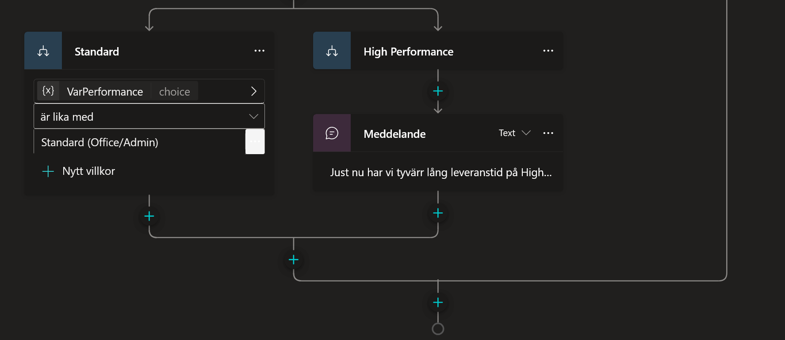

*Nu är logiken klar: De som väljer Standard går raka vägen. De som väljer Avancerat får ett meddelande. Båda grupperna landar till slut på samma ställe – i SharePoint-söket som vi lägger till härnäst.*

## 6.5 Hämta data (SharePoint Connector)

Nu ska vi hämta listan på datorer.
Vi ska placera denna koppling **längst ner i flödet**, där alla vägar ("Bärbar dator"-vägen och "Alla andra"-vägen) möts igen.
På så sätt fungerar sökningen oavsett om användaren letar efter en Bärbar dator, en Desktop eller en Surfplatta.

### 1. Lägg till Connectorn
1.  Scrolla längst ner i ditt flödesschema. Leta upp punkten där linjerna från dina olika vägval kopplas ihop igen.
2.  Klicka på **plus-tecknet (+)** under sammanslagningen (där trådarna möts).

    

3.  Välj **Lägg till ett verktyg**

    

4.  Välj **Anslutningar**

    

5.  Sök efter **SharePoint - Hämta objekt**

    ```text
    Hämta objekt
    ```

    

### 2. Skapa anslutningen (Autentisering)
Om detta är första gången du använder SharePoint i denna agent, måste du godkänna anslutningen.

* Om du ser en knapp där det står **Inte ansluten**, klicka på den.

* Välj **Skapa ny anslutning**

* Välj **Anslut direkt (molntjänster)** och klicka **Skapa**.

* Välj ditt konto och klicka **Tillåt åtkomst** om en ruta poppar upp.

När anslutningen är klar, klicka på **Skicka** (eller Lägg till) för att lägga till noden i ditt flöde.


### 3. Konfigurera Egenskaper
Nu har vi en "dum" SharePoint-nod. Vi måste berätta för den vilken lista den ska läsa ifrån.

1.  Klicka på de **tre prickarna (...)** i högra hörnet på den nya *Hämta objekt*-noden och välj **Egenskaper**.

    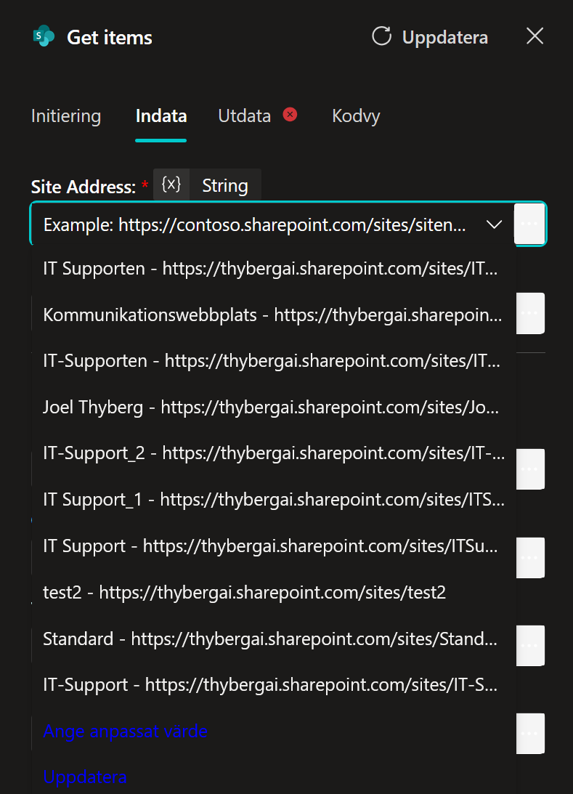

2.  En sidomeny öppnas. Se till att du är på fliken **Initiering**.

3.  I fältet **Användningsbeskrivning**, skriv:
    ```text
    Hämtar enheter från SharePoint-listan
    ```
    *(Detta hjälper agenten förstå vad verktyget gör).*

    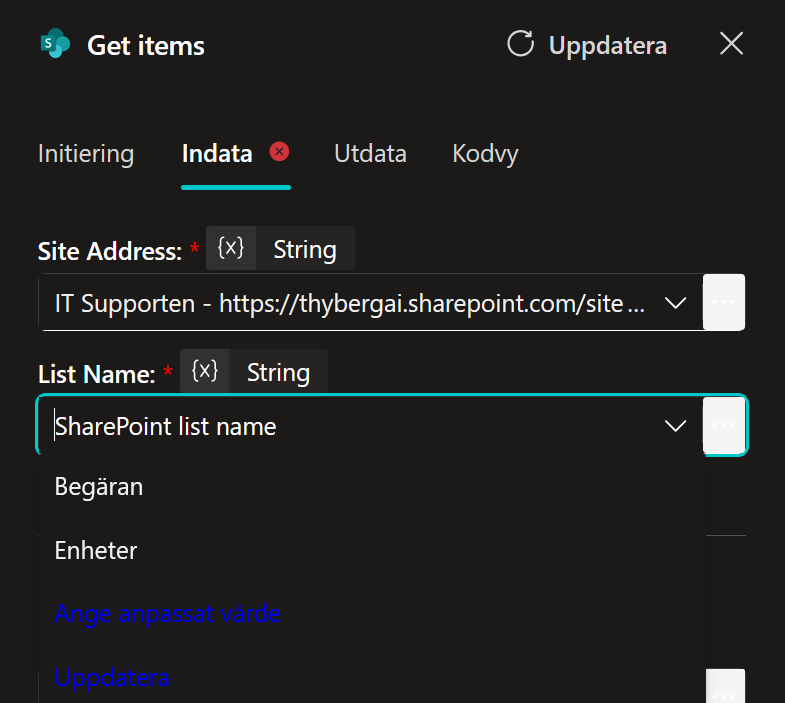

4.  Hoppa över "Felhantering". Gå direkt till sektionen **Indata**.

    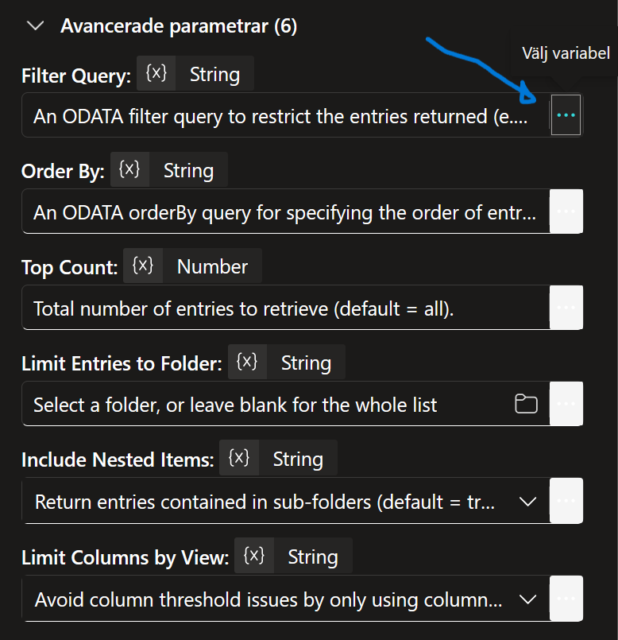

5.  **Webbplatsadress:** Välj din SharePoint-sida (**IT Support**) i listan.

    

6.  **Listnamn:** Välj din lista (**Devices**).

    

### 4. Filtrera listan (Power Fx)
Om vi inte gör något nu, kommer agenten hämta *allt*. Vi vill bara ha **Tillgängliga** enheter av rätt typ (t.ex. **Bärbar dator**).

Här måste vi använda **Power Fx**, som är Microsofts formelspråk.

1.  Hitta fältet **Filterfråga** under *Avancerade parametrar*.

    

2.  Klicka på de **tre prickarna (...)** vid fältet och välj **Formel**.

    

3.  Klicka på den lilla pilen (vinkeln) för att expandera formelfältet så du ser bättre.

    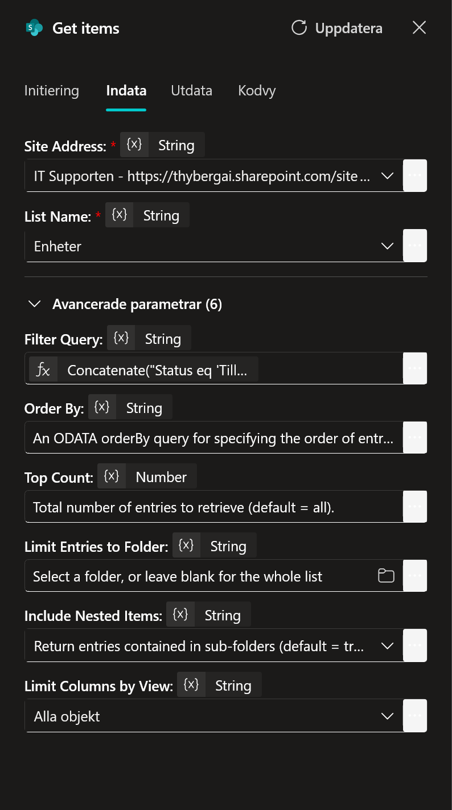

4.  Kopiera och klistra in exakt denna kod:
    ```powerfx
    Concatenate("Status eq 'Tillgänglig' and AssetType eq '", Topic.VarDeviceType, "'")
    ```

    **Vad betyder koden?**
    Vi bygger en mening som SharePoint förstår. `Concatenate` betyder "klistra ihop".
    Vi klistrar ihop texten *"Status är Tillgänglig OCH AssetType är..."* med värdet från vår indatavariabel `VarDeviceType` (t.ex. "Bärbar dator").
    
    *Resultatet som skickas till SharePoint blir: `Status eq 'Tillgänglig' and AssetType eq 'Bärbar dator'`*

5.  Kontrollera att du har en liten **grön bock** brevid formelfältet. Det betyder att koden är korrekt.

    

6.  Klicka **Infoga**.

7.  (Valfritt men bra) Scrolla ner till **Begränsa kolumner efter vy**. Välj **Alla objekt**.
    *Ibland kan SharePoint gömma kolumner om man inte väljer en vy. Detta garanterar att vi får all data. Kan behöva uppdateras för att få upp alternativen.*

    

### 5. Spara resultatet (Utdata)
Nu har vi ställt frågan till SharePoint. Nu ska vi ta hand om svaret.

1.  I Egenskapspanelen, klicka på fliken **Utdata**.

    

2.  Klicka på variabelnamnet (som troligen heter *HämtaObjekt*).
3.  Döp om den till:
    ```text
    VarDevices
    ```

    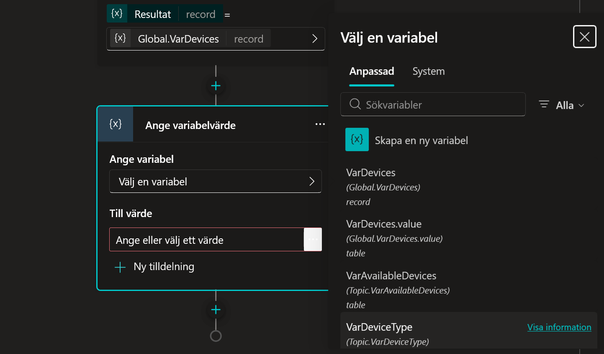

4.  Ändra **Användning** till **Globalt**.
    *Varför? För att vi vill att denna lista ska vara tillgänglig för hela agenten, ifall vi vill använda den i andra ämnen senare.*

    

5.  Stäng Egenskapspanelen på krysset (X).

---

## 6.7 Koppla ihop allt (Utdatamappning)

Nu har vi hämtat datan till en *Global* variabel (`VarDevices`).
Men minns du att vi i början av ämnet (steg 6.3) skapade en specifik utdatavariabel för just det här ämnet (`VarAvailableDevices`)? Vi måste flytta datan från den ena till den andra.

1.  Lägg till en ny nod under din SharePoint-nod.
2.  Välj **Variabelhantering** -> **Ange ett variabelvärde**.

    

3.  Under **Ange variabel**, välj ämnets utdatavariabel: `VarAvailableDevices`.

    

4.  Under **Till värde**, klicka på pilen/ikonen och välj **Formel**.

    

5.  Skriv in följande formel:
    ```powerfx
    Global.VarDevices.value
    ```

    **Varför .value?**
    SharePoint skickar tillbaka ett paket med massor av info. Själva listan med rader (datorerna) ligger inuti en egenskap som heter `value`. Vi måste "packa upp" den för att vår tabell ska bli rätt.

    

6.  Klicka **Infoga**.
7.  **Spara** ditt ämne (Spara högst upp till höger).

---

## 6.8 Uppdatera Agentens Instruktioner

Nu är ämnet klart! Men agenten vet inte om att det finns eller hur det ska användas än. Vi måste uppdatera huvudinstruktionerna.

1.  Gå till fliken **Översikt** högst upp.

    

2.  Vid **Instruktioner**, klicka på **Redigera**.

    

3.  Lägg till följande rad i instruktionerna (gärna sist i listan):

    ```text
    - Hjälp till att hitta tillgängliga enheter och ge fullständiga detaljer genom att använda [Tillgängliga Enheter]. Extrahera alltid VarDeviceType från indatan. Efter att ha presenterat detaljerna, fråga användaren om de vill beställa en enhet från listan.
    ```

    *(Tips: När du skriver `[Tillgängliga Enheter]`, se till att du faktiskt väljer ämnet från listan som poppar upp, så att det blir en klickbar länk i instruktionen).*

4.  Klicka **Spara**.

*Logiken är klar! Nu fångar vi upp "fel" märke och leder in dem på rätt spår igen, eller avslutar om de inte är intresserade.*

---

### Testa flödet
Nu är det dags att testa!

1.  Öppna **Testa**-panelen. Klicka på ikonen för **Karta** (Aktivitetskarta) och slå på **Spåra mellan ämnen**.

2.  Skriv: `Jag behöver en bärbar dator`
    *Agenten bör visa listan och fråga om du vill beställa.*

3.  Svara: `Ja tack`
    *Agenten vet inte vad den ska göra nu*

!!! success "Bra jobbat!"
    Du har nu byggt en avancerad funktion!
    
    1. Agenten lyssnar efter vad användaren vill ha (Indata).
    2. Den ställer smarta följdfrågor (Logik).
    3. Den hämtar data från SharePoint (Åtgärd).
    4. Den levererar en snygg lista tillbaka (Utdata).

---
