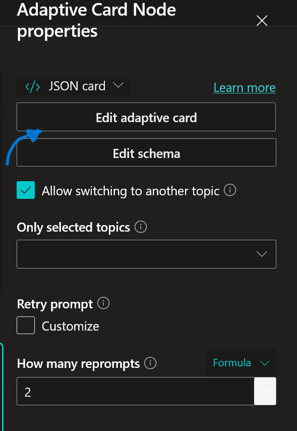
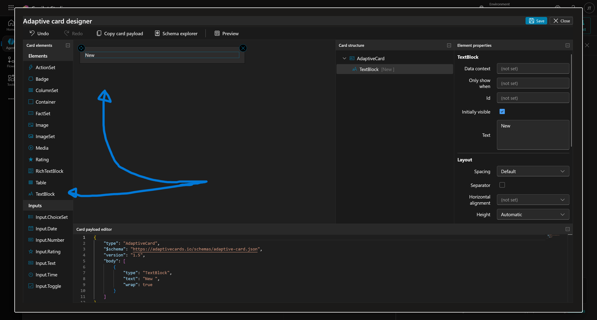
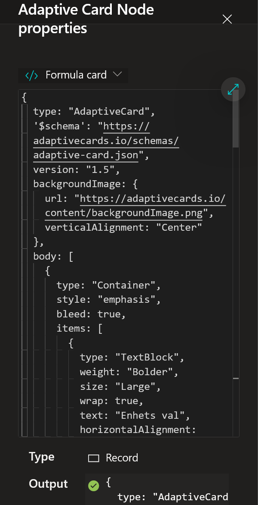

# 7. Skapa ett Adaptivt Kort för Beställning

Vi har nu en agent som kan hitta datorer. Nästa steg är att låta användaren **beställa** en av dem.
För att göra detta snyggt och användarvänligt ska vi använda ett **Adaptive Card**. Det är ett litet formulär direkt i chatten där användaren kan välja en dator och skriva en kommentar.

---

## 7.1 Skapa Topic för Beställning

Vi skapar en separat Topic för själva beställningen för att hålla logiken ren.

1.  Navigera till dina **Topics** i Copilot Studio.

    

2.  Välj **+ Add a topic** -> **From blank**.

    

3.  Döp topicen till:
    ```text
    Request device
    ```

    

3.  I rutan **Description** (under Trigger), klistra in följande svenska beskrivning:
    ```text
    Detta ämne hjälper användare att beställa en enhet när de svarar ja på frågan om de vill göra en beställning av en av de visade enheterna.
    ```

    

---

## 7.2 Bygga Kortet (Visual Editor)

Nu ska vi lägga till själva kortet.

1.  Klicka på **plus-tecknet (+)** under Trigger-noden.
2.  Välj **Ask with Adaptive Card**.

    

3.  Klicka på de tre prickarna på kort-noden och välj **Properties**.

    

4.  I panelen till höger, klicka på knappen **Edit Adaptive Card**.

    

### Testa verktyget (Valfritt men lärorikt)
Nu öppnas en stor editor. Till vänster har du komponenter (text, bilder, inputs) och i mitten ser du ditt kort.


1.  Prova att dra in ett **TextBlock** från vänstermenyn till kortet.

    

2.  Ändra texten till "Tillgängliga enheter" i menyn till höger.
3.  Ändra **Horizontal alignment** till **Center**.

    

4.  Prova att dra in en **Input.ChoiceSet** under texten.
5.  Ändra **Style** till **Expanded** för att se hur det ser ut som en lista med radioknappar.

    

6.  Klicka på **Preview Mode** högst upp för att se hur det skulle se ut i chatten.

    

7.  Klicka på **Preview Mode** igen för att gå tillbaka.

---

## 7.3 Klistra in JSON (Snabbvägen)

Att bygga hela kortet för hand tar tid. Vi ska använda färdig kod (JSON) för att få en snygg grundstruktur.

1.  Längst ner i fönstret ser du **Card Payload Editor**. (Dra upp kanten om den är liten).

    

2.  Radera **allt** som står i editorn.
3.  Kopiera och klistra in följande kod:

    ```json
    {
        "type": "AdaptiveCard",
        "$schema": "[https://adaptivecards.io/schemas/adaptive-card.json](https://adaptivecards.io/schemas/adaptive-card.json)",
        "version": "1.5",
        "backgroundImage": {
            "url": "[https://adaptivecards.io/content/backgroundImage.png](https://adaptivecards.io/content/backgroundImage.png)",
            "verticalAlignment": "Center"
        },
        "body": [
            {
                "type": "Container",
                "style": "emphasis",
                "bleed": true,
                "items": [
                    {
                        "type": "TextBlock",
                        "weight": "Bolder",
                        "size": "Large",
                        "wrap": true,
                        "text": "Enhetsval",
                        "horizontalAlignment": "Center"
                    }
                ]
            },
            {
                "type": "Container",
                "style": "default",
                "items": [
                    {
                        "type": "TextBlock",
                        "wrap": true,
                        "size": "Medium",
                        "text": "Vänligen välj vilken enhet du vill begära:"
                    }
                ],
                "spacing": "None"
            },
            {
                "type": "Container",
                "spacing": "None",
                "items": [
                    {
                        "type": "Input.ChoiceSet",
                        "id": "deviceSelectionId",
                        "style": "expanded",
                        "choices": [
                            {
                                "title": "Surface Laptop 13",
                                "value": "1"
                            },
                            {
                                "title": "Surface Laptop 15",
                                "value": "2"
                            },
                            {
                                "title": "Surface Studio",
                                "value": "3"
                            },
                            {
                                "title": "Surface Pro",
                                "value": "4"
                            }
                        ]
                    }
                ]
            },
            {
                "type": "Container",
                "spacing": "None",
                "style": "emphasis",
                "items": [
                    {
                        "type": "TextBlock",
                        "wrap": true,
                        "text": "Ytterligare information"
                    }
                ]
            },
            {
                "type": "Input.Text",
                "id": "commentsId",
                "placeholder": "Vänligen ange eventuella specifika krav eller övriga kommentarer",
                "isMultiline": true,
                "spacing": "Small"
            },
            {
                "type": "FactSet",
                "facts": [
                    {
                        "title": "Typ av förfrågan",
                        "value": "Ny enhet"
                    },
                    {
                        "title": "Svarstid:",
                        "value": "3-5 arbetsdagar"
                    }
                ],
                "spacing": "Small"
            }
        ],
        "actions": [
            {
                "type": "Action.Submit",
                "title": "Skicka"
            }
        ]
    }
    ```

4.  Klicka på **Preview Mode** för att se ditt snygga kort!
    *Just nu är listan på datorer "Hårdkodad" (Surface Laptop 13, 15 etc). Det ska vi ändra på nu.*

---

## 7.4 Göra kortet Dynamiskt (Power Fx)

Vi vill att listan i kortet ska baseras på vad vi faktiskt hittade i SharePoint (i föregående kapitel). För att göra det måste vi byta från statisk JSON till dynamisk **Power Fx**.

1.  Stäng Preview Mode.
2.  Längst upp till höger i editor-fönstret (ovanför koden), klicka på **JSON** och ändra till **Formula**.

    

3.  Klicka på **Expand**-ikonen (pilarna) för att göra formelfältet större.

    

4.  Radera all kod i fönstret.
5.  Klistra in denna Power Fx-kod istället:

    ```powerfx
    {
      type: "AdaptiveCard",
      '$schema': "[https://adaptivecards.io/schemas/adaptive-card.json](https://adaptivecards.io/schemas/adaptive-card.json)",
      version: "1.5",
      backgroundImage: {
        url: "[https://adaptivecards.io/content/backgroundImage.png](https://adaptivecards.io/content/backgroundImage.png)",
        verticalAlignment: "Center"
      },
      body: [
        {
          type: "Container",
          style: "emphasis",
          bleed: true,
          items: [
            {
              type: "TextBlock",
              text: "Enhetsval",
              weight: "Bolder",
              size: "Large",
              wrap: true,
              horizontalAlignment: "Center"
            }
          ]
        },
        {
          type: "Container",
          style: "default",
          items: [
            {
              type: "TextBlock",
              text: "Vänligen välj vilken enhet du vill begära:",
              wrap: true,
              size: "Medium"
            }
          ],
          spacing: "None"
        },
        {
          type: "Container",
          spacing: "None",
          items: [
            {
              type: "Input.ChoiceSet",
              id: "deviceSelectionId",
              style: "expanded",
              choices: ForAll(
                Global.VarDevices.value,
                {
                  title: If(IsBlank(Model), "Okänd modell", Model),
                  value: If(IsBlank(ID), "NA", Text(ID))
                }
              )
            }
          ]
        },
        {
          type: "Container",
          spacing: "None",
          style: "emphasis",
          items: [
            {
              type: "TextBlock",
              text: "Ytterligare information",
              wrap: true
            },
            {
              type: "Input.Text",
              id: "commentsId",
              placeholder: "Vänligen ange eventuella specifika krav eller övriga kommentarer",
              isMultiline: true,
              spacing: "Small"
            }
          ]
        },
        {
          type: "Container",
          spacing: "Medium",
          items: [
            {
              type: "FactSet",
              facts: [
                {
                  title: "Typ av förfrågan:",
                  value: "Ny enhet"
                },
                {
                  title: "Svarstid:",
                  value: "3 till 5 arbetsdagar"
                }
              ],
              spacing: "Small"
            }
          ]
        }
      ],
      actions: [
        {
          type: "Action.Submit",
          title: "Skicka",
          id: "deviceSubmittedId"
        }
      ]
    }
    ```

    !!! info "Vad hände nu?"
        Titta på delen med `choices: ForAll(...)`.
        Istället för en fast lista säger vi nu: "Loopa igenom vår globala variabel `Global.VarDevices.value`. För varje rad, skapa ett val där titeln är modellnamnet och värdet är ID:t."
        Detta gör kortet levande!

6.  Kontrollera att du har en **grön bock** nere i hörnet (inga syntaxfel).

    

7.  Klicka på **Save card** (eller stäng krysset om knappen saknas, det sparas ofta automatiskt) och stäng sedan Adaptive Card-egenskaperna.

    

### Viktigt: Output Variabler
Om du tittar längst ner i Properties-panelen för din kort-nod, ser du sektionen **Output**.
Här bör du se två variabler:
* `deviceSelectionId` (Vad användaren valde)
* `commentsId` (Vad användaren skrev)

Dessa skapades automatiskt baserat på ID:n i koden vi klistrade in. Vi kommer att använda dessa i nästa kapitel för att genomföra beställningen.


8.  Klicka **Save** för att spara din Topic.

---

## 7.5 Uppdatera Agentens Instruktioner

Nu har vi en topic för att visa enheter (Available devices) och en för att beställa (Request device). Vi måste lära agenten hur de hänger ihop.

1.  Gå till fliken **Overview**.
2.  Vid **Instructions**, klicka på **Edit**.

    

3.  Leta upp raden du lade till sist. Vi ska uppdatera den så att den länkar vidare till vår nya topic.
    
    *Ändra den sista punkten till följande:*

    ```text
    - Hjälp till att hitta tillgängliga enheter och ge fullständiga detaljer genom att använda [Available devices]. Extrahera alltid VarDeviceType från indatan. Om användaren svarar ja på frågan om att beställa en enhet, trigga [Request device]. Om de svarar nej, trigga [Goodbye].
    ```

4.  **Viktigt:** Du måste göra länkarna "blåa".
    * Sudda ut `[Request device]`. Skriv `/Req` och välj **Request device** från listan.
    * Sudda ut `[Goodbye]`. Skriv `/Good` och välj **Goodbye** från listan.

5.  Klicka **Save**.

### Testa flödet
Nu är det dags att se magin hända!

1.  Öppna **Test**-panelen. Klicka på ikonen för **Map** (Activity map) och slå på **Track between topics**.
2.  Skriv: `Jag behöver en laptop`
    *Agenten bör visa listan och fråga om du vill beställa.*
3.  Svara: `Ja tack`
    *Nu ska agenten automatiskt hoppa över till din nya topic **Request device** och visa det snygga formuläret.*

!!! success "Snyggt!"
    Du har nu byggt ett dynamiskt formulär som anpassar sig efter vad som finns i lagret. I nästa kapitel ska vi se till att det faktiskt händer något när man klickar på "Skicka"!