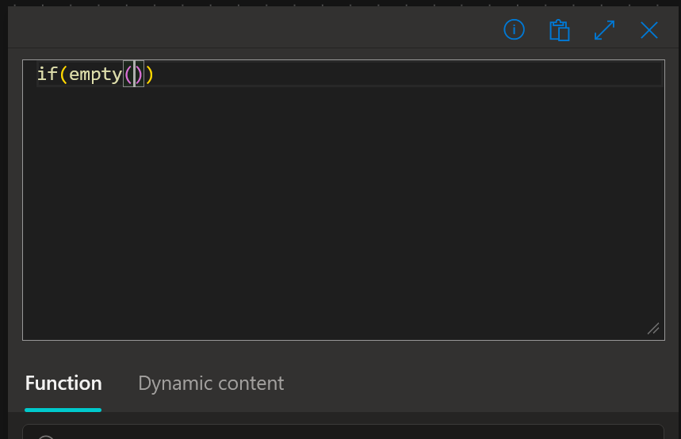
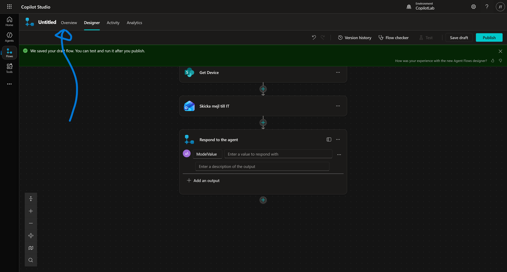
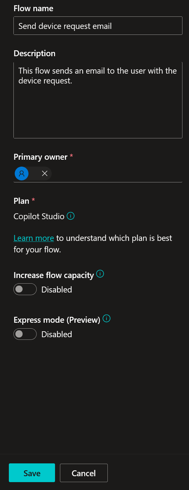
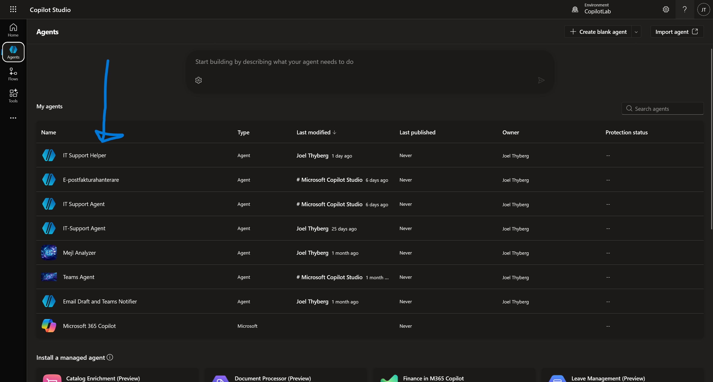
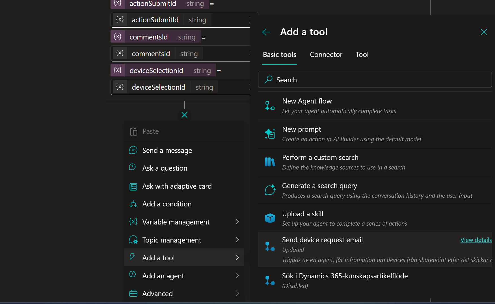
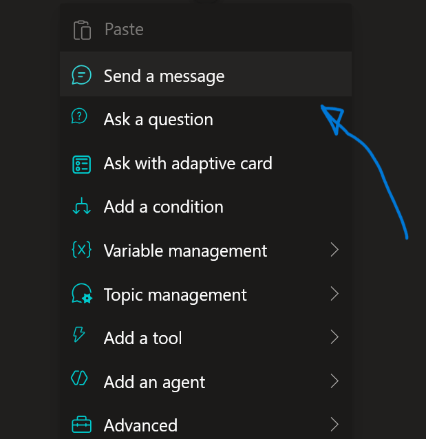
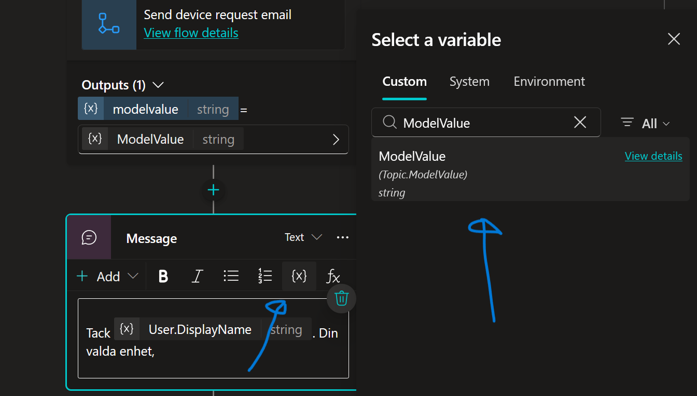

# 8. Skapa ett Agent Flow

Nu ska vi bygga motorn som faktiskt utför beställningen. När användaren klickar på "Skicka" i det adaptiva kortet, ska agenten anropa ett **Agent Flow**.

Skillnaden mot ett vanligt flöde är att ett Agent Flow är skräddarsytt för att ta emot data direkt från din agent, utföra arbete, och sedan svara agenten med ett resultat.

Detta Agent Flow ska:
1.  Ta emot information från chatten (Vilken dator? Vem beställer?).
2.  Hämta detaljer om datorn från SharePoint (för att dubbelkolla att den finns och hämta pris).
3.  Skicka ett beställningsmejl till IT-avdelningen.
4.  Skicka tillbaka en bekräftelse till chatten.

---

## 8.1 Skapa ett nytt Agent Flow

Vi börjar inifrån din Topic **Request device** som vi jobbade med sist.

1.  Gå till **Topics** och öppna **Request device**.
2.  Scrolla längst ner i flödet (under `Ask with Adaptive Card`).
3.  Klicka på **plus-tecknet (+)**.
4.  Välj **Add a tool** -> **New Agent flow**.
    *(Ibland kan det heta "Call an action" -> "Create a flow" beroende på version).*

    

    *Detta öppnar ett nytt fönster där vi kan bygga vårt Agent Flow.*

---

## 8.2 Definiera Inputs (Trigger)

Väl inne i **Agent flows** kan vi se två noder.
* Den övre noden: **When an agent calls the flow**. Här bestämmer vi vad agenten ska skicka *in* i processen.
* Den nedre noden: **Respond to the agent**. Här bestämmer vi vad som skickas *tillbaka* till agenten.

Vi börjar med att definiera inputs. Vi behöver tre saker: ID på datorn, vem användaren är, och eventuella kommentarer.

1.  Klicka på noden **When an agent calls the flow** för att öppna inställningarna.

    

2.  Klicka på **+ Add an input**.

    

3.  Du ser nu ett gäng olika typer av inputs. Välj **Text**.

    

4.  Ställ dig i textrutan (där det står "User's input") och döp om den till:
    ```text
    DeviceSharePointId
    ```
    *Här skickar vi in ID:t från SharePoint.*

    

5.  Gör om proceduren. Klicka **+ Add an input** -> **Text**. Döp den till:
    ```text
    User
    ```
    *Här skickar vi in användarens namn.*

    

6.  Gör om proceduren igen. Klicka **+ Add an input** -> **Text**. Döp den till:
    ```text
    AdditionalComments
    ```

    

7.  **Gör kommentaren frivillig:**
    Eftersom användaren kanske inte skriver någon kommentar, måste vi göra detta fält valfritt (Optional).
    * Klicka på de **tre prickarna (...)** bredvid fältet *AdditionalComments*.
    * Välj **Make the field optional**.

    

---

## 8.3 Hämta enhetsdetaljer (Get Item)

Agenten skickar bara ett ID (t.ex. "4"). För att mejlet ska bli snyggt måste vi slå upp vad "4" är för dator (Modell, Pris, etc).

1.  Klicka på **plus-tecknet (+)** under trigger-noden.
2.  Sök efter **Get item** och välj **Get item (SharePoint)**.
    *(Obs: Välj "Get item" i singular, inte "Get items", eftersom vi bara ska hämta en specifik rad).*

    

3.  **Döp om steget (Best Practice):**
    * Klicka på de **tre prickarna (...)** på noden *Get item*.
    * Välj **Rename**.
    * Döp den till:
    ```text
    Get Device
    ```

    

4.  **Konfigurera steget:**
    * **Site Address:** Välj din IT Help Desk-sida.

    

    * **List Name:** Välj listan **Devices**.

    

    * **Id:** Vi måste koppla detta till vårt input-värde. Klicka på **fx** (eller blixten) längst till vänster i Id-rutan.

    

    * Välj **Dynamic content** och sök efter:
    ```text
    DeviceSharePointId
    ```
    

    * Notera att syntaxen `triggerBody()?['text']` (eller liknande) används när du klickar på **DeviceSharePointId**. Klicka nu på **Add**.

    

5.  **Avancerade inställningar:**
    * Klicka på **Show all** i inställningarna för *Get Device*.
    
    * Hitta **Limit Columns by View**.
    * Välj **All Items**.
    
    *(Detta säkerställer att vi får tillgång till alla kolumner).*

---

## 8.4 Skicka Beställningsmejl

Nu när vi har all data ska vi skicka ordern. För att göra det enkelt och robust i denna övning använder vi e-post.

1.  Klicka på **plus-tecknet (+)** under *Get Device*.
2.  Sök efter:
    ```text
    Send an email
    ```
    

    Välj **Send an email (V2)** (Office 365 Outlook).
    *(Logga in om det behövs).*

3.  Döp om noden till:
    ```text
    Skicka mejl till IT
    ```

4.  **Konfigurera mejlet:**
    Vi ska nu bygga mailet med hjälp av **Dynamiskt innehåll** (värden som hämtas från tidigare steg).

    * **To:** Klicka på **Enter custom value** och skriv in **din egen e-postadress**.

    

    *(I verkligheten hade detta gått till en funktionsbrevlåda för IT).*

    * **Subject:** Skriv följande text:
    ```text
    Typ av förfrågan: Ny enhet
    ```
    

    * **Body:** Här bygger vi meddelandet. Kopiera först in grundtexten nedan:

    ```text
    Hej IT-supporten!

    En ny beställning har inkommit.

    Beställare:
    Enhet:
    Pris:

    Kommentar från användaren:

    Vänligen hantera skyndsamt.
    ```

    

    **Nu ska vi fylla i hålen med data:**

    **1. Lägg till Beställare:**

    * Sätt markören efter "Beställare: ".

    * Klicka på **blixt-ikonen** (Dynamic content) eller `fx`.
    
    
    
    * Sök efter `User` och välj den från listan (under "When an agent calls the flow").
    
    ```text
    User
    ```
    
    

    **2. Lägg till Enhet:**

    * Sätt markören efter "Enhet: ".

    * Klicka på blixten.

    * Sök efter `Model` (från steget *Get Device*) och välj den.
    
    ```text
    Model
    ```
    
    

    **3. Lägg till Pris:**

    * Sätt markören efter "Pris: ".

    * Klicka på blixten.

    * Sök efter `Price` (från steget *Get Device*) och välj den.
    
    ```text
    Price
    ```
    
    

    **4. Lägg till Kommentar (Avancerat - Hantera tomma svar):**

    Vi vill kontrollera om användaren lämnade fältet tomt. Om det är tomt skriver vi "None", annars visar vi kommentaren. Vi gör detta med ett uttryck (Expression).

    * Sätt markören efter "Kommentar från användaren: ".

    * Klicka på **fx** (Insert Expression).

    * I rutan för Function/Expression, skriv in följande start:

      ```powerfx
      if(empty(
      ```
      *Detta startar en "Om"-sats som kollar "Om tomt...".*

    

    * Klicka nu på fliken **Dynamic content**. Sök efter `AdditionalComments` och klicka på den.

    ```text
    AdditionalComments
    ```

    

      *Din formel fylls nu på med referensen till input-fältet.*

    * Gå tillbaka till formelfältet och skriv in resten av logiken efter parentesen:

      ```powerfx
      , 'None',
      ```

      *Detta betyder: Om det är tomt -> Skriv 'None'. Nu ska vi ange vad som händer om det INTE är tomt (Else).*

    

    * Klicka på fliken **Dynamic content** igen. Sök upp och välj `AdditionalComments` en gång till.

    ```text
    AdditionalComments
    ```

    * Avsluta formeln med en slutparentes `)`.

    * Klicka på **Add** (eller OK).

    

    *Nu är mejlet klart och dynamiskt!*

--- 

## 8.5 Skicka svar till Agenten (Output)

Slutligen måste vårt Agent Flow berätta för agenten att allt gick bra. Vi skickar också tillbaka namnet på den valda modellen för att kunna använda det i bekräftelsen.

1.  Klicka på sista noden **Respond to the agent**.
2.  Klicka **+ Add an output**.

    

3.  Klicka på **Text**.

    

4.  Döp outputen till:
    ```text
    ModelValue
    ```

5.  I värdefältet, klicka på **blixt-ikonen** (Dynamic content) eller `fx`.

    

6.  Sök efter `Model` (från steget *Get Device*) och välj den.

    ```text
    Model
    ```

    

---

## 8.6 Spara och konfigurera Agent Flow

Nu ska vi spara arbetet, namnge flödet korrekt och publicera det.

1.  Längst upp till vänster, klicka på namnet **Save draft**.

    

2.  Klicka nu på **Overview** (till vänster om namnet).

    

3.  Väl inne i översikten, klicka på **Edit** under *Details*.

    

4.  I fältet *Flow name*, skriv in:
    ```text
    Send device request email
    ```

5.  I fältet *Description*, skriv in:
    ```text
    This flow sends an email to the user with the device request.
    ```

6.  Klicka på **Save**.

    

7.  Viktigt: För att flödet ska fungera måste det publiceras. Klicka på **Publish** i verktygsfältet (oftast uppe till vänster).
    *(Ibland måste du gå in i Designer-läget igen för att se Publish-knappen).*

    

---

## 8.7 Koppla ditt Agent Flow i Topicen

Nu måste vi gå tillbaka till Copilot Studio och koppla in vårt nya Agent Flow i vår Topic.

1.  **Navigera till *Request device* Topicen:**
    * Gå tillbaka till Agent-vyn genom att klicka på **Agents** i menyn till vänster.

    

    * Välj din agent **IT Support Helper**.

    

    * Gå till fliken **Topics** i menyn högst upp.

    

    * Klicka på **Request device**.

    

2.  **Lägg till flödet:**
    * Gå längst ner i flödet, under Adaptive Card.
    * Klicka på **plus-tecknet (+) -> Add a tool**.
    * Välj ditt nyligen skapade flöde: **Send device request email**.

    

3.  **Mappa inputs:**
    Nu frågar agenten: "Vad ska jag stoppa in i de tre input-hål du byggde?"

    **DeviceSharePointId:**
    * Klicka på pilen `>` (eller rutan) bredvid *DeviceSharePointId*.
    * Välj variabeln `deviceSelectionId` (den kommer från ditt Adaptive Card).

    

    **User:**
    * Klicka på pilen `>` bredvid *User*.
    * Navigera till fliken **System**.
    * Sök efter och välj `User.DisplayName`.

    

    **AdditionalComments (Avancerat):**
    Vi vill hantera fallet att användaren inte skrev någon kommentar alls. Om vi skickar in ett tomt värde kan det bli fel i vissa system, så vi använder en formel för att skicka en tom textsträng ("") istället för *null* om det saknas.

    * Klicka på pilen `>` bredvid *AdditionalComments*.
    * Välj fliken **Formula** och klicka på expandera-ikonen (pilen) för att få mer plats.

    

    * Skriv in följande formel:
    ```powerfx
    If(IsBlank(Topic.commentsId), "", Topic.commentsId)
    ```
    * Kontrollera att du har en grön bock (inget syntaxfel). Klicka sedan på **Insert**.

    

    !!! info "Varför gjorde vi detta?"
        Formeln betyder: "Om variabeln *commentsId* är blank (tom), skicka en tom textsträng. Annars, skicka innehållet i *commentsId*." Detta gör flödet mer robust.

---

## 8.8 Förbättra användarupplevelsen (Bekräftelse)

Vi ska nu lägga till en nod för att ge användaren en tydlig och personlig bekräftelse på att beställningen är mottagen.

1.  Klicka på **plus-tecknet (+)** under din Agent Flow-nod och välj **Send a message**.

    

2.  Vi ska nu bygga meddelandet steg för steg för att få in dynamiska värden:

    * Börja med att skriva:
    ```text
    Tack 
    ```
    *(Glöm inte mellanslaget efter Tack)*

    * Klicka på ikonen **{X} (Insert variable)**.
    * Välj fliken **System** och sök efter `User`. Välj **User.DisplayName**.

    

    * Fortsätt skriva texten:
    ```text
    . Din valda enhet, 
    ```
    
    * Klicka på **{X} (Insert variable)** igen.
    * Välj fliken **Custom** och sök efter `ModelValue`. Välj **ModelValue**.
    *(Detta är variabeln vi fick tillbaka från vårt Agent Flow).*

    

    * Avsluta meningen med att skriva:
    ```text
    , har skickats in och kommer att granskas av IT-ansvarig.
    ```

3.  Granska meddelandet. Det ska nu se ut ungefär så här i editorn:

    > Tack {User.DisplayName}. Din valda enhet, {ModelValue}, har skickats in och kommer att granskas av IT-ansvarig.

    

!!! success "Snyggt!"
    Nu får användaren en personlig bekräftelse med sitt eget namn och namnet på datorn de valt.

### Testa allt!
1.  Öppna testpanelen. Starta om med **Refresh**-ikonen högst upp.
2.  Skriv:
    ```text
    Jag vill ha en laptop
    ```
3.  Välj en prestandanivå (t.ex. Standard).
4.  När listan visas och agenten frågar om beställning, svara `Ja`.
5.  Välj en dator i det adaptiva kortet.
6.  I kommentarsfältet, skriv:
    ```text
    Jag vill ha så mycket RAM-minne som möjligt!
    ```
7.  Klicka **Skicka**.
8.  *Nu ska agenten tänka en liten stund, anropa ditt Agent Flow, och sedan svara med bekräftelsen. Samtidigt ska det plinga till i din mejlkorg!*

!!! success "Grattis!"
    Du har nu byggt en fullständig kedja med ett **Agent Flow**:
    AI (Förstår) -> Logik (Styr) -> Data (SharePoint) -> GUI (Adaptive Card) -> Agent Flow (Power Automate) -> Verkligheten (Email).