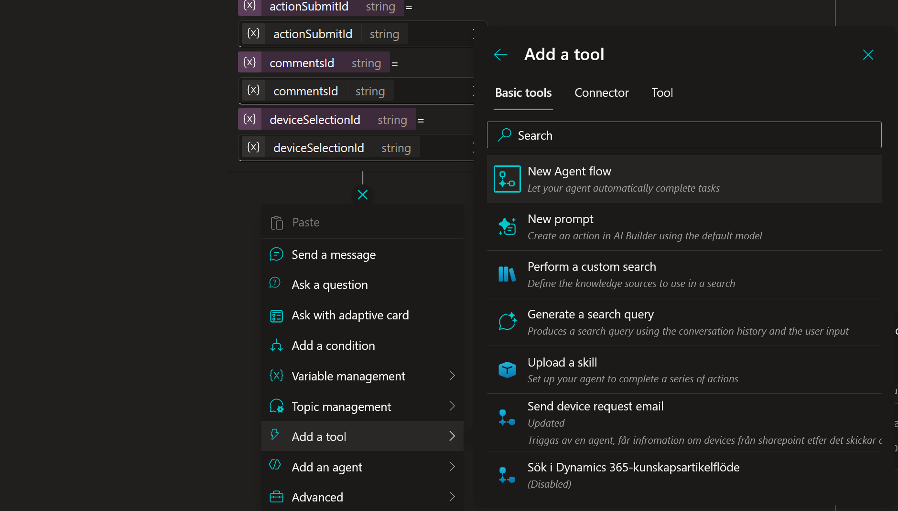
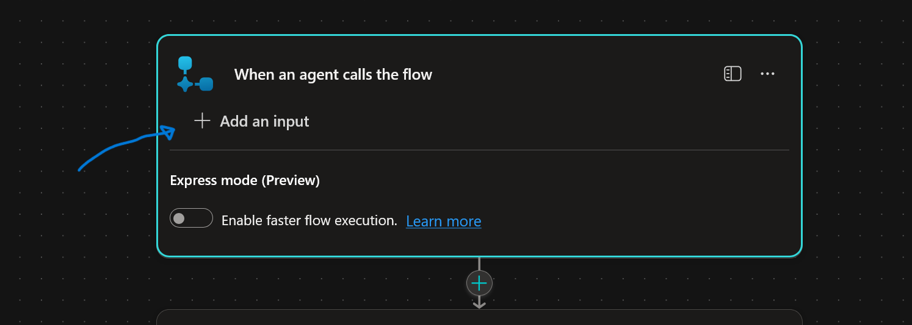
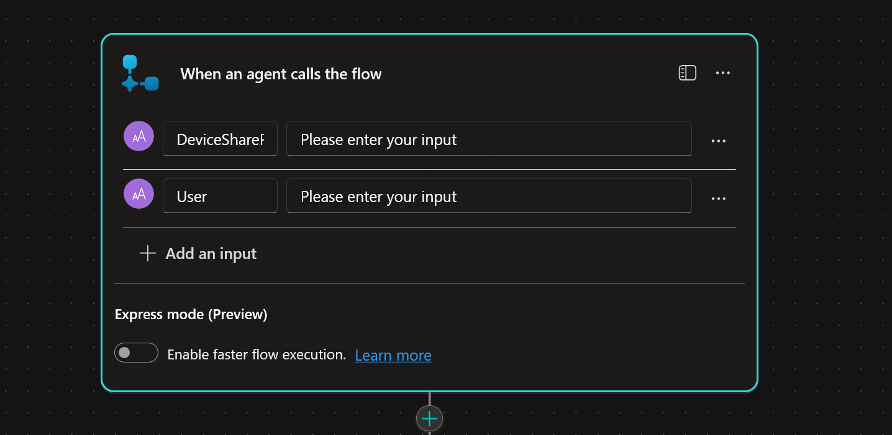
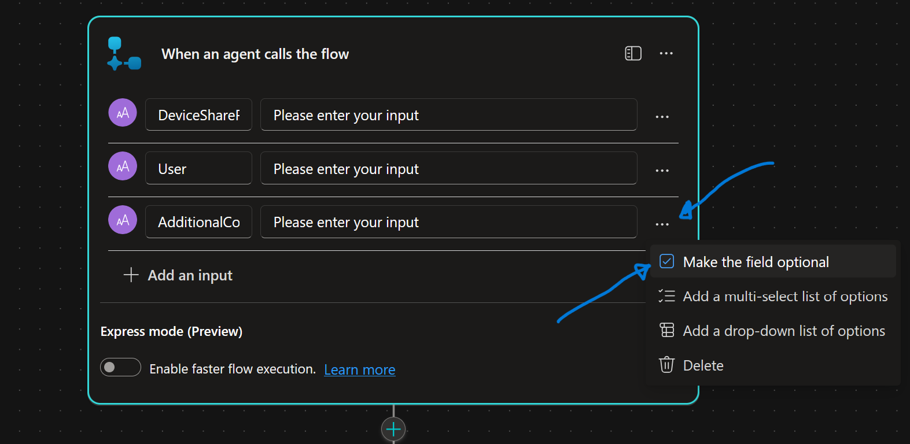
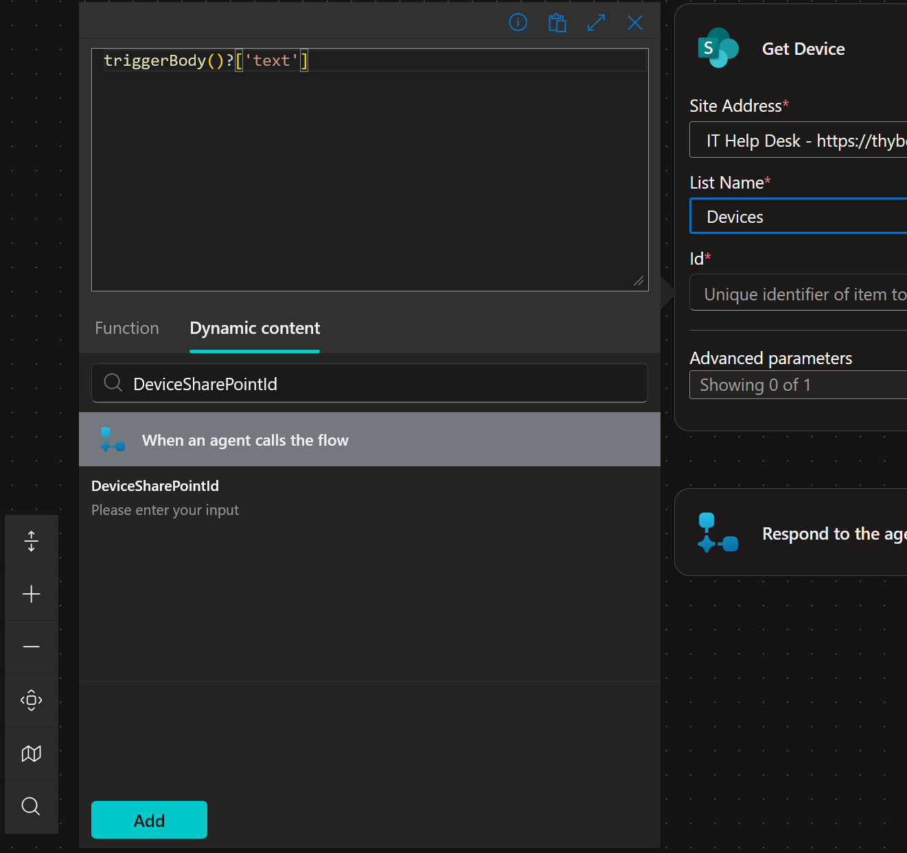
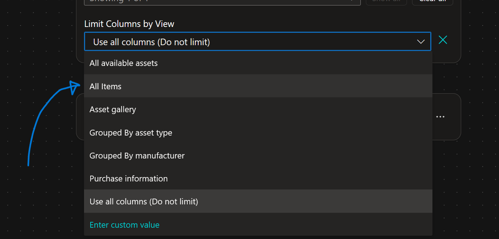
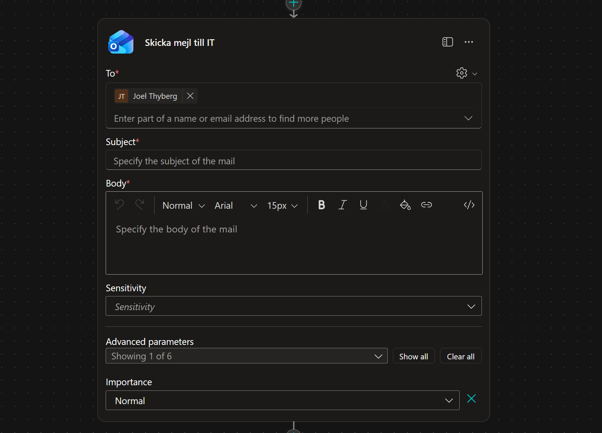
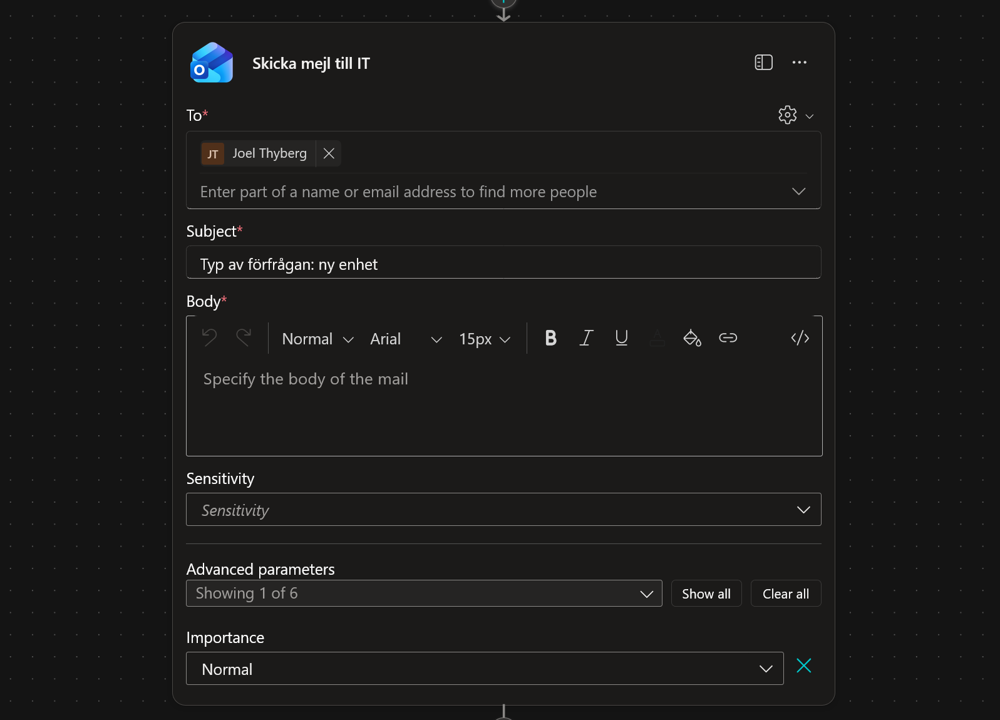

# 8. Skapa ett Agent Flow

Nu ska vi bygga motorn som faktiskt utför beställningen. När användaren klickar på "Skicka" i det adaptiva kortet, ska agenten anropa ett **Agent Flow**.

Skillnaden mot ett vanligt flöde är att ett Agent Flow är skräddarsytt för att ta emot data direkt från din agent, utföra arbete, och sedan svara agenten med ett resultat.

Detta Agent Flow ska:
1.  Ta emot information från chatten (Vilken dator? Vem beställer?).
2.  Hämta detaljer om datorn från SharePoint (för att dubbelkolla att den finns och hämta pris).
3.  Skicka ett beställningsmejl till IT-avdelningen.
4.  Skicka tillbaka en bekräftelse till chatten.

---

## 8.1 Skapa ett nytt Agent Flow

Vi börjar inifrån din Topic **Request device** som vi jobbade med sist.

1.  Gå till **Topics** och öppna **Request device**.
2.  Scrolla längst ner i flödet (under `Ask with Adaptive Card`).
3.  Klicka på **plus-tecknet (+)**.
4.  Välj **Add a tool** -> **New Agent flow**.
    *(Ibland kan det heta "Call an action" -> "Create a flow" beroende på version).*

    

    *Detta öppnar ett nytt fönster där vi kan bygga vårt Agent Flow.*

---

## 8.2 Definiera Inputs (Trigger)

När vi kommer in i redigeraren för **Agent flows** ser vi två noder.

* Den övre noden: **When an agent calls the flow**. Här bestämmer vi vad agenten ska skicka *in* i processen.
* Den nedre noden: **Respond to the agent**. Här bestämmer vi vad som skickas *tillbaka* till agenten.

Vi börjar med att definiera inputs. Vi behöver tre saker: ID på datorn, vem användaren är, och eventuella kommentarer.

1.  Klicka på noden **When an agent calls the flow** för att öppna inställningarna.

    

2.  Klicka på **+ Add an input**.

    

3.  Du ser nu olika typer av inputs. Välj **Text**.

    

4.  Ställ dig i textrutan (där det står "User's input") och döp om den till:
    ```text
    DeviceSharePointId
    ```
    *Här skickar vi in ID:t från SharePoint.*

    

5.  Gör om proceduren. Klicka **+ Add an input** -> **Text**. Döp den till:
    ```text
    User
    ```
    *Här skickar vi in användarens namn.*

    

6.  Gör om proceduren igen. Klicka **+ Add an input** -> **Text**. Döp den till:
    ```text
    AdditionalComments
    ```

    

7.  **Gör kommentaren frivillig:**
    Eftersom användaren kanske inte skriver någon kommentar, måste vi göra detta fält valfritt (Optional).
    * Klicka på de **tre prickarna (...)** bredvid fältet *AdditionalComments*.
    * Välj **Make the field optional**.

    

---

## 8.3 Hämta enhetsdetaljer (Get Item)

Agenten skickar bara ett ID (t.ex. "4"). För att mejlet ska bli snyggt måste vi slå upp vad "4" är för dator (Modell, Pris, etc).

1.  Klicka på **plus-tecknet (+)** under trigger-noden.
2.  Sök efter **Get item** och välj **Get item (SharePoint)**.
    *(Obs: Välj "Get item" i singular, inte "Get items", eftersom vi bara ska hämta en specifik rad).*

    

3.  **Döp om steget (Best Practice):**
    * Klicka på de **tre prickarna (...)** på noden *Get item*.
    * Välj **Rename**.
    * Döp den till:
    ```text
    Get Device
    ```

    

4.  **Konfigurera steget:**
    * **Site Address:** Välj din IT Help Desk-sida.

    

    * **List Name:** Välj listan **Devices**.

    

    * **Id:** Vi måste koppla detta till vårt input-värde. Klicka på **fx** (eller blixten) i Id-rutan.

    

    * Välj **Dynamic content** och sök efter:
    ```text
    DeviceSharePointId
    ```
    

    * Klicka sedan på **Add**.

    

5.  **Avancerade inställningar:**
    * Klicka på **Show all** i inställningarna för *Get Device*.
    
    * Hitta **Limit Columns by View**.
    * Välj **All Items**.
    
    *(Detta säkerställer att vi får tillgång till alla kolumner).*

---

## 8.4 Skicka Beställningsmejl

Nu när vi har all data ska vi skicka ordern. För att göra det enkelt och robust i denna övning använder vi e-post.

1.  Klicka på **plus-tecknet (+)** under *Get Device*.
2.  Sök efter `Send an email` och välj **Send an email (V2)** (Office 365 Outlook).
    *(Logga in om det behövs).*

    

3.  Döp om noden till:
    ```text
    Skicka mejl till IT
    ```

4.  **Konfigurera mejlet:**
    Vi ska nu bygga mailet med hjälp av **Dynamiskt innehåll** (värden som hämtas från tidigare steg).

    * **To:** Klicka på **Enter custom value** och skriv in **din egen e-postadress**.

    

    * **Subject:** Skriv följande text:
    ```text
    Typ av förfrågan: Ny enhet
    ```
    

    * **Body:** Här bygger vi meddelandet. Kopiera först in grundtexten nedan:

    ```text
    Hej IT-supporten!

    En ny beställning har inkommit.

    Beställare:
    Enhet:
    Pris:

    Kommentar från användaren:

    Vänligen hantera skyndsamt.
    ```

    **Nu ska vi fylla i hålen med data:**

    **1. Lägg till Beställare:**
    * Sätt markören efter "Beställare: ".
    * Klicka på **blixt-ikonen** (Dynamic content) eller `fx`.

    
    
    * Sök efter `User` och välj den från listan (under "When an agent calls the flow").

    

    **2. Lägg till Enhet:**
    * Sätt markören efter "Enhet: ".
    * Klicka på blixten.
    * Sök efter `Model` (från steget *Get Device*) och välj den.

    

    **3. Lägg till Pris:**
    * Sätt markören efter "Pris: ".
    * Klicka på blixten.
    * Sök efter `Price` (från steget *Get Device*) och välj den.

    

    **4. Lägg till Kommentar (Avancerat - Hantera tomma svar):**
    Vi vill kontrollera om användaren lämnade fältet tomt. Om det är tomt skriver vi "None", annars visar vi kommentaren. Vi gör detta med ett uttryck (Expression).

    * Sätt markören efter "Kommentar från användaren: ".
    * Klicka på **fx** (Insert Expression).
    * I rutan för Function/Expression, skriv in följande start:
      ```powerfx
      if(empty(
      ```
      *Detta startar en "Om"-sats som kollar "Om tomt...".*

    * Klicka nu på fliken **Dynamic content**. Sök efter `AdditionalComments` och klicka på den.
      *Din formel fylls nu på med referensen till input-fältet.*

    * Gå tillbaka till formelfältet och skriv in resten av logiken efter parentesen:
      ```powerfx
      ), 'None',
      ```
      *Detta betyder: Om det är tomt -> Skriv 'None'. Nu ska vi ange vad som händer om det INTE är tomt (Else).*

    * Klicka på fliken **Dynamic content** igen. Sök upp och välj `AdditionalComments` en gång till.

    * Avsluta formeln med en slutparentes `)`.
    * Klicka på **Add** (eller OK).

    

    *Nu är mejlet klart och dynamiskt!*

---

## 8.5 Skicka svar till Agenten (Output)

Slutligen måste vårt Agent Flow berätta för agenten att allt gick bra, och ge ett meddelande som agenten kan visa för användaren.

1.  Klicka på sista noden **Respond to the agent**.
2.  Klicka **+ Add an output** -> **Text**.
3.  Döp outputen till:
    ```text
    OrderStatus
    ```
4.  I värdefältet, skriv:
    ```text
    Din beställning är mottagen och ett ärende har skapats hos IT-supporten. Du får ett bekräftelsemail inom kort.
    ```
    *(Här kan vi hårdkoda texten eftersom den alltid ska vara densamma om flödet lyckas).*

    

5.  **Spara ditt Agent Flow:**
    * Längst upp till vänster, klicka på namnet (som ofta heter *Untitled*).
    * Döp det till: `Beställningsflöde` (eller *Place Device Order*).
    * Klicka **Save** uppe till höger.
    * Vänta på den gröna bocken som säger att det är sparat.

---

## 8.6 Koppla ditt Agent Flow i Topicen

Nu måste vi gå tillbaka till Copilot Studio och koppla in vårt nya Agent Flow.

1.  Gå tillbaka till fliken med Copilot Studio (där din Topic är öppen).
    *(Om du tappat bort den, gå till Topics -> Request device).*
2.  Du kanske behöver klicka **Refresh** eller ta bort den tomma noden och lägga till **Call an action** igen för att se ditt nya flöde i listan.
3.  Välj ditt Agent Flow: `Beställningsflöde`.

4.  **Mappa inputs:**
    Nu frågar agenten: "Vad ska jag stoppa in i de input-hål du byggde?"
    * **DeviceSharePointId:** Klicka på pilen `>` och välj variabeln `deviceSelectionId` (den kommer från ditt Adaptive Card).
    * **User:** Klicka på pilen `>` och välj systemvariabeln `User.DisplayName`.
    * **AdditionalComments:** Klicka på pilen `>` och välj `commentsId` (från Adaptive Card).

5.  **Hantera resultatet:**
    Ditt Agent Flow ger tillbaka variabeln `OrderStatus`.
    * Lägg till en **Send a message**-nod under action-noden.
    * I meddelandet, klicka på `{X}` och välj variabeln `OrderStatus`.

6.  **Avsluta snyggt:**
    * Lägg till en sista nod: **Topic management** -> **End topic**.

### Testa allt!
1.  Öppna testpanelen. Starta om med Refresh.
2.  Skriv: `Jag vill ha en laptop`.
3.  Välj en prestandanivå (Standard).
4.  När listan visas och den frågar om beställning, svara `Ja`.
5.  Välj en dator i kortet, skriv en kommentar och klicka **Skicka**.
6.  *Nu ska agenten tänka en liten stund, anropa ditt Agent Flow, och sedan svara med bekräftelsen. Samtidigt ska det plinga till i din inkorg!*

!!! success "Grattis!"
    Du har nu byggt en fullständig kedja med ett **Agent Flow**:
    AI (Förstår) -> Logik (Styr) -> Data (SharePoint) -> GUI (Adaptive Card) -> Agent Flow (Power Automate) -> Verkligheten (Email).