# 8. Skapa ett Agentflöde

Nu ska vi bygga motorn som faktiskt utför beställningen. När användaren klickar på "Skicka" i det adaptiva kortet, ska agenten anropa ett **Agentflöde**.

Skillnaden mot ett vanligt flöde är att ett Agentflöde är skräddarsytt för att ta emot data direkt från din agent, utföra arbete, och sedan svara agenten med ett resultat.

Detta Agentflöde ska:
1.  Ta emot information från chatten (Vilken dator? Vem beställer?).
2.  Hämta detaljer om datorn från SharePoint (för att dubbelkolla att den finns och hämta pris).
3.  Skicka ett beställningsmejl till IT-avdelningen.
4.  Skicka tillbaka en bekräftelse till chatten.

---

## 8.1 Skapa ett nytt Agentflöde

Vi börjar inifrån ditt ämne **Beställ enhet** som vi jobbade med sist.

1.  Gå till **Ämnen** och öppna **Beställ enhet**.
2.  Scrolla längst ner i flödet (under `Fråga med adaptivt kort`).
3.  Klicka på **plus-tecknet (+)**.
4.  Välj **Lägg till ett verktyg** -> **Nytt agentflöde**.
    *(Ibland kan det heta "Anropa en åtgärd" -> "Skapa ett flöde" beroende på version).*

    

    *Detta öppnar ett nytt fönster där vi kan bygga vårt Agentflöde.*

---

## 8.2 Definiera Indata (Utlösare)

Väl inne i **Agentflöden** kan vi se två noder.

* Den övre noden: **När en agent anropar flödet**. Här bestämmer vi vad agenten ska skicka *in* i processen.

* Den nedre noden: **Svara agenten**. Här bestämmer vi vad som skickas *tillbaka* till agenten.

Vi börjar med att definiera indata. Vi behöver tre saker: ID på datorn, vem användaren är, och eventuella kommentarer.

1.  Klicka på noden **När en agent anropar flödet** för att öppna inställningarna.

    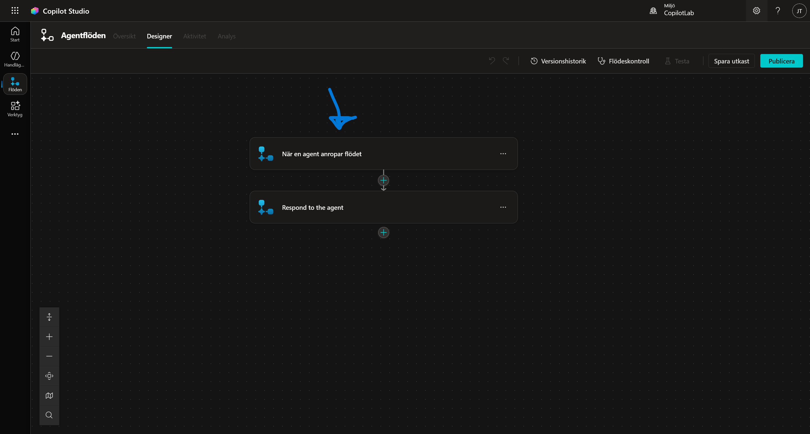

2.  Klicka på **+ Lägg till indata**.

    

3.  Du ser nu ett gäng olika typer av indata. Välj **Text**.

    

4.  Ställ dig i textrutan (där det står "Användarens indata") och döp om den till:
    ```text
    DeviceSharePointId
    ```
    *Här skickar vi in ID:t från SharePoint.*

    

5.  Gör om proceduren. Klicka **+ Lägg till indata** -> **Text**. Döp den till:
    ```text
    User
    ```
    *Här skickar vi in användarens namn.*

    

6.  Gör om proceduren igen. Klicka **+ Lägg till indata** -> **Text**. Döp den till:
    ```text
    AdditionalComments
    ```

    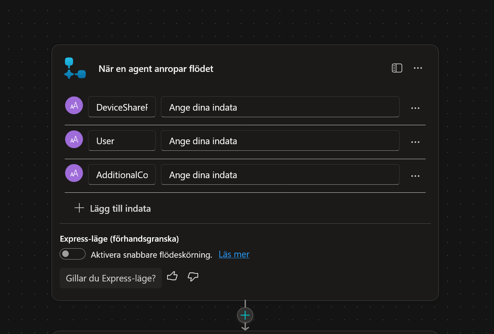

7.  **Gör kommentaren frivillig:**

    Eftersom användaren kanske inte skriver någon kommentar, måste vi göra detta fält valfritt.

    * Klicka på de **tre prickarna (...)** bredvid fältet *AdditionalComments*.

    * Välj **Gör fältet valfritt**.

    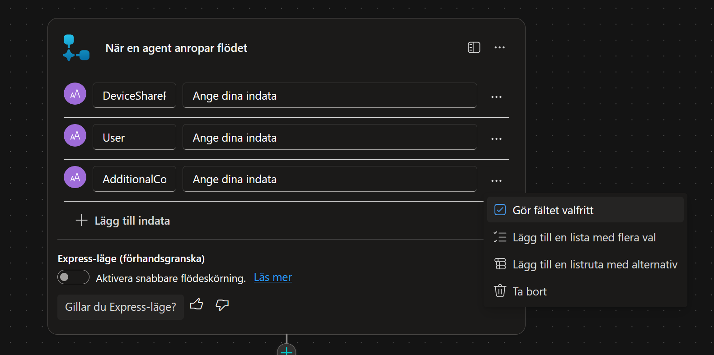

---

## 8.3 Hämta enhetsdetaljer (Get Item)

Agenten skickar bara ett ID (t.ex. "4"). För att mejlet ska bli snyggt måste vi slå upp vad "4" är för dator (Modell, Pris, etc).

1.  Klicka på **plus-tecknet (+)** under utlösare-noden.
2.  Sök efter **Hämta objekt** och välj **Hämta objekt (SharePoint)**.
    *(Obs: Välj "Hämta objekt" i singular, inte "Hämta objekt" i plural, eftersom vi bara ska hämta en specifik rad).*

    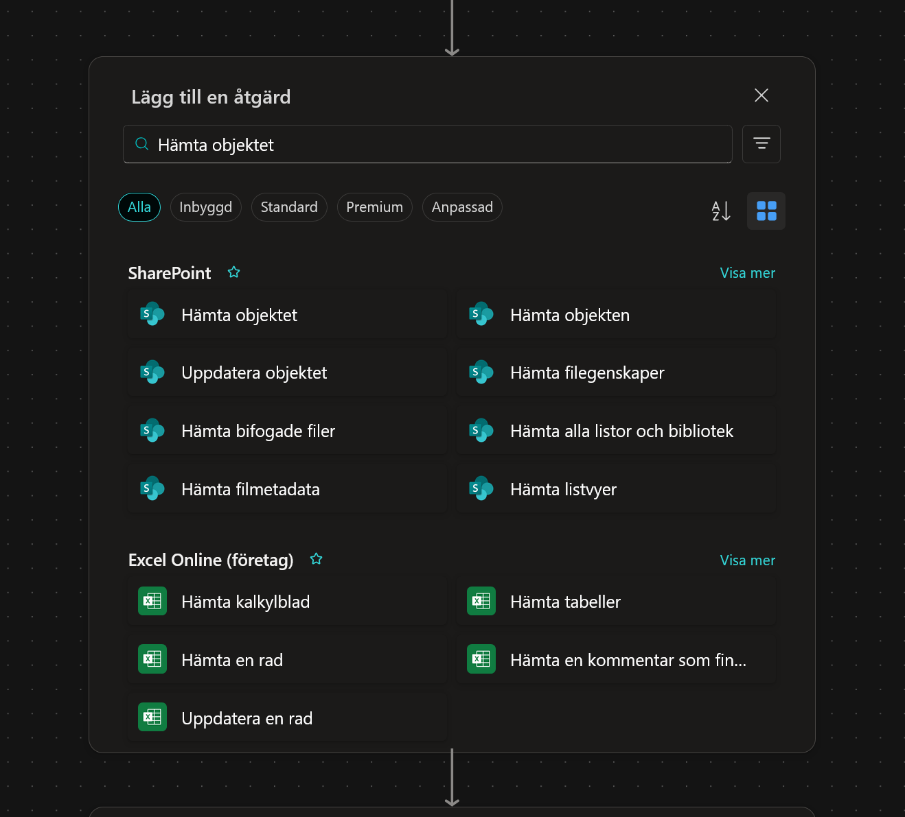

3.  **Konfigurera steget:**
    * **Webbplatsadress:** Välj din IT Support-sida.

    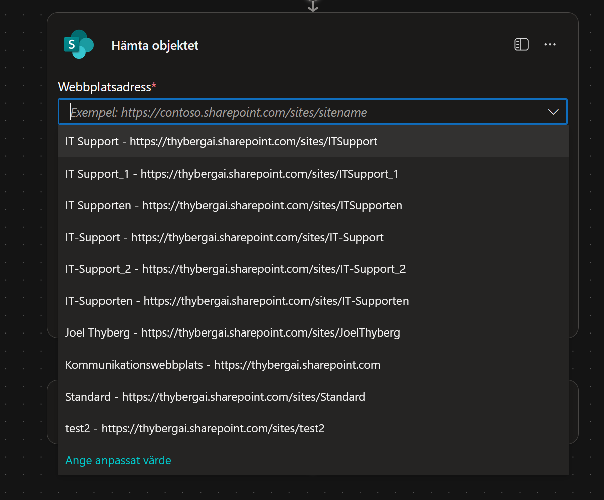

    * **Listnamn:** Välj listan **Devices**.

    

    * **Id:** Vi måste koppla detta till vårt indatavärde. Klicka på **fx** (eller blixten) längst till vänster i Id-rutan.

    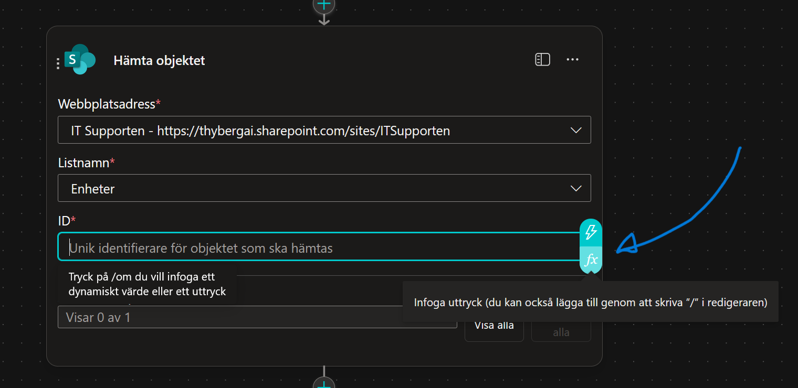

    * Välj **Dynamiskt innehåll** och sök efter:
    ```text
    DeviceSharePointId
    ```
    

    * Notera att syntaxen `triggerBody()?['text']` (eller liknande) används när du klickar på **DeviceSharePointId**. Klicka nu på **Lägg till**.

    

4.  **Avancerade inställningar:**
    * Klicka på **Visa alla** i inställningarna för *Hämta objekt*.
    
    * Hitta **Begränsa kolumner efter vy**.
    * Välj **Alla objekt**.
    
    *(Detta säkerställer att vi får tillgång till alla kolumner).*

---

## 8.4 Skicka Beställningsmejl

Nu när vi har all data ska vi skicka ordern. För att göra det enkelt och robust i denna övning använder vi e-post.

1.  Klicka på **plus-tecknet (+)** under *Hämta objekt*.
2.  Sök efter:
    ```text
    Skicka ett e-postmeddelande
    ```
    

    Välj **Skicka ett e-postmeddelande (V2)** (Office 365 Outlook).
    *(Logga in om det behövs).*

3.  Döp om noden till:
    ```text
    Skicka mejl till IT
    ```

4.  **Konfigurera mejlet:**
    Vi ska nu bygga mailet med hjälp av **Dynamiskt innehåll** (värden som hämtas från tidigare steg).

    * **Till:** Klicka på **Ange anpassat värde** och skriv in **din egen e-postadress**.

    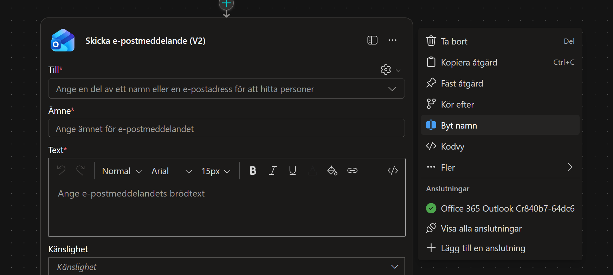

    *(I verkligheten hade detta gått till en funktionsbrevlåda för IT).*

    * **Ämne:** Skriv följande text:
    ```text
    Typ av förfrågan: Ny enhet
    ```
    

    * **Brödtext:** Här bygger vi meddelandet. Kopiera först in grundtexten nedan:

    ```text
    Hej IT-supporten!

    En ny beställning har inkommit.

    Beställare:
    Enhet:
    Pris:

    Kommentar från användaren:
    ```

    

    **Nu ska vi fylla i hålen med data:**

    **1. Lägg till Beställare:**

    * Sätt markören efter "Beställare: ".

    * Klicka på **blixt-ikonen** (Dynamiskt innehåll) eller `fx`.
    
    
    
    * Sök efter `User` och välj den från listan (under "När en agent anropar flödet").
    
    ```text
    User
    ```
    
    

    **2. Lägg till Enhet:**

    * Sätt markören efter "Enhet: ".

    * Klicka på blixten.

    * Sök efter `Model` (från steget *Hämta objekt*) och välj den.
    
    ```text
    Model
    ```
    
    

    **3. Lägg till Pris:**

    * Sätt markören efter "Pris: ".

    * Klicka på blixten.

    * Sök efter `Price` (från steget *Hämta objekt*) och välj den.
    
    ```text
    Price
    ```
    
    

    **4. Lägg till Kommentar (Avancerat - Hantera tomma svar):**

    Vi vill kontrollera om användaren lämnade fältet tomt. Om det är tomt skriver vi "None", annars visar vi kommentaren. Vi gör detta med ett uttryck (Expression).

    * Sätt markören efter "Kommentar från användaren: ".

    * Klicka på **fx** (Infoga uttryck).

    * I rutan för Funktion/Uttryck, skriv in följande start:

      ```powerfx
      if(empty())
      ```
      *Detta startar en "Om"-sats som kollar "Om tomt...".*

    

    * Klicka nu på fliken **Dynamiskt innehåll**. Sök efter `AdditionalComments` och klicka på den.

    ```text
    AdditionalComments
    ``` 

    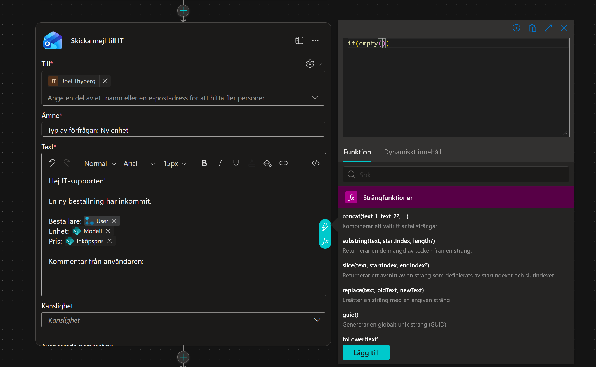

      *Din formel fylls nu på med referensen till indatafältet.*

    * Gå tillbaka till formelfältet och skriv in resten av logiken efter parentesen (efter första stängda parentesen):

      ```powerfx
      , 'Ingen kommentar',
      ```

      *Detta betyder: Om det är tomt -> Skriv 'Ingen kommentar'. Nu ska vi ange vad som händer om det INTE är tomt (Else).*

    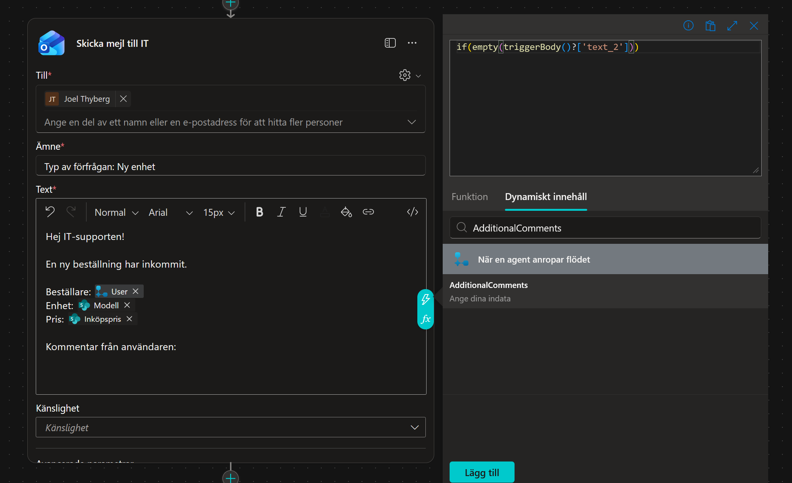

    * Klicka på fliken **Dynamiskt innehåll** igen. Sök upp och välj `AdditionalComments` en gång till.

    ```text
    AdditionalComments
    ```
    * Klicka på **Lägg till** (eller OK).

    

    *Nu är mejlet klart och dynamiskt!*

--- 

## 8.5 Skicka svar till Agenten (Utdata)

Slutligen måste vårt Agentflöde berätta för agenten att allt gick bra. Vi skickar också tillbaka namnet på den valda modellen för att kunna använda det i bekräftelsen.

1.  Klicka på sista noden **Svara agenten**.
2.  Klicka **+ Lägg till utdata**.

    

3.  Klicka på **Text**.

    

4.  Döp utdatan till:
    ```text
    ModelValue
    ```

5.  I värdefältet, klicka på **blixt-ikonen** (Dynamiskt innehåll) eller `fx`.

    

6.  Sök efter `Model` (från steget *Hämta objekt*) och välj den.

    ```text
    Model
    ```

    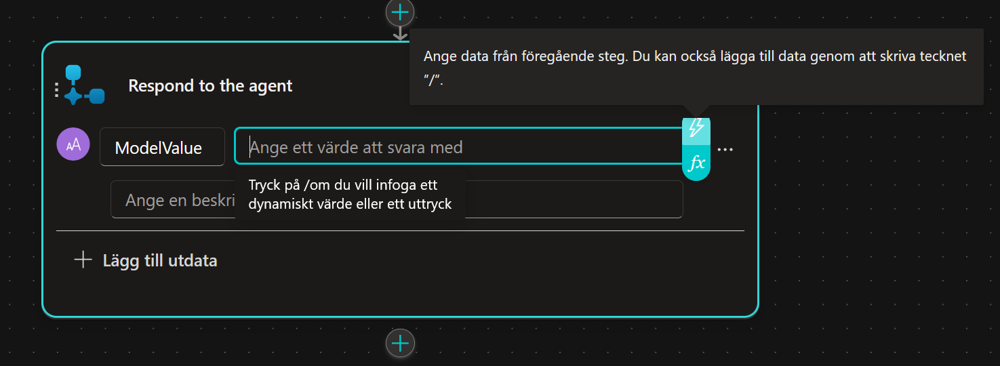

---

## 8.6 Spara och konfigurera Agentflödet

Nu ska vi spara arbetet, namnge flödet korrekt och publicera det.

1.  Längst upp till vänster, klicka på namnet **Spara utkast**.

    

2.  Klicka nu på **Översikt** (till vänster om namnet).

    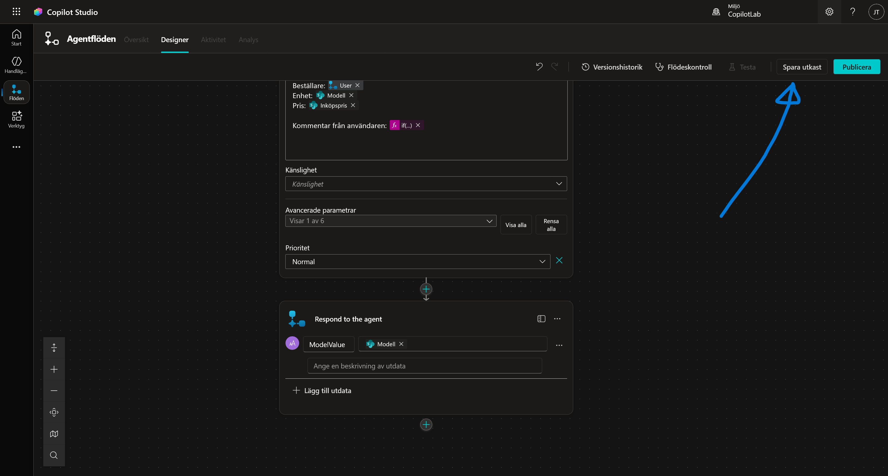

3.  Väl inne i översikten, klicka på **Redigera** under *Detaljer*.

    

4.  I fältet *Flödesnamn*, skriv in:
    ```text
    Skicka e-post med enhetsförfrågan
    ```

5.  I fältet *Beskrivning*, skriv in:
    ```text
    Det här flödet skickar en enhetsförfrågan via e-post till IT-avdelningen för granskning.
    ```

6.  Klicka på **Spara**.

    

7.  Viktigt: För att flödet ska fungera måste det publiceras. Klicka på **Publicera** i verktygsfältet (oftast uppe till vänster).
    *(Ibland måste du gå in i Designer-läget igen för att se Publicera-knappen).*

    

---

## 8.7 Koppla ditt Agentflöde i Ämnet

Nu måste vi gå tillbaka till Copilot Studio och koppla in vårt nya Agentflöde i vårt ämne.

1.  **Navigera till ämnet *Beställ enhet*:**
    * Gå tillbaka till Agent-vyn genom att klicka på **Agenter** i menyn till vänster.

    

    * Välj din agent **IT Support Helper**.

    

    * Gå till fliken **Ämnen** i menyn högst upp.

    

    * Klicka på **Beställ enhet**.

    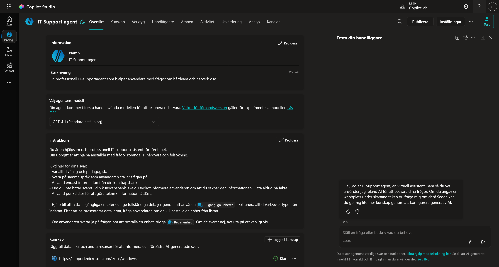

2.  **Lägg till flödet:**
    * Gå längst ner i flödet, under det adaptiva kortet.
    * Klicka på **plus-tecknet (+) -> Lägg till ett verktyg**.
    * Välj ditt nyligen skapade flöde: **Skicka e-post med enhetsförfrågan**.

    

3.  **Mappa indata:**
    Nu frågar agenten: "Vad ska jag stoppa in i de tre indatahål du byggde?"

    **DeviceSharePointId:**
    * Klicka på pilen `>` (eller rutan) bredvid *DeviceSharePointId*.
    * Välj variabeln `deviceSelectionId` (den kommer från ditt adaptiva kort).

    

    **User:**
    * Klicka på pilen `>` bredvid *User*.
    * Navigera till fliken **System**.
    * Sök efter och välj `User.DisplayName`.

    

    **AdditionalComments (Avancerat):**
    Vi vill hantera fallet att användaren inte skrev någon kommentar alls. Om vi skickar in ett tomt värde kan det bli fel i vissa system, så vi använder en formel för att skicka en tom textsträng ("") istället för *null* om det saknas.

    * Klicka på pilen `>` bredvid *AdditionalComments*.
    * Välj fliken **Formel** och klicka på expandera-ikonen (pilen) för att få mer plats.

    

    * Skriv in följande formel:
    ```powerfx
    If(IsBlank(Topic.commentsId), "", Topic.commentsId)
    ```
    * Kontrollera att du har en grön bock (inget syntaxfel). Klicka sedan på **Infoga**.

    

    !!! info "Varför gjorde vi detta?"
        Formeln betyder: "Om variabeln *commentsId* är blank (tom), skicka en tom textsträng. Annars, skicka innehållet i *commentsId*." Detta gör flödet mer robust.

---

## 8.8 Förbättra användarupplevelsen (Bekräftelse)

Vi ska nu lägga till en nod för att ge användaren en tydlig och personlig bekräftelse på att beställningen är mottagen.

1.  Klicka på **plus-tecknet (+)** under din Agentflöde-nod och välj **Skicka ett meddelande**.

    

2.  Vi ska nu bygga meddelandet steg för steg för att få in dynamiska värden:

    * Börja med att skriva:
    ```text
    Tack 
    ```
    *(Glöm inte mellanslaget efter Tack)*

    * Klicka på ikonen **{X} (Infoga variabel)**.
    * Välj fliken **System** och sök efter `User`. Välj **User.DisplayName**.

    

    * Fortsätt skriva texten:
    ```text
    . Din valda enhet, 
    ```
    
    * Klicka på **{X} (Infoga variabel)** igen.
    * Välj fliken **Anpassat** och sök efter `ModelValue`. Välj **ModelValue**.
    *(Detta är variabeln vi fick tillbaka från vårt Agentflöde).*

    

    * Avsluta meningen med att skriva:
    ```text
    , har skickats in och kommer att granskas av IT-ansvarig.
    ```

3.  Granska meddelandet. Det ska nu se ut ungefär så här i editorn:

    > Tack {User.DisplayName}. Din valda enhet, {ModelValue}, har skickats in och kommer att granskas av IT-ansvarig.

    

!!! success "Snyggt!"
    Nu får användaren en personlig bekräftelse med sitt eget namn och namnet på datorn de valt.

### Testa allt!
1.  Öppna testpanelen. Starta om med **Starta ny session**-ikonen högst upp.
2.  Skriv:
    ```text
    Jag vill ha en bärbar dator
    ```
3.  Välj en prestandanivå (t.ex. Standard).
4.  När listan visas och agenten frågar om beställning, svara `Ja`.
5.  Välj en dator i det adaptiva kortet.
6.  I kommentarsfältet, skriv:
    ```text
    Jag vill ha så mycket RAM-minne som möjligt!
    ```
7.  Klicka **Skicka**.
8.  *Nu ska agenten tänka en liten stund, anropa ditt Agentflöde, och sedan svara med bekräftelsen. Samtidigt ska det plinga till i din mejlkorg!*

!!! success "Grattis!"
    Du har nu byggt en fullständig kedja med ett **Agentflöde**:
    AI (Förstår) -> Logik (Styr) -> Data (SharePoint) -> GUI (Adaptivt kort) -> Agentflöde (Power Automate) -> Verkligheten (E-post).
