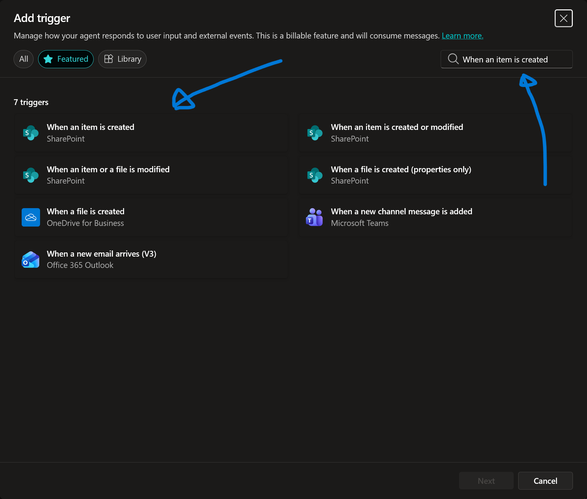
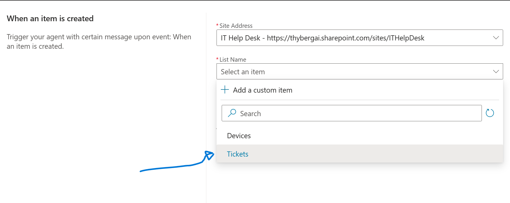
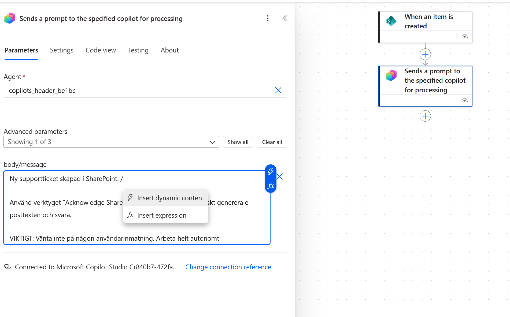
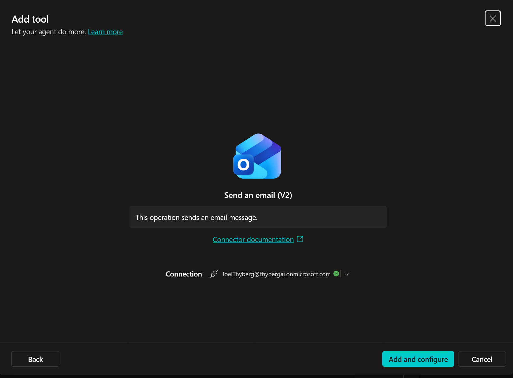
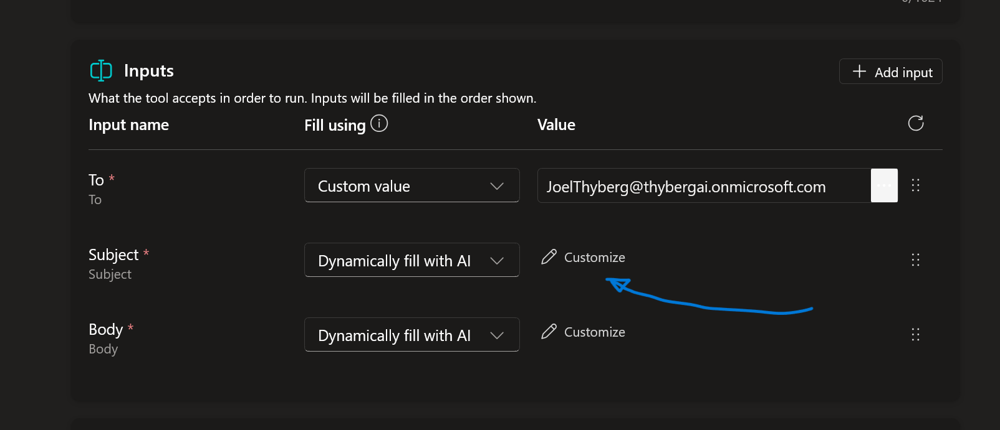
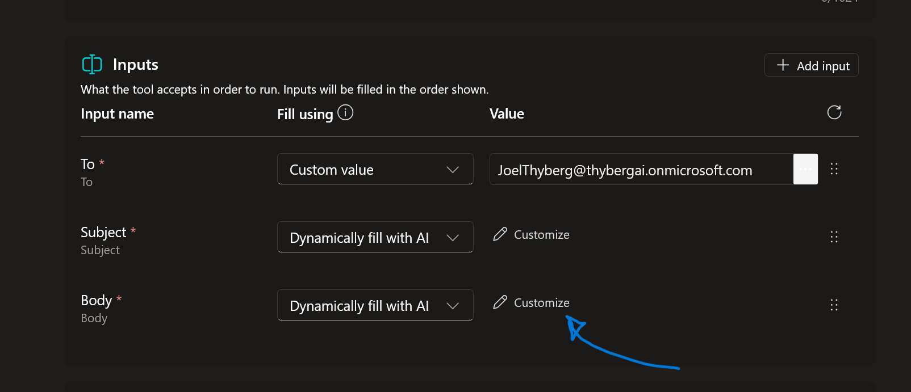

# 9. Autonomi (Vakna till liv)

Hittills har din agent varit reaktiv. Nu ska vi göra den **proaktiv**.
Vi ska skapa en funktion där agenten automatiskt reagerar när en ny support-ticket skapas i SharePoint, och genast notifierar IT-avdelningen via mejl.

---

## 9.1 Skapa SharePoint-triggern

Vi börjar med att tala om för agenten vad den ska lyssna efter.

1.  Navigera till fliken **Overview**.

    

2.  Leta upp sektionen **Triggers** och klicka på **+ Add trigger**.

    

3.  Sök efter 
    ```text
    When an item is created
    ```

    

4.  Välj **When an item is created (SharePoint)** och klicka **Next**.

    

5.  Vänta tills anslutningen konfigureras och klicka sedan på **Next**.

    

6.  **Konfigurera Triggern:**
    * **Site Address:** Klicka på dropdown-menyn och välj **IT Help Desk**. (Om du inte ser den, klicka på *Enter custom value* och klistra in URL:en, eller sök).

    

    * **List Name:** Välj **Tickets**.

    

    * *Limit Columns by View:* Låt vara som den är.

7.  **Instruktioner till Agenten:**
    I rutan **Additional instructions to the agent...** klistrar du in följande:

    ```text
    Ny supportticket skapad i SharePoint: {Body}
    
    Använd verktyget 'Acknowledge SharePoint Ticket' för att meddela IT-avdelningen om detta.
    
    VIKTIGT: Vänta inte på någon användarinmatning. Arbeta helt autonomt.
    ```

8.  Klicka på **Create trigger**.

    

---

## 9.2 Redigera Triggern (Power Automate)

Agenten behöver mer detaljer än vad standardinställningen ger. Vi ska injicera en formel som plockar ut exakt den data vi vill ha (Vem, Vad, Prioritet).

**Vänta tills triggern är skapad. Testa den inte än.**

1.  I listan över triggers på Overview-sidan: Klicka på de **tre prickarna (...)** längst till höger på din nya trigger.
2.  Välj **Edit in Power Automate**.

    

    *Ett nytt fönster öppnas med ditt flöde.*

3.  Du ser två noder. Klicka på den nedre noden: **Send a prompt to the specified copilot for processing**.

    
    
    *En meny öppnas till vänster.*

4.  **Redigera meddelandet:**
    * Klicka i rutan **Body/Message**.
    * Ta bort texten `{Body}` som ligger där.
    * Skriv ett snedstreck `/` och välj **Insert Expression** (blixt-ikonen).

    

5.  **Lägg till uttrycket:**
    En ny meny kommer upp. Klistra in exakt denna kod i rutan:

    ```powerfx
    concat('Submitted By Name: ', first(triggerOutputs()?['body/value'])?['Author/DisplayName'], '\nSubmitted By Email: ', first(triggerOutputs()?['body/value'])?['Author/Email'], '\nTitle: ', first(triggerOutputs()?['body/value'])?['Title'], '\nIssue Description: ', first(triggerOutputs()?['body/value'])?['Description'], '\nPriority: ', first(triggerOutputs()?['body/value'])?['Priority/Value'],'\nTicket ID : ', first(triggerOutputs()?['body/value'])?['ID'])
    ```

    * Klicka på **Add**.

    

6.  Klicka på **Save** högst upp till höger på sidan.

    

    *När det är sparat kan du stänga fliken och gå tillbaka till Copilot Studio.*

---

## 9.3 Skapa Notifierings-verktyget

Nu har agenten en trigger, men den behöver ett verktyg för att kunna skicka mejlet till IT-avdelningen.

1.  Navigera till fliken **Topics** (eller Tools) och välj **+ Add a tool**.

    

2.  Sök efter **Send an email**.

    

3.  Välj **Send an email (V2)** (Office 365 Outlook).

    

4.  Vänta på anslutningen och klicka sedan på **Add and configure** (eller Next).

    

5.  **Konfigurera verktyget:**
    * **Name:**
      ```text
      Acknowledge SharePoint ticket
      ```
    * **Description:**
      ```text
      Det här verktyget skickar ett e-postmeddelande till IT-avdelningen med information om att en ny ticket har skapats.
      ```

6.  **Konfigurera Inputs (Viktigt):**
    Vi måste vara tydliga med vad agenten ska fylla i. Klicka på **Edit** (eller Customize) bredvid *Inputs*.

    **Konfigurera "To" (Mottagare):**
    Här ska vi ange vem som ska ta emot mejlet. Eftersom det är en notifiering till IT (dig), hårdkodar vi adressen så agenten slipper gissa.
    
    * Klicka på dropdown-menyn där det står *Dynamically fill with AI* och välj **Enter custom value**.

    

    * Skriv in din egen e-postadress i fältet (t.ex. `JoelThyberg@thybergai.onmicrosoft.com`).

    **Konfigurera "Subject" (Ämne):**
    Låt stå på *Dynamically fill with AI*, men vi ska ge en instruktion.
    
    * Klicka på **Edit** (pennan) eller Customize bredvid Subject.

    

    * I fältet **Description**, skriv:
      ```text
      En kort ämnesrad som inkluderar tickettiteln
      ```
    * Se till att **Identify as** är satt till *User's entire response*.

    

    * Stäng panelen för Subject.

    **Konfigurera "Body" (Innehåll):**
    Vi gör samma sak här.
    
    * Klicka på **Edit** (pennan) eller Customize bredvid Body.

    

    * I fältet **Description**, skriv:
      ```text
      En sammanfattning av den nya ticketen, inklusive titel, prioritet och beskrivning.
      ```

    * Stäng panelen.

7.  Klicka **Save**.

---

## 9.4 Testa Autonomin

Nu testar vi om agenten vaknar till liv när vi skapar en ticket.

1.  Gå till **Overview** i Copilot Studio.
2.  Vid din trigger, klicka på ikonen **Test trigger** (blixt/play). Testpanelen öppnas och väntar.
3.  Öppna en ny flik i webbläsaren och gå till din SharePoint-lista **Tickets**.
4.  Skapa en ny rad (+ New):
    * **Title:** `VPN nere`
    * **Description:** `Jag kommer inte åt nätverket.`
    * **Priority:** `High`
5.  Spara raden.
6.  Gå tillbaka till Copilot Studio. Vänta och klicka **Refresh** i testpanelen tills triggern syns.
7.  Klicka **Start testing**.

**Resultat:** Agenten ska läsa in ticketen, formulera ett mejl med informationen om "VPN nere" och skicka det till dig (IT-avdelningen).