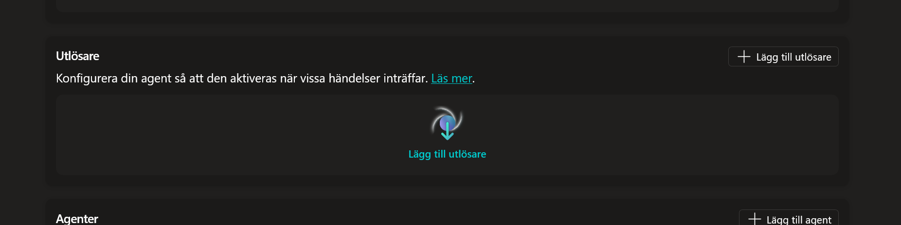
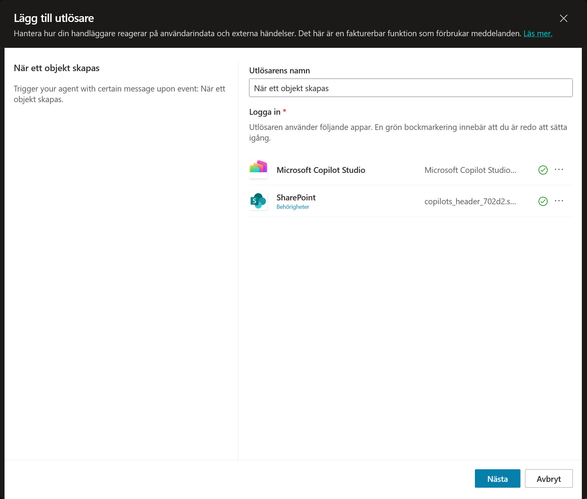
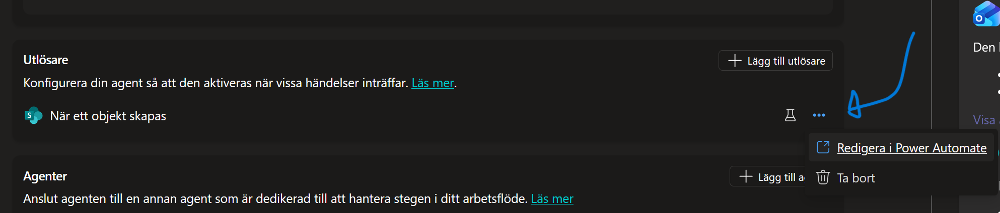
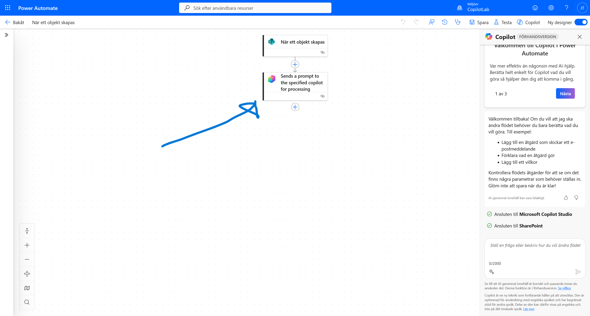
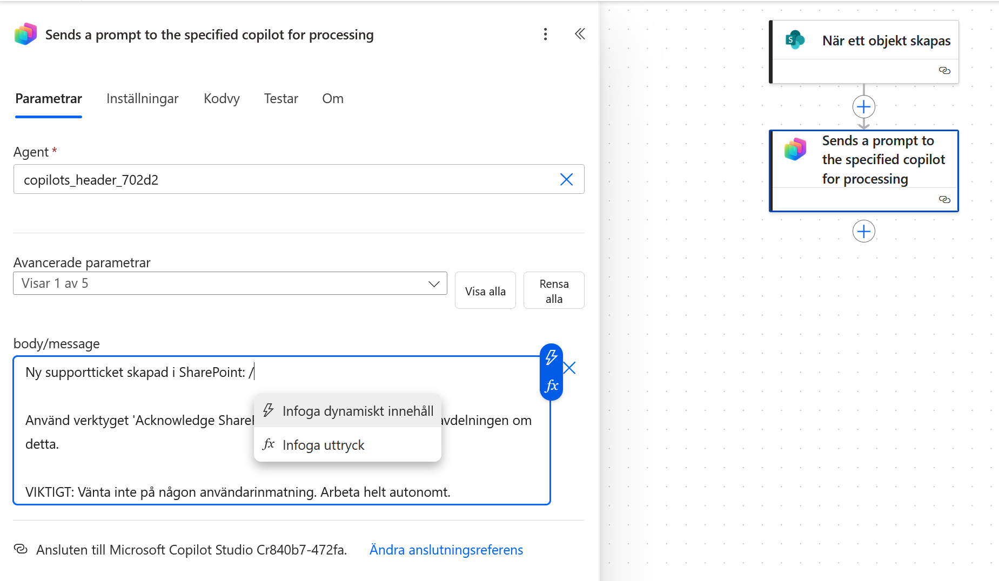
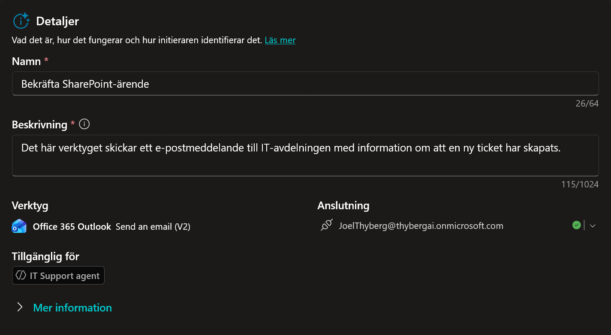
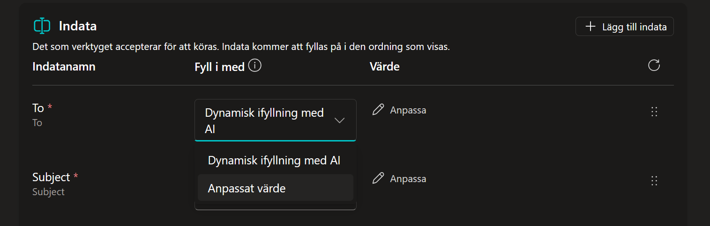
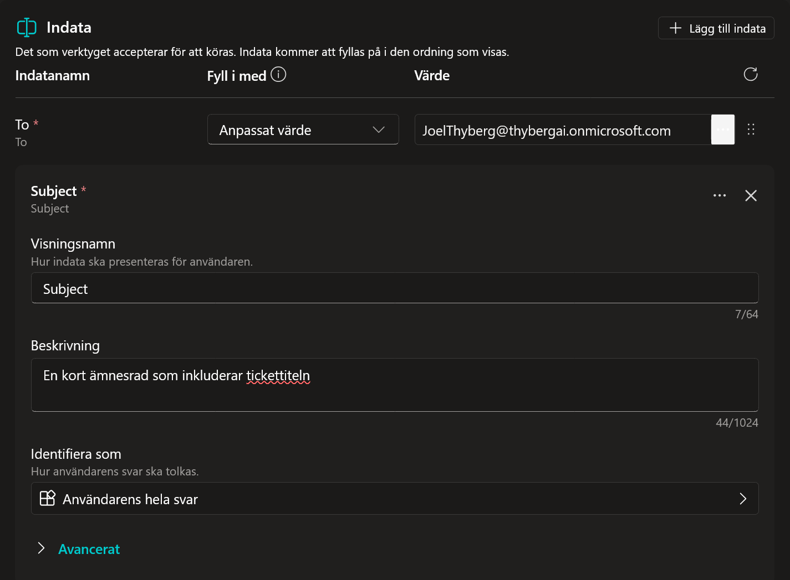

# 9. Autonomi (Vakna till liv)

Hittills har din agent varit reaktiv. Nu ska vi göra den **proaktiv**.
Vi ska skapa en funktion där agenten automatiskt reagerar när en ny supportbegäran skapas i SharePoint, och genast notifierar IT-avdelningen via mejl.

---

## 9.1 Skapa SharePoint-triggern

Vi börjar med att tala om för agenten vad den ska lyssna efter.

1.  Navigera till fliken **Översikt**.

    

2.  Leta upp sektionen **Utlösare** och klicka på **+ Lägg till utlösare**.

    

3.  Sök efter 
    ```text
    När ett objekt skapas
    ```

    

4.  Välj **När ett objekt skapas (SharePoint)** och klicka **Nästa**.

    

5.  Vänta tills anslutningen konfigureras och klicka sedan på **Nästa**.

    

6.  **Konfigurera Utlösaren:**
    * **Webbplatsadress:** Klicka på dropdown-menyn och välj **IT Supporten**. (Om du inte ser den, klicka på *Lägg till ett anpassat objekt* och klistra in URL:en, eller sök).

    

    * **Listnamn:** Välj **Begäran**.

    

    * *Begränsa kolumner efter vy:* Låt vara som den är.

7.  **Instruktioner till Agenten:**
    I rutan **Ytterligare instruktioner till agenten...** klistrar du in följande:

    ```text
    Ny supportbegäran skapad i SharePoint: {Body}
    
    Använd verktyget 'Acknowledge SharePoint Ticket' för att meddela IT-avdelningen om detta.
    
    VIKTIGT: Vänta inte på någon användarinmatning. Arbeta helt autonomt.
    ```

8.  Klicka på **Skapa utlösare**.

    

---

## 9.2 Redigera Utlösaren (Power Automate)

Agenten behöver mer detaljer än vad standardinställningen ger. Vi ska injicera en formel som plockar ut exakt den data vi vill ha (Vem, Vad, Prioritet).

**Vänta tills utlösaren är skapad. Testa den inte än.**

1.  I listan över utlösare på Översikt-sidan: Klicka på de **tre prickarna (...)** längst till höger på din nya utlösare.
2.  Välj **Redigera i Power Automate**.

    

    *Ett nytt fönster öppnas med ditt flöde.*

3.  Du ser två noder. Klicka på den nedre noden: **Send a prompt to the specified copilot for processing**.

    
    
    *En meny öppnas till vänster.*

4.  **Redigera meddelandet:**
    * Klicka i rutan **Body/Message**.
    * Ta bort texten `{Body}` som ligger där.
    * Skriv ett snedstreck `/` och välj **Infoga uttryck** (fx-ikonen).

    

5.  **Lägg till uttrycket:**
    En ny meny kommer upp. Klistra in exakt denna kod i rutan:

    ```powerfx
    concat('Submitted By Name: ', first(triggerOutputs()?['body/value'])?['Author/DisplayName'], '\nSubmitted By Email: ', first(triggerOutputs()?['body/value'])?['Author/Email'], '\nTitle: ', first(triggerOutputs()?['body/value'])?['Title'], '\nIssue Description: ', first(triggerOutputs()?['body/value'])?['Description'], '\nPriority: ', first(triggerOutputs()?['body/value'])?['Priority/Value'],'\nTicket ID : ', first(triggerOutputs()?['body/value'])?['ID'])
    ```

    * Klicka på **Add**.

    

    !!! info "Vad gör denna formel?" 
        När SharePoint skickar data till flödet kommer det som en stor, teknisk dataklump (JSON). För att göra det enkelt för agenten att läsa informationen gör vi två saker i denna formel:
        1.  **Plockar russinen ur kakan:** Vi hämtar specifika fält som *Titel*, *Avsändare* och *Beskrivning*.
        2.  **Formaterar:** Vi använder `concat` (slå ihop) för att skapa en prydlig textlista med radbrytningar (`\n`). 

        Resultatet blir en ren text som agenten lätt kan förstå, typ: *"Title: VPN nere, Priority: High"*.

6.  Klicka på **Save** högst upp till höger på sidan.

    

    *När det är sparat kan du stänga fliken och gå tillbaka till Copilot Studio.*

---

## 9.3 Skapa Notifierings-verktyget

Nu har agenten en utlösare, men den behöver ett verktyg för att kunna skicka mejlet till IT-avdelningen.

1.  Navigera till fliken **Ämnen** (eller Verktyg) och välj **+ Lägg till ett verktyg**.

    

2.  Sök efter 
    ```text
    Skicka ett e-postmeddelande
    ```

    

3.  Välj **Skicka ett e-postmeddelande (V2)** (Office 365 Outlook).

    

4.  Vänta på anslutningen genom att kontrollera att det är grönt till höger om den mejladress och klicka sedan på **Lägg till och konfigurera** (eller Nästa).

    !!! info "Ser du ingen grön bock?" 
        Om anslutningen inte är klar (ingen grön bock vid din mejladress), klicka på pilen eller de tre prickarna vid Anslutning-raden och välj att logga in/lägga till anslutning. Du kan inte klicka på Lägg till och konfigurera förrän anslutningen är aktiv.

    

5.  **Konfigurera verktyget:**
    * **Namn:**
      ```text
      Bekräfta SharePoint-ärende
      ```
    * **Beskrivning:**
      ```text
      Det här verktyget skickar ett e-postmeddelande till IT-avdelningen med information om att en ny begäran har skapats.
      ```

    

6.  **Konfigurera Indata (Viktigt):**
    Vi måste vara tydliga med vad agenten ska fylla i.

    **Konfigurera "Till" (Mottagare):**
    Här ska vi ange vem som ska ta emot mejlet. Eftersom det är en notifiering till IT (dig), hårdkodar vi adressen så agenten slipper gissa.
    
    * Klicka på dropdown-menyn där det står *Fyll i dynamiskt med AI* och välj **Anpassat värde**.

    

    * Skriv in din egen e-postadress i fältet (t.ex. `JoelThyberg@thybergai.onmicrosoft.com`).

    

    **Konfigurera "Ämne" (Subject):**
    Låt stå på *Fyll i dynamiskt med AI*, men vi ska ge en instruktion.
    
    * Klicka på **Anpassa** bredvid Ämne.

    

    * I fältet **Beskrivning**, skriv:
      ```text
      En kort ämnesrad som inkluderar begäranstiteln
      ```
    * Se till att **Identifiera som** är satt till *Användarens hela svar*.

    

    * Stäng panelen för Ämne.

    **Konfigurera "Brödtext" (Body):**
    Vi gör samma sak här.
    
    * Klicka på **Anpassa**.

    

    * I fältet **Beskrivning**, skriv:
      ```text
      En sammanfattning av den nya begäran, inklusive titel, prioritet och beskrivning.
      ```
    * Se till att **Identifiera som** är satt till *Användarens hela svar*.

    

    * Stäng panelen.

7.  Klicka **Spara**.

---

## 9.4 Testa Autonomin

Nu testar vi om agenten vaknar till liv när vi skapar en begäran.

1.  Gå till **Översikt** i Copilot Studio.
2.  Vid din utlösare, klicka på ikonen **Testa utlösare** (blixt/play). Testpanelen öppnas och väntar.
3.  Öppna en ny flik i webbläsaren och gå till din SharePoint-lista **Begäran**.
4.  Skapa en ny rad (+ Nytt):
    * **Rubrik:** `VPN nere`
    * **Beskrivning:** `Jag kommer inte åt nätverket.`
    * **Prioritet:** `High`
5.  Spara raden.
6.  Gå tillbaka till Copilot Studio. Vänta och klicka **Uppdatera** i testpanelen tills utlösaren syns.
7.  Klicka **Starta testning**.

**Resultat:** Agenten ska läsa in begäran, formulera ett mejl med informationen om "VPN nere" och skicka det till dig (IT-avdelningen).
