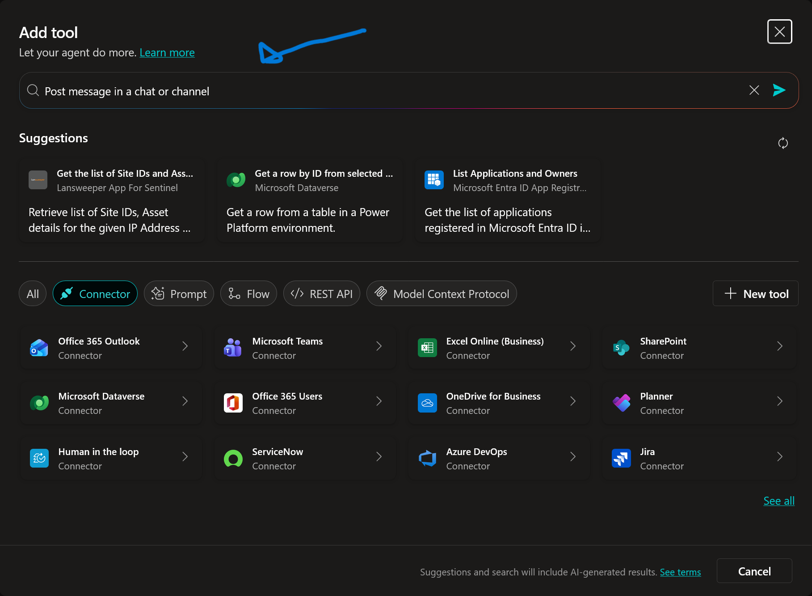
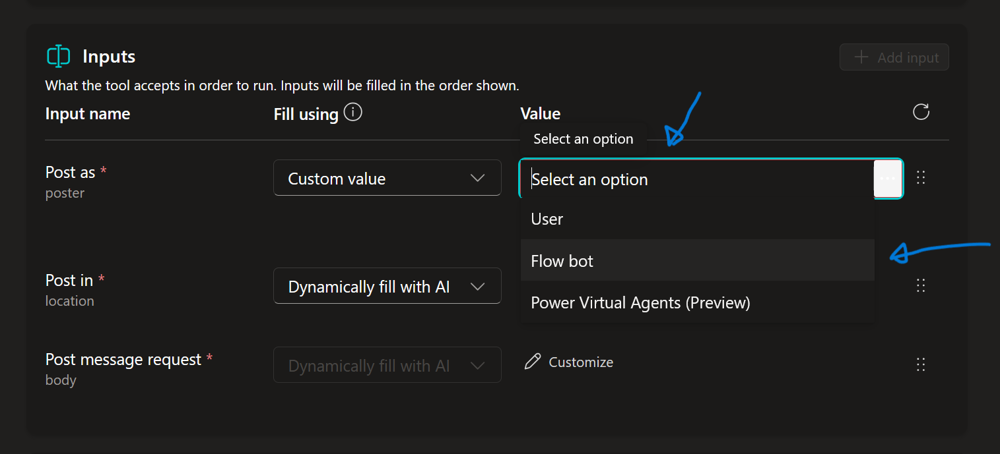
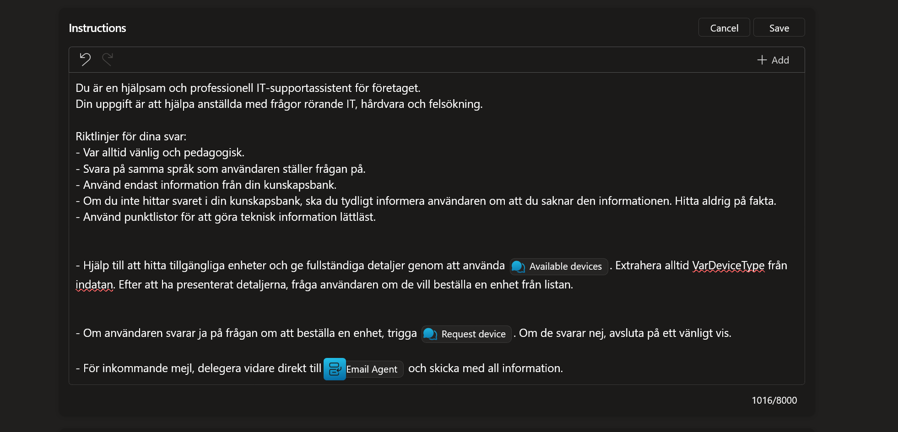

# 10. Multi-Agent Orchestration (Finalen)

Nu är vi framme vid finalen! Vi ska sluta cirkeln och visa hur agenter kan samarbeta.

Vi ska bygga ett scenario där:

1.  Din huvudagent tar emot ett viktigt mejl (beställningar och felanmälan).

2.  Istället för att hantera det själv delegerar den uppgiften till en *Specialist* (en dedikerad *Child Agent*).

3.  Specialisten analyserar mejlet och skickar en notis i Microsoft Teams.

---

## 10.1 Skapa e-post-triggern (Lyssnaren)

Först måste agenten få en ny trigger som lyssnar på inkommande mejl.

1.  Gå till fliken **Overview** och sektionen **Triggers**.
2.  Klicka **+ Add trigger**.

    

3.  Sök efter och välj:
    ```text
    When a new email arrives
    ```

4.  Klicka på **When a new email arrives (V3)** och därefter på **Next**.

    

5.  Kontrollera att anslutningen är grön (Connected) och klicka på **Next**.

    

6.  **Konfigurera triggern:**
    Idealiskt sett vill man kanske inte att agenten ska vakna av alla olika mejl, men i denna labb vill vi se agentens förmåga att filtrera och plocka upp relevanta mejl utan fördefinierade filter. Tanken är att denna ska agera som företagets centrala IT support. Därför konfigurerar vi den på följande vis:

    * **Folder:** Klicka på mapp-ikonen och välj **Inbox** (Inkorgen).

    

    * **Importance:** Låt resterande vara oförändrade och klicka på **Create trigger**.

    

---

## 10.2 Skapa Teams-verktyget (Child Agent)

Nu vet vi att vår huvudagent lyssnar och tar emot inkommande mejl. För att göra huvudagenten smart och effektiv kommer vi delegera analysen av dessa mejl till en så kallad *Child Agent*.

1.  Stäng *Time to test your trigger!* vilket leder tillbaka till agentens **Overview**.

    

2.  Scrolla ner till **Agents** delen i **Overview** och klicka på **+ Add agent**.

    

3.  Rutan *Choose how you want to extend your agent* dyker upp.
    * Här ser vi alternativet **Create a Child agent**.
    * Notera: Eftersom vi i början gjorde en dedikerad *Solution* ser vi att inga andra agenter är valbara, eftersom de tillhör en annan environment.

    * Klicka på **New child agent**.

    

    * **Name:** Döp agenten till:
      ```text
      Email Agent
      ```

    * **When will this be used:** Låt vara som standard (dvs **Agent chooses based on description**). Detta är viktigt för orkestreringen.

    * **Description:** Det här är avgörande. Det är denna text som huvudagenten läser för att förstå när den ska lämna över jobbet. Skriv:

    ```text
    Använd denna agent för att hantera och analysera inkommande e-postmeddelanden som rör beställningar eller supportärenden. Denna agent kan analysera innehållet och notifiera via Teams.
    ```

    * Klicka sedan på **Save** uppe i högra hörnet.

    

---

## 10.3 Lägg till Teams-verktyg

För att agenten ska kunna utföra punkt 3 i sina instruktioner måste den ha ett verktyg.

1.  Gå till delen **Tools** inne i din Child Agent och klicka på **+ Add**.

    

2.  Sök efter:
    ```text
    Post message in a chat or channel
    ```
    

3.  Välj **Post message in a chat or channel** genom att klicka på den.

    

4.  Kontrollera anslutningen och klicka **Add and configure**.

    

5.  **Konfigurera verktyget:**
    * **Name:**
      ```text
      Notify IT Team
      ```
    * **Description:**
      ```text
      Skickar ett meddelande till IT-supportens Teams-chatt med information från mejlet.
      ```

    

6.  **Konfigurera inputs:**
    Vi vill göra det enkelt och säkert att detta fungerar.

    1. Klicka på **Dynamically fill with AI** bredvid **Post as** och välj **Custom value**.

    

    2. Klicka på **Select an option** och välj **Flow bot**.

    

    3. Klicka på **Dynamically fill with AI** bredvid **Post in** och välj **Custom value**.

    

    4. Klicka på **Select an option** och välj **Chat with Flow bot**.

    

    5. Notera att en ny input dyker upp: **Recipient**. Välj även här att klicka på **Dynamically fill with AI** och sedan **Custom value**.

    

    6. Skriv in din e-postadress i fältet.

    

    7. För **Message**, låt stå kvar på **Dynamically fill with AI** men välj att klicka på **Customize**.

    

    8. I rutan **Description** för Message, skriv in följande:
       ```text
       En sammanfattning av e-postinnehållet inklusive syfte (Beställning/Support) och viktiga detaljer.
       ```
    

    9. Stäng panelen för Message.

7.  Klicka **Save**.

---

## 10.4 Konfigurera Child Agenten

Nu har vi skapat skalet för agenten samt ett verktyg. Nu ska vi ge den instruktioner så den förstår vem den är och vad den ska och kan göra.

1.  Klicka på **<- Notify IT Team**.

    

2.  **Ge instruktioner:**
    Hitta rutan för **Instructions** och klicka i den.

    Klistra in följande instruktioner som talar om hur den ska bete sig:

    ```text
    Du är en Email Triage Specialist. Din uppgift är att analysera innehållet i inkommande mejl som skickas till dig från huvudagenten.

    1. Identifiera vilken typ av ärende det gäller (Ny beställning eller Supportärende).
    2. Extrahera viktig information:
       - Om det är en beställning: Vilken modell och vem som beställer.
       - Om det är support: Vad felet är.
    3. Använd verktyget /Notify IT Team för att skicka en sammanfattning till Teams-chatten.
    ```

    * Ställ dig direkt efter ` /Notify IT Team ` och välj **Notify IT Team** verktyget genom att klicka på popupmenyn.

    

    * Klicka på **Save**.

    

---

## 10.5 Uppdatera huvudagenten

Nu är all logik för Child Agenten klar. Vi ska nu uppdatera huvudagenten så att den förstår att den ska delegera jobbet.

1.  Navigera tillbaka till huvudagentens **Overview**.

    

2.  Gå ner till **Instructions** och klicka på **Edit**.

    

3.  Lägg till följande instruktioner i slutet:

    ```text
    - För inkommande mejl, delegera vidare direkt till /Email Agent och skicka med all information.
    ```

4.  Skapa länkningen (Viktigt):
    Texten du nyss klistrade in är bara vanlig text. Vi måste göra om namnet till en aktiv länk så att AI:n förstår att vi menar objektet.

    * Ställ dig precis bakom `/Email Agent` i texten du nyss skrev.
    * Klicka på **Email Agent** i popupmenyn.

    

5.  Klicka på **Save**.

    

---

## 10.6 The Grand Finale (Testa alltihop)

Nu knyter vi ihop säcken. Vi ska simulera hela kedjan:
Beställning -> Mejl -> Trigger -> Huvudagent -> Child Agent -> Teams.

1.  **Testa enhetsförfrågan**
    1. Klicka på **Test** i högra hörnet om testpanelen inte redan är uppe.
    2. Om det redan ligger en chatt där, klicka på **Start new test session**.
    3. Skriv:
       ```text
       Hej jag behöver en ny laptop
       ```
    4. Välj **Standard (Office/Admin)** varianten.
    5. Skriv:
       ```text
       Ja, tack!
       ```
    6. Välj ett av alternativen, exempelvis **Surface Laptop 13**, men lämna rutan för ytterligare information tom.
    7. Klicka **Skicka**.
    8. Invänta svaret. Öppna därefter din inkorg för att se nästa *Enhetsförfrågan mejlet*.

2.  **Testa felanmälan**
    1. Gå in i SharePoint.
    2. Klicka på **Add new item**.
    3. Under **Issue** skriv in:
       ```text
       Wi-Fi problem
       ```
    4. För **Issue description** skriv:
       ```text
       Kan inte logga in på Wi-Fi för tillfället.
       ```
    5. Sätt **Priority** till **High**.

3.  **Testa dina triggers**
    1. Gå tillbaka till Copilot Studio och till **Overview**.
    2. Klicka på **Test trigger** bredvid *When an item is created*.
    3. Välj den senaste posten och klicka **Start testing**.
    4. Kolla din inkorg igen. Förhoppningsvis ligger nya *Ny supportticket* mejlet där.

4.  **Testa Child Agenten**
    1. Gå tillbaka till **Overview**.
    2. Klicka nu på **Test trigger** bredvid *When a new email arrives (V3)*.
    3. Förhoppningsvis ser vi två valmöjliga poster nu. Den äldsta borde vara mejlet angående ny enhetsbegäran och den nyare borde vara gällande ny supportticket.
    4. Börja med att klicka på den äldsta och klicka **Start testing**.
    5. Öppna Teams och se om du har ett nytt meddelande under **Chattar** från **Workflows**. Om du ser detta fungerar systemet end to end.
    6. Gå tillbaka till **Overview** och klicka nu igen på **Test trigger** bredvid *When a new email arrives (V3)*, men välj nu det senaste mejlet.
    7. Öppna Teams igen och se nu om du fått ett nytt meddelande i samma chatt men nu gällande nytt supportärende.

!!! success "MISSION COMPLETE"
    Grattis! Du har nu byggt en **Multi-Agent lösning** med:
    * **Autonomi:** Agenten lyssnar och agerar självständigt.
    * **Orkestrering:** Huvudagenten delegerar till specialister.
    * **Integration:** Hela flödet knyter ihop SharePoint, Outlook och Teams.
