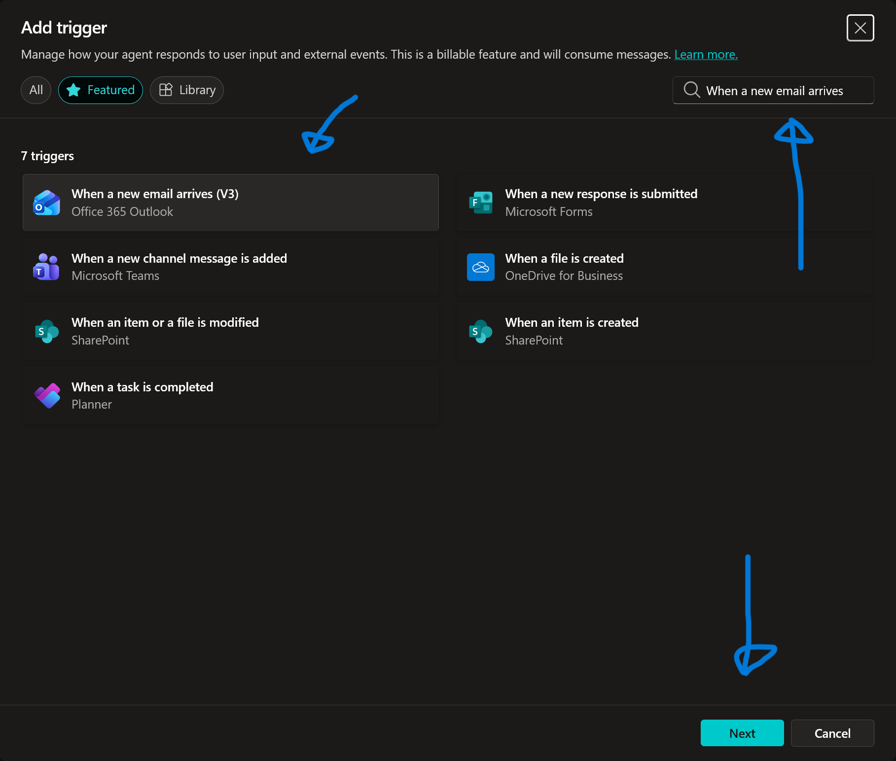

# 10. Multi-Agent Orchestration (Finalen)

Nu är vi framme vid finalen! Vi ska sluta cirkeln och visa hur agenter kan samarbeta.

Vi ska bygga ett scenario där:
1.  Din huvudagent tar emot ett viktigt mejl (Beställningen vi skapade tidigare).
2.  Istället för att hantera det själv, delegerar den uppgiften till en **"Specialist"** (en dedikerad del av agenten).
3.  Specialisten analyserar mejlet och skickar en notis i **Microsoft Teams**.

---

## 10.1 Skapa E-post-triggern (Lyssnaren)

Först måste agenten få "öron" så att den kan höra när beställningen kommer.

1.  Gå till fliken **Overview** och sektionen **Triggers**.
2.  Klicka **+ Add trigger**.

    

3.  Sök efter och välj: **When a new email arrives (V3)** (Office 365 Outlook).

    

4.  Klicka **Next** (kontrollera anslutningen).

5.  **Konfigurera Triggern:**
    Vi vill inte att agenten ska vakna av *alla* mejl, utan bara beställningarna.

    * **Folder:** Klicka på mapp-ikonen och välj **Inbox** (Inkorgen).

    

    * **Subject Filter:** Kopiera in exakt den ämnesrad vi använde i kapitel 8:
      ```text
      Typ av förfrågan: Ny enhet
      ```
      *(Detta fungerar som ett filter. Agenten vaknar bara om ämnesraden matchar detta).*

    * **Importance:** Låt vara (Any).

6.  **Instruktioner (Delegering):**
    Här sker magin. Vi säger åt agenten att inte göra jobbet själv, utan skicka det till specialisten.

    ```text
    Ett nytt beställningsmejl har inkommit: {Body}
    
    Delegera omedelbart denna information till 'IT Triage Specialist' för analys och rapportering till Teams.
    ```

7.  Klicka **Create trigger**.

    

---

## 10.2 Skapa Teams-verktyget

För att "Specialisten" ska kunna rapportera, måste vi ge den ett verktyg för att prata i Teams.

1.  Gå till **Topics** (eller Tools) -> **+ Add a tool**.
2.  Välj **Connector**.
3.  Sök efter **Microsoft Teams** och välj **Post message in a chat or channel**.
    *(Välj "Post message...", det är enklare än "Post card..." för denna övning).*

    

4.  Klicka **Next** (Add and configure).

5.  **Konfigurera verktyget:**
    * **Name:**
      ```text
      Notify IT Team in Teams
      ```
    * **Description:**
      ```text
      Sends a message to the IT specialist via Teams regarding a new order.
      ```

6.  **Konfigurera Inputs:**
    Klicka på **Edit** vid Inputs.

    * **Post as:** Välj **Flow bot**.
    * **Post in:** Välj **Chat with Flow bot**.
      *(Detta gör att meddelandet skickas direkt till dig själv i Teams chatten, vilket är säkrast i en workshop).*
    * **Recipient:** Välj **Enter custom value** och skriv in din egen mejladress.
    * **Message:**
      * Description: *"The content of the notification including device model and ordering user."*

    

7.  Klicka **Save**.

---

## 10.3 Skapa "Specialisten" (Child Agent Topic)

Nu ska vi skapa "Hjärnan" som triggern hänvisar till. I Copilot Studio skapar vi detta som en specifik **Topic** som agerar som en specialist-agent.

1.  Gå till fliken **Topics**.
2.  Klicka **+ Add a topic** -> **Create from description**.

    

3.  **Namnge Topicen:**
    ```text
    IT Triage Specialist
    ```
4.  **Beskrivning (Viktigt för orkestrering):**
    ```text
    This is a specialist agent that handles incoming device order emails. It analyzes the email body to extract the Model and User, and then posts a notification to Teams using the tool.
    ```
5.  Klicka **Create**.

6.  **Konfigurera Specialisten:**
    Du får nu ett tomt flöde (Trigger -> End). Vi ska lägga till logiken.

    * Klicka på **Edit** på *Trigger*-noden.
    * Se till att fraserna är tomma, men att beskrivningen (Description) under *Details* stämmer med texten ovan. Detta gör att AI:n hittar hit.

7.  **Lägg till Instruktioner (AI-noden):**
    Vi använder Generative AI för att lösa uppgiften.
    * Klicka på **+** under triggern.
    * Välj **Advanced** -> **Generative answers** (eller *Create generative response*).
    * *OBS: Om du inte hittar detta, kan du helt enkelt lita på "Orchestration". Men för att vara säkra lägger vi till Teams-verktyget här.*
    
    **Alternativ (Enklare metod):**
    Vi låter orkestreringen sköta allt!
    Eftersom vi döpte Topicen till "IT Triage Specialist" och gav den en bra beskrivning, samt har verktyget "Notify IT Team in Teams" tillgängligt, behöver vi faktiskt inte bygga noder manuellt!

    *Låt topicen bara vara som den är (Trigger -> End).*
    *Se bara till att **Generative Orchestration** är PÅ i Overview.*

    *(Om du vill vara säker: Lägg till noden "Call an action" -> "Notify IT Team in Teams" i flödet).*

---

## 10.4 The Grand Finale (Testa alltihop)

Nu ska vi se hela kedjan fungera.

1.  **Öppna Testpanelen:**
    * Gå till **Overview**.
    * Klicka på **Test trigger** bredvid din *Email Trigger* ("New Device Order Received").
    * Klicka **Start testing** (när den dyker upp).

    *Nu väntar agenten...*

2.  **Trigga processen (Beställ en dator):**
    För att slippa skicka ett mejl manuellt kan vi använda vår egen agent för att generera det!
    
    * **Öppna en NY flik** med Copilot Studio (eller använd Teams om du publicerat).
    * Starta en ny konversation.
    * Skriv: `Jag vill beställa en dator`.
    * Välj en dator och slutför beställningen.
    * **Vänta...** (Agenten skickar nu mejlet via flödet från kap 8).

3.  **Bevittna Magin:**
    Gå tillbaka till fliken där du har **Test Trigger** igång.

    1.  Först ser du att mejlet landar i din inkorg.
    2.  Någon minut senare ska Triggern i testpanelen vakna ("Triggered!").
    3.  Titta på **Activity Map**.
    4.  Du bör se att agenten:
        * Tar emot mejlet.
        * Läser instruktionen ("Delegera till Specialist").
        * Hoppar till topicen **IT Triage Specialist**.
        * Kallar på verktyget **Notify IT Team in Teams**.

4.  **Resultatet:**
    Det ska plinga till i din Teams-chatt (från Flow Bot):
    > "New order received..."

!!! success "MISSION ACCOMPLISHED"
    Du har nu byggt ett fullständigt ekosystem:
    
    1.  **Dialog:** Agenten hjälper användaren välja dator.
    2.  **Integration:** Agenten hämtar data från SharePoint.
    3.  **Automation:** Agenten skickar en beställning via mejl.
    4.  **Autonomi:** Agenten övervakar inkorgen dygnet runt.
    5.  **Samarbete:** Agenten delegerar arbete till en specialist som notifierar i Teams.

    **Bra jobbat! Du är nu en Copilot Studio Expert.**