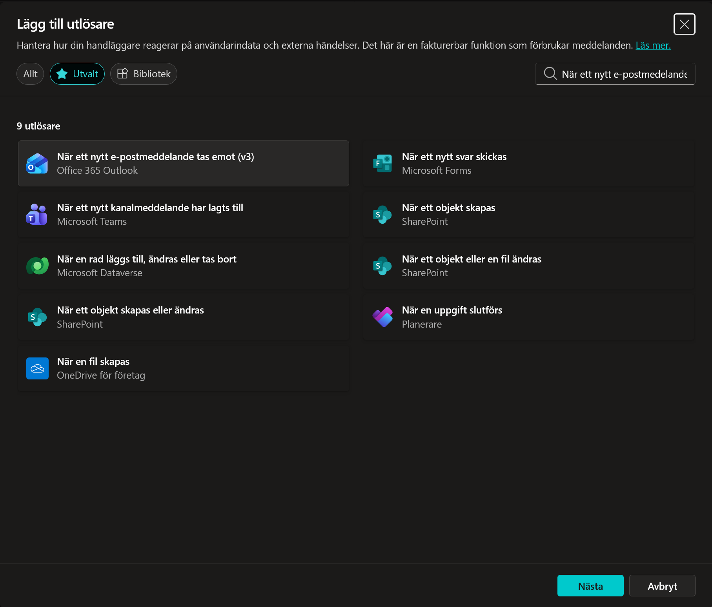
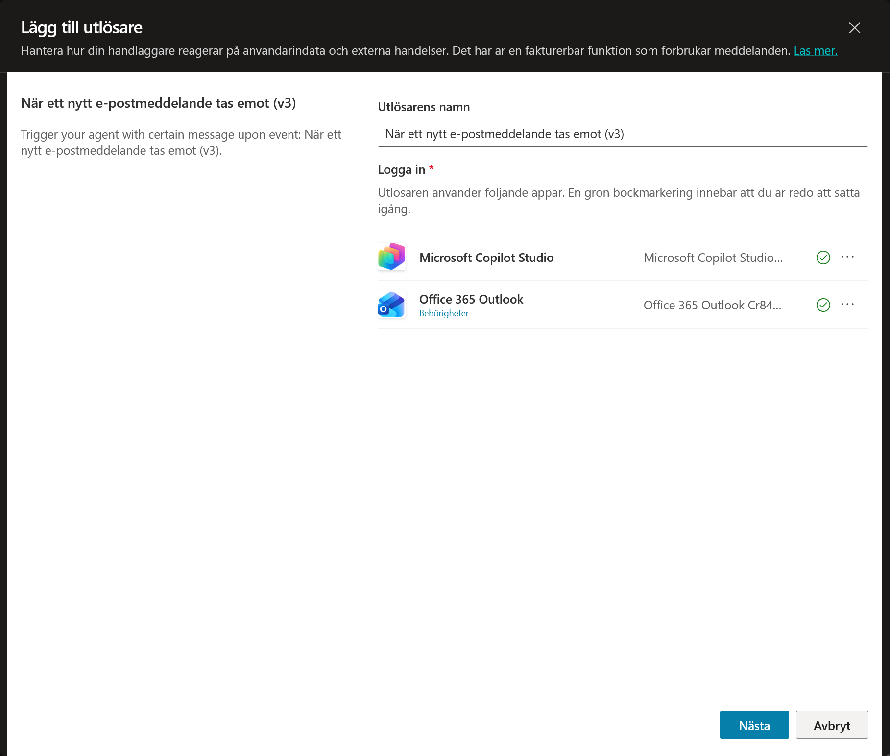
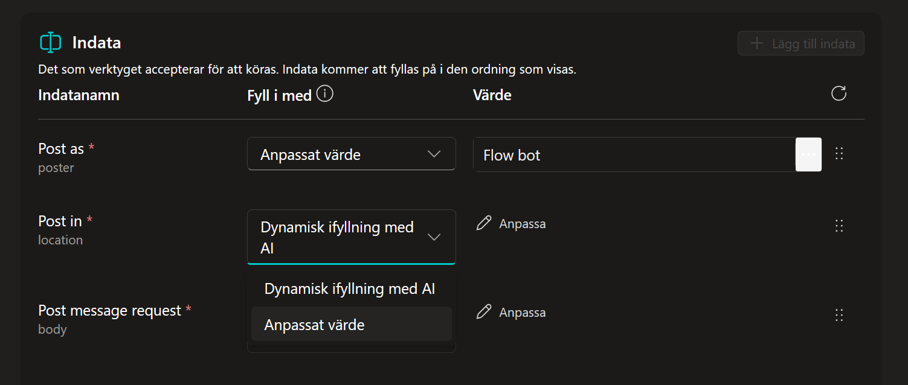
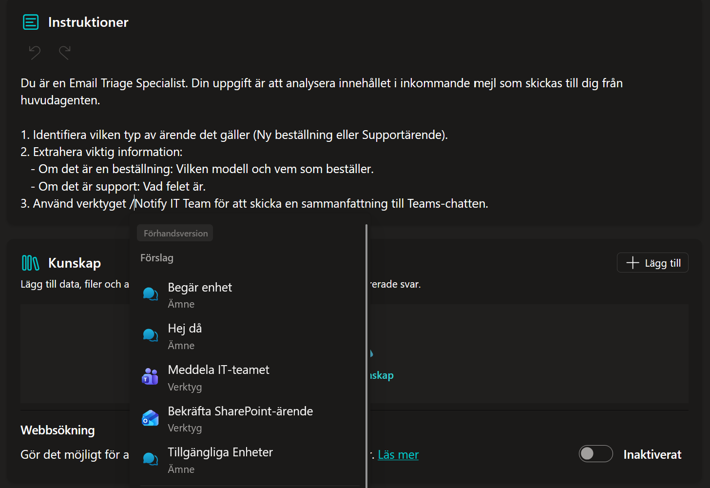
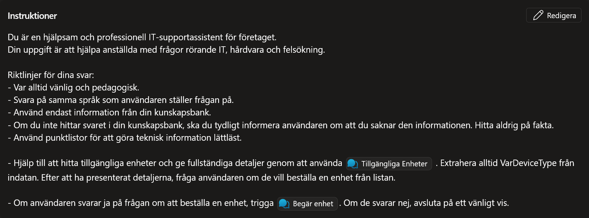
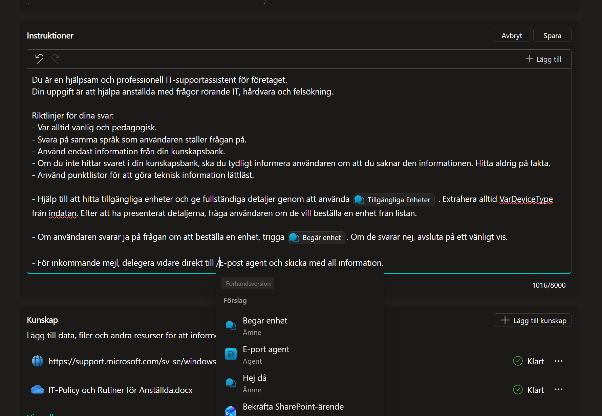
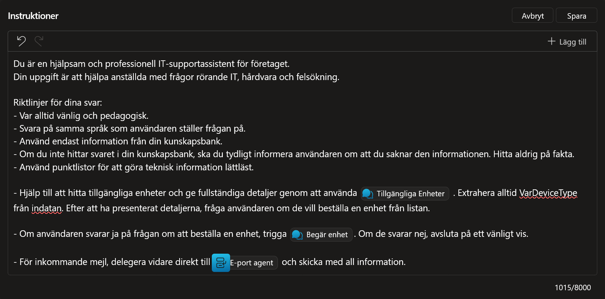

# 10. Multi-Agent Orchestration (Finalen)

Nu är vi framme vid finalen! Vi ska sluta cirkeln och visa hur agenter kan samarbeta.

Vi ska bygga ett scenario där:

1.  Din huvudagent tar emot ett viktigt mejl (beställningar och felanmälan).

2.  Istället för att hantera det själv delegerar den uppgiften till en *Specialist* (en dedikerad *Underordnad agent*).

3.  Specialisten analyserar mejlet och skickar en notis i Microsoft Teams.

---

## 10.1 Skapa e-post-triggern (Lyssnaren)

Först måste agenten få en ny utlösare som lyssnar på inkommande mejl.

1.  Gå till fliken **Översikt** och sektionen **Utlösare**.
2.  Klicka **+ Lägg till utlösare**.

    

3.  Sök efter och välj:
    ```text
    När ett nytt e-postmeddelande tas emot
    ```

4.  Klicka på **När ett nytt e-postmeddelande tas emot (V3)** och därefter på **Nästa**.

    

5.  Kontrollera att anslutningen är grön (Ansluten) och klicka på **Nästa**.

    

6.  **Konfigurera utlösaren:**
    Idealiskt sett vill man kanske inte att agenten ska vakna av alla olika mejl, men i denna labb vill vi se agentens förmåga att filtrera och plocka upp relevanta mejl utan fördefinierade filter. Tanken är att denna ska agera som företagets centrala IT support. Därför konfigurerar vi den på följande vis:

    * **Mapp:** Klicka på mapp-ikonen och välj **Inkorgen**.

    

    * **Vikt:** Låt resterande vara oförändrade och klicka på **Skapa utlösare**.

    

---

## 10.2 Skapa Teams-verktyget (Underordnad agent)

Nu vet vi att vår huvudagent lyssnar och tar emot inkommande mejl. För att göra huvudagenten smart och effektiv kommer vi delegera analysen av dessa mejl till en så kallad *Underordnad agent*.

1.  Stäng *Dags att testa din utlösare!* vilket leder tillbaka till agentens **Översikt**.

    

2.  Scrolla ner till **Agenter**-delen i **Översikt** och klicka på **+ Lägg till agent**.

    

3.  Rutan *Välj hur du vill utöka din agent* dyker upp.
    * Här ser vi alternativet **Skapa en underordnad agent**.
    * Notera: Eftersom vi i början gjorde en dedikerad *Lösning* ser vi att inga andra agenter är valbara, eftersom de tillhör en annan miljö.

    * Klicka på **Ny underordnad agent**.

    

    * **Namn:** Döp agenten till:
      ```text
      E-post agent
      ```

    * **När ska den här användas:** Låt vara som standard (dvs **Agenten väljer baserat på beskrivning**). Detta är viktigt för orkestreringen.

    * **Beskrivning:** Det här är avgörande. Det är denna text som huvudagenten läser för att förstå när den ska lämna över jobbet. Skriv:

    ```text
    Använd denna agent för att hantera och analysera inkommande e-postmeddelanden som rör beställningar eller supportärenden. Denna agent kan analysera innehållet och notifiera via Teams.
    ```

    * Klicka sedan på **Spara** uppe i högra hörnet.

    

---

## 10.3 Lägg till Teams-verktyg

För att agenten ska kunna utföra punkt 3 i sina instruktioner måste den ha ett verktyg.

1.  Gå till delen **Verktyg** inne i din underordnade agent och klicka på **+ Lägg till**.

    

2.  Sök efter:
    ```text
    Publicera ett meddelande i en chatt eller kanal
    ```
    

3.  Välj **Publicera ett meddelande i en chatt eller kanal** genom att klicka på den.

    

4.  Kontrollera anslutningen och klicka **Lägg till och konfigurera**.

    

5.  **Konfigurera verktyget:**
    * **Namn:**
      ```text
      Meddela IT-teamet
      ```
    * **Beskrivning:**
      ```text
      Skickar ett meddelande till IT-supportens Teams-chatt med information från mejlet.
      ```

    

6.  **Konfigurera indata:**
    Vi vill göra det enkelt och säkert att detta fungerar.

    1. Klicka på **Fyll i dynamiskt med AI** bredvid **Publicera som** och välj **Anpassat värde**.

    

    2. Klicka på **Välj ett alternativ** och välj **Flow bot**.

    

    3. Klicka på **Fyll i dynamiskt med AI** bredvid **Publicera i** och välj **Anpassat värde**.

    

    4. Klicka på **Välj ett alternativ** och välj **Chatta med Flow bot**.

    

    5. Notera att en ny indata dyker upp: **Mottagare**. Välj även här att klicka på **Fyll i dynamiskt med AI** och sedan **Anpassat värde**.

    

    6. Skriv in din e-postadress i fältet.

    

    7. För **Meddelande**, låt stå kvar på **Fyll i dynamiskt med AI** men välj att klicka på **Anpassa**.

    

    8. I rutan **Beskrivning** för Meddelande, skriv in följande:
       ```text
       En sammanfattning av e-postinnehållet inklusive syfte (Beställning/Support) och viktiga detaljer.
       ```
    

    9. Stäng panelen för Meddelande.

7.  Klicka **Spara**.

---

## 10.4 Konfigurera den underordnade agenten

Nu har vi skapat skalet för agenten samt ett verktyg. Nu ska vi ge den instruktioner så den förstår vem den är och vad den ska och kan göra.

1.  Klicka på **<- Meddela IT-teamet**.

    

2.  **Ge instruktioner:**
    Hitta rutan för **Instruktioner** och klicka i den.

    Klistra in följande instruktioner som talar om hur den ska bete sig:

    ```text
    Du är en Email Triage Specialist. Din uppgift är att analysera innehållet i inkommande mejl som skickas till dig från huvudagenten.

    1. Identifiera vilken typ av ärende det gäller (Ny beställning eller Supportärende).
    2. Extrahera viktig information:
       - Om det är en beställning: Vilken modell och vem som beställer.
       - Om det är support: Vad felet är.
    3. Använd verktyget /Meddela IT-teamet för att skicka en sammanfattning till Teams-chatten.
    ```

    * Ställ dig direkt efter ` /Meddela IT-teamet ` och välj **Meddela IT-teamet** verktyget genom att klicka på popupmenyn.

    

    * Klicka på **Spara**.

    

---

## 10.5 Uppdatera huvudagenten

Nu är all logik för den underordnade agenten klar. Vi ska nu uppdatera huvudagenten så att den förstår att den ska delegera jobbet.

1.  Navigera tillbaka till huvudagentens **Översikt**.

    

2.  Gå ner till **Instruktioner** och klicka på **Redigera**.

    

3.  Lägg till följande instruktioner i slutet:

    ```text
    - För inkommande mejl, delegera vidare direkt till /E-post agent och skicka med all information.
    ```

4.  Skapa länkningen (Viktigt):
    Texten du nyss klistrade in är bara vanlig text. Vi måste göra om namnet till en aktiv länk så att AI:n förstår att vi menar objektet.

    * Ställ dig precis bakom `/E-post agent` i texten du nyss skrev.
    * Klicka på **E-post agent** i popupmenyn.

    

5.  Klicka på **Spara**.

    

---

## 10.6 The Grand Finale (Testa alltihop)

Nu knyter vi ihop säcken. Vi ska simulera hela kedjan:
Beställning -> Mejl -> Utlösare -> Huvudagent -> Underordnad agent -> Teams.

1.  **Testa enhetsförfrågan**
    1. Klicka på **Testa** i högra hörnet om testpanelen inte redan är uppe.
    2. Om det redan ligger en chatt där, klicka på **Starta ny session**.
    3. Skriv:
       ```text
       Hej jag behöver en ny bärbar dator
       ```
    4. Välj **Standard (Office/Admin)** varianten.
    5. Skriv:
       ```text
       Ja, tack!
       ```
    6. Välj ett av alternativen, exempelvis **Surface Laptop 13**, men lämna rutan för ytterligare information tom.
    7. Klicka **Skicka**.
    8. Invänta svaret. Öppna därefter din inkorg för att se nästa *Enhetsförfrågan-mejlet*.

2.  **Testa felanmälan**
    1. Gå in i SharePoint.
    2. Klicka på **Lägg till nytt objekt**.
    3. Under **Ärende** skriv in:
       ```text
       Wi-Fi problem
       ```
    4. För **Ärendebeskrivning** skriv:
       ```text
       Kan inte logga in på Wi-Fi för tillfället.
       ```
    5. Sätt **Prioritet** till **High**.

3.  **Testa dina utlösare**
    1. Gå tillbaka till Copilot Studio och till **Översikt**.
    2. Klicka på **Testa utlösare** bredvid *När ett objekt skapas*.
    3. Välj den senaste posten och klicka **Starta testning**.
    4. Kolla din inkorg igen. Förhoppningsvis ligger nya *Ny supportbegäran*-mejlet där.

4.  **Testa den underordnade agenten**
    1. Gå tillbaka till **Översikt**.
    2. Klicka nu på **Testa utlösare** bredvid *När ett nytt e-postmeddelande tas emot (V3)*.
    3. Förhoppningsvis ser vi två valmöjliga poster nu. Den äldsta borde vara mejlet angående ny enhetsbegäran och den nyare borde vara gällande ny supportbegäran.
    4. Börja med att klicka på den äldsta och klicka **Starta testning**.
    5. Öppna Teams och se om du har ett nytt meddelande under **Chattar** från **Workflows**. Om du ser detta fungerar systemet end to end.
    6. Gå tillbaka till **Översikt** och klicka nu igen på **Testa utlösare** bredvid *När ett nytt e-postmeddelande tas emot (V3)*, men välj nu det senaste mejlet.
    7. Öppna Teams igen och se nu om du fått ett nytt meddelande i samma chatt men nu gällande nytt supportärende.

!!! success "MISSION COMPLETE"
    Grattis! Du har nu byggt en **Multi-Agent lösning** med:
    * **Autonomi:** Agenten lyssnar och agerar självständigt.
    * **Orkestrering:** Huvudagenten delegerar till specialister.
    * **Integration:** Hela flödet knyter ihop SharePoint, Outlook och Teams.
