# 0. Kursuppsättning

Innan vi börjar bygga agenten för **Lyserno** förbereder vi åtkomsten till Copilot Studio, skapar en personlig utvecklingsmiljö och lägger upp kursens datakälla i SharePoint.

När kapitlet är klart har du:

- tillgång till Copilot Studio för att bygga och testa agenten
- en egen utvecklingsmiljö med Dataverse
- SharePoint-webbplatsen **Lyserno Produktportal**
- SharePoint-listan **Centrallager** med kursens 25 produktvarianter

!!! important "Använd samma konto genom hela uppsättningen"
    Du behöver en e-postadress för **arbete eller skola**. Personliga konton som `@outlook.com` och `@gmail.com` stöds inte för registreringen. Använd samma Microsoft 365-konto i Copilot Studio, Power Apps och SharePoint.

    Om din organisation har stängt av självbetjäningsregistrering behöver du hjälp av organisationens Microsoft 365- eller Power Platform-administratör.

---

## Del 1: Aktivera Copilot Studio

Om du redan har åtkomst till Copilot Studio kan du gå vidare till [Del 2: Skapa en utvecklingsmiljö](#del-2-skapa-en-utvecklingsmiljo).

### 1. Starta registreringen

1. Öppna [Microsoft Copilot Studio](https://www.microsoft.com/sv-se/microsoft-365-copilot/microsoft-copilot-studio?market=se) i en ny flik.
2. Välj **Prova kostnadsfritt**.

### 2. Ange ditt konto

1. Skriv in din e-postadress för arbete eller skola.
2. Välj **Nästa**.

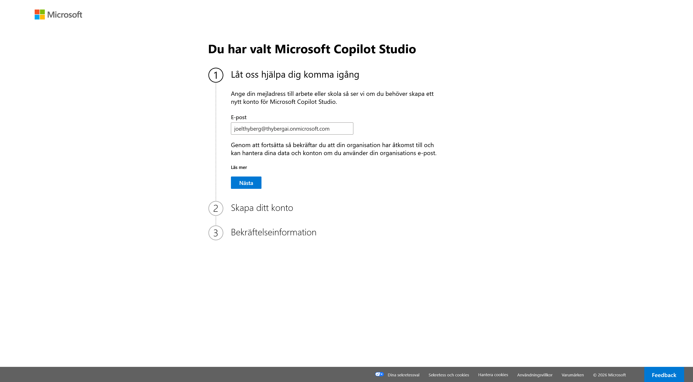

Microsoft kontrollerar nu om adressen redan tillhör ett befintligt Microsoft-konto.

### 3. Logga in eller starta utvärderingen

- Om kontot redan finns väljer du **Logga in** och genomför den vanliga inloggningen.
- Om kontot ännu inte har Copilot Studio följer du registreringsflödet och startar en ny utvärderingsversion.

I det sista steget kan du behöva välja land eller region. Kontrollera uppgifterna och välj sedan **Start free trial** eller motsvarande svensk knapp.

!!! info "Om utvärderingsversionen"
    Utvärderingsversionen gäller inledningsvis i 30 dagar. När perioden löper ut kan den förlängas med ytterligare 30 dagar, och Microsoft anger att agenten kan fortsätta fungera i upp till 90 dagar efter att utvärderingen löpt ut.

    Licensen låter dig **bygga och testa** agenten i testchatten, vilket är allt vi behöver under kursen. Den tillåter däremot inte publicering. Publiceringsbehörighet behandlas därför som ett valfritt moment i slutet av utbildningen. Läs mer i [Microsofts aktuella information om åtkomst och utvärderingslicenser](https://learn.microsoft.com/sv-se/microsoft-copilot-studio/requirements-licensing-subscriptions).

---

## Del 2: Skapa en utvecklingsmiljö

Power Apps Developer Plan ger dig en kostnadsfri personlig miljö för utveckling och test. Vi använder den miljön när vi senare bygger agenten, verktygen och arbetsflödet.

### 1. Registrera Developer Plan

1. Öppna [Power Apps Developer Plan](https://www.microsoft.com/sv-se/power-platform/products/power-apps/free) i en ny flik.
2. Välj **Börja använda kostnadsfritt**.

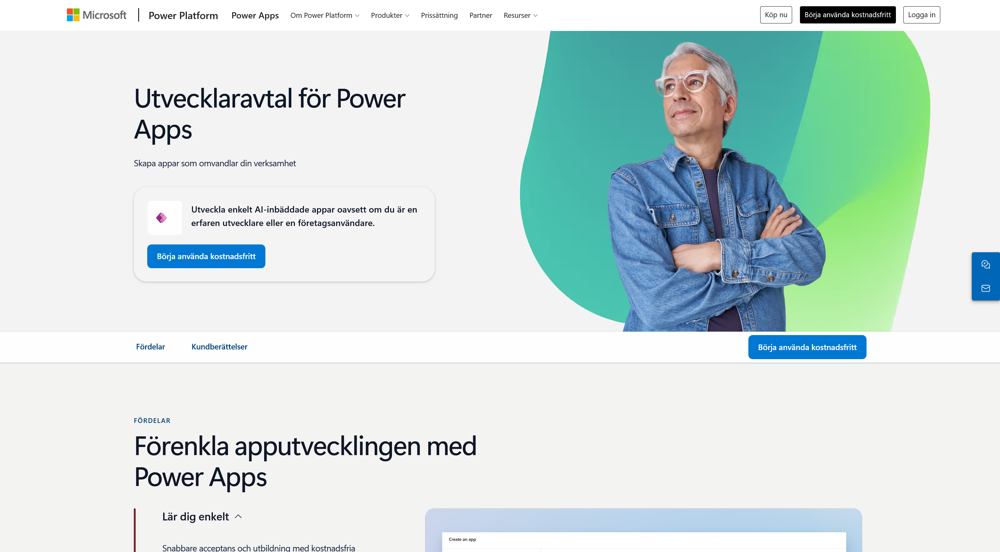

3. Skriv in samma e-postadress som du använde för Copilot Studio.
4. Markera rutan för att godkänna informationen och avtalen.
5. När knappen aktiveras väljer du **Börja kostnadsfritt**.

När registreringen är klar skickas du vidare till Power Apps.

### 2. Kontrollera miljön

Den nya miljön får normalt ett namn baserat på ditt användarnamn, exempelvis **Miljö för Joel Thyberg**. Om en miljö med samma namn redan finns kan den nya få ett tillägg som `(1)`.

1. Välj miljöväljaren uppe i det högra hörnet.
2. Leta efter din nya miljö under **Skapa appar med Dataverse** eller **Andra miljöer**.
3. Välj miljön så att en bock visas bredvid namnet.

!!! warning "Miljön kan behöva några minuter"
    Det tar olika lång tid innan miljön skapas och visas. Uppdatera sidan om den saknas. I vissa klientorganisationer kan det ta upp till ungefär 10 minuter.

    Utvecklingsmiljön kan visas under både **Skapa appar med Dataverse** och **Andra miljöer**. Utgå därför från miljöns namn och välj din personliga utvecklingsmiljö, inte organisationens standardmiljö. Microsoft beskriver samma namn- och väntelogik i [guiden för Power Apps Developer Plan](https://learn.microsoft.com/en-us/power-platform/developer/create-developer-environment).

---

## Del 3: Skapa Lyserno Produktportal

Nu skapar vi kursens SharePoint-webbplats. Den blir den gemensamma platsen för den dynamiska information som agenten ska kunna hämta senare.

### 1. Öppna SharePoint

1. Välj appstartaren med de nio punkterna uppe till vänster i Power Apps.
2. Välj **SharePoint**.

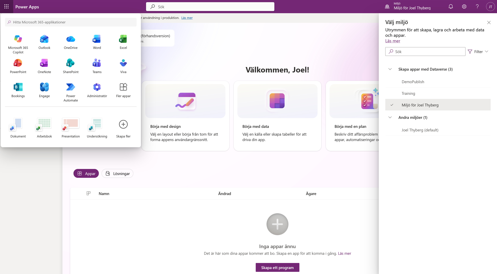

3. När SharePoint har öppnats väljer du **Version** i vänsternavigeringen.

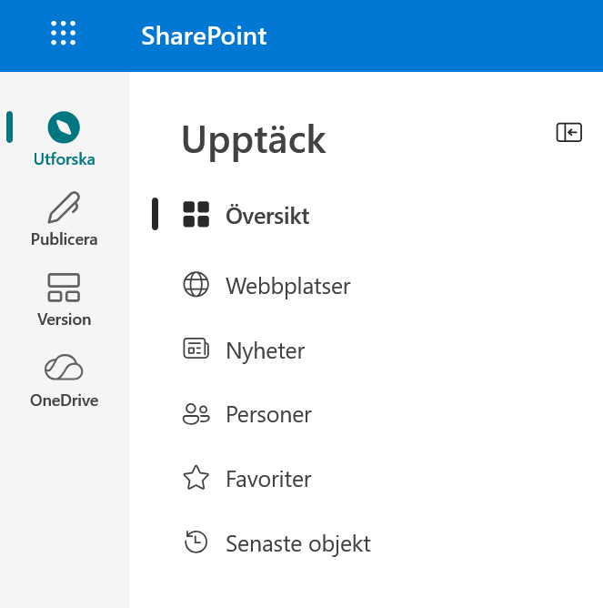

4. På sidan som öppnas väljer du **Webbplats**.

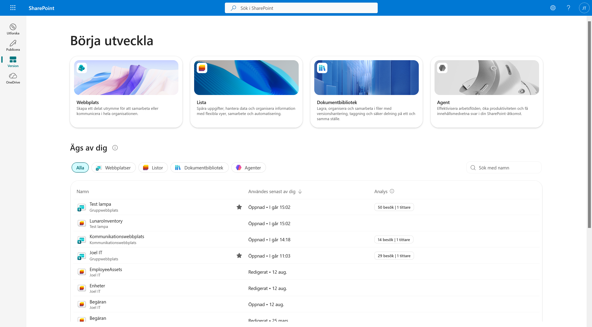

### 2. Välj webbplatsmall

1. Kontrollera att **Gruppwebbplats** är vald. En gruppwebbplats passar vårt interna kursscenario bättre än en kommunikationswebbplats.
2. Välj mallen **Butikshanteringsteam**.

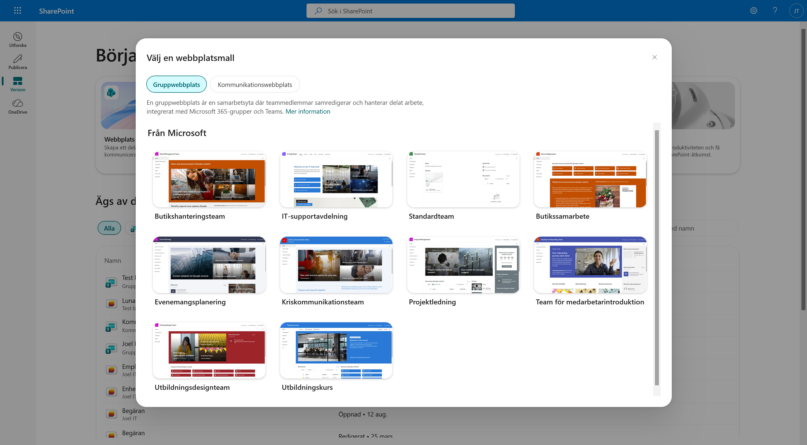

3. Kontrollera förhandsgranskningen och välj **Använd mall** nere till höger.

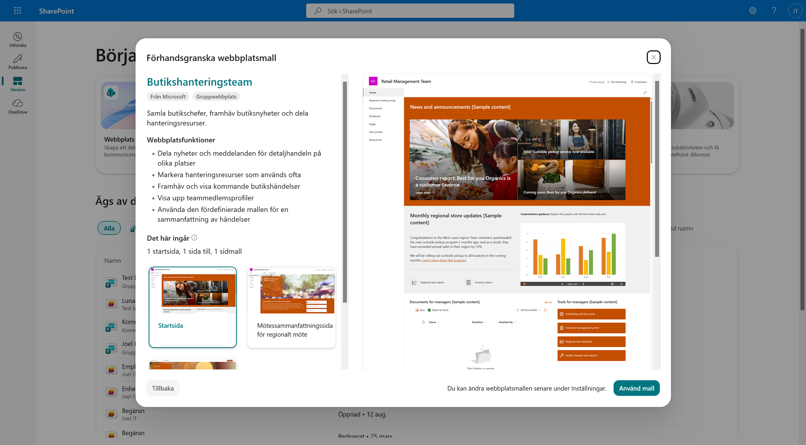

### 3. Konfigurera webbplatsen

Fyll i eller kontrollera följande uppgifter:

Använd exakt följande webbplatsnamn:

  <code>Lyserno Produktportal</code>
  <button type="button" class="copy-field__button" data-copy-value="Lyserno Produktportal">Kopiera</button>

| Fält | Värde |
| --- | --- |
| Webbplatsnamn | `Lyserno Produktportal` |
| Webbplatsbeskrivning | Lämnas tom |
| Gruppens e-postadress | Skapas automatiskt |
| Webbplatsadress | Skapas automatiskt och lämnas oförändrad |
| Sekretess | `Privat - endast godkända medlemmar har åtkomst till webbplatsen` |
| Språk | `Svenska` |

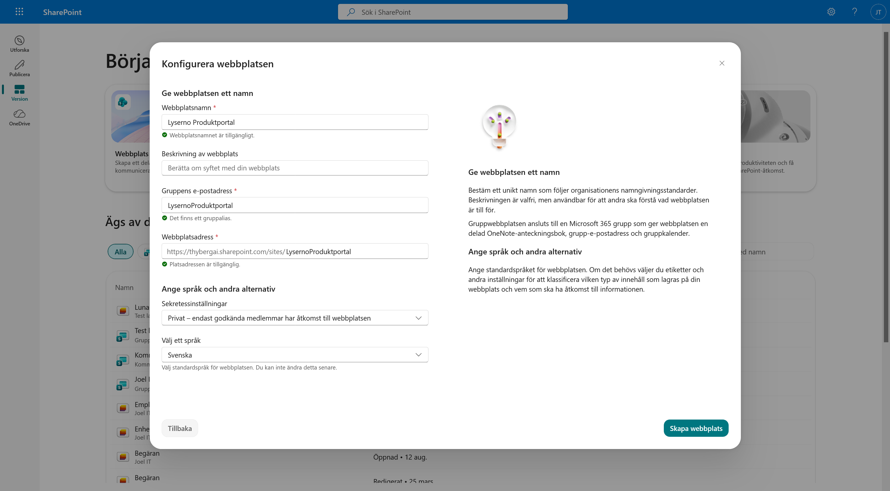

!!! important "Kontrollera språk och sekretess innan du skapar webbplatsen"
    **Privat** är normalt förvalt. Om något annat visas öppnar du listan och väljer alternativet där endast godkända medlemmar har åtkomst.

    Välj **Svenska** även om ett annat språk är förvalt. Språkvalet påverkar webbplatsens standardfält och gränssnitt och kan inte ändras lika enkelt i efterhand.

Välj **Skapa webbplats** nere till höger.

### 4. Vänta tills webbplatsen är klar

SharePoint tillämpar nu mallen. Under tiden kan du lägga till de kollegor som ska dela webbplatsen. Vid en gemensam utbildning inom samma organisation kan en deltagare skapa webbplatsen och bjuda in övriga, så behöver inte alla skapa varsin. Om varje deltagare arbetar separat kan ni hoppa över detta steg.

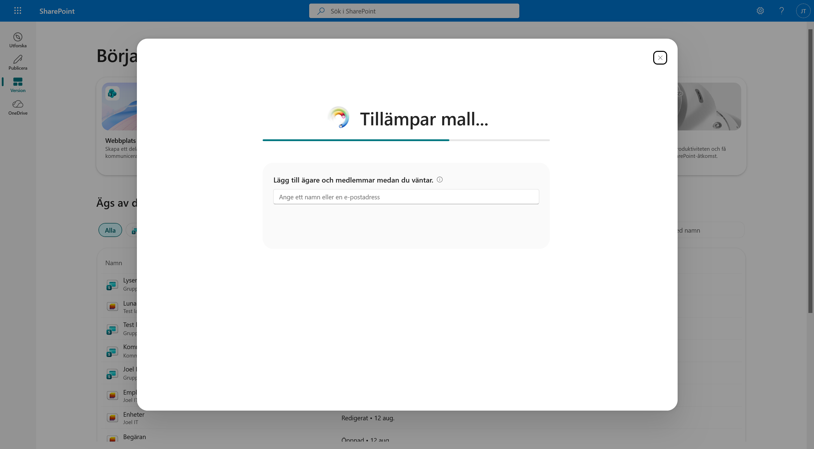

När meddelandet **Din webbplats är klar** visas väljer du **Gå till webbplatsen**.

---

## Del 4: Importera listan Centrallager

Listan innehåller aktuell affärsdata som pris, lagersaldo, reservationer, inkommande antal och nästa påfyllnadsdatum. Produktens stabila specifikationer kommer senare från PDF-katalogen.

När webbplatsen öppnas ser du startsidan för **Lyserno Produktportal**. Härifrån skapar vi nu kursens lista.

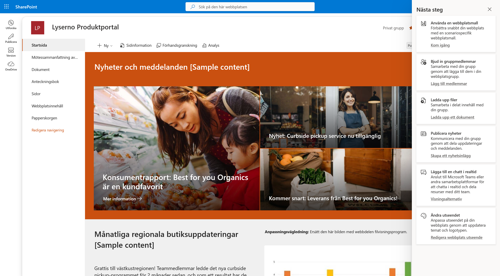

### 1. Skapa en lista från Excel

1. På webbplatsens startsida väljer du **+ Ny**.

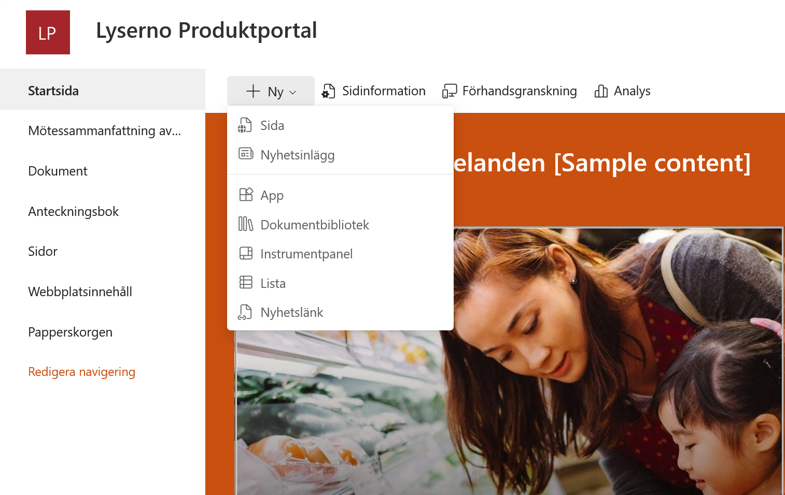

2. Välj **Lista** i menyn.
3. Under **Importera från** väljer du **Excel**.

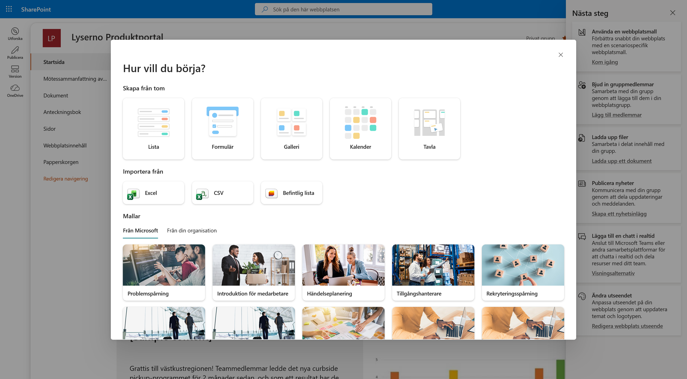

### 2. Ladda ner och välj kursfilen

Ladda först ner den färdiga arbetsboken och spara den på en plats du enkelt hittar:

<a class="button button--primary button--download" href="../../../downloads/nextgen/Centrallager.xlsx" download>Ladda ner Centrallager.xlsx</a>

Filen innehåller 25 produktvarianter och en intern Excel-tabell som redan heter **Centrallager**.

1. Välj **Ladda upp fil** och leta upp `Centrallager.xlsx`.
2. Om du i stället drar filen till uppladdningsytan markerar du den och väljer **Nästa** nere till höger.
3. Kontrollera att tabellen **Centrallager** är vald när förhandsgranskningen visas.

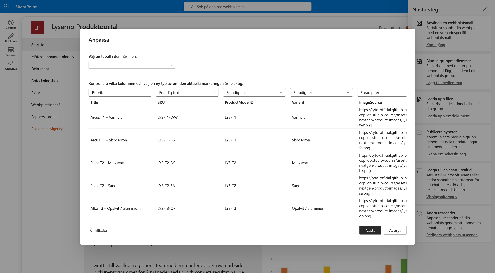

### 3. Anpassa kolumntyperna

SharePoint tolkar flera kolumner som enradig text. Ändra endast följande fem kolumner:

| Kolumn | Ändra till |
| --- | --- |
| `Variant` | **Val** |
| `CurrentUnitPrice` | **Valuta** |
| `NextRestockDate` | **Datum och tid** |
| `SalesStatus` | **Val** |
| `ReplenishmentCode` | **Val** |

#### Variant

Öppna typväljaren för `Variant` och välj **Val**.

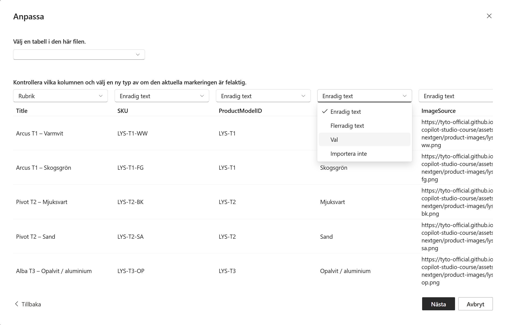

#### CurrentUnitPrice

Scrolla åt höger, öppna typväljaren för `CurrentUnitPrice` och välj **Valuta**.

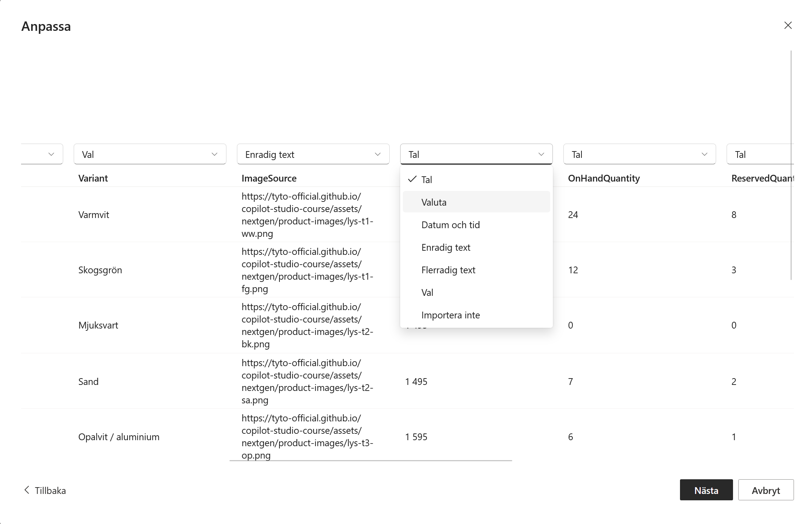

#### NextRestockDate

Fortsätt åt höger och ändra `NextRestockDate` till **Datum och tid**.

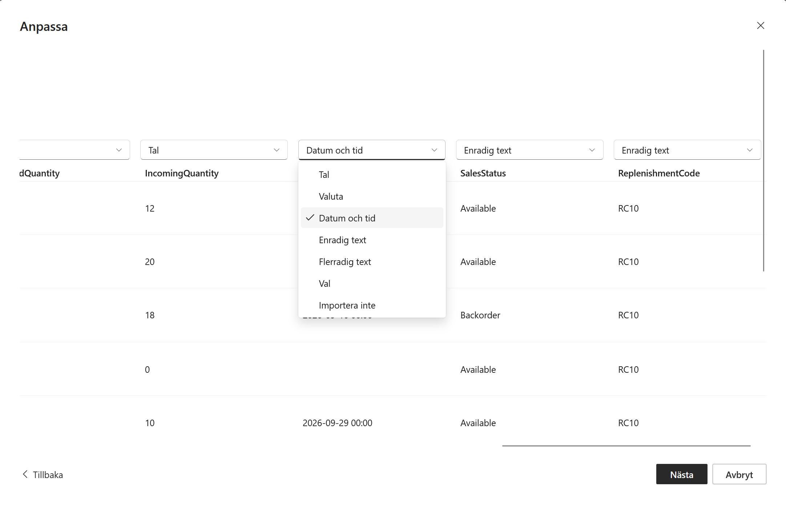

#### SalesStatus

Ändra `SalesStatus` till **Val**.

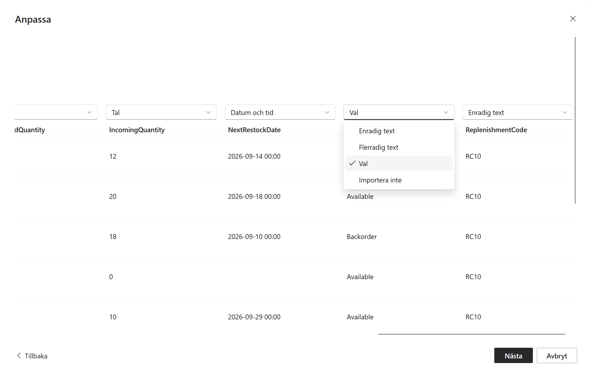

#### ReplenishmentCode

Ändra slutligen `ReplenishmentCode` till **Val** och välj därefter **Nästa**.

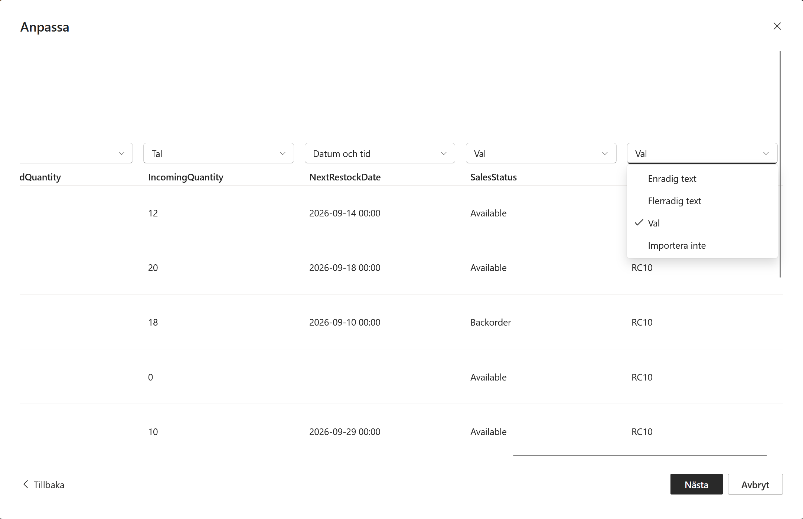

### 4. Skapa listan

Namnet ska redan vara hämtat från Excel-tabellen. Kontrollera att det står exakt:

`Centrallager`

Välj sedan **Skapa** nere till höger.

### 5. Kontrollera resultatet

När listan öppnas ska du se 25 rader och bland annat följande kolumner:

- `SKU` och `ProductModelID`
- `Variant` och `ImageSource`
- `CurrentUnitPrice`
- `OnHandQuantity`, `ReservedQuantity` och `IncomingQuantity`
- `NextRestockDate`
- `SalesStatus`
- `ReplenishmentCode`

### 6. Ställ in svenska kronor

`CurrentUnitPrice` är nu en valutakolumn, men SharePoint kan till en början visa priserna i dollar. Ändra därför kolumnens valutaformat till svenska kronor.

1. Välj kolumnrubriken **CurrentUnitPrice**.
2. Välj **Kolumninställningar** och sedan **Redigera**.

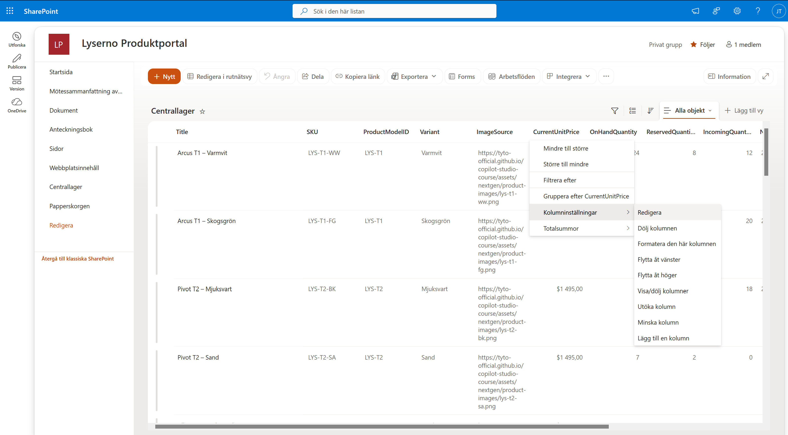

3. I panelen **Redigera kolumn** öppnar du listan under **Valutaformat**.

4. Scrolla i listan och välj **123 456,00 kr (Sweden)**.

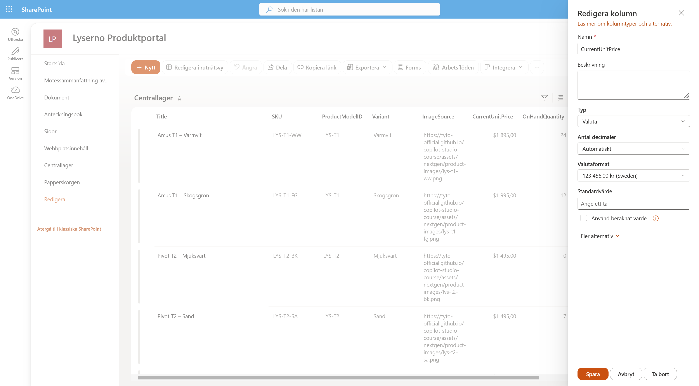

5. Kontrollera att svenska kronor visas under **Valutaformat** och välj **Spara** längst ner i panelen.

Priserna i `CurrentUnitPrice` visas nu i svenska kronor.

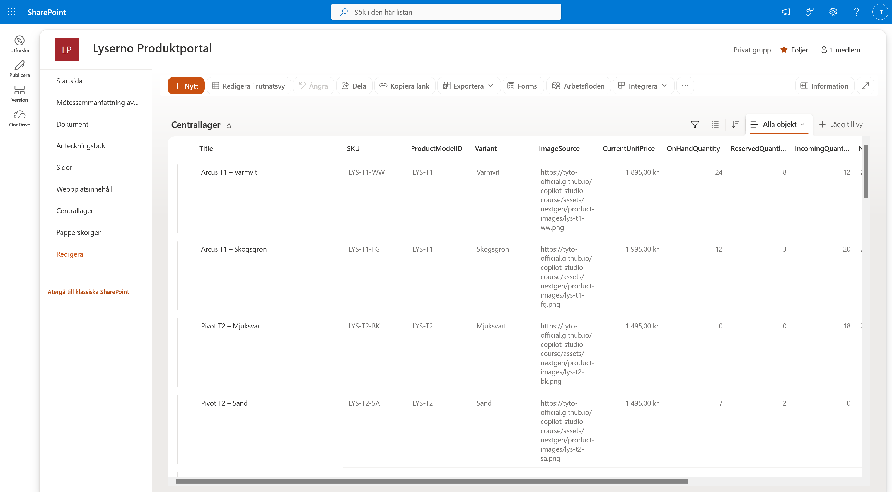

!!! success "Kursmiljön är klar"
    Du har nu tillgång till Copilot Studio, rätt utvecklingsmiljö, SharePoint-webbplatsen **Lyserno Produktportal** och listan **Centrallager**. Fortsätt till [nästa kapitel](01-navigate-new-experience.md) för att hitta rätt i den nya agentupplevelsen.
