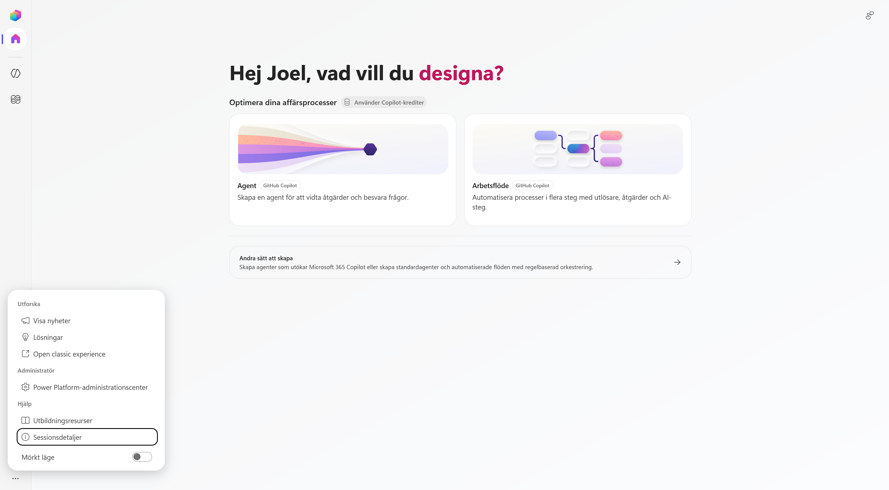

# 1. Hitta rätt i nya Copilot Studio

I det här kapitlet placerar vi Copilot Studio i Microsofts AI-ekosystem och går sedan igenom den nya byggupplevelsen. Du får se var agenter och arbetsflöden finns, hur du väljer mellan de nya och etablerade byggsätten och var du byter miljö.

När kapitlet är klart kan du:

- förklara vilken roll Copilot Studio har bland Microsofts AI-verktyg
- hitta befintliga agenter och se vilken harness de använder
- hitta befintliga arbetsflöden och skilja mellan de två sätten att skapa nya
- öppna byggytan för en standardagent
- kontrollera att du arbetar i rätt miljö

!!! note "Teorin bakom agenten"
    Den generella teorin om språkmodeller, RAG, harnesses och orkestrering behandlas i kursens teoripass. Här fokuserar vi på hur begreppen syns i **Microsoft Copilot Studio**.

---

## Del 1: Copilot Studios plats i Microsofts AI-ekosystem

Microsoft har flera verktyg för att använda och bygga med AI. Copilot Studio ligger mellan enkel agentbyggnation i Microsoft 365 och koddriven utveckling i Microsoft Foundry.

> **Använd Microsoft 365 Copilot → bygg enkelt i Agent Builder → automatisera i Copilot Studio → utveckla fritt i Microsoft Foundry**

| | **Agent Builder** | **Microsoft Copilot Studio** | **Microsoft Foundry** |
| --- | --- | --- | --- |
| **Byggsätt** | No-code i Microsoft 365 Copilot | Low-code med möjlighet att komplettera med kod | Pro-code och koddriven arkitektur |
| **Passar för** | En avgränsad agent över Microsoft 365-innehåll | Verksamhetsagenter och arbetsflöden med kunskap, handlingar och integrationer | Egna AI-applikationer, modeller, infrastruktur och avancerad orkestrering |
| **Räckvidd** | Dig eller ett team i Microsoft 365 | En avdelning, en organisation eller externa användare | Egna produkter och applikationer |
| **Styrning** | Microsoft 365 | Power Platform med miljöer, lösningar och ALM | Azure med RBAC, nätverk och policyer |

Copilot Studio passar när agenten behöver arbeta med flera kunskapskällor, använda connectors eller MCP, starta arbetsflöden eller publiceras i flera kanaler. Microsoft Foundry passar bättre när lösningen kräver full kontroll över kod, modeller och Azure-infrastruktur.

!!! tip "Välj den enklaste byggytan som räcker"
    Börja med verksamhetsbehovet. Välj sedan verktyget som klarar kunskapen, handlingarna, räckvidden och styrningen som lösningen kräver. Läs mer om [Agent Builder i Microsoft 365 Copilot](https://learn.microsoft.com/en-us/microsoft-365/copilot/extensibility/agent-builder) och [Microsoft Foundry](https://learn.microsoft.com/en-us/azure/foundry/what-is-foundry).

---

## Del 2: Öppna den nya Copilot Studio-upplevelsen

Öppna Copilot Studio med samma konto som du använde i kursuppsättningen:

<p><a class="button button--primary" href="https://copilotstudio.microsoft.com/" target="_blank" rel="noopener">Öppna Microsoft Copilot Studio</a></p>

Om du först kommer till standardupplevelsen visas normalt en informationsruta om den nya Copilot Studio-upplevelsen. Välj i så fall **Testa nu**. Om den nya startsidan öppnas direkt behöver du inte göra något.

På startsidan finns två huvudval:

- **Agent** skapar en agent som kan besvara frågor och vidta åtgärder.
- **Arbetsflöde** automatiserar en process med utlösare, åtgärder och AI-steg.

Båda korten är märkta **GitHub Copilot**. Längre ner finns **Andra sätt att skapa**, som vi återkommer till senare i kapitlet.


!!! note "Den nya byggytan stöder flera typer av agenter"
    Att du använder den nya Copilot Studio-vyn betyder inte att varje agent måste använda GitHub Copilot-harnessen. Du kan även skapa en standardagent från samma vy.

---

## Del 3: Hitta befintliga agenter

Välj **Agenter** i vänsternavigeringen.

Här visas de agenter som finns i den valda miljön. Listan kan vara tom om ingen agent har skapats ännu.

Kolumnen **Levereras av** visar vilken harness agenten använder:

- **Standard** för en standardagent
- **GitHub Copilot** för en agent som använder GitHub Copilot-harnessen


Vi skapar inte Lyserno-agenten här. Syftet är att hitta listan och förstå hur de två agenttyperna skiljs åt i gränssnittet.

---

## Del 4: Hitta befintliga arbetsflöden

Välj **Arbetsflöden** i vänsternavigeringen.

Här visas arbetsflödena i den valda miljön. Du kan bland annat se status, ägare, senaste ändring och om ett flöde är aktiverat.


Öppna pilen bredvid **Nytt arbetsflöde**. Menyn visar två alternativ:

| Val | Användning |
| --- | --- |
| **Arbetsflöde** | Den nya arbetsflödesupplevelsen med utlösare, åtgärder och AI-steg. |
| **Agentflöden** | Arbetsflöden för standardagenter med agentflödeslicensiering. |


!!! note "Skapa inget arbetsflöde ännu"
    Här använder vi menyn för att se vilka byggsätt som finns. Vi skapar Lysernos arbetsflöde senare i kursen.

---

## Del 5: Skapa en standardagent från den nya vyn

Gå tillbaka till **Startsida**. Om vänsternavigeringen är infälld kan du öppna den med menyknappen högst upp.


Välj **Andra sätt att skapa**. Här finns ytterligare två val:

- **Agent – Standard** skapar en regelbaserad konversationsagent med fördefinierade ämnen och flöden.
- **Agentflöden** öppnar det etablerade byggsättet för agenter och automatiserade flöden med regelbaserad orkestrering.


Den nya Copilot Studio-vyn är alltså en gemensam ingång till flera byggsätt. Vyn avgör inte ensam vilken harness agenten använder. Det valet görs när du väljer vad du ska skapa.

---

## Del 6: Agent eller arbetsflöde?

Agenter och arbetsflöden visas sida vid sida eftersom de passar för olika delar av en verksamhetsprocess.

| **Agent** | **Arbetsflöde** |
| --- | --- |
| Får ett mål och avgör vägen under arbetets gång | Får en utlösare och följer en process som har definierats i förväg |
| Passar när nästa steg beror på frågan eller resultatet från ett tidigare steg | Passar när samma kontroller och åtgärder ska genomföras på samma sätt varje gång |
| Hanterar tvetydighet, följdfrågor och val mellan flera förmågor | Hanterar kontroller, uppdateringar, utskick och andra repeterbara åtgärder |

Ett arbetsflöde kan innehålla AI-steg, men ordningen och processens yttre struktur är fortfarande bestämd i förväg.

!!! example "Så kombinerar vi dem i Lyserno"
    **Agenten** tolkar produktförfrågan, använder katalogen och lagret, ställer följdfrågor och avgör när underlaget är komplett.

    **Arbetsflödet** tar emot det bekräftade underlaget, genomför bestämda kontroller, uppdaterar lagret när villkoren är uppfyllda och skickar mejl.

---

## Del 7: Kontrollera utvecklingsmiljön

Miljön avgör var agenter, arbetsflöden, anslutningar och data skapas. Kontrollera därför miljön innan du börjar bygga.

1. Välj jordgloben längst ner i vänsternavigeringen.
2. Kontrollera vilken miljö som visas under **Aktuell miljö**.
3. Välj kursens utvecklingsmiljö. I kursuppsättningen skapade du en miljö med ett namn som exempelvis **Miljö för Joel Thyberg**.
4. Vänta tills Copilot Studio har laddat om.

Miljöväljaren visar även fästa miljöer, övriga tillgängliga miljöer och respektive miljötyp.


!!! warning "Välj din miljö – inte miljön i bilden"
    Bilden visar exempelmiljöer. Under kursen ska du välja den personliga utvecklingsmiljö som du skapade i kursuppsättningen.

---

## Del 8: Hitta fler funktioner

Välj de tre punkterna längst ner i vänsternavigeringen.



Menyn innehåller bland annat:

| Val | Funktion |
| --- | --- |
| **Visa nyheter** | Visar nya och ändrade funktioner i Copilot Studio. |
| **Lösningar** | Öppnar lösningsutforskaren där komponenter kan samlas och hanteras. |
| **Open classic experience** | Öppnar den klassiska Copilot Studio-upplevelsen. |
| **Power Platform-administrationscenter** | Öppnar administrationsytan för miljöer, kapacitet, säkerhet och styrning. |
| **Utbildningsresurser** | Öppnar Microsofts utbildningsmaterial. |
| **Sessionsdetaljer** | Visar teknisk information som kan användas vid felsökning. |
| **Mörkt läge** | Byter gränssnittets färgläge. |

I nästa kapitel öppnar vi **Lösningar** och skapar lösningen som ska samla Lyserno-agenten och dess komponenter.

En miljö och en lösning är inte samma sak:

```text
Tenant
└── Miljö                         VAR vi bygger
    └── Lösning                   VAD som hör ihop
        ├── Agent
        ├── Arbetsflöde
        └── Övriga komponenter
```

Miljön separerar resurser, data, användare, säkerhet och anslutningar. Lösningen finns i miljön och samlar komponenterna som hör till samma implementation.

> **Miljö = var agenten finns. Lösning = vad som hör ihop.**

!!! success "Du är redo att börja bygga"
    Du har nu hittat agenter, arbetsflöden, de olika byggsätten och miljöväljaren. Fortsätt till [nästa kapitel](02-create-solution.md), där vi skapar lösningen för Lyserno.

## Vidare läsning

- [Agent Builder i Microsoft 365 Copilot](https://learn.microsoft.com/en-us/microsoft-365/copilot/extensibility/agent-builder)
- [Vad är Microsoft Foundry?](https://learn.microsoft.com/en-us/azure/foundry/what-is-foundry)
- [Välj en harness i Copilot Studio](https://learn.microsoft.com/sv-se/microsoft-copilot-studio/harnesses-overview)
- [Standard jämfört med ny agentupplevelse](https://learn.microsoft.com/en-us/microsoft-copilot-studio/agents-experience/classic-vs-new)
- [Microsofts Agent Design Canvas](https://learn.microsoft.com/sv-se/microsoft-copilot-studio/guidance/agent-design-canvas-framework)
- [Nya Copilot Studio: byggblock, kostnad och skillnader](https://tyto.se/sv/insikter/kunskap/nya-copilot-studio)
