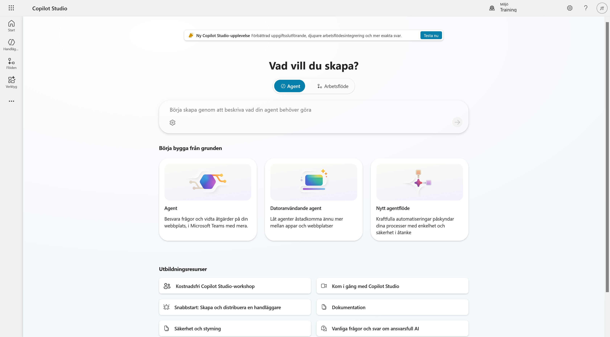
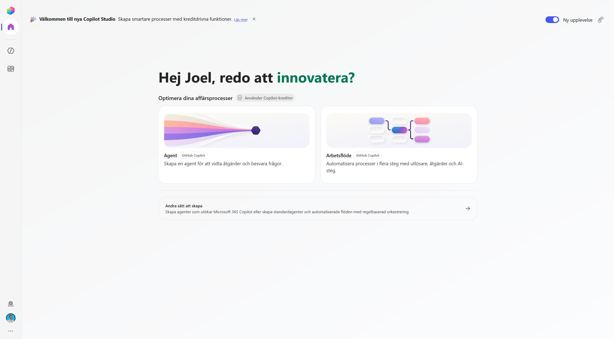
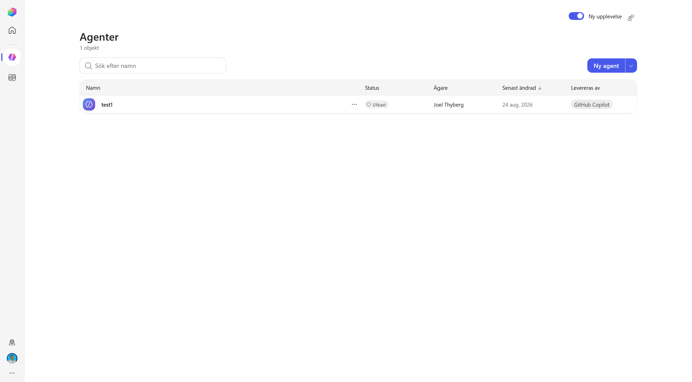
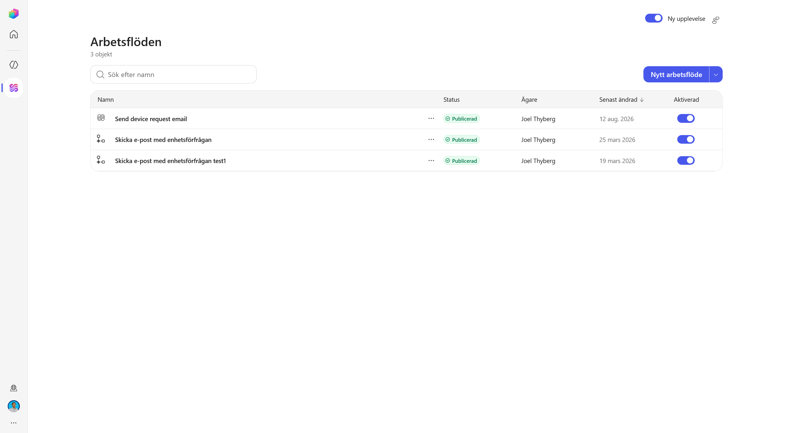
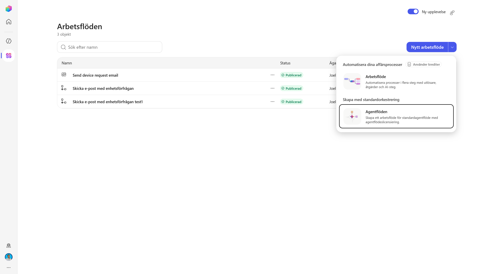
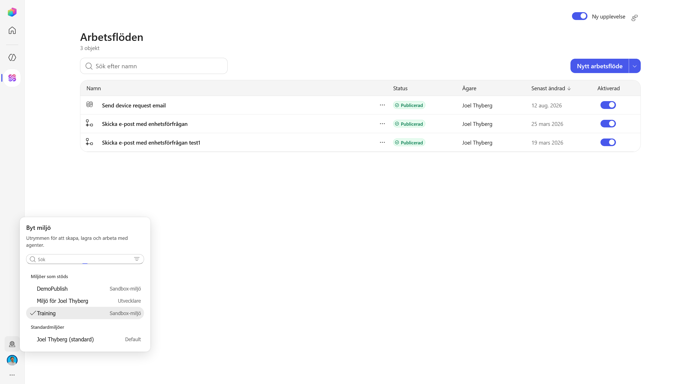
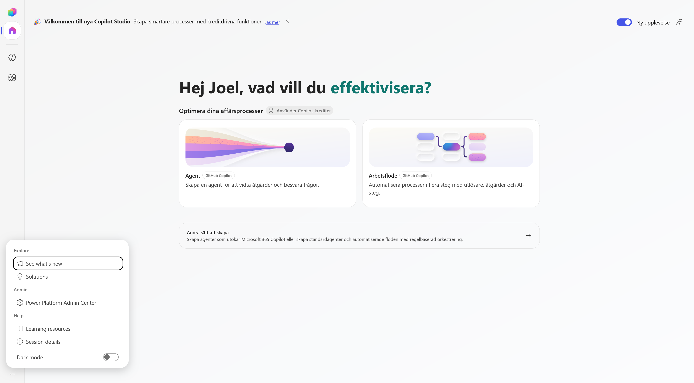

# 1. Hitta rätt i nya Copilot Studio

I det här kapitlet placerar vi först Copilot Studio i Microsofts AI-ekosystem. Därefter öppnar vi den nya upplevelsen och använder gränssnittet för att göra tre viktiga val begripliga: **harness**, **agent eller arbetsflöde** och **miljö eller lösning**.

När kapitlet är klart kan du:

- förklara vilken roll Copilot Studio har bland Microsofts AI-verktyg
- skilja den nya agentupplevelsen från standardupplevelsen
- avgöra när en agent respektive ett arbetsflöde passar
- hitta agenter, arbetsflöden, miljöväljaren och Solutions
- kontrollera att du arbetar i kursens utvecklingsmiljö

!!! note "Teorin bakom agenten"
    Den generella teorin om språkmodeller, RAG, harnesses och orkestrering behandlas i kursens teoripass. Här fokuserar vi på hur begreppen blir konkreta i **Microsoft Copilot Studio**.

---

## Del 1: Copilot Studios plats i Microsofts AI-ekosystem

Microsoft har flera sätt att använda och bygga med AI. Copilot Studio ligger mellan den enkla agentbyggnationen i Microsoft 365 och den koddrivna utvecklingen i Microsoft Foundry.

> **Använd Microsoft 365 Copilot → bygg enkelt i Agent Builder → automatisera i Copilot Studio → utveckla fritt i Microsoft Foundry**

| | **Agent Builder** | **Microsoft Copilot Studio** | **Microsoft Foundry** |
| --- | --- | --- | --- |
| **Byggsätt** | No-code direkt i Microsoft 365 Copilot | Low-code med möjlighet att utöka med kod | Pro-code och koddriven arkitektur |
| **Passar för** | En fokuserad agent över Microsoft 365-innehåll för dig eller ditt team | Verksamhetsagenter och arbetsflöden med kunskap, handlingar och integrationer | Egna AI-applikationer, modeller, infrastruktur och avancerad orkestrering |
| **Räckvidd** | Microsoft 365 Copilot | Avdelning, organisation eller externa användare | Egna produkter och applikationer, med möjlighet att publicera till Microsoft 365 |
| **Styrning** | Microsoft 365 | Power Platform med miljöer, lösningar och ALM | Azure med RBAC, nätverk och policyer |

Copilot Studio är därför ett bra val när lösningen behöver mer än en avgränsad kunskapsagent: exempelvis connectors, MCP, arbetsflöden, flera publiceringsvägar eller en kontrollerad livscykel genom Power Platform. Om agenten ska kopplas till externa system och faktiskt utföra handlingar räcker vanliga Agent Builder normalt inte till – då är Copilot Studio nästa naturliga byggyta.

### Ett kort vägval

1. **Ska agenten främst besvara frågor utifrån Microsoft 365-innehåll för dig eller ett team?** **Ja → Agent Builder.** Nej → gå vidare.
2. **Behöver agenten utföra handlingar, använda connectors, driva flerstegsprocesser eller publiceras bredare?** **Ja → Copilot Studio.** Nej → gå vidare.
3. **Bygger ni en egen AI-applikation och behöver full kontroll över kod, modeller, infrastruktur eller Azure-gränser?** **Ja → Microsoft Foundry.**
4. **Är uppgiften helt förutsägbar och regelstyrd?** Då kan ett vanligt arbetsflöde eller traditionell kod vara bättre än en agent.

!!! tip "Välj inte mer plattform än problemet kräver"
    Börja med den enklaste byggytan som klarar verksamhetsbehovet. Byt när kraven på handlingar, räckvidd, styrning eller teknisk kontroll faktiskt växer. Läs mer om [Agent Builder i Microsoft 365 Copilot](https://learn.microsoft.com/en-us/microsoft-365/copilot/extensibility/agent-builder) och [Microsoft Foundry](https://learn.microsoft.com/en-us/azure/foundry/what-is-foundry).

!!! info "Fokus i den här utbildningen"
    Vi jämför inte hela Microsofts AI-portfölj här. Poängen är bara att förstå **varför vi har valt Copilot Studio** för Lysernos agent. Ett teknikval bör börja i verksamhetsbehovet och först därefter landa i en produkt. Det är också grundtanken i [Microsoft AI Decision Framework](https://github.com/microsoft/Microsoft-AI-Decision-Framework).

---

## Del 2: Öppna den nya Copilot Studio-upplevelsen

### 1. Öppna Copilot Studio

Öppna Copilot Studio med samma konto som du använde i kursuppsättningen:

<p><a class="button button--primary" href="https://copilotstudio.microsoft.com/" target="_blank" rel="noopener">Öppna Microsoft Copilot Studio</a></p>

När sidan öppnas kan du först hamna i standardupplevelsen. Högst upp visas då en informationsruta om den nya Copilot Studio-upplevelsen.

Välj **Testa nu**.



### 2. Bekanta dig med den nya startsidan

Nu öppnas den nya startsidan. Här visas två huvudsakliga sätt att börja bygga:

- **Agent** – tolkar en förfrågan, resonerar och kan vidta åtgärder.
- **Arbetsflöde** – automatiserar en process med utlösare, åtgärder och AI-steg.

Uppe till höger är reglaget **Ny upplevelse** aktiverat. Du kan använda det för att återvända till standardupplevelsen.



!!! warning "Att växla upplevelse konverterar inte agenten"
    Reglaget byter vilken byggupplevelse du ser. Det flyttar inte en befintlig agent mellan GitHub Copilot-harnessen och standardharnessen. Harnessvalet görs när agenten skapas och en agent kan inte överföras direkt mellan de två. Läs mer i [Microsofts jämförelse av standard- och ny agentupplevelse](https://learn.microsoft.com/en-us/microsoft-copilot-studio/agents-experience/classic-vs-new).

---

## Del 3: Från Copilot Studio till rätt harness

Ett **harness** är den körmiljö runt modellen som avgör hur agenten arbetar: vilken orkestrering den använder, vilka förmågor som finns, hur verktyg anropas och hur arbetet genomförs.

Copilot Studio erbjuder tre huvudsakliga harnesses:

| Harness | Passar bäst när |
| --- | --- |
| **GitHub Copilot harness** | Agenten behöver resonera genom dynamiska flerstegsuppgifter, använda flera förmågor och anpassa vägen efter resultatet. |
| **Standard harness** | Du behöver strukturerade samtal, topics, definierade regler eller mer förutsägbara vägar. |
| **Copilot chat harness** | Du vill utöka Microsoft 365 Copilot Chat med organisationens kunskap. |

På den nya startsidan är korten **Agent** och **Arbetsflöde** märkta med **GitHub Copilot**. Längre ner finns **Andra sätt att skapa**, där du kan bygga för Microsoft 365 Copilot eller använda standardupplevelsen.

!!! tip "Harness är större än orkestreringen"
    Orkestreringen bestämmer vilket steg som ska tas härnäst. Harnessen innehåller även de övriga förutsättningarna runt arbetet, exempelvis verktyg, skills, minne, filhantering och exekveringsmiljö. Se [Microsofts aktuella harnessöversikt](https://learn.microsoft.com/sv-se/microsoft-copilot-studio/harnesses-overview).

### Vad märker du i praktiken?

| | Nya upplevelsen – GitHub Copilot harness | Standardupplevelsen |
| --- | --- | --- |
| **Utgångspunkt** | Ett mål och instruktioner | Topics, triggers, komponenter och definierade banor |
| **Vägen till målet** | Agenten planerar och anpassar vägen under arbetets gång | Byggaren definierar mer av vägen i förväg |
| **Vid oväntade resultat** | Kan utvärdera resultatet och välja en annan väg | Fortsätter normalt enligt de vägar som konfigurerats |
| **Passar bäst för** | Dynamiska och resonemangstunga flerstegsuppgifter | Strukturerade samtal och mer förutsägbara processer |

Det betyder inte att den nya upplevelsen alltid är rätt. Ett bra val utgår från hur förutsägbar processen är och hur mycket frihet agenten behöver. En mer praktisk jämförelse finns i [Nya Copilot Studio: byggblocken, kostnaden och vad som skiljer mot den gamla](https://tyto.se/sv/insikter/kunskap/nya-copilot-studio).

Vi väntar med modell, instruktioner, kunskap, skills, verktyg, minne och anslutna agenter tills vi faktiskt skapar Lyserno-agenten.

---

## Del 4: Hitta agenter och arbetsflöden

### 1. Agenter

Välj **Agenter** i vänsternavigeringen.

Här visas de agenter som redan finns i den valda miljön. Om du inte har byggt någon agent tidigare kan listan vara tom. I exemplet finns en testagent, men vi skapar inte Lyserno-agenten ännu.



### 2. Arbetsflöden

Välj **Arbetsflöden** under Agenter i vänsternavigeringen.

Här visas befintliga arbetsflöden och om de är publicerade och aktiverade. Även den här listan kan vara tom i en ny miljö.



Öppna pilen bredvid **Nytt arbetsflöde** för att se de två alternativen:

- **Arbetsflöde** – den nya automationsupplevelsen med utlösare, åtgärder och AI-steg.
- **Agentflöden** – agentflöden som hör till standardupplevelsen och dess licensiering.



!!! note "Skapa inget arbetsflöde ännu"
    Vi använder menyn för att förstå produktens två automationsvägar. Senare i kursen bygger vi det arbetsflöde som tar hand om Lysernos repeterbara process.

---

## Del 5: Agent eller arbetsflöde?

Startsidan visar agenter och arbetsflöden sida vid sida eftersom de löser olika delar av samma verksamhetsprocess.

| Agent | Arbetsflöde |
| --- | --- |
| Får ett mål och avgör vägen under arbetets gång | Får en utlösare och följer en process som definierats i förväg |
| Passar när nästa steg beror på frågan, informationen eller resultatet från ett tidigare steg | Passar när samma steg ska genomföras på samma sätt varje gång |
| Hanterar tvetydighet, följdfrågor och val mellan olika förmågor | Hanterar kontroller, uppdateringar, utskick och andra repeterbara åtgärder |

Deterministiskt betyder inte att ett arbetsflöde saknar AI. Ett arbetsflöde kan innehålla dynamiska AI-steg eller anropa en agent, men ordningen och processens yttre struktur är fortfarande definierad.

!!! example "Så kombinerar vi dem i Lyserno"
    **Agenten** tolkar produktförfrågan, använder katalogen och lagret, ställer följdfrågor och avgör när underlaget är komplett.

    **Arbetsflödet** tar sedan emot den färdiga informationen, genomför bestämda kontroller och skickar ett strukturerat mejl. Resonemang för det tvetydiga – arbetsflöde för det repeterbara.

Microsofts Agent Design Canvas använder samma gränsdragning: avgör vad som ska hanteras med deterministiska flöden och när agentens orkestrering ska välja vägen. Läs mer i [Microsofts agentdesignramverk](https://learn.microsoft.com/sv-se/microsoft-copilot-studio/guidance/agent-design-canvas-framework).

---

## Del 6: Kontrollera utvecklingsmiljön

Miljön avgör var dina agenter, arbetsflöden, anslutningar och data skapas och lagras. Kontrollera därför miljön innan du börjar bygga.

1. Välj jordgloben längst ner i vänsternavigeringen.
2. Leta upp utvecklingsmiljön som skapades i kapitel 0, exempelvis **Miljö för Joel Thyberg**.
3. Välj miljön och vänta tills Copilot Studio har laddat om.



!!! warning "Välj din miljö – inte miljön i bilden"
    Bilden visar flera exempelmiljöer och **Training** är markerad. Under kursen ska du i stället välja den personliga utvecklingsmiljö som du skapade tidigare. Namnet baseras normalt på ditt användarnamn.

---

## Del 7: Hitta Solutions och förstå strukturen

Välj de tre punkterna längst ner i vänsternavigeringen.



Menyn samlar några funktioner som ligger utanför den dagliga agentnavigeringen:

| Område | Funktion |
| --- | --- |
| **See what's new** | Visar nyheter och förändringar i Copilot Studio. |
| **Solutions** | Öppnar lösningsutforskaren där relaterade komponenter kan samlas och hanteras. |
| **Power Platform Admin Center** | Administrationsyta för miljöer, kapacitet, säkerhet och styrning. |
| **Learning resources** | Länkar till utbildning och dokumentation. |
| **Session details** | Teknisk sessionsinformation som kan vara användbar vid felsökning. |
| **Dark mode** | Växlar gränssnittets färgläge. |

I nästa kapitel väljer vi **Solutions** och skapar en lösning för Lyserno. Innan dess behöver vi skilja mellan miljön som lösningen finns i och lösningen som samlar våra komponenter.

### Environment och Solution är inte samma sak

```text
Tenant
└── Environment                       VAR vi bygger
    └── Solution                      VAD som hör ihop
        ├── Agent
        ├── Arbetsflöde
        └── Övriga komponenter
```

En **miljö** separerar resurser, data, användare, säkerhet och anslutningar. En **lösning** finns inne i en miljö och samlar komponenterna som hör till samma implementation. Lösningen kan senare användas för att hantera och flytta komponenter mellan utveckling, test och produktion.

Här nöjer vi oss med minnesregeln:

> **Environment = var agenten lever. Solution = vad som hör ihop.**

!!! success "Du är redo att börja bygga"
    Du har nu valt rätt byggyta, förstått relationen mellan agent och arbetsflöde och kontrollerat utvecklingsmiljön. Fortsätt till [nästa kapitel](02-create-solution.md), där vi skapar lösningen som ska samla Lyserno-agenten och dess komponenter.

## Vidare läsning

- [Microsoft AI Decision Framework](https://github.com/microsoft/Microsoft-AI-Decision-Framework)
- [Agent Builder i Microsoft 365 Copilot](https://learn.microsoft.com/en-us/microsoft-365/copilot/extensibility/agent-builder)
- [Vad är Microsoft Foundry?](https://learn.microsoft.com/en-us/azure/foundry/what-is-foundry)
- [Välj en harness i Copilot Studio](https://learn.microsoft.com/sv-se/microsoft-copilot-studio/harnesses-overview)
- [Standard jämfört med ny agentupplevelse](https://learn.microsoft.com/en-us/microsoft-copilot-studio/agents-experience/classic-vs-new)
- [Microsofts Agent Design Canvas](https://learn.microsoft.com/sv-se/microsoft-copilot-studio/guidance/agent-design-canvas-framework)
- [Nya Copilot Studio: byggblock, kostnad och skillnader](https://tyto.se/sv/insikter/kunskap/nya-copilot-studio)
