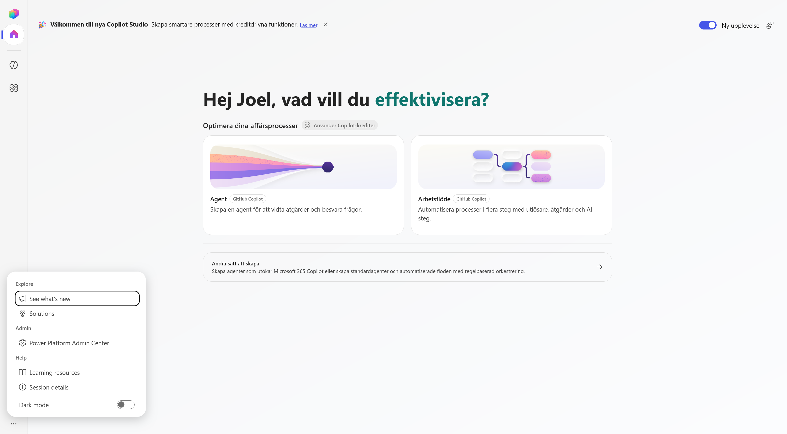
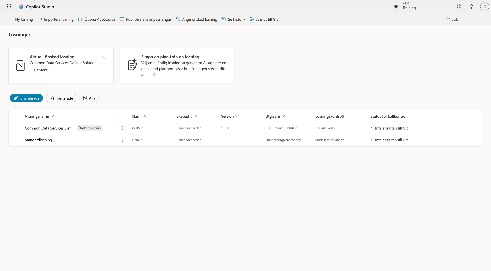
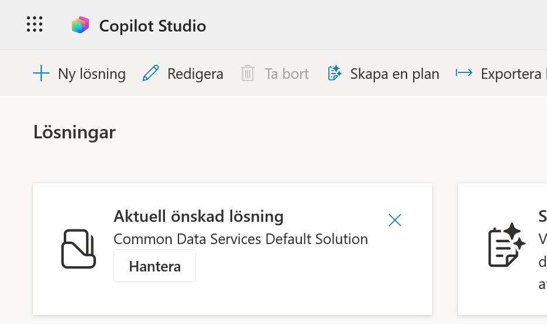
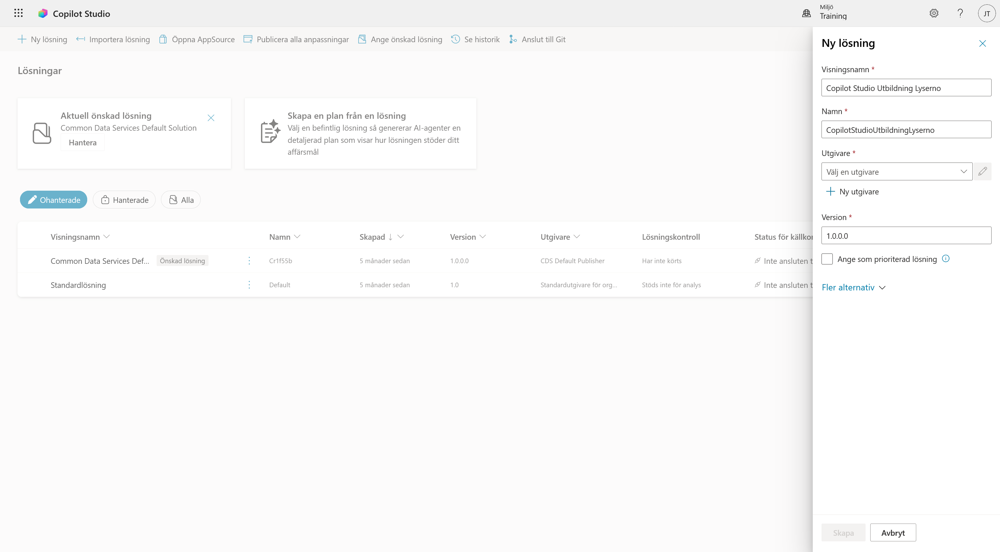
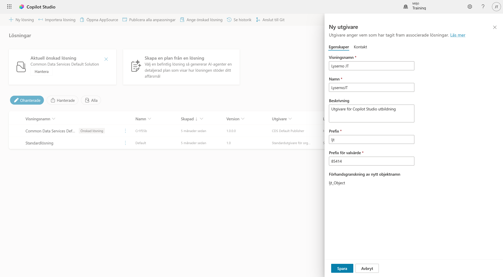
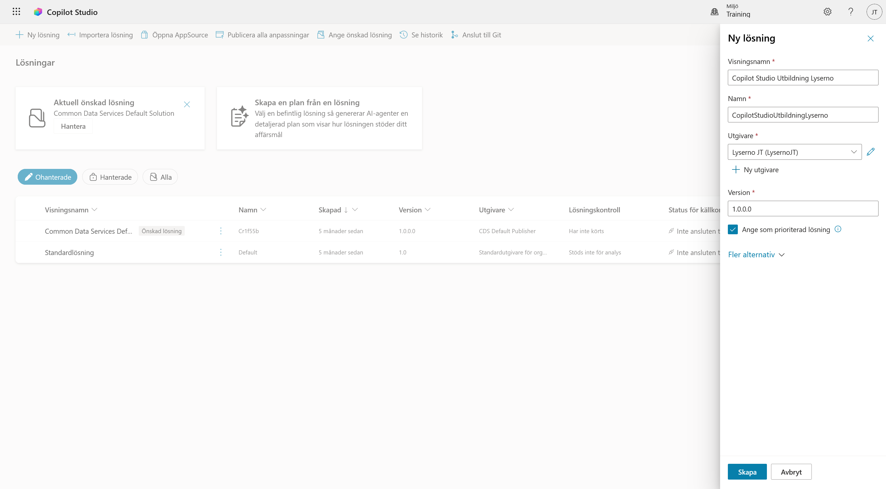
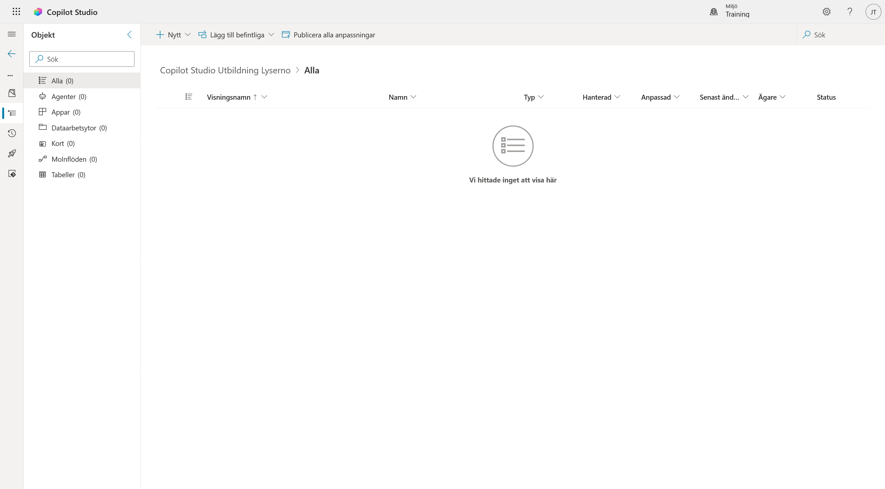
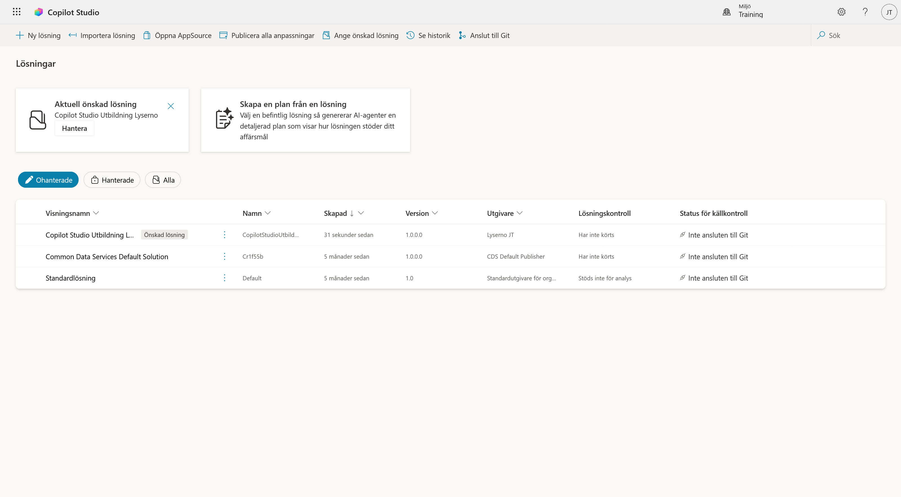

# 2. Skapa lösningen

I det här kapitlet skapar vi lösningen som ska samla Lyserno-agenten och de komponenter vi bygger senare i kursen. Vi skapar också en egen utgivare, så att våra komponenter får ett tydligt och unikt prefix.

När kapitlet är klart har du:

- skapat en egen utgivare med dina initialer
- skapat lösningen **Copilot Studio Utbildning Lyserno**
- angett lösningen som prioriterad
- kontrollerat att du arbetar i rätt lösning

!!! info "Varför bygger vi i en lösning?"
    Lösningen håller ihop agenten, arbetsflödena och andra Power Platform-komponenter som hör till samma implementation. Det gör lösningen enklare att förvalta och senare flytta mellan olika miljöer.

---

## Del 1: Öppna Solutions

1. Öppna de **tre punkterna** längst ner i Copilot Studios vänsternavigering.
2. Välj **Solutions**.



Du kommer nu till sidan **Lösningar**. Här visas de lösningar som finns i den valda miljön. Till vänster, under rubriken **Lösningar**, ser du även vilken lösning som för närvarande är prioriterad.



Kontrollera att rätt utvecklingsmiljö visas högst upp till höger. Bilden visar miljön **Training**, men du ska använda den personliga utvecklingsmiljö som valdes i föregående kapitel.

Välj **+ Ny lösning** högst upp till vänster.



---

## Del 2: Ange lösningens namn

Panelen **Ny lösning** öppnas från höger.

Fyll i följande visningsnamn. Använd kopieringsikonen i kodrutan:

```text
Copilot Studio Utbildning Lyserno
```

| Fält | Värde |
| --- | --- |
| **Visningsnamn** | `Copilot Studio Utbildning Lyserno` |
| **Namn** | `CopilotStudioUtbildningLyserno` |

Fältet **Namn** skapas normalt automatiskt från visningsnamnet. Om det inte fylls i automatiskt anger du samma namn utan mellanslag.

Under **Utgivare** ska vi inte använda standardutgivaren. Välj i stället **+ Ny utgivare**.



---

## Del 3: Skapa en utgivare

En ny panel med rubriken **Ny utgivare** öppnas. Utgivaren identifierar vem som har skapat komponenterna och ger dem ett eget prefix.

Använd dina initialer. Exemplen nedan använder **JT** för Joel Thyberg.

**Visningsnamn**<br>
Skriv `Lyserno [initialer]`, exempelvis `Lyserno JT`.

**Namn**<br>
Använd samma namn utan mellanslag, exempelvis `LysernoJT`.

**Beskrivning**<br>
Beskrivningen är samma för alla. Kopiera följande text:

```text
Utgivare för Copilot Studio-utbildning
```

**Prefix**<br>
Använd `l` följt av initialerna med små bokstäver, exempelvis `ljt`.

**Prefix för valvärde**<br>
Lämna det automatiskt skapade värdet oförändrat, exempelvis `85414`.

!!! tip "Byt ut JT mot dina egna initialer"
    Om du exempelvis heter Anna Svensson använder du `Lyserno AS`, `LysernoAS` och prefixet `las`. Prefixet måste vara unikt i miljön.

Under **Förhandsgranskning av nytt objektnamn** kan du se hur prefixet används, exempelvis `ljt_Object`.

Välj **Spara** längst ner i panelen.



---

## Del 4: Slutför lösningen

Du kommer nu tillbaka till panelen **Ny lösning**. Kontrollera följande:

- **Visningsnamn:** `Copilot Studio Utbildning Lyserno`
- **Namn:** `CopilotStudioUtbildningLyserno`
- **Utgivare:** din nya Lyserno-utgivare, exempelvis `Lyserno JT (LysernoJT)`
- **Version:** lämna standardvärdet `1.0.0.0`

Markera sedan **Ange som prioriterad lösning**.



Välj **Skapa** längst ner i panelen.

---

## Del 5: Kontrollera den nya lösningen

När lösningen har skapats öppnas den automatiskt. Rubriken visar **Copilot Studio Utbildning Lyserno** och listan är än så länge tom. Det är korrekt – vi har inte skapat agenten eller några andra komponenter ännu.



Välj **bakåtpilen** längst till vänster, under menyikonen, för att återvända till sidan **Lösningar**.

Nu ska **Copilot Studio Utbildning Lyserno** visas både i listan och i rutan **Aktuell önskad lösning**.



!!! success "Lösningen är klar"
    Lyserno-lösningen är skapad och prioriterad. Komponenterna vi bygger framöver kan nu samlas på samma plats.

## Återvänd till Copilot Studio

Du kan återvända till den nya Copilot Studio-upplevelsen på något av följande sätt:

- gå tillbaka till den tidigare webbläsarfliken där Copilot Studio fortfarande är öppet
- välj **Copilot Studio-ikonen** högst upp till vänster på sidan

I [nästa kapitel](03-create-agent.md) skapar vi **Lyserno Produktassistent**, konfigurerar agentens grundinställningar och genomför ett första baslinjetest.
