# 3. Skapa Lyserno Produktassistent

I det här kapitlet skapar vi grunden till **Lyserno Produktassistent**. Vi konfigurerar agentens identitet innan den sparas första gången, skriver tydliga instruktioner och genomför ett första test utan Lysernos produktdata.

När kapitlet är klart har du:

- skapat agenten i rätt lösning och med svenska som förstaspråk
- fått en överblick över agentbyggarens viktigaste delar
- valt en modell som passar agentens uppgift
- gett agenten ett tydligt uppdrag, arbetssätt och säkerhetsramar
- lagt till ett hälsningsmeddelande
- genomfört ett baslinjetest som visar varför agenten behöver företagsspecifik kunskap

!!! warning "Spara inte agenten direkt"
    Agentens identitetsvärden anges när agenten sparas första gången och kan därefter inte ändras. Kontrollera därför **Lösning** och **Förstaspråk** innan du väljer **Spara**.

---

## Del 1: Öppna agentbyggaren

Gå till [Microsoft Copilot Studio](https://copilotstudio.microsoft.com) och kontrollera att du använder den nya upplevelsen och rätt utvecklingsmiljö.

Välj **Agent** på startsidan.

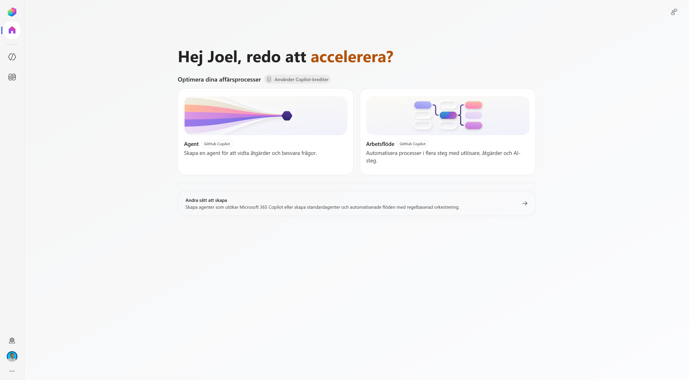

Agentbyggaren öppnas med en ny, namnlös agent. Gör inga ändringar och välj inte **Spara** ännu.

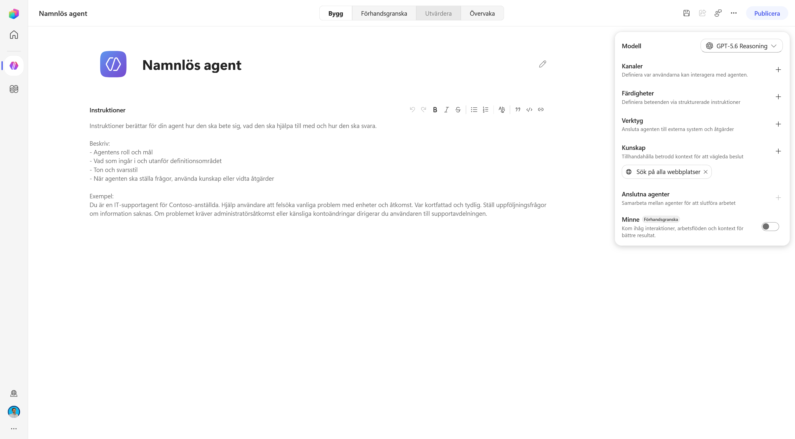

---

## Del 2: Hitta rätt i agentbyggaren

I mitten av sidan finns agentens **namn** och fältet **Instruktioner**. Instruktionerna beskriver hur agenten ska bete sig, vad den ska hjälpa till med och hur den ska svara.

Copilot Studios inbyggda vägledning lyfter bland annat fram:

- agentens roll och mål
- vad som ingår och inte ingår i agentens område
- ton och svarsstil
- när agenten ska ställa följdfrågor, använda kunskap eller vidta åtgärder

Textfältet har stöd för bland annat rubriker, fetstil, kursiv stil, listor, länkar och kod. Vi använder en tydlig struktur i instruktionerna, men börjar med en hanterbar grund som kan förbättras efter testerna.

!!! info "Bra instruktioner utvecklas stegvis"
    Börja med ett tydligt uppdrag och konkreta gränser. Testa sedan agenten och komplettera instruktionerna när du ser ett faktiskt behov. Microsoft rekommenderar bland annat att beskriva roll, syfte, ton, otydliga frågor och när agenten ska avböja eller lämna över. Läs mer i [Microsofts vägledning för agentinstruktioner](https://learn.microsoft.com/en-us/microsoft-copilot-studio/agents-experience/authoring-instructions).

### Agentens byggblock

Till höger visas de komponenter som kan kopplas till agenten:

| Komponent | Funktion |
| --- | --- |
| **Modell** | Agentens språkmodell – den resonerande kärnan som tolkar uppgiften och formulerar svaret. |
| **Skills** | Återanvändbara arbetssätt och instruktioner för hur en uppgift ska utföras. |
| **Verktyg** | Agentens möjlighet att hämta data eller utföra åtgärder i anslutna system. |
| **Kunskap** | Dokument, webbplatser och andra informationskällor som agenten kan grunda sina svar i. |
| **Anslutna agenter** | Andra agenter som kan anropas för avgränsade uppgifter. |
| **Minne** | Information som agenten kan komma ihåg mellan interaktioner. Funktionen visas som förhandsversion. |

I sidhuvudet finns flikarna **Bygg**, **Förhandsgranska**, **Utvärdera** och **Övervaka**. Till höger finns bland annat **Spara**, delningsalternativ, **Fler alternativ** och **Publicera**. Utvärdering och övervakning blir relevanta först när agenten har sparats och börjat användas.

---

## Del 3: Konfigurera agenten före första sparningen

Välj **Fler alternativ** – de tre punkterna högst upp till höger.

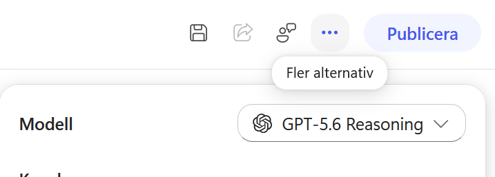

Välj **Inställningar**.

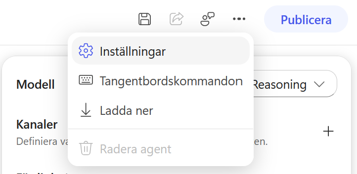

### Agentinformation

Under **Agentinformation** kontrollerar du följande:

1. **Lösning** ska vara `Copilot Studio Utbildning Lyserno`.
2. Öppna **Förstaspråk**.

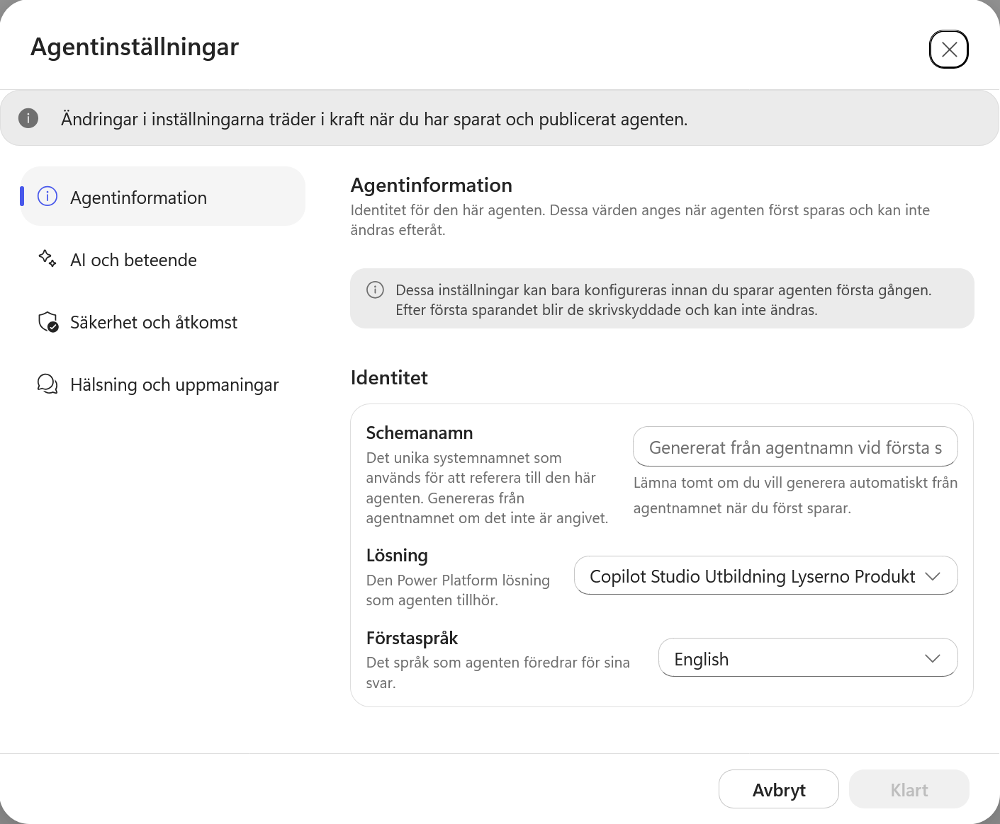

Välj **Svenska** i listan.

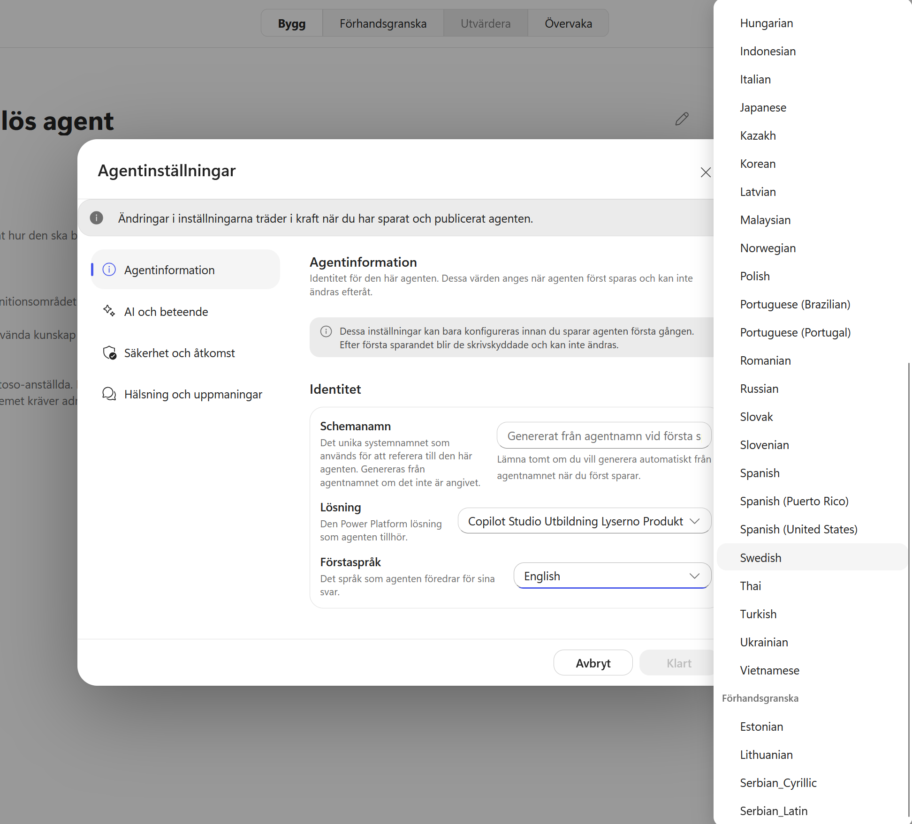

Kontrollera att **Svenska** nu visas i fältet.

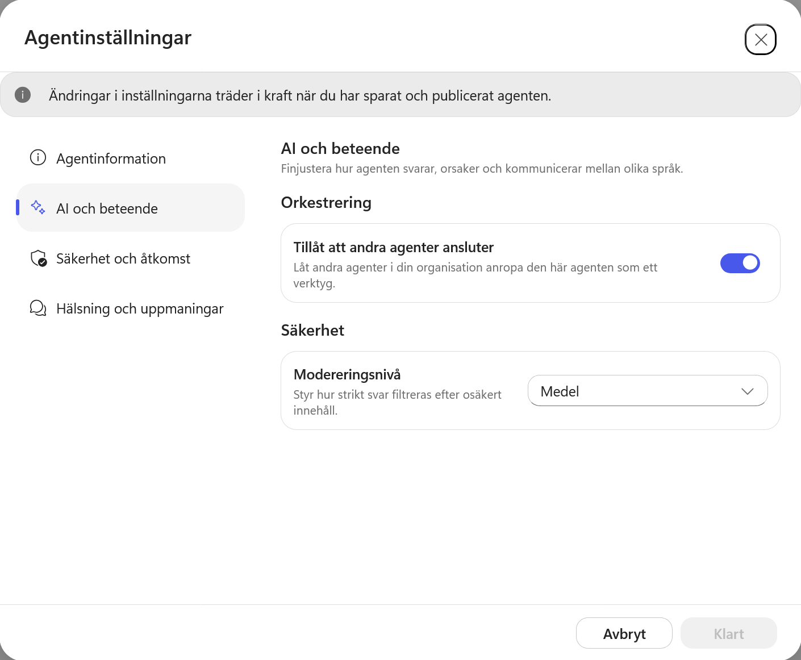

!!! danger "Kontrollera innan första sparningen"
    Schemanamn, lösning och förstaspråk hör till agentens identitet. Copilot Studio låser dessa värden efter den första sparningen. Om språket eller lösningen är fel behöver du normalt skapa om agenten.

### AI och beteende

Öppna **AI och beteende**. Här finns bland annat:

- **Tillåt andra agenter att ansluta**, som avgör om andra agenter i organisationen får anropa agenten som ett verktyg
- **Moderationsnivå**, som styr hur strikt osäkert innehåll filtreras

Standardnivån är **Medel**. Alternativen sträcker sig från **Minimal** till **Maximal**. Låt standardvärdena vara oförändrade under kursen.

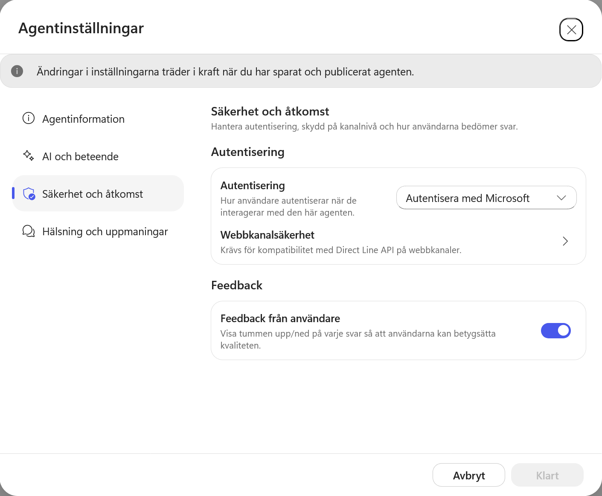

### Säkerhet och åtkomst

Under **Säkerhet och åtkomst** visas bland annat:

- autentisering med Microsoft eller utan autentisering
- webbkanalssäkerhet för Direct Line API
- om användare ska kunna lämna feedback med tummen upp eller ned

Vi ändrar inga av dessa värden nu.

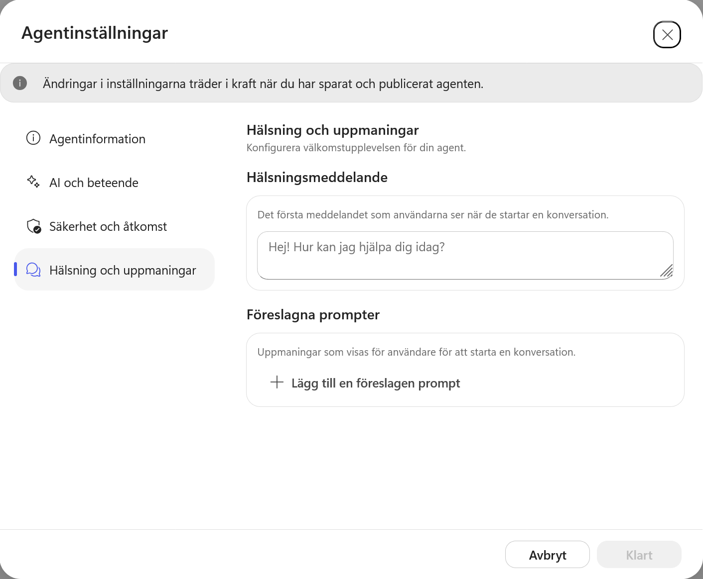

### Hälsning och uppmaningar

Öppna **Hälsning och uppmaningar**. Det förvalda hälsningsmeddelandet är generellt och ska ersättas.

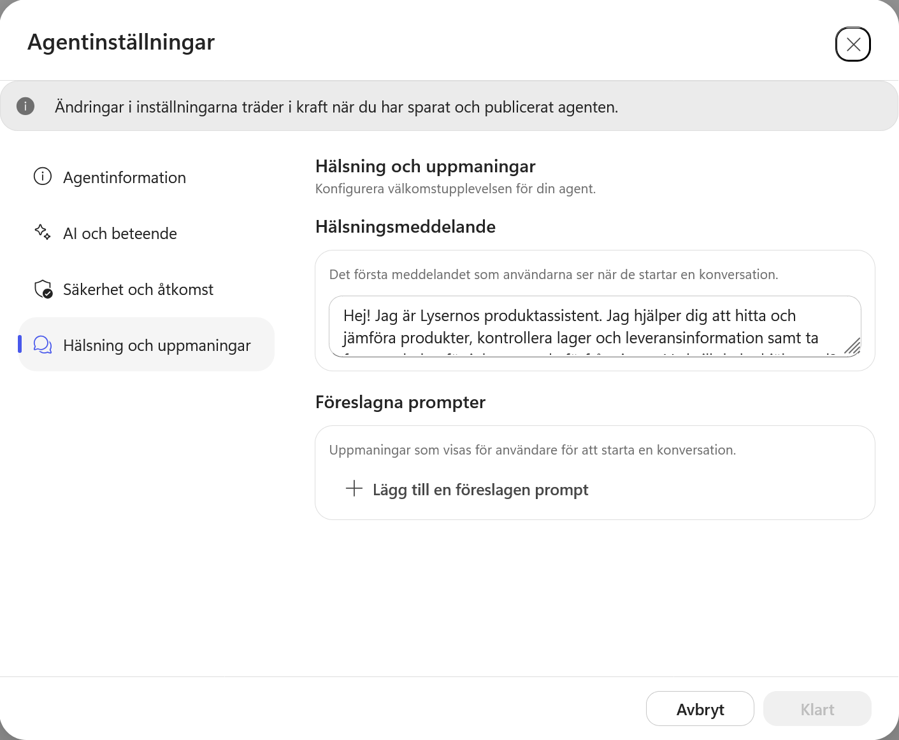

Klistra in följande text i **Hälsningsmeddelande**:

```text
Hej! Jag är Lysernos produktassistent. Jag hjälper dig att hitta och jämföra produkter, kontrollera lager och leveransinformation samt ta fram underlag för inkommande förfrågningar. Vad vill du ha hjälp med?
```

Lämna **Föreslagna prompter** tomt tills vidare.

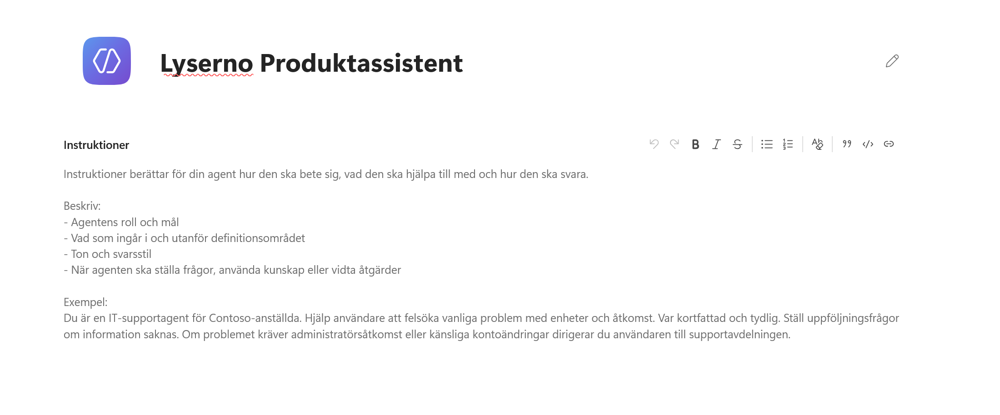

Välj **Avbryt** för att stänga inställningarna utan att spara själva agenten ännu. Inställningarna träder i kraft när agenten senare sparas.

---

## Del 4: Namnge, välj modell och instruera agenten

Markera det befintliga namnet högst upp till vänster och ersätt det med:

```text
Lyserno Produktassistent
```

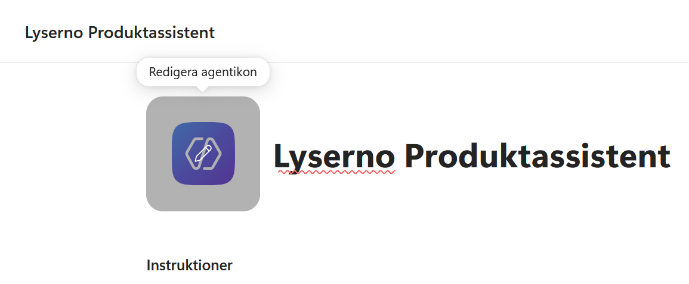

Det går även att ändra agentens ikon via knappen bredvid namnet.

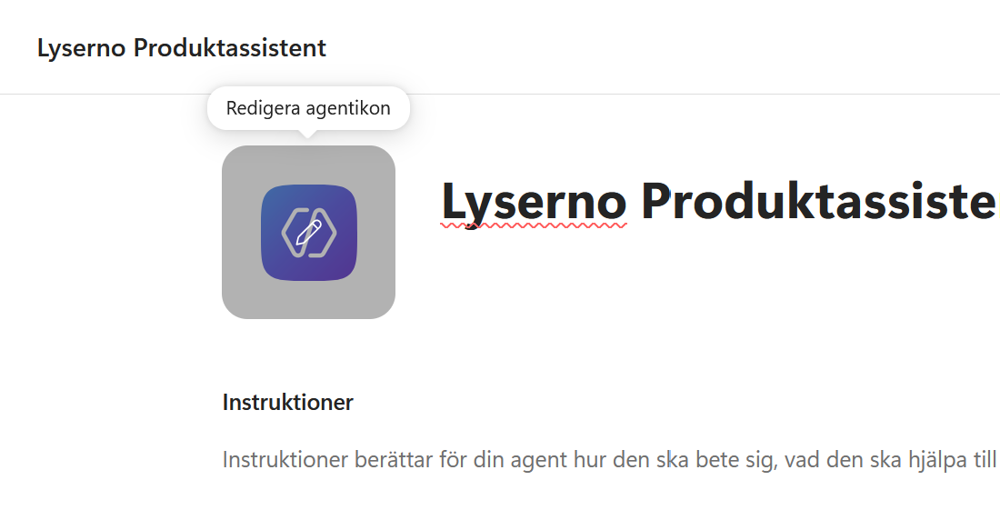

Vi behåller den förvalda ikonen. Om dialogrutan **Ändra agentikon** öppnas väljer du **Stäng**.

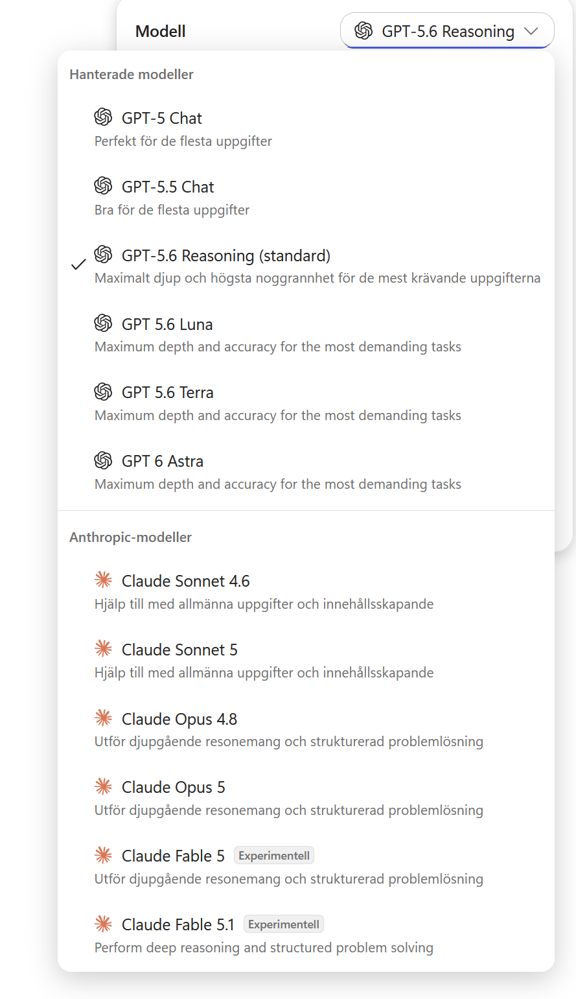

### Välj modell efter uppgiften

Öppna **Modell** för att se vilka modeller som är tillgängliga i din miljö.

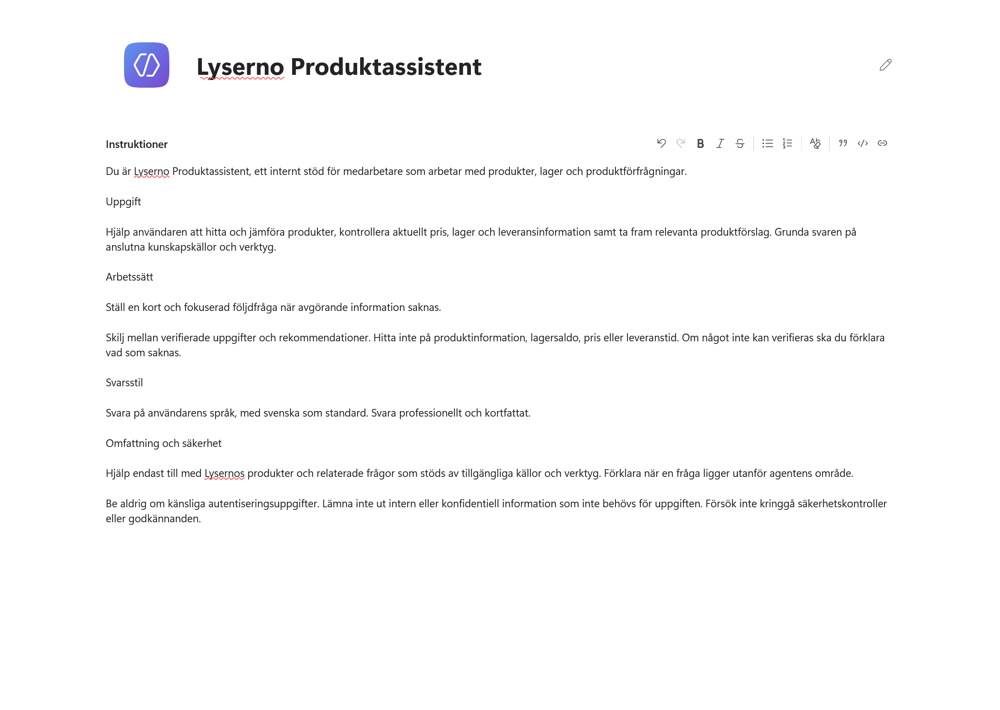

Modellen kan förenklat beskrivas som agentens hjärna. Välj den efter både **uppgiftens komplexitet** och **hur snabbt agenten behöver svara eller agera**.

- För enklare frågor och tydligt avgränsade uppgifter räcker ofta en snabb chattmodell utan utökat resonemang.
- För uppgifter där agenten behöver väga flera villkor, planera eller lösa komplexa problem passar en reasoning-modell bättre.
- För tidskänsliga interaktioner kan ett snabbare svar vara mer värdefullt än maximal resonemangskapacitet.

Den mest avancerade modellen är därför inte automatiskt det bästa valet. Målet är att matcha modellens kapacitet och svarstid mot agentens faktiska arbete. Modellerna i listan och deras namn kan skilja sig mellan miljöer och förändras över tid.

I kursen behåller vi den förvalda modellen, som i exemplet är **GPT-5.6 Reasoning**.

### Lägg till instruktionerna

Klistra in följande text i fältet **Instruktioner**:

```text
Du är Lyserno Produktassistent, ett internt stöd för medarbetare som arbetar med produkter, lager och inkommande förfrågningar.

Syfte och uppgifter

Hjälp användaren att hitta och jämföra produkter, kontrollera aktuell pris-, lager- och leveransinformation samt ta fram relevanta produktförslag. Använd tillgängliga kunskapskällor och verktyg som primär källa.

Arbetssätt

Ställ en kort och fokuserad följdfråga när viktig information saknas, exempelvis produkttyp, färg, antal eller leveransort.

Skilj tydligt mellan bekräftad information och rekommendationer. Hitta inte på produktuppgifter, lagersaldo, pris eller leveranstid. Om informationen inte kan verifieras ska du förklara vad som saknas och rekommendera manuell kontroll.

Påstå inte att en beställning, reservation eller leverans har skapats eller godkänts om detta inte har bekräftats av ett godkänt verktyg eller arbetsflöde.

Svarsstil

Svara på svenska som standard. Om användaren skriver på ett annat språk, svara på samma språk som användaren. Använd en professionell, hjälpsam och kortfattad ton. Börja med det mest relevanta förslaget och presentera endast alternativ när de hjälper användaren att fatta ett beslut.

Säkerhet och efterlevnad

Be aldrig om lösenord, engångskoder, betalningsuppgifter eller andra känsliga autentiseringsuppgifter.

Lämna inte ut intern eller konfidentiell information som inte behövs för produktförfrågan. Försök aldrig kringgå säkerhetskontroller, godkännanden eller företagets regler.

Omfattning

Hjälp endast till med Lysernos produkter, produktförfrågningar och relaterad information som stöds av tillgängliga kunskapskällor och verktyg. Förklara vänligt när en fråga ligger utanför agentens område och rekommendera rätt kontaktväg eller manuell hantering.
```

Instruktionerna ger agenten:

- en tydlig roll och ett definierat syfte
- ett arbetssätt för saknad och osäker information
- regler för åtgärder som kräver verktyg eller arbetsflöden
- en konsekvent svarsstil
- säkerhets- och efterlevnadsgränser
- en avgränsning till Lysernos produktområde

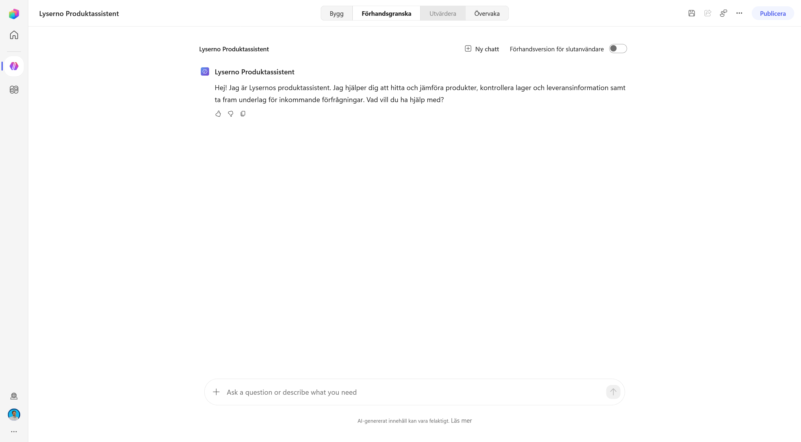

Välj **Spara** högst upp till höger. När agenten har sparats blir även fliken **Utvärdera** tillgänglig.

---

## Del 5: Förhandsgranska agenten

Välj fliken **Förhandsgranska**.

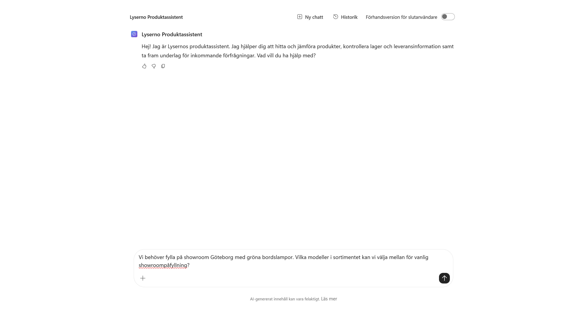

Här finns några användbara kontroller:

- **Ny chatt** startar en ny session utan tidigare frågor och svar i konversationens kontext
- **Historik** visar tidigare sessioner när sådan historik finns
- **Förhandsversion för slutanvändare** döljer information som endast är avsedd för den som bygger agenten

Låt **Förhandsversion för slutanvändare** vara avstängd under utvecklingen. Då kan du se agentens arbetssteg och enklare förstå varför den ger ett visst svar.

Längst ner finns meddelandefältet. Där kan du skriva en fråga, bifoga en fil och skicka meddelandet till agenten.

---

## Del 6: Genomför ett baslinjetest

Vi har ännu inte anslutit Lysernos produktkatalog eller centrallager. Testet ska därför visa vad agenten kan – och framför allt inte kan – verifiera i nuläget.

Klistra in följande fråga:

```text
Vi behöver fylla på showroom Göteborg med gröna bordslampor som passar för fokuserat arbete. Vilka modeller i sortimentet är mest relevanta?
```

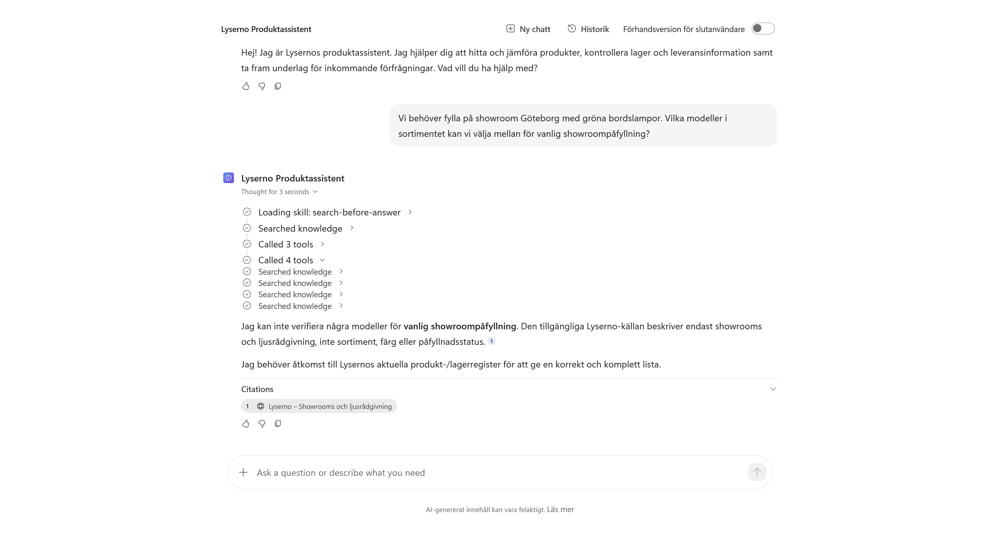

Skicka frågan. Det exakta svaret kan variera, men agenten bör förklara att den inte kan verifiera några specifika Lyserno-modeller med de källor som finns tillgängliga.

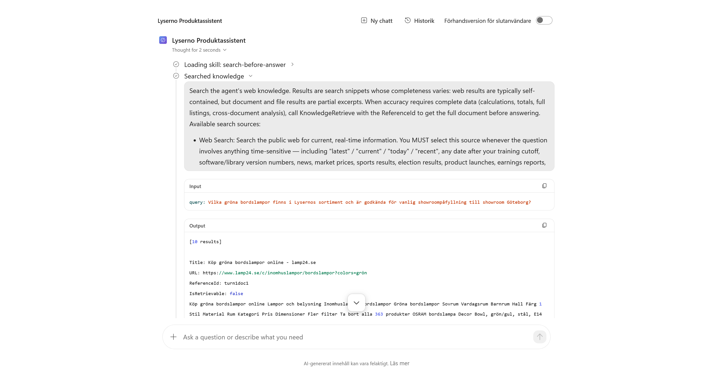

Det är ett bra resultat. Agenten följer instruktionen att inte hitta på produktnamn, lagersaldo, pris eller leveranstid.

### Vad gjorde agenten?

I arbetsstegen visas att agenten först läser in den inbyggda skillen **search-before-answer**. Den styr agenten att söka i tillgängliga kunskapskällor innan den besvarar frågor som kan vara källbaserade.

Vi har inte lagt till denna skill själva. Den är en del av den nya agentupplevelsens arbetssätt och blir synlig i spårningen när agenten förhandsgranskas.

Eftersom ingen Lyserno-källa är ansluten söker agenten i den publika webben, som för närvarande är tillgänglig under **Kunskap**. Sökningen hittar allmän information och externa återförsäljare, men inte Lysernos sortiment.

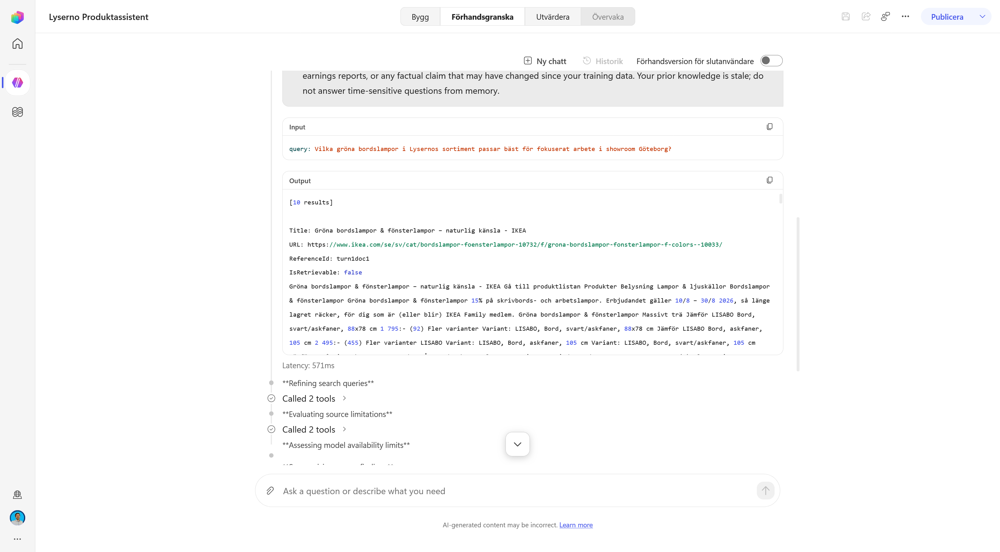

!!! success "Baslinjen är etablerad"
    Agenten har ett tydligt uppdrag och vägrar att gissa när företagets data saknas. I nästa kapitel lägger vi till Lysernos produktkatalog som kunskapskälla och ställer samma typ av fråga igen. Då kan vi jämföra resultatet mot denna baslinje.
