# 4. Lägg till produktkunskap

Lyserno Produktassistent har nu ett tydligt uppdrag, men saknar fortfarande företagets egna informationskällor. I det här kapitlet ger vi agenten två typer av stabil kunskap:

- **Lysernos produktkatalog**, som innehåller modeller, varianter, användningsområden och tekniska egenskaper
- **Lysernos publika webbplats**, som innehåller showroom, adresser, regioner och öppettider

När kapitlet är klart har du:

- förstått vilken roll Kunskap har i agenten
- laddat upp den längre PDF-katalogen
- stängt av fri webbsökning och avgränsat agenten till en bestämd webbplats
- kompletterat agentens instruktioner för showroomfrågor
- kontrollerat källornas status och förberett nästa test

!!! info "Stabil information först"
    Produktkatalogen och showroominformationen förändras relativt sällan och passar därför som **Kunskap**. Aktuellt pris, lagersaldo och leveranstid förändras löpande. Den informationen hämtar vi senare via ett verktyg mot SharePoint.

---

## Del 1: Förstå Kunskap i den nya agentupplevelsen

Kunskap är de informationskällor som agenten får använda för att grunda sina svar. En källa kan exempelvis vara en uppladdad fil, en publik webbplats, SharePoint eller en ansluten företagstjänst.

Vilka källor som visas under **Featured** och **Advanced** kan variera mellan miljöer, licenser och tidpunkter. I kursen använder vi en uppladdad PDF och en publik webbplats.

Förenklat sker informationshämtningen i tre steg:

1. Agenten tolkar frågan och skapar en mer sökbar formulering.
2. Relevanta resultat hämtas från de anslutna kunskapskällorna.
3. Agenten använder resultaten tillsammans med sina instruktioner för att formulera svaret eller välja nästa arbetssteg.

Hämtningsmetoden beror på källan. Uppladdade dokument förbereds för informationssökning, medan publika webbplatser söks via Bing. Microsoft beskriver den grundläggande RAG-processen som frågeomskrivning, hämtning, svarsgenerering och säkerhetskontroll. Läs mer i [Microsofts vägledning om RAG](https://learn.microsoft.com/en-us/microsoft-copilot-studio/guidance/retrieval-augmented-generation).

## Del 2: Ladda upp Lysernos produktkatalog

Vi börjar med PDF-filen eftersom en större fil kan behöva bearbetas en stund innan den är fullt sökbar.

Gå till agentens flik **Bygg** och välj plustecknet vid **Kunskap**.

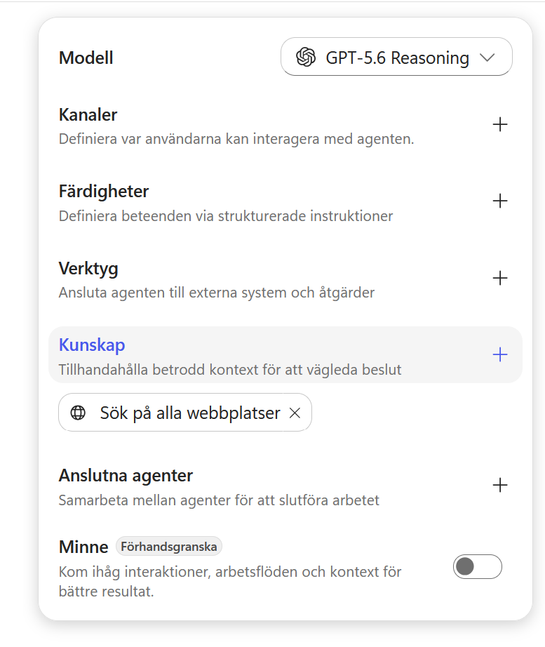

Dialogrutan **Add knowledge** öppnas. Överst kan du dra in en fil eller klicka i uppladdningsytan. Under ytan visas tillgängliga källor under **Featured** och **Advanced**.

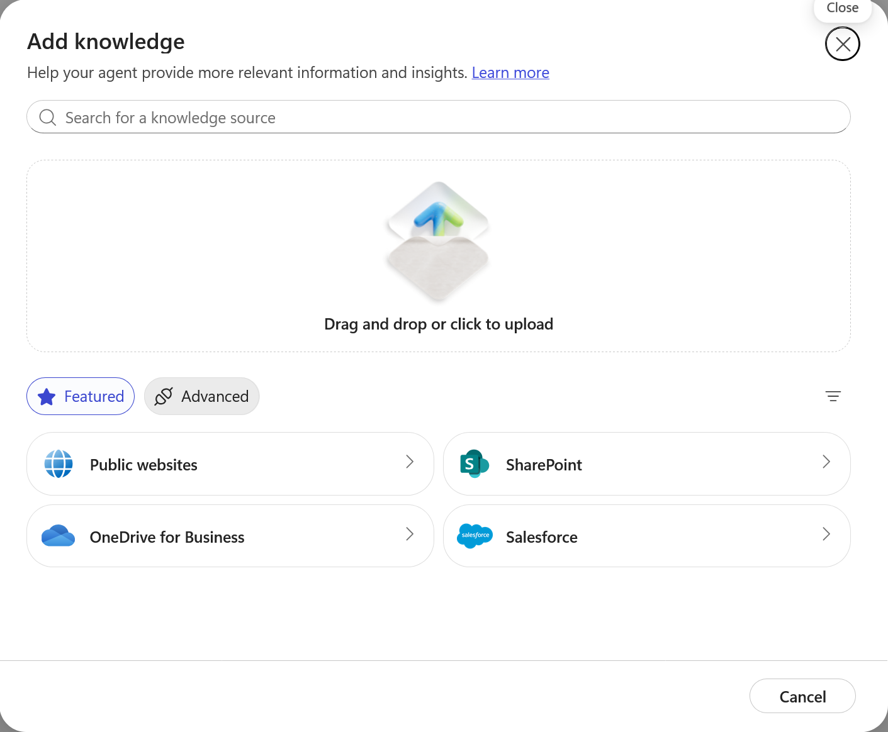

### 1. Ladda ner katalogen

Ladda ner kursens produktkatalog och spara den på en plats där du enkelt hittar den.

<p><a class="button button--primary button--download" href="../../../downloads/nextgen/lyserno-lighting-collection-2026.pdf" download>Ladda ner Lysernos produktkatalog</a></p>

### 2. Välj PDF-filen

Dra in `lyserno-lighting-collection-2026.pdf` i uppladdningsytan eller välj **browse your device** och leta upp filen.

När filen visas i listan väljer du **Add to agent**.

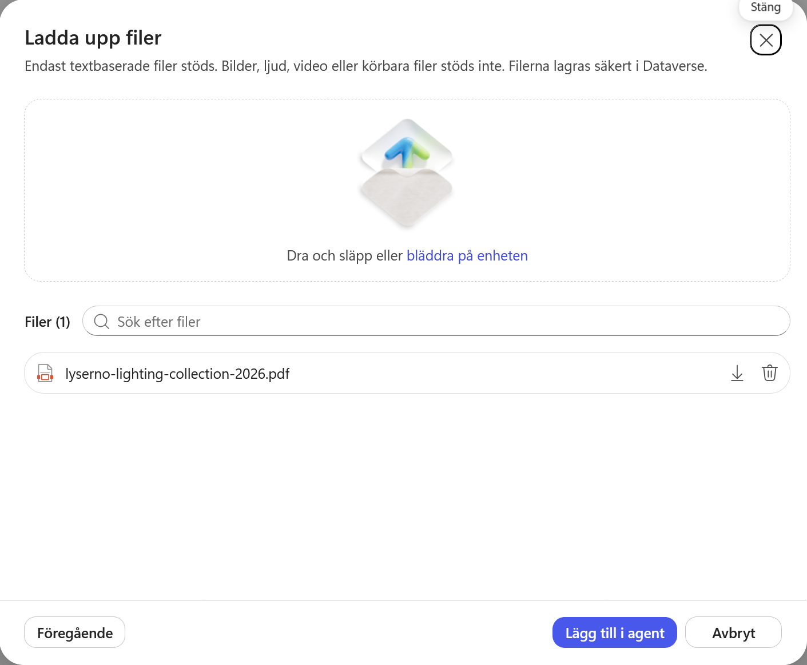

Katalogen visas nu under **Kunskap** i agentens högra panel.

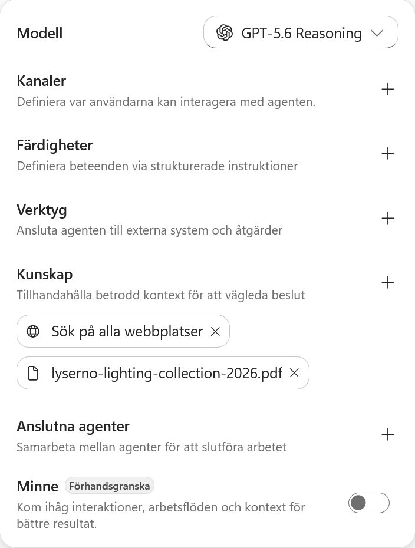

### 3. Kontrollera bearbetningen

Välj PDF-källan för att öppna dess detaljer. För en större fil kan statusen vara **In progress** medan innehållet förbereds för sökning.

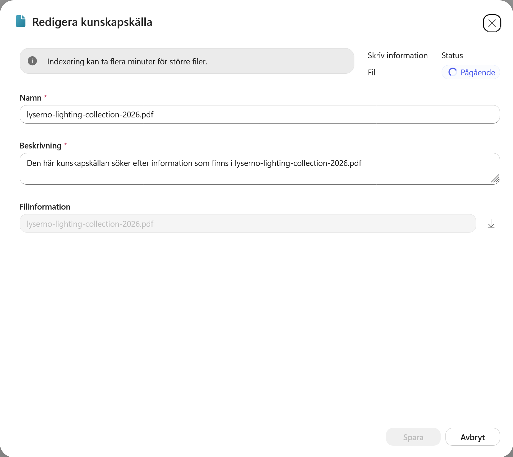

Namnet och beskrivningen skapas automatiskt. Vi låter dem vara oförändrade i kursen. Stäng dialogrutan med krysset eller **Cancel**.

!!! warning "Vänta inte passivt på PDF-filen"
    Bearbetningen kan ta från några minuter till betydligt längre tid. Fortsätt med webbplatsen medan PDF-källan arbetar. En fråga kan ibland hitta filen innan statusen har ändrats, men för ett reproducerbart test bör du vänta tills källan är klar.

---

## Del 3: Lägg till Lysernos publika webbplats

Välj plustecknet vid **Kunskap** igen. Dialogrutan öppnas med samma tillgängliga källor.

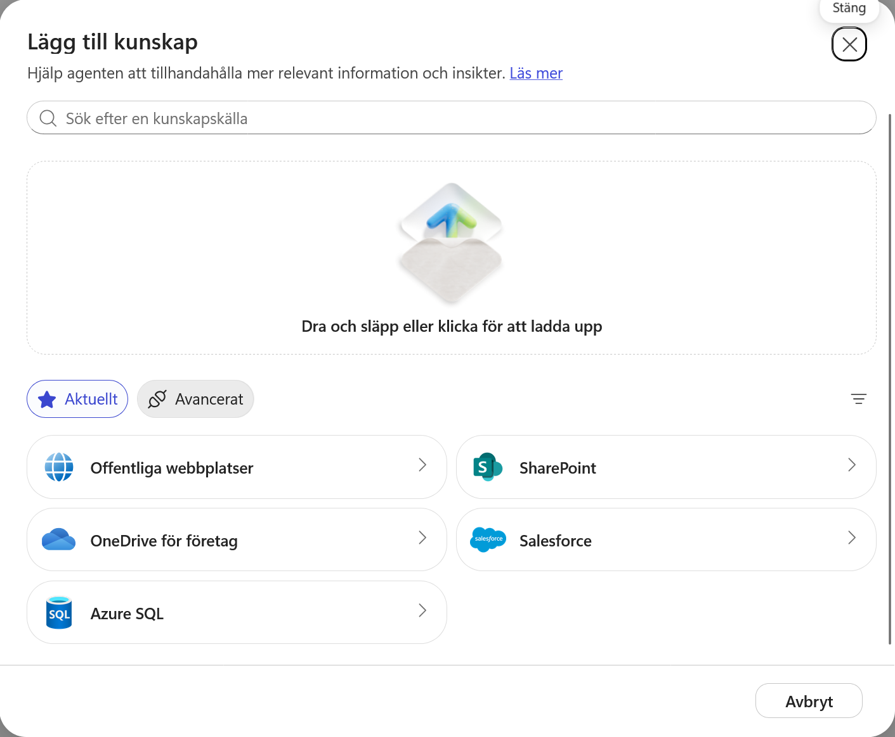

Välj **Public websites**.

### 1. Stäng av fri webbsökning

I början är **Search all websites** påslaget. När inställningen är aktiv skapar agenten en sökfråga och skickar den till Bing. Bing returnerar rankade webbresultat som agenten kan använda tillsammans med övriga källor.

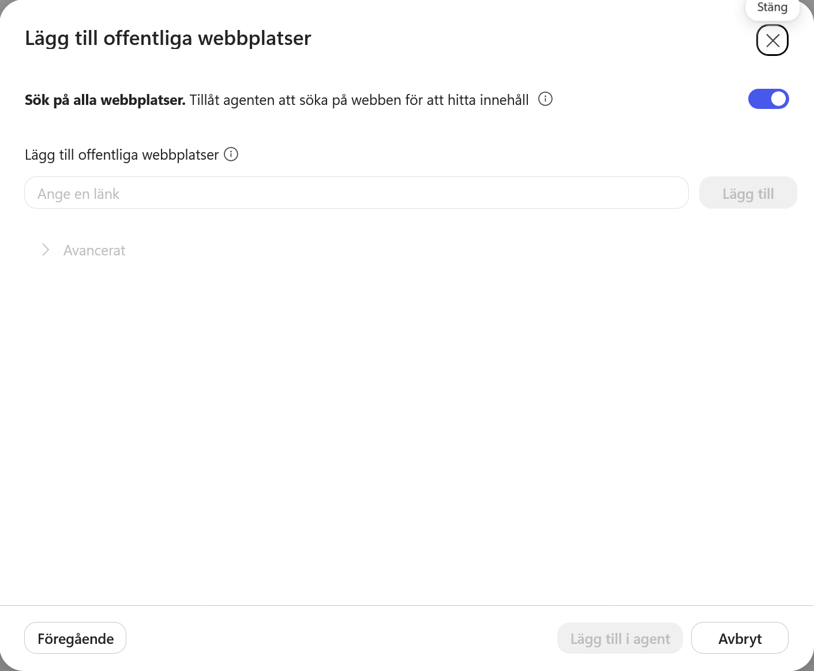

Fri webbsökning kan vara värdefull när agenten behöver aktuell och bred omvärldsinformation. För en avgränsad företagsagent kan den däremot fylla kontexten med konkurrerande eller irrelevant information som vi inte kontrollerar.

Stäng därför av **Search all websites**. Vi börjar med Lysernos egen webbplats och kan senare aktivera bredare sökning om tester visar ett verkligt behov.

!!! info "Advanced"
    Under **Advanced** kan en miljö erbjuda en konfiguration för Bing Custom Search. Den kan ge större kontroll över vilka webbkällor Bing får söka i och hur resultaten prioriteras. Vi använder inte funktionen i kursen. Läs mer i [Microsofts dokumentation om Bing Custom Search](https://learn.microsoft.com/en-us/microsoft-copilot-studio/knowledge-bing-custom-search).

### 2. Ange webbplatsens adress

Klistra in följande adress under **Add public websites**. Använd kopieringsknappen i kodfältets övre högra hörn:

```text
https://tyto-official.github.io/copilot-studio-course/lyserno/
```

Välj **Add**.

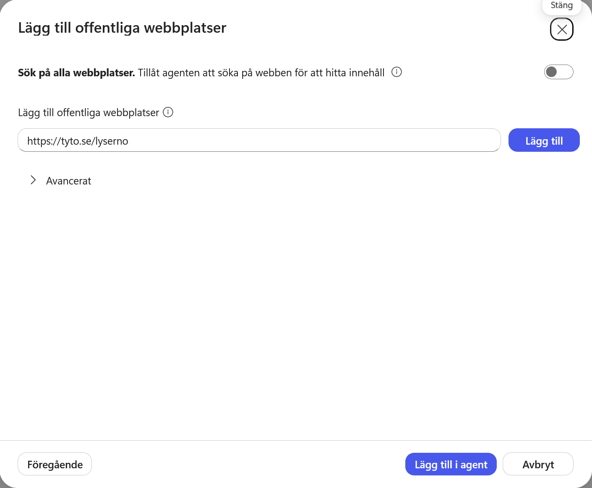

Webbplatsen läggs till i listan. Copilot Studio skapar automatiskt ett namn och en beskrivning. Dessa hjälper orkestreringen att avgöra när källan är relevant. Eftersom vi bara lägger till en webbplats behåller vi standardvärdena.

Välj **Add to agent**.

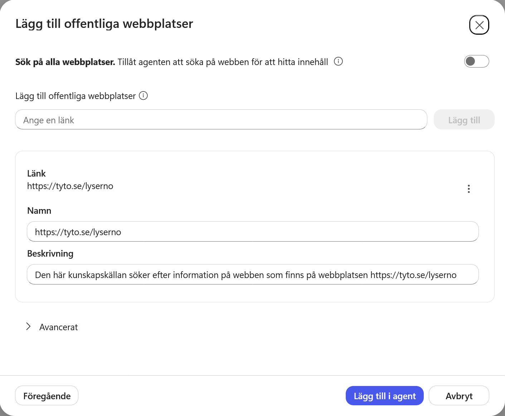

Webbplatsen och produktkatalogen visas nu tillsammans under **Kunskap**.

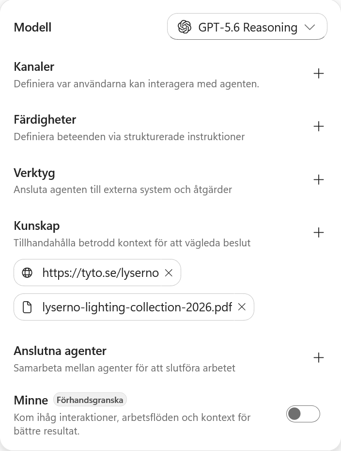

### 3. Kontrollera webbkällan

Välj webbkällan för att öppna detaljerna. Statusen **Ready** betyder att källan har lagts till korrekt i agenten.

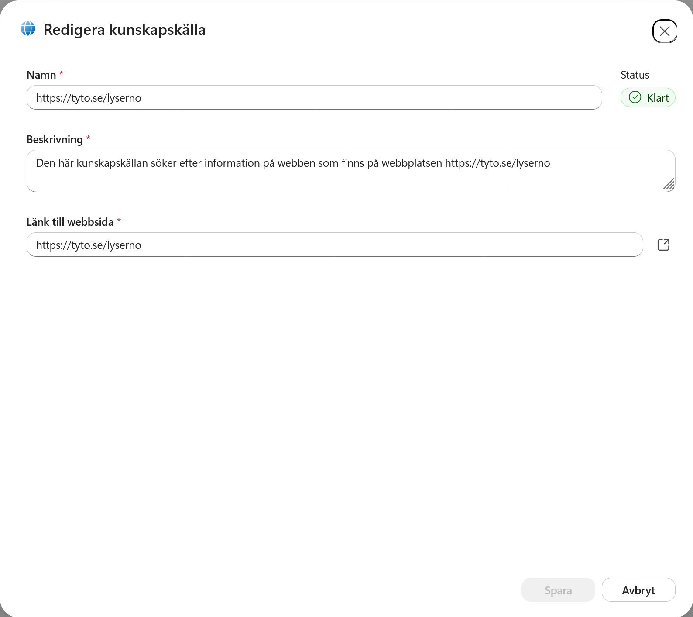

!!! warning "Ready betyder inte alltid indexerad av Bing"
    Copilot Studio använder Bing för att hämta information från publika webbplatser. **Ready** bekräftar att källan är konfigurerad, men en helt ny sida kan fortfarande behöva upptäckas, crawlas och indexeras av Bing innan agenten får träffar. Läs mer om [webbsökning i Copilot Studio](https://learn.microsoft.com/en-us/microsoft-copilot-studio/data-privacy-security-web-search).

Stäng dialogrutan när kontrollen är klar.

---

## Del 4: Komplettera agentens instruktioner

Agenten har nu en källa för showroom, adresser och öppettider. Vi kompletterar därför instruktionerna med hur just den informationen ska användas.

Gå till fältet **Instruktioner** och lägg till följande stycke under rubriken **Arbetssätt**, direkt efter den första raden om följdfrågor:

```text
Använd Lysernos publika webbplats som primär källa för att verifiera showroomnamn, region, adress och öppettider. Om flera showroom matchar användarens beskrivning ska du ställa en kort följdfråga för att avgöra vilket showroom som avses.
```

Välj **Spara**.

Den nya regeln gör två saker:

- den pekar ut rätt källa för platsinformation
- den gör tvetydiga formuleringar som *showroom Göteborg* till en naturlig följdfråga när flera platser matchar

---

## Del 5: Kontrollera läget och fortsätt kursen

Kontrollera källorna under **Kunskap**:

- webbkällan bör visa **Ready**
- PDF-källan kan fortfarande visa **In progress**

Vi låter inte bearbetningstiden blockera resten av kursen. Om PDF-filen fortfarande arbetar kan du ta en kort paus eller fortsätta till nästa kapitel, där vi skapar agentens första skill. Återkom till testet när källorna är tillgängliga.

### Testkontroll när källorna är redo

Starta en **Ny chatt** i förhandsgranskningen och använd först en avgränsad webbfråga:

```text
Vilka showroom har Lyserno i region Väst? Ange showroomtyp, adress och torsdagens öppettider.
```

Den frågan isolerar webbplatskällan och gör det lätt att kontrollera om Bing-baserad hämtning fungerar.

Starta därefter ytterligare en ny chatt och ställ produktfrågan från baslinjetestet igen:

```text
Vi behöver fylla på showroom Göteborg med gröna bordslampor som passar för fokuserat arbete. Vilka modeller i sortimentet är mest relevanta?
```

När båda källorna fungerar ska agenten kunna använda webbplatsen för showroomkontext och katalogen för produktmatchningen. Aktuellt pris, disponibelt saldo och leveranstid saknas fortfarande. Det problemet löser vi senare genom att ansluta agenten till SharePoint.

### Kunskapssökning och filanalys är två olika steg

Öppna agentens arbetssteg för svaret på produktfrågan. Där kan du se att den nya agenten inte behöver stanna vid den första träffen från Kunskap.

Den första kunskapssökningen placerar inte automatiskt hela PDF-dokumentet i modellens kontext. Den hittar relevanta resultat och en referens till dokumentet. I den nya GitHub Copilot-harnessen kan agenten därefter fortsätta arbetet genom att hämta den matchade filen till sin sandbox och använda en inbyggd filskill, exempelvis **analyzing-pdf**, för att undersöka dokumentet mer ingående.

Arbetsgången kan därför se ut ungefär så här:

```text
Kunskapssökning → dokumentreferens → fil till sandbox → PDF-analys → svar
```

Detta skiljer sig från det vanliga kunskapsflödet i den tidigare standardagenten. Där utgjorde resultaten som hämtades av kunskapsmekanismen normalt underlaget som agenten fick arbeta vidare med. Om rätt information inte fanns i de hämtade resultaten kunde agenten därför fastna, trots att uppgiften fanns någon annanstans i dokumentet.

Den nya harnessen har friare orkestrering och kan upptäcka att den första sökträffen inte räcker, välja ett mer specialiserat arbetssätt och analysera den matchade filen vidare. **Kunskap** hjälper alltså agenten att hitta rätt källa, medan harnessen kan välja hur källan behöver undersökas för att lösa uppgiften.

!!! note "Jämför arbetsstegen, inte bara slutsvaret"
    Den tydligaste demonstrationen är att öppna agentens arbetssteg och visa övergången från kunskapssökning till filanalys. Exakta verktygsnamn och steg kan variera mellan modeller och versioner av harnessen.

!!! note "Bedöm källorna, inte den exakta formuleringen"
    Exakta svar och arbetssteg kan variera mellan modeller och medan källorna bearbetas. Kontrollera framför allt att agentens uppgifter kan verifieras i rätt källa och att den är tydlig med information som fortfarande saknas.

!!! success "Kunskapsgrunden är på plats"
    Agenten har nu en produktkatalog och en avgränsad publik webbkälla. Nästa steg är att fånga ett återanvändbart arbetssätt i agentens första skill.
