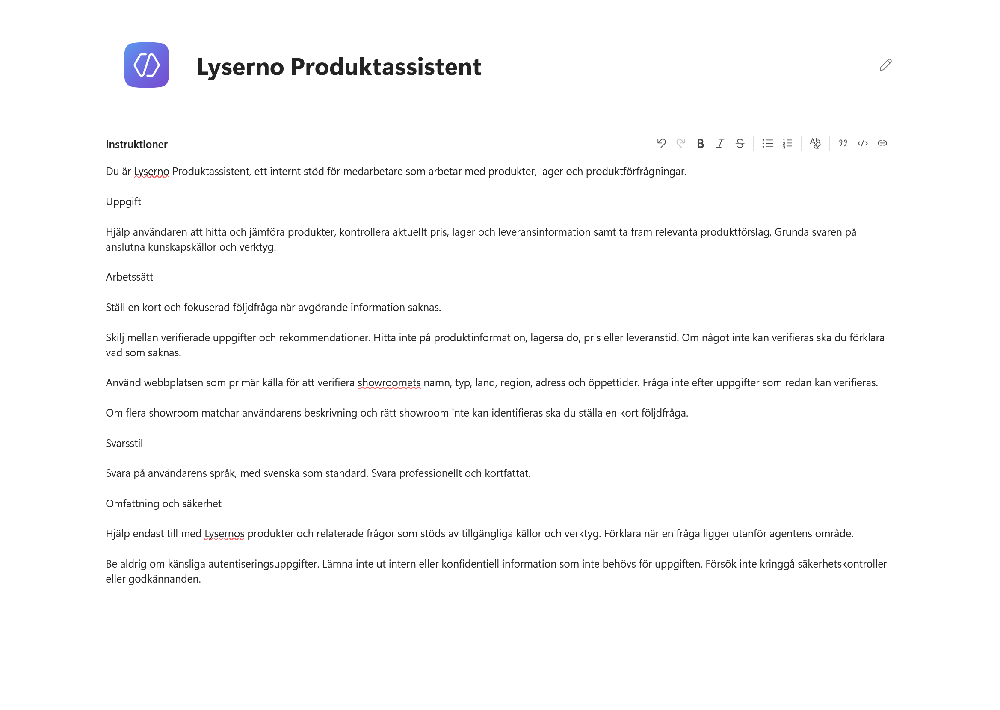
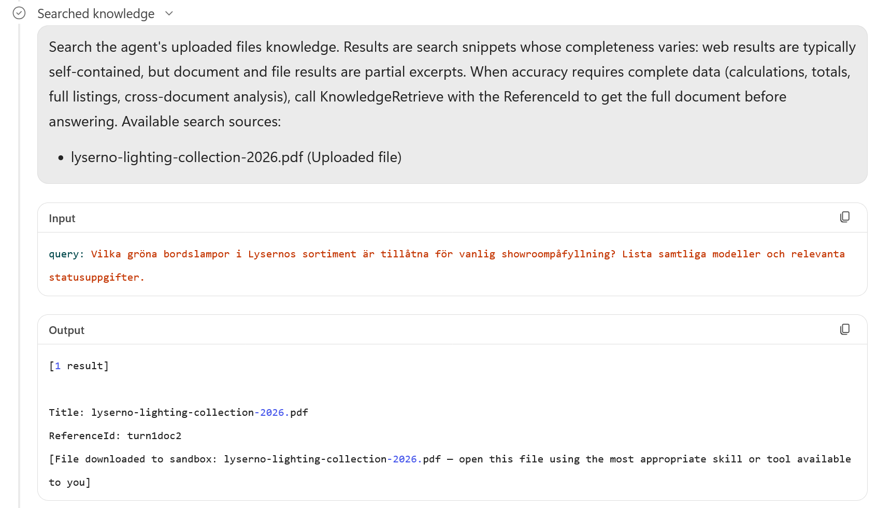
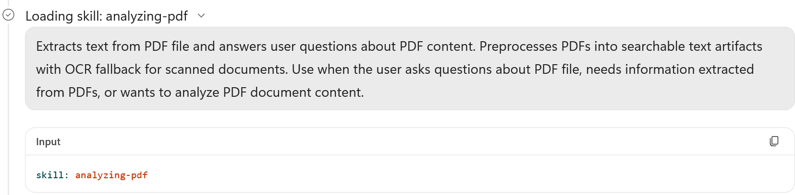
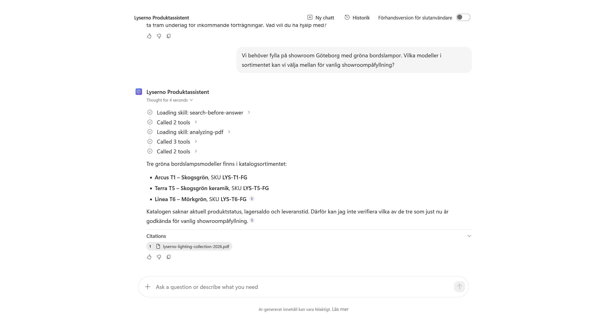

# 4. Lägg till produktkunskap

Lyserno Produktassistent har ett tydligt uppdrag, men saknar fortfarande företagets egna informationskällor. I det här kapitlet lägger vi till:

- **Lysernos produktkatalog**, med modeller, varianter, användningsområden och tekniska egenskaper
- **Lysernos publika webbplats**, med showroomnamn, typer, länder, regioner, adresser och öppettider

När kapitlet är klart har du:

- sett vilka typer av kunskapskällor som finns
- laddat upp produktkatalogen som PDF
- ersatt den fria webbsökningen med Lysernos webbplats
- kompletterat instruktionerna för showroomfrågor
- testat hur agenten söker i och analyserar PDF-filen

!!! info "Stabil information passar som kunskap"
    Produktkatalogen och showroominformationen förändras relativt sällan. Aktuellt pris, lagersaldo och leveranstid förändras oftare och hämtas senare med ett verktyg mot SharePoint.

---

## Del 1: Öppna Kunskap

Gå till fliken **Bygg**. I panelen till höger väljer du plustecknet vid **Kunskap**.


Dialogrutan **Lägg till kunskap** öppnas. Här kan du dra in en fil, söka efter en kunskapskälla eller välja en källa i listan.

Under **Aktuellt** visas vanliga källor, exempelvis offentliga webbplatser, SharePoint, OneDrive för företag, Salesforce och Azure SQL. Under **Avancerat** finns fler alternativ som kan variera mellan miljöer och licenser.


Vi använder en uppladdad PDF och en offentlig webbplats.

---

## Del 2: Ladda upp Lysernos produktkatalog

Ladda först ner kursens produktkatalog och spara den på en plats där du hittar den.

<p><a class="button button--primary button--download" href="../../../downloads/nextgen/lyserno-lighting-collection-2026.pdf" download>Ladda ner Lysernos produktkatalog</a></p>

Dra filen `lyserno-lighting-collection-2026.pdf` till uppladdningsytan. Du kan också klicka i ytan och välja filen på enheten.

När filen visas i listan väljer du **Lägg till i agent**.


PDF-filen visas nu under **Kunskap** i agentens högra panel.


Välj PDF-källan för att öppna dess detaljer. Copilot Studio skapar automatiskt ett namn och en beskrivning. Behåll dessa värden.

För en större fil kan statusen vara **Pågående** medan innehållet indexeras.


Stäng dialogrutan.

!!! note "Indexeringen kan ta tid"
    Du behöver inte vänta på PDF-filen nu. Fortsätt med webbplatsen och återkom till testet när källan är sökbar.

---

## Del 3: Lägg till Lysernos publika webbplats

Välj plustecknet vid **Kunskap** igen.


Välj **Offentliga webbplatser**.

### Stäng av fri webbsökning

Inställningen **Sök på alla webbplatser** är på från början. Då kan agenten söka brett på webben.


Den här agenten ska i första hand använda Lysernos egen webbplats. Stäng därför av **Sök på alla webbplatser**.

Klistra sedan in följande adress:

```text
https://tyto.se/lyserno
```

Välj **Lägg till**.


Webbplatsen visas i listan med ett automatiskt namn och en beskrivning. Behåll standardvärdena och välj **Lägg till i agent**.


Webbplatsen och produktkatalogen visas nu tillsammans under **Kunskap**.


Välj webbkällan för att öppna detaljerna. Statusen **Klart** visar att källan har lagts till i agenten.


!!! warning "Klart betyder inte alltid att sidan redan går att hitta"
    Copilot Studio använder Bing för offentliga webbplatser. En ny eller nyligen ändrad sida kan behöva indexeras innan agenten hittar innehållet.

Stäng dialogrutan när kontrollen är klar.

---

## Del 4: Komplettera instruktionerna

Agenten har nu en källa för showroomnamn, typer, länder, regioner, adresser och öppettider. Lägg till följande stycken under rubriken **Arbetssätt** i agentens instruktioner:

```text
Använd Lysernos publika webbplats som primär källa för att verifiera showroomets namn, typ, land, region, adress och öppettider. Fråga inte efter uppgifter som redan kan verifieras.

Om flera showroom matchar användarens beskrivning och rätt showroom inte kan identifieras ska du ställa en kort följdfråga.
```



Välj **Spara**.

Reglerna talar om vilken källa agenten ska använda för showroominformation. De hindrar också agenten från att fråga efter sådant som redan går att hitta på webbplatsen. En följdfråga behövs först när flera showroom matchar och rätt showroom inte kan identifieras.

---

## Del 5: Testa produktkatalogen

Vänta tills PDF-källan är sökbar. Öppna sedan **Förhandsgranska**, starta en ny chatt och ställ samma fråga som i förra kapitlet:

```text
Vi behöver fylla på showroom Göteborg med gröna bordslampor. Vilka modeller i sortimentet kan vi välja mellan för vanlig showroompåfyllning?
```

Låt **Förhandsversion för slutanvändare** vara avstängd så att arbetsstegen visas.

### Följ kunskapssökningen

Öppna steget **Searched knowledge**. Där syns frågan som agenten skickade till kunskapskällan och resultatet som pekar på produktkatalogen.

I exemplet hämtas den matchande PDF-filen till agentens tillfälliga arbetsyta för fortsatt analys.



Nästa arbetssteg visar att agenten laddar färdigheten **analyzing-pdf** för att läsa filens innehåll.



Kunskapssökningen behöver alltså inte ge agenten hela dokumentet direkt. Den hittar rätt källa, varefter agenten kan hämta filen och välja ett arbetssätt som passar filtypen:

```text
Kunskapssökning → dokumentreferens → PDF-fil → PDF-analys → svar
```

Det exakta antalet arbetssteg och deras namn kan ändras mellan modeller och versioner.

### Kontrollera svaret

Agenten ska nu kunna hitta de gröna bordslamporna i katalogen. Den kan däremot ännu inte kontrollera aktuellt lagersaldo, produktstatus eller vilka modeller som får användas i den vanliga showroomprocessen.



Det är rätt resultat i det här skedet. Produktkatalogen ger stabil produktinformation, men den aktuella lagerinformationen saknas fortfarande.

För att testa webbplatsen separat kan du använda följande fråga:

```text
Vilka showroom har Lyserno i region Väst? Ange showroomtyp, adress och torsdagens öppettider.
```

!!! success "Kunskapskällorna är anslutna"
    Agenten kan nu använda produktkatalogen och Lysernos publika webbplats. I nästa kapitel ansluter vi Centrallager så att agenten även kan hämta aktuella priser och lagersaldon.
