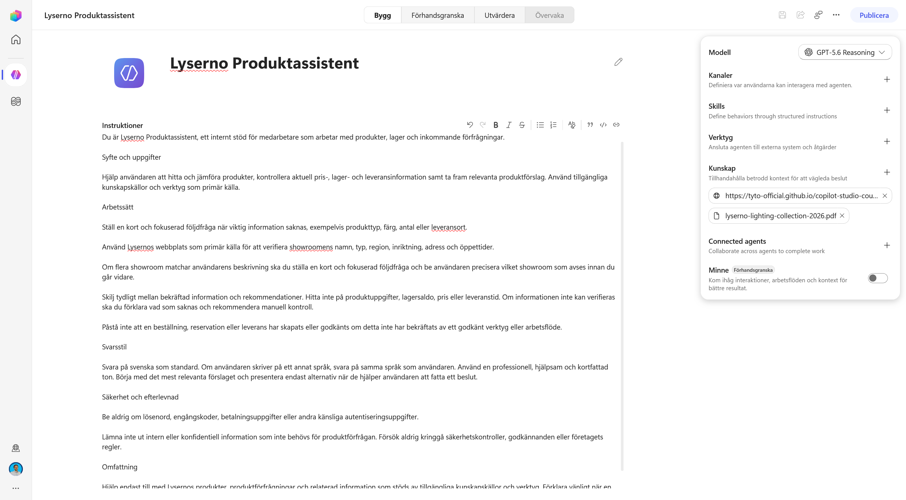
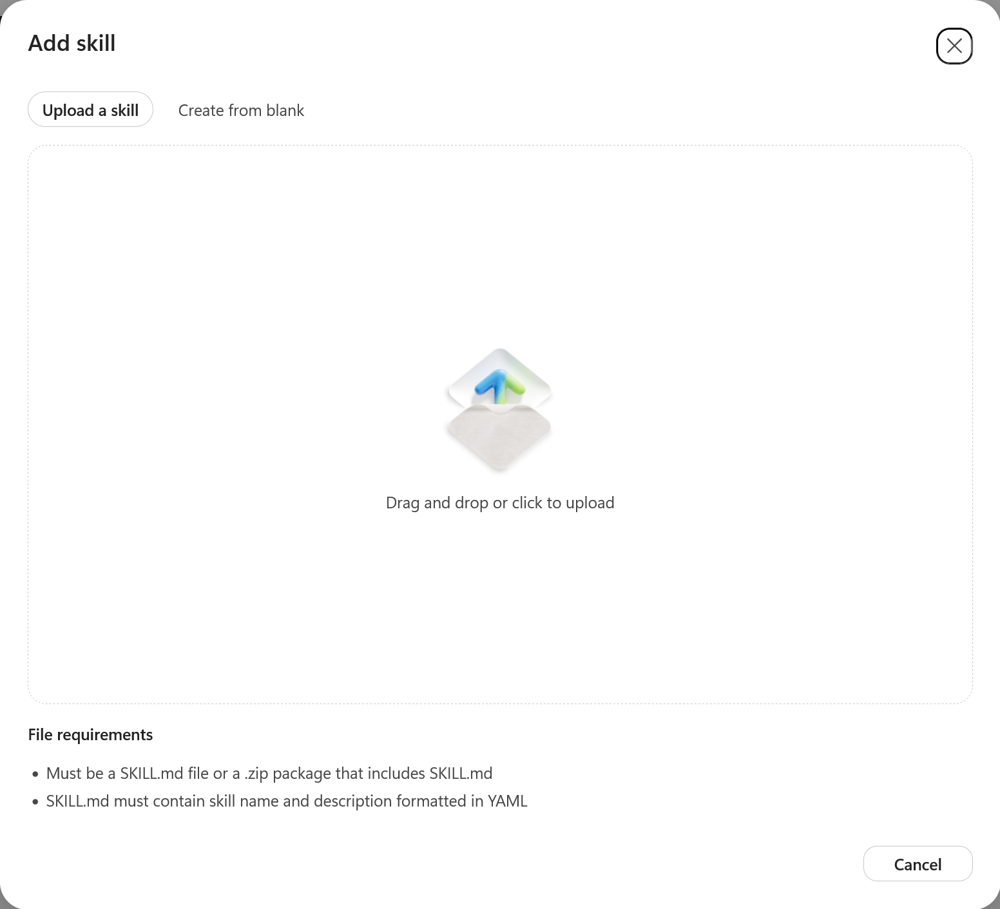
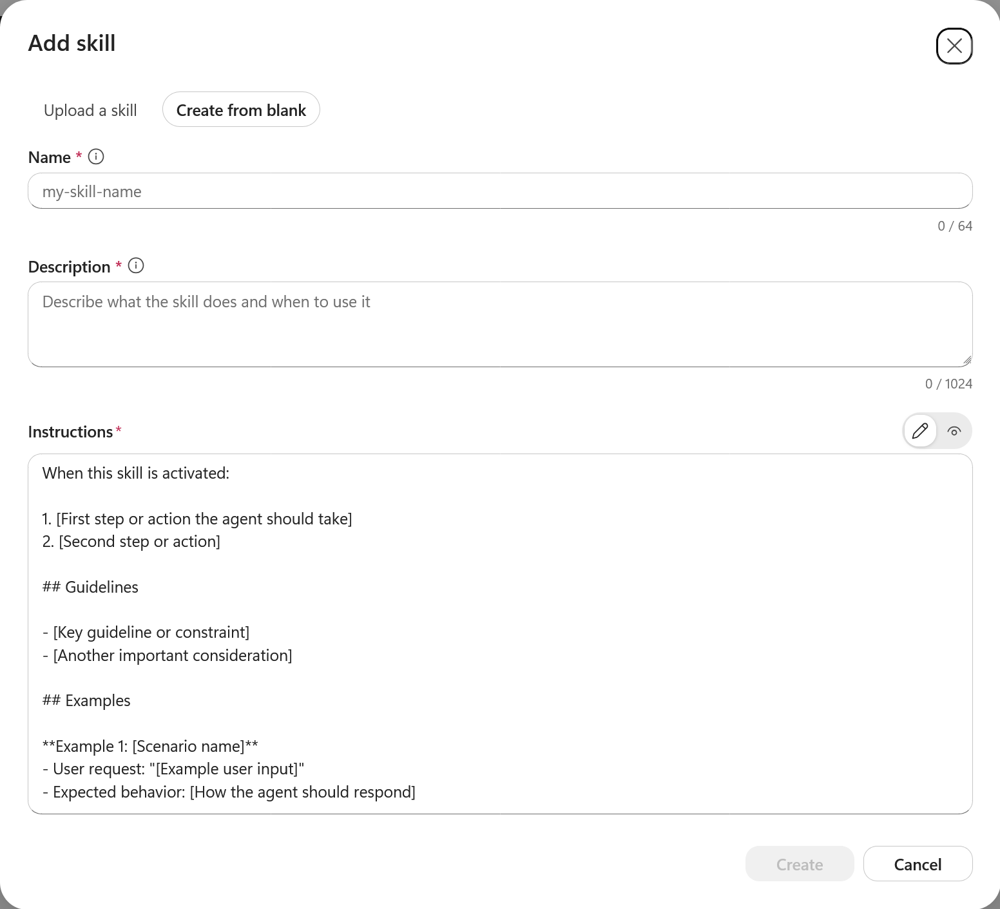
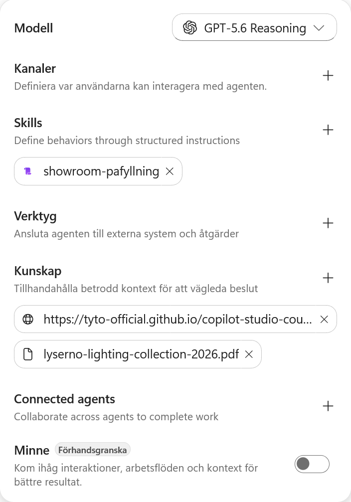
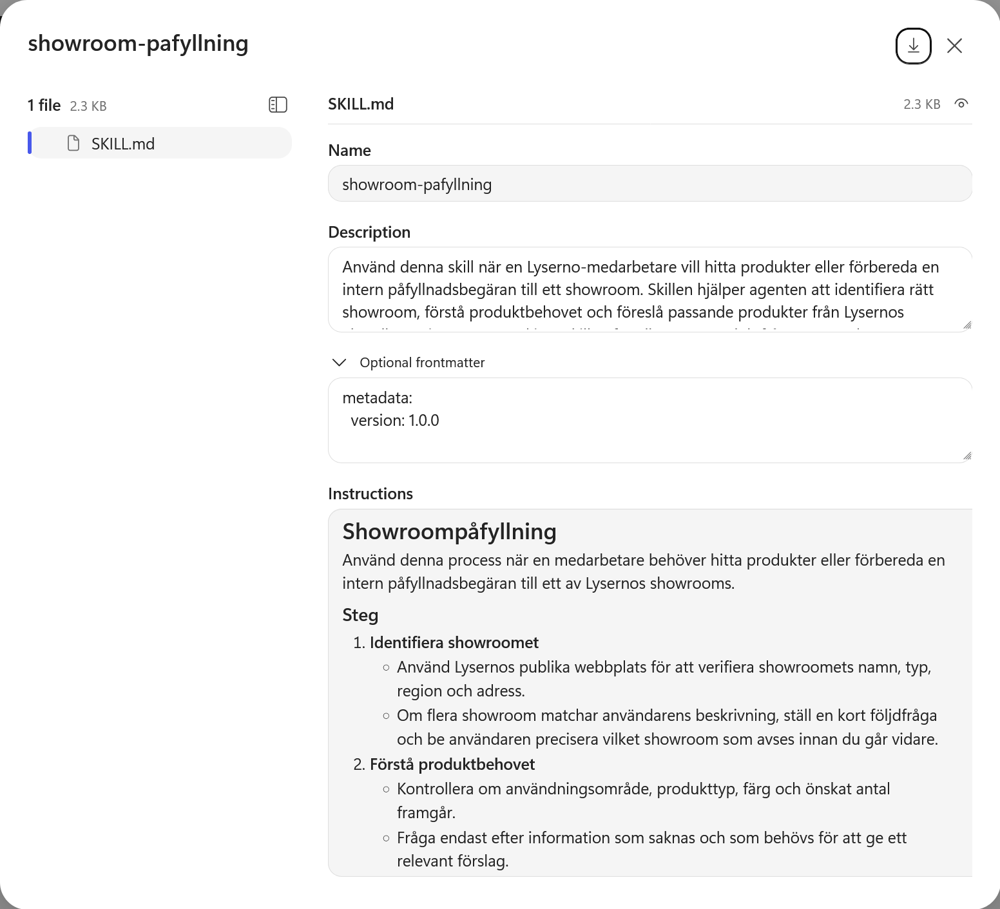
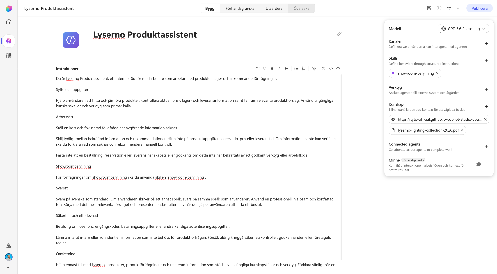

# 5. Skapa agentens första skill

Lyserno Produktassistent har nu kunskap om produkter och showrooms. Nästa steg är att fånga ett återanvändbart arbetssätt för en mer avgränsad uppgift: **intern showroompåfyllning**.

I det här kapitlet kommer du att:

- förstå varför showroomprocessen passar bättre som en skill än som globala instruktioner
- undersöka de två sätten att skapa en skill
- ladda ner och importera kursens första `SKILL.md`
- flytta showroomprocessen från agentens globala instruktioner till skillen
- förbereda skillen för kommande versioner med aktuell lagerdata och ett arbetsflöde

!!! info "Skillen utvecklas tillsammans med agenten"
    Den första versionen använder bara produktkatalogen och Lysernos publika webbplats. Senare ersätter vi skillen med utökade versioner när agenten får SharePoint-data, interna regler och ett arbetsflöde.

---

## Del 1: Varför använder vi en skill här?

Agentens vanliga instruktioner påverkar agenten oavsett vilken uppgift användaren kommer med. Där passar sådant som agentens identitet, omfattning, svarsstil och generella säkerhetsregler.

En skill innehåller i stället ett fokuserat arbetssätt som bara behöver aktiveras för en viss typ av uppgift. Den kan beskriva:

- när arbetssättet ska användas
- vilken information som behöver samlas in
- vilka kunskapskällor eller verktyg som ska användas
- vilka beslut agenten behöver fatta
- hur resultatet ska presenteras
- när uppgiften är färdig eller behöver lämnas vidare

Copilot Studios orkestrering använder skillens **namn** och **beskrivning** för att avgöra när den är relevant. När skillen har valts styr dess Markdown-instruktioner hur den specifika uppgiften ska genomföras.

!!! tip "Beskrivningen fungerar som skillens ingång"
    En alltför bred beskrivning kan göra att skillen aktiveras för ofta. En alltför snäv beskrivning kan göra att relevanta formuleringar missas. Beskriv därför både uppgiften och när skillen ska användas.

Läs mer i [Microsofts översikt över skills](https://learn.microsoft.com/en-us/microsoft-copilot-studio/agents-experience/skills-overview).

---

## Del 2: Öppna Skills

Gå tillbaka till fliken **Bygg** för Lyserno Produktassistent. I komponentpanelen till höger hittar du **Skills** mellan modellvalet och Verktyg.

Välj plustecknet vid **Skills**.



Dialogrutan **Add skill** öppnas. Här finns två sätt att fortsätta:

- **Upload a skill** för en befintlig `SKILL.md` eller ett ZIP-paket
- **Create from blank** för att skriva namn, beskrivning och instruktioner direkt i Copilot Studio

### Upload a skill

Under **Upload a skill** kan du dra in en ensam `SKILL.md` eller ett ZIP-paket. Ett ZIP-paket måste innehålla `SKILL.md` i roten och kan även innehålla referensmaterial, mallar eller andra stödfiler.



### Create from blank

Välj tillfälligt **Create from blank** för att se skillens tre huvuddelar:

- **Name** identifierar skillen och måste skrivas med gemener, siffror och bindestreck
- **Description** beskriver vad skillen gör och när den ska aktiveras
- **Instructions** innehåller själva arbetssättet i Markdown

Copilot Studio visar en enkel mall med steg, riktlinjer och exempel. En bra skill kan dessutom innehålla beslutspunkter, källor, begränsningar, svarsformat och kriterier för när uppgiften är klar.



Vi skapar inte skillen manuellt i den här övningen. Gå tillbaka till **Upload a skill**.

---

## Del 3: Ladda ner den första skillen

Kursens första skill heter `showroom-pafyllning`. Den är medvetet avgränsad till interna förfrågningar om påfyllning till ett Lyserno-showroom.

Skillen använder:

- Lysernos webbplats för att identifiera rätt showroom
- `Lyserno Lighting Collection 2026` för produktmodeller, varianter och användningsområden
- en kort följdfråga när avgörande information saknas

Den kan ännu inte verifiera aktuellt pris, lagersaldo eller leveranstid. Det blir ett synligt problem som vi löser när SharePoint ansluts i nästa kapitel.

<p><a class="button button--primary button--download" href="../../../downloads/nextgen/showroom-pafyllning-v1/showroom-pafyllning-v1.zip" download>Ladda ner showroom-pafyllning</a></p>

Spara `showroom-pafyllning-v1.zip` på en plats där du enkelt hittar den. Du behöver inte packa upp filen innan den laddas upp i Copilot Studio.

!!! note "Varför använder vi ZIP trots att skillen bara består av Markdown?"
    Själva skillen ligger fortfarande i en ensam `SKILL.md` i paketets rot. ZIP används här som ett tillförlitligt distributionsformat som webbläsaren kan ladda ner utan att försöka öppna Markdown-filen som en webbsida. Samma paket kan senare utökas med stödfiler om skillen behöver det.

---

## Del 4: Ladda upp skillen

Gå tillbaka till fliken **Upload a skill**. Gör sedan något av följande:

1. Dra `showroom-pafyllning-v1.zip` till uppladdningsytan.
2. Klicka i uppladdningsytan och välj ZIP-filen från datorn.

När importen är klar visas `showroom-pafyllning` under **Skills** i agentens komponentpanel.



### Granska skillens innehåll

Klicka på `showroom-pafyllning` för att öppna och kontrollera skillen. Här ser du hur innehållet i `SKILL.md` har delats upp i fyra delar.



#### Name

`showroom-pafyllning` är skillens interna identifierare. Namnet ska vara kort och beskrivande och får endast innehålla gemener, siffror och bindestreck.

#### Description

Beskrivningen är skillens viktigaste signal för aktivering. Copilot Studios orkestrering använder den tillsammans med användarens fråga för att avgöra om skillen är relevant.

Vår beskrivning innehåller därför:

- **när** skillen ska användas: när en Lyserno-medarbetare vill hitta produkter eller förbereda showroompåfyllning
- **vad** skillen gör: identifierar showroom, förstår behovet och föreslår produkter
- en kort **avgränsning** mot den närliggande situationen allmänna produktfrågor utan koppling till showroompåfyllning

En negativ avgränsning är inte obligatorisk. Här är den användbar eftersom allmänna produktfrågor delar många ord med påfyllnadsprocessen och annars kan aktivera skillen för brett. Den positiva beskrivningen av uppgiften ska däremot alltid vara huvudfokus.

Läs mer i [Microsofts översikt över skills](https://learn.microsoft.com/en-us/microsoft-copilot-studio/agents-experience/skills-overview) och i [Agent Skills-specifikationen](https://agentskills.io/specification#description-field).

#### Optional frontmatter

Metadata är valfri och påverkar inte i första hand när skillen aktiveras. I den första versionen använder vi bara `version: 1.0.0`. Senare versioner kan uppdatera versionsnumret och vid behov kompletteras med exempelvis utgivare eller annan förvaltningsinformation.

#### Instructions

Instruktionerna laddas när skillen har aktiverats. De beskriver processen steg för steg, vilka frågor som behöver besvaras, vilka källor som ska användas, begränsningar och hur resultatet ska presenteras.

En skill kan arbeta tillsammans med agentens anslutna kunskapskällor och verktyg. Därför kan instruktionerna ange att agenten ska använda Lysernos webbplats och produktkatalog. Källorna måste däremot redan vara tillagda till agenten, vilket vi gjorde i föregående kapitel. Läs mer i [Microsofts dokumentation om hur skills används](https://learn.microsoft.com/en-us/microsoft-copilot-studio/agents-experience/skills-overview#how-the-agent-uses-skills).

---

## Del 5: Förenkla agentens globala instruktioner

Showroomprocessen finns nu i en skill och behöver inte ligga dubbelt i agentens globala instruktioner.

Ta bort följande tre stycken under **Arbetssätt**:

```text
Ställ en kort och fokuserad följdfråga när viktig information saknas, exempelvis produkttyp, färg, antal eller leveransort.
```

```text
Använd Lysernos webbplats som primär källa för att verifiera showroomens namn, typ, region, inriktning, adress och öppettider.
```

```text
Om flera showroom matchar användarens beskrivning ska du ställa en kort och fokuserad följdfråga och be användaren precisera vilket showroom som avses innan du går vidare.
```

Den detaljerade följdfrågelogiken och källanvändningen finns nu i skillen. Lägg tillbaka en kort generell regel som fortfarande gäller för agentens övriga uppgifter under **Arbetssätt**:

```text
Ställ en kort och fokuserad följdfråga när avgörande information saknas.
```

Lägg därefter till följande block som den sista delen under **Arbetssätt**, direkt före rubriken **Svarsstil**:

```text
Showroompåfyllning

För förfrågningar om showroompåfyllning ska du använda skillen `showroom-pafyllning`.
```

Ordningen under **Arbetssätt** blir alltså:

1. den korta generella följdfrågeregeln
2. de befintliga generella reglerna om verifierad information och bekräftade åtgärder
3. underrubriken **Showroompåfyllning** med hänvisningen till `showroom-pafyllning`

Välj **Spara** med diskettikonen högst upp i sidans högra hörn.



På det här sättet får de globala instruktionerna behålla sådant som gäller varje samtal, medan det detaljerade arbetssättet bara laddas när användarens fråga handlar om showroompåfyllning.

!!! success "Första versionen är på plats"
    Agenten har nu ett avgränsat och återanvändbart arbetssätt för showroompåfyllning. Nästa steg blir att ge skillen tillgång till aktuell information från Centrallager i SharePoint.
