# 6. Anslut Centrallager som verktyg

Lyserno Produktassistent kan nu hitta passande produkter och identifiera rätt showroom. Produktkatalogen innehåller däremot inte information som förändras ofta, exempelvis aktuellt pris, lagersaldo och leveranstid.

I det här kapitlet ansluter du därför SharePoint-listan **Centrallager** som ett verktyg. Agenten kan då kombinera stabil produktkunskap med aktuell verksamhetsdata.

I det här kapitlet kommer du att:

- skilja mellan anslutningsprogram, MCP-servrar och arbetsflöden
- lägga till SharePoint-åtgärden **Hämta objekten**
- avgränsa verktyget till Lyserno Produktportal och listan Centrallager
- granska verktygets in- och utdata
- förbereda en ny version av skillen `showroom-pafyllning`

!!! info "Kunskap och verktyg fyller olika funktioner"
    Kunskapskällorna hjälper agenten att förstå sortimentet och hitta relevant innehåll. Verktyget hämtar aktuell, strukturerad information från ett externt system när den behövs i samtalet.

---

## Del 1: Öppna Verktyg

Gå tillbaka till fliken **Bygg** för Lyserno Produktassistent. Välj plustecknet vid **Verktyg** i komponentpanelen till höger.

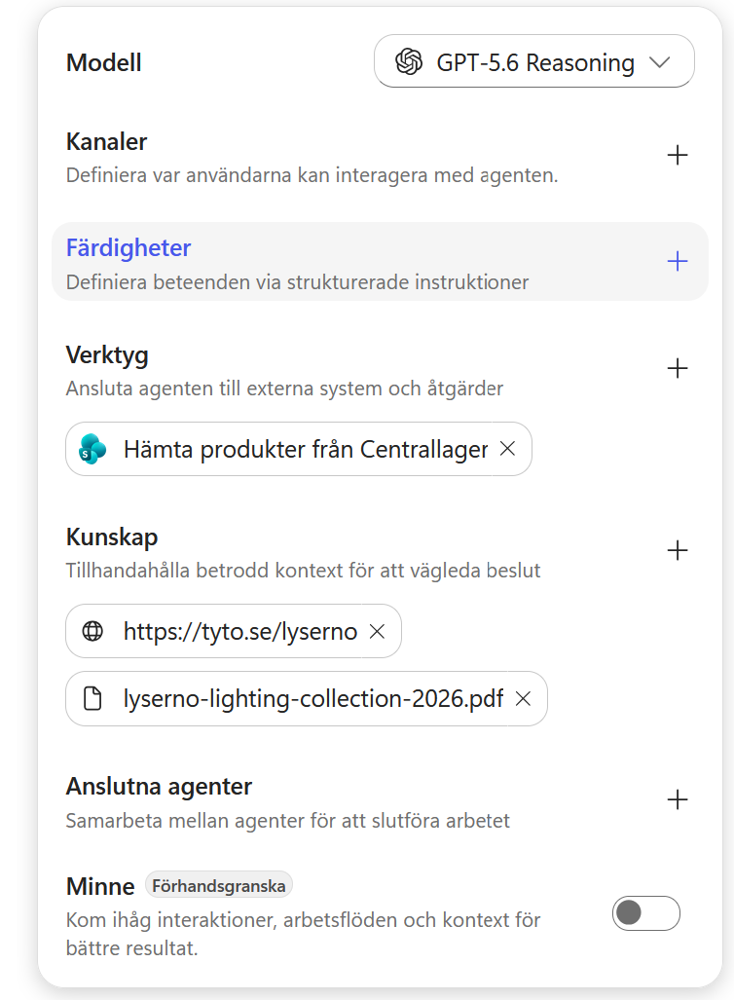

Dialogrutan **Lägg till verktyg** öppnas. Här kan du välja mellan flera typer av verktyg.

---

## Del 2: Förstå verktygstyperna

Ett verktyg är en extern förmåga som agenten kan anropa under ett samtal. Copilot Studios orkestrering använder bland annat användarens fråga, agentens instruktioner samt verktygets namn och beskrivning för att avgöra om verktyget behövs.

### Utvalt

Fliken **Utvalt** visar ett urval av vanliga Microsoft-tjänster. Vilka alternativ som visas kan förändras och skilja sig mellan miljöer.

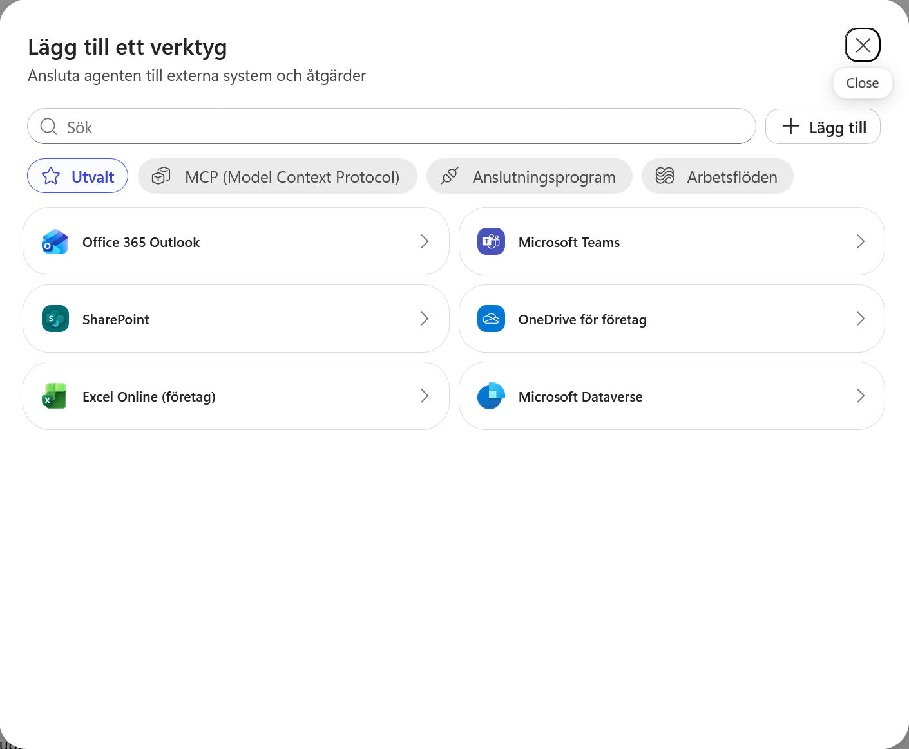

### MCP

En MCP-server använder **Model Context Protocol** för att göra en samling verktyg tillgänglig genom ett gemensamt, standardiserat gränssnitt. När en MCP-server ansluts blir de verktyg som servern exponerar tillgängliga för agentens orkestrering.

Vissa servrar är avgränsade till ett område, exempelvis e-post, kalender, Teams eller SharePoint. **Work IQ MCP** ger en bredare ingång till Microsoft 365 och exponerar generella verktyg för att bland annat läsa, skapa, uppdatera och söka efter Microsoft 365-information. Vilka data och åtgärder som faktiskt är tillgängliga styrs fortfarande av identitet, behörigheter och organisationens policyer.

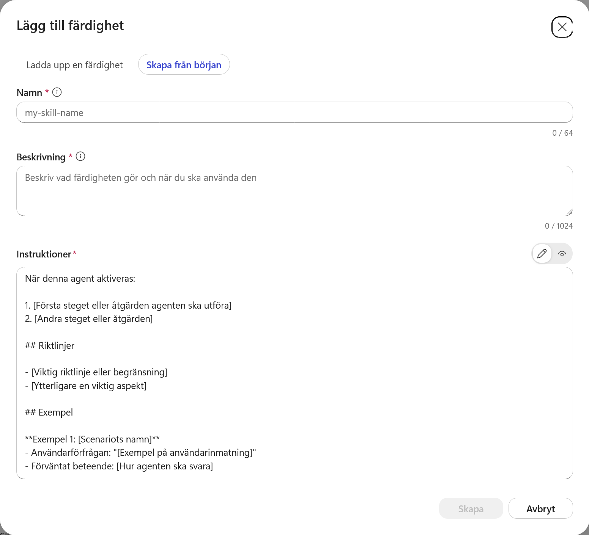

!!! note "Brett eller avgränsat"
    En bred MCP-server kan vara effektiv när agenten behöver arbeta över flera Microsoft 365-tjänster. Ett enskilt anslutningsprogram passar bättre när uppgiften ska begränsas till en tydlig åtgärd mot ett bestämt system. I den här övningen behöver agenten bara läsa från en specifik SharePoint-lista, så vi väljer ett avgränsat anslutningsprogram.

### Anslutningsprogram

Power Platform-anslutningsprogram ger färdiga integrationer till Microsoft-tjänster och externa system. Varje anslutningsprogram innehåller specifika åtgärder. SharePoint-anslutningsprogrammet innehåller exempelvis separata åtgärder för att hämta, skapa och uppdatera listobjekt.

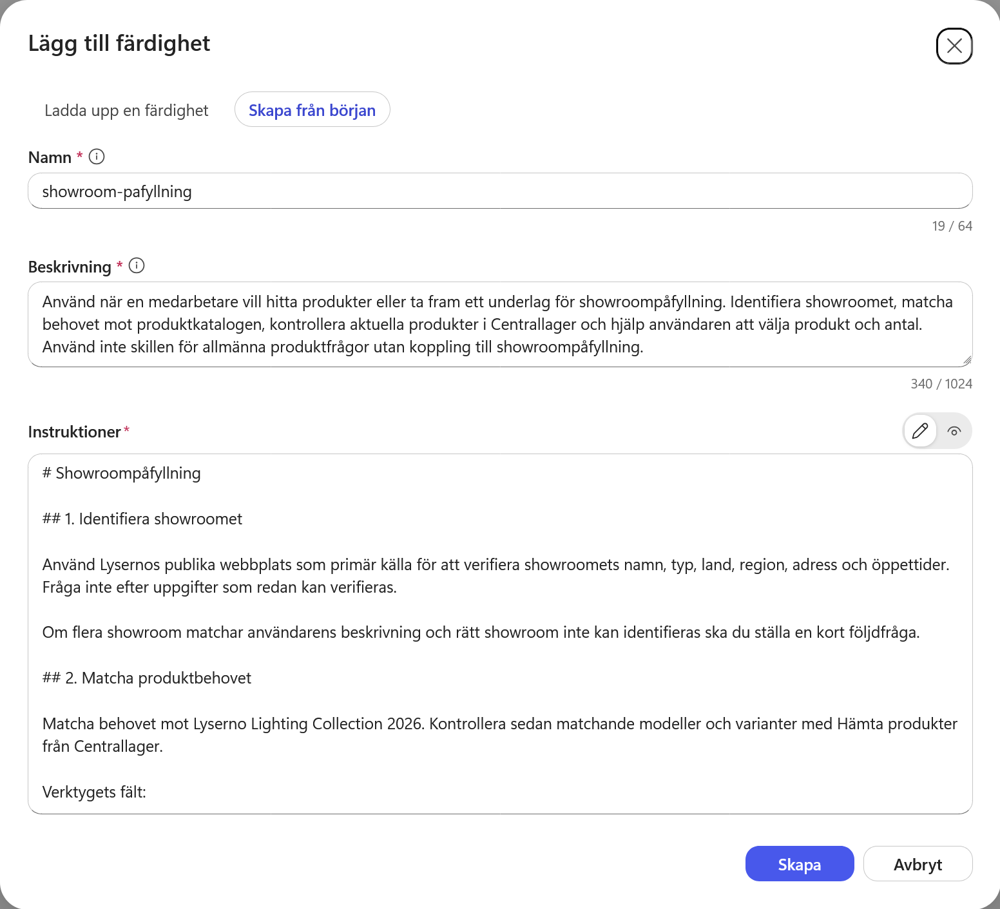

### Arbetsflöden

Ett arbetsflöde passar när agenten behöver starta en återkommande process med flera förutbestämda steg. Flödet kan fortfarande innehålla dynamiska delar, men dess övergripande väg är definierad i förväg och blir därför mer förutsägbar än agentens egen orkestrering.

I den här listan visas arbetsflöden som kan startas av en agent. Vi bygger ett sådant arbetsflöde senare i kursen.

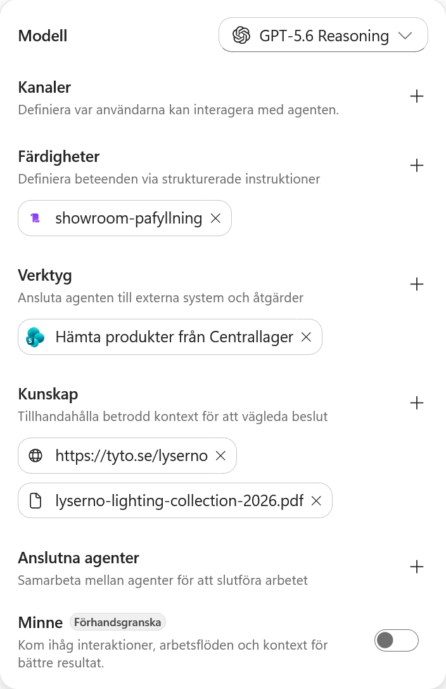

### Lägg till ett eget verktyg

Med knappen **Lägg till** kan du även ansluta en MCP-server eller skapa ett nytt arbetsflöde. Vi använder inte de alternativen i det här kapitlet.

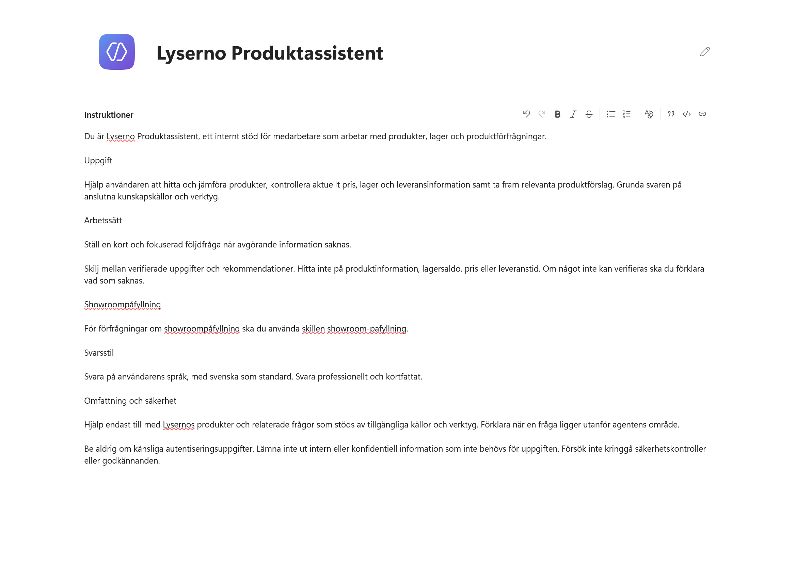

| Verktygstyp | Passar bäst när |
| --- | --- |
| **Anslutningsprogram** | agenten behöver en tydlig, färdig åtgärd mot en välkänd tjänst |
| **MCP-server** | agenten behöver en samling verktyg genom ett standardiserat gränssnitt |
| **Arbetsflöde** | en process består av flera återkommande och förutbestämda steg |

Läs mer i [Microsofts översikt över tillgängliga verktyg](https://learn.microsoft.com/en-us/microsoft-copilot-studio/agents-experience/tools-available), [Work IQ MCP](https://learn.microsoft.com/en-us/microsoft-365/copilot/extensibility/work-iq/mcp/overview) och [arbetsflöden i Copilot Studio](https://learn.microsoft.com/en-us/microsoft-copilot-studio/workflows-experience/flows-overview).

---

## Del 3: Lägg till Hämta objekten

Öppna fliken **Anslutningsprogram** och sök efter:

```text
Hämta objekten
```

Välj SharePoint-åtgärden **Hämta objekten**.

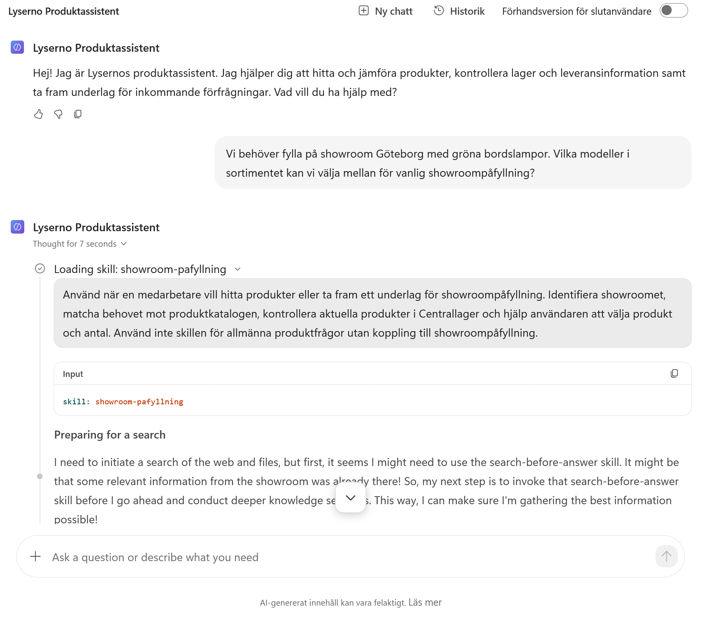

!!! warning "Välj Hämta objekten i plural"
    **Hämta objekten** kan returnera flera rader och kan filtrera fram relevanta produkter. **Hämta objektet** hämtar ett enda listobjekt och kräver att rätt objekt-ID redan är känt.

Kontrollera att åtgärden kommer från **SharePoint** och välj **Lägg till**.


När åtgärden har lagts till visas den under **Verktyg** i agentens komponentpanel. Klicka på **Hämta objekten** för att konfigurera den.

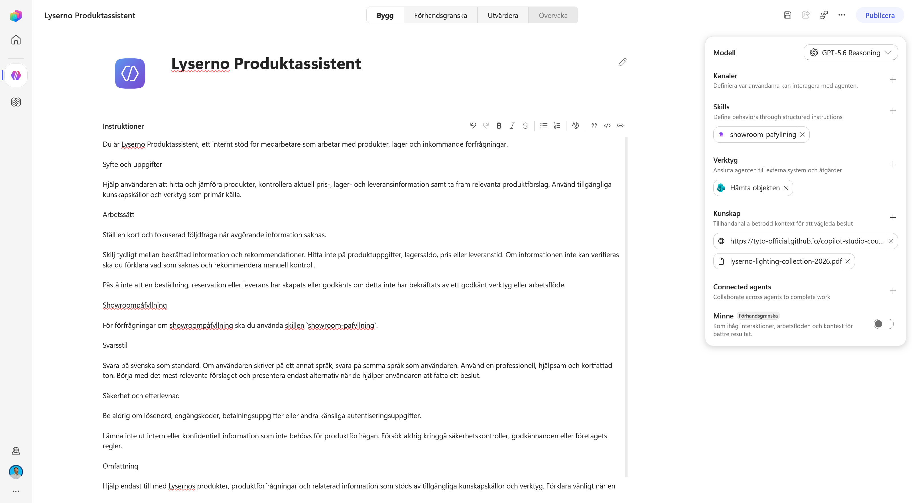

---

## Del 4: Namnge verktyget

Under **Information** ser du verktygets namn, beskrivning och autentiseringsläge.

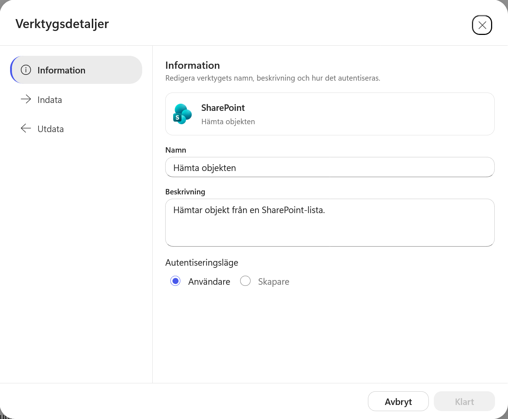

Ändra **Namn** till:

```text
Hämta Centrallager Status
```

Låt beskrivningen vara:

```text
Hämtar objekt från en SharePoint-lista.
```

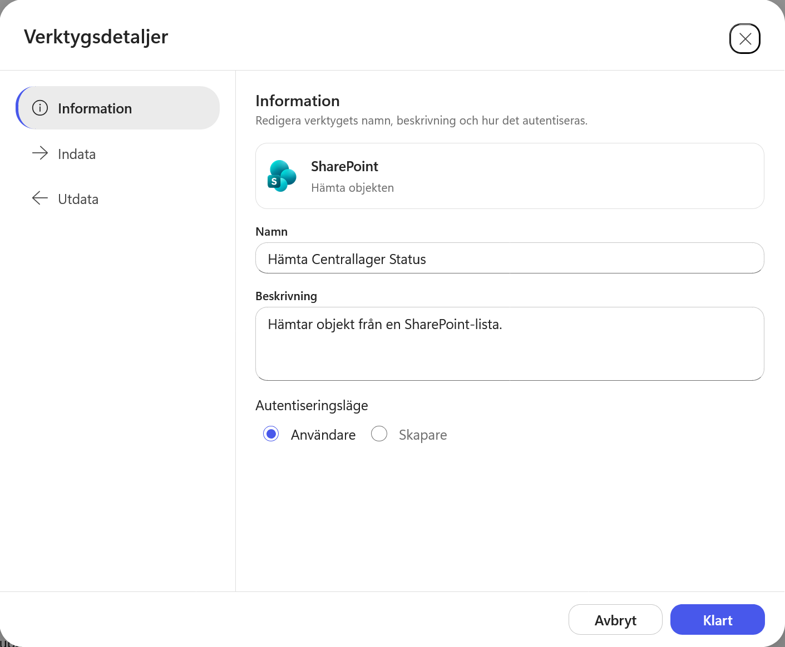

!!! tip "Namn och beskrivning hjälper orkestreringen"
    Agenten använder verktygets namn och beskrivning när den avgör om ett anrop är relevant. Ett verksamhetsnära namn gör därför verktyget lättare att skilja från andra SharePoint-åtgärder som kan läggas till senare.

Låt autentiseringsläget vara **Användare**. Då arbetar anslutningen med den inloggade användarens behörigheter.

---

## Del 5: Lås verktyget till Lyserno Produktportal

Välj **Indata** i vänstermenyn. Här konfigurerar du vilka värden som skickas när verktyget anropas.


För **Webbplatsadress** är **AI** valt från början. Det innebär att agenten själv försöker ange en SharePoint-adress vid varje anrop. I den här övningen ska verktyget alltid använda samma webbplats.

1. Välj **Värde** under **Hur fylls det här i?**
2. Öppna fältet **Välj**.

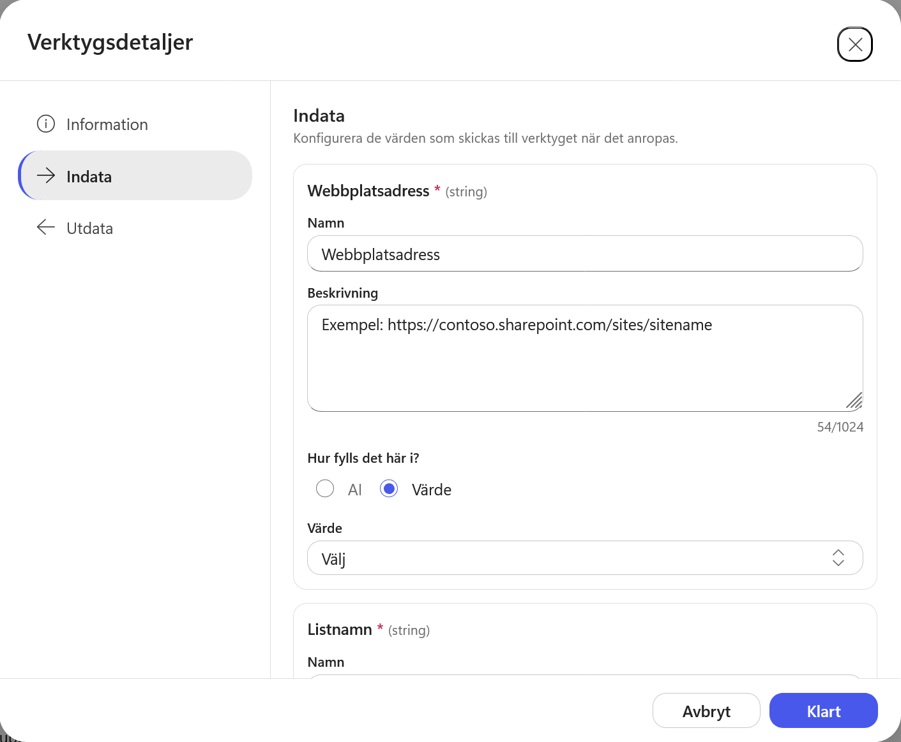

Välj **Ny** för att skapa ett fast värde.

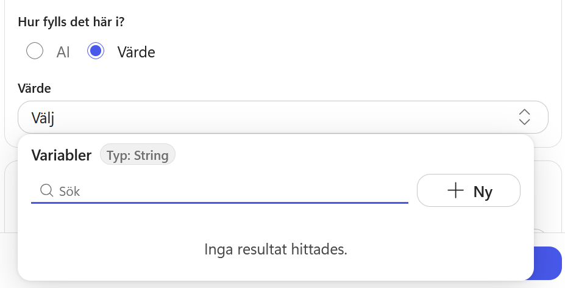

Öppna listan **Webbplatsadress** och välj **Lyserno Produktportal**.

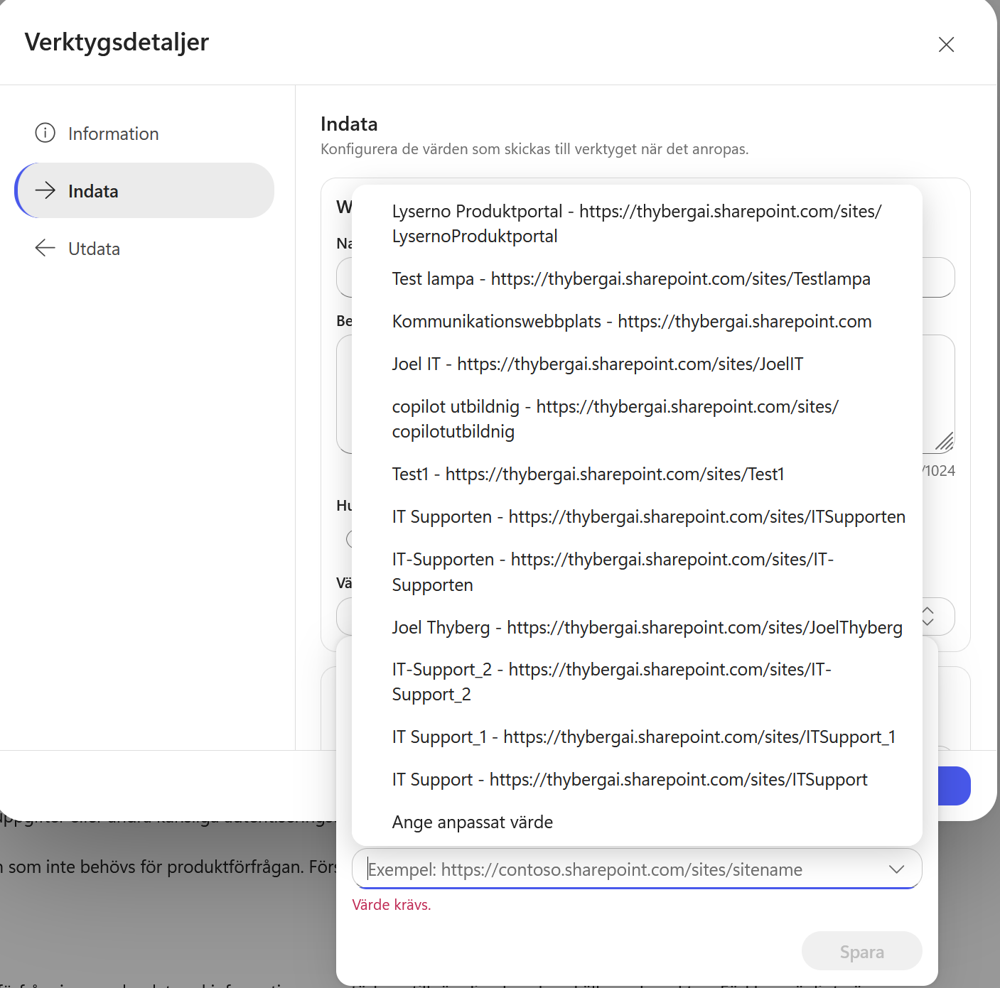

Behåll det automatiskt skapade variabelnamnet och välj **Spara**.

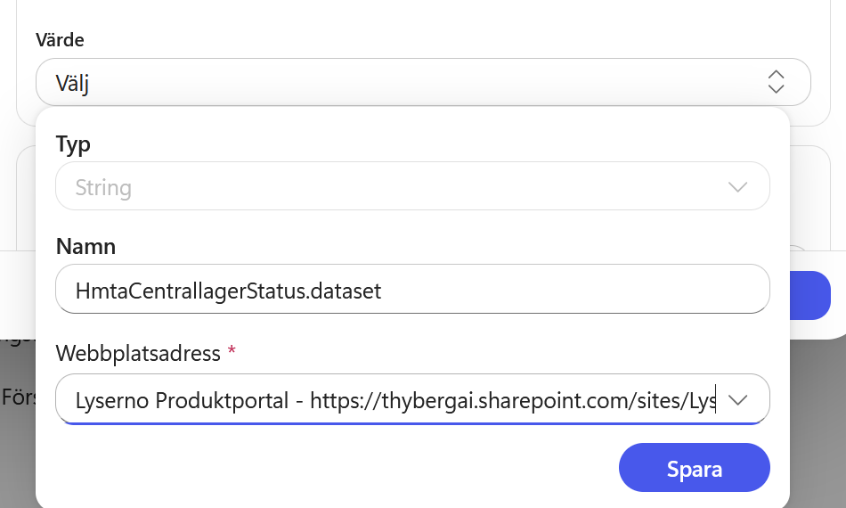

Webbplatsadressen visas nu som ett fast värde i verktygets indata.

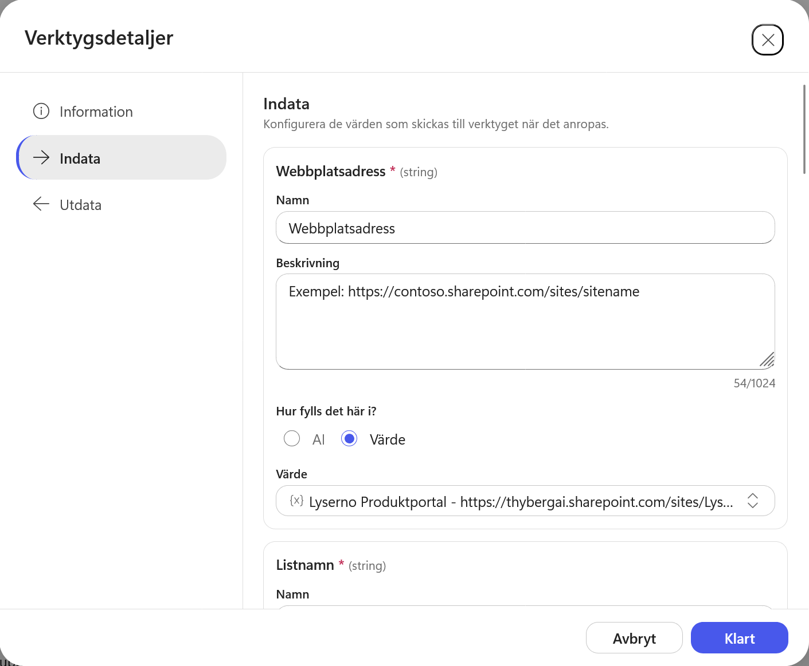

---

## Del 6: Lås verktyget till listan Centrallager

Scrolla ned till **Listnamn**. Även det här värdet fylls inledningsvis i av AI.

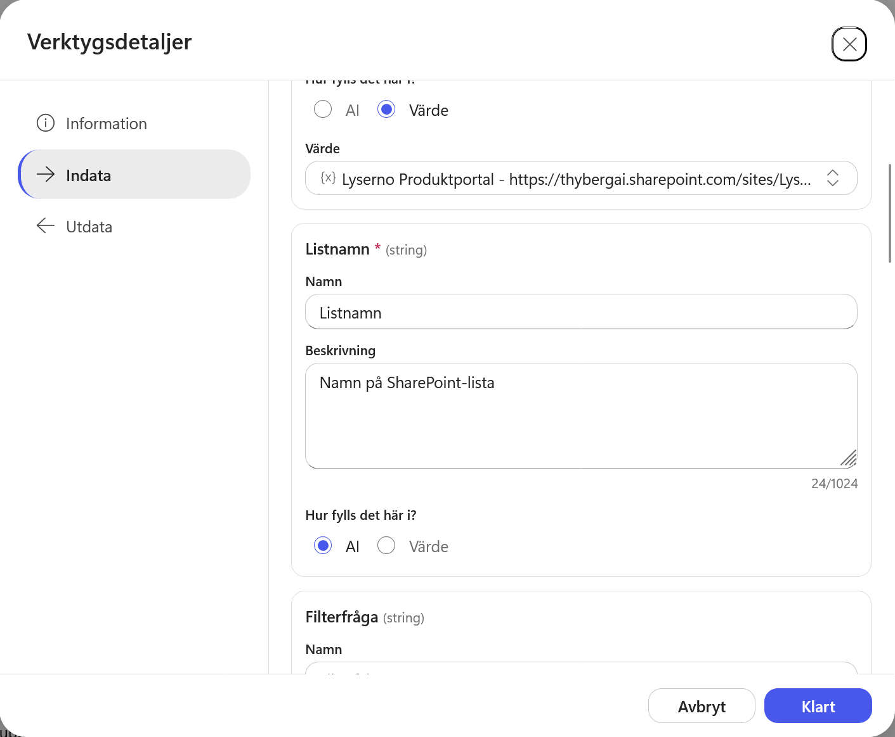

Gör på samma sätt som för webbplatsadressen:

1. Välj **Värde**.
2. Öppna fältet **Välj**.
3. Välj **Ny**.

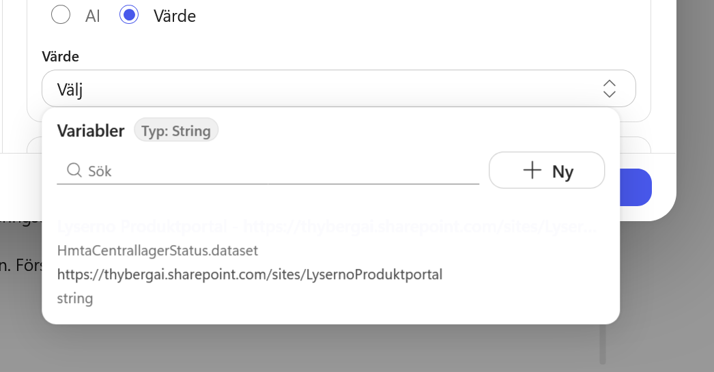

Öppna listan **Listnamn** och välj **Centrallager**.

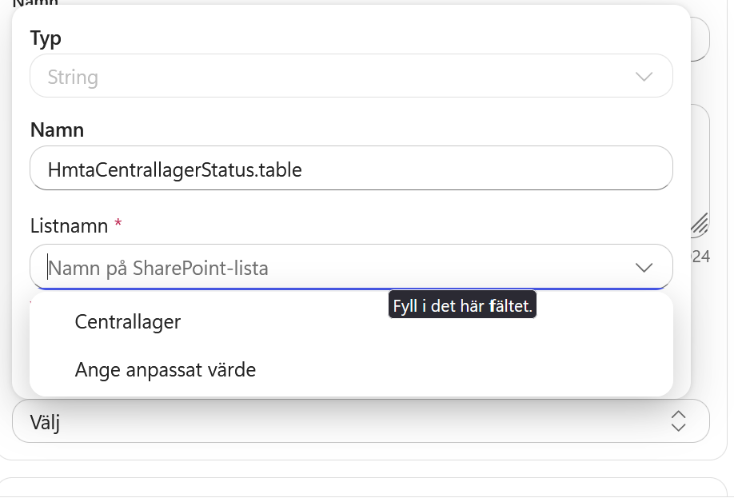

Behåll det automatiskt skapade variabelnamnet och välj **Spara**.

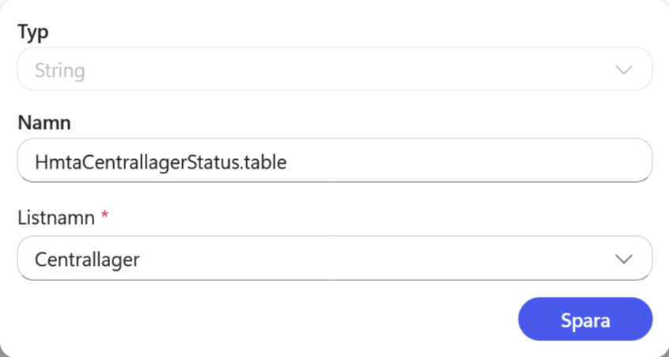

!!! info "Varför använder vi fasta värden?"
    Agenten behöver inte välja webbplats och lista vid varje anrop. Verktyget är nu avgränsat till den datakälla som kursen har godkänt. Övriga val, exempelvis vilka produkter som behöver hämtas och hur resultatet ska tolkas, kan fortfarande göras dynamiskt utifrån användarens fråga.

---

## Del 7: Granska utdata och slutför

Välj **Utdata** i vänstermenyn. Åtgärden returnerar en objektlista i fältet `Value`. Vi behöver inte ändra något här.

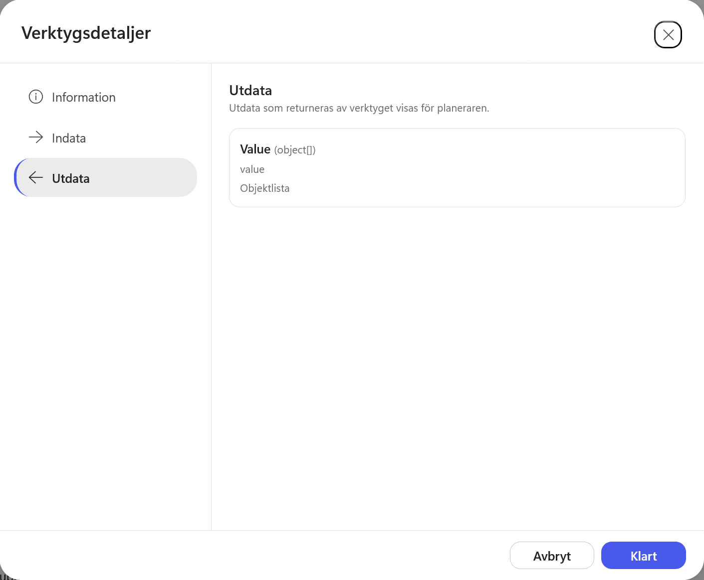

Välj **Klar** nere till höger för att spara verktygskonfigurationen.

SharePoint-åtgärden [Hämta objekten](https://learn.microsoft.com/en-us/connectors/sharepointonline/#get-items) kan hämta flera listobjekt. Den har även valfria parametrar för bland annat filter, sortering och begränsning av antal rader. I den nya agentupplevelsen kan orkestreringen fylla sådana parametrar när de behövs.

---

## Del 8: Nästa version av skillen

Verktyget gör aktuell lagerdata tillgänglig, men ett verktyg beskriver inte hela Lysernos arbetssätt. Nästa version av `showroom-pafyllning` behöver därför förklara hur katalogen och Centrallager ska användas tillsammans.

Den utökade skillen ska bland annat ange att agenten ska:

1. hitta passande produktmodeller i katalogen
2. använda **Hämta Centrallager Status** för aktuella varianter
3. matcha vald variant mot rätt SKU
4. beräkna disponibelt saldo som `OnHandQuantity - ReservedQuantity`
5. kontrollera både `SalesStatus` och `ReplenishmentCode`
6. visa produktbilder från `ImageSource`
7. presentera verifierade produktalternativ och be användaren välja
8. föreslå ett likvärdigt alternativ med `RC10` när en matchande produkt inte får beställas

Ladda ner den utökade skillen:

<p><a class="button button--primary button--download" href="../../../downloads/nextgen/showroom-pafyllning-v2/showroom-pafyllning-v2.zip" download>Ladda ner showroom-pafyllning v2</a></p>

Ersätt sedan den befintliga versionen:

1. Gå tillbaka till fliken **Bygg**.
2. Klicka på skillen `showroom-pafyllning`.
3. Öppna menyn med de tre punkterna och välj **Replace**.
4. Ladda upp `showroom-pafyllning-v2.zip`.
5. Kontrollera att metadata visar `version: 1.2.0` och stäng skillen.
6. Välj **Spara** med diskettikonen högst upp i sidans högra hörn.

På så sätt testar vi inte bara om agenten *kan* anropa SharePoint, utan om den följer ett tydligt och återanvändbart arbetssätt när produktkunskap och aktuell lagerdata kombineras.

!!! success "Centrallager är anslutet"
    Agenten har nu ett avgränsat verktyg för aktuell SharePoint-data och skillen beskriver hur informationen ska användas. Nästa steg blir att testa hela kedjan från produktbehov till verifierat lagersaldo.
