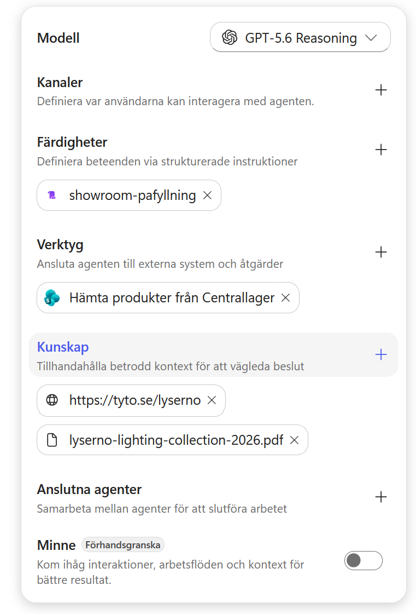
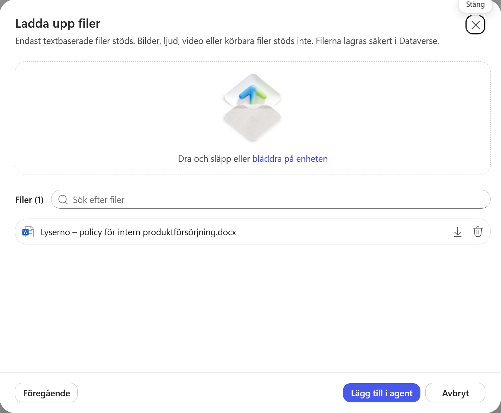
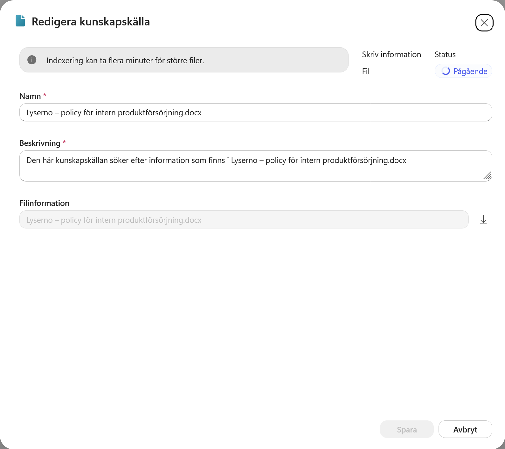
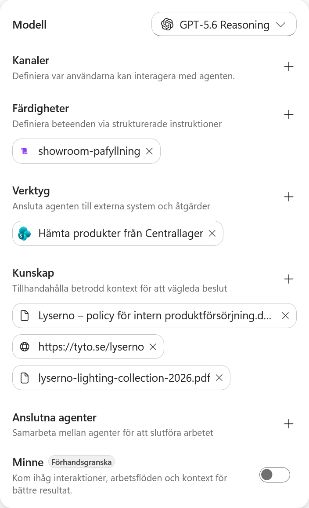
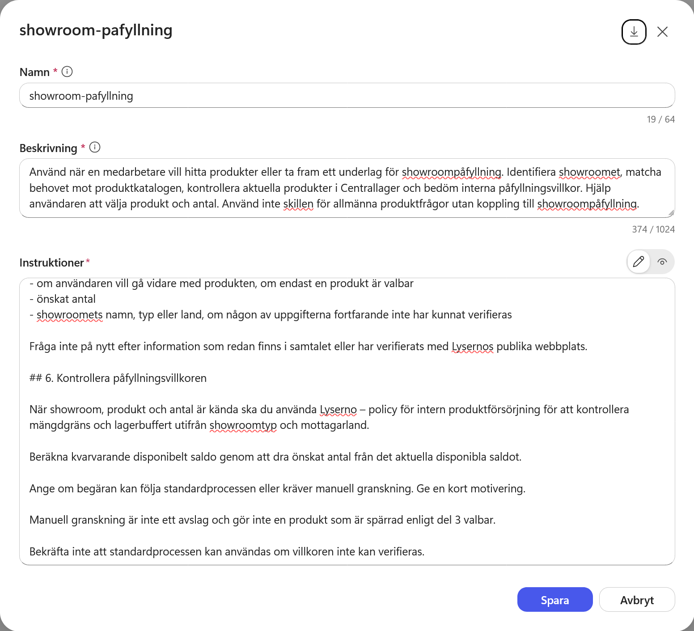
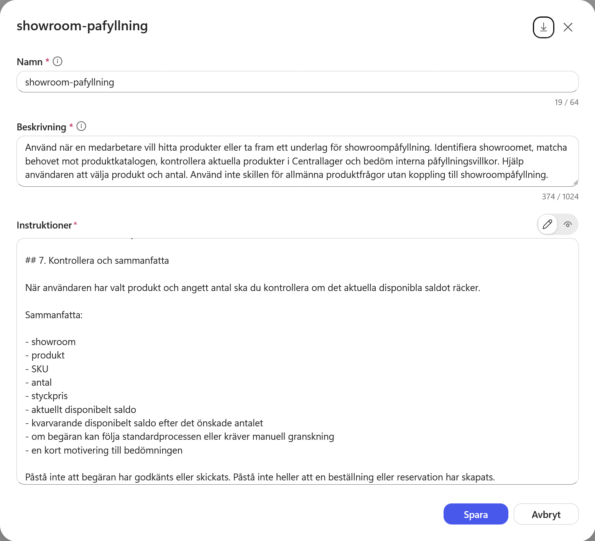
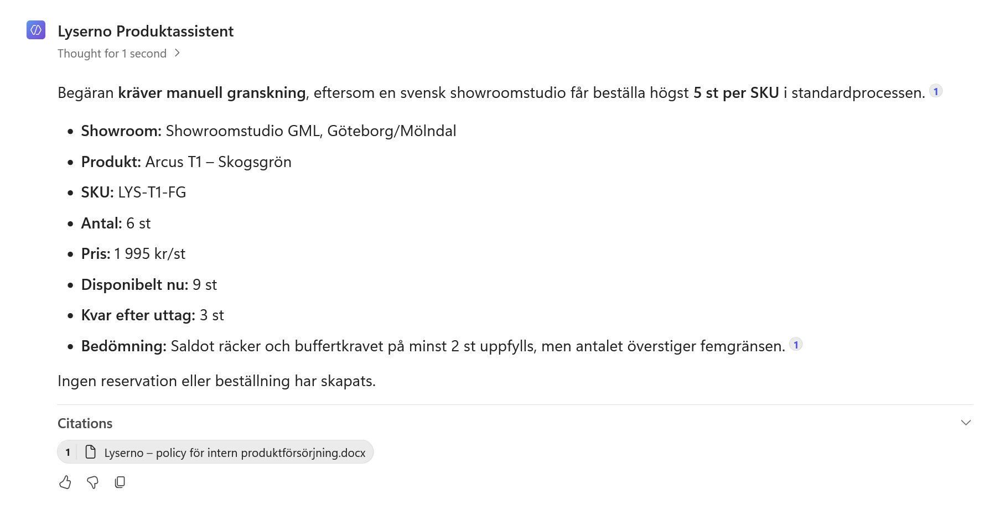

# 7. Lägg till styrdokumentet och uppdatera skillen

Skillen `showroom-pafyllning` kan identifiera showroomet, hitta produkter och kontrollera aktuellt saldo. Den saknar däremot Lysernos interna regler för hur många exemplar olika showroom får begära och hur mycket som måste finnas kvar i centrallagret.

I det här kapitlet lägger du till styrdokumentet **Lyserno – policy för intern produktförsörjning** som kunskapskälla. Sedan uppdaterar du skillen så att den använder policyn när produkt och antal är kända.

När kapitlet är klart har du:

- lagt till det interna styrdokumentet som kunskap
- sett hur mängdgränser och lagerbuffert påverkar standardprocessen
- uppdaterat skillens beskrivning och instruktioner
- testat att agenten skiljer mellan standardprocess och manuell granskning

!!! info "Kunskapen och skillen har olika ansvar"
    Styrdokumentet innehåller de exakta reglerna och kan uppdateras när verksamheten ändrar dem. Skillen beskriver när agenten ska läsa dokumentet, vilka uppgifter som ska kontrolleras och hur resultatet ska presenteras. Skriv därför inte in mängdgränserna en gång till i skillen.

---

## Del 1: Ladda ner och läs styrdokumentet

Ladda ner dokumentet innan du öppnar agenten:

<p><a class="button button--primary button--download" href="../../../downloads/nextgen/Lyserno%20%E2%80%93%20policy%20f%C3%B6r%20intern%20produktf%C3%B6rs%C3%B6rjning.docx" download>Ladda ner styrdokumentet</a></p>

Dokumentet skiljer mellan mängdgräns och lagerbuffert:

| Mottagare | Högsta antal i standardprocessen | Minsta saldo efter påfyllningen |
| --- | ---: | ---: |
| Showroomstudio i Sverige | 5 per SKU och begäran | 2 |
| Flagship-showroom i Sverige | 10 per SKU och begäran | Ingen särskild buffert |
| Showroomstudio utanför Sverige | 3 per SKU och begäran | 2 |

Gränserna är inkluderande. En svensk showroomstudio får exempelvis begära 5 exemplar genom standardprocessen om minst 2 exemplar blir kvar disponibla. En begäran om 6 exemplar kräver manuell granskning även om saldot räcker.

Kom också ihåg följande:

- Inkommande produkter räknas inte som disponibelt saldo eller lagerbuffert.
- Manuell granskning är inte ett avslag.
- Produkter som är spärrade enligt skillens regler blir inte valbara för att begäran granskas manuellt.
- Ett produktförslag, en skickad begäran, en reservation och ett godkännande är olika steg.

---

## Del 2: Lägg till dokumentet som kunskap

Gå till fliken **Bygg** för Lyserno Produktassistent. Välj plustecknet vid **Kunskap** i panelen till höger.



Dialogrutan **Lägg till kunskap** öppnas. Dra in filen i uppladdningsytan eller välj **Klicka för att bläddra**.


Välj `Lyserno – policy för intern produktförsörjning.docx` och kontrollera att rätt fil visas. Välj sedan **Lägg till i agent**.



---

## Del 3: Kontrollera indexeringen

Dokumentet visas nu under **Kunskap**.


Öppna dokumentet och kontrollera statusen. Direkt efter uppladdningen kan den stå som **Pågående** medan innehållet indexeras.



Du kan fortsätta med skillen medan indexeringen pågår. Vänta tills dokumentet är klart innan du testar frågan i slutet av kapitlet.

---

## Del 4: Öppna skillen

Stäng kunskapskällan och öppna `showroom-pafyllning` under **Färdigheter**.



Den första versionen väljer produkt och kontrollerar lagersaldo. Nu bygger du vidare på den så att agenten även bedömer mängdgräns och lagerbuffert.

---

## Del 5: Uppdatera beskrivningen

Ersätt den befintliga beskrivningen med följande text:

```text
Använd när en medarbetare vill hitta produkter eller ta fram ett underlag för showroompåfyllning. Identifiera showroomet, matcha behovet mot produktkatalogen, kontrollera aktuella produkter i Centrallager och bedöm interna påfyllningsvillkor. Hjälp användaren att välja produkt och antal. Använd inte skillen för allmänna produktfrågor utan koppling till showroompåfyllning.
```

Tillägget **bedöm interna påfyllningsvillkor** gör att skillens beskrivning också täcker kontrollen mot styrdokumentet.

---

## Del 6: Lägg till kontrollen av påfyllningsvillkor

Gå till instruktionerna. Ersätt rubriken `## 6. Kontrollera och sammanfatta` och dess innehåll med följande nya avsnitt:

```markdown
## 6. Kontrollera påfyllningsvillkoren

När showroom, produkt och antal är kända ska du använda Lyserno – policy för intern produktförsörjning för att kontrollera mängdgräns och lagerbuffert utifrån showroomtyp och mottagarland.

Beräkna kvarvarande disponibelt saldo genom att dra önskat antal från det aktuella disponibla saldot.

Ange om begäran kan följa standardprocessen eller kräver manuell granskning. Ge en kort motivering.

Manuell granskning är inte ett avslag och gör inte en produkt som är spärrad enligt del 3 valbar.

Bekräfta inte att standardprocessen kan användas om villkoren inte kan verifieras.
```



Skillen hänvisar till dokumentet med namn, men återger inte gränsvärdena. Agenten hämtar därför de aktuella reglerna från kunskapskällan när kontrollen behövs.

---

## Del 7: Lägg till den uppdaterade sammanfattningen

Lägg till följande avsnitt direkt efter del 6:

```markdown
## 7. Kontrollera och sammanfatta

När användaren har valt produkt och angett antal ska du kontrollera om det aktuella disponibla saldot räcker.

Sammanfatta:

- showroom
- produkt
- SKU
- antal
- styckpris
- aktuellt disponibelt saldo
- kvarvarande disponibelt saldo efter det önskade antalet
- om begäran kan följa standardprocessen eller kräver manuell granskning
- en kort motivering till bedömningen

Påstå inte att begäran har godkänts eller skickats. Påstå inte heller att en beställning eller reservation har skapats.
```

Välj **Spara**.



Det här är version 2 av skillen. Del 1–5 är oförändrade. Den nya del 6 gör policykontrollen och del 7 sammanfattar resultatet.

---

## Del 8: Testa manuell granskning

Kontrollera först att styrdokumentet har indexerats. Öppna sedan **Förhandsgranska**, starta en ny chatt och ställ samma inledande fråga som tidigare:

```text
Vi behöver fylla på showroom Göteborg med gröna bordslampor. Vilka modeller i sortimentet kan vi välja mellan för vanlig showroompåfyllning?
```

När agenten har visat alternativen fortsätter du med:

```text
Vi väljer Arcus T1 – Skogsgrön, 6 stycken, till Showroomstudio GML i Göteborg/Mölndal.
```

Kontrollera att svaret:

- visar rätt showroom, produkt, SKU, antal och styckpris
- visar aktuellt saldo och hur mycket som skulle bli kvar
- anger att begäran kräver manuell granskning eftersom 6 exemplar överstiger gränsen 5
- förklarar att saldot och lagerbufferten ändå räcker
- inte påstår att något har godkänts, skickats eller reserverats
- hänvisar till styrdokumentet som källa



!!! success "Skillen använder nu styrdokumentet"
    Agenten kombinerar produktreglerna och lagerinformationen i skillen med mängdgränserna och lagerbufferten i styrdokumentet. Den kan bedöma om en begäran passar standardprocessen, men utför ännu ingen reservation och skickar ingen begäran.
