# 10. Koppla flödet och slutför skillen

Agentflödet är publicerat, men agenten behöver tydlig information om när verktyget ska användas och vilka värden som ska skickas. I det här kapitlet kontrollerar du verktygets inställningar och ersätter den befintliga skillen med version 3.

När kapitlet är klart kan agenten:

- samla in och återanvända uppgifter som redan finns i samtalet
- visa ett fullständigt underlag och be om bekräftelse
- anropa **Hantera showroompåfyllning** med rätt indata
- återge om lagret reserverades eller om begäran skickades för manuell granskning

---

## Del 1: Gå tillbaka till agenten

Välj **Lyserno Produktassistent** uppe till vänster i arbetsflödet.

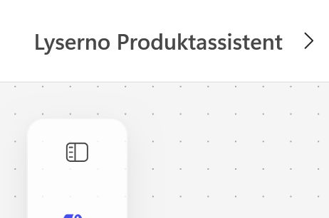

Om Copilot Studio frågar om du vill lämna osparade ändringar väljer du **Kasta bort** endast om flödet redan är publicerat och du inte har gjort fler ändringar som ska sparas.

Du kommer tillbaka till agenten och dialogrutan **Information om arbetsflöde** öppnas.

---

## Del 2: Beskriv arbetsflödesverktyget

Kontrollera att namnet är:

```text
Hantera showroompåfyllning
```

Ange följande beskrivning:

```text
Använd när användaren har bekräftat produktvariant, antal och exakt showroom. Flödet hämtar den valda produkten från Centrallager och kontrollerar aktuellt saldo och villkoren för standardprocessen. Om villkoren är uppfyllda reserveras antalet och ett bekräftelsemejl skickas. Annars skickas begäran för manuell granskning utan att lagret ändras. Flödet returnerar status och meddelande.
```

Beskrivningen talar om för agenten när verktyget är relevant och vad de två möjliga vägarna innebär.

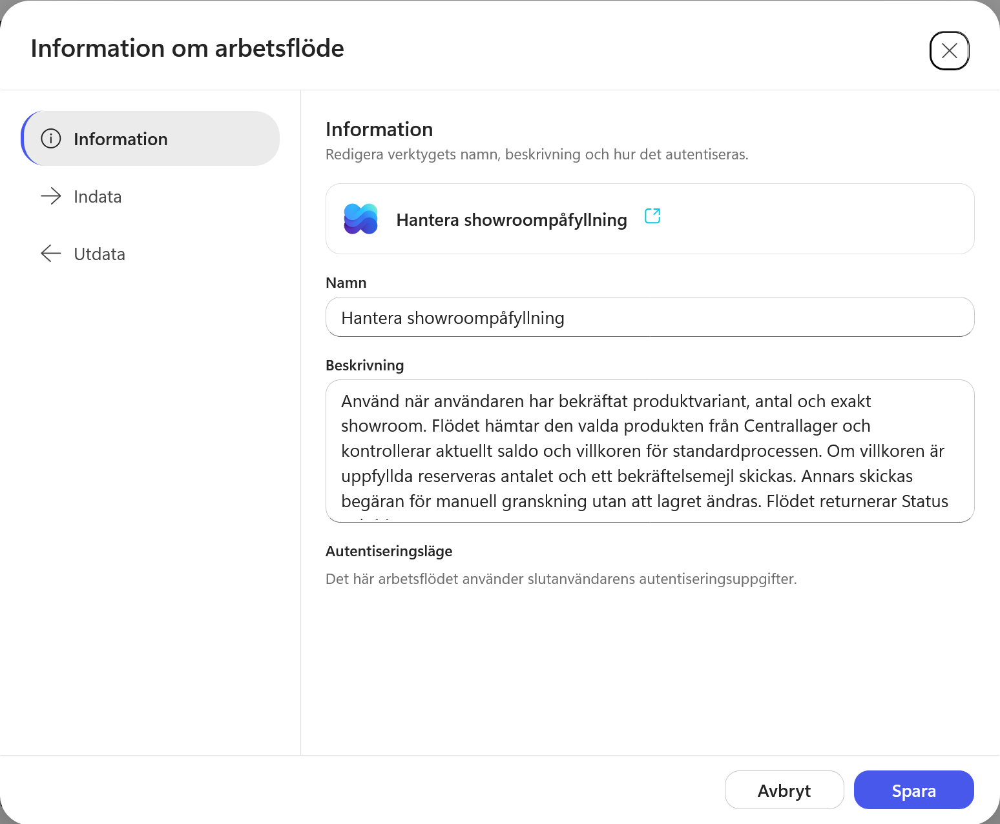

---

## Del 3: Kontrollera verktygets indata

Öppna **Indata**. Kontrollera att alla fem värden har rätt namn och beskrivning:

<div class="table-nowrap-first" markdown="1">

| Indata | Beskrivning |
| --- | --- |
| `ItemID` | SharePoint-ID för den valda produktvarianten i listan Centrallager. Använd inte SKU eller ProductModelID. |
| `Quantity` | Antal enheter som användaren har bekräftat. Måste vara ett positivt heltal. |
| `ShowroomName` | Verifierat exakt namn på det showroom som ska ta emot produkterna. |
| `ShowroomType` | Verifierad showroomtyp: Showroomstudio eller Flagship. |
| `Country` | Verifierat mottagarland: Sverige eller Norge. |

</div>

Behåll **AI** under **Hur fylls det här i?** för samtliga värden. Agenten ska fylla dem från samtalet och skillens instruktioner när verktyget anropas.

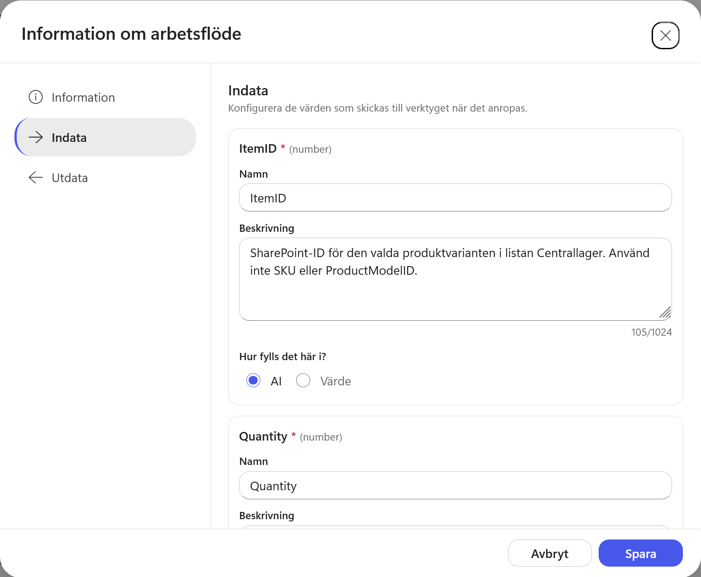

---

## Del 4: Kontrollera verktygets utdata

Öppna **Utdata** och kontrollera att arbetsflödet returnerar:

| Utdata | Typ |
| --- | --- |
| `ResultStatus` | String |
| `ResultMessage` | String |

`ResultStatus` visar vilken väg flödet tog. `ResultMessage` innehåller meddelandet som agenten ska återge för användaren.

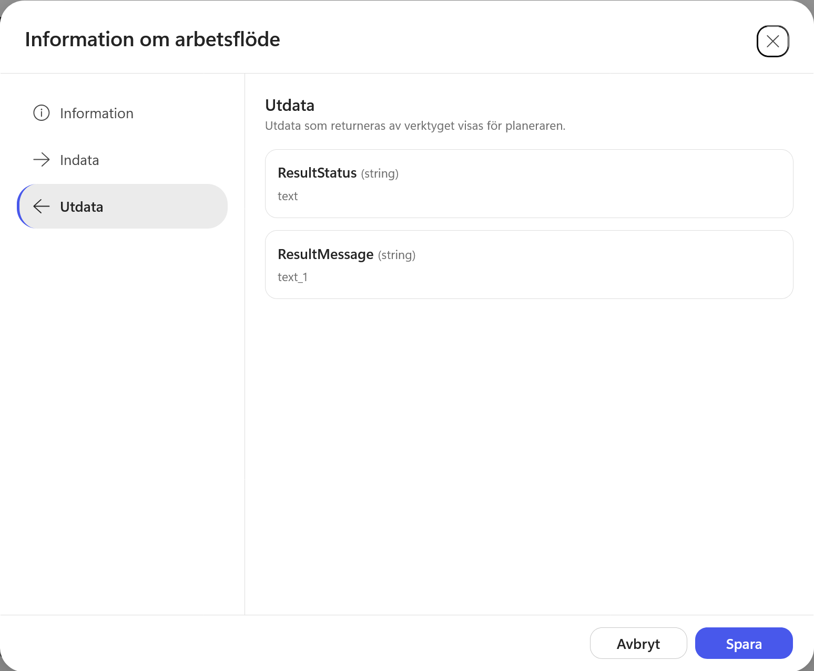

Välj **Spara**.

---

## Del 5: Kontrollera att verktyget har lagts till

Arbetsflödet visas nu under **Verktyg** tillsammans med **Hämta produkter från Centrallager**.

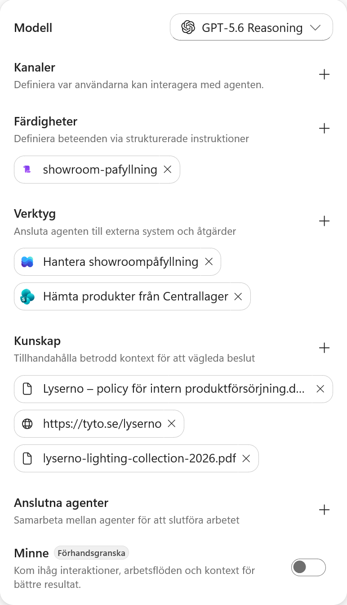

---

## Del 6: Ersätt skillen med version 3

Ladda ner ZIP-filen:

<p><a class="button button--primary button--download" href="../../../downloads/nextgen/showroom-pafyllning-v3/showroom-pafyllning-v3.zip" download>Ladda ner showroom-pafyllning v3</a></p>

ZIP-filen innehåller `SKILL.md` direkt i rotmappen. Filens metadata anger version `3.0.0`.

Klicka på krysset vid den befintliga skillen `showroom-pafyllning`. Bekräfta med **Ta bort**.

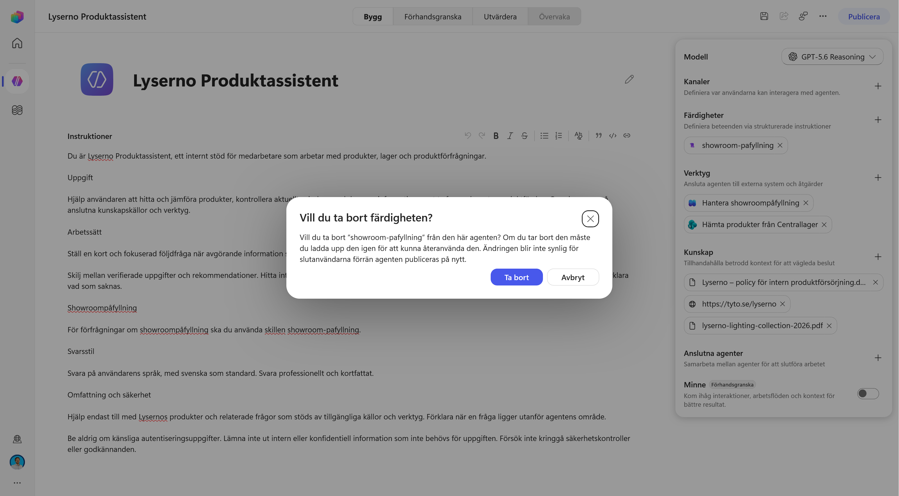

När skillen har tagits bort väljer du plustecknet vid **Färdigheter**.

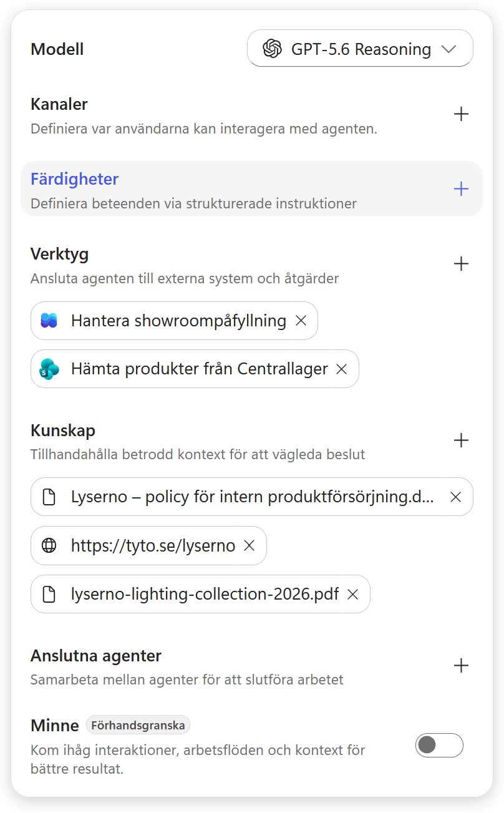

Välj **Ladda upp en färdighet**. Dra ZIP-filen till uppladdningsytan eller klicka i ytan för att välja filen.

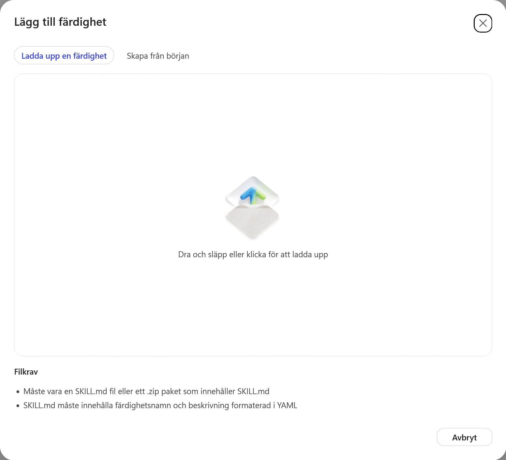

Välj `showroom-pafyllning-v3.zip`. När uppladdningen är klar visas `showroom-pafyllning` åter under **Färdigheter**.


Öppna skillen. Kontrollera att metadata visar version `3.0.0` och att instruktionerna innehåller delarna om bekräftelse, arbetsflödet och resultatet.

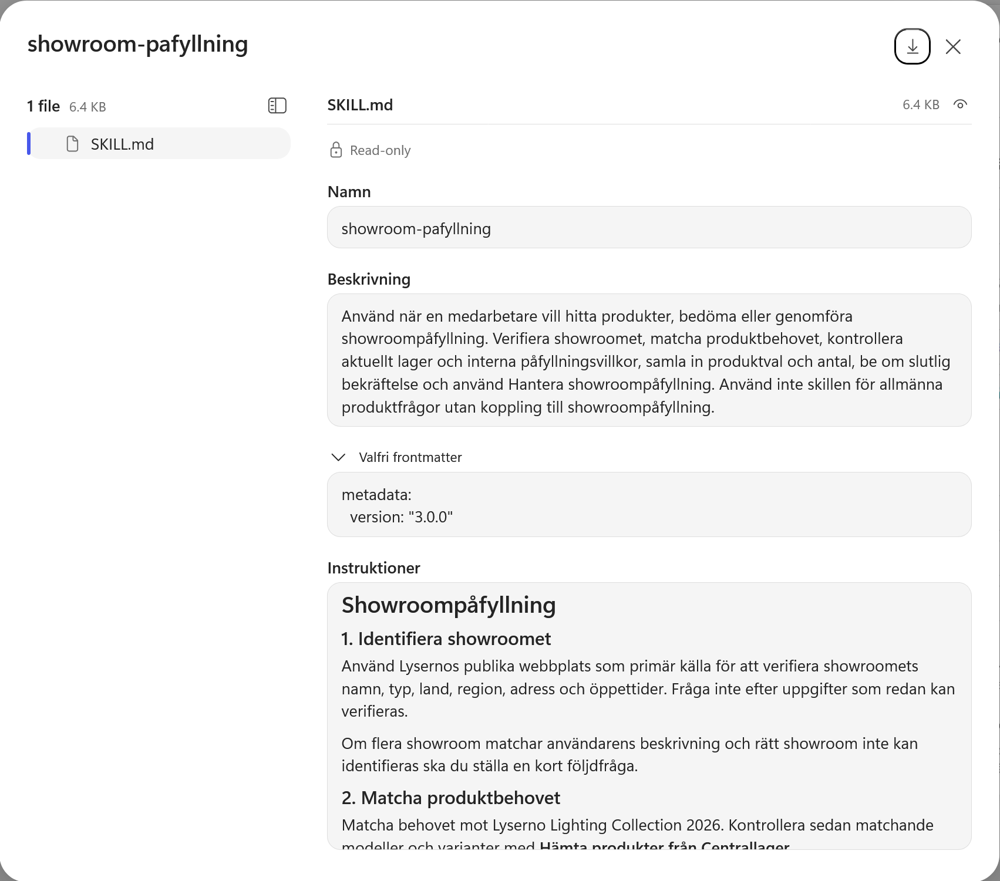

!!! info "Version 3 ersätter den tidigare skillen"
    V2 stannar efter policybedömningen och sammanfattningen. V3 ber dessutom om en slutlig bekräftelse, anropar **Hantera showroompåfyllning** med `ItemID`, `Quantity`, `ShowroomName`, `ShowroomType` och `Country` samt återger resultatet från `ResultStatus` och `ResultMessage`.

    Lägg inte till V3 som en parallell skill. Två skills med samma användningsområde kan ge motstridiga instruktioner.

---

## Del 7: Testa hela standardprocessen

Öppna **Förhandsgranska**, starta en ny chatt och skriv:

```text
Vi behöver fylla på showroom Göteborg med gröna bordslampor. Vilka modeller i sortimentet kan vi välja mellan för vanlig showroompåfyllning?
```

Välj sedan Arcus T1 – Skogsgrön och ange fem exemplar till Showroomstudio GML i Göteborg/Mölndal.

```text
Vi väljer Arcus T1 – Skogsgrön, 5 stycken, till Showroomstudio GML i Göteborg/Mölndal.
```

Agenten ska visa det fullständiga underlaget och be om en slutlig bekräftelse innan arbetsflödet körs. Bekräfta att uppgifterna stämmer.

!!! warning "Testet ändrar lagret"
    Den här körningen uppdaterar `ReservedQuantity` i Centrallager och skickar ett riktigt bekräftelsemejl. Kör inte samma test flera gånger om du inte först återställer värdet.

Efter körningen ska agenten återge att fem exemplar har reserverats och att bekräftelsemejlet har skickats.

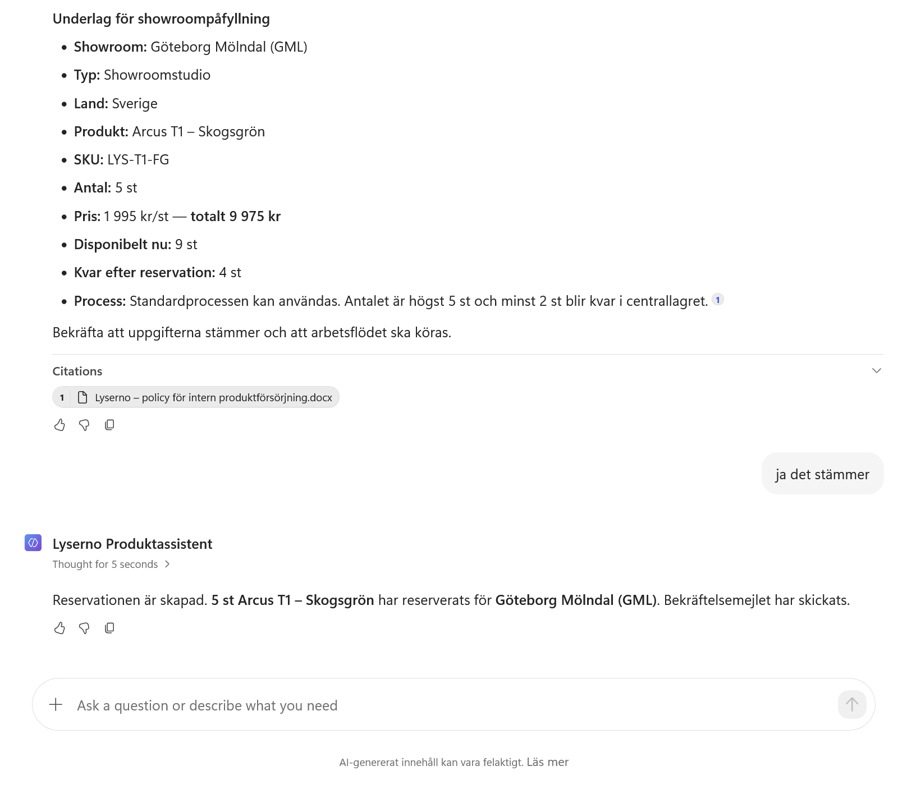

Kontrollera att bekräftelsemejlet innehåller showroom, produkt, SKU, antal, pris och disponibelt saldo efter reservationen.

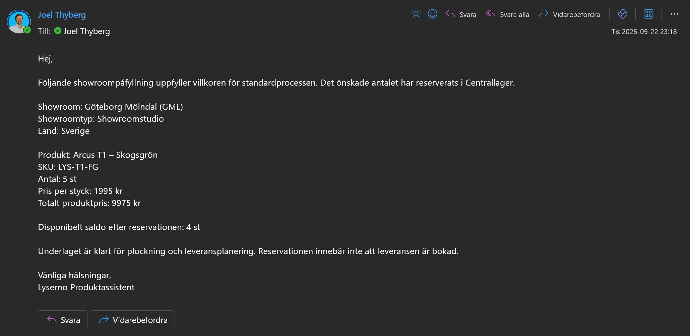

---

## Del 8: Kontrollera att saldot ändrades

Före körningen har Arcus T1 – Skogsgrön 12 exemplar i lager och 3 reserverade. Det disponibla saldot är därför 9.

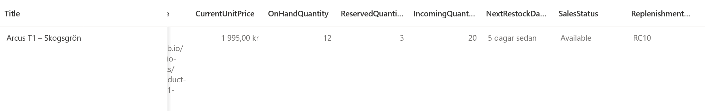

Efter reservationen är `ReservedQuantity` 8. `OnHandQuantity` är fortfarande 12, vilket ger 4 disponibla exemplar.

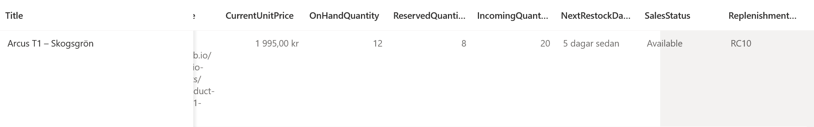

Flödet har alltså lagt till de fem nya reservationerna till det tidigare värdet. Det har inte ersatt värdet med 5.

---

## Del 9: Granska körningen i arbetsflödet

Öppna **Hantera showroompåfyllning** och välj fliken **Aktivitet**.

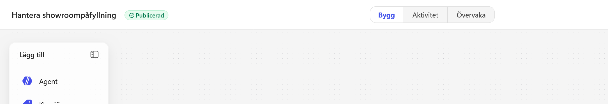

Den senaste körningen visas i aktivitetslistan. Kontrollera att den har lyckats och öppna den.

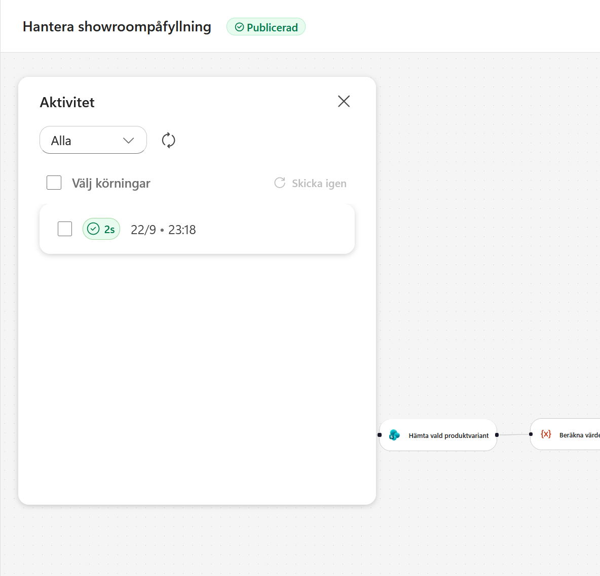

Körningsvyn visar vilka noder och vilken gren som användes. I det här testet gick flödet genom **Standard – svensk showroomstudio**, uppdaterade det reserverade antalet, skickade reservationsbekräftelsen och returnerade resultatet. Grenen för manuell granskning hoppades över.

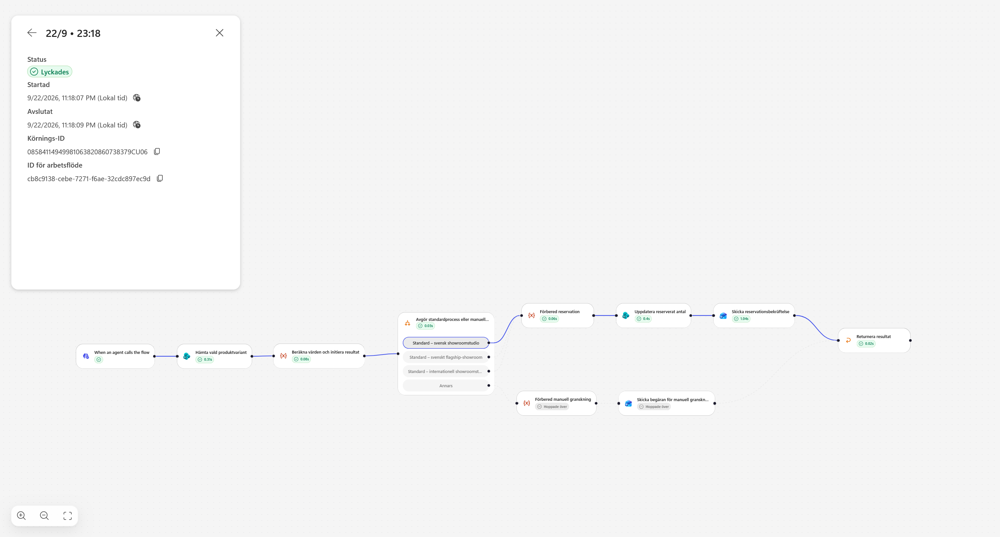

!!! success "Hela processen fungerar"
    Agenten samlar in underlaget, ber om bekräftelse och anropar arbetsflödet. Flödet uppdaterar Centrallager, skickar mejlet och returnerar ett resultat som agenten återger för användaren.
