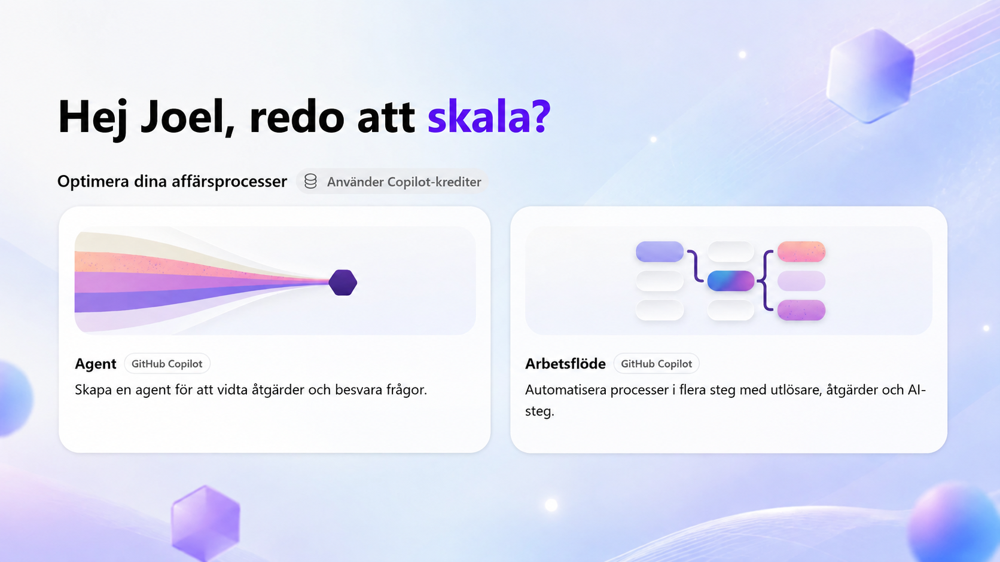

---
hide:
  - navigation
  - toc
---

  <section class="course-hero course-hero--nextgen">
    

      <a class="back-link" href="../../">Alla utbildningar</a>
      
COPILOT STUDIO · NY AGENTUPPLEVELSE

      <h1>Bygg en instruktionsdriven agent</h1>
      
En praktisk grundkurs där du kombinerar tydliga instruktioner, produktkunskap, aktuell SharePoint-data, skills och ett fungerande arbetsflöde.

      
<a class="button button--primary" href="00-course-setup/">Starta kursen</a><a class="button button--ghost" href="#scenariot">Vad du bygger</a>

      
GrundnivåLive-demoBygg med själv

    

    

      

      
<strong>Ny agentupplevelse</strong>Instruktionsdriven och flexibel

    

  </section>

  <section class="scenario-band" id="scenariot">
    

LYSERNO PRODUKTAGENT
<h2>Från produktfråga till genomförd åtgärd</h2>

    
Du bygger en agent för det fiktiva belysningsföretaget Lyserno. En omfattande PDF-katalog ger stabil produktkunskap, medan SharePoint ger aktuella priser, lagersaldon och leveransdatum. <a class="scenario-link" href="../../lyserno/">Besök Lysernos publika webbplats</a>

  </section>

  <section class="capability-grid" aria-label="Agentens förmågor">
    <article class="capability capability--green">01<h3>Kunskap</h3>
Hitta rätt modell, variant och teknisk information i en innehållsrik PDF.
</article>
    <article class="capability capability--blue">02<h3>Aktuell data</h3>
Komplettera katalogen med pris, lager, reservationer och nästa leverans.
</article>
    <article class="capability capability--purple">03<h3>Skills</h3>
Styr när verktyg används, vilka uppgifter som krävs och hur svar presenteras.
</article>
    <article class="capability capability--coral">04<h3>Arbetsflöde</h3>
Lämna över ett komplett underlag till ett förutsägbart flöde som utför åtgärden.
</article>
  </section>

  <section class="journey-section" id="kursresan">
    

KURSRESAN
<h2>Bygg vidare i tydliga lager</h2>
Varje del ger agenten en ny förmåga och avslutas med ett konkret test.

    

      <article>00
<h3>Förbered kursmiljön</h3>
Aktivera åtkomst, välj utvecklingsmiljö och skapa Lyserno Produktportal med listan Centrallager.

</article>
      <article>01
<h3>Hitta rätt i den nya upplevelsen</h3>
Placera Copilot Studio i Microsofts AI-ekosystem och skilj mellan harnesses, agenter, arbetsflöden, miljöer och lösningar.

</article>
      <article>02
<h3>Skapa lösningen</h3>
Samla agenten och kommande komponenter i en prioriterad Power Platform-lösning.

</article>
      <article>03
<h3>Skapa agentens grund</h3>
Skapa Lyserno Produktassistent, konfigurera grundinställningarna och etablera ett första baslinjetest.

</article>
      <article>04
<h3>Lägg till produktkunskap</h3>
Använd Lyserno-katalogen och testa hur agenten arbetar med ett längre dokument.

</article>
      <article>05
<h3>Skapa den första skillen</h3>
Fånga ett återanvändbart arbetssätt för behov, produktmatchning och rätt följdfrågor.

</article>
      <article>06
<h3>Koppla SharePoint</h3>
Hämta aktuell information om varianter, pris, lager och påfyllnad och bygg vidare på skillen.

</article>
      <article>07
<h3>Automatisera och utvärdera</h3>
Koppla ett arbetsflöde, testa helheten och gå igenom vägen till publicering.

</article>
    

  </section>

  <section class="course-cta course-cta--purple">
    

MÅLET
<h2>Förstå delarna genom att använda dem tillsammans.</h2>

    

Kursen ger en bred grund. Fördjupningen tar senare agenten vidare med fler agenter, mer avancerade skills och större automationsflöden.
<a class="button button--light button--arrow" href="00-course-setup/">Börja med kursuppsättningen</a>

  </section>

