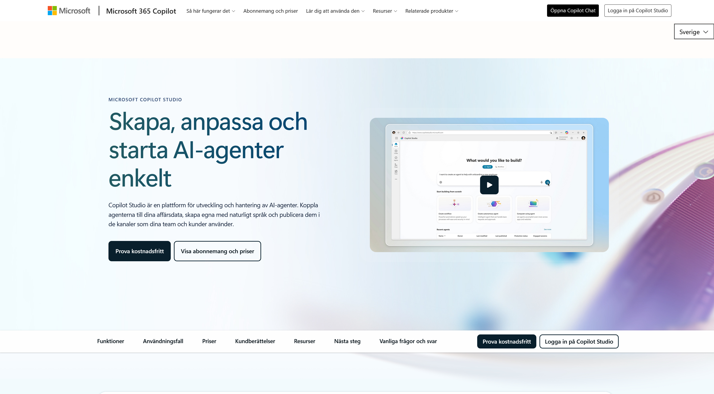
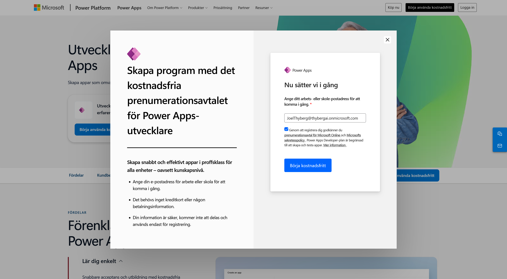
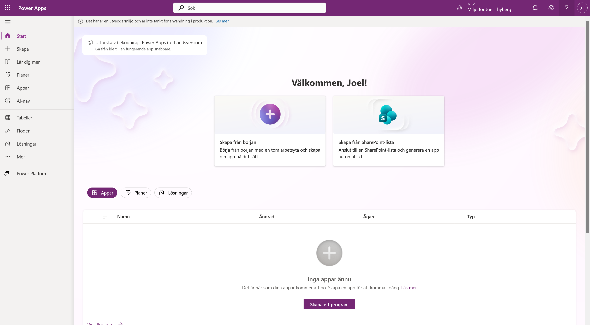
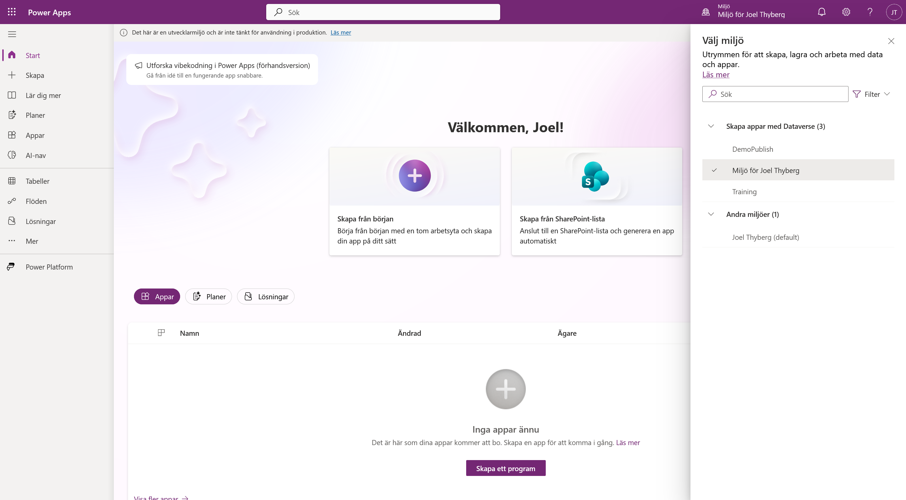
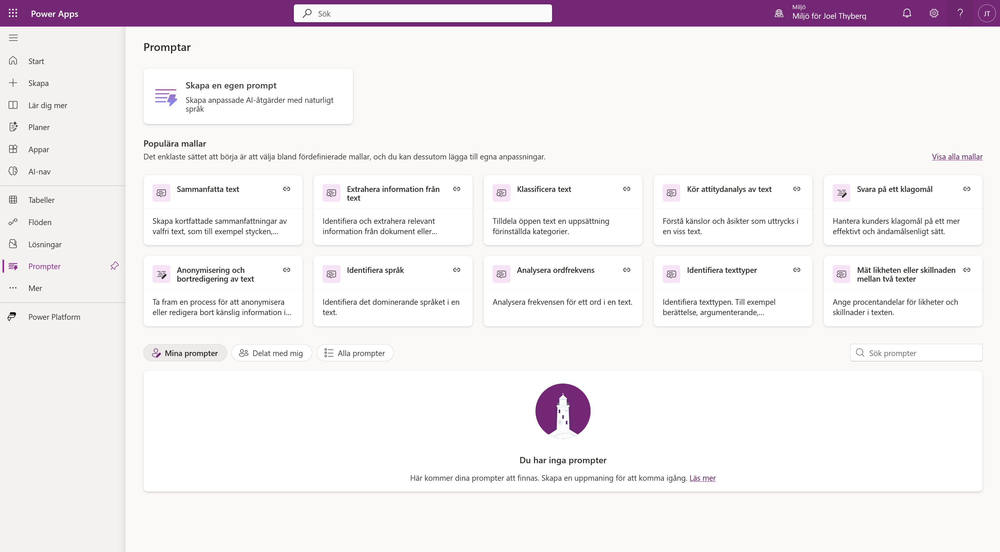
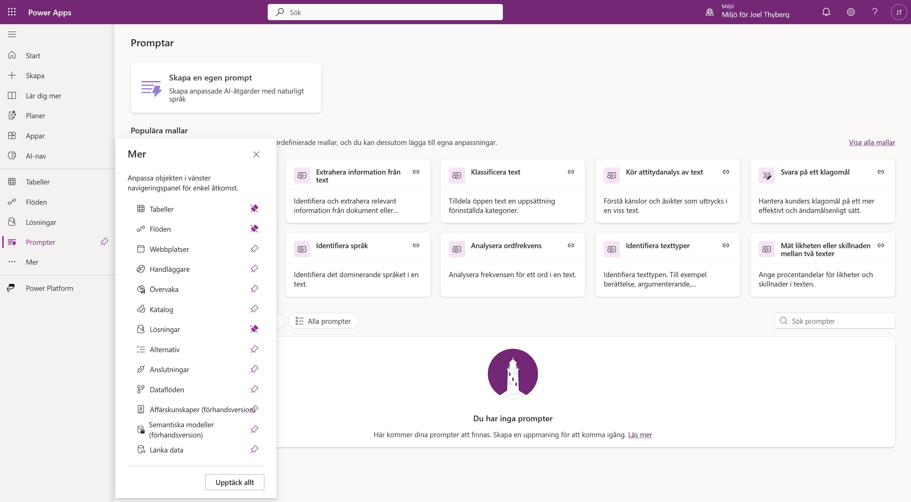
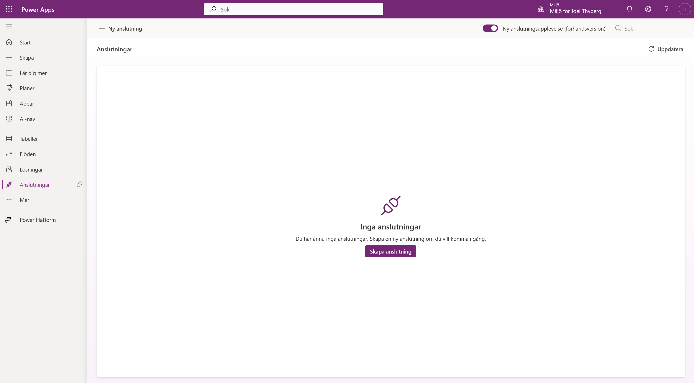
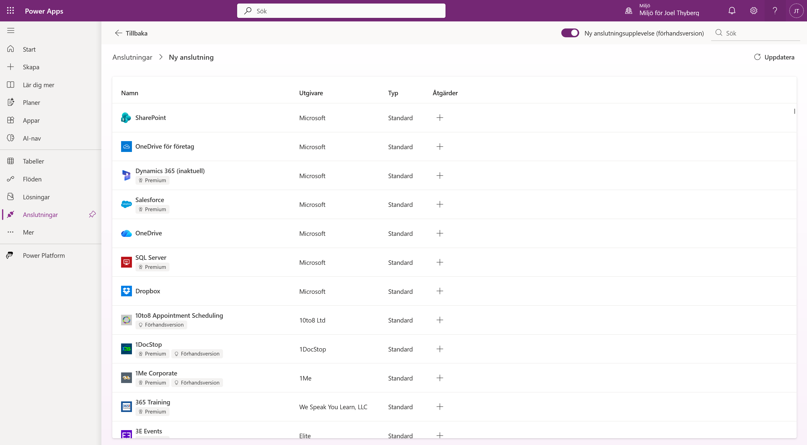

# 0. Kursuppsättning

Innan vi börjar bygga serviceagenten förbereder vi åtkomsten till Copilot Studio, skapar en personlig utvecklingsmiljö och kontrollerar att kursens två viktigaste byggblock finns på plats.

När kapitlet är klart har du:

- tillgång till Copilot Studio för att bygga och testa agenten
- en egen utvecklingsmiljö med Dataverse
- bekräftat att du kan skapa **AI-promptar**
- bekräftat att du kan skapa **anslutningar**

!!! important "Använd samma konto genom hela uppsättningen"
    Du behöver en e-postadress för **arbete eller skola**. Personliga konton som `@outlook.com` och `@gmail.com` stöds inte för registreringen. Använd samma Microsoft 365-konto i Copilot Studio och Power Apps.

    Om din organisation har stängt av självbetjäningsregistrering behöver du hjälp av organisationens Microsoft 365- eller Power Platform-administratör.

---

## Del 1: Aktivera Copilot Studio

Om du redan har åtkomst till Copilot Studio kan du gå vidare till [Del 2: Skapa en utvecklingsmiljö](#del-2-skapa-en-utvecklingsmiljo).

### 1. Starta registreringen

1. Öppna [Microsoft Copilot Studio](https://www.microsoft.com/sv-se/microsoft-365-copilot/microsoft-copilot-studio?market=se) i en ny flik.
2. Välj **Prova kostnadsfritt**.

### 2. Ange ditt konto

1. Skriv in din e-postadress för arbete eller skola.
2. Välj **Nästa**.

Microsoft kontrollerar nu om adressen redan tillhör ett befintligt Microsoft-konto.

### 3. Logga in eller starta utvärderingen

- Om kontot redan finns väljer du **Logga in** och genomför den vanliga inloggningen.
- Om kontot ännu inte har Copilot Studio följer du registreringsflödet och startar en ny utvärderingsversion.

I det sista steget kan du behöva välja land eller region. Kontrollera uppgifterna och välj sedan **Start free trial** eller motsvarande svensk knapp.

!!! info "Om utvärderingsversionen"
    Utvärderingsversionen gäller inledningsvis i 30 dagar. När perioden löper ut kan den förlängas med ytterligare 30 dagar, och Microsoft anger att agenten kan fortsätta fungera i upp till 90 dagar efter att utvärderingen löpt ut.

    Licensen låter dig **bygga och testa** agenten i testchatten, vilket är allt vi behöver under kursen. Läs mer i [Microsofts aktuella information om åtkomst och utvärderingslicenser](https://learn.microsoft.com/sv-se/microsoft-copilot-studio/requirements-licensing-subscriptions).

---

## Del 2: Skapa en utvecklingsmiljö

Power Apps Developer Plan ger dig en kostnadsfri personlig miljö för utveckling och test. Vi använder den miljön när vi senare bygger agenten, prompten, anslutningsprogrammet och arbetsflödet.

### 1. Registrera Developer Plan

1. Öppna [Power Apps Developer Plan](https://www.microsoft.com/sv-se/power-platform/products/power-apps/free) i en ny flik.
2. Välj **Börja använda kostnadsfritt**.

3. Skriv in samma e-postadress som du använde för Copilot Studio.
4. Markera rutan för att godkänna informationen och avtalen.
5. När knappen aktiveras väljer du **Börja kostnadsfritt**.

När registreringen är klar skickas du vidare till Power Apps.

### 2. Kontrollera miljön

Den nya miljön får normalt ett namn baserat på ditt användarnamn, exempelvis **Miljö för Joel Thyberg**. Om en miljö med samma namn redan finns kan den nya få ett tillägg som `(1)`.

1. Välj miljöväljaren uppe i det högra hörnet.
2. Leta efter din nya miljö under **Skapa appar med Dataverse**.
3. Välj miljön så att en bock visas bredvid namnet.

!!! warning "Miljön kan behöva några minuter"
    Det tar olika lång tid innan miljön skapas och visas. Uppdatera sidan om den saknas. I vissa klientorganisationer kan det ta upp till ungefär 10 minuter.

    Välj din **personliga utvecklingsmiljö**, inte organisationens standardmiljö. Standardmiljön heter oftast *Ditt namn (default)* och ligger under **Andra miljöer**. Microsoft beskriver samma namn- och väntelogik i [guiden för Power Apps Developer Plan](https://learn.microsoft.com/en-us/power-platform/developer/create-developer-environment).

---

## Del 3: Kontrollera att du kan skapa AI-promptar

Kursens tredje kapitel bygger på en AI-prompt som analyserar en bild. Vi kontrollerar redan nu att den går att skapa, så att ingen fastnar mitt i bygget.

### 1. Öppna AI-nav

Leta upp **AI-nav** i vänstermenyn och välj den.

### 2. Kontrollera att AI Builder öppnas

Sidan som öppnas ska visa rutorna **Prompter**, **AI-modeller**, **Dokumentautomatisering** och **Övervakningsaktivitet**.

Att sidan över huvud taget laddar är den viktiga signalen. Att listan under *Nyligen skapade* är tom är helt normalt — du har inte byggt något än.

### 3. Öppna Prompter

Välj rutan **Prompter**.

Ser du **Skapa en egen prompt** och listan med färdiga mallar är kontrollen godkänd. Du behöver inte skapa någon prompt nu — det gör vi i kapitel 3.

!!! question "Om Prompter inte dyker upp"
    Det behöver inte betyda att kursen är blockerad. Copilot Studio har en **egen** väg till promptar, via *Verktyg → Nytt verktyg → Prompt*, och den kan fungera även när vyn i Power Apps ser tom eller otillgänglig ut.

    Gå igenom i den här ordningen:

    1. **Kontrollera miljön först.** Står du i standardmiljön i stället för din utvecklingsmiljö saknas ofta både Dataverse och AI Builder. Det är den vanligaste orsaken.
    2. **Vänta och uppdatera.** Dataverse kan behöva upp till tio minuter på sig första gången.
    3. **Testa i Copilot Studio i stället.** Det är där vi faktiskt bygger prompten, så det är det avgörande provet.

    Kvarstår problemet efter alla tre är det troligen en spärr i klientorganisationen, och då behöver du hjälp av din administratör.

---

## Del 4: Kontrollera att du kan skapa anslutningar

I kapitel 4 bygger du ett eget anslutningsprogram mot kursens affärssystem. Här kontrollerar vi bara att behörigheten finns.

### 1. Öppna Anslutningar

Anslutningar ligger inte i vänstermenyn från början.

1. Välj **Mer** längst ned i vänstermenyn.
2. Välj **Anslutningar** i panelen som öppnas.

!!! tip "Fäst det du använder ofta"
    Nålsymbolen till höger om varje rad fäster posten i vänstermenyn. Fäster du **Anslutningar** nu slipper du gå via *Mer* resten av kursen.

### 2. Så ser sidan ut

Du landar på en översikt över dina anslutningar. Är den tom är allt som det ska — du har inte skapat någon än.

### 3. Testa att skapa en anslutning

Välj **Ny anslutning**. En lista över tillgängliga anslutningsprogram ska visas — SharePoint, OneDrive, SQL Server och många fler.

Laddar listan är kontrollen godkänd. **Skapa ingen anslutning nu** — vi gör det i kapitel 4, mot kursens eget system.

---

## Klar

Du har nu allt som behövs:

| Kontroll | Var | Varför |
|---|---|---|
| Copilot Studio | Egen inloggning | Här byggs agenten |
| Utvecklingsmiljö med Dataverse | Power Apps | Här lever allt du bygger |
| AI-promptar | AI-nav → Prompter | Kapitel 3 |
| Anslutningar | Mer → Anslutningar | Kapitel 4 |

I nästa kapitel går vi igenom vad vi ska bygga under dagen — och varför just den här sortens agent ska byggas deterministiskt.
