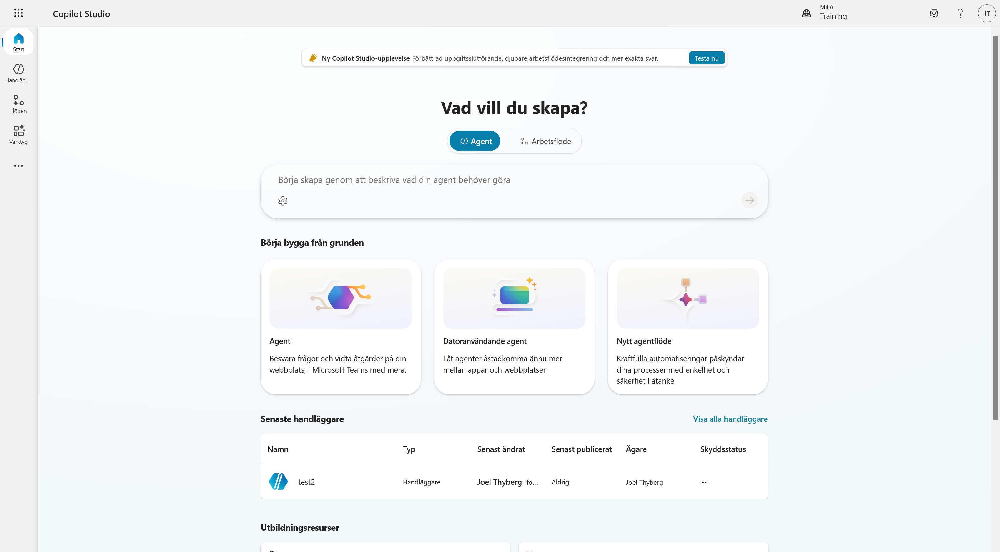
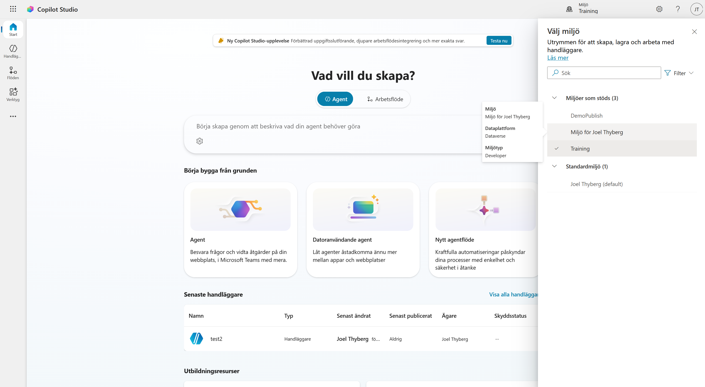
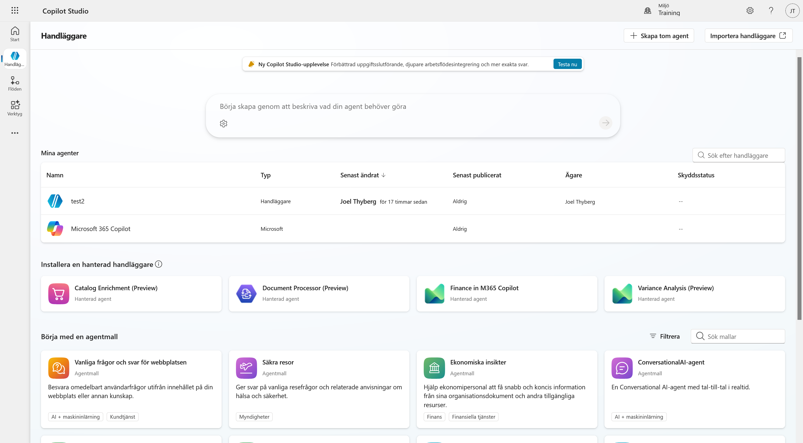
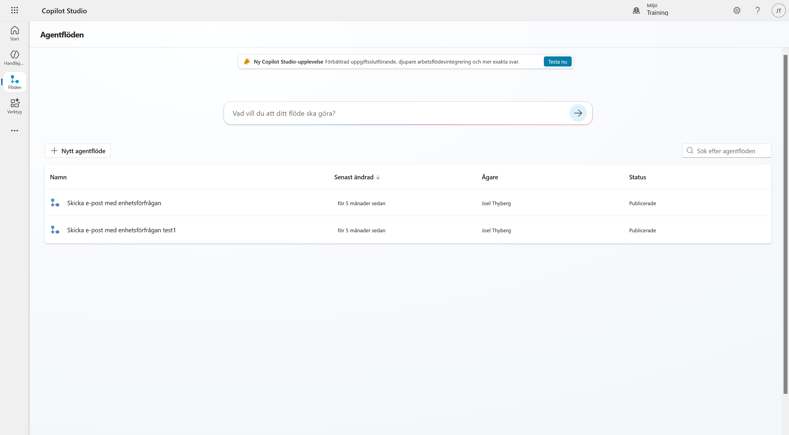
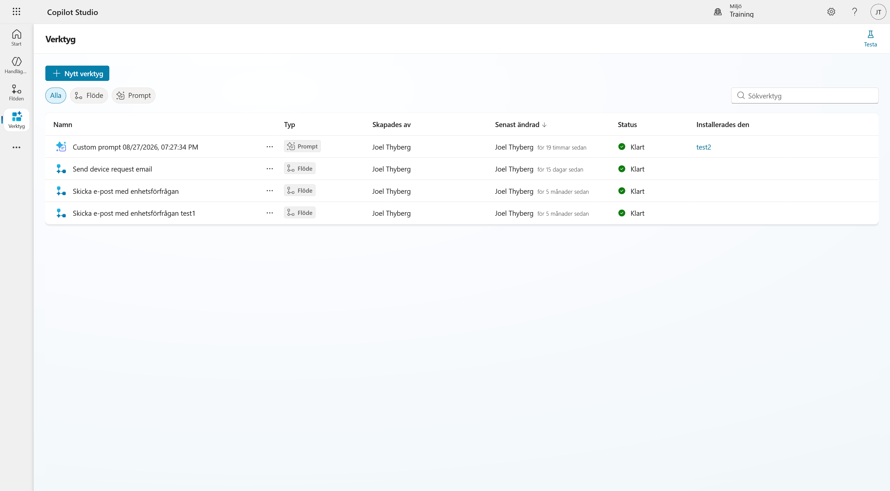
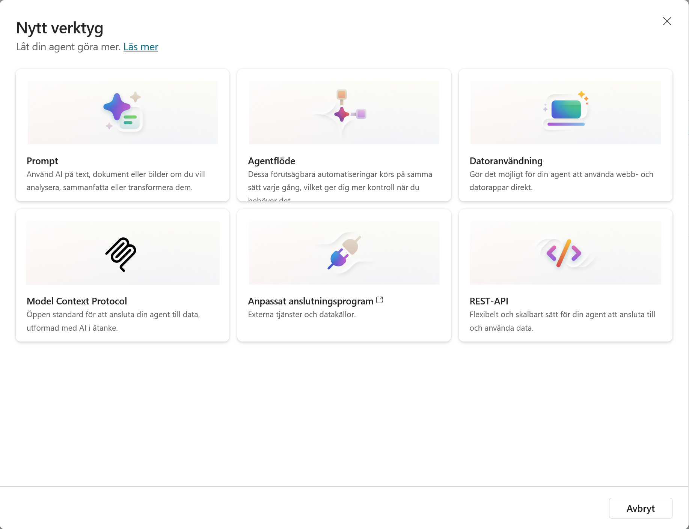
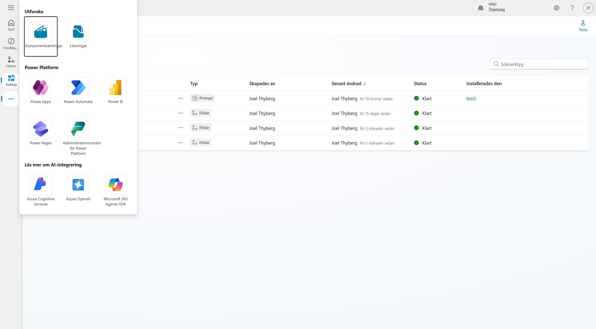

# 1. Hitta rätt i Copilot Studio

I det här kapitlet lär vi känna gränssnittet och kontrollerar att vi står i rätt miljö innan vi börjar bygga.

När kapitlet är klart har du:

- kontrollerat att du arbetar i din utvecklingsmiljö
- sett var agenter, flöden och verktyg finns
- sett vilka verktygstyper som finns

!!! info "Vad vi bygger under dagen"
    Vi bygger en intern serviceagent för Lysernos produktion. En anställd rapporterar ett fel, agenten analyserar underlaget, hämtar objektet ur ett underhållssystem, fördjupar utredningen och skapar en godkänd arbetsorder.

    Vi bygger den som en standardagent därför att beslutet måste bli detsamma varje gång. Prioritet på ett fel är en regel, inte en bedömning, och när någon frågar varför det blev prioritet 1 ska svaret gå att peka på.

---

## Del 1: Öppna Copilot Studio

Gå till [Copilot Studio](https://copilotstudio.microsoft.com) och logga in med samma konto som i kapitel 0.

Startsidan frågar **Vad vill du skapa?** och låter dig välja mellan **Agent** och **Arbetsflöde**. Längre ned finns snabbvägarna *Agent*, *Datoranvändande agent* och *Nytt agentflöde*, samt en lista över dina senaste handläggare.

!!! note "Om bannern Ny Copilot Studio-upplevelse"
    Högst upp kan en banner erbjuda den nya agentupplevelsen. Låt den vara. Den här kursen bygger på standardharnessen, och valet av upplevelse går inte att ändra i efterhand på en agent som redan är skapad.

---

## Del 2: Kontrollera miljön

Innan vi bygger något kontrollerar vi att vi står rätt. Välj **miljöväljaren** uppe till höger.

Miljöerna är grupperade i **Miljöer som stöds** och **Standardmiljö**. Välj din personliga utvecklingsmiljö. Den heter normalt *Miljö för [ditt namn]*.

Håll muspekaren över miljön i listan om du är osäker. Då visas **Dataplattform: Dataverse** och **Miljötyp: Developer**, vilket är den miljö vi kontrollerade i kapitel 0.

!!! warning "Inte standardmiljön"
    Standardmiljön heter *[Ditt namn] (default)*. Bygger du där saknas Dataverse-stödet vi kontrollerade i kapitel 0, och komponenterna hamnar utanför din lösning.

---

## Del 3: Vänstermenyn

Utöver startsidan har vänstermenyn tre sidor.

### Handläggare

Överst listas **Mina agenter**. Under finns färdiga **hanterade handläggare** från Microsoft och en katalog med **agentmallar**. Vi skapar vår agent från grunden, men det är värt att veta att mallarna finns.

### Flöden

Ett agentflöde är en automation som körs på samma sätt varje gång. I kapitel 8 bygger vi ämnet som hanterar godkännandet. I kapitel 9 bygger vi agentflödet som skapar arbetsordern efter ett godkännande.

### Verktyg

Verktyg är allt agenten kan använda för att utföra något.

Listan kan filtreras på typ, och kolumnen **Installerades den** visar vilken agent som använder vad.

---

## Del 4: Verktygstyperna

Välj **Nytt verktyg** så öppnas dialogen med de sex typerna.

Så här används de i kursen:

| Typ | Vad den gör | Kursen |
| --- | --- | --- |
| **Prompt** | AI på text, dokument eller bilder | Kapitel 4 |
| **Agentflöde** | Förutsägbar automation, samma varje gång | Kapitel 9 |
| **Datoranvändning** | Agenten styr webb- och datorappar | Ingår inte |
| **Model Context Protocol** | Öppen standard för att ansluta agenten till data | Kapitel 7 |
| **Anpassat anslutningsprogram** | Externa tjänster och datakällor | Kapitel 6 |
| **REST-API** | Flexibel anslutning till data | Berörs i kapitel 6 |

Välj **Avbryt**. Vi skapar inget verktyg än.

!!! tip "Läs beskrivningen på Agentflöde"
    *"Dessa förutsägbara automatiseringar körs på samma sätt varje gång, vilket ger dig mer kontroll när du behöver det."*

    Det är den egenskapen kursen bygger på.

---

## Del 5: Fler tjänster

De tre punkterna längst ned i vänstermenyn öppnar resten av plattformen.

Under *Utforska* finns **Komponentsamlingar** och **Lösningar**. Där finns också genvägar till Power Apps, Power Automate, Power BI, Power Pages och administrationscentret, och längst ned länkar vidare till Azure-tjänsterna.

---

!!! success "Du är redo att börja bygga"
    Du står i rätt miljö och vet var agenter, flöden och verktyg finns. Fortsätt till [nästa kapitel](02-create-solution.md) för att skapa lösningen som ska samla allt vi bygger under dagen.
