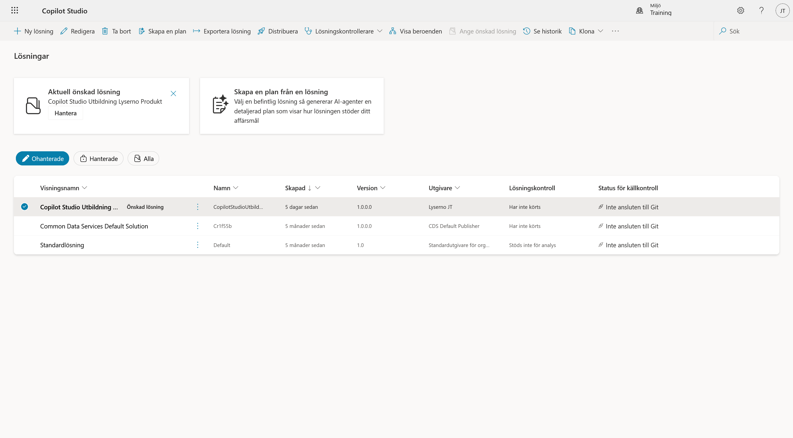
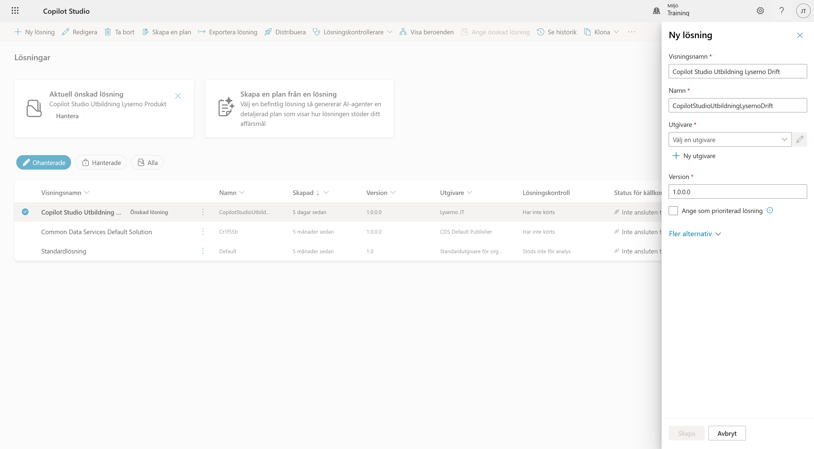
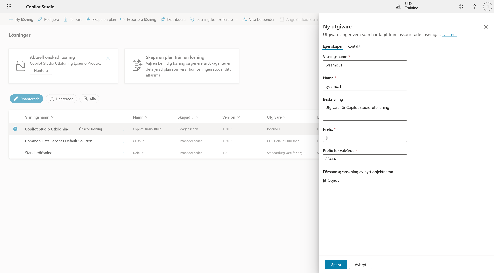
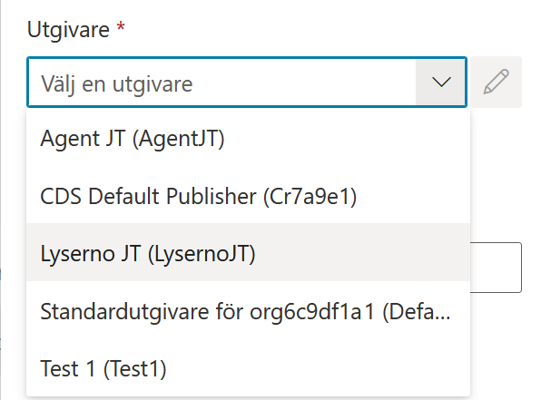
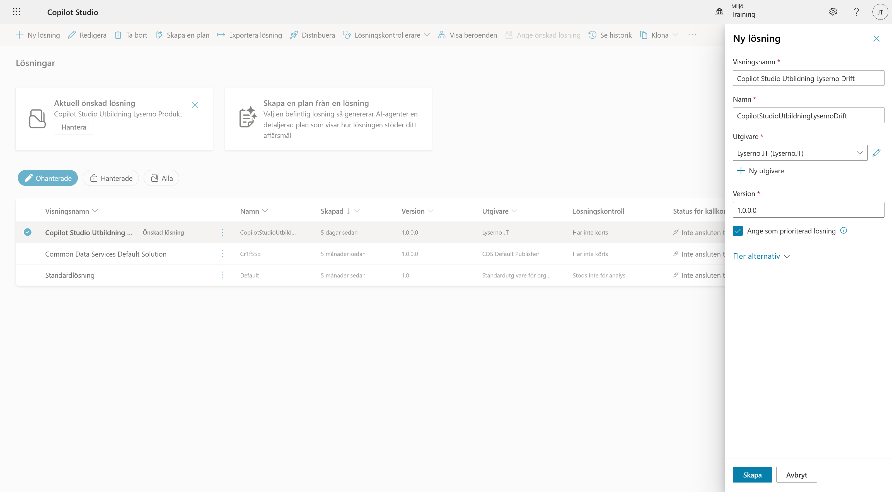
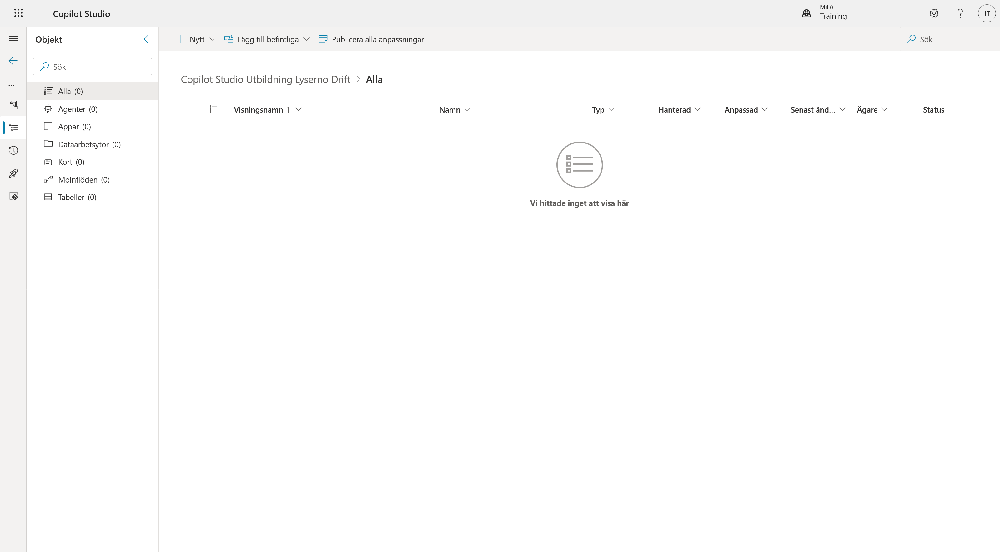
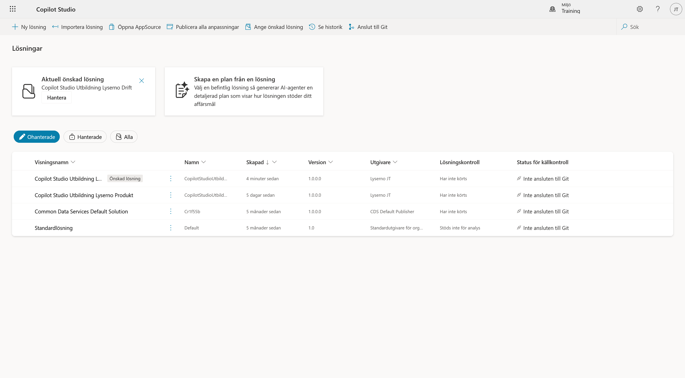

# 2. Skapa lösningen

En lösning är lådan där allt vi bygger samlas: agenten, prompten, verktygen och flödet. Utan den hamnar komponenterna i standardlösningen och blir svåra att hitta och flytta.

När kapitlet är klart har du:

- skapat en egen utgivare med ditt eget prefix
- skapat lösningen **Copilot Studio Utbildning Lyserno Drift**
- satt den som prioriterad lösning

---

## Del 1: Öppna Lösningar

Välj de tre punkterna längst ned i vänstermenyn och sedan **Lösningar** under *Utforska*.



Listan visar miljöns lösningar. Rutan **Aktuell önskad lösning** högst upp talar om var nya komponenter hamnar just nu.

---

## Del 2: Ange lösningens namn

Välj **Ny lösning**. Panelen öppnas från höger.

Använd exakt följande visningsnamn:

```text
Copilot Studio Utbildning Lyserno Drift
```

Fältet **Namn** skapas normalt automatiskt från visningsnamnet och blir `CopilotStudioUtbildningLysernoDrift`. Om det inte fylls i automatiskt anger du samma namn utan mellanslag.

Under **Utgivare** ska vi inte använda standardutgivaren. Välj i stället **+ Ny utgivare**.



---

## Del 3: Skapa en utgivare

En ny panel med rubriken **Ny utgivare** öppnas. Utgivaren identifierar vem som har skapat komponenterna och ger dem ett eget prefix.

Använd dina initialer. Exemplen nedan använder **JT** för Joel Thyberg.

**Visningsnamn**<br>
Skriv `Lyserno [initialer]`, exempelvis `Lyserno JT`.

**Namn**<br>
Använd samma namn utan mellanslag, exempelvis `LysernoJT`.

**Beskrivning**<br>
Beskrivningen är samma för alla:

```text
Utgivare för Copilot Studio-utbildning
```

**Prefix**<br>
Använd `l` följt av initialerna med små bokstäver, exempelvis `ljt`.

**Prefix för valvärde**<br>
Det förifyllda talet fungerar bra. Du kan runda av det till närmaste tusental om du vill ha ett renare nummer.



Fältet **Förhandsgranskning av nytt objektnamn** visar resultatet, exempelvis `ljt_Object`. Det är prefixet som hamnar framför alla komponenter du skapar.

!!! important "Använd dina egna initialer"
    Heter du Anna Svensson använder du `Lyserno AS`, `LysernoAS` och prefixet `las`. Prefixet måste vara unikt i miljön. Går ni flera från samma organisation krockar identiska prefix.

Välj **Spara**.

---

## Del 4: Välj utgivaren

Panelen stängs och du kommer tillbaka till **Ny lösning**. Din nya utgivare ska nu vara vald.



Har du redan en utgivare sedan en tidigare kurs kan du välja den i listan i stället för att skapa en ny.

---

## Del 5: Sätt lösningen som prioriterad

Kryssa i **Ange som prioriterad lösning** och välj **Skapa**.



!!! tip "Varför prioriterad?"
    Allt du bygger härefter hamnar automatiskt i den här lösningen, även när du skapar något från startsidan. Utan kryssrutan sprids komponenterna ut och måste letas ihop senare.

---

## Del 6: Kontrollera resultatet

Lösningen öppnas automatiskt och är tom. Det är korrekt, eftersom vi inte har byggt något än.



Gå tillbaka till **Lösningar**. Nu ska **Copilot Studio Utbildning Lyserno Drift** synas i listan och stå som **Aktuell önskad lösning**.



---

!!! success "Lösningen är klar"
    Lösningen är skapad och prioriterad, så komponenterna vi bygger framöver samlas automatiskt på samma plats. Fortsätt till [nästa kapitel](03-create-agent.md) för att skapa agenten.
