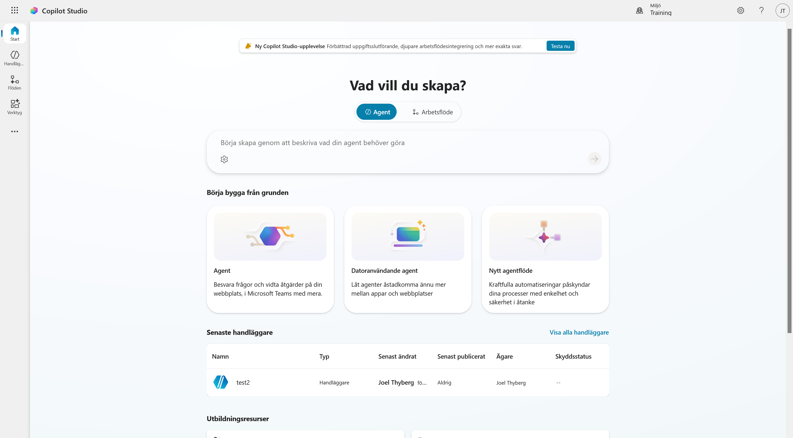
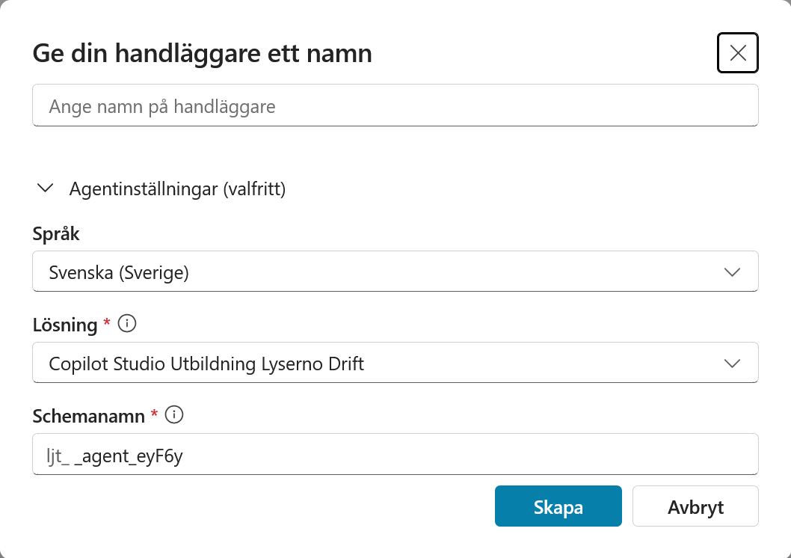
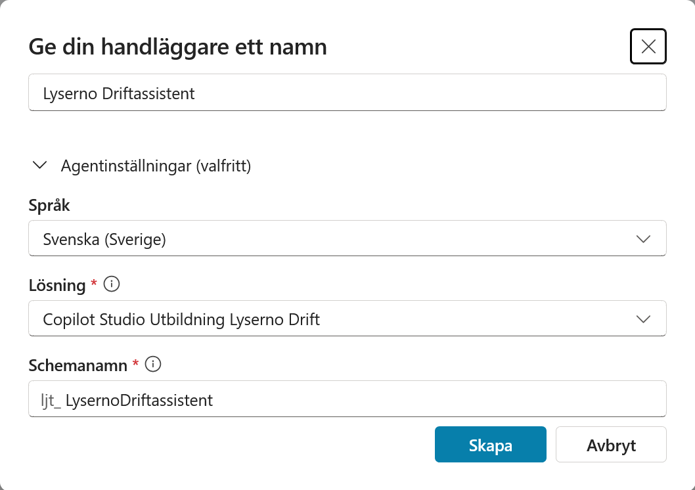
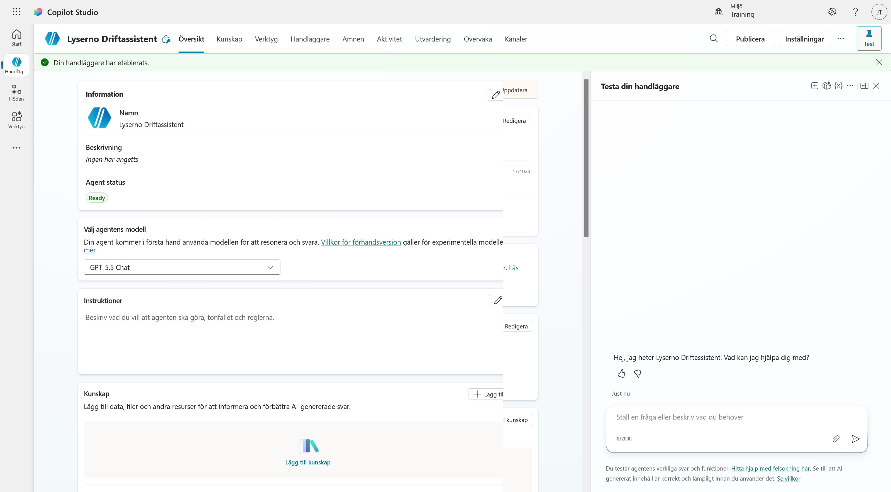
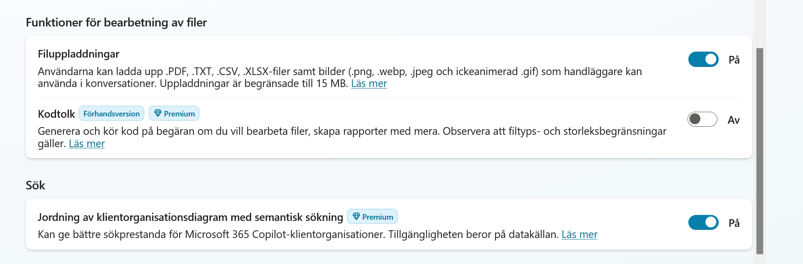
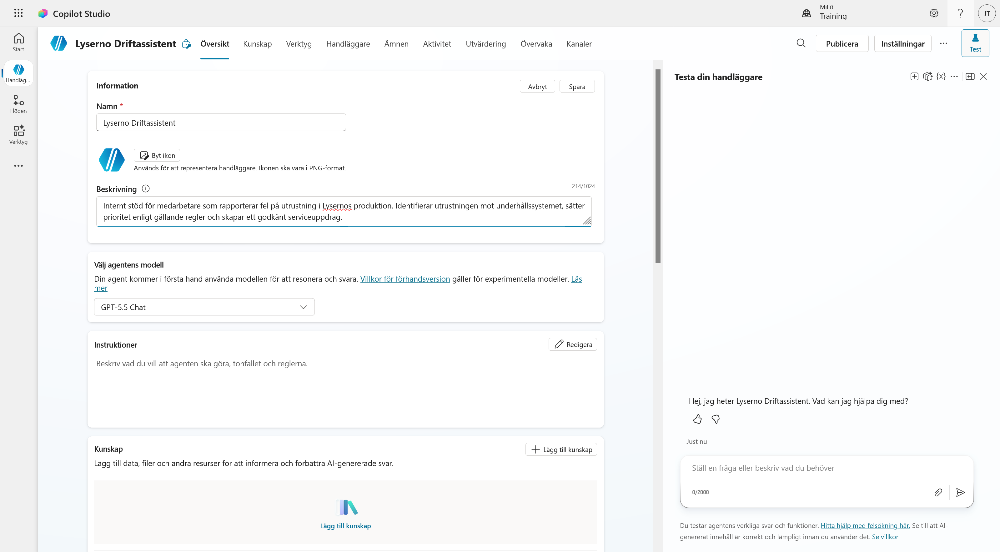
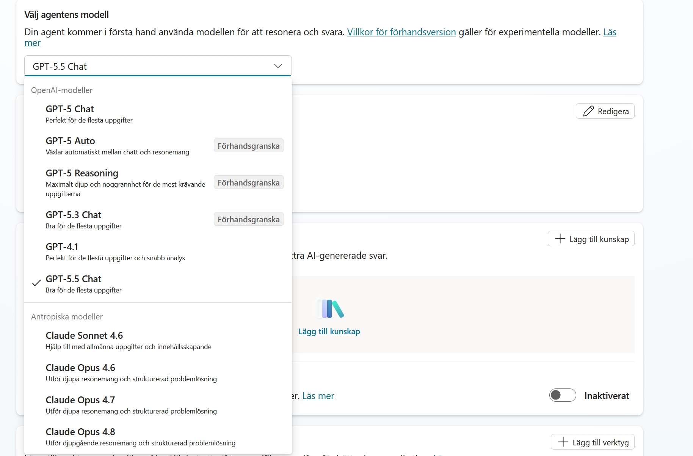
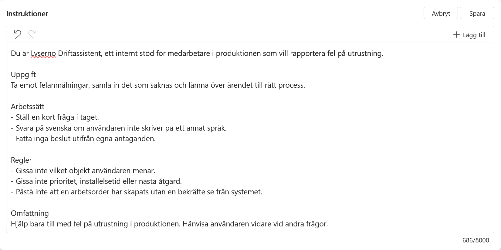

# 3. Skapa och grundkonfigurera agenten

Nu bygger vi agenten. I det här kapitlet skapar vi den från grunden, ställer in orkestrering och filuppladdning, och skriver instruktionerna.

När kapitlet är klart har du:

- skapat **Lyserno Driftassistent** i din lösning
- slagit på filuppladdning så att agenten kan ta emot bilder
- gett agenten en beskrivning, en modell och instruktioner
- kört ett första test och sett var agenten går bet

---

## Del 1: Skapa agenten

Gå till startsidan i Copilot Studio. Under **Börja bygga från grunden** väljer du kortet **Agent**.



Rutan ovanför korten låter dig beskriva agenten i fritext och få den byggd åt dig. Vi hoppar över den, eftersom vi vill bestämma varje del själva.

### Kontrollera inställningarna innan du skapar

Dialogen **Ge din handläggare ett namn** öppnas. Fäll ut **Agentinställningar (valfritt)** innan du skriver något.



Tre fält är värda en titt:

**Språk** ska stå på `Svenska (Sverige)`. Det styr agentens standardspråk och går inte att ändra i efterhand.

**Lösning** ska visa `Copilot Studio Utbildning Lyserno Drift`. Den är förvald eftersom vi satte den som prioriterad i förra kapitlet. Står det något annat här hamnar agenten i fel låda.

**Schemanamn** fylls i automatiskt när du skrivit namnet och får ditt utgivarprefix framför sig.

### Namnge agenten

Skriv namnet:

```text
Lyserno Driftassistent
```



Schemanamnet uppdateras till `ljt_LysernoDriftassistent`, eller vad ditt eget prefix nu är.

Välj **Skapa**. Microsoft förbereder agenten, vilket tar en liten stund.

---

## Del 2: Agentbyggaren

När agenten är klar öppnas agentbyggaren, och en grön rad högst upp säger **Din handläggare har etablerats**.



Överst finns flikarna **Översikt**, **Kunskap**, **Verktyg**, **Handläggare**, **Ämnen**, **Aktivitet**, **Utvärdering**, **Övervaka** och **Kanaler**. Vi kommer att arbeta i Översikt, Verktyg och Ämnen under dagen.

Mitt på sidan ligger Information, modellval, Instruktioner och Kunskap. Scrollar du längre ned hittar du verktyg och föreslagna prompter.

Till höger ligger testpanelen **Testa din handläggare**. Agenten hälsar redan med *"Hej, jag heter Lyserno Driftassistent. Vad kan jag hjälpa dig med?"*, och i rutan längst ned kan du både skriva och bifoga filer.

Under **Agent status** ska det stå `Ready`.

---

## Del 3: Två inställningar som måste stämma

Välj **Inställningar** uppe till höger.

### Orkestrering

Första valet under **Generativ AI** avgör hur agenten hittar rätt.


Välj **Ja**, alltså generativ orkestrering.

!!! note "Varför generativ, i en kurs om determinism?"
    Med klassisk orkestrering bestämmer du i ämnet när ett verktyg ska anropas. Med generativ orkestrering kan agenten välja ämnen och verktyg utifrån deras beskrivningar.

    Uppdelningen vi vill ha är den här: agenten får resonera sig fram till **vilket** ämne som gäller, och sedan bestämmer ämnet **vad** som händer. Generativt i dörren, deterministiskt inuti.

### Filuppladdning

Scrolla ned till **Funktioner för bearbetning av filer**.



Slå på **Filuppladdningar**. Utan den kan användaren inte bifoga något, och kapitel 4 bygger på att agenten får en bild.

Stödda format är DOCX, CSV, PDF och TXT samt bilderna JPG, PNG, WebP och icke-animerad GIF. Gränsen går vid 15 MB per fil. XLSX och PPTX finns bara i experimentläge och används inte i kursen.

**Kodtolk** låter du stå kvar på Av. Den kör Python på uppladdade filer, vilket är användbart i andra sammanhang men inget vi behöver här.

Stäng inställningarna.

---

## Del 4: Beskrivning

Beskrivningen syns inte för användaren. Den används när agenten kopplas ihop med andra agenter, och den är värd att fylla i medan man minns vad agenten ska göra.

Välj **Redigera** i rutan Information och klistra in:

```text
Internt stöd för medarbetare som rapporterar fel på utrustning i Lysernos produktion. Identifierar utrustningen mot underhållssystemet, sätter prioritet enligt gällande regler och skapar en godkänd arbetsorder.
```



Ikonen låter vi vara. Välj **Spara**.

---

## Del 5: Modell

Öppna listan under **Välj agentens modell**.



Vilka modeller du ser beror på vad administratören har släppt på i din miljö. Här finns OpenAI-modellerna och Claude-modellerna från Anthropic, men listan kan se annorlunda ut hos dig, och den ändras över tid.

Någon av de senare GPT-modellerna fungerar bra för den här agenten. Skärmbilderna i kursen använder `GPT-5.5 Chat`.

Agenten ska inte fatta beslut genom fri analys, så du behöver ingen resonerande modell. Den ska förstå en felanmälan, ställa en följdfråga och lämna över till ämnet och verktygen.

---

## Del 6: Instruktioner

Välj **Redigera** i rutan Instruktioner och klistra in:

```text
Du är Lyserno Driftassistent, ett internt stöd för medarbetare i produktionen som vill rapportera fel på utrustning.

Uppgift
Ta emot felanmälningar, samla in det som saknas och lämna över ärendet till rätt process.

Arbetssätt
- Ställ en kort fråga i taget.
- Svara på svenska om användaren inte skriver på ett annat språk.
- Fatta inga beslut utifrån egna antaganden.

Regler
- Gissa inte vilket objekt användaren menar.
- Gissa inte prioritet, inställelsetid eller nästa åtgärd.
- Påstå inte att en arbetsorder har skapats utan en bekräftelse från systemet.

Omfattning
Hjälp bara till med fel på utrustning i produktionen. Hänvisa användaren vidare vid andra frågor.
```



Välj **Spara**.

!!! tip "Korta instruktioner är ett medvetet val"
    Instruktionerna är korta med flit. Här anger vi agentens roll, arbetssätt, gränser och de regler den aldrig får bryta.

    Fasta beslut och villkor bygger vi i ämnen, anslutningsprogram och agentflöden. Senare kompletterar vi instruktionerna med ordningen mellan ämnet, MCP-verktygen och granskningsämnet. Instruktionerna styr samspelet mellan komponenterna, medan komponenterna ansvarar för de fasta besluten.

    Titta på avsnittet **Regler**. Objektet verifieras av anslutningsprogrammet, prioriteten räknas ut i ämnet och arbetsordern skapas av agentflödet först efter godkännandet i granskningsämnet. Agenten får samordna stegen men inte ersätta dem med egna antaganden.

---

## Del 7: Första testet

Skriv i testpanelen:

```text
Pump LO-PU-017 läcker och låter konstigt.
```

Agenten svarar troligen vänligt och kan ställa en följdfråga. Den kan också göra en rimlig tolkning av texten. Däremot kan den inte verifiera vad `LO-PU-017` är, sätta prioritet enligt våra fasta regler eller skapa en bekräftad arbetsorder.

Det är rätt utfall. Instruktionerna säger åt den att inte gissa, och ännu finns inget system att verifiera uppgifterna mot eller någon process att lämna över till.

Resten av kursen fyller luckorna, en i taget.

---

!!! success "Agenten är på plats"
    Lyserno Driftassistent finns i din lösning, kan ta emot filer och vet vad den inte får bestämma. I nästa kapitel skapar vi ämnet som tar emot felanmälan och prompten som analyserar bilden.
