# 7. Anslut T-Berg DU MCP och fördjupa utredningen

Ämnet kan nu verifiera objektet och lämna ett strukturerat `MaintenanceContext` till agenten. I det här kapitlet ansluter vi T-Berg DU MCP, väljer vilka verktyg agenten får använda och låter agenten hämta felhistorik, tillgängliga tekniker och reservdelar.

När kapitlet är klart har du:

- anslutit **T-Berg DU MCP** med din tidsbegränsade testnyckel
- granskat serverns fyra verktyg och stängt av skrivverktyget `create_work_order`
- instruerat agenten att använda MCP-verktygen i rätt ordning
- lagt till T-Berg D&U-loggan på det anslutningsprogram som skapades automatiskt
- kontrollerat MCP-anropet i Power Platform
- testat att agenten fördjupar felanmälan med information från T-Berg D&U

!!! info "MCP-server, anslutning och nyckel är tre olika saker"
    Servern heter `T-Berg DU MCP`. Anslutningen heter `T-Berg-testnyckel`. I anslutningen sparas det riktiga värdet som börjar med `tberg_`. Samma testnyckel används för både REST-connectorn och MCP-servern.

---

## Del 1: Öppna guiden för en ny MCP-server

Gå till agentens **Översikt**. Under **Verktyg** väljer du **Lägg till verktyg**.

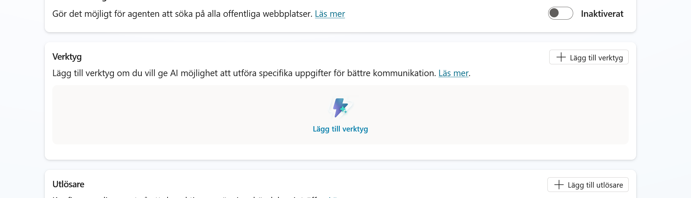

I verktygspanelen väljer du **Lägg till ny MCP**.

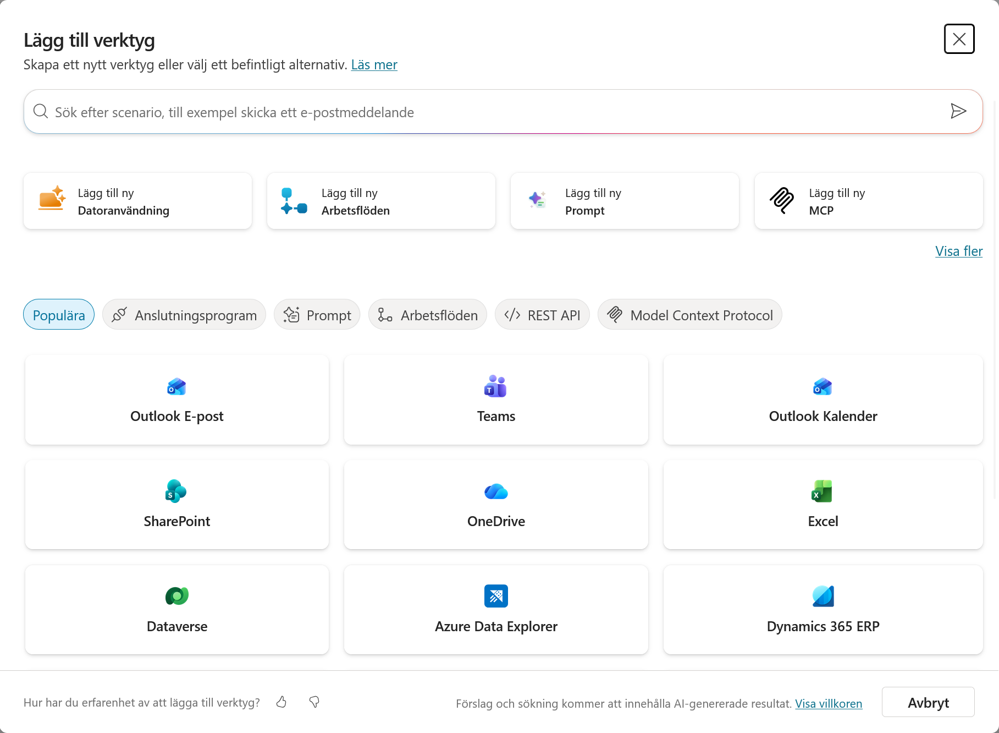

---

## Del 2: Ange serverns information

Fyll i följande värden:

Servernamn:

```text
T-Berg DU MCP
```

Serverbeskrivning:

```text
Ger Lyserno Driftassistent tillgång till felhistorik, tillgängliga tekniker och reservdelar i T-Berg D&U. Använd servern efter att ämnet Rapportera utrustningsfel har lämnat ett verifierat MaintenanceContext.
```

Server-URL:

```text
https://ca-tberg-du-api.orangesmoke-45b4d851.swedencentral.azurecontainerapps.io/mcp
```

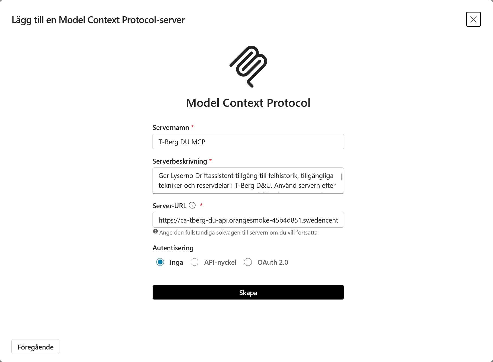

Server-URL:en pekar direkt på MCP-slutpunkten. REST-connectorn från föregående kapitel använder `/api`, medan MCP-servern använder `/mcp`.

---

## Del 3: Konfigurera API-nyckeln

Under **Autentisering** väljer du **API-nyckel**. Ange att nyckeln ska skickas som ett sidhuvud och skriv följande huvudnamn:

```text
x-workshop-key
```

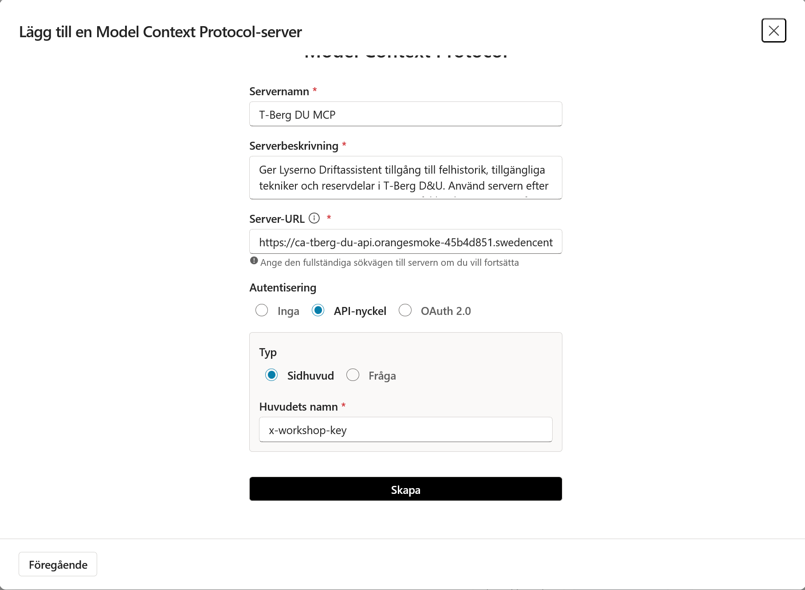

`x-workshop-key` är HTTP-headern som T-Berg D&U läser vid varje anrop. Skriv inte själva testnyckeln i det här fältet.

Välj **Skapa**.

---

## Del 4: Skapa anslutningen

MCP-servern har nu skapats, men den saknar en anslutning med din testnyckel.

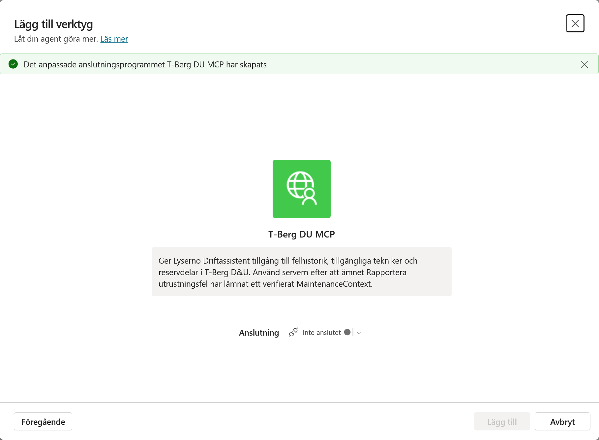

Öppna listan vid **Anslutning** och välj **Skapa ny anslutning**.

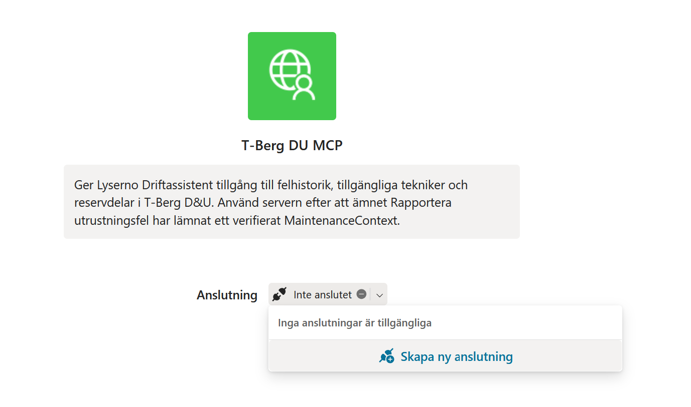

### Kopiera testnyckeln igen vid behov

Om du inte har kvar testnyckeln öppnar du T-Berg D&U och kopierar den från arbetsytans övre högra hörn:

<p><a class="button button--primary" href="https://ca-tberg-du-web.orangesmoke-45b4d851.swedencentral.azurecontainerapps.io" target="_blank" rel="noopener">Öppna T-Berg D&amp;U</a></p>

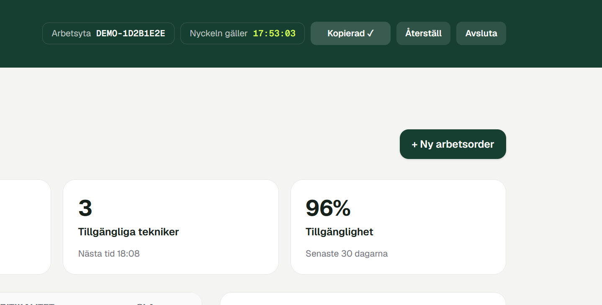

Om nyckeln har gått ut skapar du en ny. En testnyckel gäller i 24 timmar och samma nyckel kan användas i både REST-anslutningen och MCP-anslutningen.

I dialogrutan anger du följande visningsnamn:

```text
T-Berg-testnyckel
```

Klistra sedan in hela testnyckeln, inklusive prefixet `tberg_`, i det obligatoriska nyckelfältet och välj **Skapa**.

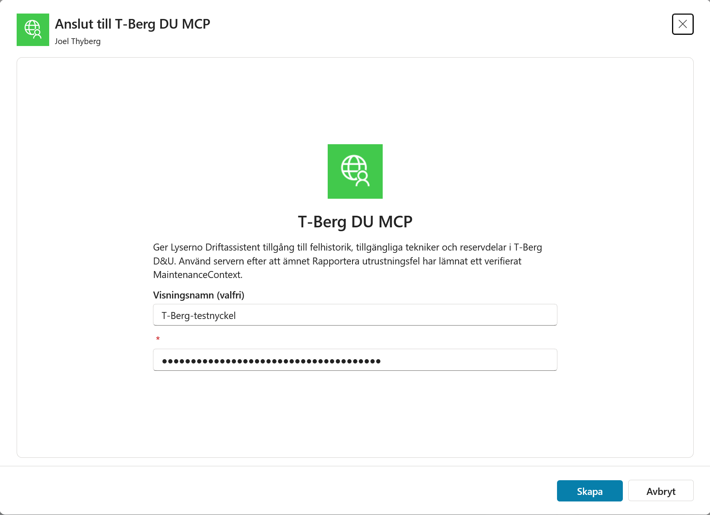

När anslutningen visas som ansluten väljer du **Lägg till**.

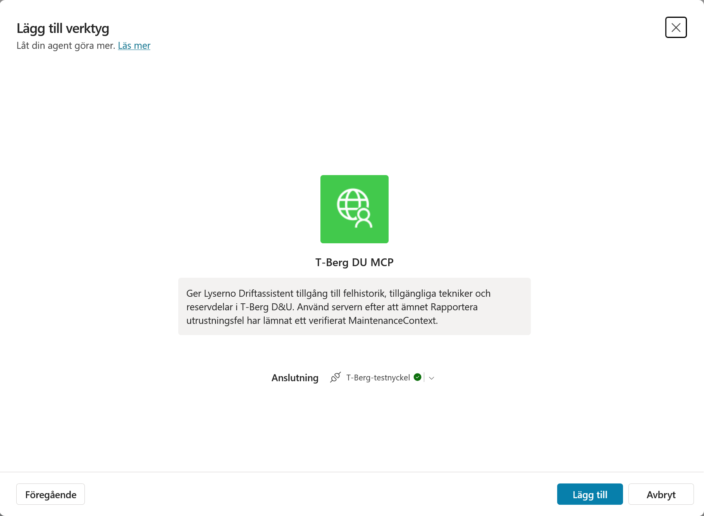

---

## Del 5: Öppna serverns verktyg

På agentens översikt visas nu `T-Berg DU MCP` under **Verktyg**. Öppna servern.

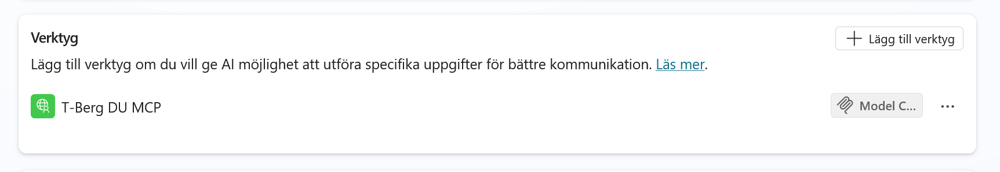

Rulla ner till avsnittet **Verktyg**. Servern innehåller fyra verktyg:

| Verktyg | Beskrivning |
|---|---|
| `get_fault_history` | Hämtar felhistorik och befintliga arbetsordrar för ett verifierat objekt. Använd verktyget efter att ämnet har lämnat `MaintenanceContext`. Svaret innehåller historiken, arbetsordrarna och antalet träffar för den angivna felkoden utan att filtrera bort övriga poster. |
| `find_available_technicians` | Söker tekniker med rätt kompetens som inte är frånvarande eller har en pågående arbetsorder. Använd verktyget när `MaintenanceContext` innehåller `requiredSkill`. Svaret innehåller en sorterad teknikerlista och `technicianId` med den första teknikerns ID eller `UNASSIGNED`. |
| `find_spare_parts` | Kontrollerar reservdelar, lagersaldo och ledtid för ett internt objekt. Använd verktyget efter `get_fault_history` när `serviceType` är `Intern` och antingen `impactLevel` är `Stoppad` eller `sameErrorCodeCount` är större än `0`. Svaret visar om kontrollen utfördes och vilka reservdelar som hittades. Inget reserveras eller beställs. |
| `create_work_order` | Skapar en arbetsorder från ett verifierat underlag. Använd verktyget först efter att användaren har bekräftat underlaget och `approved` är `true`. Svaret innehåller den skapade arbetsorderns uppgifter. Det här verktyget ska inte användas i kapitlets agent. |

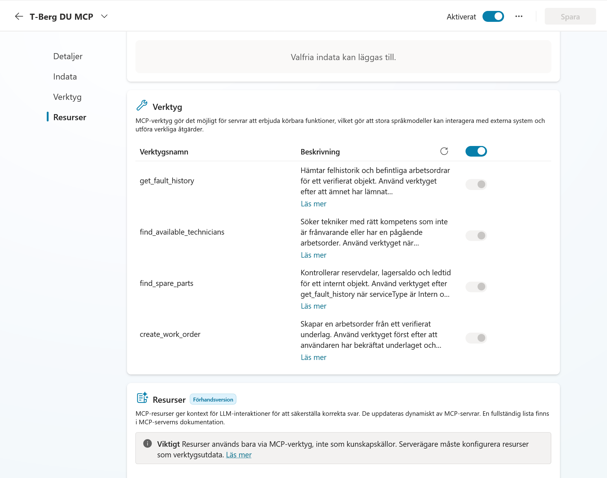

Slå på reglaget som tillåter alla verktyg. Stäng sedan av `create_work_order` separat. Tre verktyg ska vara aktiva:

- `get_fault_history`
- `find_available_technicians`
- `find_spare_parts`

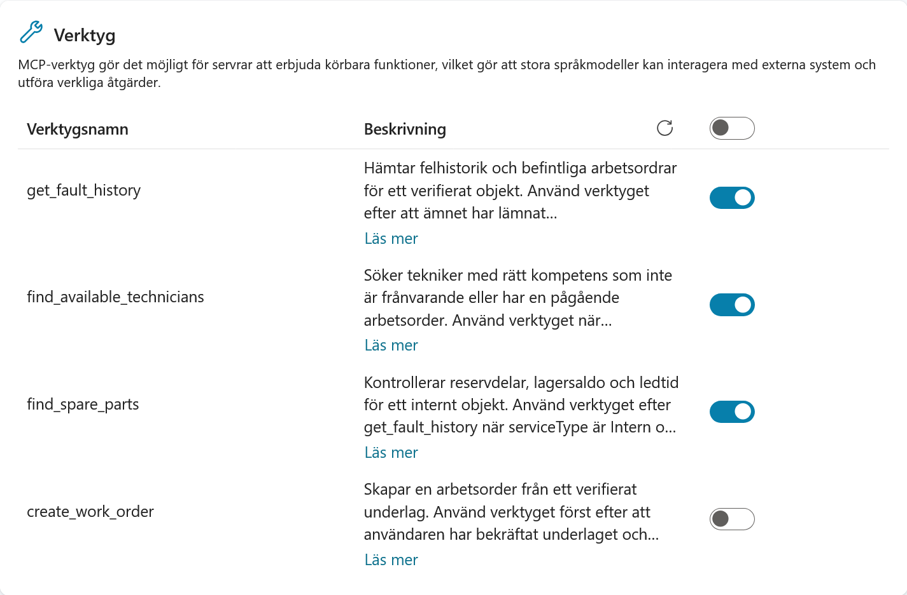

!!! info "Varför stänger vi av create_work_order?"
    MCP-servern kan skapa en arbetsorder, men kursens agent ska inte skriva till underhållssystemet utan godkännande. I nästa kapitel bygger vi ett granskningsämne som hämtar användarens godkännande. I kapitel 9 bygger vi agentflödet som använder REST-connectorns skrivåtgärd. MCP-verktygen används här bara för att hämta underlag.

---

## Del 6: Uppdatera agentens instruktioner

Gå tillbaka till agentens **Översikt** och öppna instruktionerna. Lägg in följande block efter det befintliga avsnittet **Felanmälan** och före **Regler**:

```text
Efter verifieringen
När /Rapportera utrustningsfel returnerar answered som false ska du följa dessa steg i ordning:

1. Anropa get_fault_history med assetId och errorCode från MaintenanceContext.
2. Anropa find_available_technicians med requiredSkill från MaintenanceContext.
3. Bedöm om felet verkar återkommande och identifiera relevanta tidigare åtgärder. Använd det technicianId som find_available_technicians returnerar. Värdet kan vara UNASSIGNED.
4. Anropa find_spare_parts endast när serviceType är Intern och antingen impactLevel är Stoppad eller sameErrorCodeCount är större än 0.
5. Om reservdelar kontrollerades ska artikel, lagersaldo och ledtid ingå i underlaget. Ta inte med reservdelsinformation om ingen kontroll gjordes.

Behåll assetId, impactLevel, priority och technicianId oförändrade.

Hitta inte på felhistorik, tekniker, tillgänglighet, reservdelar, lagersaldo eller ledtid. Visa inte råa fältnamn eller verktygssvar för användaren.
```

Skriv `/` före `Rapportera utrustningsfel` och välj ämnet i listan.

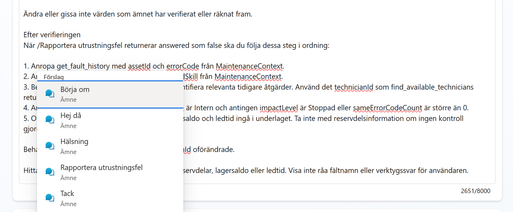

Ämnesnamnet ska visas som ett markerat objekt. MCP-verktygens namn ska däremot vara vanlig text utan `/` framför.

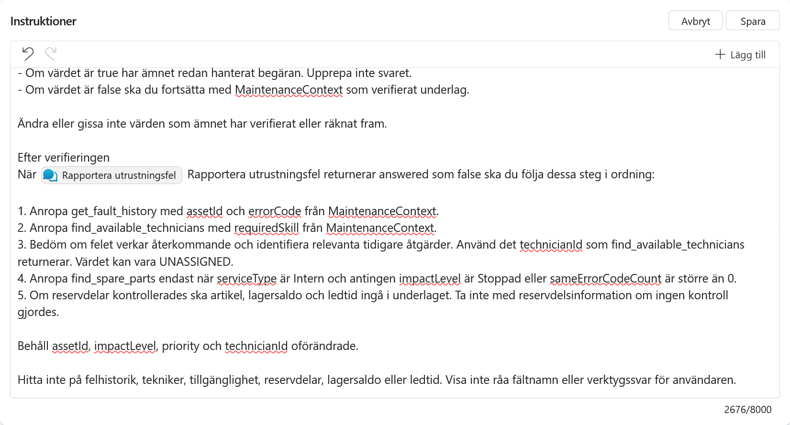

Välj **Spara**.

---

## Del 7: Öppna det skapade anslutningsprogrammet

Guiden i Copilot Studio har skapat ett anpassat anslutningsprogram i Power Platform. Vi öppnar det för att lägga till T-Berg D&U-loggan och kontrollera den tekniska konfigurationen.

Välj **Verktyg** i Copilot Studios vänstermeny.

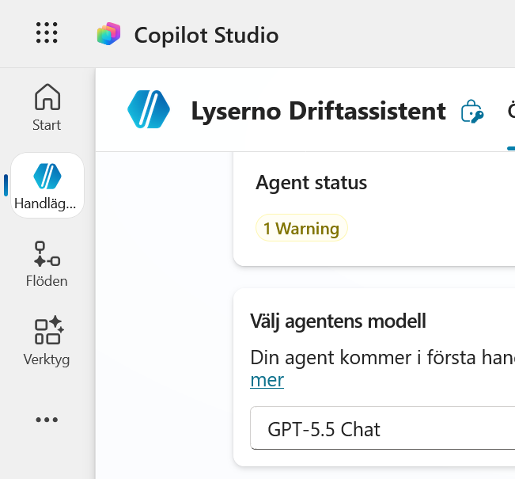

Leta upp `T-Berg DU MCP`. Öppna menyn med de tre punkterna och välj **Redigera**.

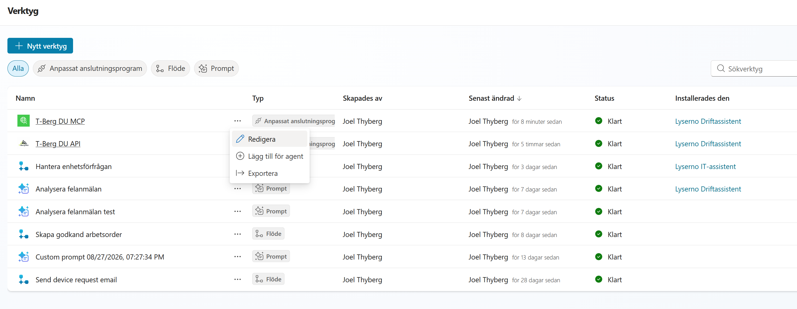

Power Platform öppnar det anpassade anslutningsprogrammet.

---

## Del 8: Lägg till ikon och kontrollera connectorn

På fliken **Allmänt** laddar du upp T-Berg D&U-loggan:

<p><a class="button button--primary button--download" href="../../../downloads/standard-advanced/tberg-du-logo.png" download>Ladda ner T-Berg D&amp;U-loggan</a></p>

Ange följande bakgrundsfärg:

```text
#fefefe
```

Kontrollera att **Anslut via lokal datagateway** inte är markerad och att följande värden visas:

| Fält | Värde |
|---|---|
| Beskrivning | `Ger Lyserno Driftassistent tillgång till felhistorik, tillgängliga tekniker och reservdelar i T-Berg D&U. Använd servern efter att ämnet Rapportera utrustningsfel har lämnat ett verifierat MaintenanceContext.` |
| Schema | `HTTPS` |
| Värd | `ca-tberg-du-api.orangesmoke-45b4d851.swedencentral.azurecontainerapps.io` |
| Bas-URL | `/` |

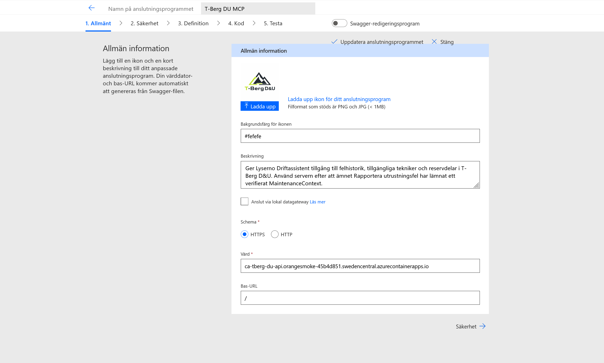

!!! note "Låt säkerhetsinställningarna vara"
    MCP-guiden har redan skapat API-nyckelautentiseringen med headern `x-workshop-key`. I det genererade anslutningsprogrammet kan parameteretiketten vara låst eller se tom ut. Försök inte ändra den här. Namnet `T-Berg-testnyckel` angav du när du skapade den separata anslutningen.

Välj **Definition**. Under **Allmänt** ska en åtgärd visas med följande värden:

| Fält | Värde |
|---|---|
| Sammanfattning | `T-Berg DU MCP` |
| Åtgärds-ID | `InvokeServer` |

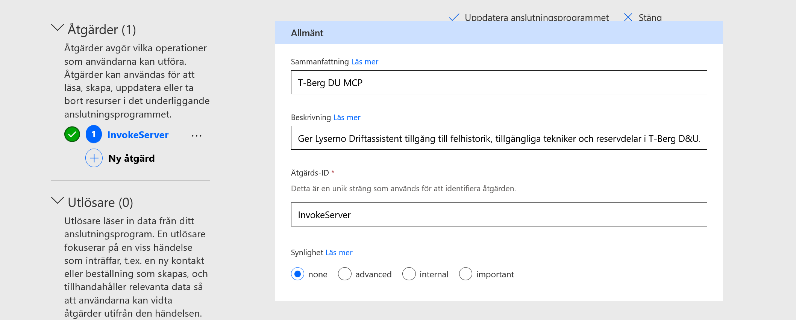

Under **Förfrågan** ska metoden vara `POST` och URL:en ska sluta med `/mcp`.

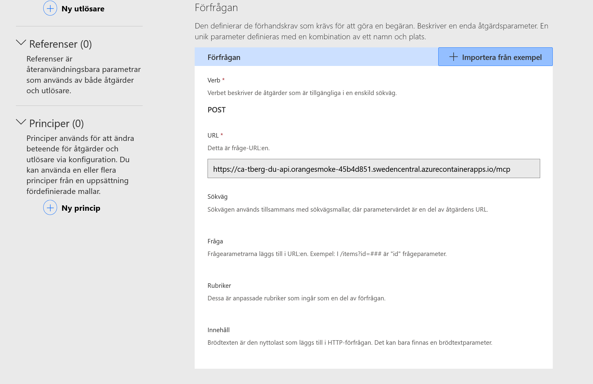

Under **Svar** ska status `200` med texten `Immediate Response` visas. Kontrollera också att valideringen är klar.

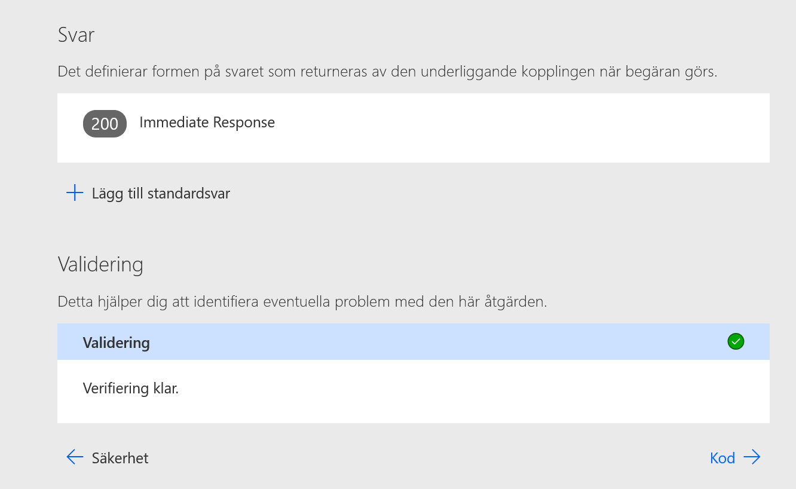

Gör inga ändringar på fliken **Kod**. Välj **Uppdatera anslutningsprogrammet** för att spara ikonen och stäng sedan redigeraren.

Vi använder inte fliken **Testa** här. `InvokeServer` är MCP-transporten, inte ett vanligt affärsanrop med egna testfält. Den riktiga kontrollen görs från agenten i Copilot Studio.

---

## Del 9: Testa den fördjupade utredningen

Gå tillbaka till Copilot Studio och öppna testchatten. Kör igenom samma felanmälan med felbild som i föregående kapitel och svara på agentens följdfrågor.

Agenten ska nu:

1. verifiera objektet genom ämnet
2. hämta felhistorik
3. söka efter en tillgänglig tekniker med rätt kompetens
4. bara kontrollera reservdelar när villkoren i instruktionen är uppfyllda
5. visa ett läsbart underlag utan råa verktygssvar

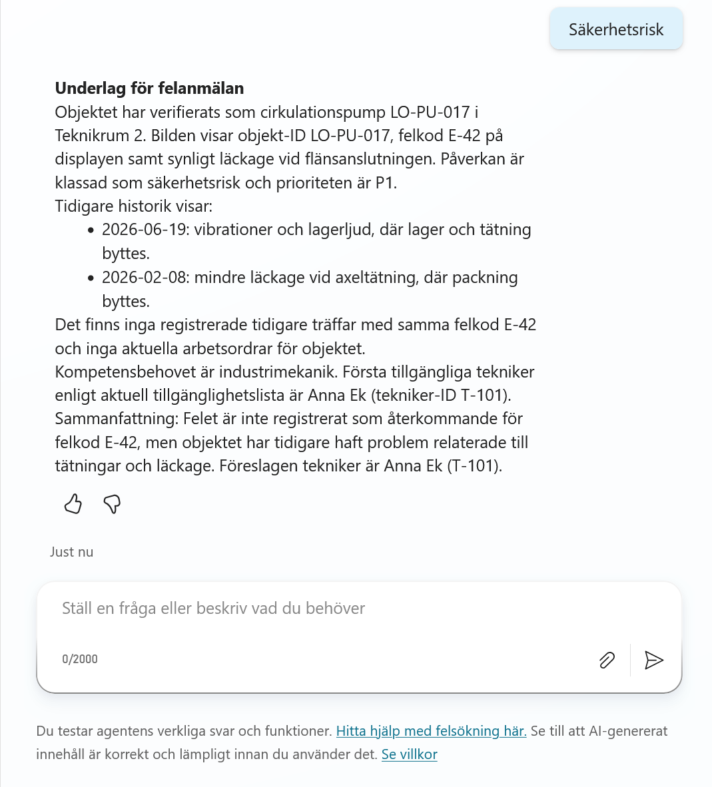

Formuleringen kan variera. Kontrollera att objekt-ID, påverkan och prioritet fortfarande kommer från det verifierade `MaintenanceContext`, att teknikern kommer från MCP-resultatet och att agenten inte påstår att en arbetsorder har skapats.

!!! info "Ett tillfälligt testsvar"
    I det här kapitlet kan agenten visa MCP-underlaget direkt eftersom granskningsämnet ännu inte är byggt. I den färdiga lösningen visas det samlade underlaget en gång, i det adaptiva kortet i ämnet **Granska och skapa arbetsorder**.

---

!!! success "Agenten kan nu fördjupa felanmälan"
    Agenten hämtar felhistorik och tillgängliga tekniker och kontrollerar reservdelar när reglerna kräver det. Den kan fortfarande inte skapa en arbetsorder på egen hand. I nästa kapitel bygger vi ämnet som visar underlaget och hämtar användarens godkännande.
