# 8. Granska och skapa arbetsorder

Agenten kan nu verifiera objektet och hämta felhistorik, tekniker och reservdelar. Innan den får skapa en arbetsorder behöver användaren se det samlade underlaget och fatta ett tydligt beslut. I det här kapitlet bygger vi därför ett separat ämne för granskning och godkännande.

När kapitlet är klart har du:

- skapat ämnet **Granska och skapa arbetsorder**
- lagt till fem indatavariabler för det verifierade underlaget
- byggt ett adaptivt kort med knapparna **Godkänn och skapa** och **Avbryt**
- sparat användarens val i variabeln `approvalChoice`
- avslutat processen utan att skapa en arbetsorder när användaren avbryter
- startat ett nytt agentflöde i den godkända grenen

!!! info "Varför använder vi ett eget ämne?"
    Ämnet gör godkännandet förutsägbart. Kortet visar samma fält varje gång, och villkoret avgör vilken gren som får fortsätta. Agenten kan inte hoppa över godkännandet eller tolka ett avbrott som ett godkännande.

---

## Del 1: Skapa ämnet

Gå till **Ämnen** i agenten och välj **Lägg till ett ämne** > **Från tomt**.

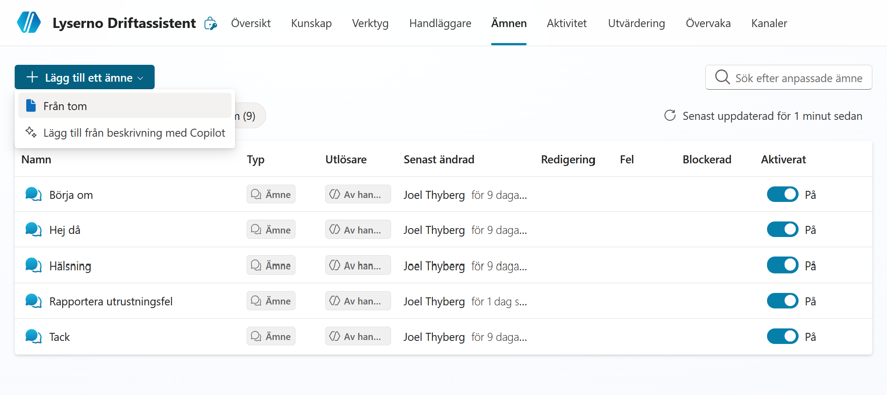

Ge ämnet följande namn:

```text
Granska och skapa arbetsorder
```

Ange följande modellbeskrivning i utlösaren:

```text
Använd ämnet när felanmälan är verifierad och MCP-uppslagen är klara. Ämnet visar arbetsorderunderlaget och låter användaren godkänna eller avbryta. Vid godkännande skapar ämnet arbetsordern.
```

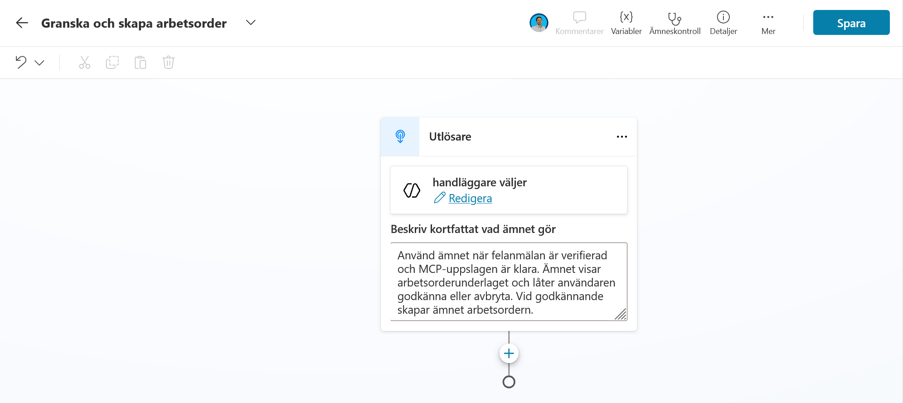

Välj **Spara**.

---

## Del 2: Kontrollera ämnesinformationen

Öppna **Detaljer** uppe till höger. På fliken **Ämnesinformation** kontrollerar du följande:

| Fält | Värde |
|---|---|
| Namn | `Granska och skapa arbetsorder` |
| Visningsnamn för modell | `Granska och skapa arbetsorder` |
| Modellbeskrivning | Texten du nyss angav i utlösaren |
| Fråga användaren innan det här verktyget körs | `Av` |
| Status | `På` |

Fältet **Beskrivning** kan lämnas tomt. Modellbeskrivningen talar om för agenten när ämnet ska användas.

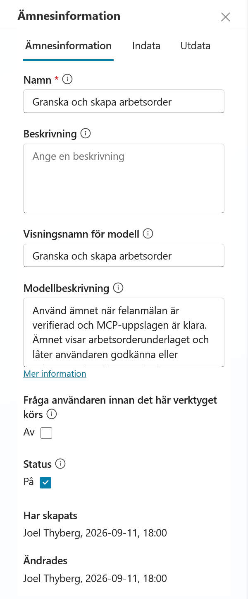

Gå sedan till fliken **Indata** och välj **Skapa en ny variabel**.

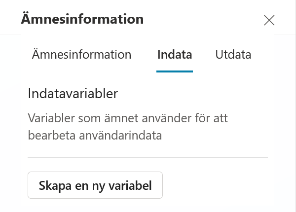

---

## Del 3: Lägg till ämnets indata

Ämnet ska ta emot fem textvärden. Använd följande inställningar för samtliga variabler:

- **Hur ska handläggare fylla i dessa indata?**: `Fyll i dynamiskt med bästa alternativet (standard)`
- **Variabel datatyp**: `String`
- **Identifiera som**: lämnas tomt
- **Känsliga data**: `Av`

Skapa variablerna en i taget.

### 1. Objekt-ID

Variabelnamn och visningsnamn:

```text
assetId
```

Beskrivning:

```text
Verifierat objekt-ID från MaintenanceContext. Skicka värdet oförändrat.
```

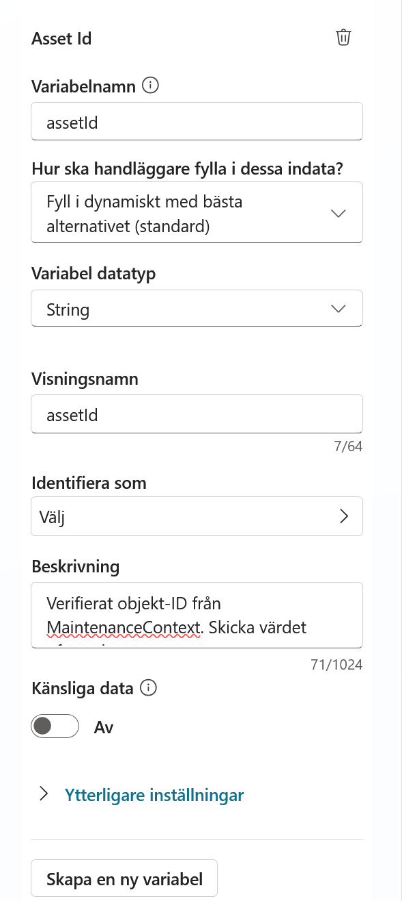

### 2. Rubrik

Variabelnamn och visningsnamn:

```text
title
```

Beskrivning:

```text
Kort rubrik som sammanfattar faultSummary. Lägg inte till uppgifter som saknas i det verifierade underlaget.
```

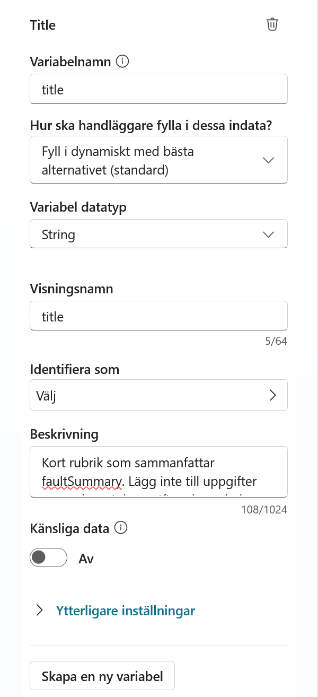

### 3. Beskrivning

Variabelnamn och visningsnamn:

```text
description
```

Beskrivning:

```text
Samlad arbetsorderbeskrivning från det verifierade underlaget och MCP-resultaten. Ta med felkod, relevant felhistorik och reservdelsresultat när en kontroll gjordes. Lägg inte till obekräftade uppgifter.
```

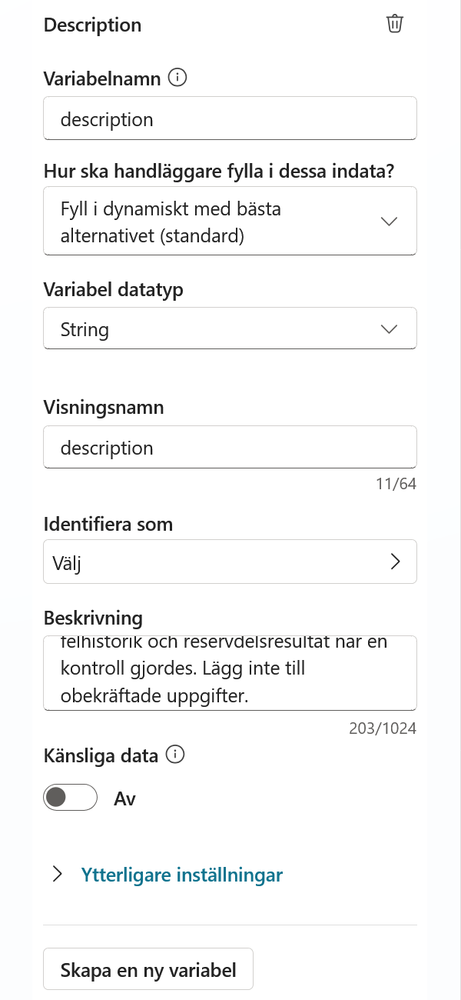

### 4. Prioritet

Variabelnamn och visningsnamn:

```text
priority
```

Beskrivning:

```text
Prioritet P1–P4 från MaintenanceContext. Skicka värdet oförändrat.
```

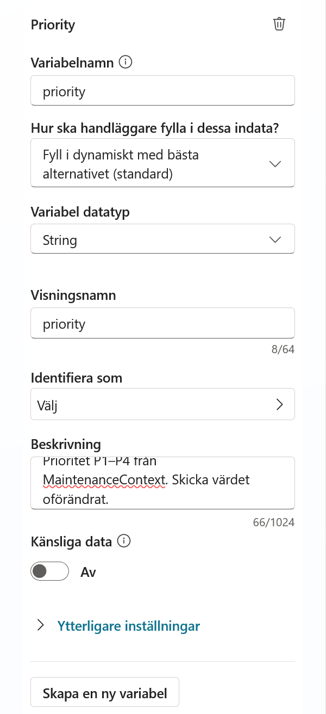

### 5. Tekniker-ID

Variabelnamn och visningsnamn:

```text
technicianId
```

Beskrivning:

```text
Tekniker-ID som find_available_technicians returnerade. Skicka exakt det värdet. Det kan vara UNASSIGNED och får inte lämnas tomt.
```

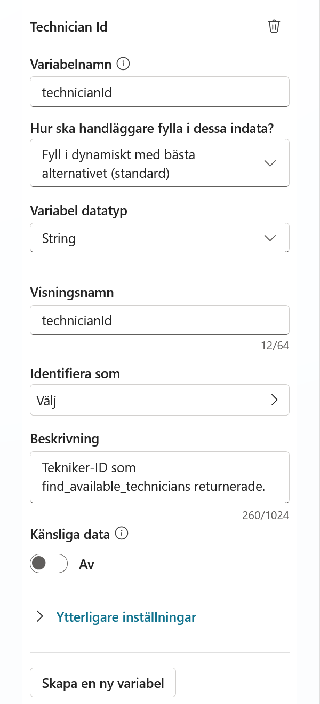

Stäng ämnesinformationen när alla fem variabler är klara. Lägg inte till någon utdatavariabel för ämnet. Varje gren kommer senare att ge användaren ett eget meddelande och avsluta alla ämnen.

---

## Del 4: Lägg till det adaptiva kortet

Ställ dig under utlösaren och välj **Fråga med adaptivt kort**.

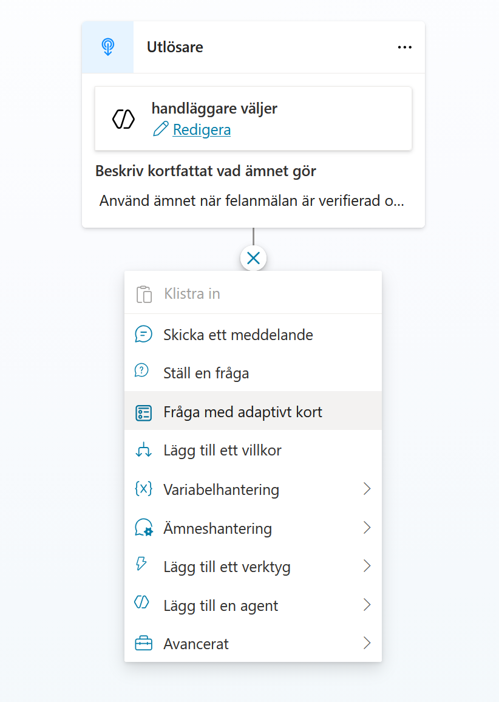

Byt namn på noden till:

```text
Granska arbetsorderunderlag
```

Öppna nodens meny med de tre punkterna och välj **Egenskaper**. Kontrollera att formatet är **JSON-kort** och välj **Redigera adaptivt kort**.

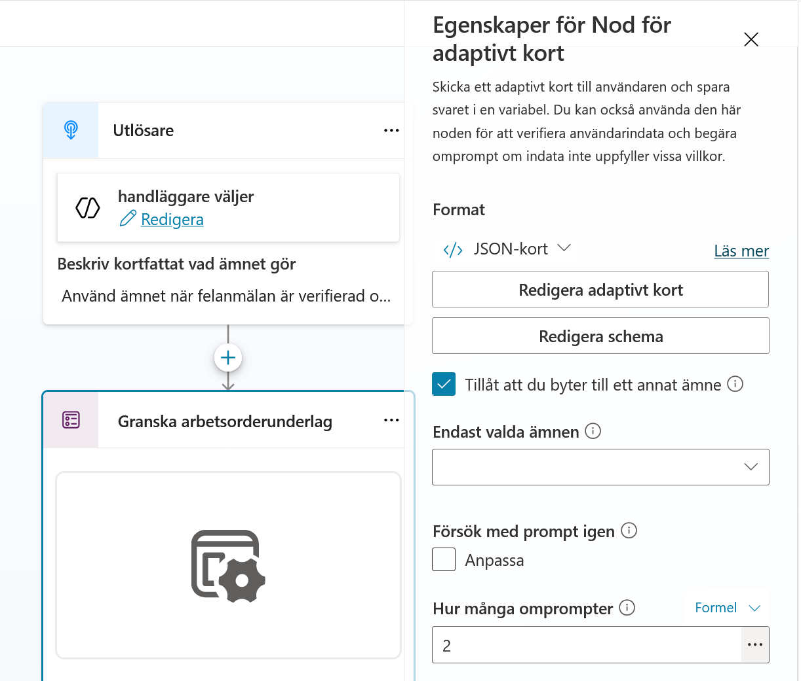

Markera allt i **Redigerare för kortets nyttolast**, ta bort det och klistra in följande JSON:

```json
{
  "type": "AdaptiveCard",
  "$schema": "https://adaptivecards.microsoft.com/schemas/adaptive-card.json",
  "version": "1.5",
  "body": [
    {
      "type": "TextBlock",
      "text": "Kontrollera underlaget",
      "weight": "Bolder",
      "size": "Large",
      "wrap": true
    },
    {
      "type": "TextBlock",
      "text": "Kontrollera uppgifterna innan arbetsordern skapas.",
      "wrap": true,
      "spacing": "Small",
      "isSubtle": true
    },
    {
      "type": "FactSet",
      "spacing": "Medium",
      "facts": [
        {
          "title": "Objekt-ID:",
          "value": "LO-PU-017"
        },
        {
          "title": "Rubrik:",
          "value": "Cirkulationspump 17 med läckage"
        },
        {
          "title": "Prioritet:",
          "value": "P3"
        },
        {
          "title": "Tekniker-ID:",
          "value": "T-103"
        },
        {
          "title": "Rapportör:",
          "value": "Joel Thyberg"
        }
      ]
    },
    {
      "type": "TextBlock",
      "text": "Beskrivning",
      "weight": "Bolder",
      "separator": true,
      "spacing": "Medium",
      "wrap": true
    },
    {
      "type": "TextBlock",
      "text": "Pumpen fungerar inte som den ska. Felkod E-42 visas och ett läckage syns vid flänsen.",
      "wrap": true,
      "spacing": "Small"
    },
    {
      "type": "TextBlock",
      "text": "Godkänn för att skapa arbetsordern. Avbryt för att avsluta utan att skapa någon arbetsorder.",
      "wrap": true,
      "spacing": "Medium",
      "separator": true
    }
  ],
  "actions": [
    {
      "type": "Action.Submit",
      "id": "approveWorkOrderButton",
      "title": "Godkänn och skapa",
      "style": "positive",
      "data": {
        "actionSubmitId": "approve_work_order"
      }
    },
    {
      "type": "Action.Submit",
      "id": "cancelWorkOrderButton",
      "title": "Avbryt",
      "data": {
        "actionSubmitId": "cancel_work_order"
      }
    }
  ]
}
```

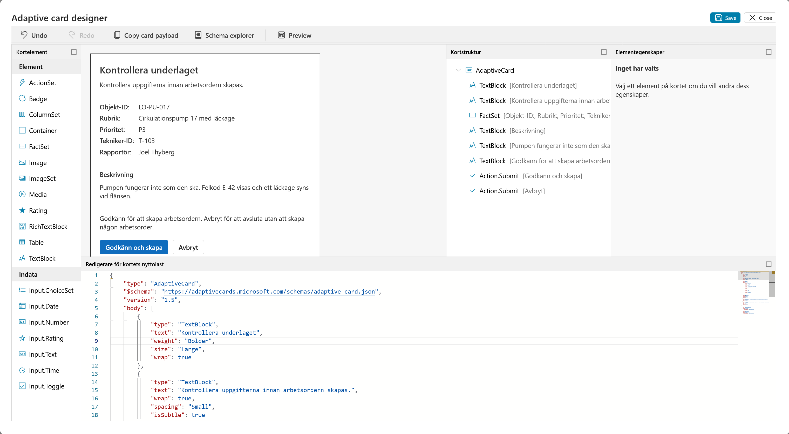

Välj **Save** och sedan **Close**.

Kortet visas nu i noden. Rulla längst ner och kontrollera att **Utdata (1)** innehåller textfältet `actionSubmitId`.

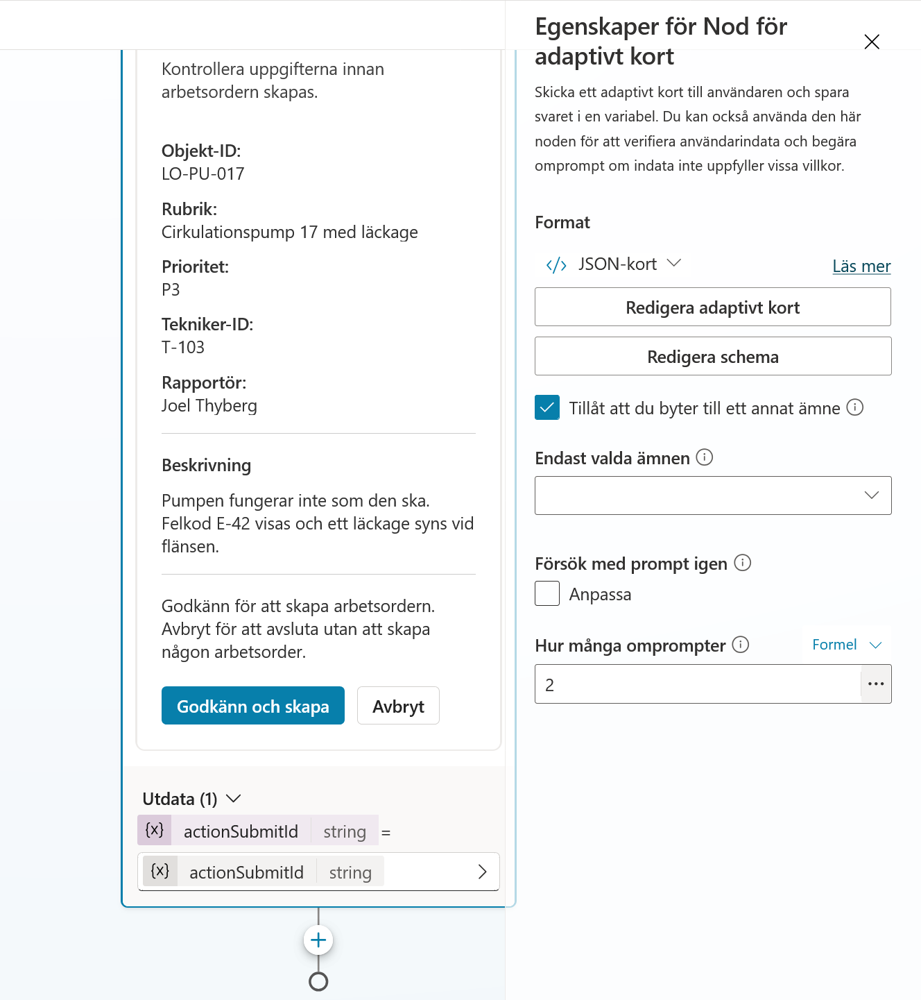

!!! info "Varför börjar vi med JSON?"
    JSON-versionen gör mer än att skapa kortets utseende. När kortet sparas läser Copilot Studio värdet `actionSubmitId` i knapparnas `data` och skapar kortets utdataschema. Därför visas `actionSubmitId` under **Utdata**.

    Om vi börjar direkt med en formel kan kortet visas korrekt, men Copilot Studio vet inte vilket utdatavärde knapptryckningen ska lämna. Det kan ge fel om att `output` eller `outputType` saknas. Vi sparar därför JSON-versionen först och byter sedan till formeln som hämtar ämnets riktiga värden. Utdataschemat finns då kvar.

---

## Del 5: Byt till ett dynamiskt formelkort

Öppna kortets egenskaper igen. Öppna listan **Format** och byt från **JSON-kort** till **Formel**.

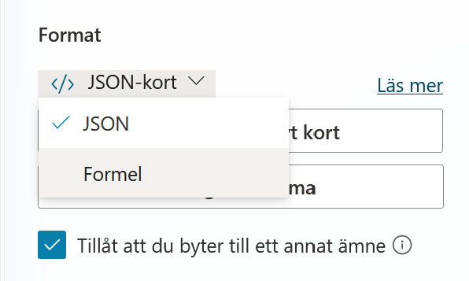

Välj formelfältet och öppna den utökade redigeraren med expansionsikonen.

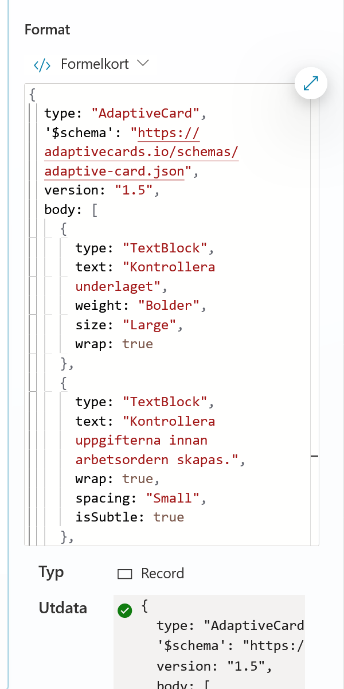

Ersätt den befintliga formeln med följande:

```powerfx
{
    '$schema': "https://adaptivecards.microsoft.com/schemas/adaptive-card.json",
    type: "AdaptiveCard",
    version: "1.5",
    body: [
        {
            type: "TextBlock",
            text: "Kontrollera underlaget",
            weight: "Bolder",
            size: "Large",
            wrap: true
        },
        {
            type: "TextBlock",
            text: "Kontrollera uppgifterna innan arbetsordern skapas.",
            wrap: true,
            spacing: "Small",
            isSubtle: true
        },
        {
            type: "FactSet",
            spacing: "Medium",
            facts: [
                {
                    title: "Objekt-ID:",
                    value: Topic.assetId
                },
                {
                    title: "Rubrik:",
                    value: Topic.title
                },
                {
                    title: "Prioritet:",
                    value: Topic.priority
                },
                {
                    title: "Tekniker-ID:",
                    value: Topic.technicianId
                },
                {
                    title: "Rapportör:",
                    value: System.User.DisplayName
                }
            ]
        },
        {
            type: "TextBlock",
            text: "Beskrivning",
            weight: "Bolder",
            separator: true,
            spacing: "Medium",
            wrap: true
        },
        {
            type: "TextBlock",
            text: Topic.description,
            wrap: true,
            spacing: "Small"
        },
        {
            type: "TextBlock",
            text: "Godkänn för att skapa arbetsordern. Avbryt för att avsluta utan att skapa någon arbetsorder.",
            wrap: true,
            spacing: "Medium",
            separator: true
        }
    ],
    actions: [
        {
            type: "Action.Submit",
            id: "approveWorkOrderButton",
            title: "Godkänn och skapa",
            style: "positive",
            data: {
                actionSubmitId: "approve_work_order"
            }
        },
        {
            type: "Action.Submit",
            id: "cancelWorkOrderButton",
            title: "Avbryt",
            data: {
                actionSubmitId: "cancel_work_order"
            }
        }
    ]
}
```

Formeln ersätter exempelvärdena med ämnets indatavariabler. Rapportörens namn hämtas från `System.User.DisplayName`.

Kontrollera den gröna bocken och förhandsvisningen. Stäng sedan formelredigeraren.

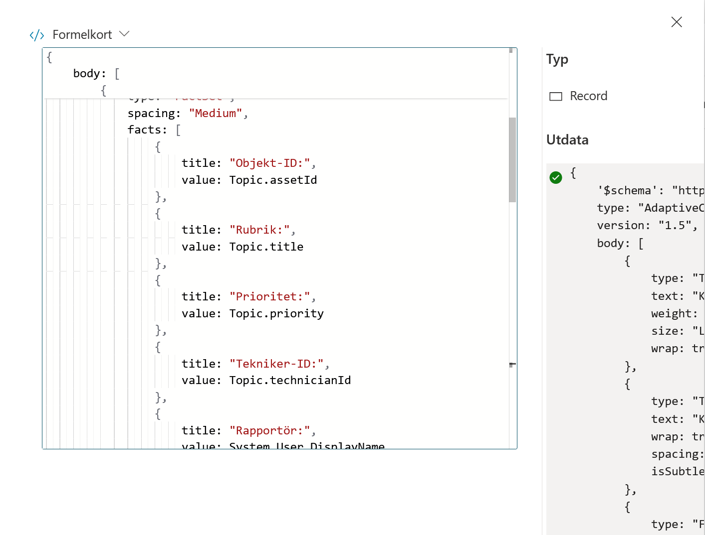

---

## Del 6: Spara användarens val

Under **Utdata (1)** ska fältet på vänster sida fortfarande heta `actionSubmitId`. Det är fältnamnet som kommer från kortet och ska inte ändras.

Öppna variabeln till höger om likhetstecknet och byt variabelnamn till:

```text
approvalChoice
```

Välj **Ämne (begränsad omfattning)**. Variabeln ska inte vara global.

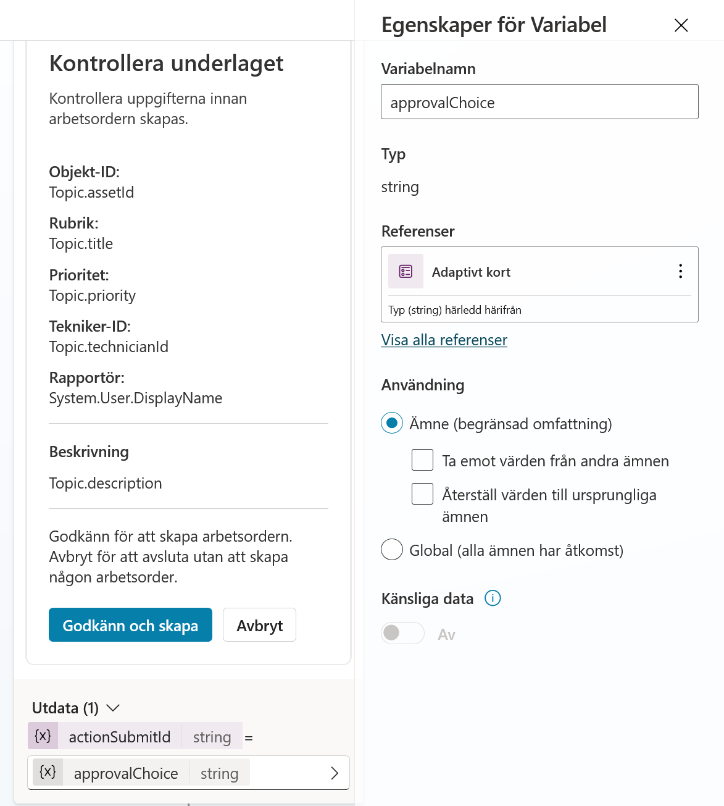

Efter ändringen visar raden att `actionSubmitId` kopplas till `Topic.approvalChoice`.

Knapparnas interna värden är `approve_work_order` och `cancel_work_order`. De synliga knapptexterna är på svenska, men värdena ska vara kvar på engelska eftersom villkoret använder dem.

---

## Del 7: Lägg till villkoret

Ställ dig under det adaptiva kortet och välj **Lägg till ett villkor**.

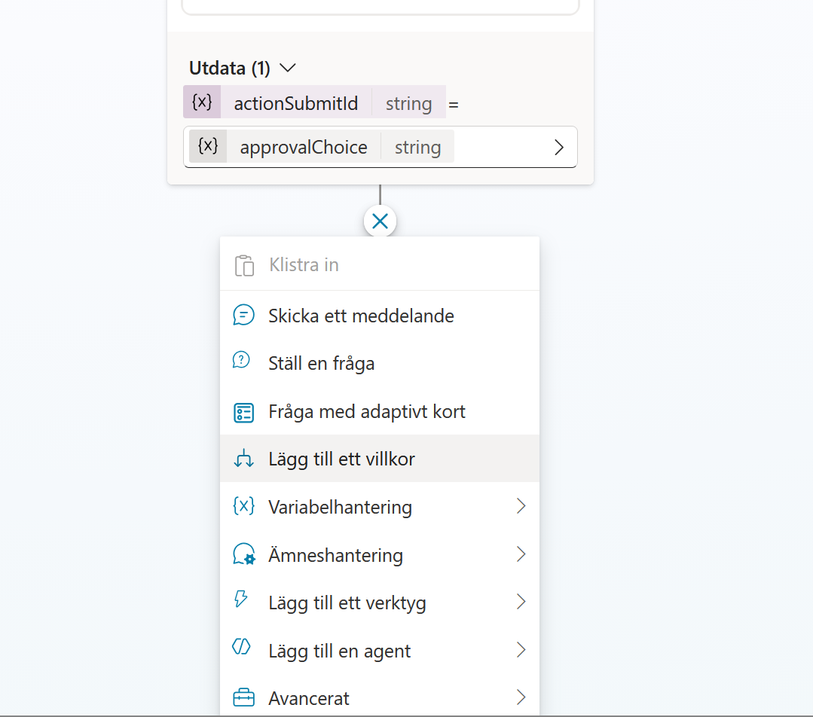

Byt namn på villkorsgruppen till:

```text
Kontrollera godkännande
```

Öppna variabelväljaren och välj `approvalChoice` under **Anpassad**.

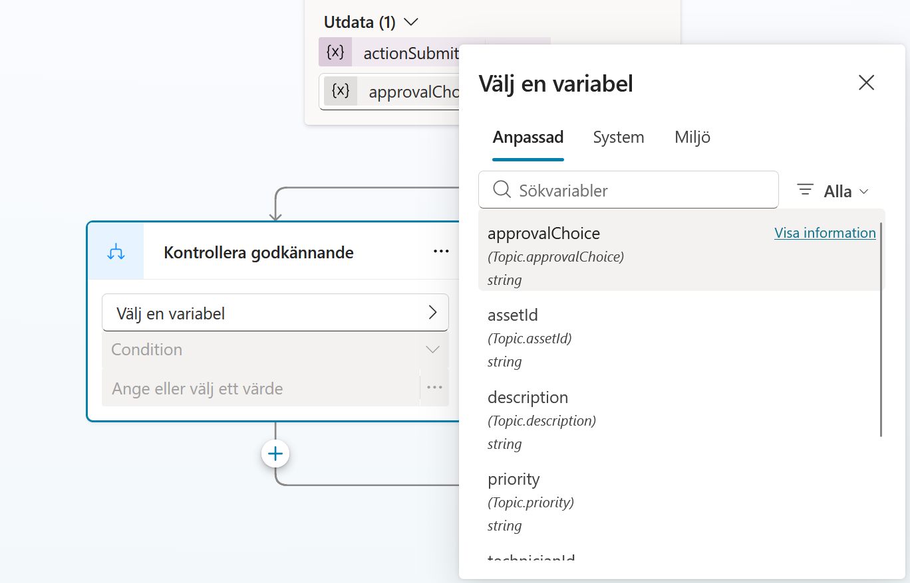

Kontrollera att operatorn är **är lika med**. Den är normalt förvald. Om en annan operator visas öppnar du listan och väljer **är lika med**.

I fältet **Ange eller välj ett värde** klistrar du in:

```text
approve_work_order
```

Endast värdet `approve_work_order` får fortsätta i den godkända grenen. `cancel_work_order`, ett tomt värde och alla oväntade värden går till avbrottsgrenen.

---

## Del 8: Bygg avbrottsgrenen

Byt namn på grenen **Alla övriga villkor** till:

```text
Meddela att arbetsordern avbröts
```

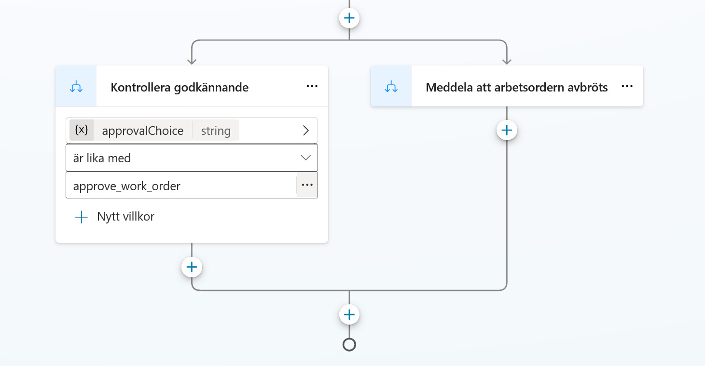

Under **Meddela att arbetsordern avbröts** väljer du **Skicka ett meddelande**.

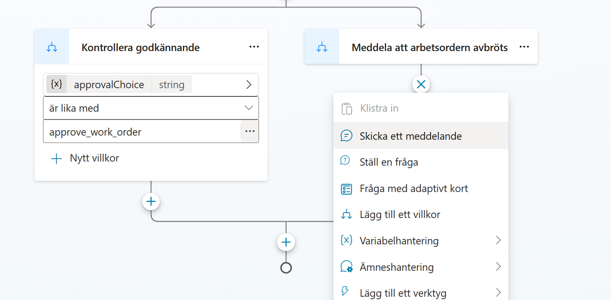

Byt namn på meddelandenoden till:

```text
Meddela att arbetsordern avbröts
```

Skriv följande meddelande:

```text
Ingen arbetsorder skapades.

Om något i underlaget behöver ändras behöver felanmälan göras om, så att objekt, påverkan, prioritet och övriga uppgifter kan verifieras på nytt.
```

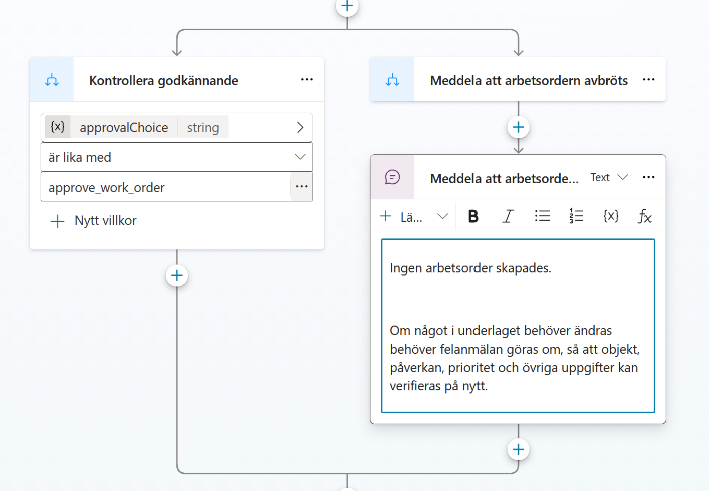

Lägg till nästa nod under meddelandet. Välj **Ämneshantering** > **Avsluta alla ämnen**.

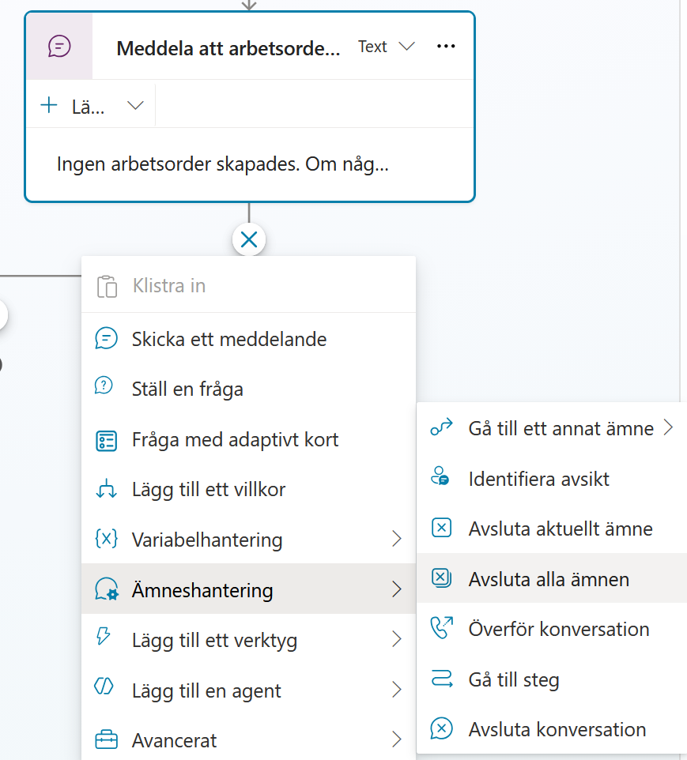

Avbrottsgrenen ska sluta här. Den ska inte återansluta till stegen som skapar arbetsordern.

---

## Del 9: Starta agentflödet i den godkända grenen

Gå till grenen under **Kontrollera godkännande**. Välj **Lägg till ett verktyg** och sedan **Nytt agentflöde**.

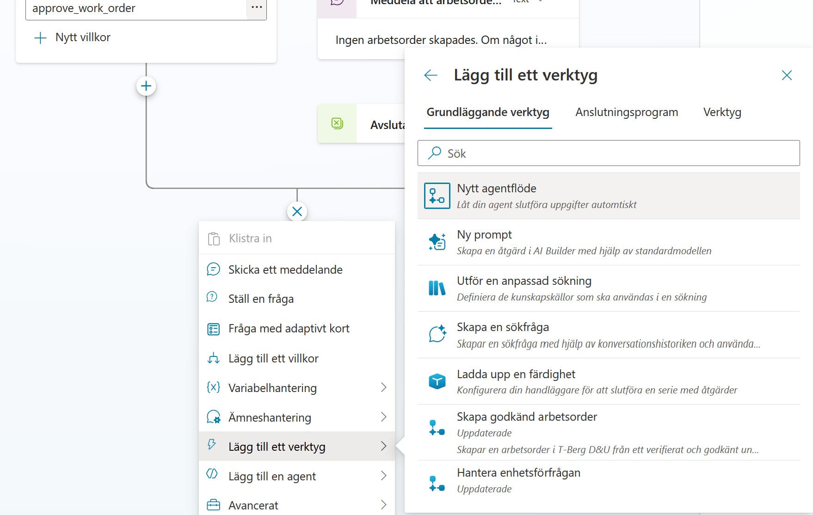

Copilot Studio öppnar ett nytt agentflöde. Låt ämnesfliken vara kvar. I nästa kapitel bygger vi flödet som skapar arbetsordern och skickar bekräftelsemejlet.

---

!!! success "Godkännandet är på plats"
    Ämnet tar emot det verifierade underlaget, visar det i ett adaptivt kort och fortsätter bara när användaren väljer **Godkänn och skapa**. Vid alla andra svar visas avbrottsmeddelandet och processen avslutas utan att någon arbetsorder skapas.
