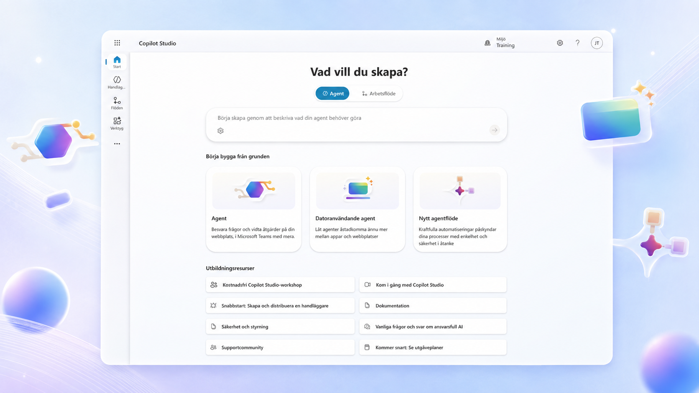

---
hide:
  - navigation
  - toc
---

  <section class="course-hero course-hero--advanced">
    

      <a class="back-link" href="../../">Alla utbildningar</a>
      
COPILOT STUDIO · FÖRDJUPNING

      <h1>Bygg en avancerad standardagent</h1>
      
En fördjupningskurs där agenten kopplas till externa system och fattar beslut som blir likadana varje gång. Du bygger en intern serviceagent med prompt, eget anslutningsprogram, MCP och godkännandeflöde.

      

        <a class="button button--primary" href="00-course-setup/">Starta kursen</a>
        <a class="button button--ghost" href="#kursresan">Se alla kapitel</a>
      

      
FördjupningsnivåFristående kursBygg med själv

    

    

      

        
      

      
<strong>Serviceagent</strong>Analys · uppslag · beslut

    

  </section>

  <section class="scenario-band" id="scenariot">
    

SCENARIOT
<h2>Från felanmälan till godkänt serviceuppdrag</h2>

    
En anställd rapporterar ett utrustningsfel i chatten och bifogar en bild. Agenten läser av märkskylten, hämtar tillgången ur ett underhållssystem, fördjupar utredningen, bestämmer prioritet enligt fasta regler och skapar ett godkänt serviceuppdrag.

  </section>

  <section class="capability-grid" aria-label="Agentens fyra steg">
    <article class="capability capability--green">01<h3>Bilden identifierar</h3>
Prompten läser märkskylt och felkod ur ett foto och returnerar strukturerad data.
</article>
    <article class="capability capability--blue">02<h3>Connectorn verifierar</h3>
Ett fast uppslag mot affärssystemet gör en gissning till ett faktum.
</article>
    <article class="capability capability--teal">03<h3>Ämnet beslutar</h3>
Kritikalitet och påverkan ger prioritet enligt en regel som inte varierar.
</article>
    <article class="capability capability--coral">04<h3>MCP:n planerar</h3>
Historik, tekniker och reservdelar hämtas utifrån vad uppslaget visade.
</article>
  </section>

  <section class="journey-section" id="kursresan">
    

      
KURSRESAN

      <h2>Determinism där det räknas</h2>
      
Varje kapitel öppnar med något agenten inte klarar än, och avslutas med förmågan som löser det.

    

    

      <article>00
<h3>Kursuppsättning</h3>
Aktivera Copilot Studio, skapa en utvecklingsmiljö och kontrollera att kursens byggblock är tillgängliga.

</article>
      <article>01
<h3>Vad vi bygger — och varför standardagenten</h3>
När ett fel kostar för mycket för att agenten ska få gissa. Generativt i dörren, deterministiskt inuti.

</article>
      <article>02
<h3>Ämnet och den styrda dialogen</h3>
Fånga ärendet, samla in det som saknas och styr vägen framåt.

</article>
      <article>03
<h3>AI-prompt: från bild till strukturerad data</h3>
Läs märkskylt och felkod ur ett foto, och få tillbaka fält du kan förgrena på.

</article>
      <article>04
<h3>Eget anslutningsprogram</h3>
Bygg en egen koppling mot affärssystemet och verifiera objektet.

</article>
      <article>05
<h3>MCP: fördjupa utredningen</h3>
Anslut en MCP-server och låt uppslagen bygga vidare på varandra.

</article>
      <article>06
<h3>Beslutsregeln och godkännandeflödet</h3>
Prioritet enligt fast regel, mänskligt godkännande och skrivning tillbaka.

</article>
      <article>07
<h3>Test, spårbarhet och produktion</h3>
Visa att regeln faktiskt håller — samma ärende, samma svar, varje gång.

</article>
    

  </section>

  <section class="course-cta course-cta--teal">
    

MÅLET
<h2>En agent som har rätt varje gång — och kan visa varför.</h2>

    

Kursen är fristående. Du behöver inte ha gått grundkursen, men den som har det känner igen sig.
<a class="button button--light button--arrow" href="00-course-setup/">Börja med kursuppsättningen</a>

  </section>

