# 1. Kursuppsättning

Innan vi börjar bygga Lysernos IT-supportagent förbereder vi åtkomsten till Copilot Studio, skapar en personlig utvecklingsmiljö och lägger upp kursens data i SharePoint.

När kapitlet är klart har du:

- tillgång till Copilot Studio för att bygga och testa agenten
- en egen utvecklingsmiljö med Dataverse
- kontrollerat att AI-nav går att öppna
- SharePoint-webbplatsen **Lyserno IT-support**
- SharePoint-listan **Enheter** med kursens fem enheter

!!! important "Använd samma konto genom hela uppsättningen"
    Du behöver en e-postadress för **arbete eller skola**. Personliga konton som `@outlook.com` och `@gmail.com` stöds inte för registreringen. Använd samma Microsoft 365-konto i Copilot Studio, Power Apps och SharePoint.

    Om organisationen har stängt av självbetjäningsregistrering behöver du hjälp av en Microsoft 365- eller Power Platform-administratör.

---

## Del 1: Aktivera Copilot Studio

Om du redan har åtkomst till Copilot Studio kan du gå vidare till [Del 2: Skapa en utvecklingsmiljö](#del-2-skapa-en-utvecklingsmiljo).

### 1. Starta registreringen

1. Öppna [Microsoft Copilot Studio](https://www.microsoft.com/sv-se/microsoft-365-copilot/microsoft-copilot-studio?market=se) i en ny flik.
2. Välj **Prova kostnadsfritt**.


### 2. Ange ditt konto

1. Skriv in din e-postadress för arbete eller skola.
2. Välj **Nästa**.


Microsoft kontrollerar om adressen redan tillhör ett befintligt Microsoft-konto.

### 3. Logga in eller starta utvärderingen

- Om kontot redan finns väljer du **Logga in** och genomför den vanliga inloggningen.
- Om kontot ännu inte har Copilot Studio följer du registreringsflödet och startar en utvärderingsversion.

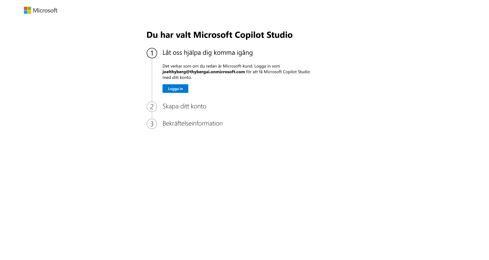

I det sista steget kan du behöva välja land eller region. Kontrollera uppgifterna och välj sedan **Start free trial** eller motsvarande svensk knapp.

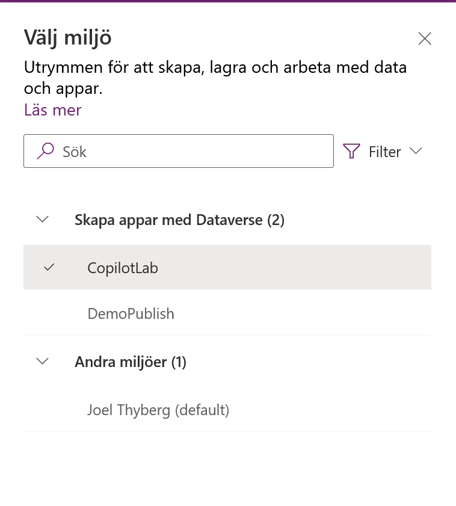

!!! info "Om utvärderingsversionen"
    Utvärderingsversionen gäller inledningsvis i 30 dagar. När perioden löper ut kan den förlängas med ytterligare 30 dagar, och Microsoft anger att agenten kan fortsätta fungera i upp till 90 dagar efter att utvärderingen löpt ut.

    Licensen låter dig bygga och testa agenten i testchatten, vilket räcker under kursen. Den tillåter däremot inte publicering. Läs mer i [Microsofts aktuella information om åtkomst och utvärderingslicenser](https://learn.microsoft.com/sv-se/microsoft-copilot-studio/requirements-licensing-subscriptions).

---

## Del 2: Skapa en utvecklingsmiljö

Power Apps Developer Plan ger dig en kostnadsfri personlig miljö för utveckling och test. Vi använder den när vi bygger agenten, verktygen och agentflödet.

### 1. Registrera Developer Plan

1. Öppna [Power Apps Developer Plan](https://www.microsoft.com/sv-se/power-platform/products/power-apps/free) i en ny flik.
2. Välj **Börja använda kostnadsfritt**.


3. Skriv in samma e-postadress som du använde för Copilot Studio.
4. Markera rutan för att godkänna informationen och avtalen.
5. När knappen aktiveras väljer du **Börja kostnadsfritt**.


När registreringen är klar skickas du vidare till Power Apps.

### 2. Kontrollera miljön

Den nya miljön får normalt ett namn baserat på ditt användarnamn, exempelvis **Miljö för Joel Thyberg**. Om en miljö med samma namn redan finns kan den nya få ett tillägg som `(1)`.

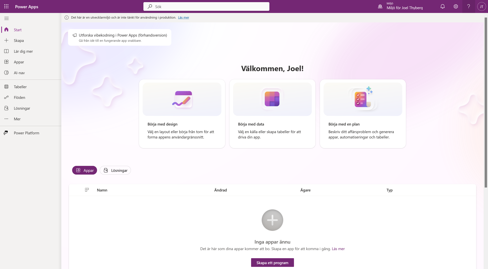

1. Välj miljöväljaren uppe i det högra hörnet.
2. Leta efter den nya miljön under **Skapa appar med Dataverse** eller **Andra miljöer**.
3. Välj din personliga utvecklingsmiljö så att en bock visas bredvid namnet.

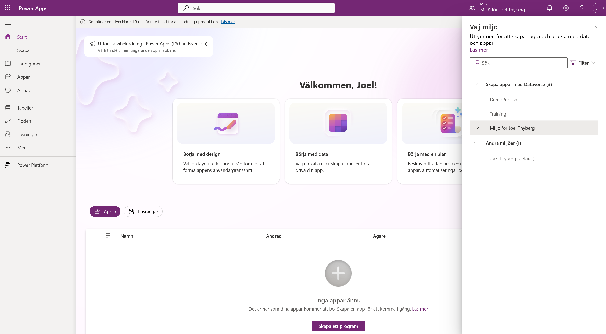

!!! warning "Miljön kan behöva några minuter"
    Uppdatera sidan om miljön inte visas direkt. I vissa klientorganisationer kan det ta upp till ungefär tio minuter innan miljön är klar.

    Utgå från miljöns namn. Välj din personliga utvecklingsmiljö, inte organisationens standardmiljö. Microsoft beskriver samma namn- och väntelogik i [guiden för Power Apps Developer Plan](https://learn.microsoft.com/en-us/power-platform/developer/create-developer-environment).

---

## Del 3: Kontrollera Dataverse och AI-nav

Agenten och dess komponenter sparas i Dataverse. Innan vi fortsätter kontrollerar vi därför att rätt miljö är vald och att AI-nav går att öppna.

### 1. Öppna AI-nav

1. Kontrollera att din personliga utvecklingsmiljö fortfarande är vald uppe till höger.
2. Välj **AI-nav** i vänsternavigeringen.


### 2. Kontrollera resultatet

AI Builder-sidan ska öppnas och visa områden som **Prompter**, **AI-modeller**, **Dokumentautomatisering** och **Övervakningsaktivitet**.

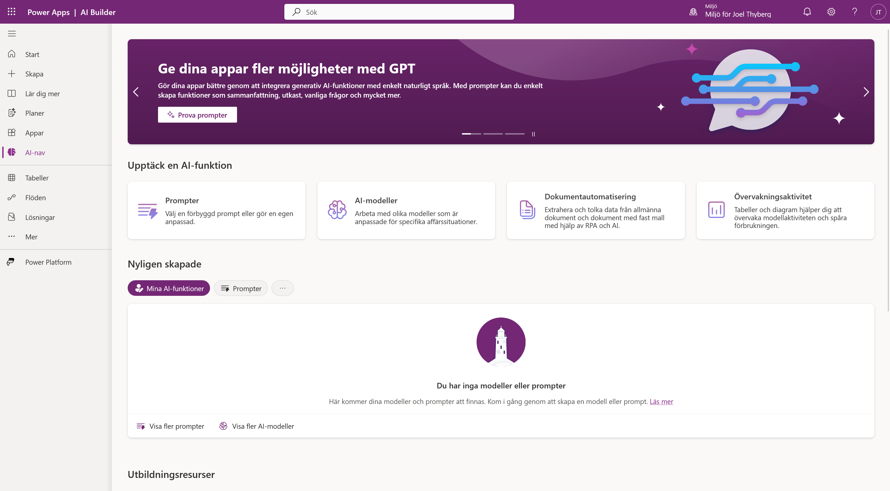

Det räcker att sidan laddar. Du ska inte skapa någon prompt eller modell här.

Om du i stället ser meddelandet **Ingen databas hittades** saknar den valda miljön en Dataverse-databas.

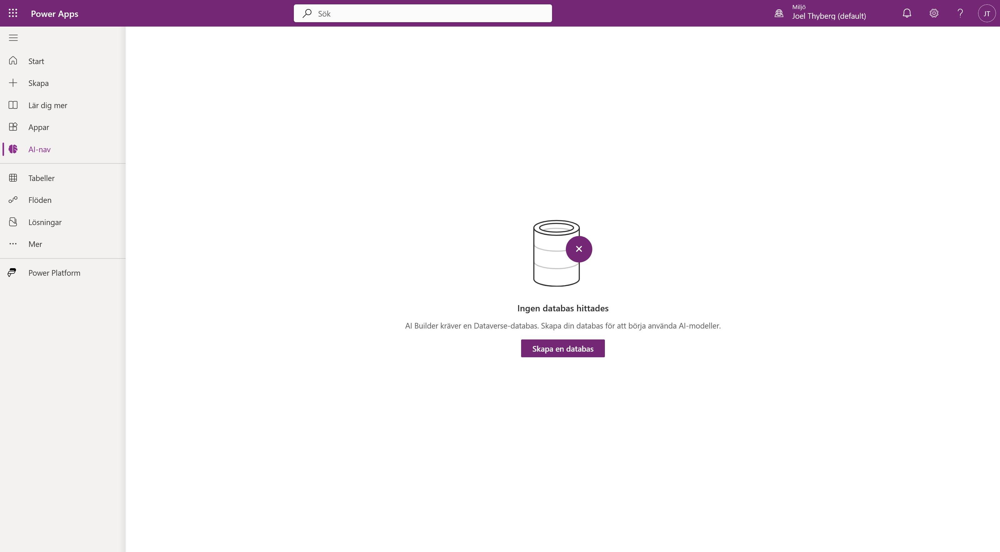

!!! warning "Om ingen databas hittas"
    Kontrollera först att du har valt din personliga utvecklingsmiljö och inte organisationens standardmiljö. Vänta några minuter och uppdatera sedan sidan.

    Om meddelandet ligger kvar behöver miljön få en Dataverse-databas. Välj **Skapa en databas** om du har behörighet. Annars ber du en Power Platform-administratör kontrollera miljön och dina behörigheter innan du fortsätter.

---

## Del 4: Skapa Lyserno IT-support

Nu skapar vi SharePoint-webbplatsen som innehåller Lysernos supportbegäranden och enhetsregister. Vi använder mallen för en IT-supportavdelning eftersom listan **Begäran** behövs senare i kursen.

### 1. Öppna SharePoint

1. Välj appstartaren med de nio punkterna uppe till vänster i Power Apps.
2. Välj **SharePoint**.

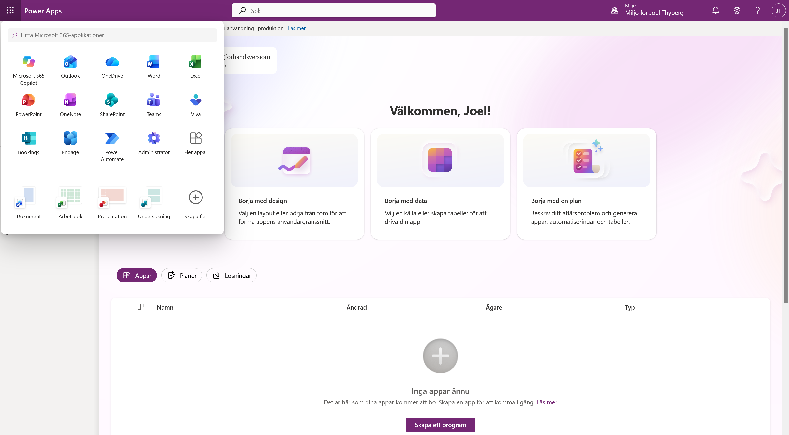

SharePoint öppnas i en ny flik. Du står normalt på **Utforska** när sidan öppnas.

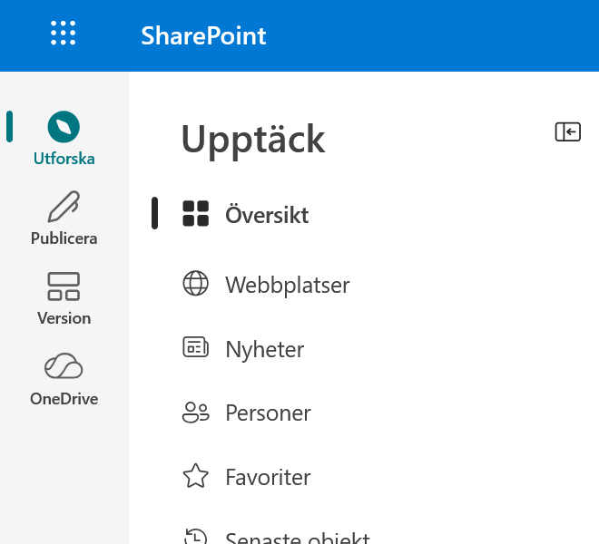

### 2. Börja skapa webbplatsen

1. Välj **Version** i vänsternavigeringen.
2. Under **Börja utveckla** väljer du **Webbplats**.

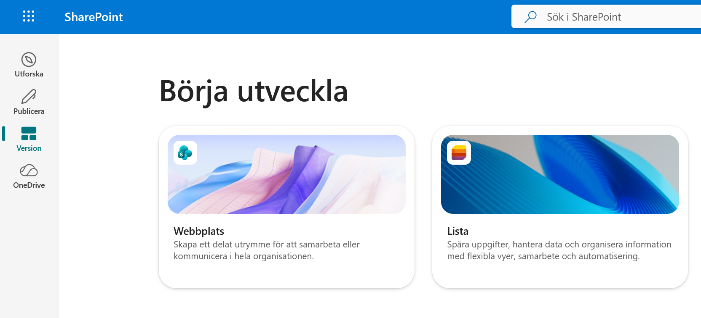

### 3. Välj webbplatsmall

1. Kontrollera att **Gruppwebbplats** är valt. Byt från **Kommunikationswebbplats** om det alternativet visas.
2. Leta upp Microsoft-mallen **IT-supportavdelning** och välj den.

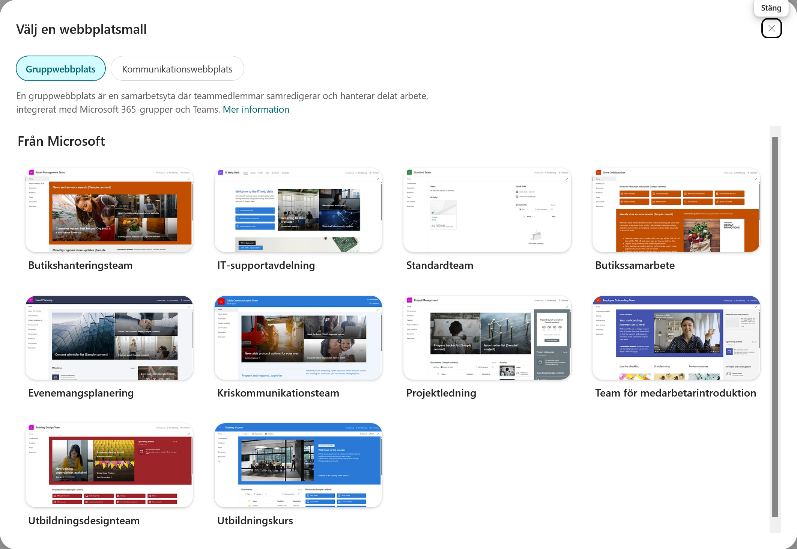

3. Kontrollera förhandsgranskningen och välj **Använd mall**.

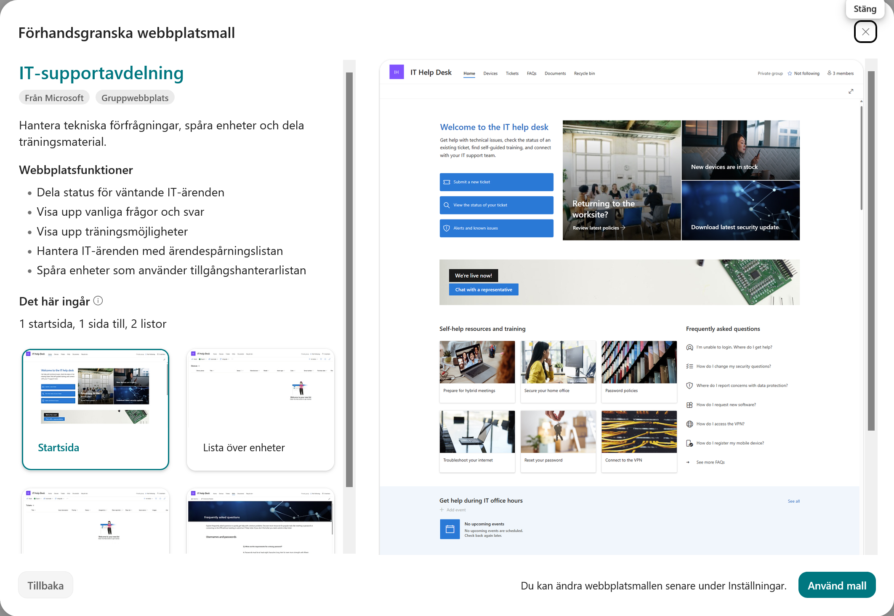

### 4. Konfigurera webbplatsen

Ange följande webbplatsnamn:

```text
Lyserno IT-support
```

Ange följande beskrivning:

```text
Intern IT-support och hantering av enheter för Lyserno
```

Gruppens e-postadress och webbadressen fylls i automatiskt. Välj sedan:

- **Sekretessinställningar:** Privat – endast godkända medlemmar har åtkomst till webbplatsen
- **Välj språk:** Svenska

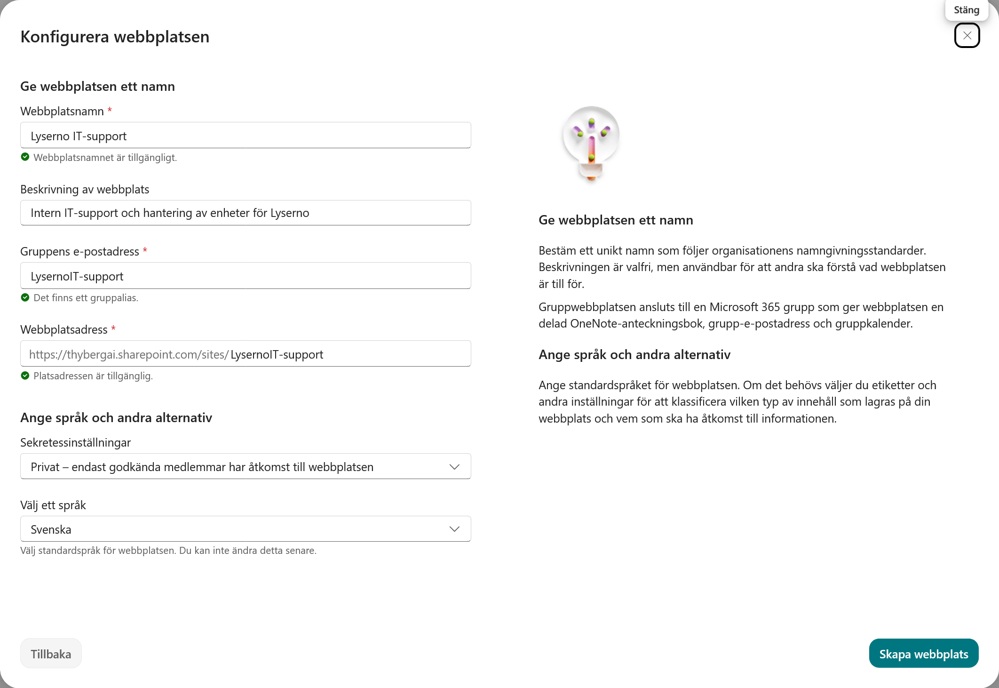

Kontrollera språk och sekretess innan du fortsätter. Välj därefter **Skapa webbplats**.

### 5. Öppna webbplatsen

Medan SharePoint skapar webbplatsen kan du lägga till ägare och medlemmar. Om du arbetar själv lämnar du fälten tomma. Välj sedan **Gå till webbplatsen**.

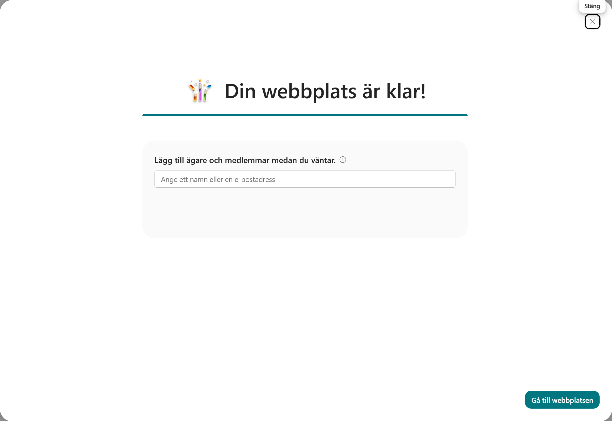

Kontrollera att startsidan för **Lyserno IT-support** öppnas.

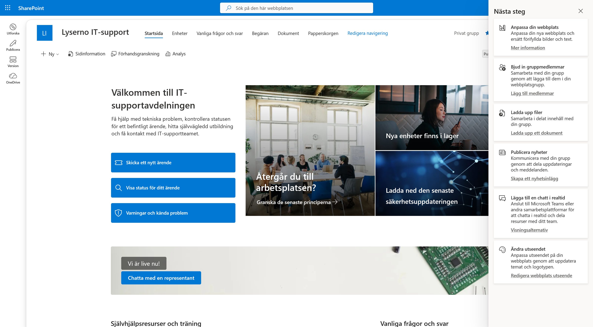

!!! note "Listorna från mallen"
    Mallen skapar listorna **Enheter** och **Begäran**. I nästa del fyller du **Enheter** med kursens testdata. **Begäran** används senare när agenten ska reagera på nya supportärenden, så låt den ligga kvar.

---


## Del 5: Förbered listan Enheter

Mallen har redan skapat listan **Enheter**. Vi lägger till en kolumn för bildlänkar och fyller sedan listan med fem enheter. En av dem får statusen `Bokat`, så att vi senare kan kontrollera att agenten bara visar enheter som är tillgängliga.

### 1. Öppna listan Enheter

Välj **Enheter** i menyn högst upp på webbplatsen.

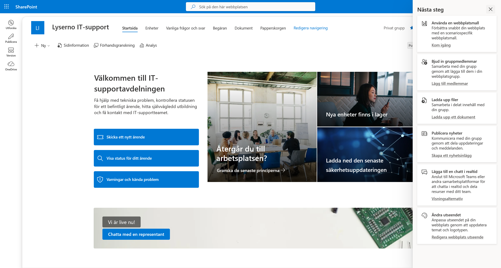

Listan är tom när den öppnas första gången.

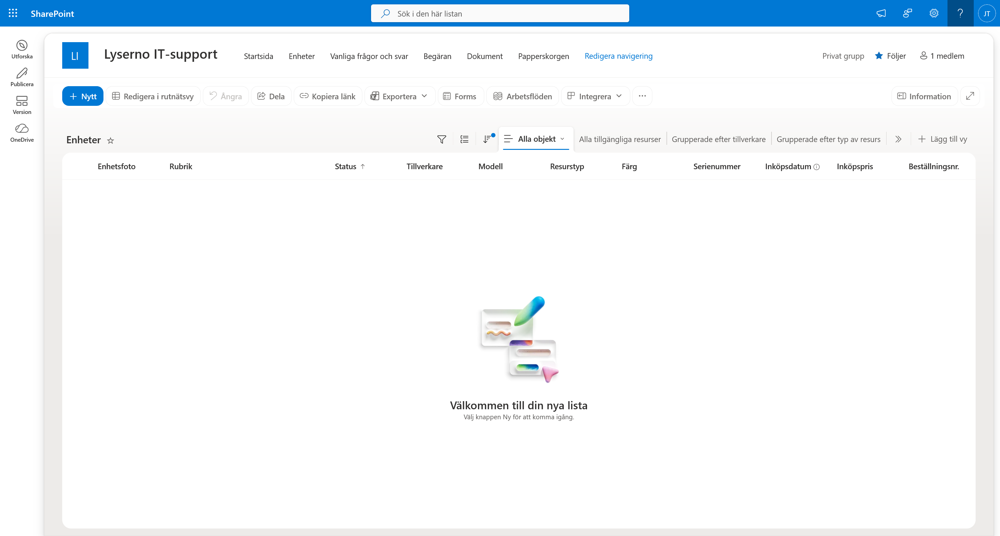

### 2. Lägg till kolumnen Bild

1. Scrolla längst till höger i listan och välj **+ Lägg till kolumn**.
2. Välj **Hyperlänk**.
3. Välj **Nästa**.

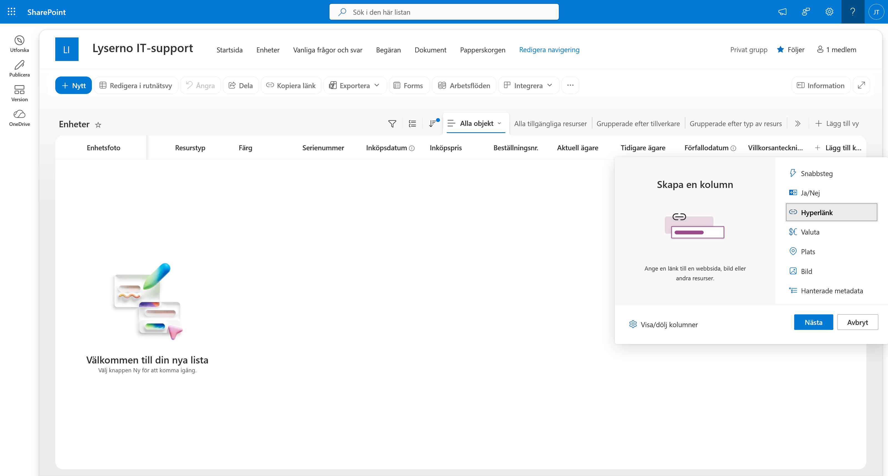

Ange följande kolumnnamn:

```text
Bild
```

Lämna beskrivningen tom och kontrollera att typen är **Hyperlänk**. Välj sedan **Spara**.

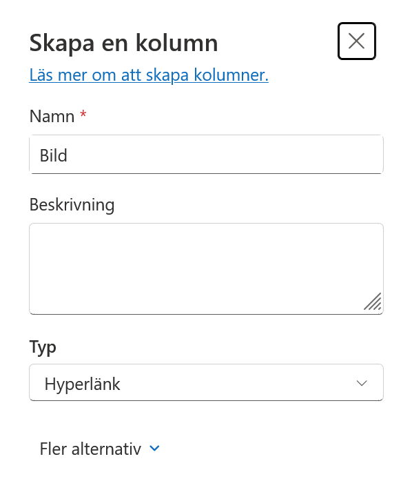

!!! info "Varför använder vi en hyperlänkskolumn?"
    Agenten behöver en direktlänk till varje produktbild. Det inbyggda fältet **Enhetsfoto** är svårare att använda i agentens adaptiva kort, så vi lämnar det tomt och sparar länken i kolumnen **Bild**.

### 3. Lägg till enheterna

Välj **+ Nytt**. SharePoint öppnar formuläret **Nytt objekt**.

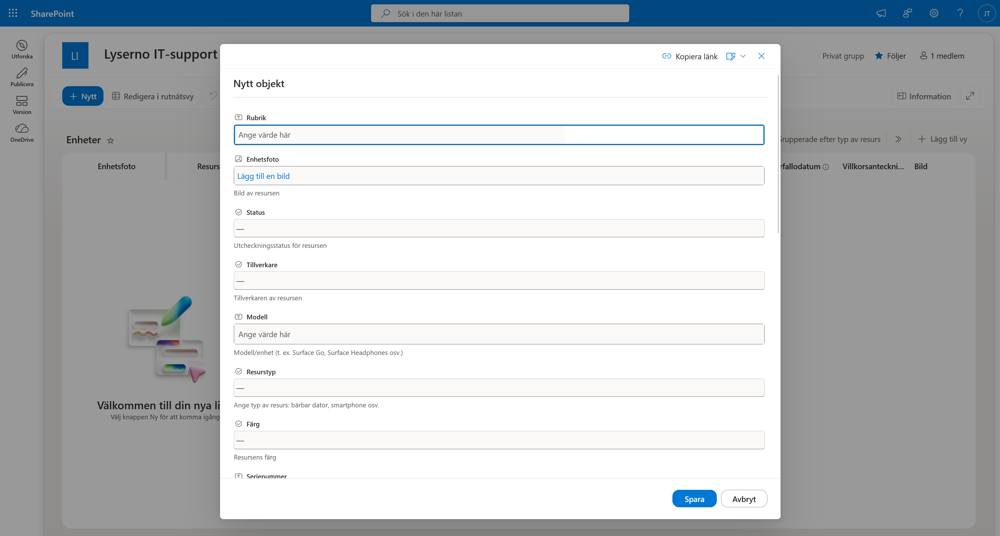

Fyll i värdena nedan och välj **Spara**. Upprepa steget för varje enhet. Lämna **Enhetsfoto**, **Inköpsdatum** och övriga fält som inte finns i tabellerna tomma.

Använd de engelska värdena `Laptop`, `Desktop` och `Tablet` för **Resurstyp**. De används senare i agentens filter.

#### 1. Surface Laptop 13


| Fält | Värde |
| --- | --- |
| Rubrik | `Surface Laptop 13` |
| Status | `Tillgänglig` |
| Tillverkare | `Microsoft` |
| Modell | `Surface Laptop 13` |
| Resurstyp | `Laptop` |
| Färg | `Silver` |
| Serienummer | `1` |
| Inköpspris | `1500` |
| Beställningsnr. | `10001` |

Kopiera bildlänken till fältet **Bild**:

```text
https://tyto-official.github.io/copilot-studio-course/assets/standard/images/products/surface-laptop-13.png
```

#### 2. Surface Laptop 13.8


| Fält | Värde |
| --- | --- |
| Rubrik | `Surface Laptop 13.8` |
| Status | `Bokat` |
| Tillverkare | `Microsoft` |
| Modell | `Surface Laptop 13.8` |
| Resurstyp | `Laptop` |
| Färg | `Blue` |
| Serienummer | `5` |
| Inköpspris | `1800` |
| Beställningsnr. | `10005` |

Kopiera bildlänken till fältet **Bild**:

```text
https://tyto-official.github.io/copilot-studio-course/assets/standard/images-sv/chap01/enkal-sharepoint/Surface-Laptop-13-8.jpg
```

Den här enheten har statusen `Bokat` och ska därför inte visas när agenten senare söker efter tillgängliga enheter.

#### 3. Surface Laptop 15


| Fält | Värde |
| --- | --- |
| Rubrik | `Surface Laptop 15` |
| Status | `Tillgänglig` |
| Tillverkare | `Microsoft` |
| Modell | `Surface Laptop 15` |
| Resurstyp | `Laptop` |
| Färg | `Black` |
| Serienummer | `2` |
| Inköpspris | `2000` |
| Beställningsnr. | `10002` |

Kopiera bildlänken till fältet **Bild**:

```text
https://tyto-official.github.io/copilot-studio-course/assets/standard/images/products/surface-laptop-15.png
```

#### 4. Surface Studio


| Fält | Värde |
| --- | --- |
| Rubrik | `Surface Studio` |
| Status | `Tillgänglig` |
| Tillverkare | `Microsoft` |
| Modell | `Surface Studio` |
| Resurstyp | `Desktop` |
| Färg | `Silver` |
| Serienummer | `3` |
| Inköpspris | `2500` |
| Beställningsnr. | `10003` |

Kopiera bildlänken till fältet **Bild**:

```text
https://tyto-official.github.io/copilot-studio-course/assets/standard/images/products/surface-studio.png
```

#### 5. Surface Pro


| Fält | Värde |
| --- | --- |
| Rubrik | `Surface Pro` |
| Status | `Tillgänglig` |
| Tillverkare | `Microsoft` |
| Modell | `Surface Pro` |
| Resurstyp | `Tablet` |
| Färg | `Pink` |
| Serienummer | `4` |
| Inköpspris | `1000` |
| Beställningsnr. | `10004` |

Kopiera bildlänken till fältet **Bild**:

```text
https://tyto-official.github.io/copilot-studio-course/assets/standard/images/products/surface-pro-12.png
```

### 4. Kontrollera listan

När du är klar ska listan **Enheter** innehålla fem enheter. Kontrollera att:

- fyra enheter har statusen `Tillgänglig`
- Surface Laptop 13.8 har statusen `Bokat`
- resurstypen är `Laptop`, `Desktop` eller `Tablet`
- varje rad har en länk i kolumnen **Bild**
- fältet **Enhetsfoto** är tomt

!!! success "Kursmiljön är klar"
    Du har nu tillgång till Copilot Studio, en personlig utvecklingsmiljö, SharePoint-webbplatsen **Lyserno IT-support** och fem enheter i listan **Enheter**. I nästa kapitel öppnar vi Copilot Studio och kontrollerar att standardupplevelsen används.
