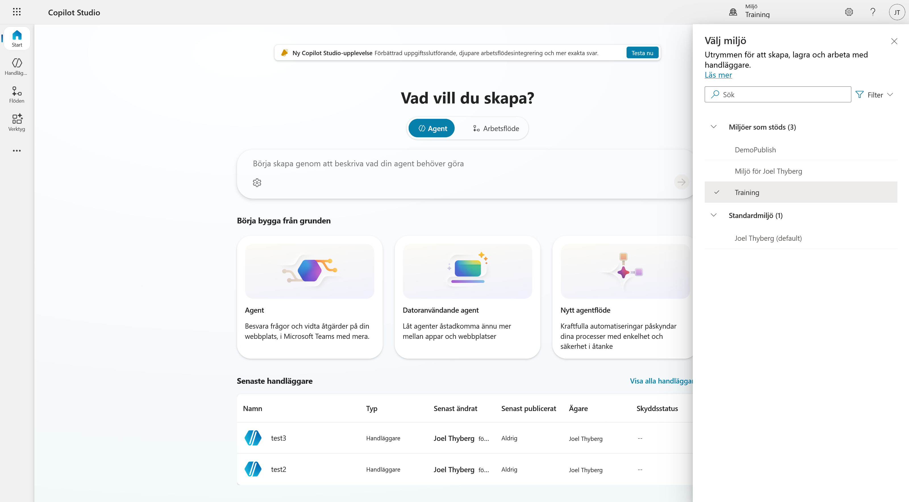
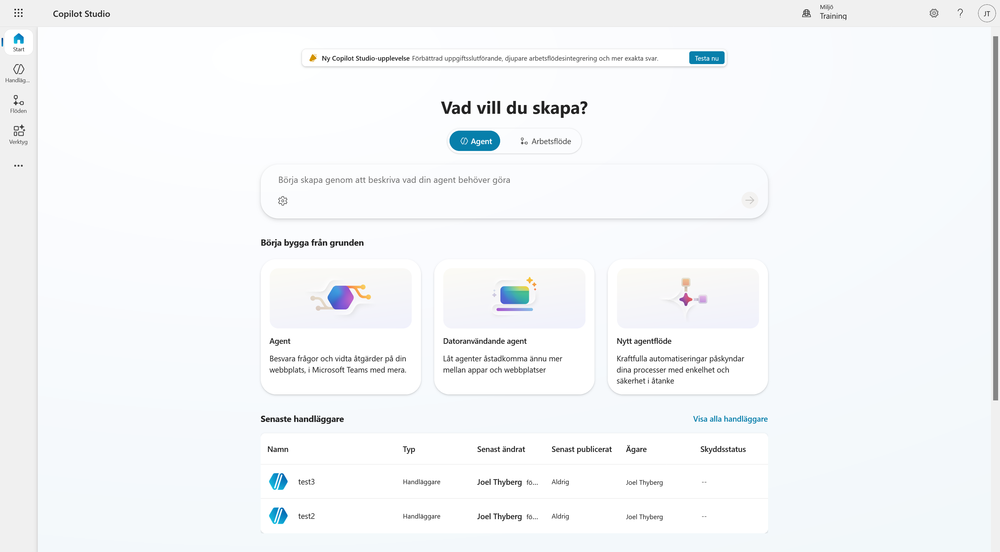
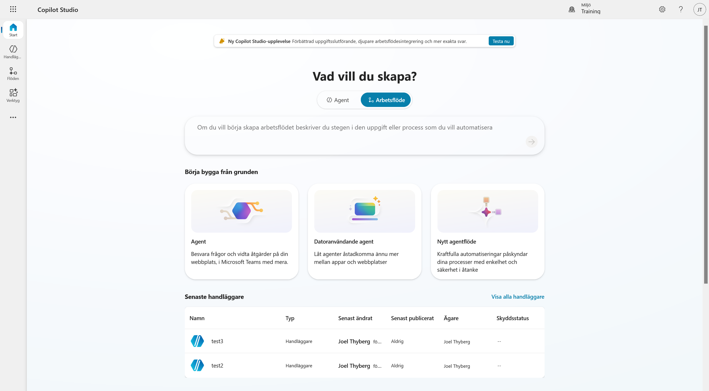
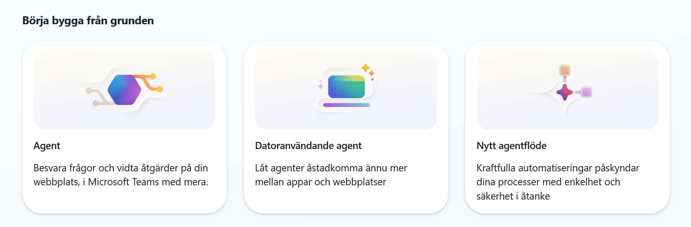
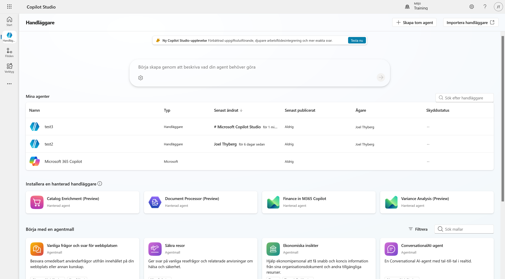
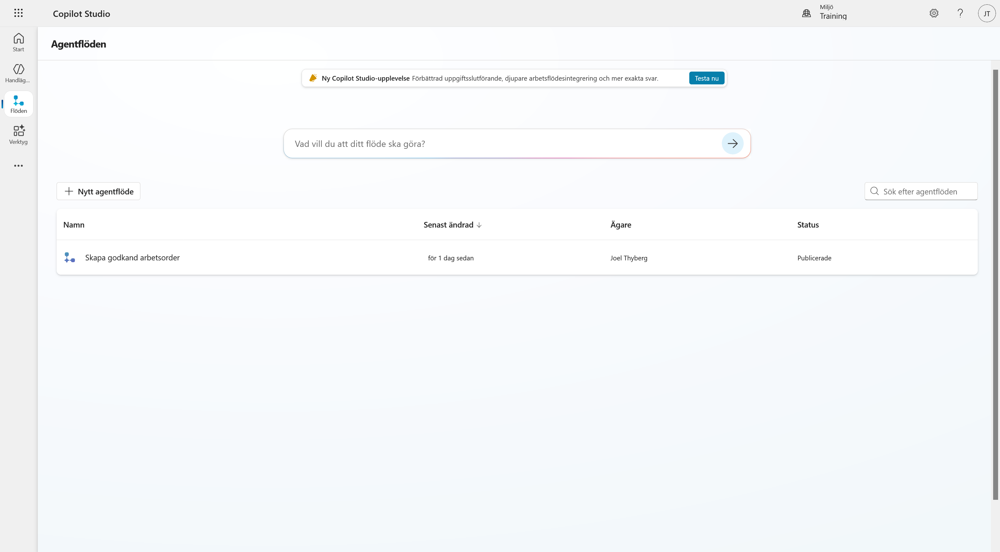
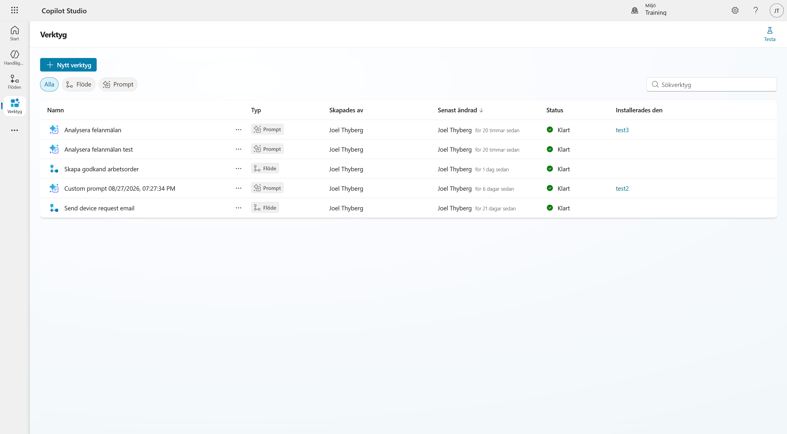
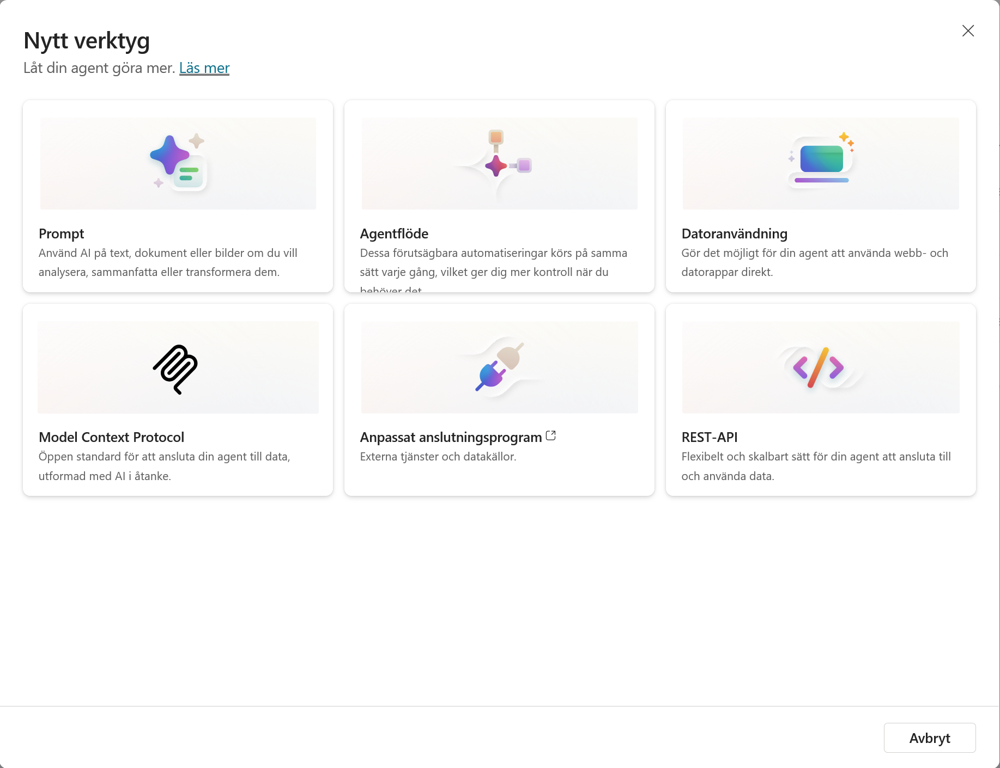

# 2. Hitta rätt i Copilot Studio

I det här kapitlet öppnar vi Copilot Studio, väljer kursens utvecklingsmiljö och går igenom delarna som vi använder senare. Det är här vi ska bygga **Lyserno IT-assistent**.

När kapitlet är klart har du hittat:

- kursens utvecklingsmiljö
- alternativen på startsidan
- Handläggare, Flöden och Verktyg
- Lösningar under menyn med fler val

---

## Del 1: Öppna Copilot Studio

Öppna Copilot Studio med samma konto som du använde i kursuppsättningen:

<p><a class="button button--primary" href="https://copilotstudio.microsoft.com/" target="_blank" rel="noopener">Öppna Microsoft Copilot Studio</a></p>

Startsidan visar vad du kan skapa och de agenter som senast ändrades i den valda miljön.


Du kan få upp en rad om den nya Copilot Studio-upplevelsen. Välj inte **Testa nu** under den här kursen. Vi använder standardupplevelsen.

!!! warning "Att byta upplevelse ändrar inte en befintlig agent"
    Den nya upplevelsen och standardupplevelsen är två olika sätt att bygga. Att byta vy konverterar inte en agent som redan har skapats. Skapa därför kursens agent först när du har kontrollerat att du är kvar i standardupplevelsen.

---

## Del 2: Kontrollera utvecklingsmiljön

Miljön avgör var agenten, flödena, anslutningarna och lösningen sparas.

1. Välj miljönamnet uppe till höger.
2. Leta upp den personliga utvecklingsmiljö som du skapade i kapitel 1, exempelvis **Miljö för Joel Thyberg**.
3. Välj miljön och vänta tills Copilot Studio har laddat om.



Skärmbilderna i kursen använder miljön **Training**. Du ska använda miljön som du skapade under kursuppsättningen, om inte kursledaren har gett dig en särskild träningsmiljö.

!!! warning "Välj rätt miljö innan du börjar bygga"
    Välj din personliga utvecklingsmiljö och inte organisationens standardmiljö. Om du är osäker jämför du namnet med miljön som du valde i Power Apps.

---

## Del 3: Startsidan och sätten att börja bygga

Högst upp på startsidan kan du välja **Agent** eller **Arbetsflöde**. Textfältet ändras beroende på vad du väljer.

Med **Agent** valt kan du beskriva vad agenten ska göra och låta Copilot Studio skapa ett första utkast. I kursen använder vi inte den vägen eftersom vi vill gå igenom inställningarna själva.



Välj **Arbetsflöde** för att se motsvarande textfält för agentflöden. Där kan du beskriva en uppgift eller process som ska automatiseras.



Under rubriken **Börja bygga från grunden** finns tre alternativ:

- **Agent** skapar en agent som kan svara på frågor och utföra åtgärder.
- **Datoranvändande agent** skapar en agent som kan arbeta mellan appar och webbplatser.
- **Nytt agentflöde** skapar en automatisering med bestämda steg.



!!! note "Skapa inget ännu"
    Här bekantar vi oss bara med gränssnittet. I nästa kapitel skapar vi först en lösning. Därefter skapar vi agenten så att den hamnar i rätt lösning.

---

## Del 4: Handläggare

Välj **Handläggare** i vänsternavigeringen. Microsoft använder både orden *agent* och *handläggare* i gränssnittet. De syftar på samma typ av komponent här.



Högst upp på sidan finns samma möjlighet att beskriva vad agenten ska göra och få hjälp av Copilot Studio att bygga den.

Under textfältet visas följande delar:

- **Mina agenter** visar agenter som redan finns i den valda miljön.
- **Installera en hanterad handläggare** visar färdiga agenter som organisationen har gjort tillgängliga.
- **Börja med en agentmall** innehåller mallar för olika typer av agenter.

Uppe till höger finns **Skapa tom agent** och **Importera handläggare**. Vi använder **Skapa tom agent** när det är dags att bygga kursens agent.

Listan kan vara tom om ingen agent har skapats i miljön tidigare.

---

## Del 5: Flöden

Välj **Flöden** i vänsternavigeringen.



Här ser du agentflöden som finns i miljön. Du kan skapa ett flöde genom att beskriva vad det ska göra i textfältet eller välja **Nytt agentflöde** och bygga det från grunden.

Ett agentflöde passar när samma bestämda steg ska köras varje gång. Senare i kursen bygger vi ett sådant flöde för supportärenden.

---

## Del 6: Verktyg

Välj **Verktyg** i vänsternavigeringen.



Sidan samlar verktyg som har skapats i miljön. På skärmbilden finns bara agentflöden och prompter, så filtren **Flöde** och **Prompt** visas. Vilka filter som finns beror på vilka typer av verktyg som redan ligger i miljön.

Välj **+ Nytt verktyg** för att se vilka typer som går att skapa.



Följande alternativ visas på skärmbilden:

- **Prompt** använder en AI-modell för att exempelvis analysera, sammanfatta eller omvandla innehåll.
- **Agentflöde** kör en förutsägbar automatisering med bestämda steg.
- **Datoranvändning** låter agenten arbeta direkt i webb- och datorprogram.
- **Model Context Protocol** ansluter en MCP-server och dess verktyg.
- **Anpassat anslutningsprogram** kopplar agenten till externa tjänster och datakällor.
- **REST-API** ansluter agenten direkt till ett API.

Vilka alternativ du ser kan bero på miljön, licensen och vilka funktioner administratören har aktiverat. Skapa inget verktyg nu.

---

## Del 7: Hitta lösningar

Välj de tre punkterna längst ner i vänsternavigeringen.


Menyn är indelad i tre delar:

- Under **Utforska** finns bland annat **Komponentsamlingar** och **Lösningar**.
- Under **Power Platform** finns genvägar till Power Apps, Power Automate, Power BI, Power Pages och administrationscentret för Power Platform.
- Under **Läs mer om AI-integrering** finns länkar till fler Microsoft-tjänster och utvecklingsverktyg.

Välj **Lösningar**. Lösningsutforskaren öppnas och visar lösningarna i den valda miljön.

En miljö och en lösning är inte samma sak:

```text
Klientorganisation
└── Miljö                         Var vi bygger
    └── Lösning                   Vad som hör ihop
        ├── Agent
        ├── Agentflöde
        └── Övriga komponenter
```

Miljön skiljer resurser, data och behörigheter åt. Lösningen samlar komponenterna som hör till samma bygge. I nästa kapitel skapar vi lösningen **Lyserno IT-support**.

!!! success "Du är på rätt plats"
    Du har valt kursens utvecklingsmiljö och hittat startsidan, Handläggare, Flöden, Verktyg och Lösningar. Fortsätt till nästa kapitel och skapa lösningen **Lyserno IT-support**.
