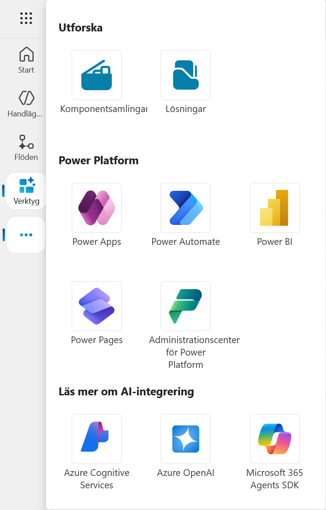
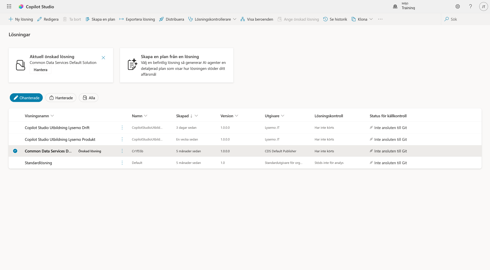
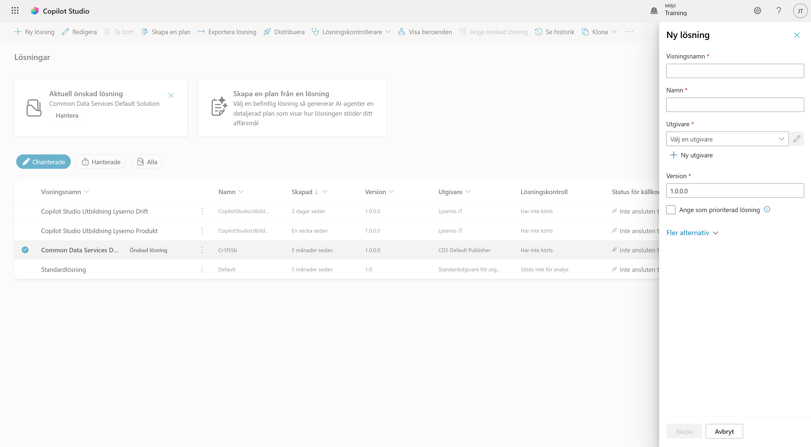
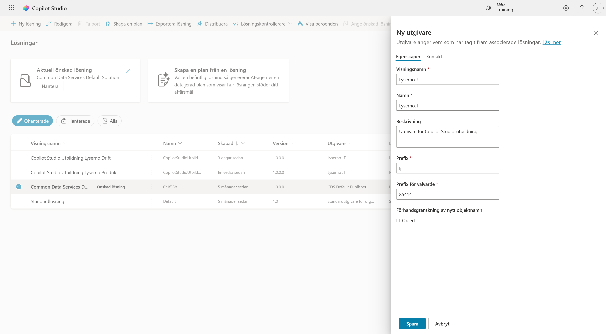
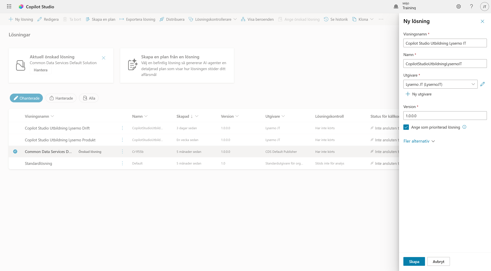
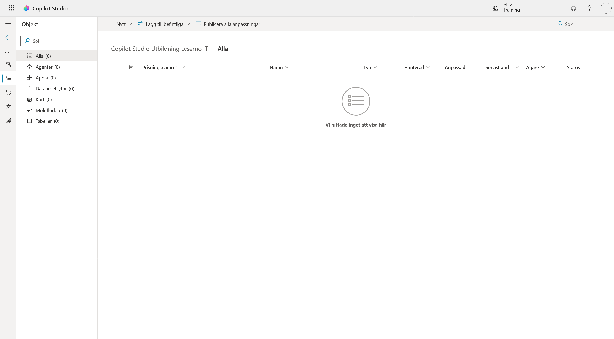
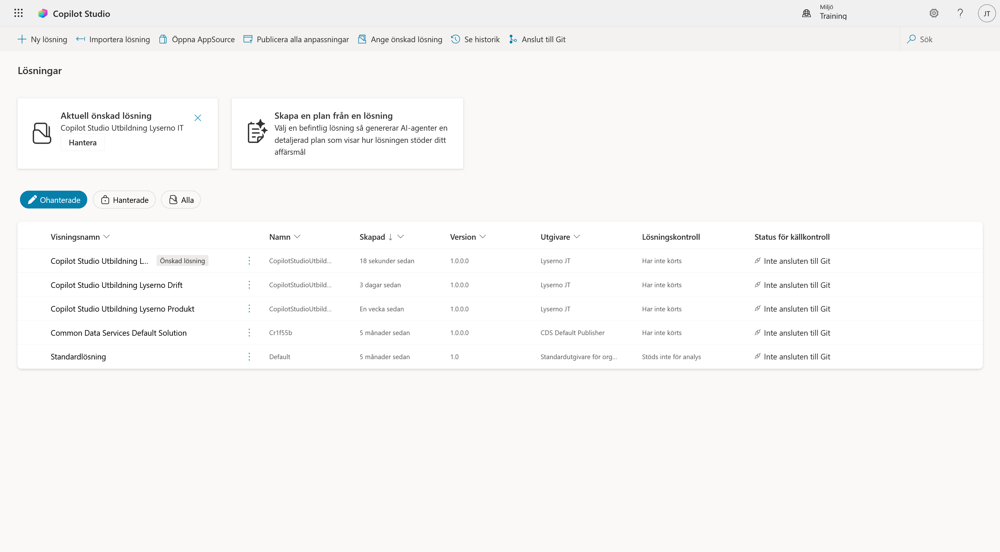

# 3. Skapa en lösning

Innan vi skapar agenten samlar vi kursens komponenter i en lösning. Lösningen gör det lättare att hålla ihop agenten, ämnena och flödena och att flytta dem mellan Power Platform-miljöer.

När kapitlet är klart har du:

- skapat en egen utgivare med ett unikt prefix
- skapat lösningen **Copilot Studio Utbildning Lyserno IT**
- angett lösningen som prioriterad
- kontrollerat att den nya lösningen är tom och redo att användas

---

## Del 1: Öppna Lösningar

Om menyn från förra kapitlet fortfarande är öppen väljer du **Lösningar** under **Utforska**. Annars väljer du de tre punkterna längst ner i vänsternavigeringen och sedan **Lösningar**.



Sidan visar lösningarna som finns i den valda miljön. Högst upp ser du vilken lösning som är aktuell, och i tabellen kan du växla mellan ohanterade, hanterade och alla lösningar.



Välj **+ Ny lösning** uppe till vänster. Panelen **Ny lösning** öppnas till höger.

---

## Del 2: Skapa en utgivare

En utgivare anger vem som har skapat komponenterna och ger dem ett tekniskt prefix. Prefixet minskar risken för namnkonflikter när flera lösningar används i samma miljö.

I panelen **Ny lösning** väljer du **+ Ny utgivare** under fältet **Utgivare**.



Panelen **Ny utgivare** öppnas. Använd dina egna initialer. Exemplen nedan använder **JT** för Joel Thyberg.

**Visningsnamn**<br>
Skriv `Lyserno [initialer]`, exempelvis `Lyserno JT`.

**Namn**<br>
Använd samma namn utan mellanslag, exempelvis `LysernoJT`.

**Beskrivning**<br>
Beskrivningen är samma för alla:

```text
Utgivare för Copilot Studio-utbildning
```

**Prefix**<br>
Använd `l` följt av initialerna med små bokstäver, exempelvis `ljt`.

**Prefix för valvärde**<br>
Låt det automatiskt skapade talet vara kvar. Du behöver inte fylla i något under fliken **Kontakt**.

!!! important "Använd dina egna initialer"
    Heter du Anna Svensson använder du `Lyserno AS`, `LysernoAS` och prefixet `las`. Prefixet måste vara unikt i miljön. Om två deltagare använder samma prefix kan deras tekniska komponentnamn krocka.



Välj **Spara**. När panelen stängs kommer du tillbaka till den nya lösningen, och utgivaren ska vara vald.

---

## Del 3: Skapa lösningen

Ange följande visningsnamn:

```text
Copilot Studio Utbildning Lyserno IT
```

Fältet **Namn** fylls normalt i automatiskt som `CopilotStudioUtbildningLysernoIT`. Om det inte fylls i anger du visningsnamnet utan mellanslag.

Kontrollera resten av inställningarna:

1. **Utgivare** ska visa utgivaren som du nyss skapade, exempelvis `Lyserno JT (LysernoJT)`. Välj den manuellt om den inte redan är vald.
2. Låt **Version** stå kvar på `1.0.0.0`.
3. Markera **Ange som prioriterad lösning**.
4. Låt **Fler alternativ** vara oförändrat.



När en lösning är prioriterad hamnar nya komponenter där som standard, även när du skapar dem från Copilot Studios startsida.

Välj **Skapa**.

---

## Del 4: Kontrollera lösningen

När lösningen har skapats öppnas den automatiskt. Den ska vara tom eftersom vi ännu inte har skapat några komponenter.



Välj bakåtpilen uppe till vänster för att gå tillbaka till lösningsöversikten.

Kontrollera att kortet högst upp visar **Copilot Studio Utbildning Lyserno IT** som aktuell lösning och att lösningen är märkt som **Önskad lösning** i listan.



!!! note "Prioriterad och önskad lösning"
    I panelen där du skapar lösningen heter valet **Ange som prioriterad lösning**. På översikten kan samma inställning visas som **Aktuell önskad lösning** eller **Önskad lösning**.

!!! success "Lösningen är klar"
    Kursens nya komponenter kan nu sparas i **Copilot Studio Utbildning Lyserno IT**. I nästa kapitel skapar vi **Lyserno IT-assistent**.
