# 5. Lägg till kunskap

Agenten har ett uppdrag och instruktioner, men den saknar fortfarande Lysernos interna information. Nu ska du lägga till två kunskapskällor:

- ett internt dokument med Lysernos IT-policy
- Microsofts offentliga supportsidor för Windows

Du ska också stänga av sökning på hela webben. Agenten kan då använda de källor som du själv har lagt till i stället för att söka fritt bland offentliga webbplatser.

---

## Del 1: Skapa policydokumentet

Skapa först dokumentet som agenten ska använda för interna frågor.

1. Öppna Word från Microsoft 365 och skapa ett tomt dokument.
2. Kopiera texten nedan och klistra in den i dokumentet.

    ```text
    **IT-Policy och Rutiner**
    Version: 2025-1.0

    **1. Kontakt och Öppettider**
    Generell IT-support nås på telefon (08-123 45 67) eller via Teams.
    Supportens öppettider är:
    - Vardagar: 08:00–17:00
    - Lunchstängt: 12:00–13:00

    **2. Uthämtning av ny utrustning**
    Beställda datorer och telefoner kan hämtas ut i IT-receptionen (Plan 3).
    Öppettider för just uthämtning är begränsade till:
    - Måndagar: 09:00–11:00
    - Torsdagar: 13:00–15:00

    **3. Installation av programvara**
    Det är tillåtet att installera arbetsrelaterade program (t.ex. Spotify och VS Code).
    Det är **strängt förbjudet** att installera spelplattformar (t.ex. Steam, Epic Games och Battle.net) på företagets datorer. Om detta upptäcks kan datorn fjärraderas omedelbart.

    **4. Skadad eller förlorad utrustning**
    Om din enhet går sönder eller blir stulen måste du anmäla detta till IT-supporten inom 24 timmar.
    - Vid stöld krävs en polisanmälan.
    - Vid skada som har orsakats av oaktsamhet, till exempel kaffespill, dras en självrisk på 500 kr från nästa lön.

    **5. Hemarbete och Säkerhet**
    Du får ta med din arbetsdator hem. För att datorn ska få de senaste säkerhetsuppdateringarna måste du ansluta till företagets VPN minst en gång i veckan.
    ```

3. Döp dokumentet till:

    ```text
    IT-Policy och Rutiner
    ```

4. Spara dokumentet på valfri plats och kom ihåg var du sparade det.

---

## Del 2: Stäng av webbsökning

Gå tillbaka till översikten för **Lyserno IT-assistent** och leta upp avsnittet **Kunskap**.

Webbsökning ger agenten möjlighet att söka på alla offentliga webbplatser. Det passar inte den här agenten eftersom vi vill bestämma vilka externa källor den får använda.

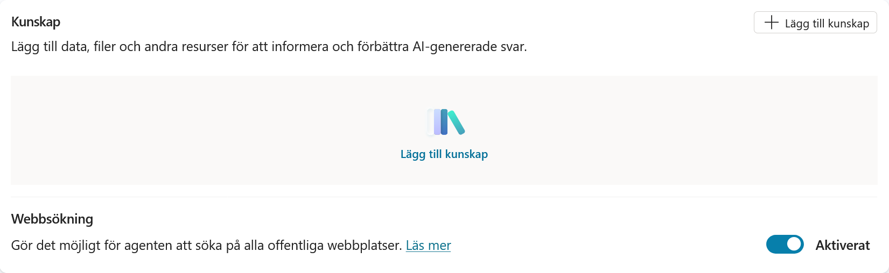

Stäng av **Webbsökning**. Inställningen ska visa **Inaktiverat**.

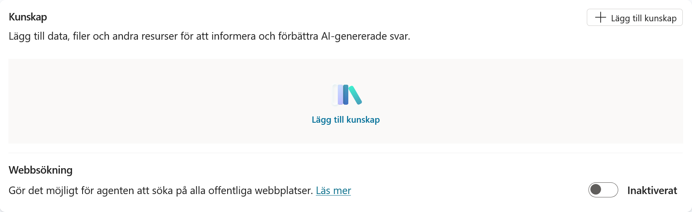

!!! note "Avstängd webbsökning och offentliga webbplatser är inte samma sak"
    När webbsökningen är avstängd söker agenten inte fritt på hela webben. En offentlig webbplats som du själv lägger till använder fortfarande Grounding med Bing Search, men sökningen begränsas till den URL och webbplatsdel som du har angett.

---

## Del 3: Lägg till policydokumentet

Välj **Lägg till kunskap**. Här visas de kunskapskällor som är tillgängliga i din miljö, till exempel filer, offentliga webbplatser, SharePoint och Dataverse.

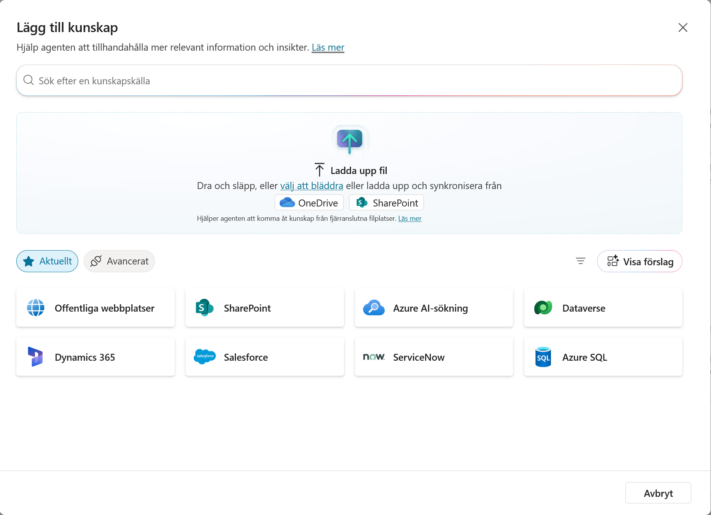

Välj det sätt som passar platsen där du sparade dokumentet:

- Välj **välj att bläddra** om filen finns på datorn.
- Välj **OneDrive** eller **SharePoint** om du sparade den där.

Leta upp dokumentet:

```text
IT-Policy och Rutiner.docx
```

Markera dokumentet och bekräfta valet. Bilden nedan visar hur det ser ut när filen väljs från OneDrive.

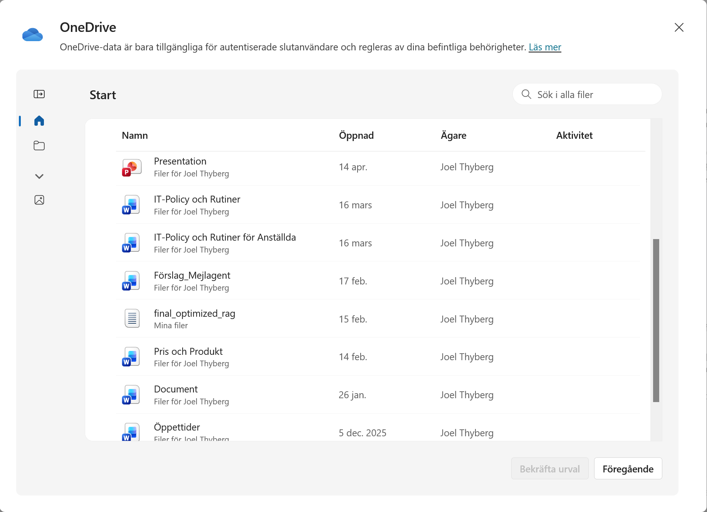

Kontrollera att rätt fil visas. Du kan behålla det föreslagna namnet och den automatiskt skapade beskrivningen. Välj sedan **Lägg till i agent**.

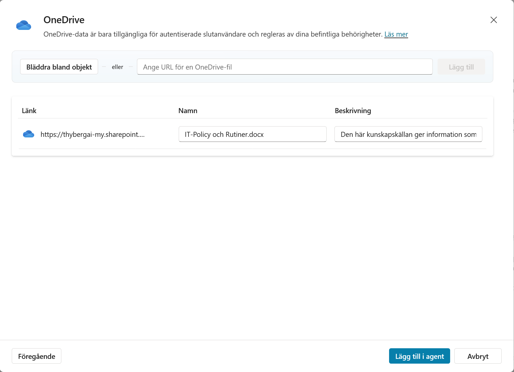

Dokumentet börjar nu bearbetas och kan visas med statusen **Pågående**. Du behöver inte vänta här. Lägg till nästa kunskapskälla medan filen bearbetas.

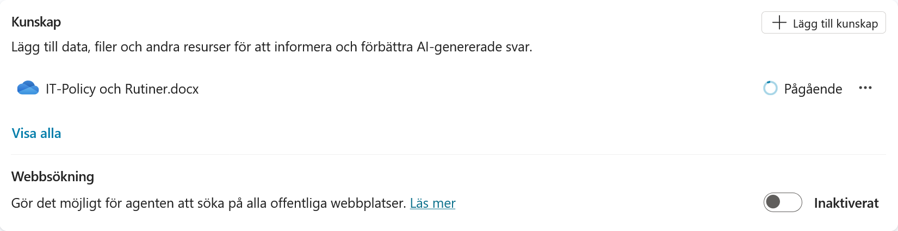

---

## Del 4: Lägg till Microsoft Support

Välj **Lägg till kunskap** igen.


Välj **Offentliga webbplatser**. Klistra in följande adress under **Länk till offentlig webbplats**:

```text
https://support.microsoft.com/sv-se/windows
```

Välj **Lägg till**.

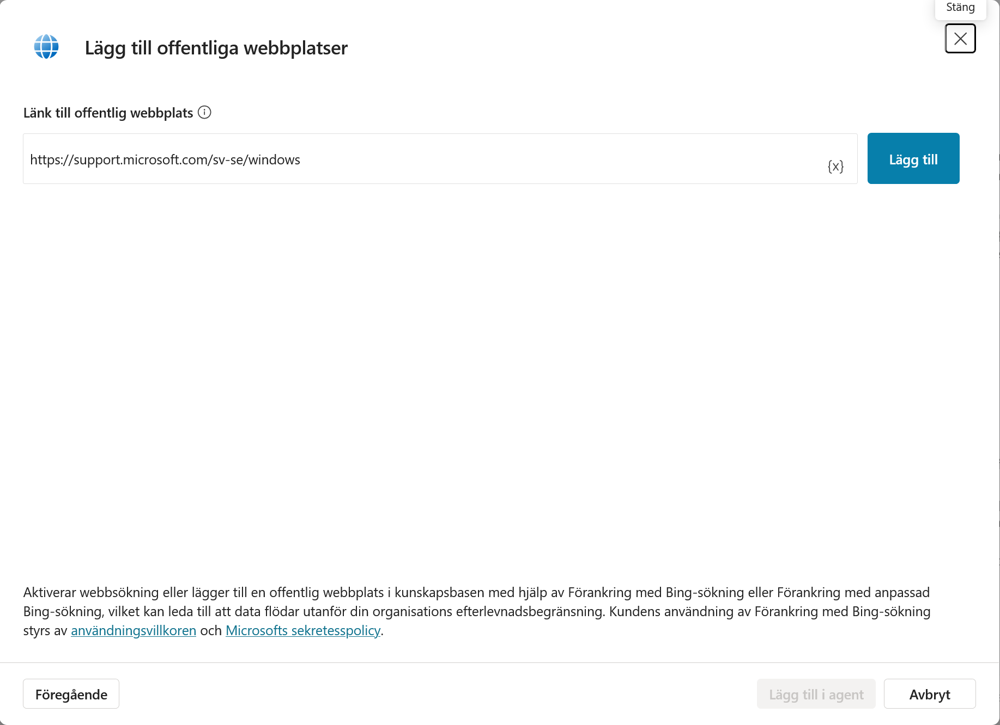

Adressen läggs till i listan. Copilot Studio fyller automatiskt i namn och beskrivning. Behåll värdena och välj **Lägg till i agent**.

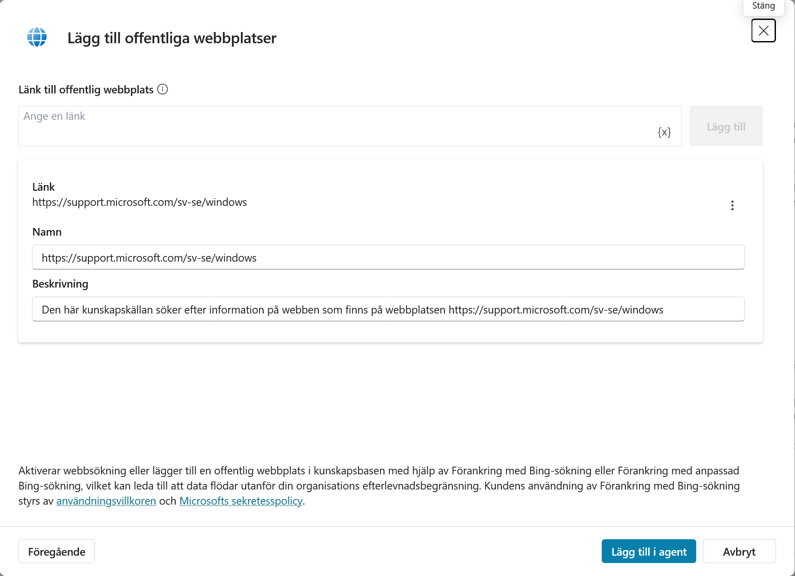

!!! success "Så avgränsas en offentlig webbplats"
    Den URL som du anger bestämmer vilken del av webbplatsen agenten får använda.

    Microsoft anger följande begränsningar:

    - URL:en får innehålla högst två sökvägsnivåer. Adressen `support.microsoft.com/sv-se/windows` innehåller nivåerna `sv-se` och `windows`.
    - Ett avslutande snedstreck är tillåtet.
    - Webbplatsen måste vara offentlig och indexerad av Bing.
    - Om du anger en sökväg kan agenten även använda offentligt innehåll längre ner under samma sökväg.
    - Innehåll på andra delar av webbplatsen ingår inte automatiskt.

    Läs mer i [Lägga till en offentlig webbplats som kunskapskälla](https://learn.microsoft.com/sv-se/microsoft-copilot-studio/knowledge-add-public-website).

---

## Del 5: Testa den offentliga webbplatsen

Du kan testa webbplatsen även om dokumentet fortfarande bearbetas.

Välj **Ny testsession** i testpanelen. En ny session rensar den tidigare konversationen så att den inte påverkar testet.

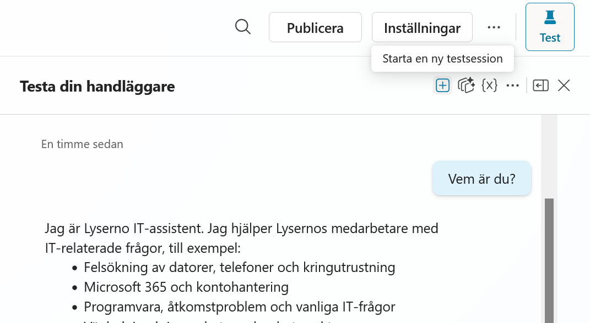

Välj sedan **Expandera testfönstret**. I den utökade vyn ser du hur agenten arbetar: vilka steg den tar, vilka verktyg den använder, vilka kunskapskällor den söker igenom och vilken information sökningen hittar.

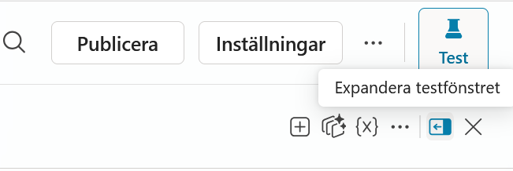

Skriv:

```text
Hur tar jag en skärmdump i Windows 11?
```

Agenten ska ge instruktioner och hänvisa till Microsoft Support. I den utökade testvyn kan du öppna steget **Sök efter källor** och se vilka källor som genomsöktes och vilka som användes i svaret.

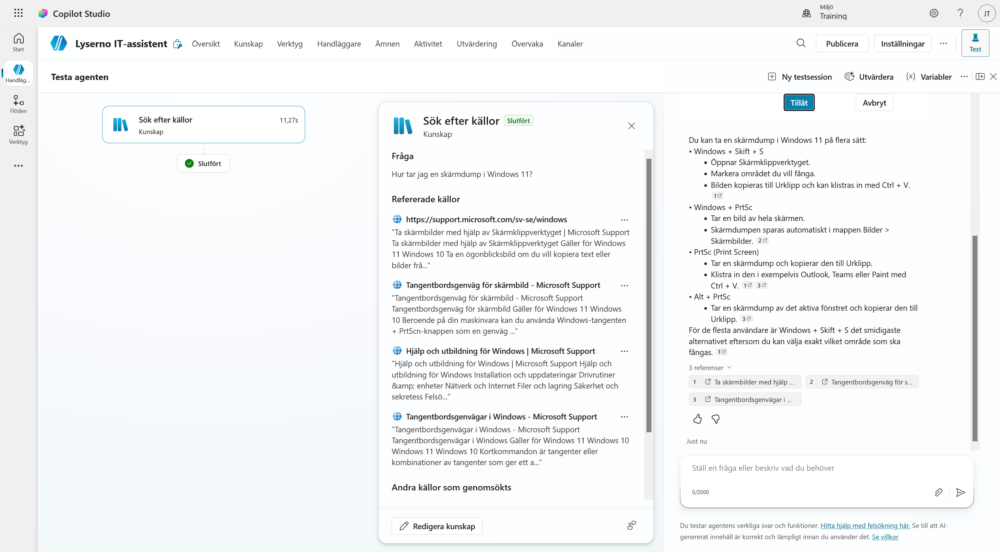

---

## Del 6: Testa policydokumentet

Starta en ny testsession igen.

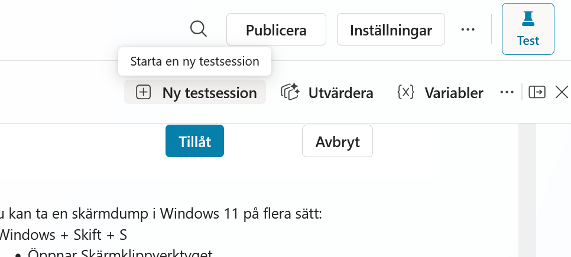

Skriv:

```text
Vilka tider har IT-supporten öppet?
```

Agenten ska nu svara att supporten har öppet vardagar 08:00–17:00 och lunchstängt 12:00–13:00. Svaret ska hänvisa till dokumentet **IT-Policy och Rutiner.docx**.

Första gången agenten använder OneDrive kan du få frågan **Ansluta om du vill fortsätta**. Läs informationen och välj **Tillåt** i kursmiljön om du vill ge agenten åtkomst med ditt konto.

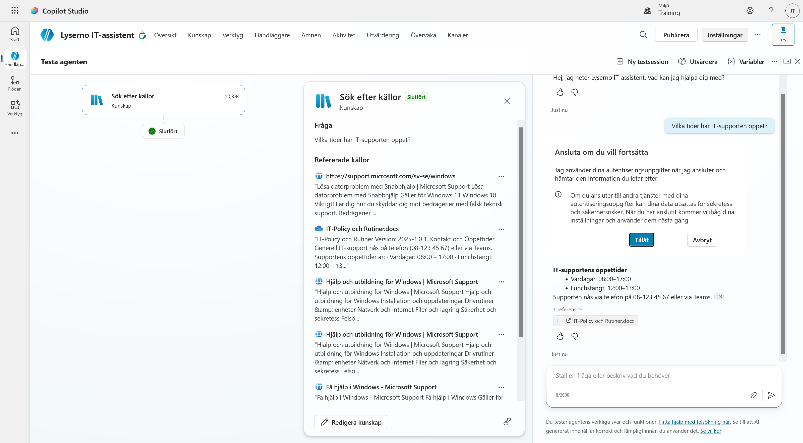

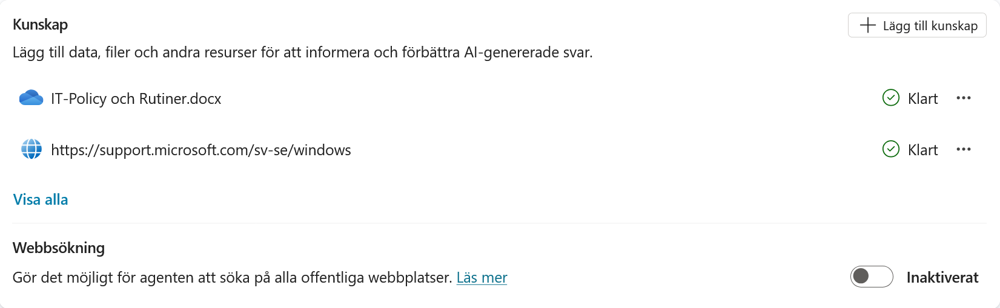

!!! note "Kunskapskällor kan ta olika lång tid"
    Gå tillbaka till agentens översikt och titta på statusen under **Kunskap**. Både policydokumentet och Microsoft Support ska till slut visa **Klart**.

    Hur lång tid indexeringen tar beror bland annat på antalet filer, deras storlek och filtyp. Första gången en källa konfigureras kan Copilot Studio också behöva extra tid för att skapa Dataverse-strukturen. Stora dokument, till exempel omfattande PDF-filer, kan därför ta betydligt längre tid än den lilla Word-filen i övningen. Under utbildningen använder vi små filer för att slippa vänta på indexeringen.

    En källa kan ibland stå kvar på **Pågående** eller tillfälligt visa **Fel**:

    1. Vänta en stund och uppdatera sidan.
    2. Starta en ny testsession och ställ en fråga som bara kan besvaras från källan.
    3. Om agenten hittar och hänvisar till rätt information fungerar källan, även om statusen inte har uppdaterats.
    4. Om agenten inte når innehållet kontrollerar du filens behörigheter. Vid statusen **Fel** kan du också ta bort källan och lägga till dokumentet igen.

    Läs mer i [Lägga till ostrukturerade data som en kunskapskälla](https://learn.microsoft.com/sv-se/microsoft-copilot-studio/knowledge-add-unstructured-data).

!!! success "Kunskapen är tillagd"
    Lyserno IT-assistent kan nu svara med information från både det interna policydokumentet och den avgränsade Microsoft-webbplatsen. Sökning på hela webben är fortfarande avstängd.
