# 7. Skapa ett adaptivt kort

Agenten kan nu hitta tillgängliga enheter. I det här kapitlet skapar du ämnet **Begär enhet** och lägger till ett adaptivt kort där användaren kan välja en enhet och skriva en kommentar.

Först bygger du kortet med vanlig JSON och fasta exempelvärden. Sedan byter du till Power Fx så att alternativen hämtas från SharePoint-resultatet i `Global.HamtadeEnheter`.

---

## Del 1: Skapa ämnet Begär enhet

Gå till fliken **Ämnen**. Klicka på **+ Lägg till ett ämne** och välj **Från tomt**.

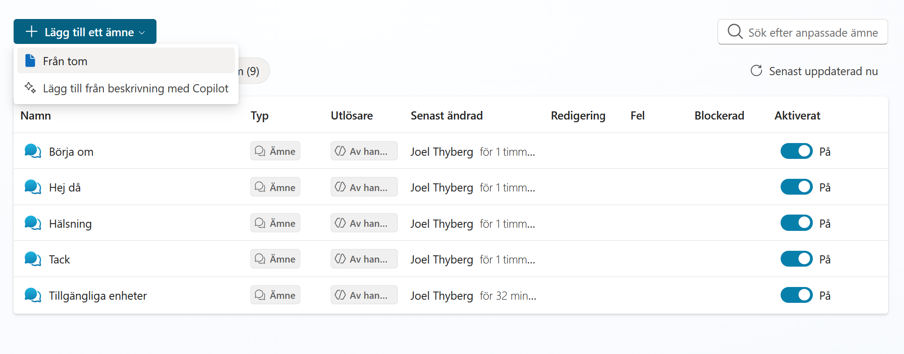

Ge ämnet följande namn:

```text
Begär enhet
```

Skriv följande under **Beskriv kortfattat vad ämnet gör**:

```text
Använd ämnet när användaren vill begära en enhet som redan har visats. Tillgängliga enheter måste ha körts först. Samla in användarens val och eventuella kommentar och skicka förfrågan till IT.
```

Klicka på **Spara**.

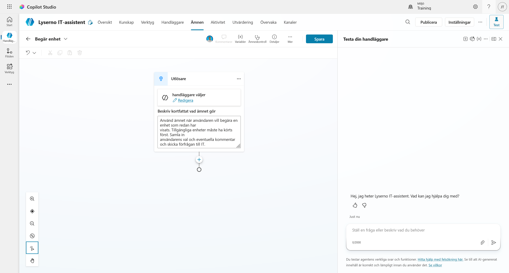

---

## Del 2: Lägg till ett adaptivt kort

Klicka på **plusknappen (+)** under utlösaren och välj **Fråga med adaptivt kort**.

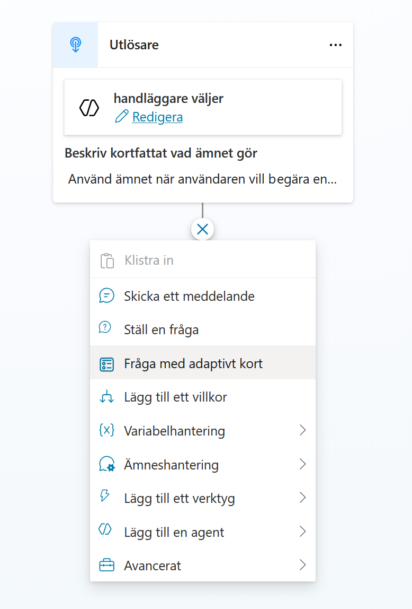

När noden har lagts till klickar du på de tre punkterna i nodens övre högra hörn och väljer **Egenskaper**.

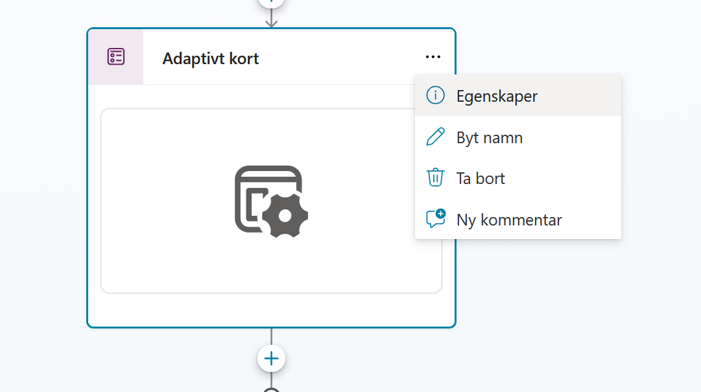

Kontrollera att formatet är **JSON-kort** och klicka på **Redigera adaptivt kort**. Du behöver inte öppna **Redigera schema** i den här övningen.

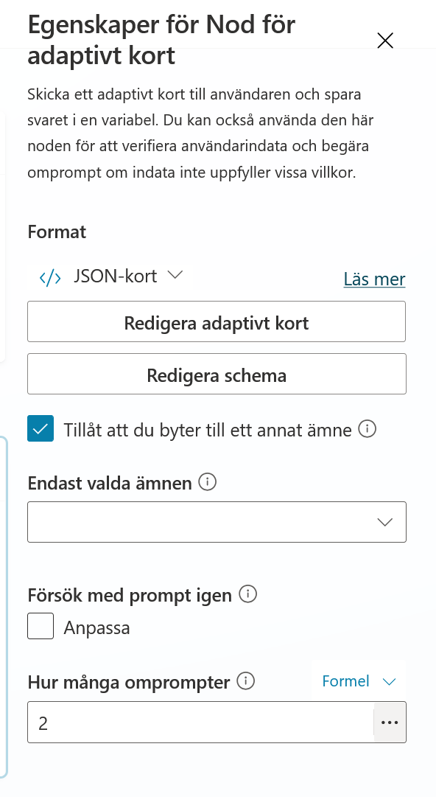

---

## Del 3: Skapa kortets grund med JSON

Nu öppnas **Adaptive Card Designer**. Här kan du bygga kortet visuellt eller skriva hela kortet som JSON.

- Till vänster finns element och inmatningsfält som du kan dra in i kortet.
- I mitten visas kortet.
- Till höger visas kortets struktur och egenskaperna för det markerade elementet.
- Längst ner finns **Redigerare för kortets nyttolast**. Där skriver du kortets JSON-kod.

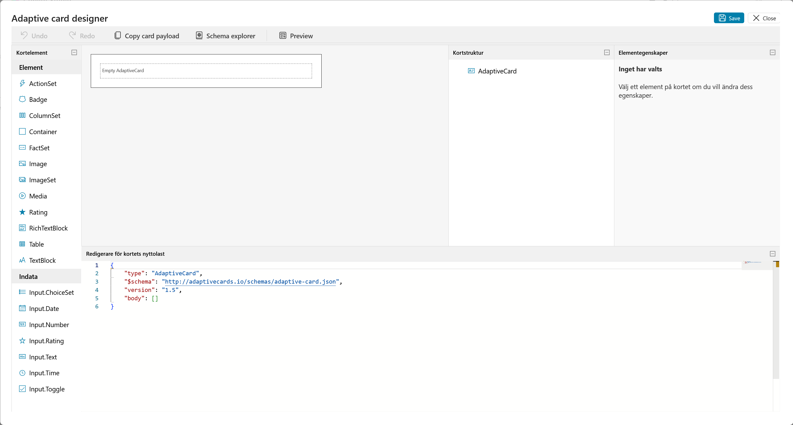

Markera all kod i **Redigerare för kortets nyttolast** och ersätt den med följande JSON:

```json
{
    "type": "AdaptiveCard",
    "$schema": "https://adaptivecards.io/schemas/adaptive-card.json",
    "version": "1.5",
    "backgroundImage": {
        "url": "https://adaptivecards.io/content/backgroundImage.png",
        "verticalAlignment": "Center"
    },
    "body": [
        {
            "type": "Container",
            "style": "emphasis",
            "bleed": true,
            "items": [
                {
                    "type": "TextBlock",
                    "weight": "Bolder",
                    "size": "Large",
                    "wrap": true,
                    "text": "Enhetsval",
                    "horizontalAlignment": "Center"
                }
            ]
        },
        {
            "type": "Container",
            "style": "default",
            "items": [
                {
                    "type": "TextBlock",
                    "wrap": true,
                    "size": "Medium",
                    "text": "Vänligen välj vilken enhet du vill begära:"
                }
            ],
            "spacing": "None"
        },
        {
            "type": "Container",
            "spacing": "None",
            "items": [
                {
                    "type": "Input.ChoiceSet",
                    "id": "kortValdEnhetId",
                    "style": "expanded",
                    "choices": [
                        {
                            "title": "Surface Laptop 13",
                            "value": "1"
                        },
                        {
                            "title": "Surface Laptop 15",
                            "value": "2"
                        },
                        {
                            "title": "Surface Studio",
                            "value": "3"
                        },
                        {
                            "title": "Surface Pro",
                            "value": "4"
                        }
                    ]
                }
            ]
        },
        {
            "type": "Container",
            "spacing": "None",
            "style": "emphasis",
            "items": [
                {
                    "type": "TextBlock",
                    "wrap": true,
                    "text": "Ytterligare information"
                }
            ]
        },
        {
            "type": "Input.Text",
            "id": "kortKommentar",
            "placeholder": "Vänligen ange eventuella specifika krav eller övriga kommentarer",
            "isMultiline": true,
            "spacing": "Small"
        },
        {
            "type": "FactSet",
            "facts": [
                {
                    "title": "Typ av förfrågan",
                    "value": "Ny enhet"
                },
                {
                    "title": "Svarstid:",
                    "value": "3-5 arbetsdagar"
                }
            ],
            "spacing": "Small"
        }
    ],
    "actions": [
        {
            "type": "Action.Submit",
            "title": "Skicka"
        }
    ]
}
```

Kortet uppdateras direkt när JSON-koden är giltig. Du ska nu se de fyra fasta enhetsvalen, kommentarsfältet och knappen **Skicka**. Klicka på **Save** högst upp.

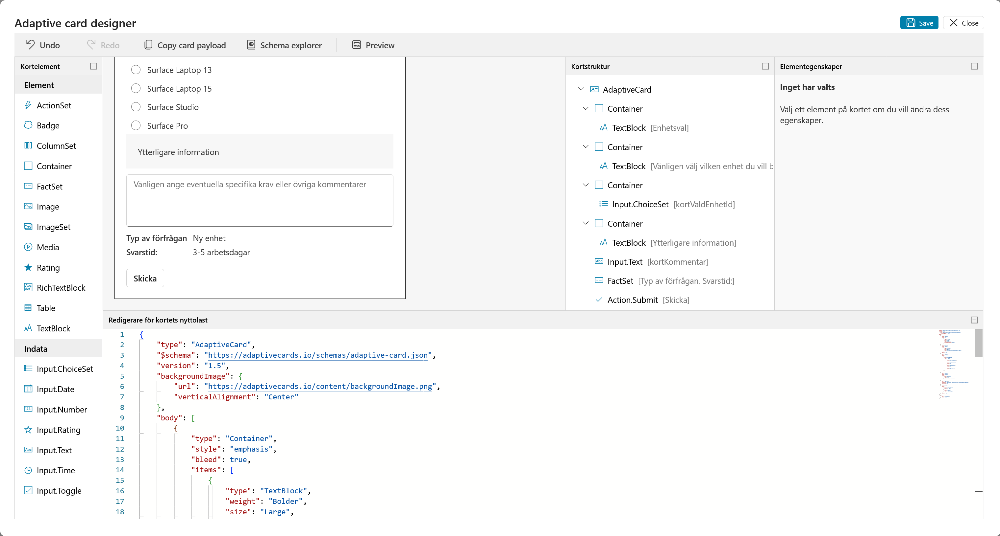

Klicka på **Preview** för att kontrollera kortet i flera bredder. Kontrollera framför allt att rubriken, alternativen och kommentarsfältet går att läsa i de mindre formaten. Stäng sedan förhandsgranskningen och klicka på **Save** igen om du har gjort någon ändring.

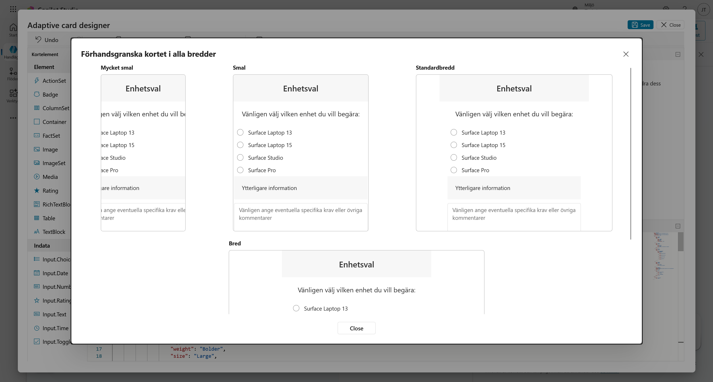

När du kommer tillbaka till ämnesredigeraren ser du tre utdatavariabler under kortet:

- `actionSubmitId` visar vilken åtgärd som skickade kortet.
- `kortKommentar` innehåller användarens kommentar.
- `kortValdEnhetId` innehåller ID:t för den valda enheten.

Variablerna skapas från de ID:n som finns i kortets JSON. De används senare när beställningen skickas vidare till ett agentflöde.

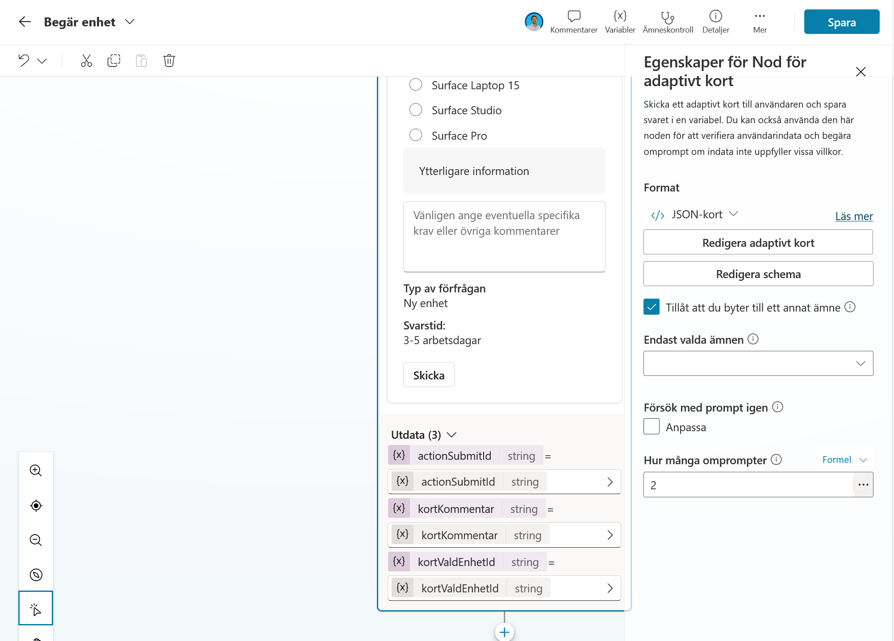

---

## Del 4: Gör enhetslistan dynamisk med Power Fx

JSON-versionen visar hur kortet är uppbyggt, men enhetslistan är hårdkodad. Nu ska du ersätta den med en lista som byggs från de enheter som ämnet **Tillgängliga enheter** hämtade från SharePoint.

I egenskapspanelen öppnar du menyn **JSON-kort** under **Format** och väljer **Formel**.

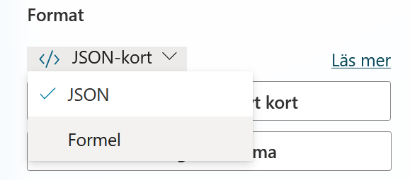

Kortet visas nu som en Power Fx-formel. Klicka på expandera-ikonen i formelfältets övre högra hörn.

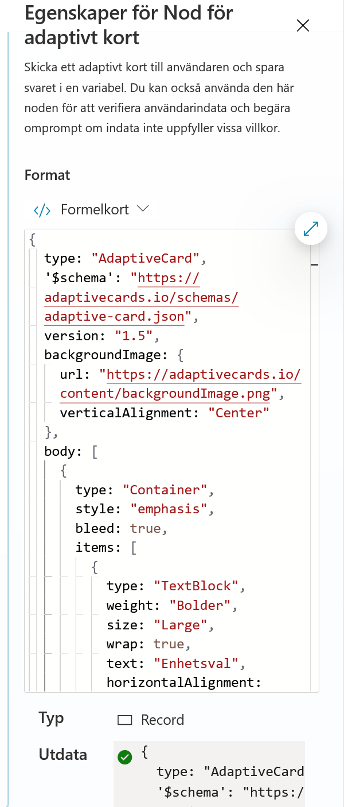

Markera hela formeln och ersätt den med följande kod:

```powerfx
{
  type: "AdaptiveCard",
  '$schema': "https://adaptivecards.io/schemas/adaptive-card.json",
  version: "1.5",
  backgroundImage: {
    url: "https://adaptivecards.io/content/backgroundImage.png",
    verticalAlignment: "Center"
  },
  body: [
    {
      type: "Container",
      style: "emphasis",
      bleed: true,
      items: [
        {
          type: "TextBlock",
          text: "Enhetsval",
          weight: "Bolder",
          size: "Large",
          wrap: true,
          horizontalAlignment: "Center"
        }
      ]
    },
    {
      type: "Container",
      style: "default",
      items: [
        {
          type: "TextBlock",
          text: "Vänligen välj vilken enhet du vill begära:",
          wrap: true,
          size: "Medium"
        }
      ],
      spacing: "None"
    },
    {
      type: "Container",
      spacing: "None",
      items: [
        {
          type: "Input.ChoiceSet",
          id: "kortValdEnhetId",
          style: "expanded",
          choices: ForAll(
            Global.HamtadeEnheter.value,
            {
              title: If(IsBlank(Model), "Okänd modell", Model),
              value: If(IsBlank(ID), "NA", Text(ID))
            }
          )
        }
      ]
    },
    {
      type: "Container",
      spacing: "None",
      style: "emphasis",
      items: [
        {
          type: "TextBlock",
          text: "Ytterligare information",
          wrap: true
        },
        {
          type: "Input.Text",
          id: "kortKommentar",
          placeholder: "Vänligen ange eventuella specifika krav eller övriga kommentarer",
          isMultiline: true,
          spacing: "Small"
        }
      ]
    },
    {
      type: "Container",
      spacing: "Medium",
      items: [
        {
          type: "FactSet",
          facts: [
            {
              title: "Typ av förfrågan:",
              value: "Ny enhet"
            },
            {
              title: "Svarstid:",
              value: "3 till 5 arbetsdagar"
            }
          ],
          spacing: "Small"
        }
      ]
    }
  ],
  actions: [
    {
      type: "Action.Submit",
      title: "Skicka"
    }
  ]
}
```

Kontrollera att en grön bock visas vid **Utdata**. Den visar att formeln kan skapa ett giltigt kort.

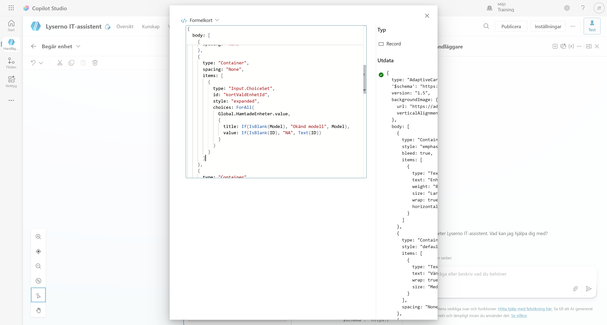

!!! info "Vad ändrade vi?"
    `ForAll(Global.HamtadeEnheter.value, ...)` går igenom alla rader som SharePoint hämtade i föregående kapitel. För varje rad skapas ett val där `Model` blir texten som användaren ser och `ID` blir värdet som sparas när användaren väljer enheten.

    `If(IsBlank(...))` ger reservvärden om en rad saknar modell eller ID. Kortet kan då fortfarande skapas utan att formeln bryts.

Stäng den expanderade formelredigeraren och kontrollera kortet i noden. Förhandsvisningen i ämnesredigeraren kan ibland visa själva uttrycket `Global.HamtadeEnheter.value.Model` i stället för enhetsnamnen. Det är testpanelen som visar hur den dynamiska listan ser ut när ämnet körs med riktiga SharePoint-data.

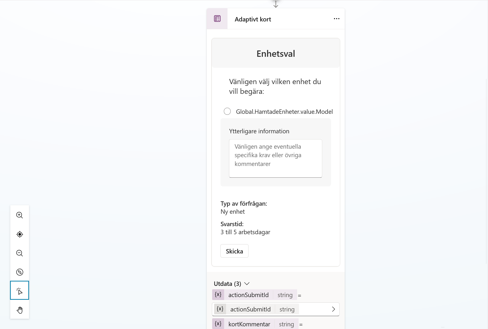

Klicka på **Spara** för att spara ämnet.

---

## Del 5: Koppla ämnet till agentens instruktioner

Gå tillbaka till fliken **Översikt** och klicka på **Redigera** vid agentens instruktioner. Lägg till följande punkt under **Arbetssätt**:

```text
- Om användaren svarar ja på frågan om att beställa en enhet, använd /Begär enhet. Om användaren inte vill gå vidare, avsluta vänligt.
```

Ämnet måste infogas som en riktig referens. När du kommer till ämnesnamnet skriver du `/` och väljer **Begär enhet** i listan med förslag.

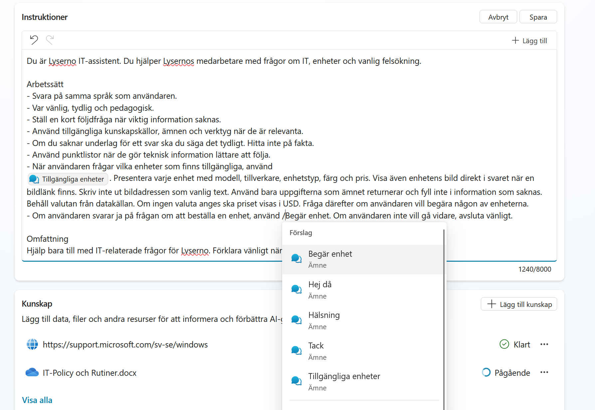

Kontrollera att ämnesnamnet visas som en markerad referens och klicka på **Spara**.

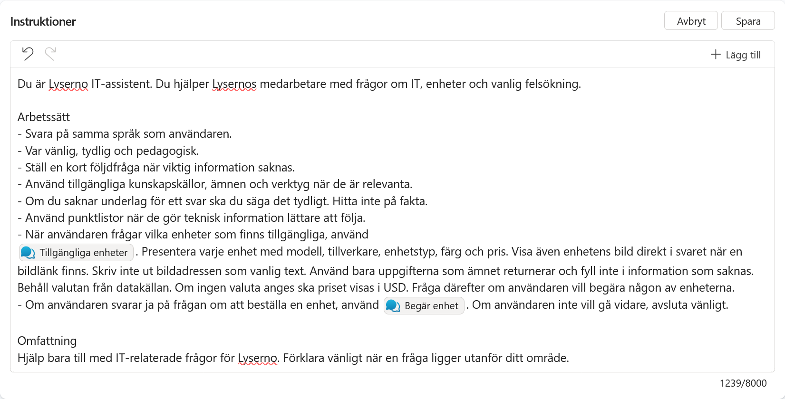

---

## Testa ämnet

Öppna testpanelen och starta en ny testsession. Be först agenten visa en tillgänglig enhetstyp, till exempel:

```text
Jag behöver en bärbar dator
```

När agenten frågar om du vill begära en av enheterna svarar du:

```text
Ja
```

Agenten ska då använda ämnet **Begär enhet** och visa det adaptiva kortet. Alternativen i kortet ska vara de enheter som hämtades från SharePoint i föregående ämne.

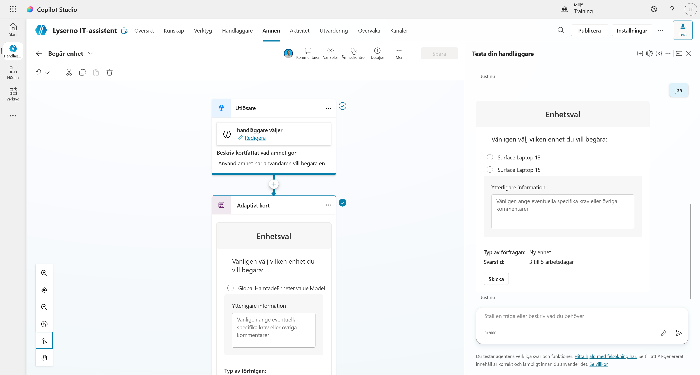

!!! success "Det adaptiva kortet är klart"
    Du har skapat ett ämne som visar ett dynamiskt kort med enhetsval och ett kommentarsfält. I nästa kapitel använder du kortets utdata för att skicka beställningen vidare.
