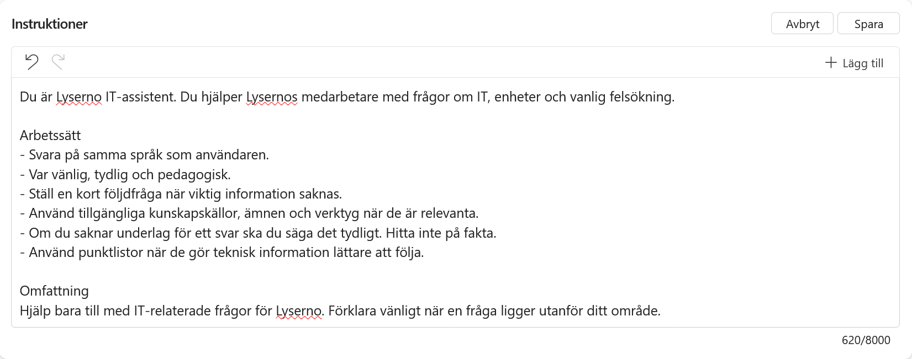

---
hide:
  - navigation
  - toc
---

  <section class="course-hero course-hero--standard">
    

      <a class="back-link" href="../../">← Alla utbildningar</a>
      
COPILOT STUDIO · GRUNDKURS

      <h1>Bygg en standardagent från grunden</h1>
      
En praktisk kurs där du bygger en komplett IT-supportagent – från SharePoint och kunskap till flöden, autonomi och samarbete mellan flera agenter.

      

        <a class="button button--teal" href="00-concepts/">Starta kursen</a>
        <a class="button button--ghost" href="#kurskapitel">Se alla kapitel</a>
      

      
11 kapitelGrundnivåBygg med själv

    

    

      

        
      

      
<strong>IT Support agent</strong>Kunskap · åtgärder · autonomi

    

  </section>

  <section class="scenario-band">
    

SCENARIOT
<h2>En agent som växer med uppgiften</h2>

    
Du börjar med en enkel agent för hårdvarufrågor. Kapitel för kapitel får den aktuell SharePoint-data, styrda dialoger, formulär och verktyg – tills den kan agera själv och delegera till en specialistagent.

  </section>

  <section class="chapter-section" id="kurskapitel">
    

      
KURSRESAN

      <h2>Bygg i tydliga steg</h2>
      
Varje kapitel introducerar en avgränsad förmåga och bygger vidare på samma lösning.

    

    

      <a href="00-concepts/">00
<h3>Begrepp och teori</h3>
LLM, tokens, kontext och RAG.

</a>
      <a href="01-prepare-sharepoint/">01
<h3>Förbered SharePoint</h3>
Skapa webbplatsen och lägg in testdata.

</a>
      <a href="02-tour-interface/">02
<h3>Hitta rätt</h3>
Lär känna Copilot Studios gränssnitt.

</a>
      <a href="03-create-solution/">03
<h3>Skapa en lösning</h3>
Samla kursens komponenter på rätt plats.

</a>
      <a href="04-create-agent/">04
<h3>Skapa agenten</h3>
Ge agenten identitet och instruktioner.

</a>
      <a href="05-add-knowledge/">05
<h3>Lägg till kunskap</h3>
Koppla in dokument och datakällor.

</a>
      <a href="06-create-topic/">06
<h3>Skapa ett ämne</h3>
Bygg en kontrollerad behovsanalys.

</a>
      <a href="07-adaptive-card/">07
<h3>Adaptivt kort</h3>
Samla in val och kommentarer i chatten.

</a>
      <a href="08-create-flow/">08
<h3>Agentflöde</h3>
Utför åtgärden och skicka bekräftelse.

</a>
      <a href="09-autonomy/">09
<h3>Autonomi</h3>
Låt agenten reagera på inkommande händelser.

</a>
      <a href="10-multi-agent/">10
<h3>Multi-agent</h3>
Delegera arbetet till en specialistagent.

</a>
    

  </section>

  <section class="course-cta course-cta--teal">
    

REDO ATT BÖRJA?
<h2>Ta agenten från idé till fungerande lösning.</h2>

    <a class="button button--light" href="00-concepts/">Starta med kapitel 0 →</a>
  </section>

