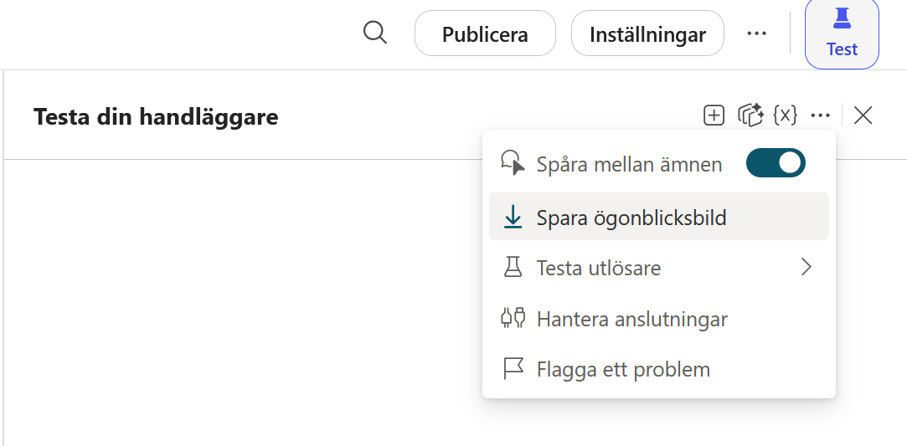
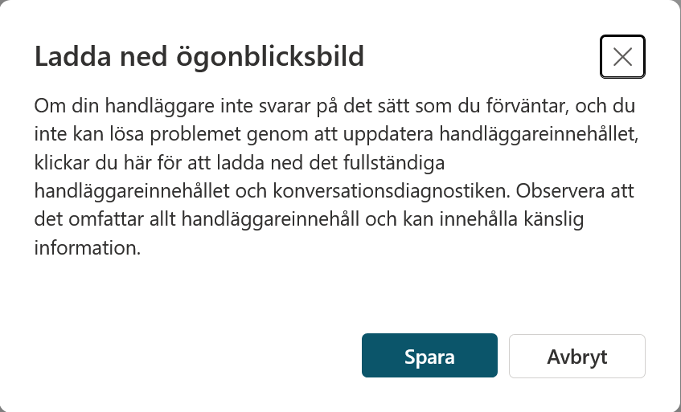
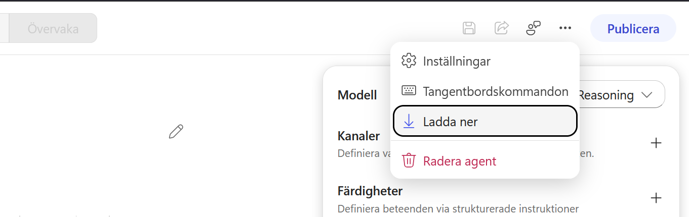
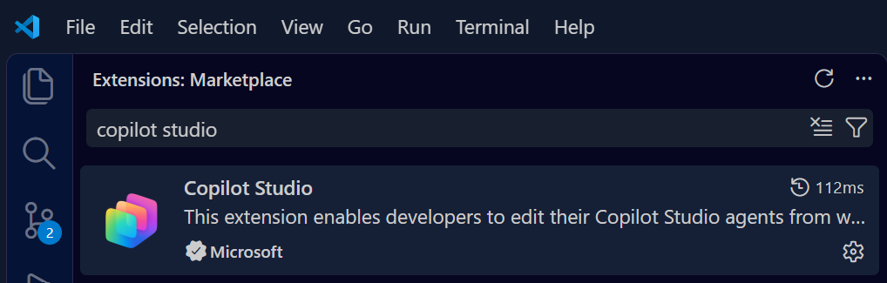
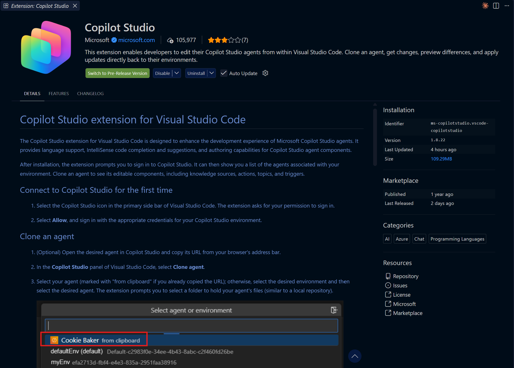
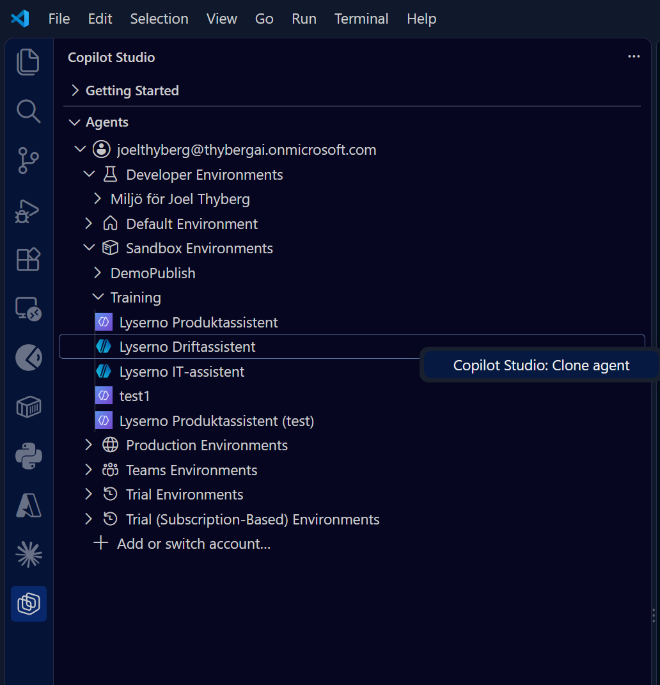
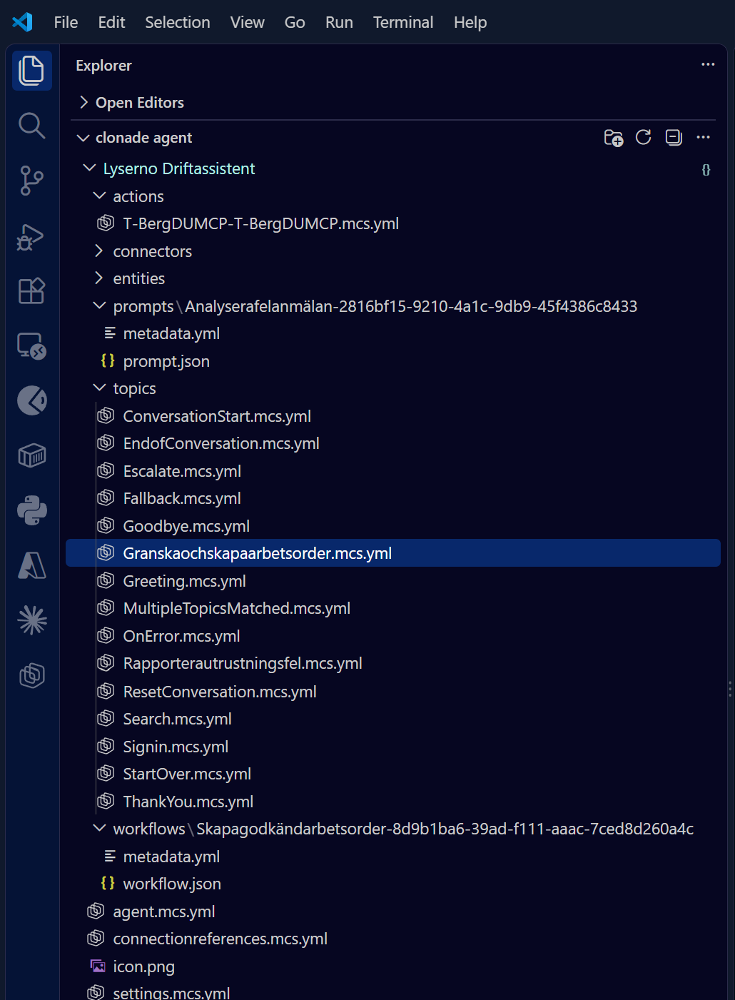
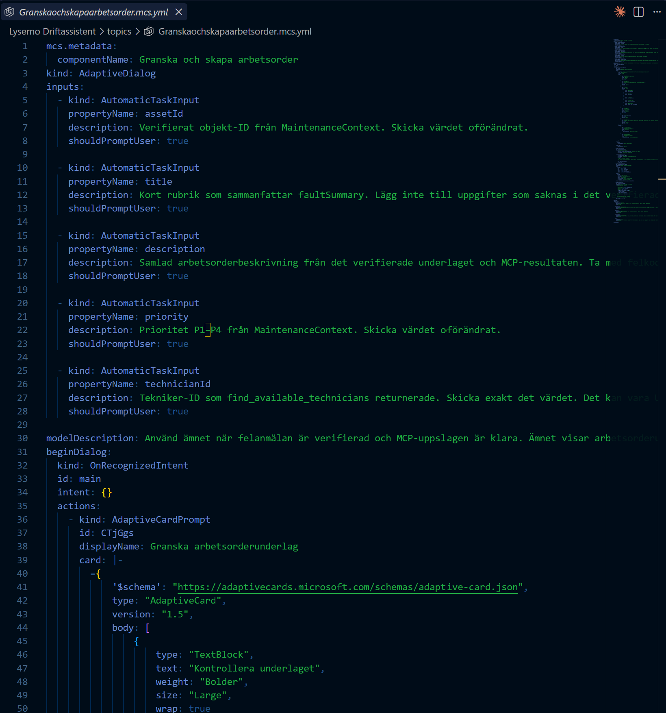

# Dokumentera en agent

När du ska lämna över en agent behöver kunden förstå vad den gör och hur delarna hänger ihop. Copilot Studio kan ge dig agentens definition som filer. Filerna är ett underlag för manualen, men de förklarar inte varför du gjorde olika val under bygget.

Här är två sätt att hämta underlaget. Menyerna skiljer sig mellan standardharnessen och GitHub Copilot-harnessen.

## Ladda ned agentens innehåll

### Standardharnessen: spara en ögonblicksbild

1. Öppna agenten i Copilot Studio och visa panelen **Testa din handläggare**.
2. Välj de tre punkterna i testpanelen och sedan **Spara ögonblicksbild**.

    

3. Läs informationen i dialogrutan och välj **Spara**.

    

Ögonblicksbilden hämtar agentinnehållet och diagnostik för den aktuella testkonversationen. I en uppackad ögonblicksbild finns agentdefinitionen som YAML, till exempel `botContent.yml`, och konversationens data i `dialog.json`. YAML-filen visar bland annat ämnen, villkor, instruktioner och referenser till verktyg. `dialog.json` beskriver testet du just körde, inte alla samtal med agenten.

### GitHub Copilot-harnessen: ladda ned agenten

Öppna agentens meny med de tre punkterna uppe till höger och välj **Ladda ner**.

Du får en YAML-fil med agentens definition. Där kan du läsa exempelvis instruktioner, kunskapskällor, färdigheter och verktygens beskrivningar. Den här nedladdningen är inte samma sak som standardagentens ögonblicksbild från testpanelen: någon fil med den aktuella testkonversationen ingår inte i det visade exemplet.

!!! note "Vad filerna inte berättar"
    En nedladdad definition visar agentens läge när du hämtade den. Den är ingen logg över hur agenten byggdes eller varför olika val gjordes. Ett verktyg kan också hänvisa till ett flöde, en anslutning eller en datakälla utan att hela den externa resursens innehåll följer med. Granska filerna innan du delar dem med en kund; ögonblicksbilden kan innehålla känslig information.

## Få agenten uppdelad i filer med VS Code

Microsofts Copilot Studio-tillägg för Visual Studio Code kan klona agenter med både **standardharnessen** och **GitHub Copilot-harnessen** till en lokal mapp. Komponenterna delas då upp i egna filer. Vilka mappar du får beror på hur agenten är byggd. Microsofts [guide om kloning](https://learn.microsoft.com/en-us/microsoft-copilot-studio/visual-studio-code-extension-clone-agent) är märkt för standardharnessen, men vi har också klonat kursens Lyserno Produktassistent med GitHub Copilot-harnessen på samma sätt.

1. Installera Visual Studio Code om du inte redan har det. Öppna **Extensions**, sök efter **Copilot Studio** och välj tillägget från **Microsoft**.

    

    

2. Öppna Copilot Studio-tillägget i sidopanelen och logga in med ett konto som har åtkomst till agenten. Välj rätt miljö i listan.
3. Högerklicka på agenten och välj **Clone agent**. Välj en mapp där de lokala filerna ska sparas. [Microsoft beskriver installation och inloggning här](https://learn.microsoft.com/en-us/microsoft-copilot-studio/visual-studio-code-extension-install-configure).

    

Den klonade agenten visas som en mappstruktur. För standardagenten i bilden nedan finns bland annat `topics` för ämnen, `actions` för verktyg, `prompts` för promptar och `workflows` för flöden.

Öppna en fil för att se hur komponenten är definierad. Här visas ett ämne med indata och åtgärder i YAML.

En agent med GitHub Copilot-harnessen får en annan struktur. I den klonade Lyserno Produktassistent finns bland annat `behaviors` för färdigheter, `capabilities/knowledge` för kunskap, `capabilities/tools` för verktyg, `variables` för variabler och `workflows` för flöden. Agentens instruktioner ligger i `settings.mcs.yml`.

Du kan också redigera dessa filer. Kommandot **Apply** skickar då dina lokala ändringar till agenten i Copilot Studio. Det publicerar inte agenten. För att flytta agenten med dess beroenden till en kundmiljö rekommenderar Microsoft i stället att du [exporterar och importerar en lösning](https://learn.microsoft.com/en-us/microsoft-copilot-studio/authoring-solutions-import-export). VS Code-kopian är särskilt användbar när du vill läsa varje del, jämföra versioner och skriva en teknisk beskrivning. [Läs om Preview, Get och Apply](https://learn.microsoft.com/en-us/microsoft-copilot-studio/visual-studio-code-extension-synchronization).

## Skriv manualen utifrån filerna

Beskriv agentens uppgift, instruktioner, kunskapskällor, ämnen och verktyg med vanliga ord. För varje verktyg behöver kunden veta när det används, vilken information det läser eller ändrar och vilka anslutningar det kräver. Dokumentera också vad som ska ställas in i kundens miljö och vilka testfall som visar att agenten fungerar där. Filerna ger dig de tekniska detaljerna; motiven bakom dina val behöver du skriva själv.
