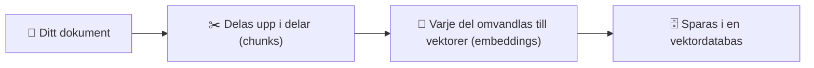
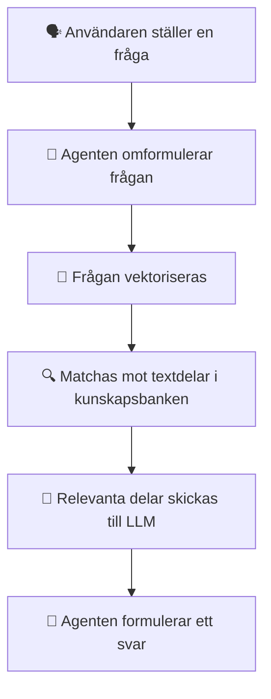
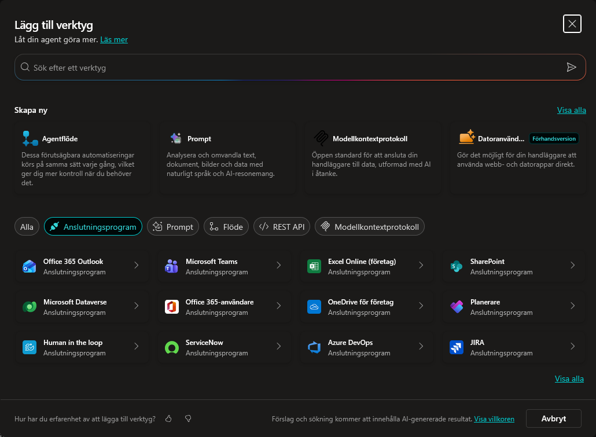
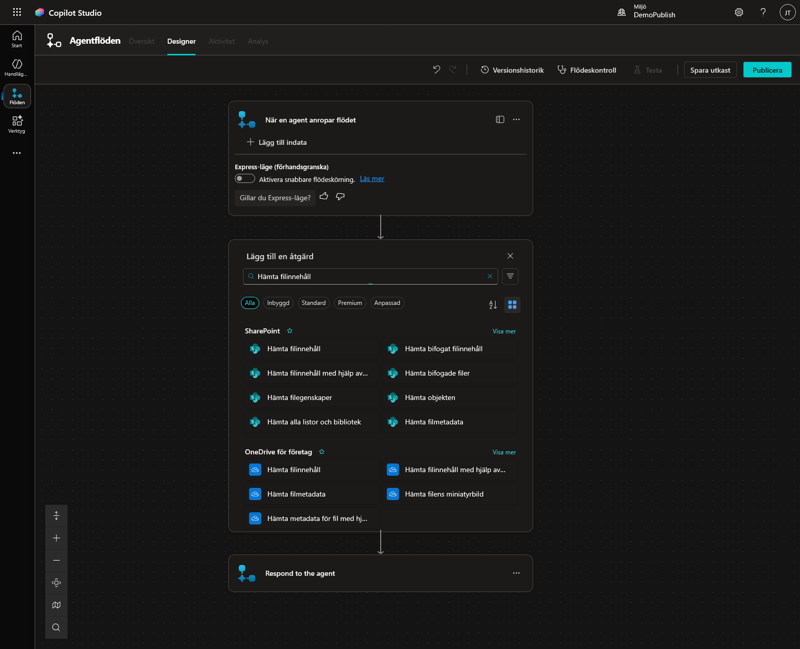
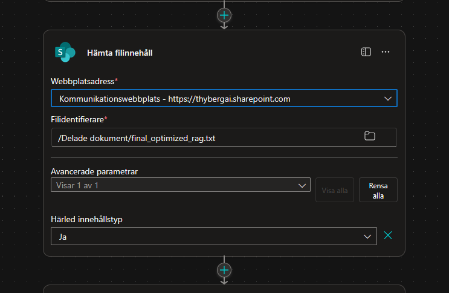
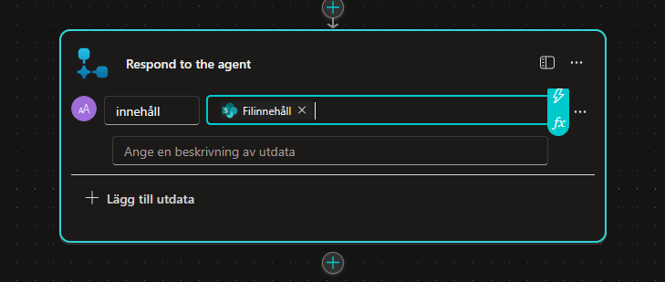
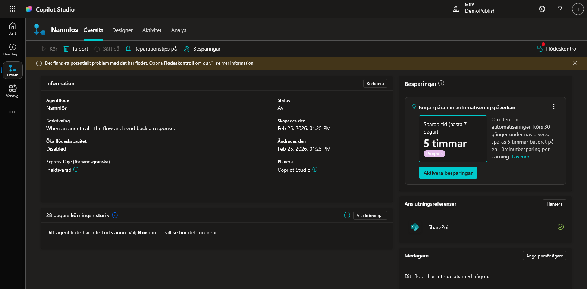

# Kunskap i Copilot Studio – på djupet

I kursen lärde vi oss lägga till kunskap via dokument och webbsidor. Men hur fungerar det egentligen bakom kulisserna? Och vad gör man när den vanliga kunskapssökningen inte räcker?


---

## Steg 1: Vad händer när du laddar upp ett dokument?

Innan vi pratar om hur sökningen fungerar måste vi förstå vad som händer redan **när du lägger till ett dokument** som kunskap.

När du laddar upp en fil (Word, PDF, etc.), startar en process som kallas **indexering**:



1.  **Dokumentet delas upp** i mindre textdelar (*chunks*). Tänk dig att en 10-sidig PDF klipps i ~20-30 bitar. Ofta överlappar dessa delar varandra något, det kallas *overlapping*, för att viktig information som råkar hamna precis vid en klippgräns inte ska gå förlorad.

2.  **Varje del omvandlas till en vektor** av en speciell typ av AI-modell som kallas *embedding-modell*. Denna modells enda uppgift är att analysera textstycken och representera deras *betydelse* som en matematisk vektor i ett rum med hundratals eller tusentals dimensioner.

    En vektor kan se ut ungefär så här:
    ```
    [0.23, -0.87, 0.45, 0.12, ..., -0.33, 0.91, 0.05]
    ```
    Denna kan ha **över 1 000 dimensioner** – långt bortom vad vi kan visualisera. Det smarta är att ord som "laptop" och "bärbar dator" hamnar **nära varandra** i detta vektorrum, trots att de är helt olika rent teckenmässigt. Det är för att deras *innebörd och betydelse* är likartad – och det är just betydelsen som modellen fångar.

3.  **Vektorerna sparas** i en vektordatabas som agenten sedan kan söka i.

Det är dessa sparade vektorer som användarens frågor sedan matchas mot.

!!! warning "Dokument uppdateras inte automatiskt"
    Om du ändrar innehållet i ett dokument som redan är uppladdat **uppdateras inte kunskapsbanken automatiskt**. Du måste:
    
    1. **Ta bort** det gamla dokumentet från kunskapskällorna.
    2. **Ladda upp** den nya versionen igen.
    
    Annars kommer agenten fortsätta svara baserat på den gamla versionen av filen.

---

## Steg 2: Hur RAG fungerar (sökningen)

När du lägger till ett dokument som kunskap i Copilot Studio använder Microsoft en teknik som heter **RAG** – *Retrieval-Augmented Generation*.

I korthet fungerar det så här:



1.  **Användaren ställer en fråga** i chatten (eller via en trigger).
2.  **Agenten omformulerar frågan** utifrån vad den uppfattade att användaren menade.
3.  **Frågan vektoriseras** – omvandlas till en matematisk representation.
4.  **Matchning mot kunskapsbanken** – de semantiskt närmaste delarna (*chunks*) av dina dokument hittas.
5.  **Relevanta delar skickas till LLM** som bygger ett svar baserat på den hämtade texten.

!!! info "Vill du förstå RAG på djupet?"
    Kolla in denna förklaringsvideo: [RAG Explained (YouTube)](https://youtu.be/ee4X-JCDL8o?si=DUVdMrAOikwUQwHQ)

---

## Begränsningar i Copilot Studio

Microsoft specificerar inte exakt hur deras RAG-implementation fungerar gällande:

- **Chunking** – hur dokumenten delas upp i delar
- **Overlapping** – om delarna överlappar varandra
- **Antal chunks** – hur många delar som hämtas per fråga

Det går inte heller att konfigurera dessa parametrar. Vad man *kan* se baserat på Microsofts dokumentation är att det oftast returneras **ungefär tre chunks** per dokumentfråga.

---

## När fungerar kunskapssökning bra?

Kunskapssökning (RAG) är bäst på att **hitta nålar i en höstack** – att svara på konkreta, specifika frågor.

**Fungerar bra:** ✅

- *"Vilka tider har supporten öppet?"*
- *"Vad kostar Surface Laptop 13?"*
- *"Vad händer om jag tappar min jobbtelefon?"*

**Fungerar sämre:** ⚠️

- *"Sammanfatta hela dokumentet"*
- *"Jämför alla produkter och ge mig den bästa"*
- Frågor som kräver att agenten ser **hela** dokumentet på en gång

!!! tip "Samband och jämförelser"
    RAG kan ibland hitta samband mellan olika delar av ett dokument – men det är **mycket beroende av datan** och hur den är strukturerad. Ju tydligare och mer avgränsar dina dokument är, desto bättre fungerar sökningen.

---

## Flera iterationer med resonerande modeller

Normalt kör agenten bara **en iteration** av kunskapssökningen. Den ställer sin fråga, får tillbaka chunks, och formulerar ett svar.

Men om du använder en **resonerande modell** (reasoning model) kan agenten göra **flera frågor** mot kunskapsbasen om den inte känner att den fick tillräckligt med information vid första försöket.

!!! tip "Styr via instruktioner"
    Du kan påverka detta beteende genom agentens **beskrivning och instruktioner**. Till exempel kan du instruera agenten att "söka i kunskapen flera gånger om svaret är otydligt" för att öka chansen att hitta rätt information.

---

## Alternativ: Hämta hela dokumentet via ett verktyg

Ibland räcker det inte med RAG. Om agenten behöver se **hela dokumentets innehåll** – t.ex. för att sammanfatta, jämföra produkter, eller svara på breda frågor – kan du skapa ett **verktyg** som hämtar hela filen.

!!! warning "Viktigt: Bara textfiler fungerar direkt"
    Denna metod fungerar bra för **.txt**-filer eftersom den underliggande datan är ostrukturerad text. Men kör du samma teknik på en **.docx**-fil får du bara obegriplig binär ZIP-data, och för en **.pdf** får du PDF-källkod blandat med komprimerade dataströmmar.
    
    Detta beror på att Word-filer egentligen är ZIP-komprimerade samlingar av XML-filer, och PDF är ett kompilerat binärformat. Ingen av dem returnerar ren läsbar text direkt.
    
    **Vill du använda Word eller PDF?** Se avsnittet [Dynamisk hämtning av flera dokument](#dynamisk-hamtning-av-flera-dokument) längre ner.

### Steg-för-steg: Skapa ett Agentflöde för heldokumenthämtning

#### 1. Skapa flödet

1.  Navigera till **Agentflöden** och skapa ett **nytt agentflöde**.
    *(Du kan göra detta via Ämnen → + → Lägg till ett verktyg → Nytt agentflöde, precis som i kapitel 8).*

    

2.  Du ser två noder:
    - **När en agent anropar flödet** (Indata)
    - **Respond to the agent** (Utdata)

    

3.  **Viktigt:** Lägg **inte** till några indataparametrar. Flödet ska alltid hämta samma fil – ingen input behövs.

#### 2. Lägg till "Hämta filinnehåll"

1.  Klicka på **plus-tecknet (+)** mellan de två noderna.

    

2.  Sök efter **Hämta filinnehåll** – välj SharePoint- eller OneDrive-varianten beroende på var din fil ligger.

    

3.  Konfigurera noden:
    - **Webbplatsadress:** Välj din SharePoint-sida.

    

    - **Fil:** Navigera till den specifika filen du vill hämta.

    

#### 3. Konfigurera utdata

1.  Klicka på noden **Respond to the agent**.

    

2.  Klicka **+ Lägg till utdata** → **Text**.

    

3.  Döp utdatan till ett passande namn, t.ex. `ProduktData`.
4.  Klicka på **fx**-symbolen (Infoga uttryck).

    

5.  Skriv in följande uttryck:

    ```powerfx
    body('Hämta_filinnehåll')
    ```

    *Detta hämtar själva textinnehållet från filen – det som agenten sedan kan läsa och analysera.*

6.  Klicka **Lägg till**.

    

#### 4. Spara och publicera

1.  Klicka **Spara utkast**.

    

2.  Klicka på **Översikt** (till vänster om flödesnamnet).

    

3.  Klicka **Redigera** under *Detaljer*.
4.  Ge flödet ett passande namn, t.ex.:

    ```text
    Produktinformation
    ```

5.  Skriv en beskrivning, t.ex.:

    ```text
    Detta flöde används för att hämta och ge tillbaka all text som finns gällande företagets produktinformation.
    ```

6.  Klicka **Spara**.

    

7.  Gå tillbaka till **Designer** och klicka på **Publicera**.
8.  Om allt fungerar får du en grön bekräftelseruta.

    

#### 5. Lägg till som verktyg i agenten

1.  Navigera till din agent.
2.  Klicka på **Lägg till ett verktyg** → **Flöden**.

    

3.  Välj ditt nyligen skapade flöde (**Produktinformation**).

    

4.  Klicka **Lägg till och konfigurera**.
5.  Kontrollera att **namn** och **beskrivning** stämmer:
    - **Namn:** `Produktinformation` (bör redan vara ifyllt)
    - **Beskrivning:**
      ```text
      Detta verktyg genererar hela texten för företagets produktinformationsdokument.
      ```

    

6.  **Spara** verktygskonfigurationen.

#### 6. Uppdatera agentens instruktioner

1.  Gå till **Översikt**.
2.  Klicka **Redigera** vid Instruktioner.
3.  Lägg till:

    ```text
    - Använd verktyget /Produktinformation för att se all information om företagets produkter.
    ```

    *(Kom ihåg att välja verktyget från popupmenyn så att det blir en aktiv länk.)*

    

4.  Klicka **Spara**.

    

---

## Jämförelse: RAG vs Heldokumentverktyg

| | RAG (Kunskap) | Heldokument (Verktyg) |
|---|---|---|
| **Bäst för** | Specifika frågor | Breda frågor, sammanfattningar |
| **Dokumentstorlek** | Stora dokument fungerar bra | Begränsas av kontextfönstret |
| **Konfiguration** | Ingen – automatisk | Kräver agentflöde |
| **Kostnad** | Låg (liten mängd text) | Högre (hela dokumentet skickas) |
| **Flera dokument** | Söker i alla samtidigt | Ett flöde per fil (statisk) |

---

## Dynamisk hämtning av flera dokument

Metoden ovan fungerar utmärkt för **en specifik fil**. Men vad händer om du vill att agenten ska kunna välja *vilken* fil den hämtar?

Detta kräver lite mer konfiguration – du behöver:

1.  Lägga till en **indataparameter** i flödet (t.ex. filnamn eller fil-ID).
2.  Använda dynamiskt innehåll i *Hämta filinnehåll*-noden istället för en fast fil.
3.  Låta agenten först identifiera vilka filer som finns tillgängliga med hjälp av en nod som **Lista Rotmappen** som visar innehållet i en SharePoint-mapp.

!!! warning "Begränsning: Filformat"
    Denna teknik fungerar direkt för **text-baserade filer** (.txt, .md). 
    
    För **Word-dokument** (.docx) och **PDF-filer** krävs preprocessing innan texten kan läsas – eftersom dessa format inte är ren text utan komprimerade binärformat (se varningen ovan). Alternativ:
    
    - **Manuell konvertering:** Spara ditt Word-dokument som .txt-fil innan du laddar upp det.
    - **Verktyg:** Använd externa verktyg eller skript för att konvertera PDF → text.
    - **Azure AI Document Intelligence:** För mer avancerade flöden kan du använda Azure-tjänster som automatiskt extraherar text ur Word och PDF. *Mer om detta kommer i framtida artiklar.*

!!! warning "Bilder och inskannade dokument"
    Det är viktigt att veta att varken RAG-kunskapen eller heldokumentverktyget kan **"se" bilder** i dina dokument. Om ditt dokument innehåller diagram, tabeller som bilder, eller är ett **inskannat dokument** (t.ex. en scannad PDF) kommer agenten inte att kunna läsa det innehållet.
    
    För inskannade dokument krävs **OCR** (Optical Character Recognition) som ett förbearbetningssteg – t.ex. via Azure AI Document Intelligence – innan texten kan användas som kunskap.

---

!!! tip "Tumregel"
    - **Få, specifika frågor** → RAG (Kunskap) räcker
    - **Behöver se helheten** → Skapa ett verktyg
    - **Blandat** → Använd båda! RAG för snabba svar, verktyg för djupgående analys
    - **Word/PDF** → RAG fungerar (ladda upp), heldokumentverktyg kräver konvertering
    - **Bilder/skannat** → Kräver preprocessing (OCR)
